<?xml version="1.0" encoding="UTF-8" standalone="no"?>

<html xmlns="http://www.w3.org/1999/xhtml"><head><meta name="generator" content="DocBook XSL Stylesheets V1.76.1"/></head><body>

<h1 class="title"><a id="id721218"/>Döntési fák megalkotása tanulással</h1>

A döntési fa tanulás egyike a legegyszerűbb, mégis az eddigiekben az egyik legsikeresebbnek bizonyult tanulási algoritmusnak. Jó bevezetésként szolgál az induktív tanulás területén, és ráadásul könnyen implementálható. Először bemutatjuk a cselekvő alrendszert, majd megmutatjuk, hogy miképpen lehet tanítani. Mindeközben olyan elveket mutatunk be, amelyek az induktív tanulás minden területére jellemzők.

<h2 class="title"><a id="id721224"/>Cselekvő komponensként használt döntési fák</h2>

Egy <strong>döntési fa</strong> (<strong>decision tree</strong>) bemenetként egy <strong>attribútum</strong>okkal (<strong>attribute</strong>s) leírt objektumot vagy szituációt kap, és egy „döntést” ad vissza eredményként – a bemenetre adott válasz jósolt értékét. A bemeneti attribútumok lehetnek diszkrétek vagy folytonosak. Jelen tárgyalásban diszkrét bemeneteket tételezünk fel. A kimeneti érték szintén lehet diszkrét vagy folytonos; egy diszkrét értékkészletű függvény tanulását <strong>osztályozás</strong> (<strong>classification</strong>) tanulásnak, míg a folytonos függvény tanulását <strong>regresszió</strong>nak (<strong>regression</strong>) nevezzük.<em> Bináris (Boolean)</em> osztályozásra fogunk koncentrálni, ahol minden példát vagy <strong>igaznak </strong>(<strong>pozitív</strong>), vagy <strong>hamisnak</strong> (<strong>negatív</strong>) sorolunk be.

A döntési fa egy tesztsorozat elvégzése során jut el a döntéshez. A fa minden egyes belső csomópontja valamely tulajdonság értékére vonatkozó tesztnek felel meg, a csomópontból kilépő ágakat pedig a teszt lehetséges kimeneteivel címkézzük. Minden egyes levélcsomópont megadja azt az értéket, amelyet vissza kell adnunk, ha ezt a levelet elértük. Úgy tűnik, hogy a döntési fa reprezentáció az emberek számára rendkívül természetes; valójában számos „Hogyan csináljuk?” kézikönyvet (például az autójavítási kézikönyveket) írtak meg egyetlen hatalmas, több száz oldalra kiterjedő döntési faként.

Valamelyest egyszerűbb példa lehet az a probléma, hogy várjunk-e egy étteremben egy asztal felszabadulására. Az a célunk, hogy tanulással kialakítsuk a <em>VárjunkE</em> <strong>célpredikátum</strong> (<strong>goal predicate</strong>) definícióját. Ahhoz, hogy ezt tanulási feladatként kezelhessük, először meg kell határozzuk, hogy milyen attribútumok állnak rendelkezésre ahhoz, hogy ezen a problématerületen leírjuk a példákat. A 19. fejezetben megmutatjuk, hogyan lehet automatizálni ezt a feladatot; most egyszerűen tegyük fel, hogy a következő attribútumlista mellett döntöttünk:

<ol class="orderedlist"><li class="listitem">
<em>Alternatíva</em>: van-e a közelben megfelelő alternatívaként kínálkozó étterem.
</li><li class="listitem">
<em>Bár</em>: van-e az étteremnek kényelmes bár része, ahol várakozhatunk.
</li><li class="listitem">
<em>Péntek/Szombat</em>: igaz értéket vesz fel pénteken és szombaton.
</li><li class="listitem">
<em>Éhes</em>: éhesek vagyunk-e.
</li><li class="listitem">
<em>Vendégek</em>: hány ember van az étteremben (értékkészlet <em>Senki</em>, <em>Néhány</em> és <em>Tele</em>).
</li><li class="listitem">
<em>Drága</em>: az étterem menyire drága ($, $$, $$$).
</li><li class="listitem">
<em>Eső</em>: esik-e odakint az eső.
</li><li class="listitem">
<em>Foglalás</em>: foglaltunk-e asztalt.
</li><li class="listitem">
<em>Konyha</em>: az étterem típusa (francia, olasz, thai vagy burger).
</li><li class="listitem">
<em>BecsültVárakozás</em>: a pincér becsülte várakozási idő (0–10, 10–30, 30–60, &gt;60 perc)
</li></ol>

<a id="id721384"/>
<strong>18.2. ábra - Egy döntési fa annak eldöntésére, hogy várjunk-e asztalra</strong>

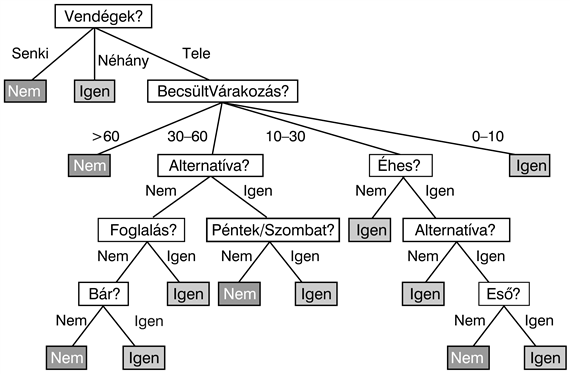

A szerzők egyike (SR) által erre a problémára rendszerint használt döntési fa a 18.2. ábrán látható. Vegyük észre, hogy a fa nem használja a <em>Drága</em> és a <em>Konyha</em> attribútumokat, valójában irrelevánsnak tekinti azokat. A példákat a döntési fa a gyökérnél kezdi feldolgozni, követi a megfelelő ágakat, amíg egy levélhez el nem ér. Például egy <em>Vendégek</em> = <em>Tele</em> és <em>BecsültVárakozás </em>= 0–10 attribútumokkal jellemezhető példa pozitív kimenetet fog eredményezni (azaz várni fogunk egy asztalra).

<h2 class="title"><a id="id721414"/>A döntési fák kifejezőképessége</h2>

Logikai felírást használva minden egyes döntési fa, amely a <em>VárjunkE</em> célpredikátum egy hipotézise, a következő formában felírt állításnak felel meg:

<code class="code">∀<em>s</em>  <em>VárjunkE</em>(<em>s</em>) ⇔<em> </em>(<em>P</em>1(<em>s</em>) ∨ <em>P</em>2(<em>s</em>) ∨ … ∨ <em>Pn</em>(<em>s</em>))</code>

ahol mindegyik <em>Pi</em>(<em>s</em>) feltétel azon tesztek konjunkciójának felel meg, amelyeket a gyökértől egy pozitív kimenetet jelentő levélig megtett út során végeztünk. Bár ez egy elsőrendű logikában felírt mondatnak tűnik, valójában bizonyos értelemben ítéletlogikai kifejezés, mivel csak egyetlen változót tartalmaz és az összes predikátum unáris. Valójában a döntési fa a <em>VárjunkE</em> és az attribútumértékek bizonyos logikai kapcsolatát írja le. A döntési fa nem használható olyan tesztek reprezentálására, amelyek kettő vagy több különböző objektumra vonatkoznak – például:

<code class="code">∃<em>r</em>2  <em>Közel</em>(<em>r</em>2,<em> r</em>) ∧ <em>Drága</em>(<em>r</em>,<em> p</em>) ∧ <em>Drága</em>(<em>r</em>2,<em> p</em>2) ∧ <em>Olcsóbb</em>(<em>p</em>2,<em> p</em>)</code>

(van a közelben egy olcsóbb étterem?). Nyilvánvalóan felvehetnénk egy <em>OlcsóbbÉtteremKözel</em> nevű logikai attribútumot, de az <em>összes</em> ilyen attribútum hozzáadása kezelhetetlenné teszi a problémát. A 19. fejezet mélyebbre hatol az elsőrendű logikában történő tanulás területén.

Az ítéletlogikai nyelvek területén a döntési fák teljes kifejezőképességgel bírnak, ami azt jelenti, hogy tetszőleges logikai (Boole) függvény felírható döntési faként. Ezt triviálisan megvalósíthatjuk, ha a függvény igazságtáblájának minden sorát megfeleltetjük a döntési fa egy útjának. Ez exponenciálisan növekvő döntési fára vezet, mivel az igazságtábla exponenciálisan növekvő számú sort tartalmaz. Nyilvánvalóan a döntési fák sok függvényt jóval kisebb fával képesek reprezentálni.

Ugyanakkor némely függvényfajtánál ez valóban problémát jelent. Például ha a függvényünk a <strong>paritásfüggvény</strong> (<strong>parity function</strong>), amely akkor és csak akkor ad 1-et, ha páros számú bemenet 1 értékű, akkor egy exponenciálisan nagy döntési fára lesz szükség. Hasonlóan nehéz a <strong>többségfüggvény</strong> (<strong>majority function</strong>) reprezentálása döntési fával, amely függvény akkor ad 1-et, ha bemeneteinek több mint fele 1 értékű.

Más szavakkal, a döntési fák bizonyos függvények esetén jók, mások esetén roszszak. Van <em>bármilyen</em> olyan reprezentáció, amely <em>minden</em>fajta függvény esetén hatékony? A válasz sajnos az, hogy nincs. Ezt általánosan is meg tudjuk mutatni. Vizsgáljuk az összes <em>n</em> bemeneti attribútummal rendelkező logikai (Boole) függvényt. Hány különböző függvény van ebben a halmazban? Ez éppen a lehetséges felírható igazságtáblák számával egyezik meg, hiszen egy függvényt az igazságtáblája ad meg. Az igazságtáblának 2n sora van, mivel minden bemeneti esetet <em>n</em> attribútummal adunk meg. Úgy tekinthetjük a tábla „válasz” oszlopát, mint egy 2n bites számot, amely definiálja a függvényt. Mindegy, hogy a függvények milyen reprezentációját választjuk, néhánynak (valójában szinte mindegyiknek) a reprezentálásához tényleg szükség lesz ennyi bitre.

Ha 2n bitre van szükség a függvény megadásához, akkor <em>n</em> attribútum esetén 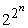 a lehetséges függvények száma. Ez megrázóan nagy szám. Például csupán hat Boole-változó esetén is 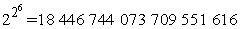 különböző logikai (Boole) függvény állítható elő. Szükségünk lesz néhány szellemes algoritmusra, hogy egy ilyen hatalmas térben konzisztens hipotézist tudjunk találni.

<h2 class="title"><a id="id721633"/>A döntési fák példák alapján történő felépítése</h2>

Egy logikai döntési fa által kezelhető példa a bemeneti attribútumok<em> X</em> vektorából és egyetlen logikai kimeneti értékből, <em>y</em>-ból áll. A 18.3. ábra egy (<em>X</em>1, <em>y</em>1)...(<em> X</em>12, <em>y</em>12) példahalmazt mutat. Azokat nevezzük pozitív példáknak (<em>X</em>1, <em>X</em>3, ...), amelyekben a <em>VárjunkE</em> értéke igaz, és azok a negatív példák, amelyekben az értéke hamis (<em>X</em>2, <em>X</em>5, …). A példák teljes halmazát <strong>tanító halmaz</strong>nak (<strong>training set</strong>) nevezzük.

Az a probléma, hogy a tanító halmaznak megfelelő döntési fát találjunk, bonyolultnak tűnik ugyan, de valójában van egy triviális megoldása. Egyszerűen egy olyan fát konstruálhatunk, amelyben minden példához egy külön saját utat hozunk létre egy – a példához tartozó – levélcsomóponthoz. A levélhez vezető út mentén sorra teszteljük az attribútumokat, és a példához tartozó tesztértéket követjük, a levél pedig a példa besorolását adja. Ha ismét ugyanazt a példát[<a id="id721711" href="#ftn.id721711" class="footnote">183</a>] vesszük, akkor a döntési fa a helyes osztályozási eredményt adja. Szerencsétlen módon nemigen ad információt egyetlen más esetről sem!

<a id="id721721"/>
<strong>18.3. ábra - Példák az étterem problématerületre</strong>

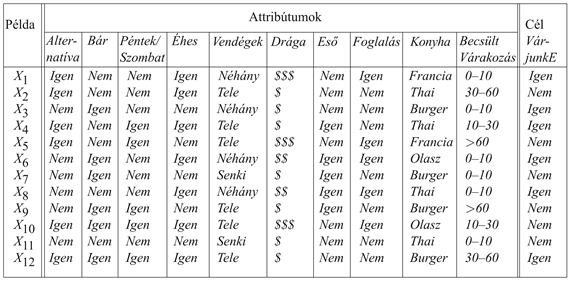

Ezzel a triviális megoldással az a baj, hogy egyszerűen memorizálja a példákat. Mivel nem nyer ki semmilyen mintázatot a példákból, ezért nem várhatjuk, hogy extrapolálni tudjon azokra a mintákra, amelyeket még sohasem látott. Az Ockham borotvája elvét alkalmazva nekünk azt a <em>legkisebb</em> döntési fát kell megtalálnunk, amely konzisztens a példákkal. Sajnálatos módon a „legkisebb” összes értelmes definíciója esetén a legkisebb döntési fa megtalálása kezelhetetlen problémát jelent. Viszont némi egyszerű heurisztika bevetésével jó eredményt érhetünk el egy „kicsike” fa megtalálásában. A <code class="code">DÖNTÉSI-FA-TANULÁS</code> algoritmus alapötlete az, hogy teszteljük először a legfontosabb attribútumot. A „legfontosabb” alatt azt az attribútumot értjük, amelyik a legnagyobb változást okozza a példák besorolásában. Ezen a módon – reményünk szerint – kisszámú teszttel helyes osztályozáshoz jutunk, ami azt jelenti, hogy a fában minden út rövid lesz, tehát az egész fa kicsi lesz.

A 18.4. ábrán látható, hogy hogyan indul az algoritmus. 12 példánk van, amelyeket pozitív és negatív példahalmazokba sorolunk. Ezek után eldöntjük, hogy melyik attribútumot teszteljük először a fában. A 18.4. (a) ábrán megmutattuk, hogy a <em>Konyha</em> attribútum rossz választás lenne, mert tesztjének 4 kimenetele van, és mindegyik esetén ugyannyi pozitív és negatív példánk lesz az eredményül kapott halmazokban. Másrészt viszont a 18.4. (b) ábrán látható, hogy a <em>Vendégek</em> egy meglehetősen fontos attribútum, hiszen ha értéke <em>Senki</em> vagy <em>Néhány</em>, akkor határozott választ tudunk adni (az első esetben <em>Nem</em>, a másodikban<em> Igen</em> a válaszunk). Ha az attribútum értéke <em>Tele</em>, akkor a példák vegyes halmazát kapjuk. Általánosságban megállapítható, hogy miután az első attribútum tesztje csoportokra bontotta a példákat, mindegyik teszteredmény egy újabb döntési fa tanulási problémát eredményez, kevesebb példával és egygyel kevesebb attribútummal. Négy esetet kell áttekintenünk ezekben a rekurzív problémákban:

<ol class="orderedlist"><li class="listitem">
Ha van néhány pozitív és néhány negatív példánk, akkor válasszuk a legjobb attribútumot a szétosztásukra. A 18.4. (b) ábrán bemutattuk, hogy az <em>Éhes</em> attribútum alkalmas a megmaradó példák osztályozására.
</li><li class="listitem">
Ha valamennyi megmaradt példánk pozitív (vagy mind negatív), akkor készen vagyunk: válaszolhatunk <em>Igen</em>-t vagy <em>Nem</em>-et. A 18.4. (b) ábra bemutatja ezt a <em>Senki</em>, illetve a <em>Néhány</em> esetekben.
</li><li class="listitem">
Ha nem marad példa a teszt egyik kimenetele esetén, akkor ez azt jelenti, hogy nem figyeltünk meg ilyen esetet, és a szülőcsomópontban többségben levő választ adjuk.
</li><li class="listitem">
Ha nem maradt attribútumunk, amelyet tesztelhetnénk, de mind pozitív, mind negatív példáink maradtak, akkor bajban vagyunk. Ez azt jelenti, hogy ezeknek a példáknak pontosan azonos jellemzőik vannak, de különböző osztályokba tartoznak. Ez egyrészt akkor fordulhat elő, ha néhány adat nem megfelelő, azt mondjuk, hogy <strong>zajos</strong>ak (<strong>noise</strong>) az adatok. Másrészt akkor is előállhat ez a helyzet, ha az attribútumok nem adnak elég információt a szituáció teljes leírására, vagy a problématér valójában nemdeterminisztikus. Egyszerű megoldása lehet ennek a problémának a többségi szavazás használata.
</li></ol>

<a id="id721816"/>
<strong>18.4. ábra - A példahalmaz attribútumteszteléssel történő szétosztása. (a) A <em>Konyha</em> alapján történő szétosztás nem visz közelebb ahhoz, hogy a pozitív és negatív példákat megkülönböztessük. (b) A <em>Vendégek</em> attribútum tesztje jól szeparálja a pozitív és negatív példákat. Miután a <em>Vendégek</em> tesztjét elvégeztük, az <em>Éhes</em> egy eléggé jó második tesztlehetőséget ad.</strong>

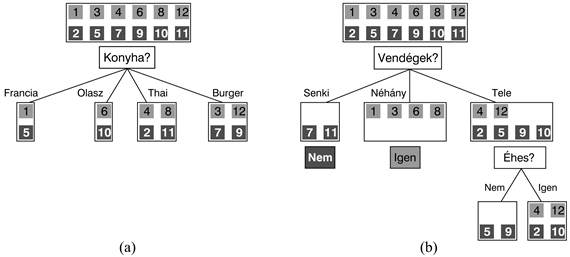

A <code class="code">DÖNTÉSI-FA-TANULÁS</code> algoritmust a 18.5. ábrán mutatjuk be. Az <code class="code">ATTRIBÚTUM-VÁLASZTÁS</code> módszer bemutatása a következő alfejezetben található.

Az algoritmus által a 12 mintából álló adathalmaz alapján létrehozott fa a 18.6. ábrán látható. Az eredményként kapott fa nyilvánvalóan különbözik a 18.2. ábrán látható eredetitől, annak ellenére, hogy az adatokat egy, az eredeti fát használó ágens generálta. Arra gondolhatnánk, hogy az algoritmus nem ért el különösebben jó eredményt a helyes függvény megtanulásában. Mindamellett ez téves következtetés lenne. A tanuló algoritmus a <em>példákat</em> látja, nem az eredeti függvényt. Valójában a létrehozott hipotézis (lásd 18.6. ábra) nem csupán megfelel az összes példának, de lényegesen egyszerűbb is, mint az eredeti fa. A tanuló algoritmusnak semmi oka sincs az <em>Eső</em> és <em>Foglalás</em> attribútumokra vonatkozó teszteket felvenni, mivel ezek nélkül is tudja osztályozni az összes példát. Mellesleg, felfedett egy érdekes és váratlan viselkedést: az első szerző hétvégeken várni fog thai ételekre.

<a id="id721864"/>
<strong>18.5. ábra - A döntési fa tanulásra szolgáló algoritmus</strong>

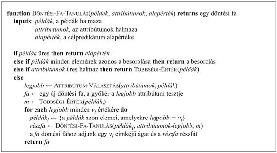

Természetesen ha több mintát gyűjtöttünk volna, akkor egy, az eredetihez hasonlóbb fát hozhattunk volna létre az induktív tanulással. A 18.6. ábrán látható fa elkerülhetetlenül hibákat is el fog követni; például sohasem látott olyan helyzetet, amelyben a várakozási idő 0–10 perc, de az étterem tele van. Egy olyan esetben, amikor az <em>Éhes</em> attribútum hamis értékű, a fa azt választja, hogy ne várjunk, pedig én (S. Russell) bizonyára várnék. Felmerül tehát az a kézenfekvő kérdés, hogy ha az algoritmus egy konzisztens, de inkorrekt fát indukál, akkor mennyire lesz inkorrekt ez a fa? Ezt azután fogjuk kísérletileg elemezni, hogy először elmagyaráztuk az attribútumteszt-választási lépés részleteit.

<a id="id725868"/>
<strong>18.6. ábra - A 12 példás tanító minta halmazból származtatott döntési fa</strong>

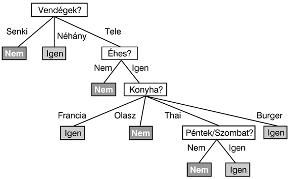

<h2 class="title"><a id="id725878"/>Attribútumteszt-választás</h2>

A döntési fa tanulás során az attribútumok kiválasztására szolgáló eljárás arra irányul, hogy minimalizáljuk az eredményül kapott fa mélységét. Az alapötlet az, hogy azt az attribútumot válasszuk, amellyel a lehető legmesszebbre jutunk a példák pontos osztályozásában. Egy tökéletes attribútum a példákat egy csupa pozitív és egy csupa negatív példát tartalmazó halmazra osztja. A <em>Vendégek</em> nem tökéletes attribútum, de meglehetősen jó. Egy valójában haszontalan attribútum, mint például a <em>Konyha</em>, tesztjének eredményeként a kapott halmazokban nagyjából ugyanolyan arányban lesz pozitív és negatív példa, mint az eredeti halmazban.

Mindössze arra van szükségünk, hogy formális mértéket találjunk arra, hogy mit jelent a „meglehetősen jó” és a „valójában haszontalan”, ezek után implementálni tudjuk a 18.5. ábrán látható <code class="code">ATTRIBÚTUM-VÁLASZTÁS</code> függvényt. A mérték akkor érje el maximumát, amikor az attribútum tökéletes, és akkor legyen minimális, amikor az attribútumnak egyáltalán nincs semmi haszna. Egy megfelelő mérték az attribútum által szolgáltatott <strong>információ</strong> (<strong>information</strong>) várható értéke, ahol az információt abban a matematikai értelmezésben használjuk, ahogy először Shannon és Weaver definiálta (Shannon és Weaver, 1949). Az információ definíciójának megértéséhez gondoljunk például annak a kérdésnek a megválaszolására, hogy egy feldobott pénzérme fej oldala lesz-e felül. Az, hogy a válaszban mennyi információ rejlik, az az előzetes a priori tudástól függ. Minél kevesebbet tudunk, annál több a szolgáltatott információ. Az információelmélet <strong>bit</strong>ekben méri az információtartalmat. Egy bit információ ahhoz elég, hogy egy olyan kérdésre, amelyről semmilyen előzetes elképzelésünk sem volt (például egy szabályos érme feldobásának eredménye) igen/nem választ megadjunk. Általánosságban, ha a lehetséges <em>vi</em> válaszok valószínűsége <em>P</em>(<em>vi</em>), akkor a válasz <em>I</em> információtartalmát a következő összefüggés adja meg: 

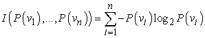

A pénzfeldobás esetre ellenőrizve az összefüggést, a következőt kapjuk:

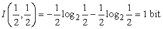

Ha az érme hamisított oly módon, hogy a dobás 99%-ban fejre jön ki, akkor <em>I</em>(1/100, 99/100) = 0,08 bitre van szükség, és ha a fej kimenetel valószínűsége 1-hez tart, akkor az aktuális kimenetel megjóslásához szükséges információ 0-hoz tart.

Döntési fa tanulás esetén a megválaszolásra váró kérdés az, hogy egy adott példának mi a helyes besorolása. Egy jó döntési fa választ ad erre a kérdésre. Még mielőtt egyetlen attribútumot teszteltünk volna, a válaszok valószínűségét becsülhetjük a tanító halmazban található pozitív és negatív minták arányával. Tegyük fel, hogy a tanító halmazban <em>p</em> pozitív és <em>n</em> negatív példa található. Ez esetben a helyes válasz információtartalmának becslése:

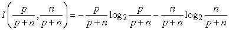

A 18.3. ábrán bemutatott étterem tanító halmaz <em>p</em> = <em>n </em>= 6 mintát tartalmaz, tehát 1 bit információra van szükségünk.

Egyetlen <em>A</em> attribútum tesztje nem fogja megadni mindezt az információt, de valamennyit megad belőle. Pontosan mérni tudjuk, hogy mennyit, ha megnézzük, hogy mennyi információra van még szükségünk az attribútumteszt <em>után</em>. Bármely <em>A</em> attribútum, amely <em>v</em> különböző értéket vehet fel, <em>E</em>1, ...,<em> Ev</em> részhalmazokra bontja az <em>E</em> tanító halmazt, az <em>A</em> lehetséges értékei szerint. Mindegyik <em>Ei</em> részhalmaz <em>pi</em> pozitív és <em>ni</em> negatív példát tartalmaz, így ezen az ágon továbbhaladva <em>I</em>(<em>pi</em>/(<em>pi</em> + <em>ni</em>), <em>ni</em>/(<em>pi</em> + <em>ni</em>)) bit információra van szükségünk a válasz megadásához. A tanító halmazból véletlen mintavétellel nyert minta esetén annak valószínűsége, hogy az <em>A</em> attribútum ezen a mintán az <em>i</em>-edik értéket veszi fel: (<em>pi</em> + <em>ni</em>)/(<em>p</em> + <em>n</em>). Ennek megfelelően az <em>A</em> attribútum tesztje után az átlagos információszükséglet, amely a példa osztályozásához kell:

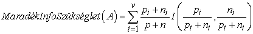
<a id="ID_761_oldal"/>
Az attribútum tesztjéből származó <strong>információnyereség</strong> (<strong>information gain</strong>) az eredeti (<em>A</em> tesztje előtti) információszükséglet és a teszt utáni új információszükséglet különbségeként kapható meg:

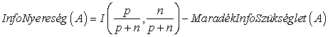

Az <code class="code">ATTRIBÚTUM-VÁLASZTÁS</code> függvényben használt heurisztika csupán azt takarja, hogy válasszuk a legnagyobb nyereséget biztosító attribútumot. Visszatérve a 18.4. ábrán vizsgált attribútumokhoz:

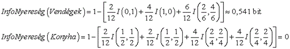

Ez megerősíti azt az intuíciónkat, hogy a <em>Vendégek</em> jobb attribútum a tanítóhalmaz részhalmazokra szabdalására, mint a <em>Konyha</em>. Az a helyzet, hogy a <em>Vendégek</em> attribútumnak van a legnagyobb információnyeresége, ezért a döntési fa tanuló algoritmus ennek tesztjét választaná a fa gyökércsomópontjába.

<h2 class="title"><a id="id726177"/>A tanuló algoritmus teljesítményének becslése</h2>

Egy tanuló algoritmus akkor jó, ha olyan hipotéziseket hoz létre, amelyek jól jósolják meg az általuk előzetesen nem látott példák osztályba sorolását. A 18.5. fejezetben azt mutatjuk be, hogy mi módon lehet előre megbecsülni a jóslás minőséget. Ebben a fejezetben egy olyan módszertant vizsgálunk meg, amellyel az osztályba soroló képességet méréssel lehet becsülni.

Nyilvánvalóan akkor jó egy jóslás, ha igaznak bizonyul, így a hipotézis minőségét megbecsülhetjük az ismertté vált tényleges osztálybasorolások alapján. Ezt egy <strong>teszthalmaz</strong>nak (<strong>test set</strong>) nevezett mintahalmaz segítségével végezhetjük el. Ha az összes rendelkezésünkre álló példát tanításra használjuk, akkor továbbiakat kell gyűjtenünk a teszteléshez. Ezért gyakran kényelmesebb a következő módszert alkalmazni: 

<ol class="orderedlist"><li class="listitem">
Gyűjtsünk egy nagy példahalmazt.
</li><li class="listitem">
Osszuk két diszjunkt részre: a <strong>tanító halmaz</strong>ra (<strong>training set</strong>) és a <strong>teszthalmaz</strong>ra (<strong>test set</strong>).
</li><li class="listitem">
Alkalmazzuk a tanító algoritmust a tanító halmazon, és így generáljunk egy <em>h</em> hipotézist.
</li><li class="listitem">
Mérjük meg a teszthalmazon, hogy a <em>h</em> hipotézis a halmaz hány százalékára ad helyes osztálybasorolást.
</li><li class="listitem">
Ismételjük meg az 1–4 lépéseket különböző tanító halmaz méretekre, és mindegyik mérethez különböző véletlenszerűen kiválasztott tanító halmazokra.
</li></ol>

Ennek az eljárásnak az eredményeként egy adathalmazt kapunk, amelynek feldolgozásával megkaphatjuk az átlagos jóslási képességet a tanító halmaz méretének függvényében. Ezt a függvényt ábrázolva kapjuk az adott algoritmusnak egy adott tématerületre vonatkozó <strong>tanulási görbé</strong>jét (<strong>learning curve</strong>). A <code class="code">DÖNTÉSI-FA-TANULÁS</code> algoritmus étterem példáinkkal felvett tanulási görbéje a 18.7. ábrán látható. Vegyük észre, hogy a tanító halmaz méretével javul a predikció minősége! (Ez okból az ilyen görbéket ún. <strong>boldog görbé</strong>knek (<strong>happy graph</strong>s) is nevezik.) Ez annak a jele ugyanis, hogy valóban van valami mintázat az adatokban, és az algoritmus felfedezi ezt a mintázatot.

<a id="id726269"/>
<strong>18.7. ábra - Tanulási görbe az étterem problématérre véletlenszerűen generált 100 példa esetén. A görbe 20 kísérlet eredményét összegzi.</strong>

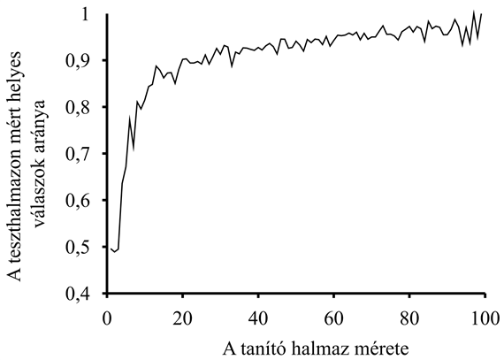

A tanuló algoritmusnak nyilvánvalóan nem szabad az előtt „látnia” a tesztadatokat, mielőtt a megtanított hipotézist teszteltük velük. Szerencsétlen módon nagyon könnyű beleesni abba a hibába, hogy tanítás közben a tesztadatokra<strong> kukucskál</strong>unk (<strong>peeking</strong>). Ez tipikusan a következő módon zajlik: egy tanuló algoritmus általában számos hangolási lehetőséggel rendelkezik, amellyel az algoritmus viselkedését változtatni tudjuk. Például számos különböző kritérium lehet, amelyek alapján a következő attribútumot kiválasztjuk a döntési fa tanulásnál. Különböző beállítások mentén számos különböző hipotézist generálunk, majd mindegyiket leteszteljük a teszthalmazon, és a legjobb hipotézis predikciós eredményét tekintjük eredménynek. Fájdalmas bár, de kukucskálás történt! Ennek oka, hogy a hipotézist<em> a</em> <em>teszthalmazon elért eredménye alapján választottuk ki,</em> így a teszthalmaz által hordozott információ beszivárgott a tanuló algoritmusba. Ennek a mesének az a tanulsága, hogy bármely eljárásnak, amelynek része a hipotéziseknek a teszthalmazon nyújtott teljesítményük alapján való összehasonlítása, egy <em>új</em> teszthalmazt kell használnia, amelyen a végül kiválasztott hipotézis teljesítményét méri. A gyakorlatban ez túl körülményes, így az emberek továbbra is ily módon szenynyezett adathalmazaikon folytatják kísérleteiket.

<h2 class="title"><a id="id726303"/>Zaj és túlilleszkedés</h2>

Korábban már láttuk, hogy ha van kettő vagy több olyan példa, amelyeknek azonos a leírásuk (az attribútumokra nézve), de eltérő az osztálybasorolásuk, akkor a <code class="code">DÖNTÉSI-FA-TANULÁS</code> algoritmus nem lehet képes olyan döntési fát találni, amely minden példával konzisztens. Az általunk korábbiakban említett megoldás a következő. Ha determinisztikus osztályzásra van igény, akkor minden levélcsomópont adja vissza a hozzá tartozó halmaz többségi osztályát. Más esetekben pedig adja vissza a relatív gyakoriságok alapján becsült osztályba tartozási valószínűségeket. Sajnos, ez még távol van a történet végétől. Könnyen elképzelhető, sőt valójában elég valószínű, hogy a tanuló algoritmus akkor is talál egy olyan döntési fát, amely az összes példával konzisztens, ha nagyon fontos információ hiányzik. Ennek oka, hogy az algoritmus felhasználhat <em>irreleváns</em> attribútumokat, ha vannak ilyenek, hogy hamis megkülönböztetést tegyen a példák közt.

Vizsgáljuk meg azt a problémát, amikor egy kockadobás eredményét akarjuk megjósolni. Tegyük fel, hogy több napon át kísérleteket végzünk számos kockával. Mindegyik tanító példát a következő attribútumokkal írunk le:

<ol class="orderedlist"><li class="listitem">
<em>Nap:</em> az a nap, amelyen a kockadobást végeztük (hétfő, kedd, szerda, csütörtök).
</li><li class="listitem">
<em>Hónap:</em> a hónap, amelyben a kockadobást végeztük (január vagy február).
</li><li class="listitem">
<em>Szín:</em> a kocka színe (vörös vagy kék).
</li></ol>

Mindaddig, amíg két dobásnak nem lesz pontosan azonos a leírása, a <code class="code">DÖNTÉSI-FA-TANULÁS</code> képes lesz egzakt hipotézist találni. Minél több attribútum van, annál valószínűbb, hogy egzakt hipotézist kapunk. Viszont az összes ilyen hipotézis teljesen hamis lesz! Amit szeretnénk, az az, hogy a <code class="code">DÖNTÉSI-FA-TANULÁS</code> – miután elég példát látott már – egyetlen levélcsomópontot adjon vissza, minden egyes dobási eredményhez közelítőleg 1/6 valószínűséggel.

Amikor a hipotézisek nagy halmaza lehetséges, akkor óvatosnak kell lennünk, nehogy arra használjuk az ebből eredő nagy szabadságot, hogy értelmetlen „szabályosságot” találjunk az adatokban. Ezt a problémát <strong>túlilleszkedés</strong>nek (<strong>overfitting</strong>) nevezzük. Ez rendkívül általános jelenség, akkor is jelentkezhet, amikor a keresett függvénynek egyáltalán nincs valószínűségi jellege. Mindamellett ez a probléma az összes tanulási algoritmust sújtja, nem csak a döntési fákat.

A túlilleszkedés kezelésének kimerítő matematikai tárgyalása meghaladja e könyv kereteit. A probléma megoldására itt csupán egy egyszerű – <strong>döntési fa metszés</strong> (<strong>decision tree pruning</strong>) nevű – módszert mutatunk be. A metszés (vagy nyesés) azon az alapon működik, hogy megakadályozzuk a nem nyilvánvalóan releváns attribútumok tesztje mentén a mintahalmaz ismételt (rekurzív) felosztását, még akkor is, ha az adatok osztálybasorolása az adott csomópontban nem egyforma. Az a kérdés, hogyan vesszük észre egy attribútumról, hogy irreleváns? 

Tegyük fel, hogy egy irreleváns attribútumra alapozva osztottuk ketté a mintahalmazunkat. Általánosságban szólva azt várjuk, hogy ez esetben az eredményül kapott részhalmazokban nagyjából ugyanabban az arányban fognak szerepelni az egyes osztályokba tartozó minták, mint az eredeti halmazban. Ekkor az információnyereség közel nulla.[<a id="id726376" href="#ftn.id726376" class="footnote">184</a>] Tehát az információnyereség (annak hiánya) jó jelzés lehet az irrelevanciára. Most az a kérdés merül fel, hogy mekkorának kell lennie az információnyereségnek ahhoz, hogy ezen attribútum mentén szétosszuk a mintahalmazt?

Ezt a kérdést a statisztikai <strong>szignifikanciateszt</strong>et (<strong>significance test</strong>) használva válaszolhatjuk meg. Ez a teszt azzal a feltételezéssel indul, hogy a példákban egyáltalán nincs közös mintázat (ez az úgynevezett <strong>nullhipotézis</strong>). Ezek után az aktuális adathalmazt vizsgáljuk: meg akarjuk határozni annak mértékét, hogy az adathalmaz mennyire tér el a tökéletesen mintázat nélküli helyzettől. Ha az eltérés mértéke statisztikailag már valószínűtlen (rendszerint 5% vagy ennél kisebb valószínűséget értünk ezalatt), akkor ezt annak bizonyítékaként vesszük, hogy az adatokban jelen van egy alapvető mintázat. A valószínűséget a véletlen mintavételezés esetén várható eltérések standard eloszlását feltételezve számítjuk ki.

Ebben az esetben a nullhipotézis az, hogy az attribútum irreleváns, ennek megfelelően egy végtelen nagy mintahalmazra vett információnyereség nulla lenne. Azt kell kiszámítanunk, hogy a nullhipotézist feltéve egy ν méretű mintahalmazban a várt pozitív és negatív eseteloszlástól a megfigyelt eloszlás eltérése milyen valószínűséggel léphet fel. Az eltérés mértékét megadhatjuk a részhalmazok tényleges pozitív és negatív esetszámának (<em>pi</em>, <em>ni)</em> a nullhipotézis fennállása esetén várt esetszámokkal 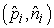 való összehasonlításával:

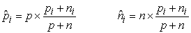

A teljes eltérés kényelmesen számítható mértékét a következő összefüggés adja:

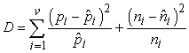

A nullhipotézist feltételezve a <em>D</em> eltérés mérték ν– 1 szabadságfokú <em>χ</em>2 (khí-négyzet) eloszlást követ. Annak valószínűségét, hogy az attribútum valóban irreleváns, standard <em>χ</em>2 táblázatok vagy statisztikai szoftver segítségével számíthatjuk ki. A 18.11. feladatban tűztük ki célul, hogy a <code class="code">DÖNTÉSI-FA-TANULÁS</code> algoritmusban elvégezzük azokat a változtatásokat, amelyek a metszés ezen – <em>χ</em>2 <strong>metszés</strong> (<em>χ</em>2 <strong>pruning</strong>) néven ismert – formájához vezetnek.

A zaj metszés segítségével kezelhető: az osztályozási hibák lineáris növekedést okoznak a predikciós hibában, míg az esetleírásban fellépő hibák aszimptotikus hatást gyakorolnak, amely egyre rosszabb, ahogy a döntési fa egyre kisebb halmazok kezelésére zsugorodik. Ha az adatok nagy zajjal terheltek, akkor a metszéssel készült döntési fák lényegesen jobb eredményt adnak, mint a metszés nélkül készültek. Ráadásul a metszéssel készült fák gyakran jóval kisebbek, ezért könnyebben érthetők.

Egy másik túlilleszkedést csökkentő technika a <strong>keresztvalidáció</strong> (<strong>cross-validation</strong>). Bármely tanulási eljárásnál alkalmazható, nem csupán a döntési fa tanulásnál. Az alapvető ötlet annak megbecsülése, hogy az egyes hipotézisek mennyire jól fogják megjósolni a még nem látott esetekre adandó válaszokat. Ezt úgy becsülhetjük, hogy az ismert adatok egy részét félretesszük, és ezekkel teszteljük a megmaradt adatok alapján tanulással létrehozott fa predikciós képességét. <em>K</em>-szoros keresztvalidációnak nevezzük, ha <em>k</em> kísérletet végzünk, és minden esetben az adatok más és más 1/<em>k</em>-ad részét tesszük félre validációs tesztcélra, majd a végén átlagoljuk az eredményeket. Az 5 és a 10 elterjedten használt <em>k</em> értékek. Szélső esetként használják a <em>k </em>= <em>n</em> választást, amelyet hagyj-ki-egyet keresztvalidációs módszerként ismerünk. A keresztvalidációt tetszőleges döntési fa tanulási módszerrel együtt alkalmazhatjuk (beleértve a metszést is), célja mindig az, hogy olyan döntési fa kiválasztását segítsük elő, amely jó predikciós képességgel rendelkezik. A kukucskálási jelenség elkerülése végett ezek után ezt a predikciós képességet egy új teszthalmazon kell mérnünk.

<h2 class="title"><a id="id726524"/>A döntési fák alkalmazhatóságának kiterjesztése</h2>

Egy sor problémát meg kell oldanunk ahhoz, hogy a döntési fa indukciót a problémák szélesebb körére kiterjeszthessük. Nagyjából felvázoljuk mindegyiket, azt javasolva, hogy a teljesebb megértés érdekében a kapcsolódó feladatokat oldja meg az olvasó.

<ul class="itemizedlist"><li class="listitem">
<strong>Hiányzó adatok</strong> (<strong>missing data</strong>): Számos területen nem ismerhető meg minden példa összes attribútuma. Lehet, hogy az értékek nem kerültek tárolásra, vagy túl drága lenne a mérésük. Ez két problémát vet fel: először, ha van is egy teljes döntési fánk, akkor hogyan tudunk egy olyan mintát osztályozni, amelynek egy tesztelendő attribútuma hiányzik? Másodszor, hogyan módosítsuk az információnyereségre vonatkozó formulát, ha néhány példa ezen attribútumának értéke nem ismert? Ezeket a kérdéseket a 18.2. feladatban vizsgáljuk.
</li><li class="listitem">
<strong>Sokértékű attribútum</strong>ok (<strong>multivalued attribute</strong>s): Ha egy attribútum nagyszámú értéket vehet fel, akkor az információnyereség nagysága nem megfelelő mértéke az attribútum hasznosságának. Szélsőséges esetben egy olyan attribútumot használnánk, mint például az <em>ÉtteremNév</em> attribútum, amely minden példára más és más értéket ad. Ez esetben példák minden részhalmaza egyelemű lesz, egyedi osztálybasorolással, így az információnyereség erre az attribútumra veszi fel maximális értékét. Mindamellett ez az attribútum irreleváns, értéktelen. Egy lehetséges megoldás a <strong>nyereségarány</strong> (<strong>gain ratio</strong>) használata (lásd 18.13. feladat).
</li><li class="listitem">
<strong>Folytonos és egész értékű bemeneti attribútumok</strong> (<strong>continuous and integer-valued</strong><strong> input attributes</strong>): A folytonos vagy az egész értékű bemeneti attribútumok – mint például a <em>Magasság</em> és a <em>Súly</em> – által felvehető értékek halmaza végtelen. A döntési fa tanuló algoritmusok az ilyen esetekre nem generálnak végtelen elágazású csomópontokat, inkább megkeresik azt a <strong>küszöbpont</strong>ot (<strong>split point</strong>), amely a legnagyobb információnyereséget eredményezi. Például egy adott csomópontnál az lehet a helyzet, hogy a <em>Súly </em>&gt; 160 teszt adja a legnagyobb információnyereséget. Léteznek hatékony dinamikus programozási módszerek jó küszöbpontok megtalálására, de még mindig messze ez a legtöbb erőforrást igénylő része a döntési fa tanulási eljárások valós problémákra való alkalmazásának.
</li><li class="listitem">
<strong>Folytonos értékkészletű kimeneti attribútumok</strong> (<strong>continuous-valued output attributes</strong>): Ha egy numerikus értéket akarunk megjósolni, például egy műtárgy árát, akkor nem osztályozásra van szükségünk, hanem egy <strong>regressziós fá</strong>ra (<strong>regression tree</strong>). Egy ilyen fa nem egyetlen értéket (osztályt) ad vissza az egyes levél csomópontjaiban, hanem egy attribútumhalmaz lineáris függvényét. Például a műtárgyak regreszsziós fájának kézzel festett metszetekre vonatkozó ága a területnek, a kornak és a színek számának lineáris függvényéhez vezethet. A tanuló algoritmusnak kell azt megoldania, hogy mikor álljon le a minták csomópontokban történő szétosztásával, áttérve a maradék attribútumokat (vagy azok bizonyos részhalmazát) felhasználó lineáris regresszió megalkotására.
</li></ul>

Egy döntési fa tanulásra szolgáló, valós problémák megoldását célzó rendszernek képesnek kell lennie mindezen problémák kezelésére. A folytonos értékű változók kezelése különösen fontos, mivel mind a fizikai, mind a gazdasági folyamatok numerikus értékekkel jellemezhetők. Számos, üzleti forgalomban kapható programcsomag készült, amelyek megfelelnek mindezen a kritériumoknak, és segítségükkel több száz – valamilyen konkrét területen – alkalmazott rendszert fejlesztettek ki. Az ipar és kereskedelem sok területén, ha minták alapján kialakított osztályozásra van szükség, akkor elsősorban döntési fákkal próbálkoznak. A döntési fák egyik fontos tulajdonsága, hogy az ember számára jól érthető a tanuló algoritmus által előállított eredmény. (Valójában olyan gazdasági döntések esetén, amelyeknek megkülönböztetés elleni jogszabályoknak kell megfelelniük, ez <em>jogi követelmény</em>.) A neurális hálózatoknál hiányzik ez a fontos tulajdonság (lásd 20. fejezet).

 

[<a id="ftn.id721711" href="#id721711" class="para">183</a>]  Nagyon fontos, hogy megkülönböztessük az azonos példát egy <em>azonos leírással rendelkező példától</em>. Erre a fontos különbségre még visszatérünk a 19. fejezetben.

[<a id="ftn.id726376" href="#id726376" class="para">184</a>]  Valójában a nyereség pozitív lesz, kivéve azt az esetet, amikor az arányok mind pontosan egyformák (lásd 18.10. feladat).

</body></html>
