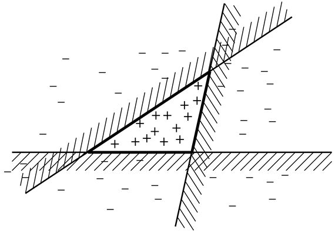
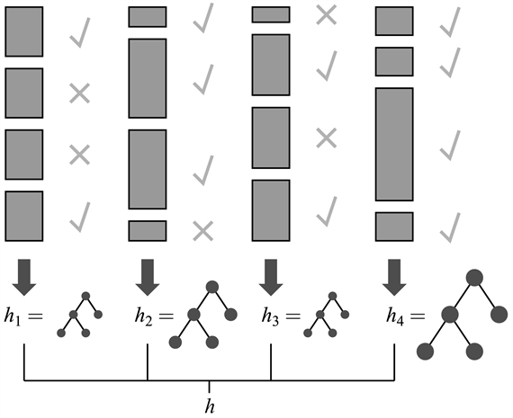
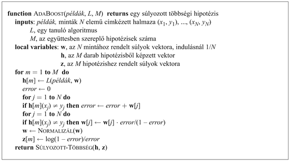
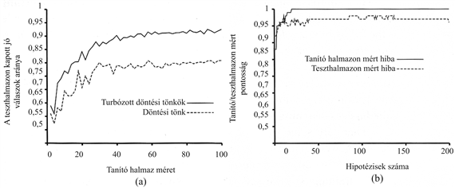

<?xml version="1.0" encoding="UTF-8" standalone="no"?>
<!DOCTYPE html PUBLIC "-//W3C//DTD XHTML 1.1//EN" "http://www.w3.org/TR/xhtml11/DTD/xhtml11.dtd">
<html xmlns="http://www.w3.org/1999/xhtml"><head><meta name="generator" content="DocBook XSL Stylesheets V1.76.1"/></head><body>

<h1 class="title"><a id="id726635"/>Hipotézishalmaz együttes tanulása</h1>

Az eddigiekben olyan tanulási algoritmusokat vizsgáltunk, amelyek eredményeként a hipotézistérből kiválasztott egyetlen hipotézist használunk arra, hogy predikciót végezzünk. Az <strong>együttes tanulás</strong> (<strong>ensemble learning</strong>) alapötlete, hogy válasszunk ki a hipotézistérből egy teljes hipotéziskollekciót vagy hipotézis<strong>együttes</strong>t (<strong>ensemble</strong>), és kombináljuk az általuk adott predikciókat. Generálhatunk például ugyanazon tanító halmaz alapján száz különböző döntési fát, és egy új példa esetén szavazással alakíthatjuk ki a legjobb predikciós osztályozási eredményt.

Az együttes tanulás motivációja kézenfekvő. Vizsgáljunk egy <em>M</em> = 5 hipotézisből álló együttest, és tegyük fel, hogy a predikciós eredményeket egyszerű többségi szavazással kombináljuk össze. Ahhoz, hogy az együttes rosszul osztályozzon egy új példát, <em>legalább háromnak az öt hipotézisből rossz osztályozási eredményt kell adnia!</em> Reményünk szerint ez sokkal kevésbé valószínű, mint az, hogy egyetlen hipotézis rossz osztályozásra jusson. Tegyük fel, hogy az együttes minden <em>hi</em> hipotézisének <em>p</em> a hibavalószínűsége, azaz <em>p</em> annak valószínűsége, hogy <em>hi</em> rosszul osztályoz egy véletlen módon kiválasztott példát. Továbbá tegyük fel, hogy a hipotézisek által elkövetett hibák <em>függetlenek</em>. Ez esetben – ha <em>p</em> kicsi – rendkívül kicsi a valószínűsége, hogy nagy számban történjék téves osztályozás. Egyszerű számítással (lásd 18.14. feladat) megmutatható például, hogy öt hipotézisből álló együttest használva a hibaarány 0,1-ről kevesebb mint 0,01-ra csökken. Valójában a függetlenség feltételezése nem racionális, mert a hipotéziseket a tanító halmaz félrevezető tulajdonságai hasonló módon vezetik félre. Mindamellett, ha a hipotézisek legalább kismértékben eltérőek, lecsökkentve a hibáik közti korrelációt, akkor az együttes tanulás nagyon hasznos lehet.

Az együttes tanulás tárgyalható más aspektusból is: gondolhatunk rá úgy, mint a hipotézistér egy általános kiterjesztésére. Tekintsünk úgy magára az együttesre, mint egy hipotézisre, és az új hipotézistér legyen mindazon lehetséges együttesek halmaza, amelyek az eredeti hipotézistérből konstruálhatók. A 18.8. ábra mutatja, hogyan eredményezhet ez egy sokkal kifejezőbb hipotézisteret. Ha az eredeti hipotézistér egyszerű és hatékony tanulási eljárást tett lehetővé, akkor az együttes tanulás módszere egy sokkal kifejezőbb hipotézisosztály tanulását biztosítja. Ennek általában nem túl nagy számítási és algoritmikus komplexitás növekedés az ára.

A legelterjedtebben használt együttes tanulási módszert <strong>turbózás</strong>nak (<strong>boosting</strong>) nevezzük. Ahhoz, hogy működését megértsük, be kell vezetnünk a <strong>súlyozott tanító halmaz</strong> (<strong>weighted training set</strong>) fogalmát. Egy ilyen tanító halmazban minden mintához hozzárendelünk egy <em>wj</em> ≥ 0 súlyt. Minél magasabb ez a súly, annál nagyobb jelentőséget tulajdonítunk az adott mintának a hipotézis tanulása során. Az eddigiekben áttekintett tanuló algoritmusaink kézenfekvő módon módosíthatók úgy, hogy súlyozott tanító halmazokkal is tudjanak működni.[<a id="id726731" href="#ftn.id726731" class="footnote">185</a>]

<a id="id726756"/>
<strong>18.8. ábra - A együttes tanulás eredményeképpen nyert megnövekedett kifejezőerőt illusztráló példa. Három lineáris küszöb jellegű hipotézist vizsgálunk, mindegyik a nem vonalkázott félsíkon ad pozitív besorolást. Az együttesben csak arra adunk pozitív osztályozást, amelyre mindhárom pozitívat ad. Az eredményül kapott háromszögterület egy olyan hipotézisnek felel meg, amelyet az eredeti hipotézistér egyetlen eleme sem képes kifejezni.</strong>

A turbózás az összes mintára <em>wj</em> = 1 értékkel (azaz egy normál tanító halmazzal) indul. Ebből a halmazból generálja az első hipotézist, <em>h</em>1-et. Ez a hipotézis egyes tanítómintákat jól osztályoz, másokat rosszul. Azt szeretnénk, ha a következő hipotézis jobb eredményt érne el a rosszul osztályozott mintákon, ezért megnöveljük a rosszul osztályozottak súlyait, míg a jól osztályozottakét csökkentjük. Ebből az új, súlyozott mintahalmazból generáljuk a <em>h</em>2 hipotézist. Az eljárást addig folytatjuk, míg <em>M</em> hipotézist nem generáltunk, ahol <em>M</em> a turbó tanulási algoritmus bemenő paramétere. Az algoritmus eredményeként kapott hipotézis együttes nem más, mint az <em>M</em> hipotézis súlyozott többségi szavazással kombinált eredője. A súlyokat aszerint határozzuk meg, hogy az egyes hipotézisek mennyire jól teljesítettek a tanító halmazon. A 18.9. ábrán bemutatjuk az algoritmus koncepcióját. Sok variánsa ismert a turbó tanulásnak, eltérő súlymódosítással, illetve a hipotézisek különböző kombinálási lehetőségeivel. Egy kiválasztott – <code class="code">ADABOOST</code> nevű – algoritmust mutatunk be a 18.10. ábrán. Az alkalmazott súlymódosítási eljárás jelen esetben nem túl lényeges, viszont az <code class="code">ADABOOST</code> algoritmusnak van egy nagyon lényeges jellemzője. Tegyük fel, hogy a használt <em>L</em> tanulási algoritmus egy <strong>gyenge tanulás</strong>i (<strong>weak learning</strong>) algoritmus, ami azt jelenti, hogy <em>L</em> mindig visszaad egy olyan hipotézist, amelyik legalább egy csöppet jobban teljesít a tanító halmaz súlyozott hibájára nézve, mint a véletlen találgatás (azaz eredménye jobb mint 50% bináris osztályozás esetén). Ez esetben, kellően nagy <em>M</em>-re az <code class="code">ADABOOST</code> mindig előállít egy olyan hipotézist, amely <em>a tanító mintákat tökéletesen osztályozza</em>! Tehát az algoritmus <em>fokozza</em> az eredeti tanuló eljárásnak a tanító mintán mért pontosságát. Ez mindig fennáll, attól függetlenül, hogy esetleg mennyire kevéssé kifejező az eredeti hipotézistér, és mennyire bonyolult a keresett függvény.

<a id="id726837"/>
<strong>18.9. ábra - A turbó algoritmus működése. Mindegyik árnyékolt téglalap egy példának felel meg, a téglalap magassága mutatja a példa súlyát. A pipák és keresztek mutatják, hogy a példát jól vagy rosszul osztályoztuk a pillanatnyi hipotézis alapján. A döntési fa mérete mutatja, hogy ennek a hipotézisnek mekkora a súlya a végső együttesben.</strong>

Vizsgáljuk meg, hogy mennyire jól működik a turbózás az éttermi adatainkon. Kiinduló hipotézistérként az úgynevezett <strong>döntési tönk</strong>ök (<strong>decision stump</strong>s) terét választjuk, amelyek olyan döntési fák, amelyek csupán egy – a gyökércsomópontban elhelyezkedő – tesztből állnak. A 18.11. (a) ábra alsó görbéje mutatja, hogy turbózás nélkül  ezek a döntési tönkök nem adnak valami jó eredményt, csupán 81%-os a 100 mintán mért predikciós teljesítményük. Amikor turbózást alkalmazunk (<em>M</em> = 5), akkor a teljesítmény javul, eléri a 93%-ot 100 példa esetén.

<a id="id726863"/>
<strong>18.10. ábra - Az együttes tanulás turbó módszereinek <code class="code">ADABOOST</code> nevű variánsa. Az algoritmus hipotézisek kombinációját hozza létre. A <code class="code">SÚLYOZOTT-TÖBBSÉG</code> egy hipotézist generál. Ez az új hipotézis azt a kimeneti értéket adja vissza, amely a h-ban található hipotézisek közül, a z-ben számon tartott súlyozással a legtöbb szavazatot kapta.</strong>

<h3 class="title">Fontos</h3>
Érdekes dolog  történik, amikor az együttes <em>M</em> mérete növekszik. A 18.11. (b) ábra mutatja a tanító halmazon mért teljesítményt <em>M</em> függvényében. Figyeljük meg, hogy <em>M </em>= 20-nál a hiba eléri a nullát (ahogy a turbózással foglalkozó elmélet megjósolta), azaz 20 döntési tönk súlyozott többségi szavazással összefogott kombinációja elégséges a 100 mintára való pontos illeszkedéshez. Ha további tönköket adunk az együtteshez, akkor a hiba nulla marad. A görbe mutatja ugyanakkor, hogy <em>a teszthalmazon mért teljesítmény még hosszasan nő azután is, hogy a tanító halmazon mért hiba elérte a nullát</em>. <em>M</em> = 20 esetén a teszthalmazon mért teljesítmény 0,95 (a hiba 0,05), <em>M </em>= 137-ig növelve az együttes résztvevőinek számát a teljesítmény 0,98-ra nő, ezután leesik 0,95-re.

Ez a megfigyelés, amely különböző mintahalmazokra és hipotézisterekre nézve meglehetősen robusztusnak bizonyult, nagy meglepetést keltett a felfedezésekor. Az Ockham borotvája elv azt sugallja, hogy ne tegyük a hipotéziseket komplexebbé, mint szükséges, de a görbe azt mutatja, hogy a predikciók<em> javulnak,</em> ahogy az együttes hipotézis összetettebbé válik! Számos magyarázatot javasoltak erre a jelenségre. Az egyik megközelítés szerint a turbózás nem más, mint a <strong>Bayes-tanulás</strong> közelítése (lásd 20. fejezet), amely egy bizonyíthatóan optimális tanulási eljárás. Ez a közelítés javul, ahogy több és több hipotézist adunk az együtteshez. Másik lehetséges magyarázat, hogy további hipotéziseknek az együtteshez adása lehetővé teszi, hogy <em>határozottabb</em> legyen a megkülönböztetés a pozitív és negatív példák között, ami segít az új minták osztályozásában.

<a id="id726929"/>
<strong>18.11. ábra - (a) A döntési tönkök és a turbózott döntési tönkök teljesítményének az étterem példán történő összehasonlítása <em>M</em> = 5 esetén. (b) A tanító halmazon és a teszthalmazon kapott jó válaszok aránya <em>M</em>-nek – az együttesben található hipotézisek számának – a függvényében. Figyeljük meg, hogy a teszthalmazon mért pontosság még azután is javul egy kicsit, amikor a tanító halmazon elérte az 1-et, azaz miután az együttes pontosan illeszkedett az adatokra.</strong>

 

[<a id="ftn.id726731" href="#id726731" class="para">185</a>]  Azon tanulási eljárásokra, ahol ez nem lehetséges, <strong>ismétléses tanító halmaz</strong>t (<strong>replicated training set</strong>) hozhatunk létre, ahol a <em>j</em>-edik minta a <em>wj</em> súllyal arányos példányszámban szerepel. Az esetleges nem egész súlyokat úgy kezelhetjük, hogy a mintaszámot valószínűségi változóként fogjuk fel.

</body></html>
