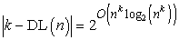
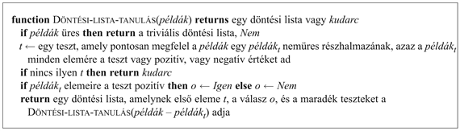

<?xml version="1.0" encoding="UTF-8" standalone="no"?>

<html xmlns="http://www.w3.org/1999/xhtml"><head><meta name="generator" content="DocBook XSL Stylesheets V1.76.1"/></head><body>

<h1 class="title"><a id="id726946"/>Miért működik a tanulás: a tanulás számítási elmélete</h1>

A legfontosabb megválaszolatlan kérdés, amelyet a 18.2. alfejezetben tettünk fel, a következő: hogyan bizonyosodhat meg valaki arról, hogy a tanulási algoritmusa által létrehozott elmélet helyesen fogja megjósolni a jövőt? Formálisan: honnan tudjuk, hogy a <em>h</em> hipotézis jól közelíti az <em>f</em> keresett függvényt, ha nem ismerjük <em>f</em>-et? Évszázadok óta foglalkoznak ezekkel a kérdésekkel. Amíg nem találjuk meg a válaszokat, addig a gépi tanulást – a legjobb esetben is – csak zavarba hozza saját sikere.

<h3 class="title">Fontos</h3>
Az ebben az alfejezetben tárgyalt megközelítés a <strong>tanulás számítási elméleté</strong>n (<strong>computational learning theory</strong>) alapul, amely az MI, a statisztika és az elméleti számítástudomány közös határterülete. Ennek az elméletnek az alapvető elve a következő: <em>bármely súlyosan hibás elmélet szinte bizonyosan nagy valószínűséggel felismerhető kisszámú példa vizsgálata alapján, mivel helytelen predikciót fog adni. Tehát minden hipotézis, amely egy kielégítően nagy tanító példahalmazzal konzisztens választ ad, nem valószínű, hogy súlyosan hibás lenne: azaz <strong>valószínűleg közelítőleg helyes</strong>nek (<strong>probably approximately correct</strong>) kell lennie.</em> Minden olyan tanuló algoritmust, amely valószínűleg<em> </em>közelítőleg helyes hipotéziseket ad, <strong>VKH-tanuló</strong> (<strong>PAC-learning</strong>) algoritmusnak nevezünk.

Van néhány bonyolultabb rész az előbbi gondolatmenetben. A fő kérdés a tanító és a tesztpéldák viszonya: végül is mi azt szeretnénk, ha a hipotézis nem csupán a tanító halmazon lenne közelítőleg helyes, hanem elsősorban a teszthalmazon. Az alapvető feltevés az, hogy a tanító és a teszthalmazt <em>ugyanolyan valószínűség-eloszlást</em> használva, véletlenszerűen és függetlenül választottuk ugyanabból a példapopulációból. Ezt <strong>stacionaritás</strong>i (<strong>stationarity</strong>) feltevésnek nevezzük. A stacionaritási feltevés nélkül az elmélet semmilyen, a jövőre vonatkozó igénnyel nem léphet fel, mivel nem lesz szükségszerű kapcsolat a múlt és a jövő között. A stacionaritási feltevés támasztja alá azt a gondolatot, hogy a példákat kiválasztó eljárás nem rosszindulatú. Persze ha a tanító halmaz kizárólag furcsa példákat tartalmaz – kétfejű kutyákat például –, akkor a tanuló algoritmus nyilvánvalóan nem tehet mást, mint sikertelen általánosításra jut a felől, hogy mi módon lehet a kutyákat felismerni.

<h2 class="title"><a id="id727020"/>Hány példára van szükség?</h2>

Néhány definícióra szükségünk lesz ahhoz, hogy ezeket a felismeréseket a gyakorlatba át tudjuk ültetni:

<ul class="itemizedlist"><li class="listitem">
Jelöljük <strong>X</strong>-szel az összes lehetséges példák halmazát.
</li><li class="listitem">
Jelölje <em>D</em> azt a valószínűségi eloszlást, amely alapján a példákat választjuk.
</li><li class="listitem">
Legyen <strong>H</strong> a lehetséges hipotézisek halmaza.
</li><li class="listitem">
Legyen <em>N</em> a tanító halmaz elemeinek a száma.
</li></ul>

Előzetesen feltesszük, hogy a keresett <em>f</em> függvény eleme <strong>H</strong>-nak. Most már definiálhatjuk azt a <strong>hibá</strong>t (<strong>error</strong>), ami egy <em>h</em> hipotézisnek a keresett <em>f</em> függvénytől való eltérését jellemzi a mintákra vonatkozó adott eloszlás mellett, mint annak valószínűségét, hogy <em>h</em> az <em>f</em>-től eltérő választ ad egy példára:

<code class="code">error(<em>h</em>) = <em>P</em>(<em>h</em>(<em>x</em>) ≠ <em>f</em>(<em>x</em>)|<em>x</em> a <em>D</em> alapján választva)</code>

Ez ugyanaz a mennyiség, mint amelyet az előzőkben bemutatott tanulási görbékkel mértünk a gyakorlatban.

<a id="id727132"/>
<strong>18.12. ábra - A hipotézistér sematikus ábrázolása a keresett <em>f</em> függvény körül felvett „ <em>ε</em> -gömb” ábrázolásával</strong>

Egy <em>h</em> hipotézist <strong>közelítőleg helyes</strong>nek (<strong>approximately correct</strong>) nevezünk, ha error(<em>h</em>) ≤ <em>ε</em>, ahol <em>ε</em> egy kis konstans. A bizonyítás megközelítése az, hogy megmutatjuk: <em>N</em> példa vizsgálata után az összes konzisztens hipotézis nagy valószínűséggel közelítőleg helyes lesz. Úgy gondolhatunk egy közelítőleg helyes hipotézisre, mint amely közel van a keresett függvényhez a hipotézistérben: egy – a keresett <em>f </em>körül felvett<em> </em>– <strong><em>ε-</em>gömb</strong>ön (<strong><em>ε</em></strong><strong>-ball</strong>) belül van. A 18.12. ábrán bemutatjuk az összes hipotézis <strong>H</strong> terét, amelyet két részre osztottunk, egyik az <em>ε</em>-gömb <em>f</em> körül, a másik a <strong>H</strong>rossz-szal jelölt maradék.

A következők alapján kiszámíthatjuk annak valószínűségét, hogy egy „súlyosan hibás” <em>hr</em> ∈ <strong>H</strong>rossz hipotézis konzisztens lesz az első <em>N</em> példával. Tudjuk, hogy error(<em>hr</em>) &gt; <em>ε</em>. Tehát annak valószínűsége, hogy egy adott példára helyes választ ad, legfeljebb 1 – <em>ε</em>. Ezek után az <em>N</em> példára vonatkozó összefüggés:

<code class="code"><em>P</em>(<em>hr</em> konzisztens <em>N</em> példával) ≤ (1 – <em>ε</em>)N</code>

Annak valószínűségét, hogy <strong>H</strong>rossz legalább egy konzisztens hipotézist tartalmaz, a lehetséges egyedi hipotézisek száma határozza meg:

<code class="code"><em>P</em>(<em>H</em>rossz tartalmaz egy konzisztens hipotézist) ≤ |<em>H</em>rossz|(1 – <em>ε</em>)N ≤ |<em>H</em>|(1 – <em>ε</em>)N</code>

Kihasználtuk, hogy |<strong>H</strong>rossz| ≤ |<strong>H</strong>|. Ezt a valószínűséget valamely kellően kis <em>δ</em> érték alá akarjuk csökkenteni:

<code class="code">|<em>H</em>|(1– <em>ε</em>)N ≤ <em>δ</em></code>

Felhasználva, hogy (1 – <em>ε</em>) ≤ <em>e–ε</em>,<em> </em>a célunk elérhető, ha lehetővé tesszük, hogy az algoritmus 

példát megvizsgálhasson. Ennek értelmében, ha egy algoritmus ilyen mennyiségű példával konzisztens hipotézist ad vissza, akkor legalább 1 – <em>δ</em> valószínűséggel a hibája legfeljebb <em>ε</em>. Más szavakkal közelítőleg helyesnek nevezzük. A szükséges példaszámot, ami <em>ε</em> és <em>δ</em> függvényeként adható meg, a hipotézistér <strong>minta komplexitás</strong>ának (<strong>sample complexity</strong>) nevezzük.

Kiderült, hogy kulcskérdés a hipotézistér mérete. Mint korábban láttuk, ha <strong>H</strong> az <em>n</em> attribútumon felvehető Boole-függvények halmaza, akkor . Tehát a tér minta komplexitása 2n szerint nő. Mivel a lehetséges példák száma szintén 2n, ebből az következik, hogy a Boole-függvények terében egyetlen tanuló algoritmus sem tud jobb eredményt elérni, mint egy táblázat, ha csupán arra szorítkozik, hogy egy olyan hipotézist adjon vissza, amely az összes ismert példával konzisztens. Ennek megmutatására egy másik lehetőség az, hogy megfigyeljük: egy tetszőleges ismeretlen példára a hipotézistér ugyannyi pozitív kimenetelt jósoló konzisztens hipotézist tartalmaz, mint amennyi negatív kimenetelt jósol.

A következő dilemmával kerültünk szembe: ha nem korlátozzuk a szóba jövő függvények terét, akkor az algoritmus nem lesz képes tanulni, viszont ha korlátozzuk a függvények terét, akkor fennáll a veszély, hogy kihagyjuk a keresett függvényt. Két lehetőségünk van, hogy „kimeneküljünk” ebből a dilemmából. Az első, hogy nem csupán ahhoz ragaszkodunk, hogy az algoritmus egy tetszőleges konzisztens hipotézist adjon vissza, hanem ahhoz is, hogy részesítse előnyben az egyszerűeket (mint ahogy a döntési fa tanulásnál tettük). Ezen algoritmusok elméleti tárgyalása túlmegy ennek a könyvnek a keretein, de megemlítjük, hogy azon esetekben, amikor az egyszerű konzisztens hipotézisek keresése kezelhető probléma, a mintakomplexitás-eredmények jobbak, mint a csupán konzisztencián alapuló vizsgálatoké. A másik menekülési lehetőség, amelyet követni is fogunk, hogy a Boole-függvények teljes halmazából a megtanulható függvények részhalmazára fogunk koncentrálni. Az ötlet abban áll, hogy legtöbb esetben nincs szükségünk a Boole-függvények teljes kifejezőerejére, korlátozottabb nyelvek is kielégítők számunkra. A következőkben egy ilyen korlátozottabb nyelvet vizsgálunk meg részletesebben.

<h2 class="title"><a id="id727443"/>Döntési listák tanulása</h2>

A <strong>döntési lista</strong> (<strong>decision list</strong>) egy kötött formájú logikai kifejezés. Egy tesztsorozatból áll, amely tesztek mindegyike literálisok konjunkciója. Ha egy teszt valamelyik példa leírására alkalmazva pozitív eredményt ad, akkor a döntési lista határozza meg a példára adandó választ. Ha a teszt eredménye negatív, akkor a lista következő tesztjével folytatódik a feldolgozás.[<a id="id727458" href="#ftn.id727458" class="footnote">186</a>] A döntési listák emlékeztetnek a döntési fákra, de a globális struktúrájuk egyszerűbb, ezzel szemben az egyes tesztek bonyolultabbak, mint a döntési fáknál. A 18.3. ábra egy döntési listát mutat be, amely a következő hipotézist reprezentálja:

<code class="code">∀<em>x</em>  <em>VárjunkE</em>(<em>x</em>) ⇔ <em>Vendégek</em>(<em>x</em>, <em>Néhány</em>) ⋁ (<em>Vendégek</em>(<em>x</em>, <em>Tele</em>) ⋀ <em>Péntek</em>/<em>Szombat</em>(<em>x</em>))</code>

Ha megengedünk tetszőleges méretű teszteket, akkor a döntési listák bármely Boole-függvény reprezentálására képesek (lásd 18.15. feladat). Másrészről, ha az egyes tesztek méretét <em>k</em> literálisra korlátozzuk, akkor lehetővé válik, hogy a tanuló algoritmus kisszámú példa alapján sikeresen általánosítson. Ezt <strong><em>k</em>-DL</strong> nyelvnek nevezzük. Könynyen megmutatható, hogy a <em>k</em>-DL nyelvek részhalmazként tartalmazzák a <strong><em>k</em>-DF</strong> nyelveket, amelyek a legfeljebb <em>k</em> mélységű döntési fák halmazát alkotják. Fontos, hogy egy adott nyelv, amelyre <em>k</em>-DL jelöléssel hivatkozunk, függ azoktól az attribútumoktól, amelyekkel a példákat leírjuk. A továbbiakban <em>k</em>-DL(<em>n</em>) lesz a jelölésünk azokra a <em>k</em>-DL nyelvekre, amelyek <em>n</em> logikai attribútumot használnak.

<a id="id727558"/>
<strong>18.13. ábra - Az éttermi problémára alkotott döntési lista</strong>

Első feladatunk annak megmutatása, hogy a <em>k</em>-DL nyelvek megtanulhatók, azaz bármely <em>k</em>-DL függvény pontosan közelíthető, ha kellő számú tanító mintán tanultunk. Ehhez ki kell számítanunk a nyelvben felvehető hipotézisek számát. Legyen a tesztek nyelve – <em>n</em> attribútumot használva, legfeljebb <em>k</em> literális konjunkciója – <em>Conj</em>(<em>n</em>, <em>k</em>). A döntési listákat tesztekből építjük fel, és minden teszthez egy <em>Igen</em> vagy <em>Nem</em> választ rendelhetünk, illetve harmadik lehetőségként a teszt hiányozhat a listáról, ezért legfeljebb 3|<em>Conj</em>(<em>n</em>,<em>k</em>)| különböző teszthalmaz létezhet. Ezek a tesztek tetszőleges sorrendben alkalmazhatók, így

<code class="code">|<em>k</em>-DL(<em>n</em>)| ≤ 3|<em>Conj</em>(<em>n</em>,<em>k</em>)||<em>Conj</em>(<em>n</em>,<em>k</em>)|!</code>

Az <em>n</em> attribútumot használó <em>k</em> literális lehetséges konjunkcióinak száma:

Így néhány lépés után:

Ezt a (18.1) egyenletbe helyettesítve megmutathatjuk, hogy a <em>k</em>-DL függvények VKH-tanulásához szükséges minták száma polinomiálisan nő <em>n</em>-nel:

Ennek értelmében bármely algoritmus, amely konzisztens döntési listát ad vissza, kis <em>k</em> értékek esetén elfogadható példaszám alapján VKH-tanulással képes előállítani egy <em>k</em>-DL függvényt.

A következő feladatunk, hogy hatékony algoritmust találjunk, amely konzisztens döntési listát eredményez. A <code class="code">DÖNTÉSI-LISTA-TANULÁS</code> nevű mohó algoritmust fogjuk használni. Ez ismételten talál egy olyan tesztet, amely pontosan a tanító halmaz valamely részhalmazának felel meg. Amikor talál egy ilyen tesztet, akkor azt hozzáadja a döntési listához, egyben eltávolítva a tesztnek megfelelő példákat a tanító halmazból. Ezek után létrehozza a döntési lista hátralevő részét pusztán a maradék példákra alapozva. Ezt addig ismétli, amíg nem marad több példa. Az algoritmust a 18.14. ábra mutatja.

Ez az algoritmus nem specifikálja, hogy milyen módszert használjunk a következő – a döntési listához adni kívánt – teszt kiválasztásához. Bár a bemutatott formálisan elért eredmények nem függnek a kiválasztás módszerétől, mégis az látszik józannak, ha előnyben részesítjük azokat az egyszerű teszteket, amelyek az osztályozott példák nagy részhalmazainak felelnek meg. Ennek eredményeként a döntési lista a lehető legtömörebb lesz. A legegyszerűbb stratégia, ha azt a legrövidebb <em>t</em> tesztet keressük meg, amely egy tetszőleges, egyforma osztálybasorolással rendelkező részhalmaznak megfelel, figyelmen kívül hagyva a részhalmaz méretét. Még ez a megközelítés is egész jól működik, mint az a 18.15. ábrán látható.

<a id="id727724"/>
<strong>18.14. ábra - Egy döntési lista tanulásra használható algoritmus</strong>

<a id="id727733"/>
<strong>18.15. ábra - A <code class="code">DÖNTÉSI-LISTA-TANULÁS</code> algoritmusnak az éttermi adatokon felvett tanulási görbéje. Az összehasonlítás kedvéért feltüntettük a <code class="code">DÖNTÉSI-FA-TANULÁS</code> algoritmus görbéjét is.</strong>

<h2 class="title"><a id="id727750"/>Elemzés</h2>

A tanulás számítási elmélete új szempontból világította meg a tanulás problémáját. Az 1960-as évek elején a tanulás elmélet az <strong>identifikáció határátmenet</strong>ben (<strong>identification in the limit</strong>) problémájára koncentrált. E szerint egy identifikációs algoritmusnak mindenképpen vissza kell adnia egy olyan hipotézist, amely pontosan megegyezik a keresett függvénnyel. Erre a következőkben ismertetett eljárás ad egy lehetséges módszert. Először is rendezzük a <strong>H</strong> hipotézistér minden elemét valamilyen egyszerűség mérték szerint. Ezek után válasszuk azt a legegyszerűbb hipotézist, amely konzisztens az összes már rendelkezésre álló példával. Ahogy újabb példák érkeznek, a módszer fel fogja adni az egyszerűbb hipotézist, ha az új példák érvénytelenítették, és helyette egy bonyolultabbat választ. Amikor eléri a keresett függvényt, akkor azt már soha nem fogja feladni. Sajnálatos, hogy számos hipotézistérben óriási nagy lehet a keresett függvény eléréséhez szükséges idő, valamint a szükséges példák száma. Ezért a tanulás számítási elmélete nem ragaszkodik ahhoz, hogy a tanuló ágens megtalálja a környezetét vezérlő „egyedüli helyes törvényt”. Ehelyett inkább egy olyan hipotézist keres, amely egy bizonyos prediktív pontosságot elér. A tanulás számítási elmélete ezen felül erősen hangsúlyozza a hipotézis nyelv kifejezőképessége és a tanulás komplexitása közötti kompromisszum fontosságát. Ez az elmélet vezetett egy fontos tanuló algoritmus osztályhoz, a szupport vektorgépekhez.

Az általunk bemutatott, VKH-tanulásra vonatkozó eredmények a legrosszabb esetre érvényesek, nem feltétlenül mutatva azt az átlagos esetre vonatkozó mintakomplexitást, amelyeket viszont a bemutatott tanulási görbék tükröznek. Egy, az átlagos esetre vonatkozó analízisnek további feltételezésekkel kell élnie a minták eloszlásáról, valamint
a keresett függvények eloszlásáról. Miközben ezeket a kérdéseket egyre jobban megértjük, a tanulás számítási elmélete folyamatosan a gépi tanulással foglalkozó kutatók hasznos útmutatójának bizonyul. Ezek a kutatók algoritmusaik módosításában vagy algoritmusaik tanulási képességének meghatározásában érdekeltek. A döntési listák mellett a Boole-függvények szinte minden ismert alosztályára, a neurális hálókra (lásd 20. fejezet), valamint az elsőrendű logikai állítások halmazaira (lásd 19. fejezet) születtek eredmények. Az elért eredmények azt mutatják, hogy a tisztán indukciós tanulás rendkívül nehéz. Tisztán indukciós tanuláson azt a helyzetet értjük, amelyben az ágens nem rendelkezik semmilyen, a keresett függvényre vonatkozó, előzetes ismerettel. Mint a 19. fejezetben megmutatjuk, az előzetes tudásnak az induktív tanulás vezérlésére való felhasználása lehetővé teszi, hogy meglehetősen nagy állításhalmazokat elfogadható mintaszám alapján megtanuljunk, még egy olyan nyelven is, amelynek kifejezőereje megegyezik az elsőrendű logikáéval.

 

[<a id="ftn.id727458" href="#id727458" class="para">186</a>]  Egy döntési lista tehát szerkezetében megegyezik a Lisp nyelv cond állításával.

</body></html>
