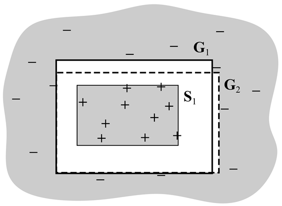

<?xml version="1.0" encoding="UTF-8" standalone="no"?>

<html xmlns="http://www.w3.org/1999/xhtml"><head><meta name="generator" content="DocBook XSL Stylesheets V1.76.1"/></head><body>

<h1 class="title"><a id="id729172"/>19. fejezet - A tudás szerepe a tanulásban</h1>

<em>Ebben a fejezetben a tanulással foglalkozunk, de csak akkor, amikor már tudunk is valamit.</em>

Az előbbi három fejezetben bemutatott tanulási módszerek mindegyikében az volt az alapötlet, hogy egy olyan függvényt konstruálunk, amelynek bemeneti/kimeneti viselkedése megegyezik azzal, amit az adatoknál megfigyeltünk. Bármilyen esetet is nézünk, a tanulási módszer tulajdonképpen nem más, mint egy megfelelő függvénynek a hipotézistérben történő megkeresése, a függvény formájára vonatkozó igen elemi feltételezésekből kiindulva. Ilyen feltételezés lehet például, hogy a függvény „egy másodrendű polinom” vagy „egy döntési fa”, vagy az az elfogultság, hogy „az egyszerűbb a jobb”. Ennek megvalósítása felért azzal, mintha azt mondanánk, hogy mielőtt valami újat tanulnánk, el kellene felejteni (majdnem) mindent, amit tudunk. Ebben a fejezetben olyan tanulási módszereket tanulmányozunk, amelyek <strong>a priori tudás</strong>ból (<strong>prior knowledge</strong>) merítenek előnyöket. Az esetek többségében az a priori tudást elsőrendű elméletek segítségével reprezentáljuk. Így most először fogjuk összekapcsolni a tudásreprezentációra és a tanulásra vonatkozó eredményeket. 

<h1 class="title"><a id="id729194"/>A tanulás logikai megfogalmazása</h1>

A 18. fejezetben a tisztán induktív tanulást olyan folyamatnak tekintettük, amely egy, az adatokkal konzisztens hipotézist keresett. Most ezt a definíciót olyan esetre pontosítjuk, amikor a hipotézist logikai állítások halmazával reprezentáljuk. A példaleírások és besorolások szintén logikai állítások, egy új példát pedig úgy tudunk osztályozni, hogy egy osztályozó állítást a hipotézisből és a példa leírásából kikövetkeztetünk. Ezzel a megközelítéssel a hipotéziseket inkrementálisan, állításonként építhetjük. A megközelítés lehetővé teszi az a priori tudás használatát is, mivel a már megismert állításokat bevethetjük új példák osztályozásába. A tanulás logikai megfogalmazásában először látszólag sok a munka, ez azonban a tanulás számos aspektusát segíti tisztázni. Ez lehetővé teszi, hogy a 18. fejezetben megismert egyszerű tanulási módszereket jócskán túlszárnyaljuk azáltal, hogy a logikai következtetés teljes erejét tanulási célokra használjuk.

<h2 class="title"><a id="id729200"/>Példák és hipotézisek</h2>

<a id="ID_783_oldal"/>
Emlékezzünk a 18. fejezetben a tanulási problémára bemutatott étterem példára: egy olyan döntési szabály megtanulására, hogy vajon érdemes-e egy asztalra várni. A példákat olyan <strong>attribútum</strong>okkal (<strong>attribute</strong>s) írtuk le, mint az <em>Alternatíva</em>, <em>Bár</em>, <em>Péntek/Szombat</em> stb. Logikai megközelítésben egy példa egy logikai állítással leírt objektum; az attribútumok pedig unáris predikátumok. Nevezzük általánosságban az <em>i</em>-edik példát <em>Xi</em>-nek. A 18.3. ábra első példáját az alábbi állítások írják le:

<code class="code"><em>Alternatíva</em>(<em>X</em>1) ∧ ¬<em>Bár</em>(<em>X</em>1) ∧ ¬<em>PéntekSzombat</em>(<em>X</em>1) ∧  <em>Éhes</em>(<em>X</em>1) ∧  …</code>

A <em>Di</em>(<em>Xi</em>) jelöléssel az <em>Xi</em> leírására fogunk hivatkozni, ahol <em>Di</em> tetszőleges, egyargumentumú logikai kifejezés lehet. Az objektumok osztályozását a

<code class="code"><em>VárjunkE</em>(<em>X</em>1)</code>

állítás végzi. Pozitív példák esetén a <em>Q</em>(<em>Xi</em>), negatív példák esetén a ¬<em>Q</em>(<em>Xi</em>) általános jelölést fogjuk használni. A teljes tanító halmaz az összes leíró és besoroló állítás konjunkciója.

Logikai megközelítésben az induktív tanulás célja a <em>Q</em> célpredikátummal ekvivalens logikai kifejezés megtalálása, amivel korrektül tudjuk a példákat osztályozni. Mindegyik hipotézis egy-egy javaslat a keresett logikai kifejezésre, amit mi a célpredikátum <strong>definíciójelölt</strong>jének (<strong>candidate definition</strong>) nevezünk. Jelöljük <em>Ci</em>-vel a definíciójelöltet, ekkor mindegyik <em>Hi</em> hipotézis egy ∀<em>x</em> <em>Q</em>(<em>x</em>) ⇔ <em>Ci</em>(<em>x</em>) formájú kifejezés. Például a döntési fa azt fejezi ki, hogy a célpredikátum egy objektum esetében csak akkor igaz, ha az <em>igaz</em>-hoz vezető egyik ága teljesül. Így a 18.6. ábrán látható döntési fa a következő logikai definíciót fejezi ki (amelyre a jövőben <em>Hr</em>-rel fogunk hivatkozni):

<code class="code">∀<em>r</em>  <em>VárjunkE</em>(<em>r</em>)    ⇔ <em>Vendégek</em>(<em>r</em>, <em>Néhány</em>)</code>

<code class="code"> ∨ <em>Vendégek</em>(<em>r</em>, <em>Tele</em>) ∧ <em>Éhes</em>(<em>r</em>) ∧ <em>Konyha</em>(<em>r</em>, <em>Francia</em>)</code>

<code class="code">∨ <em>Vendégek</em>(<em>r</em>, <em>Tele</em>) ∧ <em>Éhes</em>(<em>r</em>) ∧ <em>Konyha</em>(<em>r</em>, <em>Thai</em>)</code>

<code class="code">			∧ <em>Péntek</em>/<em>Szombat</em>(<em>r</em>)</code>

<code class="code">		 ∨ <em>Vendégek</em>(<em>r</em>, <em>Tele</em>) ∧ <em>Éhes</em>(<em>r</em>) ∧ <em>Konyha</em>(<em>r</em>, <em>Burger</em>)	(19.1)</code>

Mindegyik hipotézis azt jósolja meg, hogy példák egy bizonyos halmaza, nevezetesen azok, amelyek kielégítik a hipotézisdefiníció jelöltjét, a célpredikátumnak megfelelő példák lesznek. Ezt a halmazt a predikátum <strong>kiterjedés</strong>ének (<strong>extension</strong>) nevezzük. Két különböző kiterjedéssel rendelkező hipotézis így logikailag ellentmondásban van egymással, hiszen legalább egy példa esetén eltérő eredményt jósolnak. Ha viszont azonos a kiterjedésük, akkor logikailag ekvivalensek.

A <strong>H</strong> hipotézistér ezek után az összes olyan hipotézis {<em>H</em>1, …, <em>Hn</em>} halmaza, amelyek kezelésére a tanuló algoritmust tervezték. Például <code class="code">DÖNTÉSI-FA-TANULÁS</code> algoritmus az adott attribútumokkal kialakítható összes döntési fa hipotézissel képes foglalkozni; így hipotézistere az összes döntési fát tartalmazza. Feltehetően a tanuló algoritmus hisz abban, hogy az egyik hipotézis korrekt, azaz hisz a

<code class="code"><em>H</em>1 ∨ <em>H</em>2 ∨ <em>H</em>3 ∨ … ∨ <em>Hn</em>						(19.2)</code>

logikai kifejezésben. Ahogy a példák érkeznek, a példákkal nem <strong>konzisztens</strong> (<strong>consistent</strong>) hipotéziseket ki lehet zárni. Vizsgáljuk meg alaposabban a konzisztencia ezen fogalmát. Nyilvánvaló, hogy ha a <em>Hi</em> hipotézis a teljes tanító halmazzal konzisztens, akkor mindegyik példával konzisztensnek kell lennie. Mit jelent viszont az, hogy valamelyik példával ellentmondásban van? Ez kétféle módon történhet meg:

<ul class="itemizedlist"><li class="listitem">
A hipotézis szempontjából egy példa <strong>hamis negatív</strong> (<strong>false negative</strong>), ha a valóságban pozitív, de a hipotézis szerint negatív. Például a következő leírással rendelkező <em>X</em>13 új példa:
</li></ul>

<code class="code">		<em>Vendégek</em>(<em>X</em>13, <em>Tele</em>) ∧ <em>BecsültVárakozásE</em>(<em>X</em>13,<em> 0-10</em>) ∧ ¬<em>Éhes</em>(<em>X</em>13) ∧ … ∧ 						∧<em>VárjunkE</em>(<em>X</em>13)</code>

	a korábban definiált <em>Hr</em> hipotézis számára hamis negatív példa lesz. <em>Hr</em>-ből, illetve a példa leírásából kikövetkeztethető mind a <em>VárjunkE</em>(<em>X</em>13) – ezt állítja a példa, mind a ¬<em>VárjunkE</em>(<em>X</em>13) – ezt állítja a hipotézis. Tehát a hipotézis és a példa logikailag ellentmondásban van.

<ul class="itemizedlist"><li class="listitem">
A hipotézis szempontjából egy példa <strong>hamis pozitív</strong> (<strong>false positive</strong>), ha a valóságban negatív, de a hipotézis szerint pozitív.[<a id="id729736" href="#ftn.id729736" class="footnote">189</a>]
</li></ul>

Ha egy példa hamis negatív vagy hamis pozitív egy hipotézis szempontjából, akkor a példa és a hipotézis logikailag ellentmondásban van egymással. Feltéve, hogy a példa a tények korrekt megfigyelésén alapul, a hipotézist kizárhatjuk. Logikailag ez a következtetés a rezolúciós szabállyal pontos analógiában van (lásd 9. fejezet). Hipotézisek diszjunkciója felel meg egy klóznak, a példa pedig megfelel annak a literálisnak, amely a klózban levő egyik literálissal rezolvál. Egy szokásos logikai következtető rendszer tehát elméletileg tud példákból tanulni oly módon, hogy egy vagy több hipotézist kizár. Tegyük fel például, hogy a példát az <em>I</em>1 állítással jelöljük, és a hipotézistér <em>H</em>1<em> </em>∨ <em>H</em>2<em> </em>∨ <em>H</em>3<em> </em>∨ <em>H</em>4. Ha <em>I</em>1 ellentmondásban van <em>H</em>2-vel és <em>H</em>3-mal, akkor a logikai következtető rendszer származtatni tudja az új <em>H</em>1<em> </em>∨ <em>H</em>4 hipotézisteret.

Tehát az induktív tanulást logikai leírással olyan folyamatként jellemezhetjük, mint amelyik fokozatosan kizárja a példáknak ellentmondó hipotéziseket, leszűkítve a lehetőségek körét. Mivel a hipotézistér rendszerint nagy (vagy elsőrendű logika esetén egyenesen végtelen), nem javasoljuk egy rezolúcióalapú tételbizonyító rendszer építését és a hipotézistér teljes számbavételét. Ehelyett két megközelítést tárgyalunk, amelyek sokkal kisebb erőfeszítéssel logikailag ellentmondásmentes hipotéziseket képesek találni.

<h2 class="title"><a id="id729816"/>A pillanatnyilag legjobb hipotézis keresése</h2>

A <strong>pillanatnyilag legjobb hipotézis</strong> (<strong>current-best-hypothesis</strong>) keresési eljárás alapgondolata az, hogy egyetlen hipotézist vegyünk figyelembe, és ha új példa érkezik, akkor ennek figyelembevételével alakítsuk át a hipotézist annak érdekében, hogy az ellentmondás-mentességet fenntartsuk. Az algoritmus alapját John Stuart Mill írta le (Mill, 1843), de könnyen lehet, hogy már korábban megalkották.

Tegyük fel, hogy van valamilyen hipotézisünk, például <em>Hr</em>, amit már meglehetősen megkedveltünk. Amíg egy új példával sincs ellentmondásban, semmit sem kell tennünk. Aztán egyszer csak egy hamis negatív példa (<em>X</em>13) érkezik. Mit csináljunk? A 19.1. (a) ábra sematikusan úgy mutatja be <em>Hr</em>-t, mint egy területet, a négyszögön belül minden <em>Hr</em> kiterjedésébe tartozik. Az eddig látott példákat „+” vagy „–” jelöli, és látható, hogy <em>Hr</em> jól sorolja be az összes példát, mint <em>VárjunkE </em>pozitív vagy negatív példáit. A 19.1. (b) ábrán egy új – hamis negatív – példa jelenik meg (bekarikázva): a hipotézis azt állítja, hogy negatív, pedig valójában pozitív példa. A hipotézis kiterjedését növelni kell ahhoz, hogy tartalmazza ezt a példát is. Ezt a lépést <strong>általánosítás</strong>nak (<strong>generalization</strong>) nevezzük: egy lehetséges általánosítás a 19.1. (c) ábrán látható. Ezután a 19.1. (d) ábrán egy hamis pozitív példát látunk: a hipotézis azt állítja, hogy pozitív, pedig valójában negatív. A hipotézis kiterjedését csökkenteni kell ahhoz, hogy kizárjuk ezt a példát. Ezt <strong>szűkítés</strong>nek (<strong>specialization</strong>) nevezzük; a 19.1. (e) ábrán a hipotézis egy lehetséges szűkítését látjuk.

<a id="id729888"/>
<strong>19.1. ábra - (a) Egy konzisztens hipotézis. (b) Egy hamis negatív példa. (c) A hipotézist általánosítottuk. (d) Egy hamis pozitív példa. (e) A hipotézist szűkítettük.</strong>

Most már specifikálni tudjuk a 19.2. ábrán látható <code class="code">PILLANATNYILAG-LEGJOBB-TANULÁS</code> algoritmusát. Vegyük észre, hogy valahányszor általánosítjuk vagy szűkítjük a hipotézist, ellenőriznünk kell az összes többi példára, hiszen nincs garancia arra, hogy a kiterjedés önkényes növelése/csökkentése elkerüli bármelyik másik negatív/pozitív példa befoglalását/kirekesztését.

<a id="id729906"/>
<strong>19.2. ábra - A pillanatnyilag-legjobb-hipotézis tanuló algoritmus. Konzisztens hipotézist keres és viszszalép, ha nem található konzisztens szűkítés/általánosítás.</strong>

Az általánosítást és a szűkítést úgy definiáltuk, mint olyan műveleteket, amelyek a hipotézis <em>kiterjedését</em> változtatják meg. Most pontosan meg kell határoznunk azt, hogy ezek a műveletek hogyan implementálhatók olyan szintaktikus műveletekként, amelyek a hipotézishez rendelt definíciójelöltet úgy változtatják meg, hogy azt egy program végre tudja hajtani. Ehhez először is vegyük észre, hogy az általánosítás és a szűkítés egyben hipotézisek közötti<em> logikai</em> relációk. Ha a <em>C</em>1 definíciónak megfelelő <em>H</em>1 hipotézis a <em>C</em>2 definíciónak megfelelő <em>H</em>2 hipotézis általánosítása, akkor fenn kell állnia annak, hogy:

<code class="code">∀<em>x</em>  <em>C</em>2(<em>x</em>) ⇒ <em>C</em>1(<em>x</em>)</code>

Tehát ahhoz, hogy a <em>H</em>2 hipotézis általánosítását létrehozzuk, egyszerűen egy olyan <em>C</em>1 definíciót kell találnunk, amelyik logikailag következik <em>C</em>2-ből. Ezt könnyen megtehetjük. Ha például <em>C</em>2(<em>x</em>) <em>Alternatíva</em>(<em>x</em>) ∧ <em>Vendégek</em>(<em>x</em>, <em>Néhány</em>), akkor egy általánosítási lehetőség a <em>C</em>1(<em>x</em>) ≡ <em>Vendégek</em>(<em>x</em>, <em>Néhány</em>). Ezt <strong>feltételek törlésé</strong>nek (<strong>dropping condit</strong><strong>ions</strong>) nevezzük. Felfoghatjuk úgy, hogy egy gyengébb definíció jön létre, így a pozitív példák nagyobb halmazát teszi lehetővé. Számos egyéb általánosítási eljárás is létezik, azon nyelvtől függően, amelyen a műveleteket végezzük. Hasonlóképpen, egy hipotézist szűkíteni tudunk, ha további feltételeket adunk a hozzá tartozó definíciójelölthöz, illetve ha eltávolítunk tagokat egy diszjunktív definícióból. Lássuk, hogyan működik ez az éttermi feladatban, 18.3. ábra adatait használva:

<ul class="itemizedlist"><li class="listitem">
Az első példa – <em>X</em>1 – pozitív. <em>Alternatíva</em>(<em>X</em>1) igaz, tehát vegyük fel a következő kiinduló hipotézist:
</li></ul>

<code class="code"><em>	H</em>1: ∀<em>x</em> <em>VárjunkE</em>(<em>x</em>) ⇔ <em>Alternatíva</em>(<em>x</em>)</code>

<ul class="itemizedlist"><li class="listitem">
A második példa – <em>X</em>2 – negatív. <em>H</em>1 alapján pozitív lenne, így hamis pozitív. Ezért szűkítenünk kell <em>H</em>1-et. Ezt megtehetjük például úgy, hogy egy olyan további feltételt adunk hozzá, amely feltétel kizárja <em>X</em>2-t. Egy lehetőség:
</li></ul>

<code class="code"><em>	H</em>2: ∀<em>x</em> <em>VárjunkE</em>(<em>x</em>) ⇔ <em>Alternatíva</em>(<em>x</em>) ∧ <em>Vendégek</em>(<em>x</em>, <em>Néhány</em>)</code>

<ul class="itemizedlist"><li class="listitem">
A harmadik példa – <em>X</em>3 – pozitív. <em>H</em>2 alapján negatív lenne, így hamis negatív. Tehát általánosítanunk kell <em>H</em>2-t. Ezt elérhetjük, ha töröljük <em>Alternatíva</em> feltételt, amely a következő hipotézisre vezet:
</li></ul>

<code class="code"><em>	H</em>3: ∀<em>x</em> <em>VárjunkE</em>(<em>x</em>) ⇔ <em>Vendégek</em>(<em>x</em>, <em>Néhány</em>)</code>

<ul class="itemizedlist"><li class="listitem">
A negyedik példa – <em>X</em>4 – pozitív. <em>H</em>3 alapján negatív lenne, így hamis negatív. Így általánosítanunk kell <em>H</em>3-at. Nem törölhetjük <em>Vendégek</em> feltételt, mert ez egy mindent tartalmazó hipotézishez vezetne, ami ellentmondásban van <em>X</em>2-vel. Egyik lehetőség a következő diszjunkció bevezetése:
</li></ul>

<code class="code"><em>	H</em>4: ∀<em>x</em> <em>VárjunkE</em>(<em>x</em>) ⇔ <em>Vendégek</em>(<em>x</em>, <em>Néhány</em>)</code>

<code class="code">		∨ (<em>Vendégek</em>(<em>x</em>, <em>Tele</em>) ∧ <em>Péntek</em>/<em>Szombat</em>(<em>x</em>))</code>

A hipotézis ezek után már kezd ésszerűnek tűnni. Nyilvánvaló, hogy más lehetőségek is vannak, amelyek konzisztensek az első négy példával, kettő ezek közül:

	

A <code class="code">PILLANATNYILAG-LEGJOBB-TANULÁS</code> algoritmusát nem determinisztikusan írjuk le, mivel bármely ponton számos olyan szűkítési vagy általánosítási lehetőség lehet, melyek bármelyikét alkalmazhatjuk. A már meghozott döntések nem szükségszerűen vezetnek a legegyszerűbb hipotézishez, sőt olyan megoldhatatlan szituációhoz is vezethetnek, amelyben nincs a hipotézisnek olyan egyszerű módosítása, amely minden adattal konzisztens hipotézist állít elő. Ilyen esetekben a programnak egy előző választási ponthoz kell visszalépnie.

A <code class="code">PILLANATNYILAG-LEGJOBB-TANULÁS</code> algoritmusát – és különböző változatait – számos gépi tanulást felhasználó rendszerben alkalmazták, először Patrick Winston (Winston, 1970) „ív-tanuló” programjában. Azonban ha a tér nagy, és nagyszámú példával dolgozunk, akkor bizonyos nehézségek merülnek fel:

<ol class="orderedlist"><li class="listitem">
Az összes előző példa újraellenőrzése minden egyes módosításnál nagyon munkaigényes.
</li><li class="listitem">
Nehéz jó keresési heurisztikát találni, és a visszalépések örökké tarthatnak. Mint a 18. fejezetben már láttuk, a hipotézistér kétszeresen exponenciálisan nagy tér lehet.
</li></ol>

<h2 class="title"><a id="id730361"/>Legkisebb megkötés elvű keresés</h2>

A visszalépésre azért van szükség, mert a „pillanatnyilag-legjobb-hipotézis” eljárásban <em>választani</em> kell egy legjobb becslést, egy partikuláris hipotézist, akkor is, ha még nincs elég adatunk ahhoz, hogy biztosak legyünk a választásunk helyességében. Ehelyett azt tehetjük, hogy az összes olyan és csak olyan hipotézist megtartjuk, amelyek az eddigi adatainkkal konzisztensek. Ezek után mindegyik új eset vagy nincs hatással, vagy kizár néhányat a hipotéziseink közül. Emlékezzünk arra, hogy a hipotézistér egy diszjunktív állításnak tekinthető:

<code class="code"><em>H</em>1 ∨ <em>H</em>2 ∨ <em>H</em>3 ∨ … ∨ <em>H</em><em>n</em> </code>

Ahogy egyre több hipotézis bizonyul a példákkal inkonzisztensnek, ez a diszjunktív állítás zsugorodik, csak azokat a hipotéziseket tartva meg, amelyeket nem szűrtünk ki. Feltéve, hogy az eredeti hipotézistér tartalmazza a helyes választ, a redukált diszjunktív állításnak is szükségszerűen tartalmaznia kell azt, hiszen csak inkorrekt hipotéziseket szűrtünk ki. A megmaradt hipotézisek halmazát nevezzük <strong>verziótér</strong>nek (<strong>version space</strong>). Az ilyen elven működő tanulási algoritmust (amelyet a 19.3. ábrán vázoltunk fel) verziótér tanulási algoritmusnak (más néven <strong>jelölteltávolítás</strong>i –<strong> candidate elimination</strong> – algoritmusnak) nevezzük.

<a id="id730421"/>
<strong>19.3. ábra - Verziótér tanuló algoritmus. <em>V</em>-nek olyan részhalmazát tanulja meg, amelynek elemei a <em>példák</em>kal konzisztensek.</strong>

Fontos tulajdonsága ennek a megközelítésnek, hogy <em>inkrementális:</em> soha nem kell visszalépnünk és újravizsgálnunk a régi példákat. Az összes megmaradt hipotézis garantáltan konzisztens az összes példával. Másrészt <strong>legkisebb megkötés elv</strong>ű (<strong>least commitment</strong>) algoritmusnak is nevezhetjük, ugyanis nem tesz önkényes választásokat (vö. a 11. fejezetben található részben rendezett tervkészítő algoritmussal). Van viszont egy nyilvánvaló probléma. Már leszögeztük, hogy a hipotézistér óriási, hogyan tudjuk akkor leírni ezt az óriási diszjunktív állítást?

<a id="id730455"/>
<strong>19.4. ábra - A verziótér a példákkal konzisztens összes hipotézist tartalmazza</strong>

A következő egyszerű analógia sokat segít a megértésben. Hogyan ábrázoljuk az öszszes 1 és 2 közé eső valós számot? Végül is végtelen sok ilyen van! A megoldás az intervallumábrázolás, amelyik csak a halmaz határait specifikálja: [1, 2]. Ez azért működik, mert a valós számok felett értelmezett egy <em>rendezés</em>.

A hipotézistér felett is rendelkezünk rendezéssel, nevezetesen az általánosítás/szűkítés alapján. Ez egy részleges rendezés, ami azt jelenti, hogy a határ nem egy pont, hanem a hipotézisek egy halmaza: a <strong>határhalmaz</strong> (<strong>boundary set</strong>). A nagyszerű a dologban az, hogy a teljes verziótér reprezentálható csupán két határhalmaz: egy legáltalánosabb határhalmaz (a <strong>G halmaz</strong>) és egy legszűkebb határhalmaz (az <strong>S halmaz</strong>) segítségével. <em>E kettő közé eső bármely hipotézis garantáltan konzisztens az összes példával</em>. Mielőtt ezt bizonyítjuk, röviden foglaljuk össze az eddigieket:

<ul class="itemizedlist"><li class="listitem">
A jelenlegi verziótér azon hipotézisek halmaza, amelyek az összes eddigi példával konzisztensek. Ezt az S halmaz és a G halmaz segítségével ábrázoljuk, mindkettő a hipotézisek valamilyen halmaza.
</li><li class="listitem">
Az S halmaz összes eleme konzisztens az összes eddigi megfigyeléssel, és nincs ennél szűkebb konzisztens hipotézis.
</li><li class="listitem">
A G halmaz összes eleme konzisztens az összes eddigi megfigyeléssel, és nincs ennél általánosabb konzisztens hipotézis.
</li></ul>

Azt kívánjuk meg, hogy a kezdeti tér (mielőtt bármelyik példát megvizsgáltuk volna), az összes elképzelhető hipotézist tartalmazza. Ezt úgy biztosítjuk, hogy a G halmazt egyszerűen az <em>Igaz</em> értékre állítjuk (az a hipotézis, amely mindent tartalmaz), az S halmazt pedig egyszerűen a <em>Hamis</em> értékre állítjuk (az a hipotézis, amelynek kiterjedése üres).

A 19.4. ábra a verziótér határhalmazokkal való ábrázolásának általános struktúráját mutatja. Ahhoz, hogy megmutassuk, hogy ez az ábrázolás elégséges, két tulajdonságra van szükségünk:

<ol class="orderedlist"><li class="listitem">
Mindegyik konzisztens hipotézis (amelyik nem valamelyik határhalmaz eleme) szűkebb, mint a G halmaz valamelyik eleme, és általánosabb, mint az S halmaz valamelyik eleme. (Azaz nincsenek kívül „kóbor” elemek.) Ez közvetlenül következik az <em>S</em> és <em>G</em> definíciójából. Ha lenne egy kóbor <em>h</em>, akkor az vagy nem lehetne szűkebb <em>G</em> valamely eleménél, tehát <em>G</em>-hez kellene tartoznia, vagy nem lehetne általánosabb <em>S</em> valamely eleménél, ebben az esetben viszont <em>S</em>-hez tartozna.
</li><li class="listitem">
Mindegyik hipotézis, amelyik szűkebb a G halmaz valamely eleménél, és általánosabb az S halmaz valamely eleménél, konzisztens hipotézis (azaz a határok között nincsenek „lyukak”). Bármely – az <em>S</em> és <em>G</em> közé eső – <em>h</em>-nak az összes olyan negatív példát vissza kell utasítania, amelyet <em>G</em> minden egyes tagja visszautasít (mivel szűkebb), ugyanakkor el kell fogadnia az összes pozitív példát, amelyet az <em>S</em> akármelyik tagja elfogad (mivel általánosabb). Így <em>h</em> az összes példát jól kezeli, tehát nem lehet inkonzisztens. A 19.5. ábra mutatja be a helyzetet: nincs ismert példa, amely <em>S</em>-en kívül, de <em>G</em>-n belül helyezkedik el, így a kettő közt elhelyezkedő összes hipotézisnek konzisztensnek kell lennie.
</li></ol>

<a id="id730588"/>
<strong>19.5. ábra - A <em>G</em> és az <em>S</em> elemeinek kiterjesztései. A kettő között nem található ismert példa.</strong>

Bemutattuk tehát, hogy <em>ha</em> <em>S</em>-t és <em>G</em>-t definíciójuknak megfelelően kezeljük, akkor a verziótér kielégítő leírását adják. Az egyetlen hátralévő probléma, hogy hogyan <em>módosítsuk</em> <em>S</em>-t és <em>G</em>-t egy új példa esetén (a <code class="code">VERZIÓ-TÉR-MÓDOSÍTÁS</code> függvény feladata). Elsőre ez meglehetősen bonyolultnak tűnik, de a definíciók és a 19.4. ábra alapján nem túl nehéz az algoritmus előállítása.

Az S és G halmazok <em>Si </em>és <em>Gi</em> elemeivel kell foglalkoznunk. Az új példa bármelyik esetén lehet hamis pozitív vagy hamis negatív.

<ol class="orderedlist"><li class="listitem">
<em>Si</em>-re hamis pozitív. Azt jelenti, hogy <em>Si</em> túl általános, de mivel <em>Si</em>-nek (a definíciója értelmében) nincs konzisztens szűkítése, így <em>Si</em>-t eltávolítjuk az S halmazból.
</li><li class="listitem">
<em>Si</em>-re hamis negatív. Azt jelenti, hogy <em>Si</em> túl szűk, így <em>Si</em>-t az összes közvetlen általánosításával helyettesítjük, feltéve, hogy ezek szűkebbek, mint <em>G</em> egyes elemei.
</li><li class="listitem">
<em>Gi</em>-re hamis pozitív. Azt jelenti, hogy <em>Gi</em> túl általános, így az összes közvetlen szűkítésével helyettesítjük, feltéve, hogy ezek általánosabbak, mint <em>S</em> egyes elemei.
</li><li class="listitem">
<em>Gi</em>-re hamis negatív. Azt jelenti, hogy <em>Gi</em> túl szűk, de mivel nincs konzisztens általánosítása (definíciója értelmében), így <em>Gi</em>-t eltávolítjuk a G halmazból.
</li></ol>

Ezeket a műveleteket minden új példára elvégezzük addig, amíg az alábbi három eset valamelyike fel nem lép:

<ol class="orderedlist"><li class="listitem">
Pontosan egy hipotézis marad a verziótérben, ebben az esetben ezt adjuk vissza mint az egyetlen hipotézist.
</li><li class="listitem">
A verziótér <em>összeomlik</em> – vagy S, vagy G üressé válik, azt jelezve, hogy nincs a tanító halmazra nézve konzisztens hipotézis. Ez megegyezik az egyszerű döntési fa algoritmus sikertelen kimenetelével.
</li><li class="listitem">
Kifogyunk a példákból, miközben számos hipotézis maradt a verziótérben. Ez azt jelenti, hogy a verziótér a hipotézisek diszjunkcióját reprezentálja. Ha egy új példa esetén a diszjunkció összes tagjában azonos eredményt kapunk, akkor ezt adhatjuk vissza mint a példa besorolását. Ha az eredmények nem egyeznek meg, akkor egyik lehetőségként alkalmazhatjuk a többségi szavazást.
</li></ol>

Gyakorlás céljára hagyjuk a <code class="code">VERZIÓ-TÉR-TANULÁS</code> algoritmusnak az éttermi adatokra való alkalmazását.

A verziótér megközelítésnek két alapvető hátránya van:

<ul class="itemizedlist"><li class="listitem">
Ha a problématerület adatai zajt tartalmaznak, vagy ha az attribútumok a pontos besoroláshoz nem elégségesek, akkor a verziótér mindig összeomlik.
</li><li class="listitem">
Ha korlátlan méretű diszjunkciót megengedünk a hipotézistérben, akkor az S halmaz mindig tartalmazni fog egy egyedi legszűkebb hipotézist, nevezetesen az összes eddig látott pozitív példa diszjunkcióját. Hasonlóképpen a G halmaz tartalmazni fogja a negatív példák diszjunkciójának negáltját.
</li><li class="listitem">
Egyes hipotézistereknél az S- és a G-beli elemek száma az attribútumok számában exponenciálisan növekedhet annak ellenére, hogy az ilyen hipotézisterekhez ismertek hatékony tanuló algoritmusok.
</li></ul>

A zaj problémájára napjainkig nem ismert teljes, sikeres megoldás. A diszjunktív kapcsolatok problémája kezelhető oly módon, hogy csak korlátozott méretű diszjunktív formákat engedünk meg, vagy az általánosabb predikátumokra egy <strong>általánosítási hie</strong><strong>rarchiá</strong>t (<strong>generalization hierarchy</strong>) vezetünk be. Például a <em>BecsültVárakozás</em>(<em>x</em>, <em>30-60</em>) ∨  <em>BecsültVárakozás</em>(<em>x</em>, &gt;60) helyett használhatjuk a <em>HosszúVárakozás</em>(<em>x</em>) literált. Az általánosítási és a szűkítési műveletek egyszerűen kiterjeszthetők ennek kezelésére.

A verziótér algoritmus tiszta változatát először a Meta-<code class="code">DENDRAL</code> rendszerben alkalmazták. Ezt a rendszert olyan szabályok megtanulására tervezték, amelyek azt írják le, hogy egy tömegspektrométerben a molekulák hogyan esnek szét darabokra (Buchanan és Mitchell, 1978). A Meta-<code class="code">DENDRAL</code> képes volt olyan szabályok generálására, amelyek elég újak voltak egy analitikus kémiával foglalkozó újságban való publikálhatósághoz. Ezek voltak az első – egy számítógépes program által felfedezett – valós tudományos eredmények. Az algoritmust az elegáns <code class="code">LEX</code> rendszerben (Mitchell és társai, 1983) szintén használták, ez a rendszer saját sikereinek és kudarcainak tanulmányozása alapján szimbolikus integrálási problémák megoldásának megtanulására volt képes. Bár a verziótér-módszerek valószínűleg a legtöbb valós probléma tanulása esetén – főleg a zaj miatt – nem praktikusak, jó betekintést adnak a hipotézistér logikai szerkezetébe.

 

[<a id="ftn.id729736" href="#id729736" class="para">189</a>]  „Hamis pozitív” és „hamis negatív” kifejezéseket először a gyógyításban használták arra, hogy a téves laboratóriumi eredményeket jellemezzék. Egy eredmény akkor hamis pozitív, ha azt jelzi, hogy a páciens az adott betegségben szenved, míg valójában nem ez a helyzet.

</body></html>
