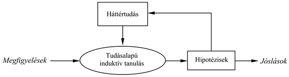

<?xml version="1.0" encoding="UTF-8" standalone="no"?>

<html xmlns="http://www.w3.org/1999/xhtml"><head><meta name="generator" content="DocBook XSL Stylesheets V1.76.1"/></head><body>

<h1 class="title"><a id="id730844"/>A tudás szerepe a tanulásban</h1>

Az előbbi részben az induktív tanulás egyszerű sémájával foglalkoztunk. Ahhoz, hogy a háttértudás szerepét megérthessük, beszélnünk kell a hipotézisek, a példaleírások és a besorolások közötti kapcsolatról. Jelölje a <em>Leírások</em> az összes példaleírás konjunkcióját és a <em>Besorolások</em> a példabesorolások konjunkcióját. A „megfigyelést megmagyarázó” <em>Hipotézis-</em>nek akkor a következő tulajdonsággal kell rendelkeznie (emlékezzünk, hogy a ⊨ jelentése a „logikailag maga után vonz”):

<code class="code"><em>Hipotézis</em> ∧ <em>Leírások</em> ⊨ <em>Besorolások		</em>			(19.3)</code>

Az ilyen kapcsolatot, ahol a <em>Hipotézis</em> az „ismeretlen”, <strong>vonzatkényszer</strong>nek (<strong>entailment constraint</strong>) nevezzük. Ennek a kényszernek a megoldása a tiszta induktív tanulás, amikor a <em>Hipotézis</em>-t valamilyen előre definiált hipotézistérből vesszük. Ha például a döntési fát logikai formulának tekintjük (lásd <a class="xref" href="ch19.md#ID_783_oldal">„Példák és hipotézisek”</a> részben (19.1) képlet), akkor egy döntési fa, amely az összes példával konzisztens, kielégíti a (19.3) képletet. Természetesen abban az esetben, ha a hipotézisek logikai formáját semmiben <em>nem</em> korlátozzuk, a <em>Hipotézis</em> = <em>Besorolások </em>szintén teljesíti a kényszert. Általában az Ockham borotvája elve azt sugallja, hogy <em>kis</em> konzisztens hipotéziseket kellene előnyben részesíteni, valami jobbat kell tehát kitalálnunk annál, minthogy csupán a példákat memorizáljuk.

<h3 class="title">Fontos</h3>
Az induktív tanulás ezen egyszerű képe az 1980-as évek elejéig uralkodott. A korszerű megközelítés az, hogy olyan ágenseket tervezünk, amelyek <em>már tudnak valamit, </em>és amelyek igyekeznek, hogy még többet tudjanak. Lehet, hogy ez nem tűnik félelmetesen mély gondolatnak, azonban igen nagy különbséget jelent, ha az ágensek tervezését tekintjük. Sőt az is lehet, hogy ez a megközelítés valamilyen mértékben hozzájárul annak megértéséhez, hogy a tudomány maga hogyan működik. Az általános séma a 19.6. ábrán látható.

<a id="id730920"/>
<strong>19.6. ábra - A kumulatív tanulási folyamat felhasználja és idővel folyamatosan bővíti a háttértudás készletét</strong>

Amennyiben egy háttértudást felhasználó autonóm tanuló ágenst szeretnénk felépíteni, az ágensnek legelőször valamilyen módszerrel meg kell szereznie a háttértudást, hogy utána azt az új tanulási epizódokban felhasználhassa. E módszernek önmagában is egy tanulási folyamatnak kell lennie. Az ágens életútját így <em>kumulatív</em> vagy <em>inkrementális</em> fejlődés jellemzi. Az ágens feltételezhetően a semmiből kezdhet, egy jó kis induktív program mintájára. Ha egyszer azonban evett már a Tudás Fájából, többé ilyen naiv spekulációra nem adhatja a fejét, és a háttértudást a minél hatásosabb tanulásra kell fordítania. A kérdés most az, hogyan tudjuk ezt megvalósítani.

<h2 class="title"><a id="id732602"/>Néhány egyszerű példa</h2>

Nézzünk néhány „józan ész” példát a háttértudás felhasználásával történő tanulásra. Sok, a következtetésen alapuló, látszólag racionális viselkedésről ki fog derülni, hogy ha a megfigyeléseket is figyelembe kell venni, nyilvánvaló lesz, hogy az ágens nem a tiszta indukció egyszerű elvét követi.

<ul class="itemizedlist"><li class="listitem">
Néha az általános konklúziót már egyetlenegy megfigyelés alapján megfogalmazhatjuk. Gary Larson egy karikatúrájában Zog, a szemüveges ősember egy fanyárs végére tűzött gyíkot süt a tűz felett. Kevésbé intelligens barlangtársainak bámulatba ejtett csoportja figyeli: ők az ennivalót a tűz felett csupasz kezükben tartják. Ez a megvilágosító tapasztalat elegendő, hogy a csoport tagjai a fájdalommentes főzés elvét elsajátítsák.
</li><li class="listitem">
Vagy vegyük például a Brazíliába érkező utazó esetét, amikor is az első brazil bennszülöttel találkozik. Hallván, hogy az portugálul beszél, utazónk egyből megállapítja, hogy Brazíliában mindenki beszél portugálul, felfedezvén azonban, hogy a bennszülöttet Fernandónak hívják, ezt a felfedezését az összes brazil férfira egyáltalán nem terjeszti ki. Hasonló esetek a tudományra is jellemzők. Amikor például egy kezdő fizikushallgató egy adott hőmérsékletű rézmintának a sűrűségét és az elektromos vezetőképességét méri, a mérési eredményeket magabiztosan általánosítja a réz minden lehetséges darabkájára. Ha azonban a minta tömegét méri, meg sem fordul a fejében, hogy más rézdarabkáknak is ez lenne a tömege. Ez az általánosító feltevés viszont egészen értelmes lenne, ha például az amerikai 1 centes érmékről lenne szó.
</li><li class="listitem">
Végül vegyük egy gyógykezelésben járatlan, diagnosztikai szempontból azonban képzett orvostanhallgató esetét, aki egy páciens és egy szakértő belgyógyász konzultációját figyeli. Egy sor kérdés és felelet után a szakértő egy bizonyos antibiotikumos gyógykezelést ír elő a páciens részére. A hallgatónk azt az általános szabályt fogalmazza meg, hogy ez a konkrét antibiotikum hatásos erre a konkrét típusú fertőzésre.
</li></ul>

<h3 class="title">Fontos</h3>
Ezek mind olyan esetek, amikor <em>a háttértudás felhasználása sokkal gyorsabb tanulást tesz lehetővé ahhoz képest, mint amit a tisztán induktív programtól el lehetne várni</em>.

<h2 class="title"><a id="id732630"/>Néhány általános séma</h2>

Az előző példákban azért fordulunk a háttértudáshoz, hogy a megválasztott általánosítást megpróbáljuk igazolni. Most azt nézzük meg, mik azok a vonzatkényszerek, amelyek ott rejtőznek. A kényszerek a <em>Hipotézis</em>-en, a megfigyelt <em>Leírások</em>-on és a <em>Besorolások</em>-on kívül a <em>Háttértudás</em>-ra is kiterjednek.

A gyíksütés esetén az ősemberek úgy általánosítottak, hogy <em>megmagyarázták</em> a nyárs sikerét: a nyárs megtartja a gyíkot a tűz felett, miközben a kéz sértetlen marad. Ebből a magyarázatból azt az általános szabályt vonhatják le, hogy egy hosszú, merev, hegyes objektum alkalmas a kis, puha testű, ehető dolgok sütéséhez. Az ilyen általánosító folyamatot <strong>magyarázatalapú tanulás</strong>nak vagy <strong>MAT</strong>-nak (<strong>explanation-based lear</strong><strong>ning</strong>, <strong>EBL</strong>) nevezzük. Figyeljük meg, hogy az általános szabály az ősemberek birtokában lévő háttértudásból <em>logikai módon következik</em>. A MAT által teljesített vonzatkényszerek tehát a követezők:

<code class="code"><em>Hipotézis</em> ∧  <em>Leírások</em> ⊨ <em>Besorolások</em></code>

<code class="code"><em>Háttértudás</em> ⊨ <em>Hipotézis</em></code>

<h3 class="title">Fontos</h3>
Az első kényszer a (19.3) képlettel megegyezik, azért a MAT-ot eredetileg a példákból való tanulás jobb módszerének tekintették. Azonban amiatt, hogy a háttértudásnak elegendőnek kell lennie a <em>Hipotézis</em> megmagyarázásához is, ami viszont a megfigyelést magyarázza meg, <em>a megfigyelt esetből az ágens igazából semmi tényszerűen újat nem tanul</em>. Az ágens a példát akár ki is <em>következtethette</em> <em>volna</em> az ismert tudásanyag alapján, bár elképzelhető, hogy ez elfogadhatatlan mennyiségű számítással járt volna együtt. Újabban a MAT-ot úgy tekintik, mint az egyik olyan módszert, amely elsődleges elméleteknek speciális célú tudásba való konvertálását végzi. A MAT algoritmussal a 19.3. alfejezetben foglalkozunk.

A Brazíliába utazónak egészen más a helyzete. Az utas szükségszerűen nem is képes megmagyarázni, hogy Fernando miért beszél úgy, ahogy beszél, amíg az idevágó pápai bullákat nem ismeri. Az általánosításra azonban képes lesz a történelemben teljesen járatlan utas is. Ebben az esetben a releváns háttértudás az, hogy minden egyes országban az emberek többsége ugyanazt a nyelvet beszéli. Azt azonban nem tételezzük fel, hogy minden brazil embert Fernandónak hívnak, mert az effajta szabályosság a nevekre nem vonatkozik. Hasonlóképpen, az elsőéves fizikushallgató is nehezen tud magyarázatot adni a réznél felfedezett vezetési és sűrűségi értékekre. Azt azonban tudja, hogy a vezetést az objektum anyaga és annak hőmérséklete határozza meg együttesen. Mindegyik esetben az <em>a priori</em> <em>Háttértudás</em> szerepe az, hogy a célpredikátum szempontjából <strong>releváns</strong> tulajdonsághalmazok körülhatárolhatók legyenek. Ez a tudás <em>megfigyelésekkel együtt</em> lehetővé teszi, hogy az ágens új, általános szabályt hozzon létre megfigyeléseinek megmagyarázására:

<code class="code"><em>Hipotézis</em> ∧<em> Leírások</em> ⊨ <em>Besorolások</em></code>

<code class="code"><em>Háttertudás </em>∧ <em>Leírások </em>∧ <em>Besorolások </em>⊨ <em>Hipotézis</em>			(19.4)</code>

Ezt a fajta általánosítást <strong>relevanciaalapú tanulás</strong>nak vagy <strong>RAT</strong>-nak (<strong>relevance-based learning</strong>, <strong>RBL</strong>) nevezzük (bár ez az elnevezés még nem mondható teljesen elfogadottnak). Vegyük észre, hogy annak ellenére, hogy a RAT a megfigyelések tartalmát felhasználja, a megfigyelések és a háttértudás logikai tartalmán túlmutató hipotéziseket nem eredményez. Ez a tanulás egy <em>deduktív</em> formája, és egymagában nem lehet felelős új tudásanyagnak az alapokból való létrehozásáért. 

A szakértőt figyelő orvostanhallgató esetében feltételezzük, hogy a hallgató előzetes tudása elegendő ahhoz, hogy a páciens <em>D</em> betegségét a tünetekből megállapítsa. Ez azonban nem elegendő annak indoklására, hogy az orvos miért éppen az <em>M</em> orvosságot írta fel. A hallgatónak egy másik szabályt kell javasolnia, azaz, hogy az <em>M</em> orvosság a <em>D</em>-vel szemben hatásos. Ezzel a szabállyal és a hallgató előzetes tudásával most már képes magyarázatot adni, hogy az orvos ebben a konkrét esetben miért az <em>M</em> gyógyszert írja fel. A példát általánosíthatjuk egy vonzatkényszer megadásával:

<code class="code"><em>Háttértudás</em> ∧ <em>Hipotézis</em> ∧ <em>Leírások </em>⊨ <em>Besorolások		   </em>(19.5)</code>

<h3 class="title">Fontos</h3>
<em>Példák magyarázatát tehát a háttértudás és az új hipotézis együttesen adja meg</em>.
A tisztán induktív tanuláshoz hasonlóan a tanuló algoritmusnak a lehető legegyszerűbb és a kényszerekkel konzisztens hipotéziseket kellene előállítania. A (19.5) kényszert teljesítő algoritmusokat <strong>tudásalapú induktív tanulás</strong>nak vagy <strong>TIT</strong>-nek (<strong>knowledgebased inductive learning</strong>, <strong>KBIL</strong>) nevezzük.

A 19.5. alfejezetben részletesen leírt TIT algoritmusokat főleg az <strong>induktív logikai programozás</strong>, <strong>ILP</strong> (<strong>inductive logical programming</strong>) területén tanulmányozták. Az előzetes tudásnak egy ILP-rendszerben két kulcsszerepe van a tanulás komplexitásának csökkentésében:

<ol class="orderedlist"><li class="listitem">
Tekintettel arra, hogy a megfogalmazott hipotézisek mindegyikének konzisztensnek kell lennie a megfigyelésekkel és az előzetes tudással is, ténylegesen egy redukált hipotézistérrel van dolgunk, hiszen ez a hipotézistér csakis azokat az elméleteket tartalmazza, amelyek az eddig ismert dolgokkal konzisztensek.
</li><li class="listitem">
Bármilyen adott megfigyeléshalmaz esetén a megfigyelések magyarázatát megadó hipotézis lényegesen redukált méretű lehet, hiszen a megfigyeléseket magyarázó új szabályok meghatározásához az előzetes tudás is rendelkezésünkre áll. Viszont minél kisebb a hipotézis, annál könnyebb azt megtalálni.
</li></ol>

Az a priori tudás befogadásán túl, az ILP-rendszerek képesek arra, hogy hipotéziseket általános elsőrendű logikában és nem a 18. fejezetben használt, korlátozott attribútumalapú nyelven fogalmazzák meg. Ez azt is jelenti, hogy az ILP-rendszerek képesek olyan környezetekben tanulni, amelyek érthetetlenek az egyszerűbb rendszerek számára.

</body></html>
