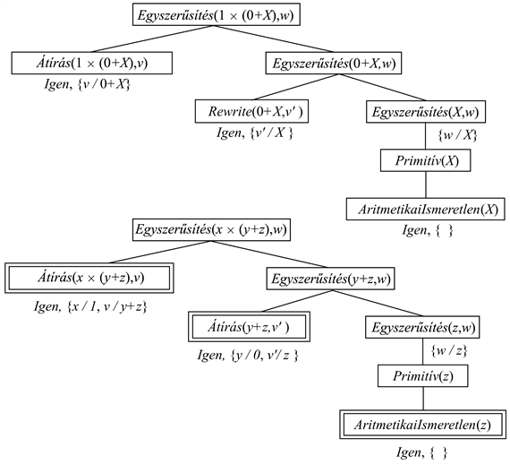

<?xml version="1.0" encoding="UTF-8" standalone="no"?>
<!DOCTYPE html PUBLIC "-//W3C//DTD XHTML 1.1//EN" "http://www.w3.org/TR/xhtml11/DTD/xhtml11.dtd">
<html xmlns="http://www.w3.org/1999/xhtml"><head><meta name="generator" content="DocBook XSL Stylesheets V1.76.1"/></head><body>

<h1 class="title"><a id="id732889"/>Magyarázatalapú tanulás</h1>

Ahogy a fejezet bevezetőjében elmagyaráztuk, a magyarázatalapú tanulás olyan módszer, ami megfigyelésekből általános szabályokat nyer ki. Tekintsük például az algebrai kifejezések egyszerűsítését és differenciálását (lásd 9.15. feladat). <em>X</em>2-et <em>X</em> szerint differenciálva 2<em>X</em>-et kapunk (vegyük észre, hogy az aritmetikai ismeretlent nagy <em>X</em> betűvel jelöljük az <em>x</em> logikai változótól megkülönböztetve). Egy logikai következtető rendszerben a célt így a <code class="code">KÉRDEZ</code>(<em>Derivált</em>(<em>X</em>2, <em>X</em>) = <em>d</em>, <em>TB</em>) kifejezéssel fejezhetjük ki, ahol a megoldás a <em>d </em>= 2<em>X</em>.

Bárki, aki a differenciálszámítást ismeri, a megoldást „ránézésre” tudja. Az ilyen problémákkal első alkalommal találkozó hallgatónak vagy netán a tapasztalatot nélkülöző programnak sokkal nehezebb lesz a dolga. A differenciálás közismert szabályai segítségével a kifejezést előbb-utóbb az 1 × (2 × (<em>X</em>(2–1))) alakra lehet hozni, és ez előbb-utóbb elvezet minket a 2<em>X</em>-hez. A szerzők logikai programjának ez 136 bizonyítási lépésbe került, amiből 99 lépés a bizonyítás zsákutca elágazásaira esett. Ezt tapasztalva azt szeretnénk, ha a program ugyanennek a problémának a megoldását a következő alkalommal lényegesen gyorsabban adná meg.

A <strong>memoizálás</strong> (<strong>memoization</strong>) módszerét a számítógép-tudományban régóta alkalmazzák, miszerint a számítások meggyorsíthatók az eredmények eltárolása révén. A memofüggvény alapgondolata, hogy bemenet/kimenet párokat gyűjtünk ki egy külön adatbázisba. Meghíváskor a függvény először megvizsgálja az adatbázist, hátha a probléma teljes újbóli megoldását így meg tudja kerülni. A magyarázatalapú tanulás ezt az ötletet továbbfejleszti úgy, hogy egy <em>általános</em> szabályt fogalmaz meg, amely az esetek egész osztályát képes lefedni. A differenciálás esetében a memoizálás emlékezne ugyan arra, hogy az <em>X</em>2-nek <em>X</em> szerinti deriváltja 2<em>X</em>, a <em>Z</em>2 <em>Z</em> szerinti deriváltjának kiszámítását azonban teljes egészében az ágensre hagyná. Célszerű lenne, ha egy olyan általános szabályt[<a id="id732997" href="#ftn.id732997" class="footnote">190</a>] tudnánk megfogalmazni, amely minden lehetséges <em>u</em> aritmetikai ismeretlen esetén megadná, hogy az <em>u</em>2-nek <em>u</em> szerint deriváltja 2<em>u</em>. A logikában ezt az alábbi szabállyal fejezhetjük ki:

<code class="code"><em>AritmetikaiIsmeretlen</em>(<em>u</em>) ⇒ <em>Derivált</em>(<em>u</em>2, <em>u</em>) = 2<em>u</em></code>

Ha a tudásbázis rendelkezik egy ilyen szabállyal, akkor minden új eset, ami a szabály egy példánya, azonnal megoldható.

<h3 class="title">Fontos</h3>
Természetesen ez csupán egy triviális példa egy igen általános jelenségre. Ha egyszer megértettünk valamit, azt általánosítva más körülmények között is felhasználhatjuk. Egy „nyilvánvaló” megoldási lépést kapunk, amely építőkockaként felhasználható bonyolultabb problémák megoldásában. Alfred North Whitehead, aki Bertrand Russell-lel együtt a <em>Principia Mathematica</em> társszerzője – talán a Zog felfedezése jellegű események megértéséhez saját magára alkalmazva a MAT elvét – azt írta, hogy <em>„A civilizáció azáltal halad előre, hogy szaporítja azoknak a fontos cselekvéseknek a számát, amelyeket gondolkodás nélkül véghezvihetünk”</em> (Whitehead, 1911). Ha ön, kedves olvasó, a deriválási példa lényegét megértette, akkor az agya már buzgón azon dolgozik, hogy megkísérelje a magyarázatalapú tanulás általános elvét kinyerni ebből a példából. Figyelje meg, hogy hacsak nem lényegesen okosabb a szerzőknél, a magyarázatalapú példa bemutatása előtt <em>még nem</em> ismerte fel a MAT-ot. A Zogot figyelő ősemberekhez hasonlóan önnek (és nekünk is) egy példát kellett látnunk, mielőtt az alapelvet meg tudtuk fogalmazni. Ez azért van így, mert <em>megmagyarázni,</em> hogy <em>miért</em> jó egy ötlet, sokkal könnyebb, mint magát az ötletet megfogalmazni.

<h2 class="title"><a id="id733076"/>Általános szabályok kinyerése példákból</h2>

A MAT alapötlete az, hogy először az előzetes tudásra alapozva megkonstruáljuk a megfigyelés magyarázatát, majd meghatározzuk annak az esetosztálynak a definícióját, amelyre a megkonstruált magyarázat alkalmazható. A definíció alapul szolgál az osztály eseteit lefedő szabály számára. A „magyarázat” lehet egy logikai bizonyítás, de általánosságban lehet akármilyen következtetési vagy problémamegoldó folyamat, feltéve, hogy a lépései jól definiáltak. Kulcsfontosságú azoknak a szükséges feltételeknek az azonosítása, amelyek révén az egyes lépések más esetre is alkalmazhatók lesznek.

Következtető rendszerként a 9. fejezetben leírt egyszerű, hátrahaladó tételbizonyító rendszert fogjuk használni. A <em>Derivált</em>(<em>X</em>2, <em>X</em>) = 2<em>X</em> bizonyítási fája túlságosan nagy ahhoz, hogy példaként szerepeljen, ezért az általánosítás módszertanát egy valamivel egyszerűbb példával fogjuk illusztrálni. Tegyük fel, hogy az 1 × (0 + <em>X</em>) kifejezést akarjuk egyszerűsíteni. A tudásbázis az alábbi szabályokat tartalmazza:

<code class="code"><em>Átírás</em>(<em>u</em>, <em>v</em>) ∧ <em>Egyszerűsítés</em>(<em>v</em>, <em>w</em>) ⇒ <em>Egyszerűsítés</em>(<em>u</em>, <em>w</em>)</code>

<code class="code"><em>Primitív</em>(<em>u</em>) ⇒ <em>Egyszerűsítés</em>(<em>u</em>, <em>u</em>)</code>

<code class="code"><em>AritmetikaiIsmeretlen</em>(<em>u</em>) ⇒ <em>Primitív</em>(<em>u</em>)</code>

<code class="code"><em>Szám</em>(<em>u</em>) ⇒ <em>Primitív</em>(<em>u</em>)</code>

<code class="code"><em>Átírás</em>(1 × <em>u</em>, <em>u</em>)</code>

<code class="code"><em>Átírás</em>(0 + <em>u</em>, <em>u</em>)</code>

<code class="code">…</code>

Annak bizonyítása, hogy a válasz <em>X</em>, a 19.7. ábra felső részében látható. A MAT-módszer egyidőben két bizonyítási fát konstruál. A második bizonyítási fa a <em>szabad változókkal rendelkező célt</em> használja, ahol az eredeti cél konstansait változókkal helyettesítettük. Ahogy az eredeti bizonyítás halad előre, úgy halad a szabad változós bizonyítás is, <em>pontosan ugyanazokat a szabályokat alkalmazva</em>. Lehetséges, hogy néhány változót közben le kell kötni. Ahhoz, hogy az <em>Átírás</em>(1 × <em>u</em>, <em>u</em>) szabályt használhassuk, az <em>Átírás</em>(<em>x</em> × (<em>y</em> + <em>z</em>), <em>v</em>) részcél <em>x</em> változóját 1-re kell lekötni. Hasonlóképpen az <em>Átírás</em>(<em>y</em> + <em>z</em>, <em>v</em>') részcél <em>y</em> változóját 0-ra kell lekötni, ha az <em>Átírás</em>(0 + <em>u</em>, <em>u</em>) szabályt szeretnénk alkalmazni. Az általánosított bizonyítási fa birtokában a levelekből (a szükséges kötéseket figyelembe véve) a célpredikátum általános szabályát képezzük:

<code class="code"><em>Átírás</em>(1 × (0 + <em>z</em>),0 + <em>z</em>) ∧ <em>Átírás</em>(0 + <em>z</em>, <em>z</em>) ∧ <em>AritmetikaiIsmeretlen</em>(<em>z</em>) </code>

<code class="code">	⇒ <em>Egyszerűsítés</em>(1 × (0 + <em>z</em>), <em>z</em>)</code>

Vegyük észre, hogy a bal oldal első két feltétele igaz <em>függetlenül attól, hogy z-nek mi az értéke</em>. Így ezeket kihagyhatjuk a szabályból, és eredményül azt kapjuk, hogy:

<code class="code"><em>AritmetikaiIsmeretlen</em>(<em>z</em>) ⇒ <em>Egyszerűsítés</em>(1 × (0 + <em>z</em>), <em>z</em>)</code>

Általánosságban elmondható, hogy a végleges szabályból azok a feltételek hagyhatók ki, amelyek nem jelentenek kényszert a szabály jobb oldalán lévő változókra vonatkozólag. Az eredményül kapott szabály továbbra is igaz, sőt még hatékonyabb is lesz. Vegyük észre azt is, hogy az <em>AritmetikaiIsmeretlen</em>(<em>z</em>) feltétel nem hagyható ki, hiszen a <em>z</em>-nek nem minden lehetséges értéke aritmetikai ismeretlen. A <em>z</em> más jellegű értékei esetén feltehetően más egyszerűsítési szabályokat kellene alkalmazni – például ha <em>z</em> netán 2 × 3 lenne, akkor az 1 × (0       + (2 × 3)) helyes egyszerűsítése 6, és nem 2 × 3 lenne.

Összegezve, az alap MAT-módszer a következőképpen működik:

<ol class="orderedlist"><li class="listitem">
Ha adott egy példa, a rendelkezésre álló háttértudást felhasználva konstruáljunk egy bizonyítást arra, hogy a célpredikátum érvényes a példára.
</li><li class="listitem">
Az előbbivel egy időben az eredeti bizonyítás következtetési lépéseivel azonos lépéseket alkalmazva konstruáljuk meg a szabad változós cél általánosított bizonyítási fáját.
</li><li class="listitem">
Konstruáljuk meg az új szabályt úgy, hogy a szabály bal oldala a fa leveleiből áll, a jobb oldala viszont a szabad változós cél (az általánosított bizonyítás változókötéseit figyelembe véve).
</li><li class="listitem">
Hagyjuk ki azokat a feltételeket, amelyek a célban foglalt változók értékeitől nem függnek.
</li></ol>

<a id="id733412"/>
<strong>19.7. ábra - Az egyszerűsítési probléma bizonyítási fái. Az első fa az eredeti problémapéldány bizonyítása, amiből az <em>AritmetikaiIsmeretlen</em>(<em>z</em>) ⇒ <em>Egyszerűsítés</em>(1 × (0 + <em>z</em>),<em> z</em>) vezethető le. A második fa az a bizonyítás, amikor az eredeti problémapéldányban szereplő összes konstanst változókkal helyettesítettük, amiből viszont további szabályok sokaságát vezethetjük le.</strong>

<h2 class="title"><a id="id733440"/>A hatékonyság javítása</h2>

A 19.7. ábrán látható általánosított bizonyítási fából több általánosított szabályt is képesek vagyunk kinyerni. Ha a fa jobb oldali ágának növekedését leállítjuk, vagy az ágat <strong>lemetsszük</strong> (<strong>prune</strong>), amikor <em>Primitív</em> lépéshez jutottunk, az alábbi szabályt kapjuk: 

<code class="code"><em>Primitív</em>(<em>z</em>) ⇒ <em>Egyszerűsítés</em>(1 × (0 + <em>z</em>), <em>z</em>)</code>

Ez a szabály annyira érvényes, mint az <em>AritmetikaiIsmeretlen</em>-t felhasználó szabály, bár annál általánosabb, mivel olyan esetekre is vonatkozik, amikor <em>z</em> numerikus értékű. Még általánosabb szabályokat is kinyerhetünk, ha az <em>Egyszerűsítés</em>(<em>y </em>+ <em>z</em>, <em>w</em>) után metszünk. Ekkor a szabály:

<code class="code"><em>Egyszerűsítés</em>(<em>y </em>+ <em>z</em>, <em>w</em>) ⇒ <em>Egyszerűsítés</em>(1 ×  (<em>y </em>+ <em>z</em>), <em>w</em>)</code>

Általánosságban elmondható, hogy szabályokat az általánosított bizonyítási fa <em>bármely részfájából</em> nyerhetünk. Szembe kell néznünk azonban azzal a problémával, hogy ezek után melyik szabályt válasszuk.

Az a döntés, hogy melyik szabályt érdemes létrehozni, végső soron a hatékonyságon múlik. A MAT által biztosított hatékonyságnövekedésnek három tényezője van:

<ol class="orderedlist"><li class="listitem">
A tudásbázishoz nagyszámú szabály hozzáadása a következtetési folyamatot lelassíthatja, mivel a következtetési mechanizmusnak ezeket a szabályokat akkor is meg kell vizsgálnia, amikor ezek nem járulnak hozzá a megoldáshoz. Másképpen fogalmazva, a keresési tér <strong>elágazási tényező</strong>je (<strong>branching factor</strong>) ilyenkor növekszik. 
</li><li class="listitem">
Ahhoz, hogy ezt a jelenséget kompenzáljuk, a létrehozott szabályoknak lényeges sebességnövekedést kell garantálniuk az általuk lefedett problémapéldányok esetében. Az ilyen sebességnövekedés főleg abból származik, hogy a származtatott szabályok révén elkerülhetjük azokat a holtágakat, amelyekbe különben a bizonyítás során belemennénk, illetve abból, hogy a bizonyítások rövidebbek lesznek.
</li><li class="listitem">
A származtatott szabályoknak a lehető legáltalánosabbaknak kell lenniük, hogy a lehető legnagyobb esethalmazt fedjék le.
</li></ol>

A származtatott szabályok hatékonyságát megszokott módon úgy biztosíthatjuk, hogy megköveteljük a szabály minden részcéljától, hogy <strong>hatásos</strong> (<strong>operational</strong>) legyen. Durván fogalmazva, egy cél hatásos, ha „könnyű” megoldani. A <em>Primitív</em>(<em>z</em>) részcélt például könnyű megoldani, a megoldásához két lépés elegendő. Ezzel szemben az <em>Egyszerűsítés</em>(<em>y </em>+ <em>z</em>, <em>w</em>) részcél tetszőleges számú következtetéshez vezethet az <em>y</em> és a <em>z</em> értékeinek függvényében. Ha az általánosított bizonyítás megkonstruálásakor a hatásossági tesztet minden lépésnél elvégezzük, az ágat azonnal lemetszhetjük, amint egy hatásos részcélra rátaláltunk. A hatásos részcélt ilyenkor az új szabály egy konjunktív elemeként megtartjuk.

Sajnos a hatásosság és az általánosság között általában kompromisszumot kell kötni. A konkrétabb részcélokat könnyebb megoldani, viszont azok kevesebb esetet fednek le. A hatásosság tovább fokozható; egy vagy két lépés nyilvánvalóan hatásos, de mi a helyzet 10-zel vagy 100-zal? Egy adott részcél megoldásának a költsége végül attól függ, hogy a tudásbázis milyen egyéb szabályokat tartalmaz. A költség növekedhet vagy csökkenthet, ahogy a tudásbázishoz új szabályokat adunk. Az adott kezdeti tudásbázis hatékonyságának maximalizálásánál a MAT-rendszerek valóban igen komplex optimizációs problémával kerülnek szembe. Néha megalkotható annak matematikai modellje, hogy egy adott szabály hozzáadása általában milyen hatással van a hatékonyságra, és ennek a modellnek a használatával a hozzáadandó legjobb szabály megválasztható. Az elemzés azonban igen komplikált lehet, különösképpen ha rekurzív szabályokkal van dolgunk. Ígéretes megközelítés a hatékonyság empirikus vizsgálata, amikor néhány szabály hozzáadásával meggyőződünk arról, hogy a szabályok közül melyik az, amelyik ténylegesen hasznos, és amelyik az eljárásokat felgyorsítja.

<h3 class="title">Fontos</h3>
A hatékonyság empirikus elemzésének gondolata a MAT lényegét érinti. Amit eddig informálisan „az adott tudásbázis hatékonyságának” neveztünk, az nem más, mint egy átlagos esetkomplexitás a megoldandó problémák egy eloszlásán mérve. A <em>régi példák általánosításával a MAT növeli a tudásbázis hatékonyságát a jövőben ésszerűen várható problémák szempontjából</em>. Az ötlet addig jó, amíg a régi példák eloszlása durván megegyezik a jövőbeli példák eloszlásával. Ez a feltételezés azonos azzal, amit a 18.5. alfejezetben a VKH-tanulás kapcsán megtettünk. Ha a MAT-rendszert gondosan kivitelezték, a későbbi problémáknál lényeges javulás érhető el. Egy nagyon nagy méretű, svéd és angol nyelv közötti beszédfordításra kifejlesztett, Prolog-alapú, természetes nyelvi rendszerben például, a valós idejű fordítási képességet csak az elemző folyamatra alkalmazott MAT révén sikerült elérni (Samuelsson és Rayner, 1991). 

 

[<a id="ftn.id732997" href="#id732997" class="para">190</a>]  Természetesen az <em>un</em> általános szabályát is meg tudnánk valósítani, a mondanivalót azonban a közölt példa is jól illusztrálja.

</body></html>
