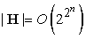
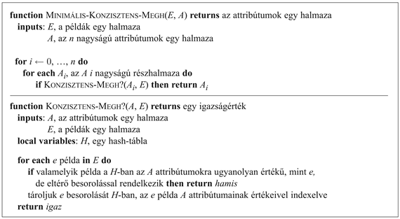
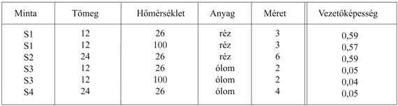
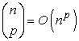
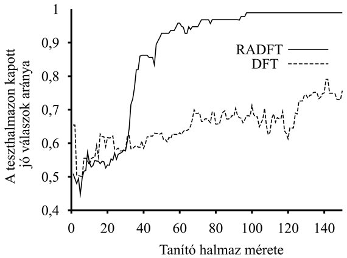

<?xml version="1.0" encoding="UTF-8" standalone="no"?>

<html xmlns="http://www.w3.org/1999/xhtml"><head><meta name="generator" content="DocBook XSL Stylesheets V1.76.1"/></head><body>

<h1 class="title"><a id="id733617"/>Tanulás releváns információ alapján</h1>

<a id="ID_799_oldal"/>
Úgy tűnik, hogy a Brazíliába utazónk képes a Brazíliában beszélt nyelvre vonatkozó megbízható általánosításra. A következtetésre az a háttértudása jogosítja, miszerint egy adott ország lakói (általában) ugyanazt a nyelvet beszélik. Ezt a tudást az elsőrendű logikában az alábbi módon fejezhetjük ki:[<a id="id733626" href="#ftn.id733626" class="footnote">191</a>]

<code class="code"><em>Nemzetisége</em>(<em>x</em>, <em>n</em>) ∧ <em>Nemzetisége</em>(<em>y</em>, <em>n</em>) ∧ <em>Nyelve</em>(<em>x</em>, <em>l</em>) ⇒ <em>Nyelve</em>(<em>y</em>, <em>l</em>)	(19.6)</code>

(szó szerint: „Ha <em>x</em> és <em>y</em> azonos <em>n</em> állampolgárságú, és <em>x</em> az <em>l</em> nyelvet beszéli, akkor <em>y</em> szintén az <em>l</em> nyelvet beszéli.”). Nem nehéz kimutatni, hogy a fenti kijelentésből és a

<code class="code"><em>Nemzetisége</em>(<em>Fernando</em>,<em> Brazil</em>) ∧ <em>Nyelve</em>(<em>Fernando</em>,<em> Portugál</em>)</code>

megfigyelésből logikailag következik (lásd 19.1. feladat), hogy:

<code class="code"><em>Nemzetisége</em>(<em>x</em>, <em>Brazil</em>) ⇒ <em>Nyelve</em>(<em>x</em>, <em>Portugál</em>)</code>

A (19.6) típusú mondatok szigorú relevanciát fejeznek ki: a nemzetiség teljesen meghatározza a nyelvet. Másképpen fogalmazva: a nyelv a nemzetiség függvénye. Az ilyen mondatokat <strong>funkcionális függőségek</strong>nek (<strong>functional dependencies</strong>) vagy <strong>meghatározás</strong>oknak (<strong>determination</strong>s) nevezzük. Bizonyosfajta alkalmazásoknál (például az adatbázisrendszer-tervek specifikálásánál) ezek annyira általánosan fordulnak elő, hogy a felírásukhoz speciális szintaxist használnak. Davies (Davies, 1985) jelölésével élve:

<code class="code"><em>Nemzetisége</em>(<em>x</em>, <em>n</em>) ≻ <em>Nyelve</em>(<em>x</em>, <em>l</em>)</code>

Ez persze csak egy egyszerű szintaktikai nyalánkság, azonban világosan mutatja, hogy egy meghatározás valójában predikátumok közötti reláció: a nemzetiség meghatározza a nyelvet. Az anyag vezetőképességét és sűrűségét meghatározó releváns tulajdonságokat hasonlóképpen kifejezhetjük:

<code class="code"><em>Anyaga</em>(<em>x</em>, <em>m</em>) ∧ <em>Hőmérséklete</em>(<em>x</em>, <em>t</em>) ≻ <em>Vezetőképessége</em>(<em>x</em>,<em> ρ</em>)</code>

<code class="code"><em>Anyaga</em>(<em>x</em>, <em>m</em>) ∧ <em>Hőmérséklete</em>(<em>x</em>, <em>t</em>) ≻ <em>Sűrűsége</em>(<em>x</em>, <em>d</em>)</code>

A hozzá tartozó általánosítások a meghatározásokból és a megfigyelésekből származnak.

<h2 class="title"><a id="id733875"/>A hipotézistér meghatározása</h2>

<h3 class="title">Fontos</h3>
Annak ellenére, hogy meghatározások igazolják az összes brazilra vagy az adott hőmérsékletű réz minden darabjára vonatkozó általános következtetések levonását, ahhoz természetesen nem elegendők, hogy egyetlenegy példából következtessünk ki egy általános prediktív tulajdonságú elméletet, amely az <em>összes</em> nemzetiségre, az <em>összes</em> hőmérsékletre és anyagra vonatkozik. Hatásuk úgy képzelhető el legjobban, hogy leszűkítik a tanuló ágens által figyelembe veendő hipotézisek terét. A vezetőképesség előrejelzésénél például csupán az anyagra és a hőmérsékletre kell koncentrálnunk, figyelmen kívül hagyva a tömeget, a tulajdonviszonyokat, a hét napját, a jelenlegi államelnököt stb. A hipotézisek természetesen tartalmazhatnak olyan komponenseket, mint például a molekuláris struktúra, a termikus energia, a szabad elekronok sűrűsége, amit az anyag és a hőmérséklet befolyásol. <em>A meghatározások egy elégséges alapszótárt adnak meg ahhoz, hogy a célpredikátumra vonatkozó hipotéziseket megkonstruáljuk</em>. Ezt a kijelentést úgy láthatjuk be, hogy megmutatjuk: egy adott meghatározás logikailag ekvivalens azzal az állítással, miszerint a célpredikátum helyes definíciója a meghatározás bal oldalán lévő predikátumok által kifejezhető definíciók egyike. 

Intuitív módon érthető, hogy a hipotézistér méretének számítási redukálásának könynyebbé kell tennie a célpredikátum megtanulását. A számítási tanulás elmélet alaperedményeit (lásd 18.5. alfejezet) felhasználva, a lehetséges nyereség mennyiségileg is kifejezhető. Emlékezzünk arra, hogy egy Boole-függvény esetén log(|<strong>H</strong>|) számú példa (ahol |<strong>H</strong>| a hipotézistér mérete) szükséges ahhoz, hogy egy elfogadható hipotézishez konvergáljunk. Ha a tanuló <em>n</em> Boole-tulajdonsággal rendelkezik a hipotézisek megkonstruálásához, akkor egyéb korlátozások hiányában , így a példák száma <em>O</em>(2n). Ha a meghatározás bal oldalán <em>d</em> számú predikátum áll, a tanulónak <em>O</em>(2d) példára van szüksége, ami <em>O</em>(2n–d) méretű redukciót jelent. Elfogult hipotézistér, például konjuktív elfogultságok esetén, a redukció még mindig számottevő lesz, bár kevésbé lesz látványos.

<a id="id733942"/>
<strong>19.8. ábra - Algoritmus egy minimális konzisztens meghatározás megkeresésére</strong>

<h2 class="title"><a id="id733952"/>Tanulás releváns információ felhasználásával</h2>

Ahogy ezt a fejezet bevezetőjében már megemlítettük, az előzetes tudás hasznos a tanulás szempontjából, azonban valahogy ezt is meg kell tanulni. Hogy a relevanciaalapú tanulást teljes mértékben megfogalmazhassuk a meghatározások tanulási mechanizmusát meg kell még adnunk. A most bemutatásra kerülő algoritmus alapja a megfigyelésekkel konzisztens legegyszerűbb meghatározás megtalálása. Egy <em>P</em> ≻ <em>Q</em> meghatározás azt jelenti, hogy ha egy példa illeszkedik <em>P</em>-re, akkor <em>Q</em>-ra is kell illeszkednie. Egy meghatározás konzisztens a példák egy halmazával, ha minden példapár, amely a bal oldali predikátumokon illeszkedik egymásra, a célpredikátumon is illeszkedik, magyarán, ha a besorolása azonos. Tegyük fel, hogy bizonyos anyagi mintákat megmérve a vezetőképesség alábbi méréseivel rendelkezünk:

A minimális konzisztens meghatározás: <em>Anyaga </em>∧<em> Hőmérséklete</em> ≻ <em>Vezetőképessége. </em>Létezik konzisztens, de nem minimális meghatározás is: <em>Tömege </em>∧<em> Nagysága </em>∧ <em>Hőmérséklete</em> ≻ <em>Vezetőképessége.</em> Ez azért konzisztens a példákkal, mert a tömeg és a méret meghatározza a sűrűséget, és az adatbázisunkban nincs két különböző anyag, amelynek sűrűsége azonos lenne. Mint mindig, most is nagyobb példahalmazra lenne szükségünk, hogy a közel helyes hipotézist kiszűrjük.

A minimális konzisztens meghatározás megkeresésének több lehetséges algoritmusa létezik. Kézenfekvő megközelítés a meghatározások terében keresni, először az egypredikátumos, a kétpredikátumos stb. meghatározásokat ellenőrizve, amíg rá nem lelünk egy konzisztens meghatározásra. Egyszerű attribútumalapú ábrázolást tételezünk fel, hasonlóan ahhoz, mint amit a döntési fák tanulásánál a 18. fejezetben használtunk. Tekintettel arra, hogy a célpredikátumot rögzítettnek vesszük, a <em>d</em> meghatározást a bal oldal attribútumhalmaza fogja képviselni. Az algoritmust a 19.8. ábra mutatja.

Ennek az algoritmusnak az időigénye a legkisebb konzisztens meghatározás nagyságától függ. Tegyük fel, hogy az ilyen meghatározásnak <em>p</em> attribútuma van a lehetséges <em>n</em>-ből. Az algoritmus addig nem lesz képes a meghatározást megtalálni, amíg az <em>A</em>-nak <em>p</em> nagyságú részhalmazait nem kezdi végigvizsgálni. Miután  ilyen részhalmaz létezik, következésképpen az algoritmus a minimális meghatározás méretét tekintve exponenciális lesz. Az is kiderült, hogy a probléma NP-teljes, így általános esetben sem várhatunk jobbat. A legtöbb tárgytartomány azonban elegendő lokális strukturáltsággal (a lokálisan strukturált tárgytartomány definíciójára lásd<em> </em>14. fejezet) rendelkezik, így <em>p</em> minden bizonnyal kicsi lesz.

Ha a meghatározások tanuló algoritmusa már adott, a tanuló ágensnek módja van egy olyan minimális hipotézist megkonstruálni, amelyen belül kell a célpredikátumot megtanulnia. Összemásolhatjuk a <code class="code">MINIMÁLIS-KONZISZTENS-MEGH</code> és a <code class="code">DÖNTÉSI-FA-TANULÁS</code> algoritmusait, és így az RADFT-t, a relevanciaalapú döntési fa tanuló algoritmust kapjuk, amely először a releváns attribútumok minimális halmazát azonosítja, majd ezen halmazt tanulás céljából döntési fa algoritmusának adja tovább. A <code class="code">DÖNTÉSI-FA-TANULÁS</code>-sal ellentétben az RADFT egyidejűleg tanulja és használja a releváns információt ahhoz, hogy a hipotézisteret minimalizálja. Elvárjuk, hogy az RADFT tanulási görbéje a <code class="code">DÖNTÉSI-FA-TANULÁS</code> tanulási görbéjénél jobb legyen, és tényleg ez a helyzet. A 19.9. ábrán a két algoritmus tanulási görbéje látható, véletlen módon generált adatokon és egy olyan tanulandó függvény esetén, amely a lehetséges 16 attribútumból csupán 5-öt használ fel. Természetesen azokban az esetekben, amikor az összes attribútum releváns, az RADFT nem mutat előnyöket.

<a id="id734070"/>
<strong>19.9. ábra - Az RADFT és a <code class="code">DÖNTÉSI-FA-TANULÁS</code> hatékonyságának összehasonlítása véletlen módon generált adatok és egy olyan célfüggvény esetén, amely a lehetséges 16 attribútumból csak 5-öt használ</strong>

Ez a rész csak érintette a <strong>deklaratív elfogultság</strong> (<strong>declarative bias</strong>) területét, melynek az a célja, hogy megértsük, hogy az előzetes tudást hogyan kell felhasználni a megfelelő hipotézistér azonosításához, amelyben a korrekt céldefiníciót keressük. Sok kérdés megválaszolatlan maradt:

<ul class="itemizedlist"><li class="listitem">
Hogyan kell az algoritmust kiterjeszteni a zaj kezelésére is?
</li><li class="listitem">
Tudunk-e folytonos értékeket felvevő változókat kezelni?
</li><li class="listitem">
Hogyan lehetne felhasználni az előzetes tudás más típusát is, a meghatározásokon kívül?
</li><li class="listitem">
Hogyan lehet az algoritmusokat általánosítani, hogy egy elsőrendű elméletre, és nem csupán az attribútumalapú reprezentációra vonatkozzanak ?
</li></ul>

Az egyes kérdésekre a következő alfejezetben keresünk választ.

 

[<a id="ftn.id733626" href="#id733626" class="para">191</a>]  Az egyszerűség kedvéért feltételezzük, hogy egy személy csak egy nyelven beszél. Az olyan országok esetén, mint Svájc vagy India, a szabályt természetesen bővíteni kell.

</body></html>
