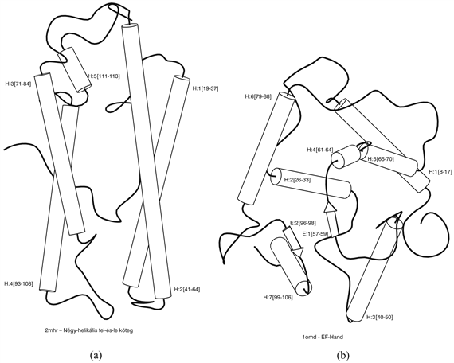
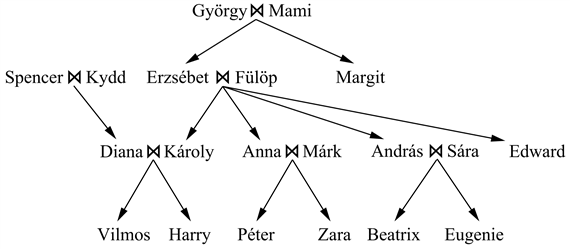
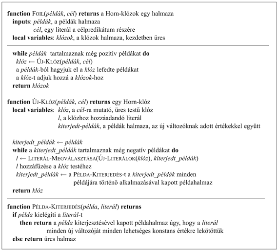
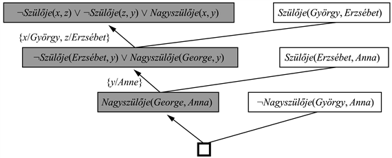
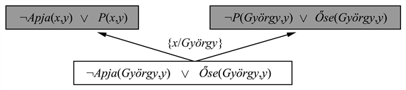

<?xml version="1.0" encoding="UTF-8" standalone="no"?>

<html xmlns="http://www.w3.org/1999/xhtml"><head><meta name="generator" content="DocBook XSL Stylesheets V1.76.1"/></head><body>

<h1 class="title"><a id="id734118"/>Induktív logikai programozás</h1>

Az induktív logikai programozás (ILP) az induktív módszereket az elsőrendű reprezentációk erejével kombinálva, az elméletek logikai programok formájában történő kifejezésére helyezi a hangsúlyt.[<a id="id734125" href="#ftn.id734125" class="footnote">192</a>] Az ILP három oknál fogva terjedt el. Először is az ILP az általános tudásalapú induktív tanulási probléma precíz, szigorú megközelítését adja. Másodszor, teljes algoritmusokat szolgáltat az általános elsőrendű elméletek indukciós úton, példák alapján történő előállítására. Következésképpen olyan területeken is képes sikeresen tanulni, ahol az attribútumalapú algoritmusokat nehéz alkalmazni. Ennek egy példája a fehérjemolekulák összehajtogatásának a tanulása (lásd 19.10. ábra). A fehérjemolekula háromdimenziós konfigurációját egy attribútumhalmazzal ésszerűen kifejezni nem lehet, mert a konfiguráció lényege az objektumok közötti <em>relációkra</em> vonatkozik, és nem az egyes objektumok attribútumaira. A relációk leírására megfelelő apparátus az elsőrendű logika. Harmadszor, induktív logikai programozás által létrehozott hipotézisek emberek számára (viszonylag) könnyen olvashatók. A 19.10. ábrabeli természetes nyelvű fordítást a gyakorló biológusok végigelemezhetik és kritizálhatják. Ez azt jelenti, hogy az induktív logikai programrendszerek részt vehetnek a kísérletezés, a hipotézisgenerálás, a megvitatás és a cáfolat tudományos ciklusában. Az ilyen részvétel a „fekete doboz” osztályozókat gyártó módszerek számára, mint amilyenek például a neurális hálók, lehetetlen lenne.

<h2 class="title"><a id="id734134"/>Egy példa</h2>

Emlékezzünk a (19.5) egyenlet alapján, hogy az általános tudásalapú indukciós probléma az alábbi vonzatkényszer:

<code class="code"><em>Háttértudás </em>∧<em> Hipotézis </em>∧ <em>Leírások</em> ⊨ <em>Besorolások</em></code>

„megoldása” az ismeretlen <em>Hipotézis-re</em> nézve, feltéve, hogy adottak a <em>Háttértudás</em>, valamint a <em>Leírások</em> és a <em>Besorolások</em> által leírt példák. Hogy ezt megvilágítsuk, tekintsük a rokonsági relációk példák alapján történő tanulását. A megfigyeléseket egy kiterjedt családfa képezi, az <em>Anyja</em>, <em>Apja</em>, <em>Házas</em> relációkkal, valamint a <em>Férfi</em> és <em>Nő</em> tulajdonságokkal leírva. A 8.11. feladat családfáját fogjuk használni, amit a 19.11. ábra mutat. A példához tartozó leírások az alábbiak:

<code class="code"><em>Apja</em>(<em>Fülöp</em>, <em>Károly</em>)		 <em>Apja</em>(<em>Fülöp</em>, <em>Anna</em>)		...</code>

<code class="code"><em>Anyja</em>(<em>Mami</em>, <em>Margit</em>)		<em>Anyja</em>(<em>Mami</em>, <em>Erzsébet</em>)		...</code>

<code class="code"><em>Házas</em>(<em>Diana</em>, <em>Károly</em>)		<em>Házas</em>(<em>Erzsébet</em>, <em>Fülöp</em>)		...</code>

<code class="code"><em>Férfi</em>(<em>Fülöp</em>)			<em>Férfi</em>(<em>Károly</em>)			...</code>

<code class="code"><em>Nő</em>(<em>Beatrix</em>)			<em>Nő</em>(<em>Margit</em>)			...</code>

A <em>Besorolások</em> állításai azon múlnak, hogy milyen célfogalmat szeretnénk megtanulni. A célpredikátumok olyan fogalmak lehetnének, mint például a <em>Nagyszülője</em>, a <em>Sógora</em>, illetve az <em>őse</em>. A <em>Nagyszülője</em> esetén a <em>Besorolások</em> teljes halmaza 20 × 20 = 400

<code class="code"><em>Nagyszülője</em>(<em>Mami</em>, <em>Károly</em>)	<em>Nagyszülője</em>(<em>Erzsébet</em>, <em>Beatrix</em>)	…</code>

<code class="code">¬<em>Nagyszülője</em>(<em>Mami</em>, <em>Harry</em>)	¬<em>Nagyszülője</em>(<em>Spencer</em>, <em>Péter</em>)	…</code>

alakú konjunktból áll. Természetesen e teljes halmaz részhalmazából is tudnánk tanulni. 

<a id="id734373"/>
<strong>19.10. ábra - Az (a) és (b) ábra a fehérjemolekula összehajtogatásának tárgyterületén a „négy-helikális fel-és-le köteg” fogalom pozitív és negatív példáját mutatja. Mindkét példa struktúráját egy olyan kb. 100 konjunktív tagot tartalmazó logikai kifejezésbe kódolták, mint amilyen például<em> </em>a<em> TeljesHossz</em>(<em>D</em>2<em>mhr</em>, 118) ∧ <em>HelikálisSzám</em>(<em>D</em>2<em>mhr</em>, 6) ∧ …<em> </em>kifejezés<em>.</em></strong>

Az ilyen leírásokból és az<em> Összehajtogatás</em>(<code class="code">NÉGY-HELIKÁLIS-FEL-ÉS-LE-KÖTEG</code>, <em>D</em>2<em>mhr</em>) jellegű besorolásokból a <code class="code">PROGOL</code><em> </em>induktív logikai programrendszer (Muggleton, 1995) az alábbi szabályt tanulta meg:

<code class="code"><em>Összehajtogatás</em>(Négy-Helikális-Fel-és-Le-Köteg, <em>f</em>) ⇐</code>

<code class="code"><em>		Helikális</em>(<em>f</em>, <em>cs</em>1) ∧ <em>Hossz</em>(<em>cs</em>1, Magas) ∧ <em>Pozíció</em>(<em>f</em>, <em>cs</em>1, <em>n</em>)</code>

<code class="code">		∧ (1 ≤ <em>n </em>≤ 3) ∧ <em>Szomszédos</em>(<em>f</em>, <em>cs</em>2, <em>cs</em>2) ∧ <em>Helikális</em>(<em>f</em>, <em>cs</em>2)</code>

Ilyen típusú szabályt az előbbi fejezetekben látott, attribútumalapú mechanizmusokkal megtanulni, sőt kifejezni sem lehet. A szabály a természetes nyelvben kifejezve:

Az <em>F</em> fehérje a „Négy-helikális fel-és-le köteg” összehajtogatási osztályhoz tartozik, ha egy hosszú <em>cs</em>1 helikálist tartalmaz a másodlagos struktúra 1. és 3. közötti pozícióban, valamint <em>cs</em>1 a második helikálissal szomszédos.

<a id="id734551"/>
<strong>19.11. ábra - Egy tipikus családfa</strong>

Az induktív tanuló program tárgya egy olyan állításhalmaz <em>Hipotézis</em>-ként való előállítása, amely a vonzatkényszert kielégíti. Átmenetileg tegyük fel, hogy az ágens nem rendelkezik háttértudással, a <em>Háttértudás</em> üres. Akkor egy lehetséges megoldás a <em>Hipotézis</em>-re a következő:

<code class="code"><em>Nagyszülője</em>(<em>x</em>, <em>y</em>) ⇔[ ∃<em>z </em> <em>Anyja</em>(<em>x</em>, <em>z</em>) ∧ <em>Anyja</em>(<em>z</em>, <em>y</em>)]</code>

<code class="code">		[∃<em>z </em> <em>Anyja</em>(<em>x</em>, <em>z</em>) ∧ <em>Apja</em>(<em>z</em>, <em>y</em>)]</code>

<code class="code">		[∃<em>z </em> <em>Apja</em>(<em>x</em>, <em>z</em>) ∧ <em>Anyja</em>(<em>z</em>, <em>y</em>)]</code>

<code class="code">		[∃<em>z</em>  <em>Apja</em>(<em>x</em>, <em>z</em>) ∧ <em>Apja</em>(<em>z</em>, <em>y</em>)]</code>

Vegyük észre, hogy egy attribútumalapú tanuló algoritmus, mint például a <code class="code">DÖNTÉSI-FA-TANULÁS</code> sehogy sem fog ezzel a problémával boldogulni. Ahhoz, hogy a <em>Nagyszülője</em>-t attribútumként (azaz egy unáris predikátumként) fejezzük ki, az embereket <em>párosával</em> objektumként kell tudnunk kezelni:

<code class="code"><em>Nagyszülője</em>(〈<em>Mami</em>, <em>Károly</em>〉)…</code>

Ezek után ott akadunk el, amikor megkíséreljük egy példa leírását formálisan reprezentálni. Csupán olyan elrettentő attribútumokat tudnánk használni, mint az:

<code class="code"><em>ErzsébetAnyjaAzElsőElem</em>(〈<em>Mami</em>, <em>Károly</em>〉)</code>

<h3 class="title">Fontos</h3>
A <em>Nagyszülője</em>-nek az ilyen attribútumokkal kifejezett definíciója nem lesz más, mint egy nagy diszjunkció, ami az egyes konkrét esetekből áll, és amit lehetetlen az új esetekre általánosítani. Az <em>attribútumalapú tanuló algoritmusok képtelenek relációs predikátumokat megtanulni</em>. Az ILP egyik legfontosabb előnye tehát az, hogy a problémák sokkal szélesebb választékában alkalmazhatók, beleértve a relációs problémákat is.

Az olvasó természetesen észreveszi, hogy egy kis háttértudás segítene a <em>Nagyszülője</em> definíciójának reprezentációjánál. Így például, ha a <em>Háttértudás</em> tartalmazná az alábbi állítást:

<code class="code"><em>Szülője</em>(<em>x</em>, <em>y</em>) ⇔ [<em>Anyja</em>(<em>x</em>, <em>y</em>) ⋁ <em>Apja</em>(<em>x</em>, <em>y</em>)]</code>

akkor a <em>Nagyszülője</em> definícióját a:

<code class="code"><em>Nagyszülője</em>(<em>x</em>, <em>y</em>) ⇔ [∃<em>z</em> <em>Szülője</em>(<em>x</em>, <em>z</em>) ∧ <em>Szülője</em>(<em>z</em>, <em>y</em>)]</code>

állításra lehetne redukálni. Ez megmutatja, hogy mennyire tud a háttértudás hozzájárulni a példák megmagyarázásához szükséges hipotézis méretének drasztikus csökkentéséhez.

Az ILP-algoritmus új predikátumokat is <em>létesíthet,</em> hogy a magyarázó jellegű hipotézis kifejezését egyszerűsítse. Az előbbi példát tekintve, teljesen ésszerű egy pótpredikátumot javasolni – amit <em>„Szülője”</em>-nek tudnánk nevezni –, hogy a célpredikátum definícióját egyszerűsítsük. Azok az algoritmusok, amelyek új predikátumokat tudnak létesíteni, az ún. <strong>k</strong><strong>onstruktív indukció</strong>s (<strong>constructive induction</strong>) algoritmusok. Világos, hogy a konstruktív indukció a bevezetőben vázolt kumulatív tanulás egy szükséges komponense. A kumulatív tanulás a gépi tanulás egyik legnehezebb problémája, azonban egyes ILP-technikák kellően hatékony mechanizmusnak bizonyultak a megoldására.

A fejezet hátralévő részében az ILP két alapvető megközelítését fogjuk tanulmányozni. Az első a döntési fák általánosításán, a másik a rezolúciós bizonyítás invertálásán alapul.

<h2 class="title"><a id="id736351"/>Felülről lefelé tanulási módszerek</h2>

Az ILP első megközelítésében egy igen általános szabállyal kezdünk és azt fokozatosan leszűkítjük, hogy az adatokra illeszkedjen. Ez az, ami lényegében a döntési fa tanulásánál történik, ahol a döntési fa fokozatosan növekszik, amíg a megfigyelésekkel konzisztens nem lesz. Hogy az ILP-t magvalósítsuk, elsőrendű literálokat használunk attribútumok helyett, a hipotézis pedig egy klózhalmaz, a döntési fa helyett. Ebben a részben az egyik legelső ILP-programmal, a <code class="code">FOIL</code>-lal foglalkozunk (Quinlan, 1990).

Tegyük fel, hogy továbbra is a <em>Nagyszülője</em>(<em>x</em>, <em>y</em>) predikátum definícióját szeretnénk megtanulni az előbb közölt családi példák alapján. A döntési fa tanulásához hasonlóan a példákat pozitív és negatív példákra bontjuk. A pozitív példák:

<code class="code">〈<em>György</em>, <em>Anna</em>〉, 〈<em>Fülöp</em>, <em>Péter</em>〉, 〈<em>Spencer</em>, <em>Harry</em>〉, …</code>

míg a negatív példák:

<code class="code">〈<em>György</em>, <em>Erzsébet</em>〉, 〈<em>Harry</em>, <em>Zara</em>〉, 〈<em>Károly</em>, <em>Fülöp</em>〉, …</code>

Figyeljük meg, hogy mindegyik példa egy objektum<em>páros</em>, hiszen a <em>Nagyszülője</em> egy bináris predikátum. Egészét tekintve a családfában 12 pozitív és 388 negatív (a személyek minden más párosítása) példa található.

A <code class="code">FOIL</code> program klózok egy halmazát alakítja ki, mindegyik <em>Nagyszülője</em>(<em>x</em>, <em>y</em>)-nal mint fejjel. A klózoknak a 12 pozitív példát a <em>Nagyszülője</em>(<em>x</em>, <em>y</em>) reláció példányosításának kell osztályozniuk, a többi 388-at viszont kizárni. A klózok Horn-klózok, melyeket negált literálokkal bővítünk ki, ahol a negálást mint kudarcot használjuk, hasonlóan a Prologhoz. Egy üres testű klózzal kezdünk:

<code class="code">⇒<em> Nagyszülője</em>(<em>x</em>, <em>y</em>)</code>

Mivel ez a választás minden példát pozitívnak sorol be, leszűkítésre szorul. Ez úgy tehető meg, hogy egy lépésben egy literált adunk a bal oldalhoz. A három lehetséges eset:

<code class="code"><em>Apja</em>(<em>x</em>, <em>y</em>) ⇒ <em>Nagyszülője</em>(<em>x</em>, <em>y</em>)</code>

<code class="code"><em>Szülője</em>(<em>x</em>, <em>z</em>) ⇒ <em>Nagyszülője</em>(<em>x</em>, <em>y</em>)</code>

<code class="code"><em>Apja</em>(<em>x</em>, <em>z</em>) ⇒ <em>Nagyszülője</em>(<em>x</em>, <em>y</em>)</code>

(Vegyük észre, hogy a <em>Szülője</em>-t definiáló klózzal a háttértudás már rendelkezik.) E három eset közül az első az összes 12 pozitív példát helytelenül negatívnak sorolja be, így ezt az esetet kizárjuk. A második és a harmadik az összes pozitív példával összhangban van. A második eset azonban a negatív példák nagyobb halmazán – pontosabban kétszer annyi példán – helytelen, mert az anyákat és az apákat is megengedi. Így a választásunk a harmadik esetre esik. 

Most az esetet tovább kell szűkíteni, kizárva azokat az eseteket, amikor <em>x</em> valamilyen <em>z</em> szülője, de <em>z</em> mégsem <em>y</em> szülője. Egy egyedi <em>Szülője</em>(<em>z</em>, <em>y</em>) literál hozzáadása a következő klózt eredményezi:

<code class="code"><em>Apja</em>(<em>x</em>, <em>z</em>) ∧ <em>Szülője</em>(<em>z</em>, <em>y</em>) ⇒ <em>Nagyszülője</em>(<em>x</em>, <em>y</em>)</code>

amely az összes példát helyesen sorolja be. A <code class="code">FOIL</code> képes lesz ezt a literált megtalálni és kiválasztani, és ezzel a tanulási feladatot megoldja. Általánosságban, a helyes megoldás megtalálása előtt, a <code class="code">FOIL</code>-nak számos sikertelen klóz között kell keresnie. Ez a példa a <code class="code">FOIL</code> működésének egyszerű illusztrációja. A teljes algoritmus váza a 19.12. ábrán látható. Az algoritmus lényegében literálról literálra egy klózt konstruál, amíg az meg nem egyezik a pozitív példák valamilyen részhalmazával, és egyik negatív példával sem egyezik. A klóz által lefedett pozitív példákat ekkor a tanító halmazból elhagyjuk, és az eljárást folytatjuk, amíg egyetlen pozitív példa sem marad. Az algoritmus két fő komponense szorul magyarázatra – az <code class="code">ÚJ-LITERÁLOK</code>, amely a klózhoz hozzáadandó összes új literált konstruálja, és a <code class="code">LITERÁL-MEGVÁLASZTÁSA</code>, amely kiválasztja a hozzáadandó literált.

<a id="id736642"/>
<strong>19.12. ábra - A <code class="code">FOIL</code> algoritmus váza, amely példákból elsőrendű Horn-klózokat tanul meg. Az <code class="code">ÚJ-LITERÁLOK</code> és a <code class="code">LITERÁL-MEGVÁLASZTÁSA</code> eljárásokat a szövegben magyarázzuk meg.</strong>

Az <code class="code">ÚJ-LITERÁLOK</code> egy klózt kap bementként, és minden lehetséges „hasznos” literált konstruál, amit a klózhoz hozzá lehetne adni. Vegyük például az alábbi klózt:

<code class="code"><em>Apja</em>(<em>x</em>, <em>z</em>) ⇒ <em>Nagyszülője</em>(<em>x</em>, <em>y</em>)</code>

Háromfajta literált adhatunk hozzá a klózhoz:

<ol class="orderedlist"><li class="listitem">
<em>Predikátumokat használó literálok:</em> a literál lehet negált vagy ponált, minden létező predikátum (a célpredikátumot is beleértve) használható, és minden argumentum csakis változó lehet. A predikátumok argumentumai tetszőleges változók lehetnek, egy kikötéssel: minden literálnak tartalmaznia kell <em>legalább</em> egy változót egy korábbi literálból vagy a klóz fejéből. Olyan literálok, mint: <em>Anyja</em>(<em>z</em>, <em>u</em>), <em>Házas</em>(<em>z</em>, <em>z</em>), ¬<em>Férfi</em>(<em>y</em>) és <em>Nagyszülője</em>(<em>v</em>, <em>x</em>) megengedettek, ám <em>Házas</em>(<em>u</em>, <em>v</em>) nem. Megjegyzendő, hogy a klóz fejéből származó predikátumok használata lehetővé teszi, hogy a <code class="code">FOIL</code> a <em>rekurzív</em> definíciót is megtanulja.
</li><li class="listitem">
<em>Egyenlőségi és egyenlőtlenségi literálok:</em> ezek a klózban már szereplő változókat kötik össze. Így például a klózhoz hozzáadhatjuk, hogy: <em>z</em> ≠ <em>x</em>. Ezekben a literálokban a felhasználó által specifikált konstansok is felhasználhatók. Az aritmetikát tanulva célszerű kitüntetni a 0-t és az 1-et, a listafüggvényeknél pedig az üres [] listát.
</li><li class="listitem">
<em>Aritmetikai összehasonlítások:</em> folytonos változójú függvények tanulásánál célszerű lehet az olyan literálok hozzáadása, mint az <em>x</em> &gt; <em>y</em> és az <em>y </em>≤<em> z</em>. A döntési fa tanulásához hasonlóan egy konstans küszöbértéket is lehet használni, ami a teszt diszkriminációs erejét maximalizálja.
</li></ol>

Mindez a keresési térben nagyon nagy elágazási tényezőhöz vezet (lásd 19.6. feladat), azonban a Foil implementációiban a típusinformációt is fel lehet használni a hipotézistér leszűkítésére. Az embereket és a számokat tartalmazó tárgytartományban például a típusleszűkítés nem engedné, hogy az <code class="code">ÚJ-LITERÁLOK</code> olyan literálokat generáljon, mint a <em>Szülője</em>(<em>x</em>, <em>n</em>), ahol <em>x</em> egy ember, <em>n</em> viszont egy szám.

A <code class="code">LITERÁL-MEGVÁLASZTÁSA</code> az információnyereségre (lásd <a class="xref" href="ch18s03.md#ID_761_oldal">„Attribútumteszt-választás”</a> rész) valamilyen mértékben hasonló heurisztikát használ, hogy eldöntse, melyik literált adja hozzá a klózhoz. A részletek itt nem különösen fontosak, ráadásul számos kipróbált változat is létezik. A Foil egyik érdekes járulékos tulajdonsága az Ockham borotvája elvének az alkalmazása bizonyos hipotézisek eliminálására. Ha (egy bizonyos mérték szerint) egy klóz hosszabbnak mutatkozik, mint az általa megmagyarázott pozitív példák összhossza, akkor ezt a klózt a továbbiakban nem tekintjük lehetséges hipotézisnek. Ezzel a technikával elkerülhetjük az adatokban található zajra illeszkedő, túlságosan bonyolult klózok származtatását. A zaj és a klózhossz kapcsolatának magyarázatát lásd a <a class="xref" href="ch20.md#ID_821_oldal">„Statisztikai tanulás”</a> részben.

A <code class="code">FOIL</code>-t és társait számos definíció megtanulására vetették be. Az egyik leghatásosabb demonstráció (Quinlan és Cameron-Jones, 1993) a listakezelő függvényekre vonatkozó feladatok hosszú sorának a megoldása volt Bratko Prolog-tankönyvéből (Bratko, 1986). A program mindegyik esetben képes volt a függvény helyes definícióját kisszámú példa alapján megtanulni, miközben háttértudásként használta a korábban megoldott függvényeket.

<h2 class="title"><a id="id736843"/>Induktív tanulás inverz rezolúcióval</h2>

Az ILP-nek másik fő megközelítése a megszokott deduktív bizonyítási folyamat invertálása. Az <strong>inverz rezolúció </strong>(<strong>inverse resolution</strong>) azon az észrevételen alapul, hogy ha a példa <em>Besorolások</em> a <em>Háttértudás</em> ∧ <em>Hipotézis</em> ∧ <em>Leírások</em>-ból következnek, akkor ezt a tényt rezolúcióval be kell tudnunk bizonyítani (hiszen a rezolúció teljes). Ha képesek volnánk a bizonyítást „visszafelé pörgetni”, akkor tudnánk egy olyan <em>Hipotézis</em>-t találni, amire a bizonyítás sikeres lesz. A kulcsprobléma tehát, hogy hogyan tudnánk a rezolúciós eljárást invertálni, hogy a bizonyítás visszafelé fusson le.

Az inverz rezolúció visszafelé haladó bizonyítási eljárását mutatjuk be, amely egyedi visszafelé mutató lépésekből áll. Egy közönséges rezolúciós lépés a <em>C</em>1 és <em>C</em>2 klózból indul ki, és azokat rezolválja egy <em>C</em> <strong>rezolvens</strong>t létrehozva eredményül. Az inverz rezoluciós lépés a <em>C</em> rezolvens alapján két klózt, <em>C</em>1-et és <em>C</em>2-t hoz létre úgy, hogy <em>C</em> a <em>C</em>1 és <em>C</em>2 rezolválásának az eredménye, vagy pedig <em>C</em> és <em>C</em>1 alapján állít elő egy lehetséges <em>C</em>2-t.

<a id="id736946"/>
<strong>19.13. ábra - Az inverz rezolúciós eljárás kezdő lépései. Az árnyékolt klózokat az inverz rezolúciós eljárás generálja a jobb oldalon és az alatta lévő klózokból. A nem árnyékolt klózok a <em>Leírások</em>-ból és a <em>Besorolások</em>-ból származnak.</strong>

A 19.13. ábra inverz rezolúciós eljárás kezdő lépéseit mutatja, ahol a figyelem középpontjában a <em>Nagyszülője</em>(<em>György</em>, <em>Anna</em>) pozitív példa áll. Az eljárás a bizonyítás végén kezd (amit az ábra alján ábrázolunk). A <em>C</em> rezolvensnek üres klózt (azaz egy ellentmondást) választunk, <em>C</em>2-nek pedig a ¬<em>Nagyszülője</em>(<em>György</em>, <em>Anna</em>)-t, amely a célpélda negálása. Az első inverz lépés <em>C</em>-ből és <em>C</em>2-ből <em>C</em>1-nek a <em>Nagyszülője</em>(<em>György</em>, <em>Anna</em>)-t generálja. A következő lépés e klózt <em>C</em>-nek veszi, a <em>Szülője</em>(<em>Erzsébet</em>, <em>Anna</em>) klózt pedig <em>C</em>2-nek, és az alábbi <em>C</em>1 klózt generálja:

<code class="code">¬<em>Szülője</em>(<em>Erzsébet</em>, <em>y</em>) ∨ <em>Nagyszülője</em>(<em>György</em>, <em>y</em>)</code>

Az utolsó lépés ezt a klózt rezolvensként kezeli. A <em>Szülője</em>(<em>György</em>, <em>Erzsébet</em>) klózt <em>C</em>2-nek véve, egy lehetséges <em>C</em>1 klóz az alábbi hipotézis lehet:

<code class="code"><em>Szülője</em>(<em>x</em>, <em>z</em>) ∧ <em>Szülője</em>(<em>z</em>, <em>y</em>) ⇒ <em>Nagyszülője</em>(<em>x</em>, <em>y</em>)</code>

Egy rezolúciós bizonyításunk van tehát arra, hogy a hipotézis, a leírások és a háttértudás maga után vonzza a <em>Nagyszülője</em>(<em>György</em>, <em>Anna</em>) osztályozást.

Világos, hogy az inverz rezolúció keresést tartalmaz. Minden egyes inverz rezolúciós lépés nemdeterminisztikus, hiszen az adott <em>C</em> és <em>C</em>1-hez több, sőt végtelen sok olyan <em>C</em>2 klóz lehet, amely kielégíti azt a feltételt, miszerint <em>C</em>1-gyel rezolválva <em>C</em>-t ad eredményül. Így a 19.13. ábra utolsó lépésében a ¬<em>Szülője</em>(<em>Erzsébet</em>, <em>y</em>) ∨ <em>Nagyszülője</em>(<em>György</em>, <em>y</em>) megválasztása helyett az inverz rezolúciós lépés a következő állításokat is tudná generálni:

<code class="code">¬<em>Szülője</em>(<em>Erzsébet</em>, <em>Anna</em>) ∨ <em>Nagyszülője</em>(<em>György</em>, <em>Anna</em>)</code>

<code class="code">¬<em>Szülője</em>(<em>z</em>, <em>Anna</em>) ∨ <em>Nagyszülője</em>(<em>György</em>, <em>Anna</em>)</code>

<code class="code">¬<em>Szülője</em>(<em>z</em>, <em>y</em>) ∨ <em>Nagyszülője</em>(<em>György</em>, <em>y</em>)</code>

(Lásd a 19.4. és a 19.5. feladatot.) Az egyes lépésekben részt vevő klózokat meg lehet választani a <em>Háttértudás</em>-ból, a példa <em>Leírások</em>-ból, a negált <em>Besorolások</em>-ból vagy az inverz rezolúciós fában eddig már legenerált hipotézisklózokból. A nagyszámú lehetőség, egyéb kontroll nélkül, nagy elágazási tényezőt (és így kevéssé hatékony keresést) jelent. A keresés kézben tartására több megközelítést probáltak ki az implementált ILP-rendszerekben:

<ol class="orderedlist"><li class="listitem">
A redundáns választások eliminálhatók – például a legspecifikusabb lehetséges hipotézisek generálásával, valamint megkövetelve, hogy a hipotézisklózok mind konzisztensek legyenek egymással és a megfigyelésekkel. Az utolsó kritérium kizárná az előbbiekben megadott ¬<em>Szülője</em>(<em>z</em>, <em>y</em>) ∨ <em>Nagyszülője</em>(<em>György</em>, <em>y</em>) klózt.
</li><li class="listitem">
A bizonyítási stratégia szintén megszorítható. A 9. fejezetben láttuk például, hogy a <strong>lineáris rezolúció</strong> (<strong>linear resolution</strong>) egy teljes, megszorított stratégia, amely lehetővé teszi, hogy a bizonyítási fáknak csak lineáris elágazási struktúrája lehessen (mint a 19.13. ábrán).
</li><li class="listitem">
A reprezentációs nyelv is megszorítható, a függvényszimbólumok eliminálásával és csak Horn-klózokat megengedve. A <code class="code">PROGOL</code> például Horn-klózokkal dolgozik, <strong>inverz</strong><strong> vonzatreláció</strong>t (<strong>inverse entailment</strong>) alkalmazva. Az ötlet a
</li></ol>

<code class="code">	<em>Háttértudás </em>∧<em> Hipotézis </em>∧<em> Leírások </em>⊨<em> Besorolások</em></code>

	vonzatkényszer megváltoztatása a

<code class="code"><em>	Háttértudás </em>∧<em> Leírások </em>∧<em> </em>¬<em>Besorolások </em>⊨<em> </em>¬<em>Hipotézisek</em></code>

	logikailag ekvivalens formára.

	Ebből a <em>Hipotézisek</em> származtatására már a Prolog-beli normál Horn-klóz dedukcióra hasonlító módszert használhatjuk, negálással mint kudarccal. Mivel ez Horn-klózokra korlátozott, így nem teljes módszer, azonban a teljes rezolúciónál hatékonyabb lehet. Inverz vonzatrelációval lehetséges a teljes következtetés alkalmazása is (Inoue, 2001).

<ol class="orderedlist"><li class="listitem">
A következtetést modellellenőrzéssel is megvalósíthatjuk a tételbizonyítás helyett. A <code class="code">PROGOL</code> rendszer (Muggleton, 1995) a modellellenőrzés egy formáját használja kereséskorlátozás céljára. Azaz, hasonlóan a válaszhalmaz-programozáshoz, a logikai változók lehetséges értékeit generálja, és a konzisztenciát ellenőrzi.
</li><li class="listitem">
A következtetést az alap ítéletklózokkal is megtehetjük az elsőrendű logika helyett. A <code class="code">LINUS</code>-rendszerben (Lavrac és Dzeroski, 1994) az elsőrendű elméleteket ítéletlogikára fordítják le, ítéletlogikai tanuló rendszerrel oldják meg azokat, majd visszafordítják. Egyes problémák esetén ítéletlogikai állításokkal sokkal hatékonyabban lehet dolgozni, ahogy ezt a 11. fejezetben a <code class="code">SATPLAN</code> esetében már láttuk.
</li></ol>

<h2 class="title"><a id="id737423"/>Felfedezés induktív logikai programozással</h2>

Egy teljes rezolúciós stratégiát invertáló inverz rezolúciós eljárás elvben az elsőrendű elméletek tanulásának egy teljes algoritmusa. Ez azt jelenti, hogy ha valamely ismeretlen <em>Hipotézis</em> egy sor példát generál, akkor az inverz rezolúciós eljárás a példákból tudja generálni a <em>Hipotézis</em>-t. Ez a megfigyelés egy érdekes lehetőséget is sugall. Tegyük fel, hogy a rendelkezésre álló példák szabadon eső testek által leírt trajektóriák egy halmazát tartalmazzák. Lehetséges, hogy egy inverz rezolúciós program elvben képes a gravitáció törvényét megtanulni? A válasz természetesen igen, mert a gravitáció törvénye, megfelelő matematikai háttér mellett, lehetővé teszi a példák magyarázatát. Hasonlóképpen el lehet képzelni, hogy az elektromágneses hullámok elmélete, a kvantummechanika és a relativitáselmélet, mind beletartoznak az ILP-programok hatáskörébe. Persze a gépíró majom hatáskörébe is beletartoznak; jobb heurisztikákra és a keresési teret jobban strukturáló technikákra még mindig szükség van. 

Egy dolgot azért az inverz rezolúciós rendszer meg <em>fog</em> tenni a részünkre: új predikátumokat fog kitalálni. Ez a képessége kissé mágikusnak tűnik, hiszen a számítógépre szokás úgy tekinteni, mint ami „csak azzal dolgozik, amit bemenetként kapott”. Tény, hogy az új predikátumok egyenesen az inverz rezolúciós lépésből pottyannak ki. A legegyszerűbb az az eset, amikor egy adott <em>C</em> klóz esetén két új klóz, <em>C</em>1 és <em>C</em>2 létezését kellene felvetni. A <em>C</em>1 és <em>C</em>2 rezolúciója a két klóz által közösen tartalmazott literált eliminálta, lehetséges hát, hogy az eliminált literálban olyan predikátum is szerepelt, amely <em>C</em>-ben már nem lép fel. Visszafelé haladva tehát lehetőségként adódik egy új predikátum létrehozása, amiből viszont a hiányzó literál már rekonstruálható. 

A 19.14. ábra arra mutat példát, ahogy az <em>Őse</em> definíciójának tanulása közben egy új <em>P</em> predikátumot generálunk. Ha már előállítottuk a <em>P</em>-t, akkor ez használható az inverz rezolúció későbbi lépéseiben is. Egy későbbi lépés például feltételezheti, hogy az <em>Anyja</em>(<em>x</em>, <em>y</em>) ⇒ <em>P</em>(<em>x</em>, <em>y</em>). Az új predikátum jelentését így a predikátumot felhasználó hipotézis generálása korlátozza. Egy másik példa elvezethet az <em>Apja</em>(<em>x</em>, <em>y</em>) ⇒ <em>P</em>(<em>x</em>, <em>y</em>)-ig. Más szóval a <em>P</em> predikátum olyan valami, ami minket általában a <em>Szülője</em> relációra emlékeztet. Korábban említettük, hogy új predikátumok bevezetése a célpredikátum definíciójának a méretét lényegesen csökkentheti. Az új predikátumok kialakításának beépített képességével, az inverz rezolúciós rendszer sokszor olyan tanulási problémákkal is megbirkózik, amelyekre más módszerek alkalmatlanok.

A tudomány legmélyebbre ható forradalmai új predikátumok és függvények bevezetésével függnek össze, ilyen például a Galilei felfedezte gyorsulás vagy Joule termikus energiája. Ha ezek a fogalmak már adottak, az új törvények felfedezése (viszonylag) egyszerű. A fő nehézség arra rájönni, hogy egy új entitás bevezetése, amely a létező entitásokkal meghatározott konkrét kapcsolatban van, lehetővé teszi a megfigyelések egész halmazának a korábban lehetségesnél sokkal egyszerűbb és elegánsabb elmélet keretein belül történő magyarázatát.

<a id="id737540"/>
<strong>19.14. ábra - Egy új <em>P</em> predikátumot generáló inverz rezolúciós lépés</strong>

Az ILP-rendszerek egyelőre Galilei- vagy Joule-szintű felfedezéseket nem tettek, a felfedezéseit azonban tudományos irodalomban való publikálásra érdemesnek találták. Így például <em>Journal of Molecular Biology</em>-ban Turcotte írja le a fehérje összehajtogatási szabályok automatikus felfedezését a <code class="code">PROGOL</code> ILP programmal (Turcotte és társai, 2001). A Progol által felfedezett szabályok közül sokat az ismert elvekből ugyan le lehetett volna következtetni, a többségét azonban a standard biológiai adatbázisok részeként korábban mégsem publikálták (lásd 19.10. ábra példája). Egy ehhez kapcsolódó kutatás részeként Srinivasan (Srinivasan és társai, 1994) molekula-struktúraalapú szabályok felfedezésével foglalkozott nitroaromatikus komponensek mutagenicitására. Ilyen komponensek a gépkocsik által kibocsátott kipufogógázban találhatók. A standard adatbázisokban lévő komponensek 80%-ában lehetséges a négy fontos jellemzőt azonosítani, és az erre épülő lineáris regresszió jobb az ILP-nél. A maradék 20% esetén a jellemzők önmagukban nem elegendők az előrejelzéshez, az ILP relációkat azonosít, amelyekkel a lineáris regresszió, a neurális hálók és a döntési fák képességein túltesz. King (King és társai, 1992) azt mutatta meg, hogy a különböző gyógyszerek gyógykezelési hatását hogyan lehetne előre jelezni. Ezen esetek mindegyikében úgy tűnik, hogy az ILP nagy hatékonyságához a relációk reprezentálási képessége és a háttértudás használata járulnak hozzá. Az a tény, hogy az ILP által megtalált szabályokat az emberek is képesek interpretálni, inkább segíti ezeknek a technológiáknak az elfogadását a biológiai folyóiratokban, mint a számítógépes tudománnyal foglalkozó folyóiratokban.

Az ILP a biológián túl más tudományokhoz is hozzájárult. A legfontosabbak egyike a természetes nyelvfeldolgozás, ahol az ILP-t komplex relációs információ szövegekből való kinyerésére alkalmazták. Ezeket az eredményeket a 23. fejezet foglalja össze.

 

[<a id="ftn.id734125" href="#id734125" class="para">192</a>]  Azt javasoljuk, hogy ezen a ponton az olvasó ismételten fusson végig a 9. fejezetben bemutatott néhány fogalmon, beleértve a Horn-klózokat, a konjunktív normál formát, az egyesítést és a rezolúciót.

</body></html>
