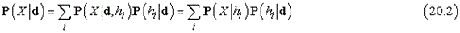
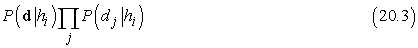
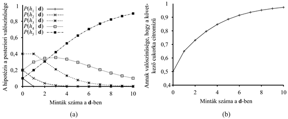

<?xml version="1.0" encoding="UTF-8" standalone="no"?>
<!DOCTYPE html PUBLIC "-//W3C//DTD XHTML 1.1//EN" "http://www.w3.org/TR/xhtml11/DTD/xhtml11.dtd">
<html xmlns="http://www.w3.org/1999/xhtml"><head><meta name="generator" content="DocBook XSL Stylesheets V1.76.1"/></head><body>

<h1 class="title"><a id="id738312"/>20. fejezet - Statisztikai tanulási módszerek</h1>

<em>Ebben a fejezetben megfigyelések alapján történő bizonytalan következtetésnek tekintjük a tanulást.</em>

Az V. részben rámutattunk, hogy a valós életre jellemző környezetben gyakran előfordul, hogy a tudás bizonytalan. Az ágensek a bizonytalanságot valószínűség- és döntéselméleti módszerekkel tudják kezelni, de ehhez először tapasztalataik alapján fel kell állítaniuk a világra vonatkozó valószínűségi modelljüket. Ez a fejezet bemutatja, hogy milyen módon tudják ezt megtenni. Látni fogjuk, hogyan kell úgy formalizálni a tanulási feladatot, mint egy valószínűségi következtetési folyamatot (lásd 20.1. alfejezet). Bemutatjuk, hogy a tanulás bayesi megközelítése rendkívül hatékony: általános megoldást ad a zaj, a túlilleszkedés és az optimális predikció problémáira. Továbbá figyelembe veszi azt a tényt, hogy a nem-egészen-mindentudó ágens soha nem tudhatja biztosan, hogy a világról alkotott melyik elmélet helyes, mégis döntéseket kell hoznia.

A 20.2. és 20.3. alfejezetben valószínűségi modellek – elsősorban a Bayes-hálók – tanulási módszereit ismertetjük. A 20.4. alfejezet olyan módszereket tárgyal, amelyek speciális minták tárolását és előhívását végzik. A 20.5. alfejezet a <strong>neurális háló</strong> (<strong>neural network</strong>) tanítással foglalkozik, míg a 20.6. alfejezet a <strong>kernelgépek</strong>kel (<strong>kernel machine</strong>). Ennek a fejezetnek egy része erősebben matematikai megközelítésű (feltételezi a többváltozós analízis alapjainak ismeretét), bár az általános tanulságok megérthetők anélkül is, hogy elmerülnénk a matematikai részletekben. Hasznos lehet, ha az olvasó ezen a ponton először átnézi a 13. és a 14. fejezeteket, valamint az A) függeléket.

<h1 class="title"><a id="id738343"/>Statisztikai tanulás</h1>

Az ebben a fejezetben használt alapvető koncepciók ismét az<strong> adat</strong> (<strong>data</strong>) és a <strong>hipotézis</strong> (<strong>hypothesis</strong>), <strong>éppúgy</strong>, mint ahogy a 18. fejezetben volt. Itt az adatok a <strong>tény</strong>ek (<strong>evidence</strong>) – ezek a területet leíró valószínűségi változók egy részének vagy mindegyikének egy konkrét megvalósulását jelentik. A hipotézis valamilyen valószínűségi elmélet arról, hogy a világ adott területe hogyan is működik, ennek speciális esetei a logikai elmélettel leírt területek.

Vegyünk egy <em>nagyon</em> egyszerű példát. Kedvenc „meglepetés” cukorkánk kétféle, meggy- (nyam-nyam) és citrom- (brrrr) ízben kapható. A cukorkagyártónak sajátos humora van, és mindegyik cukorkát – ízétől függetlenül – ugyanolyan átlátszatlan papírba csomagolja. Az édességet nagyon nagy zsákokban árulják, amelyekből ötféle van – kívülről megint csak megkülönböztethetetlenek egymástól:

<code class="code"><em>h</em>1: 100% meggy</code>

<code class="code"><em>h</em>2: 75% meggy + 25% citrom</code>

<code class="code"><em>h</em>3: 50% meggy + 50% citrom</code>

<code class="code"><em>h</em>4: 25% meggy + 75% citrom</code>

<code class="code"><em>h</em>5: 100% citrom</code>

Egy adott új zsák cukorka esetén a <em>H</em> (<em>hipotézis</em>t jelölő) véletlen változó a zsák típusát jelenti, lehetséges értékei <em>h</em>1-től <em>h</em>5-ig terjednek. Természetesen <em>H</em> közvetlenül nem figyelhető meg. Ahogy a cukorkákat felbontjuk és megvizsgáljuk, adatokat gyűjtünk – amelyeket <em>D</em>1, <em>D</em>2, …, <em>DN</em> jelöl. Mindegyik <em>Di</em> egy olyan véletlen változó, amelynek lehetséges értékei a <em>meggy</em>, illetve a <em>citrom</em>. Az ágens feladata, hogy jóslást adjon a következő cukorka ízére.[<a id="id738968" href="#ftn.id738968" class="footnote">194</a>] Ez a nyilvánvalóan triviális feladat érdekes módon mégis jó betekintést nyújt a legfontosabb problémák közül többre is. Az ágensnek valóban elméletet kell alkotnia a világról, bár csak nagyon egyszerűt.

A <strong>Bayes-tanulás</strong> (<strong>Bayesian learning</strong>) során egyszerűen kiszámítjuk minden egyes hipotézis valószínűségét az adatokra támaszkodva, majd ennek alapján adunk predikciót. Azaz nem egyetlen „legjobb” hipotézist használunk a predikcióhoz, hanem az öszszes hipotézist használjuk, valószínűségükkel súlyozva őket. Reprezentálja <strong>D</strong> az összes adatot, legyen <strong>d</strong> a megfigyelt értékek vektora, ekkor az egyes hipotézisek valószínűségét a Bayes-szabállyal adhatjuk meg:

<code class="code"><em>P</em>(<em>hi</em>|<em>d</em>) = α<em>P</em>(<em>d</em>|<em>hi</em>)<em>P</em>(<em>hi</em>) 										(20.1)</code>

Tegyük fel, hogy egy ismeretlen <em>X</em> mennyiségre vonatkozó predikció a célunk. Ebben az esetben:

ahol azt feltételeztük, hogy az összes hipotézis meghatároz <em>X</em>-re valamilyen eloszlást. Ez az összefüggés azt mutatja, hogy a predikció az egyes hipotézisekből adódó predikciók súlyozott összege. Maguk a hipotézisek tulajdonképpen a nyers adatok és a predikciók közti „közvetítők”. A Bayes-megközelítésben a <em>P</em>(<em>hi</em>) <strong>prior hipotézis</strong>ek (<strong>hypothesis prior</strong>), illetve a hipotézisek mellett fellépő <em>P</em>(<strong>d</strong>|<em>hi</em>) adat<strong>valószínűség</strong>ek (<strong>likelihood</strong>) a kulcsmennyiségek.

A cukorka példánkban azt feltételezzük, hogy a <em>h</em>1,…, <em>h</em>5 a priori valószínűségei megfelelnek a gyártó reklámjában közölt 〈0,1, 0,2, 0,4, 0,2, 0,1〉 értékeknek. Az adatok valószínűségét <strong>e.f.e</strong> (angol rövidítése: <strong>i.i.d.</strong>) feltételezéssel számítjuk – azaz egyforma és független eloszlást (independently and identically distributed) teszünk fel, így: 

Tegyük fel például, hogy a cukorkás zsák valójában csupa citromtípusú (<em>h</em>5), és az első 10 kibontott cukorka mind citromízű, ekkor <em>P</em>(<strong>d</strong>|<em>h</em>3) = 0,510, mivel a <em>h</em>3 típusú zsákokban a cukorkák fele citrom.[<a id="id739172" href="#ftn.id739172" class="footnote">195</a>] A 20.1. (a) ábra mutatja, hogyan változik az öt hipotézis a posteriori<em> </em>valószínűsége, ahogy sorban észleljük a 10 citromízű cukorkát. Vegyük észre, hogy a valószínűségek az a priori értékekről indulnak, ennek megfelelően kezdetben <em>h</em>3 a legvalószínűbb lehetőség, és ez így is marad még az első cukor felbontása után is. A második citromízű cukorka felbontása után <em>h</em>4 a legvalószínűbb, 3 és több esetén <em>h</em>5 (a rettegett csupa citrom zsák). 10 citromízű cukorka után már meglehetősen biztosak vagyunk végzetünket illetően. A 20.1. (b) ábra mutatja annak a (20.2) egyenlet alapján jósolt valószínűségét, hogy a következő cukorka citromízű. Várakozásunknak megfelelően monoton növekszik az 1 felé.

<a id="id739200"/>
<strong>20.1. ábra - (a) A (20.1) egyenletből számított <em>P</em>(<em>hi</em>|<em>d</em>1,…,<em>dN</em>) a posteriori valószínűségek. A megfigyelések száma 1-től 10-ig terjed, és mindegyik megfigyelés citromízű cukorka. (b) A (20.2) egyenlet alapján számított <em>P</em>(<em>d</em><em>N</em>+1 =<em> citrom</em>|<em>d</em>1,…,<em>dN</em>) Bayes-predikció.</strong>

<h3 class="title">Fontos</h3>
Példánk azt mutatja, hogy <em>a Bayes-predikcióban az igaz hipotézis végülis dominánssá válik</em>. Ez jellemző a Bayes-tanulásra. Bármilyen rögzített priorra, amely nem zárja ki a helyes megoldást, a hamis hipotézisek a posteriori valószínűsége végülis nullához tart. Ennek egyszerűen az az oka, hogy elhanyagolhatóan kicsi annak valószínűsége, hogy végtelen ideig „nem jellemző” adatokat generáljunk. (Ezen a ponton érvelésünk hasonló a 18. fejezetben, a VKH-tanulásnál alkalmazottal.) Ennél is fontosabb, hogy a Bayes-predikció <em>optimális,</em> akár kicsi, akár nagy adathalmazunk van. Adott a priori<em> </em>hipotéziseloszlás mellett bármely más predikció ritkábban lesz helyes, mint a Bayes-predikció.

A Bayes-tanulás optimalitásának természetesen ára van. Mint a 18. fejezetben láttuk, a valós tanulási problémáknál a hipotézistér rendszerint nagyon nagy vagy végtelen. Néha a (20.2) egyenletben az összegzés (vagy folytonos esetben az integrálás) pontos elvégzése kezelhető problémára vezet, de a legtöbb esetben közelítő vagy egyszerűsített megoldásokra kell szorítkoznunk.
<a id="ID_821_oldal"/>
Nagyon elterjedt approximációs módszer – a tudományos feladatokban rendszerint ezt alkalmazzuk –, hogy egyetlen, a <em>legvalószínűbb</em> hipotézis alapján végezzük a predikciót, azaz olyan <em>hi</em> alapján, amely maximálja a <em>P</em>(<em>hi</em>|<strong>d</strong>)-t. Ezt <strong>maximum a posteriori</strong> vagy <strong>MAP </strong>hipotézisnek nevezzük. A MAP hipotézis alapján végzett predikciók közelítőleg Bayes-predikciók. Ez a közelítés annyira jó, amennyire jó a <strong>P</strong>(<em>X</em>|<strong>d</strong>) <strong>≈</strong> <strong>P(X</strong>|<em>h</em>MAP közelítés. A cukorka példánkban három egymás utáni citromízű cukor észlelése után <em>h</em>MAP = <em>h</em>5, így a MAP-tanulás alapján a negyedik cukorra 1,0 valószínűséggel citromízűt jósolunk. Ez nyilván sokkal veszélyesebb jóslat, mint a Bayes-predikció, amely 0,8valószínűségű, ahogy a 20.1. ábrán is láthatjuk. Ahogy egyre több adatunk van, a MAP és Bayes-predikciók egyre inkább konvergálnak egymáshoz, mivel a MAP hipotézis alternatívái egyre kevésbé valószínűvé válnak. Bár példánk ezt nem mutatja, de a MAP hipotézis előállítása sokszor lényegesen egyszerűbb, mint a Bayes-tanulásé. Ennek oka, hogy csupán egy optimalizálási probléma megoldását igényli, szemben egy nagyon nagy összegzési (vagy integrálási) problémával. A fejezet későbbi részében majd látunk példákat erre.

Mind a Bayes-tanulásban, mind a MAP-tanulásban a <em>P</em>(<em>hi</em>) a priori hipotézis valószínűségek nagy szerepet játszanak. Láttuk a 18. fejezetben, hogy <strong>túlilleszkedés</strong> (<strong>overfitting</strong>) léphet fel, ha túlzottan nagy a hipotézistér kifejezőképessége, vagyis túl sok olyan hipotézist tartalmaz, amely jól illeszkedik az adatokra. A Bayes- és a MAP-tanulás nem alkalmaz valamilyen önkényes korlátot a figyelembe vett hipotézisekre, inkább az a priori valószínűségeket használják fel arra, hogy <em>büntessék a hipotézisek komplexitását</em>. A komplex hipotéziseknek tipikusan kisebb az a priori<em> </em>valószínűsége – részben azért, mert sokkal több komplex hipotézis van, mint egyszerű. Másrészről a komplex hipotéziseknek nagyobb kapacitása van az adatokra való illeszkedéshez. (Extrém esetet véve egy táblázat 1,0 valószínűséggel és tökéletes pontossággal reprodukálni tudja az adatokat.) Ennek megfelelően az a priori valószínűségben testesül meg a hipotéziskomplexitás és az adatokra való illeszkedési képesség közötti kompromisszum.

<h3 class="title">Fontos</h3>
Ezt a kompromisszumot a logikai esetben figyelhetjük meg legjobban, amikor is <em>H</em> csak <em>determinisztikus</em> hipotéziseket tartalmaz. Ebben az esetben <strong>P</strong>(<strong>d</strong>|<em>hi</em>)<strong> </strong>értéke akkor 1, ha <em>hi </em>konzisztens az adatokkal, különben 0. A (20.1) egyenlet alapján azt látjuk, hogy <em>h</em>MAP a <em>legegyszerűbb logikai hipotézis</em> lesz, <em>amely konzisztens az adatokkal</em>. Tehát a maximum a posteriori tanulás Ockham borotvájának egy természetes megvalósulása.

A hipotéziskomplexitás és az adatokra való illeszkedési képesség közötti kompromisszumot új módon világítja meg, ha a (20.1) egyenlet logaritmusát képezzük. A <em>h</em>MAP hipotézis olyan kiválasztása, amely maximálja a <strong>P</strong>(<strong>d</strong>|<em>hi</em>)<em>P</em>(<em>hi</em>)-t ugyanaz, mint amikor minimalizáljuk a következő kifejezést:

<code class="code">–log2<em>P</em>(<em>d</em>|<em>hi</em>) –log2<em>P</em>(<em>hi</em>)</code>

Használjuk fel az információkódolás és a valószínűség között a 18. fejezetben bevezetett kapcsolatot. Azt látjuk, hogy a –log2<em>P</em>(<em>hi</em>) tag nem más, mint a <em>hi </em>hipotézis specifikálásához szükséges bitek száma. A –log2 <em>P</em>(<strong>d</strong>|<em>hi</em>)-tag viszont azoknak a további biteknek a száma, amelyek ahhoz szükségesek, hogy az adott hipotézis feltételezésével specifikáljuk az adatokat. (Ennek demonstrálására mutatjuk be azt az esetet, amikor a hipotézis pontosan megjósolja az adatokat, ilyenkor nincs szükség egyetlen bitre sem az adatok specifikálásához. Ilyen például a <em>h</em>5 hipotézis esete, amikor sorban érkeznek a citromízű cukorkák – és valóban log2 1 = 0.) Ebben az értelemben a MAP-tanulás jellemzője, hogy maximálisan <em>tömöríti</em> az adatokat. Ezt a feladatot sokkal közvetlenebbül célozza a <strong>minimális hosszúságú leírás</strong> (<strong>MHL</strong>) (<strong>minimum description length</strong>, <strong>MDL</strong>) tanulási módszer, amely a valószínűségekkel való foglalkozás helyett a hipotézis méretének és az adat kódolásának minimalizálására törekszik.

Az utolsó egyszerűsítést az adja, ha a hipotézistérben <strong>egyenletes</strong> (<strong>uniform</strong>) priort feltételezünk. Ebben az esetben a MAP-tanulás egy olyan <em>hi </em>választására redukálódik, amely maximálja <em>P</em>(<strong>d</strong>|<em>hi</em>) -t. Ezt <strong>maximum-likelihood</strong> (<strong>ML</strong>) hipotézisnek nevezzük, és <em>h</em>ML-lel jelöljük. A maximum-likelihood tanulás nagyon elterjedt a statisztikában. Ez egy olyan tudomány, amelynek sok kutatója nem bízik az a priori hipotézisek szubjektív természetében. Ez józan megközelítés akkor, amikor nincs semmi okunk, hogy apriori kitüntessük az egyik hipotézist egy másikkal szemben, például amikor az öszszes hipotézis egyformán komplex. Az ML-tanulás jó közelítését adja a Bayes- és MAP-tanulásnak olyankor, amikor az adathalmaz nagy, hiszen az adatok végül is felülírják a hipotézisek a priori eloszlását, de kis adathalmazok esetén problémák merülnek fel az alkalmazásánál (mint látni fogjuk).

 

[<a id="ftn.id738968" href="#id738968" class="para">194</a>]  A statisztikában jártasabb olvasó felismeri, hogy ez a példa valójában az <strong>urna és golyó</strong> (<strong>urn and ball</strong>) feladat változata. Úgy találtuk, hogy az urna és a golyó kevesebb kihívást jelent, mint a cukorka, továbbá a cukorka példa elvezet egy másik feladathoz – elcseréljük-e a zacskót egy barátunkkal, vagy sem (lásd 20.3. feladat).

[<a id="ftn.id739172" href="#id739172" class="para">195</a>]  Korábbiakban leszögeztük, hogy a cukorkás zsákok nagyon nagyok, másképp az e.f.e. feltétel nem áll fenn. Korrektebb lenne (de kevésbé higiénikus) feltételezni, hogy minden vizsgálat, kóstolás után visszacsomagoljuk a cukorkát, és visszatesszük a zsákba.

</body></html>
