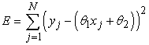

<?xml version="1.0" encoding="UTF-8" standalone="no"?>

<html xmlns="http://www.w3.org/1999/xhtml"><head><meta name="generator" content="DocBook XSL Stylesheets V1.76.1"/></head><body>

<h1 class="title"><a id="id739621"/>Teljes adattal történő tanulás</h1>

A statisztikai tanulási módszerek tárgyalását a legegyszerűbb feladattal kezdjük: <strong>paramétertanulás</strong> (<strong>parameter learning</strong>)<strong> teljes adat</strong> (<strong>complete data</strong>) alapján. A paramétertanulás egy rögzített struktúrájú valószínűségi modell paramétereinek megtalálását foglalja magában. Például meg akarjuk tanulni egy adott struktúrájú Bayes-háló feltételes valószínűségeit. Az adatokat akkor nevezzük teljesnek, ha mindegyik adatpont értékeket hordoz a megtanulandó valószínűségi modell mindegyik paraméterére. A teljes adatok nagyban egyszerűsítik a komplex modellek paramétereinek tanulását. Nagy vonalakban áttekintjük majd a struktúratanulás problematikáját is.

<h2 class="title"><a id="id739646"/>Maximum-likelihood paramétertanulás: diszkrét modellek</h2>

Tegyük fel, hogy új gyártótól vásárolunk egy zsák citrom- és meggycukorkát, a meggyarány teljesen ismeretlen, bárhol lehet 0 és 1 között. Ez esetben kontinuum számosságú hipotézisünk van. A <strong>paraméter</strong> (<strong>parameter</strong>), amelyet <em>θ</em>-val jelölünk, most a meggycukorkák aránya, a hipotézis pedig <em>hθ</em>. (A citromízűek aránya egyszerűen 1 – <em>θ</em>.) Ha feltételezzük, hogy a priori minden arány egyformán valószínű, akkor a maximum-likelihood megközelítés az ésszerű. Ha Bayes-hálóval modellezzük a helyzetet, akkor csupán egyetlen véletlen változóra van szükségünk. Legyen ez az <em>Íz</em> nevű változó (a zacskóból véletlenszerűen választott cukorka íze). Lehetséges értékei a <em>meggy</em> és a <em>citrom</em>, ahol a <em>meggy</em> valószínűsége <em>θ</em> (lásd 20.2. (a) ábra). Tegyük fel, hogy kibontunk <em>N</em> cukorkát, amelyek közül <em>c</em> meggyízű és <em>ℓ</em> = <em>N</em> – <em>c</em> citromízű. A (20.3) egyenlet alapján ennek a speciális adathalmaznak a valószínűsége:

<a id="id739720"/>
<strong>20.2. ábra - (a) Bayes-háló modell az ismeretlen arányban citrom-, illetve meggyízű cukorkák esetére. (b) Annak a modellje, amikor a csomagolópapír színe függ (valószínűségi alapon) a cukorka ízétől.</strong>

A maximum-likelihood hipotézist az a <em>θ</em> érték adja, amely maximálja ezt a kifejezést. Ugyanezt az értéket kapjuk, ha a <strong>log likelihood</strong> függvényt maximáljuk.

(A kifejezés logaritmusát képezve a szorzatot szummává redukáltuk, amit rendszerint egyszerűbb maximálni.) A maximum-likelihood <em>θ</em> érték megtalálása érdekében differenciáljuk <em>L</em>-et <em>θ</em> szerint, a kapott kifejezést pedig tegyük egyenlővé nullával:

Magyarán a <em>h</em>ML maximum-likelihood hipotézis azt állítja, hogy a zacskóban a meggyízű cukorkák valós aránya megegyezik az eddig kibontott cukorkáknál megfigyelt aránnyal!

Úgy tűnik, rengeteget dolgoztunk, hogy felfedezzünk egy nyilvánvaló eredményt. Valójában lefektettünk egy standard módszert a maximum-likelihood paramétertanulásra:

<ol class="orderedlist"><li class="listitem">
Írjunk fel egy – a paraméter(ek)től függő – kifejezést az adatok együttes valószínűségére (írjuk fel a likelihood függvényt).
</li><li class="listitem">
Írjuk fel minden egyes paraméter szerint a log likelihood függvény deriváltját.
</li><li class="listitem">
Keressük meg azokat a paraméterértékeket, amelyek mellett a deriváltak nulla értéket vesznek fel.
</li></ol>

<h3 class="title">Fontos</h3>
A legtrükkösebb lépés általában az utolsó. Az előző példánkban triviálisan megoldható volt, de látni fogjuk, hogy sokszor iteratív megoldásokhoz vagy más numerikus optimalizálási technikákhoz kell folyamodnunk, mint ahogy a 4. fejezetben tárgyaltuk. A példa a maximum-likelihood tanulás egy általános problémáját is illusztrálja: <em>ha az adathalmaz elég kicsi ahhoz, hogy néhány eseményt még nem figyeltünk meg – például nem találtunk még meggyízű cukorkát –, akkor a maximum-likelihood hipotézis nulla valószínűséget rendel ezekhez az eseményekhez.</em> Számos trükköt használnak, hogy elkerüljék ezt a problémát, mint például minden esemény kezdeti valószínűségét 1-re állítják nulla helyett.

Nézzünk egy másik példát. Tegyük fel, hogy a cukorka gyártója némi információt akar adni a fogyasztónak, ezért piros és zöld csomagolópapírt használ. A <em>Csomagoló</em> mindegyik cukorkához véletlenszerűen kerül kiválasztásra, valamilyen ismeretlen – az íztől függő – feltételes valószínűség-eloszlás szerint. Az ehhez tartozó valószínűségi modellt a 20.2. (b) ábra mutatja. Vegyük észre, hogy három paramétere van: <em>θ</em>, <em>θ</em>1 és <em>θ</em>2. Ezekkel a parméterekkel a Bayes-hálók standard szemantikáját használva megadható annak a valószínűsége, hogy – mondjuk – egy meggyízű cukorkát találunk egy zöld csomagolóban (<a class="xref" href="ch14s02.md#ID_581_582_oldal">„Az együttes valószínűség-eloszlás függvény leírása”</a> rész):

Most kibontunk <em>N</em> cukorkát, amelyek közül <em>c</em> meggyízű és <em>ℓ</em> citromízű. A csomagolásfajták számai a következők: <em>rc </em>meggyízű volt pirosba csomagolva<em> </em>és<em> gc </em>zöldbe, míg<em> rℓ</em> citromízű volt pirosba csomagolva, míg <em>gℓ</em> zöldbe. Ezen adatok együttes valószínűsége:

Ez meglehetősen ijesztőnek tűnik, de segít, ha a logaritmusát vesszük:

<code class="code"><em>L </em>= [<em>c</em>log<em>θ </em>+<em> ℓ</em>log(1 – <em>θ</em>)] + [<em>rc </em>log<em>θ</em>1 + <em>gc </em>log(1 – <em>θ</em>1)] + [<em>rℓ </em>log<em>θ</em>2 + <em>gℓ </em>log(1 – <em>θ</em>2)]</code>

A logaritmusképzés előnye nyilvánvaló: a log likelihood függvény három tag összege, ahol mindegyik tag csupán egyetlen paramétert tartalmaz. Amikor sorban mindegyik paraméter szerint vesszük az összefüggés deriváltját, majd nullává tesszük a deriváltakat, három független egyenlethez jutunk, és mindegyik csupán egyetlen paramétert tartalmaz:

A <em>θ</em>-ra kapott megoldás ugyanaz, mint az előbb. A <em>θ</em>1-re kapott megoldás, tehát annak valószínűsége, hogy egy meggyízű cukorka piros papírba csomagolt, nem más, mint a megfigyelt meggyízű cukorka – piros papír arány, hasonló a helyzet <em>θ</em>2-vel.

<h3 class="title">Fontos</h3>
Ezek az eredmények nagyon kényelmesek, és könnyen belátható, hogy kiterjeszthetők bármely Bayes-hálóra, amelynek feltételes valószínűségeit táblázatokkal adjuk meg. A legfontosabb eredmény a következő: <em>teljes adatok esetén a Bayes-háló paramétertanulási problémája elkülönülő tanulási problémákra dekomponálható, egy-egy probléma egy-egy paraméterre.[<a id="id740005" href="#ftn.id740005" class="footnote">196</a>]</em> A második eredmény, hogy az egyes paraméterek adott szülő melletti értékei éppen a szülőértékek mellett megfigyelt gyakoriságokkal egyeznek meg. Éppúgy, mint az előző helyzetben, itt is óvatosnak kell lennünk, hogy kis adathalmazok esetén el tudjuk kerülni a nulla értékeket.

<h2 class="title"><a id="id740011"/>Naiv Bayes-modellek</h2>

Valószínűleg a gépi tanulás területén használt legelterjedtebb Bayes-háló modell a <strong>naiv Bayes-modell</strong> (<strong>naive Bayes</strong>). Ebben a modellben a <em>C</em> „osztályváltozó” (amelyet meg akarunk jósolni) a gyökér, míg az <em>Xi</em> attribútumváltozók a levelek. A modell azért „naiv”, mert feltételezi, hogy adott osztály mellett az attribútumok feltételesen függetlenek egymástól. (A 20.2. (b) ábra modellje egy egyváltozós naiv Bayes-modell.) Logikai változókat feltételezve a paraméterek:

<code class="code"><em>θ </em>= <em>P</em>(<em>C</em> = <em>igaz</em>),<em> θi</em>1 =<em>P</em>(<em>Xi</em> = <em>igaz</em>|<em>C</em> = <em>igaz</em>), <em>θ</em><em>i</em>2 = <em>P</em>(<em>Xi</em> = <em>igaz</em>|<em>C</em> = <em>hamis</em>)</code>

A maximum-likelihood paramétereket pontosan úgy kapjuk meg, mint a 20.2. (b) ábra esetén. Ha a modellt ezen az úton megtanítottuk, akkor felhasználható arra, hogy olyan új példákat osztályozzon, amelyekre a <em>C</em> osztályváltozó nem ismert. A megfigyelt <em>x</em>1, ..., <em>xn</em> attribútumértékek mellett az egyes osztályok valószínűségét a következő összefüggés adja:

<a id="id740137"/>
<strong>20.3. ábra - A 18. fejezet étterem problémájára alkalmazott naiv Bayes-tanulás tanulási görbéje. A döntési fa tanulás tanulási görbéjét összehasonlítás céljából ábrázoltuk.</strong>

<h3 class="title">Fontos</h3>
Ha a legvalószínűbb osztályt választjuk, determinisztikus predikció adható. A 20.3. ábra mutatja a módszer tanulási görbéjét, ha a 18. fejezet étterem problémájára alkalmazzuk. A módszer elég jól tanul, de nem olyan jól, mint egy döntési fa tanulás. Ennek oka valószínűleg az, hogy a helyes hipotézis – ami egy döntési fa – nem reprezentálható pontosan naiv Bayes-modellel. A naiv Bayes-tanulás sok alkalmazási területen meglepően jól teljesít, a fokozott teljesítményű, turbó változata <em>(boosted version) </em>egyike a leghatékonyabb általános célú tanuló algoritmusoknak (lásd 20.5. feladat). A módszer nagyon nagy méretű problémákhoz is jól alkalmazható, <em>n</em> logikai változó esetén is csak 2<em>n </em>+ 1 paramétere lesz, és <em>ahhoz, hogy a naiv Bayes-tanulás meghatározza hML-t, nincs szükség keresésre</em>. Végül a naiv Bayes-tanulásnak nem jelentenek gondot a zajos adatok, továbbá ha szükséges, akkor képes valószínűségi predikciókat is adni.

<h2 class="title"><a id="id740169"/>Maximum-likelihood paramétertanulás: folytonos eset</h2>

<a id="ID_826_827_oldal"/>
A 14.3. alfejezetben vezettük be a folytonos valószínűségi modelleket, mint például a <strong>lineáris Gauss</strong>- (<strong>linear-Gaussian</strong>) modelleket. Mivel a valós alkalmazásokban mindenütt folytonos változókkal találkozunk, fontos ismernünk a folytonos modellek adatokból történő megtanulásának módszereit. A maximum-likelihood tanulás elvei azonosak a diszkrét esetre vonatkozó tanulás elveivel.

Kezdjük egy rendkívül egyszerű esettel: egyetlen skalár változó Gauss-sűrűségfüggvényének a paramétereit tanuljuk. Azaz az adatokat a következő összefüggéssel generáljuk:

A modell paraméterei a <em>μ</em> átlag és a <em>σ</em> szórás. (Vegyük észre, hogy a normalizáló konstans is függ <em>σ</em> -tól, ezért nem hanyagolhatjuk el.) Legyenek a megfigyelt értékek <em>x</em>1,..., <em>xN</em>. Ekkor a log likelihood:

A deriváltakat szokásos módon nullává téve a következőket kapjuk:

Tehát az átlag maximum-likelihood becslése a mintaátlag, a szórás maximum-likelihood becslése pedig a minta átlagos szórásnégyzetének négyzetgyöke. Ezek ismét kedvező eredmények, mivel megerősítik a „józan ésszel” követett gyakorlatot.

Vizsgáljunk most egy lineáris Gauss-modellt, amelyben egy <em>X</em> folytonos szülő és <em>Y</em> folytonos gyermek van. Mint az <a class="xref" href="ch14s03.md#ID_589_oldal">„Bayes-hálók folytonos változókkal”</a> részben megmutattuk, <em>Y</em> Gauss-eloszlású, átlaga lineárisan függ <em>X</em>-től, míg varianciája rögzített. A <em>P</em>(<em>X</em>|<em>Y</em>) feltételes eloszlás tanulásához maximalizálhatjuk a feltételes likelihood függvényt:

<a id="id740286"/>
<strong>20.4. ábra - (a) Egy <em>y</em> = (<em>θ</em>1 + <em>θj</em> + <em>θ</em>2) egyenlettel leírható lineáris Gauss-modell additív, rögzített varianciájú Gauss-zajjal. (b) E modell alapján generált 50 adatpontból álló halmaz.</strong>

Itt a paraméterek <em>θ</em>1, <em>θ</em>2 és <em>σ</em>. Mint a 20.4. ábrán szemléltettük, az (<em>xj</em>, <em>yj</em>) párok gyűjteménye adja az adatokat. A szokásos módszereket használva (lásd 20.6. feladat) megkaphatjuk a paraméterek maximum-likelihood értékeit. Itt most egy másik dolgot akarunk megmutatni. Vegyük csupán a <em>θ</em>1 és <em>θ</em>2 paramétereket, amelyek az <em>x</em> és <em>y</em> közti lineáris összefüggést definiálják! Nyilvánvaló, hogy a log likelihood ezen paraméterekkel történő maximalizálása azonos azzal, mintha a (20.5) kifejezésben a kitevő számlálóját <em>minimalizálnánk:</em>

Az (<em>y</em>j – (<em>θ</em>1<em>xj</em> + <em>θ</em>2)) mennyiség valójában az (<em>xj</em>, <em>yj</em>) <strong>hibá</strong>ja (<strong>error</strong>) – azaz a tényleges <em>y</em><em>j</em> érték és a becsült érték különbsége. Így <em>E</em> nem más, mint a jól ismert <strong>hibanégyzetek összege</strong> (<strong>sum of squared errors</strong>). Ezt a standard <strong>lineáris regresszió</strong> (<strong>linear regression</strong>) minimalizálja. Most megérthetjük, hogy miért: a hibanégyzetek összegének minimalizálása nem más, mint a maximum-likelihood lineáris (egyenessel ábrázolható) modell megadása, <em>feltéve, hogy az adatokat rögzített varianciájú Gauss-zaj mellett generáltuk</em>.

<h2 class="title"><a id="id740463"/>Bayes-paramétertanulás</h2>

A maximum-likelihood tanulás alkalmat ad néhány nagyon egyszerű eljárás létrehozására, de kis adathalmazok esetén súlyos hiányosságokat mutat. Például egyetlen meggyízű cukorka észlelése után az a maximum-likelihood hipotézis, hogy a csomag 100%-a meggytípusú (azaz <em>θ</em> = 1,0). Ha nincs olyan hipotézis prior, hogy a csomagok mind vagy csupa meggy-, vagy csupa citromtípusúak, akkor ez nem józan következtetés. A Bayes-megközelítésű paramétertanulás egy hipotézis priort állít fel a lehetséges paraméterértékekre, és ahogy az adatok érkeznek, úgy frissíti az eloszlást.

A 20.2. (a) cukorka példának egyetlen <em>θ</em> paramétere van; annak valószínűsége, hogy egy véletlenszerűen kiválasztott cukorka meggyízű. Bayes-megközelítésben <em>θ</em> a Θ valószínűségi változó (ismeretlen) értéke, a hipotézis prior pedig nem más, mint a <strong>P</strong>(Θ) a priori eloszlás. Így P(Θ = <em>θ</em>) annak a priori<em> </em>valószínűsége, hogy a csomag <em>θ</em> arányban tartalmaz meggyízű cukrokat.

<a id="id740499"/>
<strong>20.5. ábra - Példák a béta[<em>a</em>,<em>b</em>] eloszlásra különböző [<em>a</em>,<em>b</em>] értékek esetén</strong>

Ha a <em>θ</em> tetszőleges értéket felvehet 0 és 1 között, akkor a<em> </em><strong>P</strong>(Θ)-nek egy folytonos eloszlásnak kell lennie, amely csak 0 és 1 között nem nulla értékű, és integrálja 1. Egy lehetséges jelölt az egyenletes eloszlás <em>P</em>(<em>θ</em>) = <em>U</em>[0, 1]<em> </em>(<em>θ</em>). (Lásd 13. fejezet.) Az egyenletes eloszlás a <strong>béta-eloszlás</strong>ok (<strong>beta distribution</strong>s) családjának tagja. Minden egyes béta-eloszlás két <strong>hiperparaméter</strong>rel[<a id="id740570" href="#ftn.id740570" class="footnote">197</a>] (<strong>hyperparameter</strong>) – <em>a</em>-val és <em>b</em>-vel – definiálható a következő egyenlet szerint:

<code class="code">béta[<em>a</em>,<em>b</em>]<em> </em>(<em>θ</em>) = <em>αθa</em>–1 (1–<em>θ</em>)<em>b</em>–1					(20.6)</code>

A (20.6) megadja <em>θ</em>-ra a [0, 1] tartományban a sűrűségfüggvény értékét. Az <em>α</em> normáló konstans <em>a</em>-tól és <em>b</em>-től függ. (Lásd 20.8. feladat.) A 20.5. ábrán bemutatjuk, hogy hogyan néz ki az eloszlás különböző <em>a</em>-k és <em>b</em>-k esetén. Az eloszlás átlaga <em>a</em>/(<em>a +</em> <em>b</em>), tehát nagyobb <em>a</em> értékek arra utalnak, hogy Θ-t 1-hez közelebb hisszük, mint 0-hoz. Az <em>a +</em> <em>b</em> nagyobb értékei az eloszlást csúcsosabbá teszik, ami a Θ értéke felőli nagyobb bizonyosságunkat jelenti. Látható, hogy a béta-család a hipotézis prior lehetőségek hasznos választékát nyújtja.

Rugalmasságán túl a béta-családnak van még egy csodálatos tulajdonsága: ha a Θ priorja béta[<em>a</em>, <em>b</em>], akkor egy adatpont megfigyelése után Θ a posteriori eloszlása is béta-eloszlás. A béta-családot a logikai változók eloszlása <strong>konjugált prior</strong>jának (<strong>conjugate prior</strong>) nevezzük.[<a id="id740696" href="#ftn.id740696" class="footnote">198</a>] Lássuk, hogyan is működik ez. Tegyük fel, hogy megfigyeltünk egy meggyízű cukrot, ekkor:

<code class="code">P(<em>θ</em>|<em>D</em>1 = <em>meggy</em>) = <em>αP</em>(<em>D1 = meggy</em>|<em>θ</em>)<em>P</em>(<em>θ</em>)</code>

<code class="code">		     = <em>α</em>'<em>θ</em> ·<em> </em>beta[<em>a</em>,<em>b</em>](<em>θ</em>) =<em> α</em>'<em>θ </em>·<em> θa</em>–1(1–<em> θ</em>)<em>b</em>–1</code>

<code class="code">		     = <em>α</em>'<em>θa </em>(1–<em> θ</em>)<em>b</em>–1 = beta[<em>a +</em> 1,<em>b</em>](<em>θ</em>)</code>

Tehát egy meggyízű cukrot észlelve egyszerűen inkrementáljuk az <em>a</em> paramétert, hasonlóképpen, ha egy citromízűt észlelünk, akkor inkrementáljuk a <em>b</em> paramétert – ezzel megkapjuk az a posteriori eloszlást. Ezek szerint úgy tekinthetünk <em>a</em>-ra és <em>b</em>-re, mint <strong>virtuális számláló</strong>kra (<strong>virtual count</strong>s), abban az értelemben, hogy a béta[<em>a</em>, <em>b</em>] prior pontosan úgy viselkedik, mintha egyenletes eloszlású priorral indultunk volna, és <em>a </em>– 1 meggycukorkát és <em>b </em>– 1 citromízű cukorkát láttunk volna.

Tanulmányozva a béta-eloszlások sorozatát növekvő – de állandó arányú – <em>a</em> és <em>b</em> mentén, jól láthatjuk, hogyan változik a Θ paraméter a posteriori eloszlása az adatok beérkezése során. Tegyük fel például, hogy a vizsgált zacskó 75%-a meggytípusú. A 20.5. (b) ábra mutatja a béta[3, 1], béta[6, 2], béta[30, 10] eloszlássorozatot. Nyilvánvaló, hogy az eloszlás egy – a valós Θ körül elhelyezkedő – keskeny csúcs felé tart. Nagy adathalmazok esetén a Bayes-tanulás (legalábbis ebben az esetben) ugyanahhoz az eredményhez konvergál, mint amit a maximum-likelihood tanulás adott.

A 20.2. (b) ábrán a hálónak három paramétere volt: <em>θ</em>, <em>θ</em>1 és <em>θ</em>2, ahol <em>θ</em>1 volt annak valószínűsége, hogy piros csomagolás van egy meggycukorkán, míg <em>θ</em>2 az, hogy egy citromízű cukron van piros csomagolás. A Bayes hipotézis priornak mindhárom paramétert le kell fednie – azaz P(Θ, Θ1, Θ2)-t kell specifikálnunk. Rendszerint <strong>paraméterfüggetlenség</strong>et (<strong>parameter independence</strong>) tételezünk fel:

<code class="code"><em>P</em>(Θ, Θ1, Θ2) = <em>P</em>(Θ)<em>P</em>(Θ1)<em>P</em>(Θ2)</code>

Ezen feltételezés esetén minden egyes paraméternek saját béta-eloszlása lehet, amelyet külön-külön frissíthetünk az adatok érkeztekor.

<a id="id740967"/>
<strong>20.6. ábra - Egy Bayes-tanulásnak megfelelő Bayes-háló. A Θ, Θ1, Θ2 változók a posteriori eloszlásai kikövetkeztethetők az a priori eloszlásokból és az <em>Ízi</em>, <em>Csomagolói</em> változókra vonatkozó tényekből.</strong>

Ha már az volt az ötletünk, hogy az ismeretlen paramétereket valószínűségi változókkal reprezentáljuk – amilyen például Θ –, akkor természetes módon adódik, hogy azokat beépítsük magába a Bayes-hálóba. Ahhoz, hogy ezt megtehessük, minden egyes példa leírásához másolatot kell készítenünk a változókról. Ha például három cukorkát figyeltünk meg, akkor szükségünk van a következő változókra: <em>Íz</em>1, <em>Íz</em>2, <em>Íz</em>3 és <em>Csomagoló</em>1, <em>Csomagoló</em>2, <em>Csomagoló</em>3. A Θ paraméterváltozó határozza meg minden egyes <em>Ízi</em> változó valószínűségét:

<code class="code"><em>P</em>(<em>Ízi</em> = <em>meggy</em>|Θ = <em>θ</em>)<em> = θ</em></code>

Hasonlóképpen a csomagoló valószínűsége Θ1-től és Θ2-től függ. Például:

<code class="code"><em>P</em>(<em>Csomagolói</em> = <em>piros</em>|<em>Ízi</em> = <em>meggy</em>, Θ1 = <em>θ</em>1) = <em>θ</em>1</code>

<h3 class="title">Fontos</h3>
Ezek után az egész Bayes-tanulási folyamat formalizálható egy megfelelően konstruált Bayes-háló következtetési problémájaként, amint a 20.6. ábrán látható. Egy új példány predikciója egyszerűen azt jelenti, hogy új példányváltozókat adunk a hálóhoz, amelyből egyesekre rákérdezünk. A tanulás és a predikció ezen formalizmusa nyilvánvalóvá teszi, hogy a Bayes-tanuláshoz nem kell semmilyen extra „tanulási elv”. Megállapíthatjuk továbbá, hogy <em>lényegében csak egyetlen tanulási algoritmus van</em>, ami a Bayes-háló következtetési algoritmusa.

<h2 class="title"><a id="id741373"/>Bayes-hálóstruktúrák tanulása</h2>

Az eddigiekben azt feltételeztük, hogy a Bayes-háló struktúrája ismert, és csak a paramétereket próbáljuk megtanulni. A háló struktúrája a terület alapvető oksági viszonyaira vonatkozó tudást reprezentálja, amit sok esetben egy szakember, de még egy naiv felhasználó is, nagyon egyszerűen meg tud adni. Néhány esetben azonban az oksági összefüggések nem állnak rendelkezésre vagy vitatottak – például bizonyos nagyvállalatok régóta állítják, hogy a dohányzás nem okoz rákot. Ilyenkor fontos megérteni, hogy a Bayes-háló struktúrája mi módon tanulható meg az adatokból. Jelenleg a struktúratanulási algoritmusok gyerekcipőben járnak, ezért csak egy elnagyolt vázlatot adunk a legfontosabb elvekről.

A legkézenfekvőbb megközelítés, ha egy jó modell érdekében<em> keresést</em> folytatunk. Elindulhatunk egy kapcsolatokat nem tartalmazó modellel, majd elkezdünk szülőcsomópontot adni minden csomóponthoz, az előbbiekben bemutatott módszerekkel illesztve a paramétereket, és mérjük a modell pontosságát. Másik lehetőség, hogy egy becsült struktúrával indulunk, és hegymászó vagy szimulált lehűtést alkalmazó algoritmusokat használunk a módosításokhoz, minden egyes struktúraváltoztatás után újrahangolva a paramétereket. A módosítások közé tartozik az élek megfordítása, hozzáadása, törlése. Nem szabad ciklusokat létrehoznunk a folyamat során, ezért sok algoritmus azt feltételezi, hogy adott a változók egy rendezése, és egy csomópont szülője csak azon csomópontok közül kerülhet ki, amelyek előbb jönnek a rendezésben (éppúgy, mint a 14. fejezet konstrukciós eljárásában). A teljes általánosság kedvéért a lehetséges rendezések között is keresnünk kell.

Két alternatív módszer van arra, hogy észrevegyük, amikor egy jó megoldást találtunk. Az első annak tesztelése, hogy az aktuális adatok kielégítik-e azokat a feltételes függetlenségre vonatkozó állításokat, amelyek a struktúrában implicit módon benne vannak. Például az étterem probléma egy naiv Bayes-modellje feltételezi, hogy:

<code class="code"><em>P</em>(<em>Péntek/Szombat</em>, <em>Bár</em>|<em>VárjunkE</em>) <em>P</em>(<em>Péntek/Szombat</em>|<em>VárjunkE</em>)<em>P(Bár</em>|<em>VárjunkE</em>)</code>

és leellenőrizhetjük az adatokon, hogy ugyanez az egyenlet fennáll-e a megfelelő feltételes gyakoriságok közt is. Viszont még akkor is, ha a struktúra a terület valós oksági természetét írja le, az adathalmaz – a statisztikai ingadozások miatt – az egyenletet soha nem elégíti ki <em>pontosan.</em> Ezért megfelelő statisztikai próbákat kell elvégeznünk, hogy eldöntsük: elég bizonyítékunk van-e arra, hogy a függetlenségi hipotézisek sérülnek. Az eredményül kapott háló bonyolultsága az ezen tesztekben alkalmazott küszöbtől függ majd – minél szigorúbb a függetlenségi teszt, annál több kapcsolatot adunk majd a struktúrához, és annál nagyobb lesz a túlilleszkedés veszélye.

A jelen fejezetben bemutatott gondolatoknak jobban megfelelő megközelítés annak értékelése, hogy a javasolt modell mennyire magyarázza meg az adatokat (valószínűségi értelemben). Mindamellett óvatosnak kell lennünk ennek mérésénél. Ha egyszerűen a maximum-likelihood hipotézist akarjuk megtalálni, akkor egy teljesen összekötött hálónál fogunk kikötni, mivel további szülőcsomópontok hozzáadása egy csomóponthoz nem csökkentheti a valószínűséget (lásd 20.9. feladat). Valamilyen módon büntetnünk kell a modell bonyolultságát. A MAP (vagy MLH) megközelítés egyszerűen levon egy büntetőtagot az egyes struktúrák valószínűségéből (miután hangolta paramétereiket), ezek után hasonlítja össze a különböző struktúrákat. A Bayes-megközelítés a struktúrák és paraméterek együttes priorját használja. Rendszerint túl sok – a változók számán szuperexponenciális – struktúra van ahhoz, hogy mind felett összegezzünk, így a gyakorlatban legtöbben az MCMC (Markov lánc Monte Carlo) módszert használják, hogy mintát vegyenek a struktúrákból.

A bonyolultság büntetése (akár MAP, akár Bayes-megközelítésben) fontos kapcsolatot hoz be az optimális struktúra és a feltételes valószínűségek hálóbeli reprezentációs módja között. Táblázatosan ábrázolt eloszlás esetén a bonyolultság büntetése a szülőcsomópontok számával exponenciálisan nő, míg, mondjuk, zajos-vagy eloszlások esetén csak lineárisan. Ez azt jelenti, hogy a zajos-vagy (illetve más tömören paraméterezett) modellek tanulása több szülőcsomópontot eredményez, mint a táblázatos eloszlás tanulása.

 

[<a id="ftn.id740005" href="#id740005" class="para">196</a>]  Nem táblázatos formára lásd a 20.7. feladatot, amelyben mindegyik paraméter hatással van számos feltételes valószínűségre.

[<a id="ftn.id740570" href="#id740570" class="para">197</a>]  Azért hívjuk hiperparamétereknek, mert <em>θ</em> eloszlásának paramétereiről van szó, ahol <em>θ</em> maga is egy paraméter.

[<a id="ftn.id740696" href="#id740696" class="para">198</a>]  További konjugált priorok: a diszkrét többváltozós eloszlások paramétereire a <strong>Dirichlet</strong> család, a Gauss-eloszlások paramétereire a <strong>Normal–Wishart</strong> család. Lásd Bernardo és Smith (1994).

</body></html>
