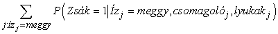

<?xml version="1.0" encoding="UTF-8" standalone="no"?>

<html xmlns="http://www.w3.org/1999/xhtml"><head><meta name="generator" content="DocBook XSL Stylesheets V1.76.1"/></head><body>

<h1 class="title"><a id="id741433"/>Rejtett változókkal történő tanulás: az EM algoritmus</h1>

<h3 class="title">Fontos</h3>
Az előző rész a teljesen megfigyelhető esettel foglalkozott. Számos valós problémában vannak <strong>rejtett változó</strong>k (<strong>hidden variable</strong>s), amelyeket néha <strong>latens változó</strong>knak (<strong>latent variable</strong>s) is hívnak. Ezek nem figyelhetők meg a tanulás céljára rendelkezésre álló adatokban. Például az orvosi feljegyzések gyakran tartalmazzák a megfigyelt tüneteket, az alkalmazott kezelést, esetleg e kezelés eredményét, de ritkán tartalmazzák magának a betegségnek a közvetlen megfigyelését.[<a id="id741459" href="#ftn.id741459" class="footnote">199</a>] Megkérdezhetnénk, „ha a betegséget magát nem figyelhetjük meg, akkor miért nem állítunk fel egy modellt nélküle? A választ a 20.7. ábrán tüntettük fel, amely szívbetegségek egy kis, fiktív modelljét mutatja. Három hajlamosító tényező és három megfigyelhető tünet van (amelyek túl nyomasztók ahhoz, hogy megnevezzük őket). Tegyük fel, hogy mindegyik háromféle értéket vehet fel (pl. <em>nincs</em>, <em>közepes</em>, <em>súlyos</em>). A rejtett változó eltávolítása az (a) hálóból a (b) hálóhoz vezet; a paraméterek száma 78-ról 708-ra nő. Tehát <em>a rejtett változók drámaian csökkenthetik a Bayes-háló megadásához szükséges paraméterek számát</em>. Ez viszont drámaian csökkentheti a paraméterek megtanulásához szükséges adatok mennyiségét.

<a id="id741478"/>
<strong>20.7. ábra - (a) A rejtett változónak feltételezett szívbetegség egyszerű diagnosztikai hálója. Minden egyes változónak három lehetséges értéke van, a változókat a feltételes eloszlásukban szereplő független változók számával címkéztük, a végső számuk 78. (b) A <em>SzívBetegség </em>eltávolításával<em> </em>készült ekvivalens háló. Vegyük észre, hogy a tünetváltozók most már nem feltételesen függetlenek, ha a szülőket megadjuk. Ez a háló 708 paramétert igényel.</strong>

A rejtett változók fontosak, de bonyolítják a tanulási problémát. A 20.7. (a) ábrán például nem világos, hogy adott szülőcsomópontok esetén hogyan tanulható meg a <em>SzívBetegség</em> feltételes eloszlása, mivel nem ismert az értéke az egyes esetekben. Ugyanez a probléma fellép a tünetek eloszlásának tanulásánál is. Ebben a részben egy olyan – <strong>expectation–maximization</strong>,[<a id="id741506" href="#ftn.id741506" class="footnote">200</a>] <strong>EM</strong> nevű – algoritmust ismertetünk, amely nagyon általános megoldást ad erre a problémára. Három példát mutatunk be, majd általános leírást adunk. Ez az algoritmus először holmi mágiának tűnik, de amint a mögöttes intuíciót megértettük, a tanulási problémák hatalmas területén egy sor helyen alkalmazhatjuk.

<h2 class="title"><a id="id741525"/>Nem ellenőrzött osztályozás: Gauss-eloszlások keverékének tanulása</h2>

A <strong>nem ellenőrzött osztályozás</strong> vagy <strong>klaszterezés</strong> (<strong>unsupervised clustering</strong>) az a probléma, amikor objektumok valamilyen gyűjteményében több kategóriát különböztetünk meg. A probléma nem ellenőrzött, mivel a kategóriacímkék nincsenek megadva. Tegyük fel például, hogy felvesszük százezer csillag spektrumát. Az a kérdés, hogy a spektrumok alapján vannak-e különböző <em>típusú</em> csillagok, és ha igen, akkor hányféle, és mik a jellemzőik? Mindannyian jól ismerünk olyan neveket, mint „vörös óriás” és „fehér törpe”, de a csillagoknak nincs ilyen címke a kalapjukon – a csillagászoknak nem ellenőrzött osztályozást kell végezniük ahhoz, hogy ezeket a kategóriákat felállítsák. Más példák lehetnek: a fajok, nemek, rendek stb. azonosítása a Linné-féle taxonómiában vagy hétköznapi tárgyak természetes kategóriáinak megalkotása (lásd 10. fejezet).

A nem ellenőrzött osztályozás az adatokkal kezdődik. A 20.8. (a) ábra 500 adatpontot ábrázol, mindegyik két folytonos attribútum értékét adja meg. Az adatpontok megfelelhetnek pl. csillagoknak, a két attribútum pedig pl. a spektrumvonalak erőssége két adott frekvencián. A következő lépés, hogy meg kell értenünk, milyen valószínűségi eloszlás generálhatta az adatokat. Az osztályozás azt feltételezi, hogy az adatok a <em>P</em> <strong>kevert eloszlás</strong>ból (<strong>mixture distribution</strong>) származnak. Egy ilyen eloszlás <em>k</em> <strong>komponens</strong>ből (<strong>component</strong>) áll, amelyek mindegyike önmagában egy-egy eloszlás. Az adatpont úgy jön létre, hogy először kiválasztjuk az egyik komponenst, majd ebből a komponensből generálunk egy mintát. Jelöljük a <em>C</em> véletlen változóval a komponenseket, amely változó az 1, …, <em>k</em> értékeket veheti fel. A kevert eloszlást ekkor a

összefüggés írja le, ahol <strong>x</strong> jelenti az adatpont attribútumait. Folytonos adatok esetén a komponensekre természetesen adódik a többváltozós Gauss-eloszlás, ami az úgynevezett <strong>kevert Gauss</strong>- (<strong>mixture of Gaussians</strong>) eloszlás családot adja. A kevert Gauss-eloszlás paraméterei: <em>wi =</em> <em>P</em>(<em>C =</em> <em>i</em>) (az egyes komponensek súlya), <em><strong>μ</strong>i </em>(az egyes komponensek várható értéke) <strong>Σ</strong>i (az egyes komponensek kovarianciája). A 20.8. (b) ábra három Gauss-eloszlás keverékét mutatja, valójában ez volt az (a) ábrán látható adathalmaz forrása.

Ez esetben a nem ellenőrzött osztályozási probléma abban áll, hogy a 20.8. (a) ábrán látható nyers adatokból kell visszaállítani a 20.8. (b) ábrán láthatóhoz hasonló kevert modellt. Nyilvánvaló, hogy ha <em>tudnánk,</em> melyik adatot melyik komponens generálta, akkor könnyű lenne visszaállítanunk az egyes Gauss-komponenseket. Egyszerűen kiválaszthatnánk az egyes komponensekhez tartozó összes adatpontot, majd alkalmazhatnánk a (20.4) egyenletet (tulajdonképpen annak többváltozós verzióját) a Gauss-paramétereknek az adatokhoz való illesztésére. Másrészről, ha <em>tudnánk</em> az egyes komponensek paramétereit, akkor – legalábbis valószínűségi értelemben – meg tudnánk adni, hogy melyik adatpont melyik eloszláshoz tartozik. A probléma az, hogy sem az adatpontok komponensekhez rendelését, sem a komponensek paramétereit nem ismerjük.

<a id="id741656"/>
<strong>20.8. ábra - (a) 500 kétdimenziós adatpont, amely három osztály jelenlétét sugallja. (b) Egy három-komponensű kevert Gauss-modell, a súlyok (balról jobbra) 0,2, 0,3 és 0,5. Az (a) ábrán látható adatokat ebből a modellből generáltuk. (c) Az adatokból az EM algoritmussal rekonstruált modell</strong>

Az EM algoritmus alapötlete ebben az összefüggésben az, hogy <em>úgy teszünk, mintha</em> ismernénk a modell paramétereit, majd kiszámítjuk minden egyes pont minden egyes komponenshez való tartozásának valószínűségét. Ezek után újraillesztjük a komponenseket az adatokhoz: mindegyik komponenst a teljes adathalmazhoz illesztjük, az egyes adatpontokat az adott komponenshez tartozás valószínűségével súlyozva. Az eljárást a konvergencia elértéig folytatjuk. Lényegében „teljessé tesszük” az adatokat azzal, hogy a rejtett változók – melyik adat melyik komponenshez tartozik – valószínűségi eloszlását kikövetkeztetjük a pillanatnyilag használt modell segítségével. A kevert Gauss-eloszlás esetén a paramétereknek tetszőleges módon kezdeti értéket adunk, majd a következő két lépést ismételjük:

<ol class="orderedlist"><li class="listitem">
E-lépés: Számítsuk ki a <em>pij</em>  = <em>P</em>(<em>C</em> = <em>i</em>|<strong>x</strong>j valószínűségeket, amelyek azt fejezik ki, hogy milyen valószínűséggel generálta az <em>i</em>-edik komponens <strong>x</strong>j-t. A Bayes-szabály alapján <em>pij</em> = <em>αP</em>(<strong>x</strong>j|<em>C</em> = <em>i</em>) <em>P</em>(<em>C</em> = <em>i</em>). A <em>P</em>(<strong>x</strong>j|<em>C</em> = <em>i</em>) tényező az <strong>x</strong>j valószínűsége az <em>i</em>-edik Gauss-eloszlásban, míg <em>P</em>(<em>C</em> = <em>i</em>) az <em>i</em>-edik Gauss-eloszlás súlya. Használjuk a <em> </em>definíciót.
</li><li class="listitem">
M-lépés: Számítsuk ki az új átlag, szórás és komponens súly paramétereket a következők szerint:
</li></ol>

Az E-lépés vagy <em>expectation</em> (várhatóérték-képzés) lépés úgy fogható fel, mintha a rejtett <strong>indikátor változó</strong> (<strong>indicator variable</strong>) <em>Zij</em> valószínűségének <em>pij</em> várható értékét (<em>expected value</em>) számítanánk ki. Ha az <em>i</em>-edik komponens generálta <strong>x</strong>j-t, akkor <em>Zij</em> értéke 1, különben pedig 0. Az M-lépés vagy <em>maximization</em> (maximumkeresés) lépés a rejtett változók adott várható értéke mellett megkeresi azokat a paramétereket, amelyek maximálják az adatokra felállított log likelihood függvényt. 

<h3 class="title">Fontos</h3>
A végső modellt – amelyet az EM segítségével a 20.8. (a) ábra adatain tanultunk – a 20.8. (c) ábra mutatja. Látszólag megkülönböztethetetlen attól az eredeti modelltől, amellyel az adatokat generáltuk. A 20.9. (a) ábra az adatoknak a pillanatnyi modellből számított log likelihood értékét mutatja az EM algoritmus futása során. Két pontra hívjuk fel a figyelmet. Először is, a végső modellre a log likelihood némileg meghaladja az arra a valós modellre számított értéket, amelyekkel az adatokat generáltuk. Ez meglepőnek tűnhet, de egyszerűen azt mutatja, hogy az adatokat véletlenszerűen generáltuk, és nem pontosan tükrözik a mögöttes modellt. A második, hogy <em>az EM minden iterációs lépésben növeli az adatok log likelihood értékét</em>. Ez általánosságban is bizonyítható. Továbbá bizonyos feltételek mellett belátható, hogy az EM biztosan eléri a likelihood egy lokális maximumát. (Ritka esetekben elérhet egy nyeregpontba, vagy akár egy lokális minimumba is.) Ebben az értelemben az EM egy gradiensalapú hegymászó algoritmusra emlékeztet, de vegyük észre, hogy nincs „lépésméret” paramétere!

<a id="id741877"/>
<strong>20.9. ábra - Az <em>L</em> log likelihood értéknek – az EM iterációszámának függvényében való – alakulását bemutató görbék. A vízszintes vonal a helyes modellnek megfelelő log likelihood értéket mutatja. (a) A 20.8. ábrán látható kevert Gauss-modellre vonatkozó görbe. (b) A 20.10. (a) ábrán látható Bayes-hálóra vonatkozó görbe.</strong>

A dolgok nem mennek mindig olyan jól, mint ahogy a 20.9. (a) ábra esetleg sugallja. Előfordulhat, hogy az egyik Gauss-komponens úgy összezsugorodik, hogy csak egyetlen adatpontot fed le. Ebben az esetben a varianciája nullához tart, a belőle számított likelihood pedig végtelenhez! Másik probléma lehet, hogy két komponens „összeolvad”, azonos átlagot és varianciát vesz fel, az adatpontokon pedig osztoznak. Az ilyen típusú degenerált lokális maximumok súlyos problémát jelentenek, elsősorban sokdimenziós terekben. Ennek a problémának egyik megoldása lehet megfelelő priorok állítása a modell paramétereire és az EM algoritmus MAP-változatának alkalmazása. Másik lehetőség a komponens újraindítása új paraméterekkel, ha túl kicsivé válik vagy túl közel kerül más komponensekhez. A paraméterek ésszerű kezdeti értékei szintén segítenek a probléma megoldásában.

<h2 class="title"><a id="id741894"/>Rejtett változókkal felépített Bayes-hálók tanulása</h2>

A rejtett változókkal felépített Bayes-hálók tanulásánál ugyanazokat a megközelítéseket alkalmazzuk, amelyek jól működtek a kevert Gauss-eloszlásokra. A 20.10. ábra azt a helyzetet mutatja, amikor két zsák cukorkát összekevertek. A cukrokat három tulajdonság írja le, az <em>Íz</em> és a <em>Csomagolás</em> mellett néhánynál megjelenik egy <em>Lyuk</em> a cukorka közepén, másoknál pedig nincs lyuk.

A cukorkák eloszlását minden egyes zsákban egy <strong>naiv Bayes</strong>-modell írja le; a tulajdonságok adott zsák esetén függetlenek, de mindegyik tulajdonság feltételes valószínűség eloszlása függ a zsáktól. A következő paramétereink vannak: <em>θ</em> annak az a priori valószínűsége, hogy a cukorka az 1. zsákból származik; <em>θ</em><em>I</em>1, illetve <em>θ</em><em>I</em>2 annak valószínűsége, hogy a cukorka meggyízű, feltéve, hogy az 1., illetve a 2. zsákból származik; <em>θ</em><em>Cs</em>1, illetve <em>θ</em><em>Cs</em>2 azokat a valószínűségeket jelölik, hogy a csomagolás piros; <em>θ</em><em>Ly</em>1, illetve <em>θ</em><em>Ly</em>2 pedig azokat a valószínűségeket, hogy a cukorka lyukas. Vegyük észre, hogy az egész modell egy kevert modell. (Valójában a kevert Gauss-eloszlásokat is modellezhetjük Bayes-hálóval, ahogy azt a 20.10. (b) ábra mutatja.) Az ábrán a zsák egy rejtett változó, mivel attól a pillanattól, hogy összekevertük a zsákok tartalmát, többet nem tudjuk megmondani egy cukorkáról, hogy melyik zsákból származott. Vissza tudjuk ebben az esetben nyerni a zsákok leírását, ha csupán az összekevert cukorkákat tudjuk megfigyelni?

<a id="id741972"/>
<strong>20.10. ábra - (a) A cukorkák kevert modellje. A különböző ízű cukorkák, a csomagolások, valamint a lyukas cukrok aránya a zsáktól függ, amelyet nem figyelünk meg. (b) Egy kevert Gaussra vonatkozó Bayes-háló. Az X megfigyelhető változó átlaga és kovarianciája a <em>C</em> komponenstől függ.</strong>

Vigyük végig az EM-iterációt erre a problémára. Először nézzük az adatokat. 1000 mintát generáltunk a következő paraméterekkel rendelkező (valódi) modell alapján:

<code class="code"><em>θ = 0,5, θI</em>1<em> = θCs</em>1<em> = θLy</em>1 = 0,8, <em>θ</em><em>I</em>2 = <em>θ</em><em>Cs</em>2 = <em>θ</em><em>Ly</em>2 = 0,3						(20.7)</code>
<a id="ID_836_oldal"/>
Azaz a cukorkák egyforma valószínűséggel származhatnak mindkét zsákból, az első zsák nagyobbrészt meggyízű cukrokat tartalmaz piros csomagolásban, és sok köztük a lyukas, a második inkább nem lyukas citromízűeket, zöld csomagolásban. A lehetséges nyolcféle cukor előfordulási számai a következők:

A paraméterek alapértékre állításával kezdünk. A könnyű számíthatóság kedvéért a következő értékeket választjuk:[<a id="id742057" href="#ftn.id742057" class="footnote">201</a>]

Először nézzük a <em>θ</em> paramétert. A teljesen megfigyelhető esetben ezt közvetlenül az 1. zsákból, illetve 2. zsákból származó cukorkák <em>megfigyelt</em> számaiból becsülnénk. Mivel a zsák rejtett változó, ehelyett a <em>várható</em> számértékekkel számolunk. A várható cukorkaszám  annak valószínűsége, az összes cukorkára összegezve, hogy a cukorka az 1. zsákból származik:

Ezek a valószínűségek a Bayes-hálókra kifejlesztett tetszőleges következtetési algoritmussal számíthatók. Naiv Bayes-hálókra, mint amilyen példánkban is szerepel, a következtetés „kézzel” elvégezhető, a Bayes-szabály és a feltételes függetlenség felhasználásával:

(Figyeljük meg, hogy a normalizáló konstans szintén a paraméterektől függ.) Alkalmazva ezt a képletet, mondjuk, a 273 pirosan csomagolt meggyízű cukorkára, amelyekben lyuk van, a következőt kapjuk:

A számok táblázatában található másik hét cukorkafajtával folytatva, θ (1) = 0,6124-et kapunk.

Nézzük a további paramétereket, mint pl. <em>θ</em><em>I</em>1-et. A teljesen megfigyelhető esetben ezt közvetlenül a <em>megfigyelt,</em> 1. zsákból származó meggy- és citromízű cukorkák számából becsülnénk. Az 1. zsákból származó meggycukorkák <em>várható</em> száma:

Ezek a valószínűségek ismét bármely Bayes-háló algoritmussal kiszámíthatók. Befejezve ezt az eljárást, megkapjuk az összes paraméter új értékét:

Az adatok log likelihood értéke a kezdeti kb. –2044-ről az első iteráció során kb. –2021-re nő, ahogy a 20.9. (b) ábrán látható. Eszerint a frissítés magát a likelihoodot kb. <em>e</em>23 ≈ 1010 szorzófaktorral növelte. A tizedik iterációra a megtanult modell jobban illeszkedik, mint a valódi (<em>L</em> = –1982,214). Ezek után a javulás nagyon lassúvá válik. Ez nem szokatlan az EM algoritmusnál, ezért sok gyakorlatban használt rendszer a tanulás végső fázisában gradiensalapú algoritmusokkal – mint pl. a Newton–Raphson-módszer (lásd 4. fejezet) – kombinálja az EM algoritmust.

<h3 class="title">Fontos</h3>
Az ebből a példából levonható általános tanulság az, hogy <em>a rejtett változókkal történő Bayes-háló tanulásparamétereinek frissítése közvetlenül rendelkezésünkre áll az egyes példákon történő következtetés eredményeképpen. Ráadásul csak</em> lokális <em>a posteriori valószínűségekre van szükségünk az egyes paraméterekhez.</em> Az általános esetben, amikor az egyes <em>Xi </em>változók feltételes valószínűségi paramétereit – azaz a <em>θijk = P</em>(X<em>i = </em>Xij|<em>Pai = paik</em>) értékeket – tanuljuk, adott szülőcsomópontok esetén, a frissítést a normalizált várható számértékek adják:

A várható számértékek a példák összegzésével nyerhetők, kiszámítva a <em>P</em>(<em>Xi </em>= xij, <em>Pai </em>= <em>paik</em>) valószínűségeket egy tetszőleges Bayes-háló következtetési algoritmussal. A pontos algoritmusok esetén – beleértve a változó eliminációt is – ezek a valószínűségek mind a következtetés melléktermékeként közvetlenül nyerhetők, a tanuláshoz nincs szükség semmilyen speciális extra számításra. Sőt minden egyes paraméter tanulásához szükséges információ <em>lokálisan</em> rendelkezésre áll.

<h2 class="title"><a id="id742263"/>Rejtett Markov-modellek tanulása</h2>

Az EM algoritmus utolsó, itt bemutatott alkalmazása a rejtett Markov-modellek (RMM) (hidden Markov model, HMM) állapotátmenet-valószínűségeinek tanulása. Idézzük fel a 15. fejezetből, hogy a rejtett Markov-modellek olyan dinamikus Bayes-hálóval reprezentálhatók, amelyeknek egyetlen, diszkrét állapotváltozója van, amint ez a 20.11. ábrán is látható. Minden egyes adatpont egy véges hosszúságú megfigyelés<em>sorozatnak</em> felel meg, tehát a megoldandó probléma az, hogy megfigyelési sorozatok halmaza (vagy esetleg egyetlen hosszú sorozat) alapján állapotátmenet-valószínűségeket kell megtanulnunk.

Már kimunkáltuk, hogy mi módon tudunk Bayes-hálókat megtanulni, de van egy nehézség: a Bayes-hálóknál minden egyes paraméter elkülönül, a rejtett Markov-modellben viszont időben <em>ismétlődnek</em> az egyes <em>θijt</em> = <em>P</em>(X<em>t</em>+1 = <em>j</em>|Xt = <em>i</em>) állapotátmenet-valószínűségek (annak valószínűsége, hogy a <em>t</em> időpillanatban az <em>i</em>-edik állapotból a <em>j</em>-edikbe jutunk), azaz <em>θijt</em> = <em>θij</em> minden <em>t</em>-re. Ahhoz, hogy megbecsüljük az <em>i</em>-edik állapotból a <em>j</em>-edik állapotba való átmenet valószínűségét, egyszerűen kiszámítjuk azon esetek várható arányát, amikor a rendszer az <em>i</em>-edik állapotban van és a <em>j</em>-edik állapotba megy:

<a id="id742357"/>
<strong>20.11. ábra - Rejtett Markov-modellt reprezentáló kiterített dinamikus Bayes-háló (a 15.14. ábra megismétlése)</strong>

Ismét tetszőleges RMM következtetési algoritmust használhatunk a várható számértékek kiszámítására. A 15.4. ábrán bemutatott <strong>előre-hátra</strong> (<strong>forward-backward</strong>) algoritmus könnyen módosítható úgy, hogy kiszámítsa a szükséges valószínűségeket. Egy fontos szempont, hogy azokra a valószínűségekre van szükségünk, amelyeket inkább <strong>simítás</strong>sal (<strong>smoothing</strong>) nyerünk, nem pedig <strong>szűrés</strong>sel (<strong>filtering</strong>): azaz nekünk utólagosan kell értékelnünk a bizonyítékokat az adott állapotátmenet bekövetkezési valószínűségének becslésekor. Mint a 15. fejezetben mondtuk, a gyilkosság bizonyítékát általában a gyilkosság bekövetkezte (azaz az <em>i</em> állapotból a <em>j</em> állapotba való átmenetet) <em>után</em> nyerjük.

<h2 class="title"><a id="id742410"/>Az EM algoritmus általános alakja</h2>

Számos példát láttunk az EM algoritmusra. Mindegyik tartalmazta azt a lépést, hogy kiszámítottuk a rejtett változók várható értékét minden példára, majd ezeket a várható értékeket úgy használtuk, mintha megfigyelt értékek lettek volna, és segítségükkel újraszámoltuk a paramétereket. Legyen <strong>x</strong> az összes példában az összes megfigyelt érték, jelölje <strong>Z</strong> az összes példában az összes rejtett változót, és legyen <em><strong>θ</strong></em> a valószínűségi modell összes paramétere. Ekkor az EM algoritmus:

Az EM algoritmus dióhéjban ez az egyenlet. Az E-lépés az összegzés kiszámítása, ami a „teljessé tett” adatokra, a log likelihoodnak a <em>P</em>(<strong>Z</strong> = <strong>z</strong>|<strong>x</strong>, <em><strong>θ</strong></em>(<em>i</em>)) eloszlás szerint számított várható értéke. Ez a valószínűség a rejtett változóknak az adatok felhasználásával nyert a posteriori valószínűsége. Az M-lépés viszont nem más, mint ennek a log likelihoodnak a maximalizálása a paraméterek szerint. Kevert Gauss-jelekre a rejtett változók a <em>Zij</em>-k, ahol <em>Zij </em>= 1, ha a <em>j</em>-edik mintát az <em>i</em>-edik komponens generálta. Bayes-hálóknál az egyes példák nem megfigyelt változó értékei a rejtett változók. RMM esetben az <em>i </em>→<em> j</em> átmenetek a rejtett változók. Ha azonosítottuk a megfelelő rejtett változókat az adott alkalmazásban, akkor az általános formából kiindulva levezethető az EM algoritmus.

Amint megértettük az általános elgondolást, amin az EM alapul, az összes variáns és javítás könnyen levezethető. Például: sok esetben az E-lépés – a rejtett változók posteriorjainak kiszámítása – kezelhetetlen problémát okoz, mint például a nagy Bayes-hálókban. Kiderült, hogy alkalmazhatunk egy <em>közelítő</em> E-lépést, és még ezzel is hatékony algoritmust kapunk. Egy mintavételi algoritmussal – mint amilyen például az MCMC (lásd 14.5. alfejezet) – a tanulási folyamat nagyon szemléletes: minden egyes, az MCMC által bejárt állapotot (a rejtett és megfigyelt változók konfigurációját) úgy kezelünk, mintha teljes megfigyelés volna. Ennek megfelelően a paraméterek minden egyes MCMC-átmenet után frissíthetők. A közelítő következtetés más formái – mint például a variációs és hurkos módszerek – szintén hatékonynak bizonyultak nagyon nagy hálók tanulásánál.

<h2 class="title"><a id="id742504"/>Bayes-hálóstruktúra tanulása rejtett változók esetén</h2>

A 20.2. alfejezetben a Bayes-hálóstruktúra tanulásának problémáját tárgyaltuk teljes adatok esetén. Amikor rejtett változókat is figyelembe veszünk, a dolgok nehezebbé válnak. A legegyszerűbb esetben a rejtett változók a megfigyeltekkel együtt fel vannak sorolva, bár az értékük nem ismert, de a tanuló algoritmus tud a létezésükről, és helyet kell nekik találjon a hálóstruktúrában. Például egy algoritmus tanulhatja úgy a 20.7. (a) ábrán látható struktúrát, hogy megadjuk neki, hogy egy <em>SzívBetegség</em> nevű (háromértékű) változót be kell építsen a  struktúrába. Ha a tanuló algoritmus nem kapja meg ezt az információt, akkor két lehetőség van: vagy úgy viselkedik, mintha az adatok teljesek volnának (ami arra kényszeríti, hogy a 20.7. (b) sokparaméteres modellt tanulja meg), vagy <em>kitalál</em> új rejtett változókat a modell egyszerűsítése érdekében. Ez utóbbi megközelítés megvalósítható úgy, hogy új módosítási lehetőségeket vezetünk be a struktúrakeresésbe: a kapcsolatok módosításán túl az algoritmus hozzáadhat vagy törölhet egy rejtett változót, illetve megváltoztathatja argumentumszámát. Természetesen az algoritmus nem fogja tudni, hogy a bevezetett új változó neve <em>SzívBetegség</em>; hasonlóképpen nem tud értelmes nevet adni az értékeinek. Szerencsére általában a bevezetett új rejtett változó előzetesen már létező változókkal van kapcsolatban, így egy szakember rendszerint meg tudja vizsgálni az új változót is tartalmazó lokális feltételes eloszlásokat, és meg tudja állapítani a jelentését.

Éppúgy, mint a teljes adatokra vonatkozó esetben, egy tisztán maximum-likelihood struktúratanulás teljesen összekötött hálót eredményez (ráadásul rejtett változók nélkülit), így használnunk kell a komplexitásbüntetés valamilyen formáját. Használhatjuk az MCMC-t is a Bayes-tanulás approximációjára. Például: ismeretlen komponensszámú kevert Gauss-jelek tanulásakor túlmintavételezhetjük a számot; ekkor a közelítő Gauss-jelek számának közelítő a posteriori eloszlását az MCMC-folyamat mintavételi frekvenciája adja.

Az eddigiekben az általunk vizsgált eljárásnak volt egy külső hurka, amely a struktúrakeresés folyamata, és egy belső hurka, ami egy paraméteres optimalizálási eljárás. A teljes adatokra vonatkozó esetben a belső hurok nagyon gyors – csupán ki kell nyerni az adathalmazból a feltételes gyakoriságokat. Ha rejtett változók is vannak, akkor a belső hurok az EM algoritmussal történő számos iterációt vagy egy gradiensalapú algoritmust is tartalmazhat. Minden iterációs ciklusban ki kell számítani a Bayes-háló a posteriori eloszlásait, ami önmagában NP-teljes probléma. Ez a megközelítés bonyolult modellek tanulása esetén napjainkig nem bizonyult a gyakorlatban is alkalmazhatónak. Egy lehetséges előrelépés a <strong>strukturális EM</strong> (<strong>structural EM</strong>), ami nagyon hasonlóan működik, mint a normál (parametrikus) EM, leszámítva azt, hogy nemcsak a paramétereket, hanem a struktúrát is frissíti. Éppúgy, mint ahogy a normál EM algoritmus arra használja az aktuális paramétereket, hogy a várható számértékeket meghatározza az E-lépés során, majd alkalmazza ezeket a számértékeket az M-lépésben új paraméterek választására, a strukturális EM az aktuális struktúrát használja a várható számértékek meghatározására, majd arra alkalmazza ezeket a számértékeket az M-lépésben, hogy a potenciális új struktúrák likelihoodját meghatározza. (Ellentétben a külső hurok/belső hurok módszerrel, amelynél minden potenciális struktúrára kiszámítjuk a várható számértékeket.) Ezen az úton a strukturális EM számos strukturális változtatást tud végrehajtani a hálón anélkül, hogy egyszer is újraszámolná a várható számértékeket. Így a módszer képessé válik nemtriviális Bayes-hálóstruktúrák tanulására. Mindamellett sok munkát kell még befektetni, míg azt mondhatjuk majd, hogy a struktúratanulás problémája megoldott.

 

[<a id="ftn.id741459" href="#id741459" class="para">199</a>]  Néhány feljegyzés tartalmazza az orvos által felállított diagnózist, de ez a szimptómák oksági következménye, amit viszont a betegség okozott.

[<a id="ftn.id741506" href="#id741506" class="para">200</a>]  Az eljárást magyarul <strong>várhatóérték-képzés–maximalizás</strong> eljárásnak nevezhetnénk, de a magyar szakirodalomban is az angol elnevezés terjedt el. (<em>A szerk.</em>)

[<a id="ftn.id742057" href="#id742057" class="para">201</a>]  A gyakorlatban jobb véletlen értékeket választani, hogy elkerüljük a szimmetria által okozott lokális maximumokat.

</body></html>
