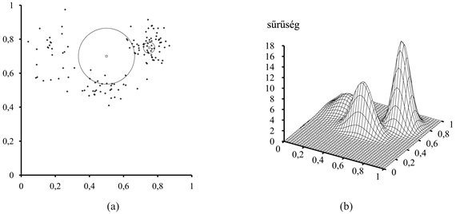
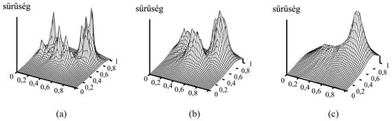
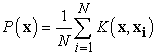
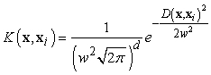
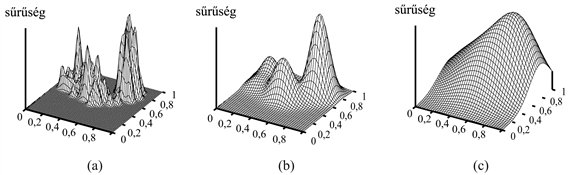

<?xml version="1.0" encoding="UTF-8" standalone="no"?>

<html xmlns="http://www.w3.org/1999/xhtml"><head><meta name="generator" content="DocBook XSL Stylesheets V1.76.1"/></head><body>

<h1 class="title"><a id="id742536"/>Példányalapú tanulás</h1>

Eddigiekben a statisztikai tanulás tárgyalásában arra koncentráltunk, hogy valószínűségi modellek egy <em>behatárolt</em> családjának paramétereit egy <em>struktúrájában nem kötött</em> adathalmazra illesszük. Például a kevert Gaussokat használó, nem ellenőrzött tanulás feltételezi, hogy az adatok megmagyarázhatók <em>rögzített</em> számú <em>Gauss-eloszlás</em> <em>összegeként</em>. Az ilyen módszereket <strong>paraméteres tanulás</strong>nak (<strong>parametric learning</strong>) nevezzük. A paraméteres tanuló eljárások gyakran nagyon egyszerűek és hatékonyak, de egy meghatározott behatárolt modellcsalád feltételezése sokszor túlzott egyszerűsítése annak, ami az adatokat szolgáltató valós világban történik. Nos, az természetesen igaz, hogy ha nagyon kevés adatunk van, akkor nem reménykedhetünk egy bonyolult és részletes modell megtanulásában, de butaságnak tűnik a hipotézis komplexitását akkor is rögzítve tartani, amikor az adathalmaz nagyon nagyra nő.

A paraméteres módszerekkel ellentétben a <strong>nemparaméteres tanulás</strong>i (<strong>nonparametric learning</strong>) módszerek lehetővé teszik, hogy a hipotézis bonyolultsága együtt növekedjék az adatokkal. Minél több adatunk van, annál körmönfontabb lehet a hipotézis. Két, nagyon egyszerű nemparaméteres <strong>példányalapú tanulás</strong>t használó módszercsaládot fogunk vizsgálni, amelyeket azért nevezünk így, mert közvetlenül a tanító példányokból hoznak létre hipotéziseket.

<h2 class="title"><a id="id742587"/>Legközelebbi-szomszéd modellek</h2>

A <strong>legközelebbi-szomszéd</strong> (<strong>nearest-neighbor</strong>) modellek alapötlete az, hogy bármely egyedi <strong>x</strong> bemeneti pont tulajdonságai valószínűleg hasonlók az <strong>x</strong> pont környezetébe eső pontok tulajdonságaihoz. Például ha <strong>sűrűségbecslés</strong>t (<strong>density estimation) </strong>kívánunk végezni – azaz meg akarjuk becsülni egy ismeretlen valószínűség sűrűségfüggvény-értékét <strong>x</strong>-ben –, akkor egyszerűen mérhetjük azt, hogy <strong>x</strong> környezete milyen sűrűn van beszórva pontokkal. Ez nagyon egyszerűen hangzik, amíg rá nem jövünk, hogy meg kell határoznunk, mit is értünk „szomszédság” alatt. Ha a szomszédság túl kicsi, akkor egyáltalán nem fog pontokat tartalmazni. Ha túl nagy, akkor esetleg az <em>összes</em> adatpontot tartalmazni fogja, és olyan sűrűséget eredményez, ami mindenütt ugyanakkora. Egy megoldási lehetőség, ha a szomszédságot úgy definiáljuk, hogy legyen éppen elég tág ahhoz, hogy <em>k</em> pontot tartalmazzon, ahol <em>k</em> elég nagy ahhoz, hogy ésszerű becslést végezhessünk. Rögzített <em>k</em> esetén a szomszédság mérete változó, ahol ritkán vannak az adatok, ott a szomszédság tág térrész, ahol az adatok sűrűn helyezkednek el, ott a szomszédság szűk. A 20.12. (a) ábra egy példát mutat: két dimenzióban szétszórt adatpontokat. A 20.13. ábra mutatja az ezen adatokra elvégzett <em>k</em>-legközelebbi-szomszéd sűrűségbecslést <em>k = </em>3, 10 és 40 esetére. <em>k = </em>3 esetében a sűrűségbecslést minden egyes pontban csak 3 szomszédos pontra alapozzuk, és ezért erősen változó eredményt kapunk. <em>k = </em>10 esetén a 20.12. (b) ábrán látható valódi sűrűség jó becslését kapjuk. <em>k = </em>40 esetén a szomszédság túl tággá válik, és az adatok struktúráját mindenestől elvesztjük. Gyakorlatban – kis dimenziószám esetén – egy 5 és 10 közé eső <em>k</em> a legtöbb esetben jó eredményt ad. Keresztvalidáció alkalmazásával is jó értéket kaphatunk a <em>k</em>-ra.

<a id="id742671"/>
<strong>20.12. ábra - (a) A 20.8. (a) ábra adatainak 128 pontos részhalmaza, két kiválasztott ponttal, és 10 legközelebbi szomszédjukkal. (b) Az adatok előállításánál használt kevert Gauss-eloszlás 3D ábrája.</strong>

<a id="id742681"/>
<strong>20.13. ábra - A 20.12. (a) ábrán látható adatokra végzett sűrűségbecslés, <em>k = </em>3 (a); <em>k = </em>10 (b) és <em>k = </em>40 (c) esetén</strong>

Ahhoz, hogy egy kérdéses pontban a legközelebbi szomszédokat meg tudjuk határozni, egy távolságmetrikára – <em>D</em>(<strong>x</strong>1, <strong>x</strong>2)-re – van szükségünk. A 20.12. ábra kétdimenziós példájában euklideszi távolságot használtunk. Ez nem felel meg, ha a tér minden dimenziójában valami mást mérünk – például magasságot és súlyt –, mivel egy dimenzió skálájának megváltoztatása megváltoztatja a legközelebbi szomszédok halmazát. Az egyik lehetőség, hogy minden egyes dimenzió skáláját normalizáljuk. Ehhez először megmérjük az összes tulajdonság varianciáját a teljes adathalmazon, majd a tulajdonságértéket úgy fejezzük ki, hogy megadjuk: a tulajdonságérték az adott tulajdonság varianciájának hányszorosa. (Ez a <strong>Mahalanobis-távolság</strong> [<strong>Mahalanobis distance</strong>] – amely a tulajdonságok kovarianciamátrixát veszi figyelembe – speciális esete.) Végül diszkrét esetben alkalmazhatjuk a <strong>Hamming-távolság</strong>ot (<strong>Hamming distance</strong>), amely úgy definiálja <em>D</em>(<strong>x</strong>1, <strong>x</strong>2)-t, mint azon tulajdonságok számát, amelyben <strong>x</strong>1 és <strong>x</strong>2 eltér.

A 20.13. ábrán láthatóhoz hasonló sűrűségbecslések a bemeneti tér feletti együttes eloszlásokat határoznak meg. A Bayes-hálóktól eltérően a példányalapú reprezentációk nem tartalmaznak rejtett változókat, ami azt jelenti, hogy nem alkalmazhatunk nem ellenőrzött osztályozást, mint ahogy a kevert Gauss-modellnél tettük. Továbbra is alkalmazhatjuk a kívánt <em>y</em> értéknek az <strong>x</strong> bemeneti tulajdonságok alapján történő jóslására a sűrűségbecslést, ha kiszámítjuk <em>P</em>(<em>y</em>|<strong>x</strong>) = <em>P</em>(<em>y, </em><strong>x</strong>)/<em>P</em>(<strong>x</strong>)-et, feltéve, hogy a tanító adatok a kívánt értékre nézve is tartalmaznak értékeket.

A legközelebbi-szomszéd tanulási algoritmus használható közvetlen ellenőrzött tanulásra is. Ha adott egy tesztpélda <strong>x</strong> bemeneti értékekkel, akkor az <em>y = h</em>(<strong>x</strong>) az <strong>x k</strong>-legközelebbi-szomszédjának <em>y</em> értékeiből nyerhető. Diszkrét esetben többségi szavazással kaphatunk egyetlen jósolt értéket. Folytonos esetben átlagolhatjuk a <em>k</em> darab értéket, vagy lokális lineáris regressziót végezhetünk a <em>k</em> pontra illesztve, ez utóbbi esetben a jóslást a kialakuló hipersík <strong>x</strong>-beli értéke adja.

A <em>k</em>-legközelebbi-szomszéd tanulási algoritmus nagyon egyszerűen megvalósítható, kevés hangolást igényel, és gyakran elég jól működik. Jó dolog, ha először egy új tanulási problémán próbáljuk ki. Mindazonáltal nagy adathalmazokban hatékony mechanizmust kell találnunk arra, hogy a kérdéses <strong>x</strong> pont legközelebbi szomszédjait megtaláljuk, hiszen túl hosszú lenne minden pontra kiszámítani a távolságot. Egy sor szellemes, a tanító adatok előfeldolgozásán alapuló módszert javasoltak ennek a lépésnek a hatékonynyá tételére. Szerencsétlen módon a legtöbb ilyen módszer nem viselkedik jól a tér dimenziójának növekedésével (azaz a tulajdonságok számának növekedésével).

A sokdimenziós terek még egy további problémát jelentenek, nevezetesen azt, hogy egy ilyen térben a legközelebbi szomszédok rendszerint nagyon messze vannak. Vegyünk egy <em>N</em> elemű, <em>d</em> dimenziós egységkockában elhelyezkedő adathalmazt, és tegyük fel, hogy a szomszédságok <em>b</em> oldalú hiperkockák, amelyek térfogata <em>bd</em>. (Ugyanez a megfontolás működne hipergömbök feltételezése esetén is, de a hipergömb térfogatképlete bonyolultabb.) Ahhoz, hogy <em>k</em> pontot tartalmazzon, az átlagos szomszédság a teljes térfogat – amit egységnyinek tekintünk – <em>k</em>/<em>N</em>-ed részét kell elfoglalnia. Ennek megfelelően <em>bd </em> = <em>k</em>/<em>N</em>, vagyis <em>b = </em>(<em>k</em>/<em>N</em>)1/<em>d</em>. Eddig jó. Legyen most <em>d = </em>100, <em>k = </em>10 és <em>N = </em>1 000 000 értékű. Akkor <em>b </em>≈<em> </em>0,89 – azaz a szomszédság majdnem az egész bemeneti teret elfoglalja! Ez arra utal, hogy sokdimenziós esetben a legközelebbi-szomszéd alapú módszerek nem megbízhatók. Alacsony dimenziószám esetén nincs probléma, <em>d = </em>2 esetén <em>b = </em>0,003.

<h2 class="title"><a id="id742950"/>Kernelmódszerek</h2>

A <strong>kernelmodell</strong>ben (<strong>kernel model) </strong>úgy tekintünk minden tanító példányra, mintha egy kis saját sűrűségfüggvényt – <strong>kernelfüggvény</strong>t (<strong>kernel function) </strong>– generálna. Az eredő sűrűségfüggvény becslés nem más, mint a kis kernelfüggvények súlyozott összege. Egy <strong>x</strong>i tanító példány egy <em>K</em>(<strong>x</strong>, <strong>x</strong>i) kernelfüggvényt generál, amely a tér minden <strong>x</strong> pontjához egy valószínűséget rendel. Így a sűrűségbecslés:

Normális esetben a kernelfüggvény csak az <strong>x</strong> és <strong>x</strong>i közötti <em>D</em>(<strong>x</strong>,<strong> x</strong>i) távolságtól függ. A legnépszerűbb kernelfüggvény (természetesen) a Gauss-függvény. Az egyszerűség kedvéért egy gömbszimmetrikus Gauss-függvényt feltételezünk, amelynek minden tengely mentén <em>w</em> a szórása, azaz:

ahol <em>d</em> az <strong>x</strong> dimenziószáma. Hátra van még a megfelelő <em>w</em> érték választásának problémája. Éppúgy, mint az előzőkben egy túl kis szomszédság nagyon hepehupássá teszi a becslést – mint a 20.14. (a) ábrán látható. A (b) ábrán látható, hogy egy közepes <em>w</em> érték nagyon jó becslést ad. A (c) ábrán bemutattuk, hogy a túl nagy szomszédság eredményeképp teljesen elveszítjük a struktúrát. Jó <em>w</em> értéket választhatunk keresztvalidációval.

<a id="id743074"/>
<strong>20.14. ábra - A 20.12. (a) ábrán látható adatok sűrűségbecslése Gauss-kernelekkel, <em>w = </em>0,02 (a); <em>w = </em>0,07 (b) és <em>w = </em>0,20 (c) esetén.</strong>

Ellenőrzött tanulást kernelekkel úgy végezhetünk, hogy a tanító példányokból származtatott <em>összes</em> jóslás <em>súlyozott</em> kombinációját vesszük. (Összehasonlítva a <em>k</em>-legközelebbi-szomszéd módszerrel, ott a <em>k</em>-legközelebbi-példány súlyozatlan kombinációját használjuk.) Az <em>i</em>-edik példánynak a kérdéses <strong>x</strong> pontra vett súlyát a <em>K</em>(<strong>x</strong>,<strong> x</strong>i) kernelfüggvényérték adja. Diszkrét jóslás esetén súlyozott szavazást vehetünk, folytonos esetben súlyozott átlagot vagy súlyozott lineáris regressziót. Figyeljük meg, hogy a kernelekkel végzett jóslás azt igényli, hogy az <em>összes</em> tanító példányt figyelembe kell vennünk. A kernelek összekombinálhatók a legközelebbi-szomszéd indexelési sémáival azért, hogy csupán a szomszédos példányok alapján előállított súlyozott jóslást alkalmazzuk.

</body></html>
