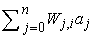
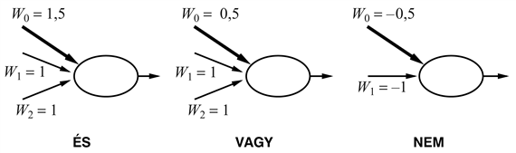

<?xml version="1.0" encoding="UTF-8" standalone="no"?>

<html xmlns="http://www.w3.org/1999/xhtml"><head><meta name="generator" content="DocBook XSL Stylesheets V1.76.1"/></head><body>

<h1 class="title"><a id="id743139"/>Neurális hálók</h1>

A <strong>neuron</strong> egy olyan agysejt, amelynek alapfeladata elektromos jelek összegyűjtése, feldolgozása és szétterjesztése. A <a class="xref" href="ch01s02.md#ID_42_oldal">„Neurális tudományok (1861-től napjainkig)”</a> részben az 1.2. ábra egy tipikus neuron sematikus rajzát mutatja. Azt gondoljuk, hogy az agy információfeldolgozó kapacitása elsősorban ilyen neuronok <em>hálózatából</em> alakul ki. Ezért a korai MI néhány kutatása mesterséges <strong>neurális háló</strong>k (<strong>neural network</strong>s) létrehozására irányult. (A terület más, szintén használt elnevezései: <strong>konnekcionizmus</strong> [<strong>connectionism</strong>], <strong>párhuzamos elosztott feldolgozás</strong> [<strong>parallel distributed processing</strong>] és <strong>neurális számítástechnika</strong> [<strong>neural </strong><strong>computation</strong>].) A 20.15. ábra a neuron egyszerű matematikai modelljét mutatja, ahogy McCulloch és Pitts (McCulloch és Pitts, 1943) megalkották. Elnagyolva az mondható, hogy a neuron akkor „tüzel”, amikor a bemeneti értékek súlyozott összege meghalad egy küszöböt. 1943 óta sokkal részletesebb és valósághűbb modelleket alkottak mind a neuronra, mind az agy nagyobb rendszereire, ez vezetett a <strong>számítógépes idegháló-modellezés</strong> (<strong>computational neuroscience</strong>) modern tudományterületének megjelenéséhez. Másrészt az MI és a statisztika kutatóinak érdeklődését felkeltették a neurális hálózatok absztraktabb tulajdonságai, mint például az elosztott számítás elvégzésére, a bemeneti zajjal szembeni érzéketlenségre és a tanulásra való képesség. Bár ma már tudjuk, hogy más rendszerek, például a Bayes-hálók is rendelkeznek ezekkel a tulajdonságokkal, de a neurális háló maradt a tanuló rendszerek egyik leghatékonyabb és legnépszerűbb formája, ezért megéri külön tárgyalni.

<a id="id743210"/>
<strong>20.15. ábra - A neuron egyszerű matematikai modellje. Az egység kimeneti aktivációja  ahol <em>aj</em> a <em>j</em>-edik egység kimeneti aktivációja és <em>W</em><em>j</em>,<em>i</em> a <em>j</em>-től <em>i</em>-ig vezető összeköttetés súlya.</strong>

<h2 class="title"><a id="id743256"/>A neurális háló egységei</h2>

A neurális hálók irányított <strong>kapcsolat</strong>okkal (<strong>link</strong>) összekötött csomópontokból vagy <strong>egy</strong><strong>ség</strong>ekből (<strong>unit</strong>) állnak. A <em>j</em>-edik egységtől az <em>i</em>-edik felé vezető kapcsolat hivatott az <em>aj</em> aktivációt <em>j</em>-től az <em>i</em>-ig terjeszteni. Minden egyes kapcsolat rendelkezik egy hozzá aszszociált <em>W</em><em>j</em>,<em>i</em> numerikus <strong>súllyal</strong> <strong>(weight</strong>), ami meghatározza a kapcsolat erősségét és előjelét. Minden egyes <em>i</em> egység először a bemeneteinek egy súlyozott összegét számítja ki:

A kimenetét úgy kapja, hogy ezek után egy <em>g</em> <strong>aktivációs függvény</strong>t (<strong>activation functio</strong><strong>n</strong>) alkalmaz a kapott összegre:

Figyeljük meg, hogy használtunk egy <strong>eltolássúly</strong>t <strong>(bias weight)</strong> <em>W</em>0,<em>i</em>-t, amelyet egy rögzített értékű <em>a</em>0 = –1 bemenetre kapcsolunk. Rövidesen megmagyarázzuk, hogy mi a jelentősége.

Az aktivációs függvénnyel szemben két elvárásunk van. Először az, hogy az egység legyen „aktív” (+1 körüli kimenet), ha a „helyes” bemeneteket kapja, és „inaktív” (0 körüli kimenet), ha „rossz” bemeneteket kap. Másodszor az, hogy az aktiváció legyen <em>nemlineáris</em>, különben az egész neurális háló egy egyszerű lineáris függvénnyé fajul (lásd 20.17. feladat). A 20.16. ábra kétféle aktivációs függvényt mutat be: a <strong>küszöbfüggvény</strong>t (<strong>threshold function</strong>), illetve a <strong>szigmoid függvény</strong>t (<strong>sigmoid function</strong>) (mely utóbbi <strong>logisztikus függvény</strong>ként [<strong>logistic function</strong>] is ismert). A szigmoid függvény előnye, hogy differenciálható, ami – mint később látni fogjuk – fontos a súlytanulási algoritmus szempontjából. Vegyük észre, hogy mindkét függvénynek van egy küszöbpontja (akár kemény, akár lágy) a nullánál; az eltolássúly állítja be az egység <em>aktuális</em> küszöbpontját. Ez azt jelenti, hogy az egység akkor aktiválódik, ha a „valódi” bemenetek súlyozott összege  meghaladja <em>W</em>0,<em>i</em>-t.

<a id="id743449"/>
<strong>20.16. ábra - (a) A küszöb aktivációs függvény, amely 1-et ad a kimeneten, ha a bemenete pozitív, különben pedig 0-t. (Néha az előjelfüggvényt is használják ehelyett, amely ±1-et ad a bemenet előjelétől függően.) (b) A szigmoid függvény 1/(1+<em>e</em>–<em>x</em>).</strong>

<a id="id743476"/>
<strong>20.17. ábra - Megfelelő bemeneti és eltolássúlyokkal rendelkező, küszöbaktivációjú egységek képesek logikai kapuként működni</strong>

Némi fogalmunk alakulhat ki az egyes egységek működéséről, ha összehasonlítjuk őket a logikai kapukkal. Az egyes egységek tervezésének eredeti motivációi között (McCulloch és Pitts, 1943) szerepelt az, hogy képesek az alapvető logikai függvények reprezentálására. A 20.17. ábra bemutatja, hogy az és, vagy és nem logikai függvények hogyan reprezentálhatók egy megfelelő súlyokkal rendelkező küszöbegység segítségével. Ez azért fontos, mert azt jelenti, hogy ezen egységek felhasználásával tetszőleges logikai függvény kiszámítására tudunk hálózatot építeni.

<h2 class="title"><a id="id743490"/>Hálóstruktúrák</h2>

A neurális hálóstruktúrák két fő csoportja: a hurokmentes vagy <strong>előrecsatolt háló</strong>k (<strong>feed-forward network</strong>) és a visszacsatolt vagy <strong>rekurrens háló</strong>k (<strong>recurrent network</strong>). Az előrecsatolt háló a pillanatnyi bemenet függvényét reprezentálja, azaz nincs semmilyen más belső állapota, csak maguk a súlyok. A rekurrens háló viszont a kimeneteit visszacsatolja a bemeneteire. Ez azt jelenti, hogy a háló aktivációs szintjei dinamikus rendszert alkotnak, elérhetnek stabil állapotot, de mutathatnak oszcillációt, sőt kaotikus viselkedést is. Ezenfelül a háló egy adott bemenetre adott válasza a kezdeti állapotától függ, amely a korábbi bemenetektől függhet. Ennélfogva a rekurrens hálók (ellentétben az előrecsatolt hálókkal) rövid távú memóriát is biztosíthatnak. Ezáltal érdekesebbé válnak mint agymodellek, de egyben nehezebben is érthetők. Ez a rész az előrecsatolt hálókra koncentrál, a fejezet végén néhány hivatkozást adunk, segítve a rekurrens hálók további tanulmányozását.

Nézzük meg közelebbről azt az állítást, hogy az előrecsatolt háló a bemeneteinek függvényét reprezentálja. Vizsgáljuk a 20.18. ábra egyszerű hálózatát, amelynek két bemeneti egysége, két <strong>rejtett egység</strong>e (<strong>hidden unit</strong>) és egy kimeneti egysége van. (Az egyszerűség kedvéért ebben a példában elhagytuk az eltolásegységeket.) Adott <strong>x</strong> = (<em>x</em>1, <em>x</em>2) bemeneti vektor esetén a bemeneti egységek aktivációja (<em>a</em>1, <em>a</em>2)  = (<em>x</em>1, <em>x</em>2), és a hálózat a következő számítást végzi:

<code class="code"><em>a</em>5 = <em>g</em>(<em>W</em>3,5<em>a</em>3 + <em>W</em>4,5<em>a</em>4) </code>

<code class="code">     = <em>g</em>(<em>W</em>3,5<em>g</em>(<em>W</em>1,3<em>a</em>1 + <em>W</em>2,3<em>a</em>2) + <em>W</em>4,5<em>g</em>(<em>W</em>1,4<em>a</em>1 + <em>W</em>2,4<em>a</em>2))					(20.11)</code>

Azaz kifejezve a rejtett egységek kimenetét, mint a <em>saját</em> bemeneteik függvényét, megmutattuk, hogy az egész háló <em>a</em>5 végső kimenete a háló bemeneteinek függvénye. Továbbá azt látjuk, hogy a háló súlyai ennek a függvénynek a <em>paramétereiként</em> szolgálnak; ha <strong>W</strong>-vel jelöljük a paramétereket, akkor a háló a <em>h</em>W(<strong>x</strong>) függvényt számítja ki. Ha változtatjuk a súlyokat, akkor változik a háló által reprezentált függvény. Ez a módja a neurális hálók tanulásának.

A neurális hálót osztályozásra vagy regresszióra használhatjuk. Ha folytonos kimenete van a hálónak (pl. szigmoid egységekkel), akkor logikai osztályozás esetén hagyományosan egy kimeneti egységet használunk, és ha ennek aktivációs értéke 0,5 feletti, azt az egyik, ha 0,5 alatti, akkor a másik osztályba tartozásként interpretáljuk. Egy <em>k</em> osztályos osztályozási feladatnál feloszthatjuk az egyetlen kimeneti egység értéktartományát <em>k</em> részre, de megszokottabb, hogy ehelyett <em>k</em> elkülönült kimeneti egységet használjunk, ahol mindegyiknek az aktivációs értéke a bemenet adott osztályba tartozásának valószínűségét reprezentálja.

Az előrecsatolt hálókat rendszerint <strong>réteg</strong>ekbe (<strong>layer</strong>) szervezzük oly módon, hogy minden egyes egység csak a közvetlenül megelőző réteg egységeitől kap bemeneti jelet. A következő két alfejezetben egyrészt az egyrétegű hálózatokkal foglalkozunk, amelyeknek nincsenek rejtett egységei, másrészt a többrétegű hálókkal, amelyek egy vagy több rejtett réteggel rendelkeznek.

<a id="id746244"/>
<strong>20.18. ábra - Egy nagyon egyszerű, két bemeneti egységgel, egyetlen – két egységből álló – rejtett réteggel és egy kimeneti egységgel rendelkező háló</strong>

<h2 class="title"><a id="id746254"/>Egyrétegű előrecsatolt neurális hálók (perceptronok)</h2>

Azt a hálót, amelyben az összes bemenet közvetlenül a kimenetekre kapcsolódik <strong>egyrétegű neurális háló</strong>nak (<strong>single layer neural network</strong>) vagy <strong>perceptron</strong> (<strong>perceptron</strong>) hálónak nevezzük. Mivel mindegyik kimeneti egység független a többitől – mindegyik súly csak egyetlen kimenetre van hatással – vizsgálatainkat korlátozhatjuk az egykimenetű perceptronra, mint azt a 20.19. (a) ábra magyarázza.

Kezdjük annak a hipotézistérnek a tanulmányozásával, amelyet egyetlen perceptron reprezentálhat. Küszöbaktivációs függvény esetén úgy tekinthetjük a perceptront, mint ami logikai függvényt reprezentál. Az elemi logikai függvényeken (és, vagy és nem, lásd 20.17. ábra) túl a perceptron képes néhány egészen „bonyolult” logikai függvényt is nagyon tömören reprezentálni. Például a <strong>többségfüggvény</strong>t (<strong>majority function</strong>), amely csak akkor ad ki 1-et, ha <em>n</em> bemeneteinek több mint fele 1, egy olyan perceptron reprezentál, amelynek minden súlya <em>Wj </em> = 1 és a küszöb <em>W</em>0 = <em>n/</em>2. Egy döntési fának <em>O</em>(2n) csomópontra lenne szüksége ennek a függvénynek a reprezentálásához.

Sajnos számos olyan logikai függvény van, amelyet a küszöbfüggvényt használó perceptron nem tud reprezentálni. A (20.10) egyenletet vizsgálva látjuk, hogy a küszöbérték-perceptron akkor és csak akkor ad 1-et, ha bemeneteinek (beleértve az eltolás- bemenetet is) súlyozott összege pozitív:

<a id="id746332"/>
<strong>20.19. ábra - (a) Egy perceptronhálózat három kimeneti egységből, amelyeknek öt közös bemenete van. Ha kiválasztunk egy kimeneti egységet (mondjuk a másodikat, vastag vonallal kiemelve), akkor azt látjuk, hogy bemeneti összeköttetései nincsenek semmilyen hatással a többi kimeneti egységre. (b) Egy kétbemenetű szigmoid aktivációs függvényű perceptronegység kimenetének ábrázolása.</strong>

<h3 class="title">Fontos</h3>
A <strong>W </strong>· <strong>x</strong> = 0 egyenlet egy hipersíkot határoz meg a bemeneti térben, tehát a perceptron akkor és csak akkor ad 1-et, ha a bemenet ennek a hipersíknak az egyik oldalán van. Ezért a küszöbperceptront <strong>lineáris szeparátor</strong>nak (<strong>linear separator</strong>) is nevezik. A 20.20. (a) és (b) ábra mutatja a szeparáló hipersíkot (ami két dimenzióban egy egyenes) a kétbemenetű és, illetve vagy függvények perceptronreprezentációja esetén. Fekete pötty jelzi a bemeneti tér olyan pontjait, amelyekre a függvény értéke 1, fehér pötty pedig az olyan pontokat, amelyre 0 ez az érték. A perceptron azért képes reprezentálni ezt a függvényt, mert létezik olyan egyenes, ami az összes fehér pontot az összes feketétől elválasztja. Az ilyen függvényeket <strong>lineárisan szeparálható</strong>nak (<strong>linearly separable</strong>) nevezzük. A 20.20. (c) ábra egy olyan függvényre mutat példát, amely <em>nem</em> szeparálható lineárisan – ez az xor függvény. Nyilvánvalóan nincs lehetőség arra, hogy egy küszöbperceptron megtanulja ezt a függvényt. Általánosságban elmondható, hogy <em>egy küszöbperceptron csak lineárisan szeparálható függvények reprezentációjára képes</em>. Ez a függvényeknek csak kis töredékét jelenti; a 20.14. feladat azt kéri, hogy fejezze ki számszerűen, mekkora is ez a töredék. A szigmoiddal felépített perceptronok hasonlóképpen korlátozott képességűek abban az értelemben, hogy csupán „lágy” lineáris szeparátorokat reprezentálnak. (Lásd 20.19. (b) ábra.)

<a id="id746381"/>
<strong>20.20. ábra - Lineáris szeparálhatóság küszöbperceptronok esetén. Fekete pötty jelzi a bemeneti tér olyan pontjait, amelyekre a függvény értéke 1, fehér pötty pedig az olyan pontokat, amelyre 0 ez az érték. A perceptronkimenet az egyenes nem árnyékolt oldalán 1. A (c) esetben nincs olyan egyenes, amely jól osztályozná a bemeneteket.</strong>

<h3 class="title">Fontos</h3>
Korlátozott kifejezőképessége ellenére a küszöbperceptronnak vannak előnyei is. Különösen is fontos, hogy <em>létezik olyan egyszerű tanuló algoritmus, amely a küszöbperceptront tetszőleges lineárisan szeparálható adathalmazra képes illeszteni</em>. Mégsem mutatjuk most be ezt, inkább <em>levezetünk</em> egy ehhez közel álló tanuló algoritmust a szigmoid perceptronokra.

Ennek az algoritmusnak az az alapgondolata (valójában a neuronháló tanuló algoritmusok legtöbbjének is ez), hogy a tanító mintahalmazon mért hiba valamilyen mértékének minimalizálása érdekében módosítjuk a neuronháló súlyait. Tehát a tanulást formálisan a <strong>súlytér</strong>ben (<strong>weight space</strong>) végzett optimalizálási keresésként fogalmazzuk meg.[<a id="id746413" href="#ftn.id746413" class="footnote">202</a>] A hiba „klasszikus” mértéke a <strong>négyzetes hibaösszeg</strong>, amit a lineáris regressziónál a <a class="xref" href="ch20s02.md#ID_826_827_oldal">„Maximum-likelihood paramétertanulás: folytonos eset”</a> részben is használtunk. Egyetlen, <strong>x</strong> bemenettel és <em>y</em> kívánt kimenettel megadott példa négyzetes hibája a következőképpen írható fel:

ahol <em>h</em>W(<strong>x</strong>) a perceptron kimeneti értéke.

A négyzetes hiba csökkentésére gradiensalapú optimalizálási eljárást használhatunk, ehhez az <em>E</em> minden egyes súlyra vonatkozó parciális deriváltját meg kell határoznunk. Tehát:

ahol <em>g</em>' az aktivációs függvény deriváltja.[<a id="id746477" href="#ftn.id746477" class="footnote">203</a>] Amikor a gradiensalapú algoritmusban <em>csökkenteni </em>akarjuk <em>E</em>-t, a súlyfrissítés összefüggése a következő:

<code class="code"><em>Wj </em>← <em>Wj </em>+ <em>α</em> × <em>Err</em> × <em>g</em>'(<em>in</em>) × <em>xj</em>					(20.12)</code>

ahol <em>α</em> a <strong>bátorsági faktor</strong> (vagy <strong>tanulási faktor</strong>, <strong>learning rate</strong>). Intuitíve ez nagyon ésszerű. Ha a hiba <em>Err</em> = <em>y</em> – <em>h</em>W(<strong>x</strong>) pozitív, akkor a háló kimenete túl kicsi, tehát a pozitív bemenetekhez tartozó súlyokat <em>növeljük,</em> a negatívakhoz tartozókat pedig <em>csökkentjük</em>. Ha a hiba negatív, akkor éppen ennek ellenkezője történik.[<a id="id746583" href="#ftn.id746583" class="footnote">204</a>]

A teljes algoritmus a 20.21. ábrán látható. Egyesével sorban végigfuttatja a mintákat a hálón, és minden egyes példa után a hiba csökkentése érdekében kissé módosítja a súlyokat. A mintahalmaz egyszeri végigfuttatását <strong>epoch</strong>nak (<strong>epoch</strong>) nevezzük. Az epochokat addig ismételjük, amíg valamilyen leállási feltétel nem teljesül – tipikus, hogy akkor állunk le, amikor a súlyváltozások már nagyon kicsivé válnak. Más módszerek esetén eredő gradienst számítunk az egész tanító halmazra, egyszerűen összeadva az egyes példáknál a (20.12) származó gradienseket, és az eredő gradiens alapján frissítjük a súlyokat. A <strong>sztochasztikus gradiens</strong> (<strong>stochastic gradient</strong>) módszer nem ciklikusan veszi a tanító halmaz mintáit, hanem inkább véletlenszerűen választ mintákat a tanító halmazból.

A 20.22. ábra két különböző problémára bemutatja a perceptron tanulási görbéjét. A bal oldali ábrán a 11 logikai bemenetre vonatkozó többségfüggvény (tehát a kimenet akkor 1, ha 6 vagy több bemenet 1) tanulási görbéje látható. Várakozásunknak megfelelően a perceptron meglehetősen gyorsan tanulja a függvényt, mivel a többségfüggvény lineárisan szeparálható. Másrészről viszont a döntési fa tanuló nem nagyon halad a tanulással, mert a többségfüggvényt nagyon nehéz (bár nem lehetetlen) döntési fában reprezentálni. A jobb oldali ábrán az étterem példa látható. A probléma megoldása könnyen ábrázolható döntési fával, de lineárisan nem szeparálható. Az adatokra felvett legjobb szeparáló sík csak 65%-ot osztályoz helyesen.

<a id="id746644"/>
<strong>20.21. ábra - A gradiensalapú perceptron tanulási algoritmus, feltételezve, hogy a <em>g</em> aktivációs függvény differenciálható. Küszöbperceptronokra elhagyjuk a <em>g</em>'(<em>in</em>) faktort a súlyfrissítésből. A <code class="code">NEURÁLIS-HÁLÓ-HIPOTÉZIS</code> függvény egy olyan hipotézist ad vissza, amely bármely bemenetre kiszámítja a háló válaszát.</strong>

Az eddigiekben úgy tekintettük a perceptronokat, mint olyan determinisztikus függvényeket, amelyeknek valószínűleg hibával terhelt a kimenete. Lehetőségünk van, hogy a szigmoid perceptron kimenetét valószínűségként interpretáljuk – annak valószínűségeként, hogy adott bemenetek esetén a valós kimenet 1. Ezzel az interpretációval úgy használhatjuk a szigmoidot, mint a Bayes-hálók feltételes eloszlásainak kanonikus reprezentációját (lásd 14.3. alfejezet). Levezethetünk egy tanuló algoritmust is, a standard módszernek megfelelően maximalizálva az adatok (feltételes) log likelihood értékét, amint ezt a fejezet korábbi részében ismertettük. Lássuk, hogyan is működik ez.

<a id="id746670"/>
<strong>20.22. ábra - A perceptronok és döntési fák teljesítményének összehasonlítása. (a) A perceptronok jobbak a 11 bemenetű többségfüggvény tanulásában. (b) A döntési fák jobbak az étterem példában a <em>VárjunkE</em> predikátum tanulásában.</strong>

Vegyünk egyetlen tanító példát, amelynek kívánt kimeneti értéke <em>T</em>, és legyen erre a példára a perceptron válasza <em>p</em>. Ha <em>T = </em>1, akkor az adat feltételes valószínűsége <em>p</em>, ha <em>T = </em>0, akkor a feltételes valószínűség (1 – <em>p</em>). Egy egyszerű trükk alkalmazásával a log likelihoodot differenciálható formában írhatjuk fel. A trükk az, hogy ha a 0/1 változót egy kifejezés kitevőjébe írjuk, akkor <strong>indikátorváltozó</strong>ként (<strong>indicator variable</strong>) viselkedik: <em>pT</em>akkor <em>p</em>, ha <em>T = </em>1, egyébként 1; hasonlóképpen (1 – <em>p</em>)(1–<em>T</em>) akkor (1 – <em>p</em>), ha <em>T = </em>0, különben 1. Ezek szerint az adat log likelihood értékét felírhatjuk, mint:

<code class="code"><em>L</em> = log <em>pT</em>(1 – <em>p</em>)(1 – <em>T</em>) = <em>T </em>log <em>p</em> + (1 – <em>T</em>) log(1 – <em>p</em>)					(20.13)</code>

A szigmoid függvény tulajdonságainak hála, a gradiens rendkívül egyszerű formára hozható (20.16. feladat):

<h3 class="title">Fontos</h3>
Vegyük észre, hogy <em>szigmoid perceptronok esetén a maximum-likelihood tanulás súlyfrissítési vektorát megadó egyenlete alapvetően azonos a négyzetes hiba minimalizálásán alapuló frissítés vektorával</em>. Tehát azt mondhatjuk, hogy a perceptronnak még akkor is van valószínűségi interpretációja, ha a tanulási szabályt determinisztikus megközelítéssel származtattuk.

<h2 class="title"><a id="id746803"/>Többrétegű előrecsatolt neurális hálók</h2>

Vizsgáljuk most a rejtett neuronokkal rendelkező hálókat. A legelterjedtebb esetben egy rejtett réteget[<a id="id746809" href="#ftn.id746809" class="footnote">205</a>] szoktak használni, ezt mutatja 20.24. ábra. A rejtett réteg hozzáadásának az az előnye, hogy kiterjeszti a háló által reprezentálható hipotézisek terét. Gondoljunk minden egyes rejtett neuronra úgy, mint ami egy lágy küszöbfüggvényt reprezentál a bemeneti térben – lásd a 20.19. (b) ábrát. Ezek után gondoljunk úgy egy kimeneti neuronra, mint ami számos ilyen függvény lineáris kombinációjának lágy küszöbfüggvénye. Például összeadva két – egymással szemben álló – lágy küszöbfüggvényt, és küszöbözve az eredményt, a 20.23. (a) ábrán látható „hegygerinc” függvényt kapjuk. Egymásra derékszögben álló két ilyen hegygerinc kombinálásával (tehát 4 rejtett neuron kimenetének kombinálásával) a 20.23. (b) ábrán látható „dudort” kapjuk.

Több rejtett neuronnal különböző helyeken több, eltérő méretű dudort tudunk létrehozni. Valójában egyetlen, megfelelően nagy rejtett réteggel a bemenetek tetszőleges folytonos függvénye tetszőleges pontossággal reprezentálható, sőt két réteggel még nemfolytonos függvények is reprezentálhatók.[<a id="id746818" href="#ftn.id746818" class="footnote">206</a>] Sajnos egy <em>egyedi</em> neurális struktúra esetén nemigen lehet megmondani, hogy milyen függvények reprezentálhatók, és milyenek nem.

Tegyük fel, hogy az étterem problémára akarunk konstruálni egy egy-rejtett-réteggel rendelkező hálót. Minden példát 10 attribútum ír le, tehát egy 10 bemenetű hálóra lesz szükség. Hány rejtett neuron kell? A 20.24. ábrán bemutatunk egy négy rejtett neuronnal felépített hálót. Az derült ki, hogy ez nagyjából megfelelő ehhez a problémához. A rejtett neuronok számának előzetes meghatározása még napjainkban sem jól megoldott probléma. (Lásd <a class="xref" href="ch20s05.md#ID_856_857_oldal">„Neurális hálóstruktúrák tanulása”</a> részben.)

<a id="id746843"/>
<strong>20.23. ábra - (a) Két – egymással szemben álló – lágy küszöbfüggvény kombinációjának eredménye: egy hegygerinc. (b) Két hegygerinc kombinációjának eredménye a dudor.</strong>

A többrétegű háló tanuló algoritmusa hasonló a 20.21. ábrán bemutatott perceptrontanulási algoritmushoz. Egy kisebb különbség, hogy több kimenet is lehet, így nem egy skalár kimeneti értékünk, hanem egy <strong>hW</strong>(<strong>x</strong>) kimeneti vektorunk van, és minden egyes példához is egy <strong>y</strong> kívánt kimeneti vektor tartozik. Fontosabb különbség, hogy míg a kimeneti rétegben a hiba nyilvánvalóan <strong>y </strong>–<strong> h</strong><strong>W</strong>, addig a rejtett rétegben a hiba misztikusnak tűnik, hiszen a tanító minták nem mutatják, hogy minek kellene lennie a rejtett csomópontok értékének. Kiderül, hogy a hibát <strong>viszszaterjeszt</strong>hetjük (<strong>back-propagate</strong>) a kimeneti rétegről a rejtett rétegekre. A hiba-visszaterjesztési eljárás (back-propagation) közvetlenül kiadódik a teljes hibagradiens levezetéséből. Először egy intuitív bizonyítással mutatjuk be az eljárást, majd megmutatjuk a levezetést is.

<a id="id746897"/>
<strong>20.24. ábra - Többrétegű neurális háló egy rejtett réteggel és 10 bemeneti egységgel, alkalmas az étterem problémához</strong>

A kimeneti rétegre a súlyfrissítési szabály azonos a (20.12) egyenlettel. Több kimenetünk van, legyen <em>Erri</em> az <strong>y </strong>–<strong> h</strong><strong>W</strong> hibavektor <em>i</em>-edik komponense. Hasznos lesz, ha bevezetjük a módosított hibát, Δ<em>i </em>=<em> Erri</em> × <em>g</em>'(<em>ini</em>)-t, így a súlyfrissítési szabály:

<code class="code"><em>W</em><em>j</em>,<em>i</em> ← <em>W</em><em>j</em>,<em>i</em> + <em>α</em> × <em>aj</em> · Δi 										(20.14)</code>

Ahhoz, hogy a bemeneti neuronok és a rejtett neuronok közti összeköttetések frissítését megoldjuk, a kimeneti csomópontok hibájához hasonló mennyiséget kell definiálnunk. Ez az a pont, ahol a hiba-visszaterjesztést végezzük. A gondolat az, hogy a <em>j</em> rejtett csomópont valamilyen arányban „felelős” minden egyes – vele összeköttetésben lévő – kimeneti csomópont Δi hibájáért. Így a Δi értékeket a rejtett csomópont és a kimeneti csomópont közötti összeköttetés erőssége alapján osztjuk és visszaterjesztjük, hogy megkapjuk a rejtett réteg Δj értékeit. A Δ értékek terjesztési szabálya a következő:

Ezek után a bemenetek és a rejtett réteg közötti súlyok frissítési szabálya szinte azonos a kimeneti réteg frissítési szabályával:

<code class="code"><em>Wk,j</em> ← <em>Wk,j</em> + α × <em>ak</em> × Δj</code>

A hiba-visszaterjesztési algoritmus a következő módon foglalható össze:

<ul class="itemizedlist"><li class="listitem">
Számítsuk ki a kimeneti neuronokra a Δ értékeket a megfigyelt hiba alapján.
</li><li class="listitem">
A kimeneti réteggel kezdve ismételjük a következő lépéseket minden rétegre, amíg a legelső rejtett réteget el nem érjük:

<ul class="itemizedlist"><li class="listitem">
Terjesszük vissza a Δ értékeket a megelőző rétegre.
</li><li class="listitem">
Frissítsük a két réteg közötti súlyokat.
</li></ul>
</li></ul>

Az algoritmust a 20.25. ábra mutatja be részleteiben.

<a id="id747071"/>
<strong>20.25. ábra - A többrétegű hálókra kidolgozott hiba-visszaterjesztéses tanulási algoritmus</strong>

A matematika iránt vonzalmat érzők kedvéért most az alapegyenletekből levezetjük a hiba-visszaterjesztési algoritmust. Egyetlen mintára a négyzetes hiba definíciója:

ahol az összegzés a kimeneti réteg csomópontjaira vonatkozik. Egy bizonyos <em>W</em><em>j</em>,<em>i</em> súlyra vett gradiens kiszámításához csak az <em>ai</em> aktivációt kell deriválnunk, mivel az összeg összes többi tagja független <em>W</em><em>j</em>,<em>i</em>-től:

ahol Δi-t az előzőkkel megegyezően definiáltuk. Ahhoz, hogy a bemeneti réteget és a rejtett réteget összekötő <em>W</em><em>k</em>,<em>j</em> súlyokra vonatkozó gradienst megkapjuk, meg kell tartanunk az <em>i</em> feletti teljes összegzést, hiszen az összes kimeneti <em>ai</em> értékre hatással lehetnek <em>Wk,j</em> változásai. Az <em>aj</em> aktivációkat szintén mind ki kell fejtenünk. Aprólékosan bemutatjuk a levezetést, mivel érdekes megfigyelni, ahogy a differenciáló operátor visszaterjed hálón keresztül:

ahol a Δj-t az előzőkkel megegyezően definiáltuk. Tehát megkaptuk azt a frissítési szabályt, amelyet már korábban megkaptunk intuitív úton is. Az is nyilvánvaló, hogy az eljárás folytatható több mint egy rejtett rétegű hálókra is, ami igazolja a 20.25. ábrán bemutatott általános algoritmust.

Keresztülverekedvén magunkat (vagy átugorva) a matematikai levezetésen lássuk most, hogy milyen teljesítményt nyújt egy egy-rejtett-rétegű háló az étterem problémán. A 20.26. ábrán két görbét mutatunk be. Az első a <strong>tanítási görbe</strong> (<strong>training curve</strong>), amely a súlyfrissítés során az átlagos négyzetes hiba alakulását mutatja egy adott 100 elemű étterem példahalmazon mérve. Ez jól demonstrálja, hogy a háló valóban konvergál a tanító mintákra való tökéletes illeszkedéshez. A második görbe az étteremadatok standard tanulási görbéje. A neurális háló jól tanul, bár nem annyira gyorsan, mint a döntési fa tanulás. Ez talán nem meglepő, hiszen az adatokat egy egyszerű döntési fával generáltuk.

<a id="id747197"/>
<strong>20.26. ábra - (a) Az étterem probléma egy adott példahalmazán felvett tanulási görbe, ami a súlyok számos epoch során történő módosításával elért fokozatos hibacsökkenést mutatja. (b) Összehasonlító tanulási görbék, amelyek azt mutatják, hogy a döntési fa tanulás valamivel jobb teljesítményt ad, mint a többrétegű háló hiba-visszaterjesztéses tanulása.</strong>

A neurális hálók természetesen messze bonyolultabb tanulási feladatokra képesek, bár meg kell jegyeznünk, hogy szükség van némi babrálásra ahhoz, hogy megfelelő hálóstruktúrát kapjunk, és a súlytérben valahol a globális optimum közelébe konvergáljunk. A szó szoros értelmében tízezerszám vannak publikált neurális háló alkalmazások. A 20.7. alfejezet alaposabban bemutat egyet.

<h2 class="title"><a id="id747210"/>Neurális hálóstruktúrák tanulása</h2>

<a id="ID_856_857_oldal"/>
Az eddigiekben adott hálóstruktúra mellett történő súlytanulással foglalkoztunk. A Bayes-hálókhoz hasonlóan azt is meg kell értenünk, hogy hogyan találhatjuk meg a legjobb hálóstruktúrát. Ha túl nagy hálót használunk, akkor az egy nagy táblázatot kialakítva képes lesz memorizálni az összes példát, de nem feltétlenül lesz képes olyan bemenetekre jól általánosítani, amelyeket nem látott korábban.[<a id="id747219" href="#ftn.id747219" class="footnote">207</a>] Más szavakkal a neurális háló – éppúgy, mint az összes statisztikus modell – hajlamos a <strong>túlilleszkedés</strong>re (<strong>overfitting</strong>), ha túl sok modellparaméter van. Ezt bemutattuk a 18.1. ábrán (<a class="xref" href="ch18s02.md#ID_752_oldal">„Induktív tanulás”</a> rész), ahol a (b) és (c) sokparaméteres modell jól illeszkedett az adatokra, de nem volt képes olyan jó általánosításra, mint a kevés paraméterrel rendelkező (a) és (d) modellek.

Ha ragaszkodunk a teljesen összekötött hálókhoz, akkor egyedül a rejtett rétegek számára és méretére korlátozódnak a választási lehetőségeink. A szokásos megközelítés, hogy sok struktúrát kipróbálunk, és megtartjuk a legjobbat. A 18. fejezetben ismertetett <strong>keresztvalidáció</strong>s (<strong>cross-validation</strong>) technikára van szükségünk, ha el akarjuk kerülni a teszthalmazra való <strong>kukucskálás</strong>t (<strong>peeking</strong>). Azaz azt a hálóarchitektúrát választjuk, amely a validációs halmazon a legnagyobb jóslási pontosságot adja.

Ha figyelembe akarunk venni nem teljesen összekötött hálókat is, akkor szükségünk van egy hatékony módszerre, amely a lehetséges összeköttetési topológiák nagyon nagy terében keres. Az <strong>optimális agykárosodás</strong> (<strong>optimal brain damage</strong>) módszere egy teljesen összekötött hálóból indul ki, és összeköttetéseket távolít el belőle. Miután a hálót első menetben tanítottuk, egy információelméleti megközelítés segítségével meghatározzuk az eltávolítható összeköttetések optimális készletét. A hálót ezek után újratanítjuk, és ha teljesítménye nem csökkent, az eljárást megismételjük. Az összeköttetések eltávolításán felül olyan neuronokat is eltávolíthatunk, amelyek nem sokkal járulnak hozzá a megoldáshoz.

Rengeteg algoritmust javasoltak arra, hogy egy kisebb hálóból nagyobbat növesszenek. Egyikük, a <strong>csempézés</strong> (<strong>tiling</strong>), a döntési fa tanulásra emlékeztet. Az ötlet az, hogy kezdjünk egyetlen neuronnal, amely a legjobbját nyújtja, hogy annyi tanító mintára adjon helyes választ, ahányra csak lehet. További neuronokat adunk hozzá, hogy megoldjuk azokat a példákat, amelyekre az első neuron rossz választ adott. Az algoritmus csak annyi neuront ad hozzá, amennyi az összes minta megoldásához szükséges.

 

[<a id="ftn.id746413" href="#id746413" class="para">202</a>]  A folytonos terekben használható általános optimalizálási technikákat lásd a 4.4. alfejezetben.

[<a id="ftn.id746477" href="#id746477" class="para">203</a>]  Szigmoid függvény esetén ez a derivált <em>g</em>' = <em>g</em>(1 – <em>g</em>).

[<a id="ftn.id746583" href="#id746583" class="para">204</a>]  Küszöbperceptronokra, ahol <em>g</em>'(<em>in</em>) nem definiált, a Rosenblatt (Rosenblatt, 1957) által kidolgozott eredeti <strong>perceptron tanulási szabály</strong> (<strong>perceptron learning rule</strong>) megegyezik a (20.12) egyenlettel, leszámítva, hogy a <em>g</em>'(<em>in</em>) kimarad. Mivel <em>g</em>'(<em>in</em>) minden súlyra azonos, elhagyása az egyes mintáknál összességében csak a súlyfrissítés nagyságát változtatja meg, az irányát nem.

[<a id="ftn.id746809" href="#id746809" class="para">205</a>]  Egyesek ezt háromrétegű hálózatnak nevezik, mások kétrétegűnek (mivel a bemenetek nem „igazi” neuronok). A zűrzavar elkerülése érdekében mi „egy-rejtett-rétegű háló”-nak nevezzük.

[<a id="ftn.id746818" href="#id746818" class="para">206</a>]  A bizonyítás bonyolult, de legfőbb pontja az, hogy a bemenetek számával exponenciálisan nő a szükséges rejtett neuronok száma. Például <em>n</em> bemenetű logikai függvények kódolására 2<em>n/n</em> rejtett neuron kell.

[<a id="ftn.id747219" href="#id747219" class="para">207</a>]  Azt figyelték meg, hogy a nagyon nagy hálók <em>mindaddig</em> jól általánosítanak, <em>amíg a súlyaikat kis értéken tartjuk</em>. Ez a megszorítás az aktivációs értékeket a <em>g</em>(<em>x</em>) szigmoid függvény <em>lineáris</em> tartományában tartja, ahol <em>x</em> közel nulla. Ez viszont azt jelenti, hogy a háló úgy viselkedik, mint egy sokkal kevesebb paraméterrel rendelkező lineáris függvény (lásd 20.17. feladat).

</body></html>
