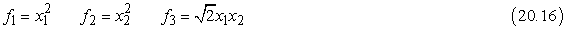
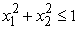
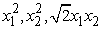
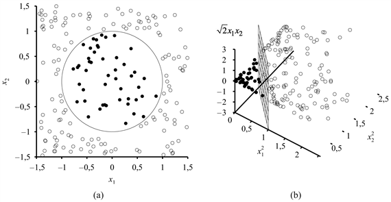
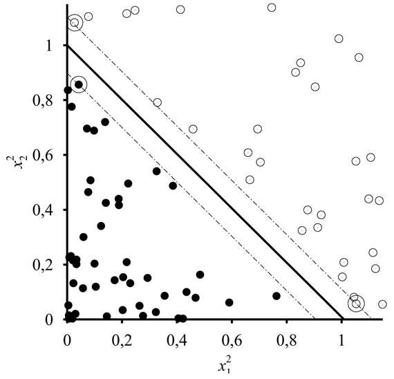
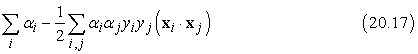
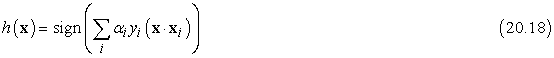

<?xml version="1.0" encoding="UTF-8" standalone="no"?>
<!DOCTYPE html PUBLIC "-//W3C//DTD XHTML 1.1//EN" "http://www.w3.org/TR/xhtml11/DTD/xhtml11.dtd">
<html xmlns="http://www.w3.org/1999/xhtml"><head><meta name="generator" content="DocBook XSL Stylesheets V1.76.1"/></head><body>

<h1 class="title"><a id="id747307"/>Kernelgépek</h1>

A neurális hálók tárgyalása után maradt egy dilemmánk. Az egyrétegű hálóknak nagyon egyszerű és hatékony tanulási algoritmusuk van, de nagyon korlátozott a kifejezőképességük, csupán lineáris döntési határokat képesek megtanulni a bemeneti térben. Másrészt a többrétegű hálók sokkal kifejezőbbek – általános nemlineáris függvényeket képesek reprezentálni –, de a rengeteg lokális minimum jelenléte, illetve a sokdimenziós súlytér miatt nagyon nehéz a tanításuk. Ebben az alfejezetben egy relatíve új tanulómódszer családot fedezünk fel, az úgynevezett <strong>szupport vektor gépek</strong>et (<strong>support vector machines</strong>, <strong>SVM</strong>), vagy általánosabban a <strong>kernelgép</strong>eket <strong>(kernel machine</strong>s). Bizonyos fokig a kernelgépek a két oldal legjobb tulajdonságait egyesítik. Azaz ezek a módszerek hatékony tanítási algoritmusokat alkalmaznak, <em>ugyanakkor </em>képesek bonyolult, nemlineáris függvények reprezentálására.

A kernelgépek teljes mélységű tárgyalása meghaladja ennek a könyvnek a kereteit, de a fő gondolatot egy példán keresztül illusztráljuk. A 20.27. (a) ábra egy kétdimenziós bemeneti teret mutat, amelyet az <strong>x = </strong>(<em>x</em>1, <em>x</em>2) attribútumok írnak le. A pozitív példák (<em>y = +</em>1) egy kör alakú rész belsejében, a negatív példák (<em>y = </em>–1) azon kívül helyezkednek el. Nyilvánvaló, hogy a probléma megoldására nem létezik lineáris szeparátor. Tegyük fel, hogy valamilyen számított tulajdonságok segítségével új formára hozzuk a példákat – azaz az összes bemeneti <strong>x</strong> vektort leképezzük a tulajdonságértékekből formált új, <em>F</em>(<strong>x</strong>) vektorra. A példában használjuk a következő három tulajdonságot:

Rövidesen látni fogjuk, hogy honnan vesszük ezeket a tulajdonságokat, de most csak nézzük meg azt, hogy mi is történt. A 20.27. (b) ábra mutatja az adatokat az új, a tulajdonságok által definiált háromdimenziós térben: ebben a térben <em>lineárisan szeparálhatók</em>! Ez a jelenség eléggé általános: ha az adatokat megfelelően sokdimenziós térbe képezzük le, akkor mindig lineárisan szeparálhatók lesznek. Itt mi csak három dimenziót használtunk,[<a id="id747395" href="#ftn.id747395" class="footnote">208</a>] de ha <em>N</em> pontunk van – akkor speciális esetek kivételével –, egy <em>N – </em>1 vagy ennél magasabb dimenziós térben a pontok mindig lineárisan szeparálhatók lesznek (lásd 20.21. feladat).

<a id="id747419"/>
<strong>20.27. ábra - (a) Egy kétdimenziós tanító halmaz, amelyben a pozitív példákat fekete, a negatívakat fehér körök jelölik. Az <em> </em>valódi elválasztó határt is bejelöltük. (b) Ugyanazok az adatok az  háromdimenziós térbe való leképezés után. Az (a) ábrán látható kör alakú döntési határ a háromdimenziós térben lineáris döntési felületbe ment át.</strong>

Ennyi az egész? Egyszerűen létrehozunk egy nagy halom számított tulajdonságot, és a megfelelő sokdimenziós térben megkeressük a lineáris szeparátort? Sajnálatos módon nem ilyen egyszerű. Emlékezzünk, hogy a <em>d</em> dimenziós térben a lineáris szeparátort egy <em>d</em> paraméteres egyenlet határozza meg, így aztán az a veszély fenyeget, hogy ha <em>d </em>≈ <em>N </em>(ahol <em>N</em> az adatpontok száma), akkor könnyen túlilleszkedhetünk az adatokra. (Ez ahhoz hasonló, mint amikor egy magas fokszámú polinommal túlillesztünk adatokat, ahogy ezt a 18. fejezetben tárgyaltuk.) Ezen okból a kernelgépek rendszerint az <em>optimális</em> lineáris szeparátort találják meg. Azt nevezzük optimálisnak, amelynek legnagyobb a <strong>tartalék</strong>a (<strong>margin</strong>): a lineáris szeparátor és a pozitív példák között az egyik oldalon, illetve a lineáris szeparátor és a negatív példák között a másikon. (Lásd 20.28. ábra.) A számítógépes tanulás elmélet módszereit (lásd 18.5. alfejezet) használva megmutatható, hogy ez a szeparátor az új példák robusztus általánosítására nézve nagyon jó tulajdonságokkal rendelkezik.

<a id="id747481"/>
<strong>20.28. ábra - Az első két dimenzióra vetített közelkép: a 20.27. (b) ábra optimális szeparátora. A szeparátort vastag vonallal jelöltük, a hozzá legközelebbi pontokat – a szupport vektorokat – bekarikáztuk. A tartalék nem más, mint a pozitív és negatív példák közti elválasztó sáv szélessége.</strong>

Hogyan találjuk meg ezt a szeparátort? Kiderül, hogy ez egy <strong>kvadratikus programozás</strong>sal (<strong>quadratic programming</strong>) megoldható optimalizálási feladat. Tegyük fel, hogy <strong>x</strong>i példáink vannak, az osztálybasorolásuk <em>yi = </em>±1, és a bemeneti térben optimális szeparátort akarunk találni. Ekkor a megoldandó kvadratikus programozási feladat azon paraméterértékek megtalálása, amelyek az <em>αi</em> ≥ 0 és Σ<em>iαi</em> <em>yi = </em>0 korlátozó feltételek mellett maximálják a következő kifejezést:

<h3 class="title">Fontos</h3>
Bár ennek a kifejezésnek a deriválása nem nagyon fontos pontja a történetnek, de azért van két lényeges tulajdonsága. Először is a kifejezésnek egyetlen, globális maximuma van, ami hatékonyan megtalálható. Másodszor <em>az adatok kizárólag pontpárok skalárszorzataként jelennek meg a kifejezésben</em>. Ez a második tulajdonság magára a szeparátorra is igaz, ha az optimális <em>αi</em>-ket kiszámítottuk, akkor:

Az ezen egyenlettel definiált optimális szeparátor utolsó fontos tulajdonsága az, hogy az egyes adatpontokkal asszociált <em>αi</em> súlyok mind <em>nullák</em>, kivéve a szeparátorhoz legközelebb eső pontokat – ezeket nevezzük <strong>szupport vektor</strong>oknak (<strong>support vector</strong>). (Azért nevezzük így őket, mert ők „tartják” a szeparáló síkot.) Mivel rendszerint jóval kevesebb szupport vektor van, mint adatpont, ezért az optimális szeparátort meghatározó tényleges paraméterszám rendszerint jóval kisebb <em>N</em>-nél.

Rendszerint nem várhatjuk el, hogy lineáris szeparátort találjunk az <strong>x</strong> bemeneti térben, de könnyen belátható, hogy a sokdimenziós <em>F</em>(<strong>x</strong>) tulajdonságtérben találhatunk lineáris szeparátorokat. Ennek érdekében a (20.17) egyenletben <strong>x</strong>i · <strong>x</strong>j-t egyszerűen kicseréljük <em>F</em>(<strong>x</strong>i) · <em>F</em>(<strong>x</strong>j)-re. Ez önmagában nem túlzottan figyelemre méltó – <strong>x</strong> kicserélése <em>F</em>(<strong>x</strong>)-re <em>bármely</em> tanuló algoritmusban elérné a kívánt hatást –, de a skalárszorzatnak van néhány érdekes tulajdonsága. Az <em>F</em>(<strong>x</strong>i) · <em>F</em>(<strong>x</strong>j) gyakran kiszámítható anélkül, hogy először kiszámítanánk minden pontra <em>F</em>-et. A (20.16) egyenlettel definiált háromdimenziós tulajdonságtér példánkban némi algebrai átalakításokkal megmutatható, hogy:

<code class="code"><em>F</em>(<em>x</em>i) · <em>F</em>(<em>x</em>j) = (<em>x</em>i · <em>x</em>j)2</code>

Az (<strong>x</strong>i · <strong>x</strong>j)2 kifejezést <strong>kernelfüggvény</strong>nek (<strong>kernel function</strong>) nevezzük, és <em>K</em>(<strong>x</strong>i, <strong>x</strong>j)-vel jelöljük. A kernelgépek szempontjából ez egy olyan függvény, amely pontpárokra alkalmazható avégett, hogy valamilyen tulajdonságtérben kiszámítsuk a skalárszorzatukat. Ennek megfelelően újrafogalmazhatjuk állításunkat: a (20.17) egyenletben <strong>x</strong>i · <strong>x</strong>j-t egyszerűen kicserélve a <em>K</em>(<strong>x</strong>i, <strong>x</strong>j) kernelfüggvényre, a sokdimenziós<em> F</em>(<strong>x</strong>) tulajdonságtérben találhatunk lineáris szeparátorokat. Így a tanulást a sokdimenziós térben végezhetjük, de csupán kernelfüggvények értékét kell kiszámítanunk, nem kell az öszszes pontra a tulajdonságok teljes készletét kiszámítani.

<h3 class="title">Fontos</h3>
A következő lépés – aminek most már kézenfekvőnek kell lennie – az, hogy meglássuk, a <em>K</em>(<strong>x</strong>i, <strong>x</strong>j) = (<strong>x</strong>i · <strong>x</strong>j)2 kernelben nincs semmi különleges. Ez egy bizonyos sokdimenziós tulajdonságtérnek felel meg, de más kernelfüggvények más tulajdonságterekkel vannak kapcsolatban. A <strong>Mercer-tétel</strong> (1909) azt mondja ki, hogy bármely „ésszerű”[<a id="id747870" href="#ftn.id747870" class="footnote">209</a>] kernelfüggény megfelel <em>valamilyen</em> tulajdonságtérnek. Ez a tulajdonságtér még egész ártatlannak látszó kernelek esetén is nagyon nagy lehet. Például a <em>K</em>(<strong>x</strong>i, <strong>x</strong>j) = (1 + <strong>x</strong>i · <strong>x</strong>j)<em>d</em> <strong>polinomiális kernel</strong> (<strong>polynomial kernel</strong>) egy olyan tulajdonságtérnek felel meg, amelynek dimenziója <em>d</em>-ben exponenciális. Ha a (20.17) egyenletben ilyen kerneleket használunk, akkor <em>hatékonyan kereshetünk lineáris szeparátorokat sok milliárd (vagy egyes esetekben végtelen) dimenziós terekben</em>. Az eredményként kapott lineáris szeparátorokat visszavetítve az eredeti bemeneti térbe, a pozitív és negatív példákat elválasztó tetszőlegesen tekervényes, nemlineáris határfelületeket kaphatunk.

Említettük az előző részben, hogy a kernelgépek kiemelkedően teljesítenek a kézírásos számjegyek felismerésében, de gyorsan felhasználják őket más alkalmazásokhoz is, különösen olyanokhoz, ahol sok bemeneti tulajdonság van. Ennek a folyamatnak részeként számos új kernelt dolgoztak ki, amelyek karakterfüzérekre, fákra és más nemnumerikus adattípusokra alkalmazhatók. Az is megfigyelhető, hogy a kernelmódszer nemcsak optimális szeparátorok keresésére alkalmas, hanem bármely olyan algoritmusra, amely úgy átalakítható, hogy csak adatpontpárok skalárszorzatát használja, mint a (20.17), illetve (20.18) egyenlet. Amint ezt sikerült megtennünk, a skalárszorzat kicserélhető egy kernelfüggvényre, és elkészítettük az algoritmus <strong>kernelesített</strong> (<strong>kernelized</strong>) változatát. Ez az átalakítás többek közt a <em>k</em>-legközelebbi-szomszéd algoritmusra és a perceptron tanulásra is könnyen elvégezhető.

 

[<a id="ftn.id747395" href="#id747395" class="para">208</a>]  Az olvasó felfedezheti, hogy elég lett volna csupán <em>f</em>1 és <em>f</em>2 használata, de a 3D leképezés jobban illusztrálja az ötletet.

[<a id="ftn.id747870" href="#id747870" class="para">209</a>]  Itt ésszerű alatt azt értjük, hogy a <strong>k</strong>ij = <em>K</em>(<strong>x</strong>i, <strong>x</strong>j) mátrix pozitív definit; lásd A) függelék.

</body></html>
