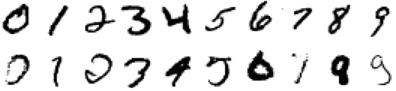
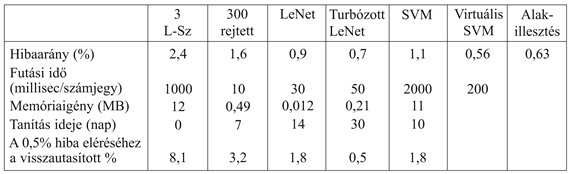

<?xml version="1.0" encoding="UTF-8" standalone="no"?>
<!DOCTYPE html PUBLIC "-//W3C//DTD XHTML 1.1//EN" "http://www.w3.org/TR/xhtml11/DTD/xhtml11.dtd">
<html xmlns="http://www.w3.org/1999/xhtml"><head><meta name="generator" content="DocBook XSL Stylesheets V1.76.1"/></head><body>

<h1 class="title"><a id="id747975"/>Esettanulmány: kézzel írott számjegyek felismerése</h1>

A kézzel írott számjegyek felismerése számos alkalmazásban felmerülő fontos probléma. Néhány ezek közül: postai levelek irányítószám szerinti automatikus osztályozása, csekkek és adó-visszatérítési számlák automatikus leolvasása, kézi számítógépek adatbevitele. Ez olyan terület, ahol gyors volt a fejlődés, részben a jobb tanuló algoritmusoknak, részben a jobb tanító adatbázisoknak köszönhetően. Az Egyesült Államok Mérés- és Szabványügyi Hivatala (National Institute of Standards and Technology, NIST) egy 60 000 megcímkézett számjegyből álló archívumot hozott létre, amelyben minden számjegy egy 20  × 20 = 400 pixeles, 8 bites szürke árnyalatú képen jelenik meg. Ez az új tanuló algoritmusok összehasonlításának egyik standard mércéjévé (benchmark) vált. A 20.29. ábra bemutat néhány számjegyet.

Számos különböző tanuló algoritmust kipróbáltak. Az elsők egyike, és egyben valószínűleg a legegyszerűbb, a <strong>3-legközelebbi-szomszéd</strong> (<strong>3-nearest-neighbor</strong>) osztályozó, amelynek további nagy előnye, hogy nem igényel tanítási időt. Ugyanakkor memóriaalapú algoritmusként mind a 60 000 képet tárolnia kell, és a futási idejű teljesítmény lassú. A teszthalmazon elért hibaaránya 2,4%.

Kifejlesztettek egy <strong>egy-rejtett-rétegű neurális háló</strong>t (<strong>single-hidden-layer neural network</strong>) a feladatra, 400 bemenettel (egy bemenet pixelenként) és 10 kimenettel (osztályonként egy). Keresztvalidációt használva azt találták, hogy durván 300 rejtett neuron adta a legjobb teljesítményt. A rétegek között teljes összeköttetést valósítottak meg, így összesen 123 300 súlyt használtak. Ez a háló 1,6% hibaarányt ért el.

LeNet néven egy sor <strong>speciális neurális háló</strong>t (<strong>specialized neural network</strong>) szerkesztettek egybe azért, hogy a problémában rejlő struktúrát kihasználják. Az egyik strukturális adottság, hogy a bemeneti pixelek kétdimenziós tömböt alkotnak, a másik, hogy egy ábra kismértékű pozíció- vagy dőlésiirány-változása lényegtelen. Minden egyes háló 32 × 32 egységből álló bemeneti réteget tartalmaz, amelyre a 20  × 20 pixelt úgy kapcsolták, hogy minden egyes bemeneti egység egy lokális szomszédságot reprezentált. Ezt három rejtett réteg követte. Mindegyik réteg számos <em>n</em> × <em>n</em>-es mezőből áll, ahol <em>n</em> kisebb, mint a megelőző réteg, tehát a háló a bemenetek alul-mintavételezését valósítja meg. Egy mezőn belül mindegyik egységre azonos súlyokat kényszerítünk, így a mező tulajdonságdetektorként működik: olyan tulajdonságokat érzékel, mint egy hosszú függőleges vonal vagy egy rövid félkörív jelenléte. A kimeneti réteg 10 neuronból áll. Ennek az architektúrának számos változatát kipróbálták: egyik tipikus képviselőjük a rejtett rétegeiben rendre 768, 192, illetve 30 neuront tartalmazó háló volt. A tanító halmazt kiegészítették további mintákkal, ezeket a valósakból kismértékű affin transzformációkkal nyerték, amelyek a következők voltak: eltolás, kismértékű elforgatás, nagyítás/kicsinyítés. (Természetesen a transzformációknak kismértékűeknek kell lenniük, különben a 6-ot 9-cé transzformáljuk!) A LeNet által elért legkisebb hibaarány 0,9% volt.

Egy <strong>turbózott neurális háló</strong>  (<strong>boosted neural network</strong>) három LeNet-architektúrát kombinált: a másodikat egy olyan mintakeverékkel tanították, amelyen az első 50%-os hibát produkált, a harmadikat pedig olyan mintákkal, amelyekre az első kettő különböző eredményt adott. A tesztelés során a három háló a tíz lehetséges számjegy mindegyikére egy-egy súllyal szavazott, ezeket összeadva határozták meg a győztest. A teszthibaarány 0,7% volt.

Egy 25 000 szupport vektort használó <strong>szupport vektor gép</strong> (<strong>support vector mach</strong><strong>ine</strong>) (lásd 20.6. alfejezet) 1,1% hibaarányt ért el. Ez azért figyelemre méltó, mert az SVM-technika – éppúgy mint az egyszerű legközelebbi-szomszéd megközelítés – szinte nem igényelt gondolkodást vagy iteratív kísérletezést a fejlesztőtől, mégis az évekig fejlesztett LeNet-et megközelítő eredményt ért el. A szupport vektor gépek valójában nem használják ki a probléma struktúráját, tehát ugyanolyan jól teljesítenének, ha a pixeleket valamilyen permutált sorrendben használnánk.

A <strong>virtuális szupport vektor gép</strong>et (<strong>virtual support vector machine</strong>) egy standard SVM-ként indítjuk, majd egy olyan technikával javítjuk, amelyet a probléma struktúrájának kihasználására hoztak létre. Ahelyett hogy az összes lehetséges pixelpárból képzett kernelt megengednénk, ez olyan kernelekre koncentrál, amelyek szomszédos pixelpárokból formálódtak. A LeNethez hasonlóan itt is a példák transzformáltjaival egészítjük ki a tanító halmazt. Egy virtuális SVM érte el az eddigi legjobb hibaarányt, 0,56%-ot.

<a id="id748071"/>
<strong>20.29. ábra - Néhány példa az NIST kézzel írt számjegyekre létrehozott adatbázisából. A felső sorban a 0–9 karakterek könnyebben felismerhető példáit mutatjuk be, az alsó sorban pedig ugyanezen számjegyekre nehezebben felismerhető példákat látunk.</strong>

Az <strong>alakillesztés</strong> (<strong>shape matching</strong>) a számítógépes látás egyik eljárása, amelyet arra hoztak létre, hogy tárgyak két különböző képének megfelelő részeit összerendeljék. (Lásd 24. fejezet.) Az alapötlet, hogy vegyünk egy-egy ponthalmazt mindkét képről, és számítsuk ki az első kép minden egyes pontjára, hogy a második kép mely pontja felel meg neki. Ebből a megfeleltetésből aztán számítsuk ki a két képet összekapcsoló transzformációt. Ez a transzformáció a képek közt egy távolságmértéket határoz meg. Ez a távolságmérték indokoltabb, mint egyszerűen az egymástól különböző pixelek megszámlálása. Kiderült, hogy az erre a távolságmértékre alapozott 3-legközelebbi-szomszéd algoritmus nagyon jól működik. Csupán 20 000-et használva a 60 000 számjegyből, és egy Canny éldetektor képének csupán 100 pixelét felhasználva az alakillesztéses eljárás 0,63% teszthibaarányt ért el.

Becslések szerint az <strong>ember</strong>ek (<strong>human</strong>) kb. 0,2% hibaarányt érnek el ennél a problémánál. Ez a szám némiképpen gyanús, mert az embereket nem tesztelték olyan alaposan, mint a gépi tanulás algoritmusait. Az Egyesült Államok Postájának (United States Postal Service) egy hasonló – számjegyekből képzett – adathalmazán az emberek által elkövetett hibaarány 2,5% volt.

A következő ábra összegzi a tárgyalt hét eljárás esetén a hibaarányt, a futási időt, a memóriaigényt és a szükséges tanítási időt. Még egy mértéket ad ezekhez, a számjegyek azon arányát, amelyet vissza kell utasítanunk, hogy a 0,5% hibaarányt elérjük. Ha például egy SVM-nek megengedjük, hogy bemeneti képeinek 1,8%-át visszautasítsa – azaz átpasszolhatja valakinek, hogy az hozza meg a végső döntést –, akkor a képek többi 98,2%-án a hibaarány 1,1%-ról 0,5%-ra csökken.

A következő táblázat a hét tárgyalt technikára összegzi a hibaarányt és néhány további jellemzőt.

</body></html>
