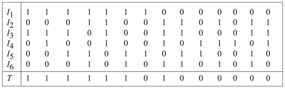

<?xml version="1.0" encoding="UTF-8" standalone="no"?>

<html xmlns="http://www.w3.org/1999/xhtml"><head><meta name="generator" content="DocBook XSL Stylesheets V1.76.1"/></head><body>

<h1 class="title"><a id="id748121"/>Összefoglalás</h1>

A statisztikai tanulás módszerei széles skálán helyezkednek el: az egyszerű átlagszámításoktól a bonyolult modellek – mint például a Bayes-hálók vagy neurális hálók – konstruálásáig. Alkalmazási területük a számítógép-tudományra, a mérnöki alkalmazásokra, a neurobiológiára, a pszichológiára és a fizikára is kiterjed. Ebben a fejezetben bemutattunk néhány alapelvet, és ízelítőt adtunk a matematikai tárgyalásból. A következő fő pontok szerepeltek:

<ul class="itemizedlist"><li class="listitem">
A <strong>Bayes-tanulás</strong>i (<strong>Bayesian learning</strong>) módszerek a tanulást valószínűségi következtetésként fogalmazzák meg, a megfigyelések alapján frissítve a hipotézisek a priori<em> </em>eloszlásait. Ez a megközelítés jó eszköz az Ockham borotvája elv megvalósítására, de bonyolult hipotézisterek esetén hamar kezelhetetlenné válik.
</li><li class="listitem">
A <strong>maximum a posteriori</strong> (<strong>MAP</strong>) tanulás az adatok alapján választ ki egyetlen, a legvalószínűbb hipotézist. A hipotézis priort itt is használjuk, ez a módszer gyakran jobban kezelhető, mint a tiszta Bayes-tanulás.
</li><li class="listitem">
A <strong>maximum-likelihood</strong> tanulás egyszerűen azt a hipotézist választja, amely maximálja az adatok likelihood értékét. Megfelel egy egyenletes prior mellett végrehajtott MAP-tanulásnak. Egyszerű esetekben, mint a lineáris regresszió és a teljesen megfigyelhető Bayes-hálók, a maximum-likelihood megoldás könnyen előállítható zárt alakban. A <strong>naiv Bayes</strong>- (<strong>naive Bayes</strong>) tanulás különösen hatékony technika, amely különböző bonyolultságú feladatokra is jól illeszthető.
</li><li class="listitem">
Amikor a változók közt van néhány rejtett (nem megfigyelhető), akkor az <strong>EM</strong> algoritmussal lokális maximum-likelihood megoldásokat találhatunk. Az alkalmazások kiterjednek a kevert Gauss-jelek osztályozására, a Bayes-hálók tanulására és a rejtett Markov-modellek tanulására.
</li><li class="listitem">
A <strong>modellválasztás</strong>ra (<strong>model selection</strong>) ad példát a Bayes-hálók struktúrájának tanulása. Ez rendszerint egy, a struktúrák terében végzett diszkrét keresést foglal magában. Szükség van valamilyen módszerre a modell bonyolultsága és az illeszkedés mértéke közti kompromisszum létrehozásához.
</li><li class="listitem">
A <strong>példányalapú modell</strong>ek (<strong>instance-based model</strong>) a tanító példányok gyűjteményének eloszlását reprezentálják. Így a paraméterek száma a tanító halmaz méretével nő. A <strong>legközelebbi-szomszéd</strong> (<strong>nearest neighbor</strong>) módszerek a kérdéses mintapont közelében lévő példányokat nézik, míg a <strong>kernel</strong>módszerek az összes példány távolsággal súlyozott kombinációját.
</li><li class="listitem">
A <strong>neurális háló</strong>k (<strong>neural network</strong>s) nem mások, mint sok paraméterrel rendelkező, komplex nemlineáris függvények. Paramétereiket zajos adatok alapján tanulhatják meg. Több ezer alkalmazásban használták már őket.
</li><li class="listitem">
A <strong>perceptron</strong> egy előrecsatolt neurális háló, amelynek nincs rejtett rétege, és csak <strong>lineárisan szeparálható</strong> (<strong>linearly separable</strong>) függvények reprezentálására alkalmas. Ha az adatok lineárisan szeparálhatók, akkor egy egyszerű súlyfrissítési szabály alkalmazásával az adatokra való pontos illeszkedést tudunk elérni.
</li><li class="listitem">
A <strong>többrétegű előrecsatolt</strong> (<strong>multilayer feed-forward</strong>) neurális hálók – ha kellő számú neuronjuk van – tetszőleges függvények reprezentálására képesek. A <strong>hiba-visszaterjesztés</strong>i (<strong>back-propagation</strong>) algoritmus a kimeneti hiba minimalizálása érdekében gradiensalapú csökkentést valósít meg a paramétertérben.
</li></ul>

A statisztikai tanulás továbbra is igen aktív kutatási terület. Mind az elmélet, mind a gyakorlat hatalmas lépésekkel haladt, míg elértünk addig a pontig, hogy szinte bármely modell megtanulható, ha megvalósítható rá egzakt vagy közelítő következtetés.

<h2 class="title"><a id="id750582"/>Irodalmi és történeti megjegyzések</h2>

Az MI korai éveiben a statisztikai tanuláselmélet a kutatás aktívan művelt területe volt (Duda és Hart, 1973), de elkülönült az MI fősodrától, ahogy ez utóbbi egyre inkább a szimbolikus módszerekre koncentrált. Különböző formákban folytatódott – egyesek explicit módon valószínűségiek, mások nem – olyan területeken, mint az <strong>alakzatfelismerés</strong> (<strong>pattern recognition</strong>) (Devroye és társai, 1996) és az <strong>információkeresés</strong> (<strong>information retrieval</strong>) (Salton és McGill, 1983). Nem sokkal a Bayes-háló modellek bevezetése után, az 1980-as évek végén az érdeklődés ismét erősen ráirányult, nagyjából ugyanebben az időben jelent meg a neurális hálók statisztikai megközelítése. Az 1990-es évek végén a gépi tanulás, a statisztika és a neuronhálók területén is az érdeklődés középpontjába kerültek az adatok alapján nagy valószínűségi modelleket létrehozó módszerek.

A naiv Bayes-modell egyike a legrégebbi és legegyszerűbb Bayes-hálóknak, megjelenése egészen az 1950-es évekig követhető vissza. Eredetüket megemlítettük a 13. fejezet záró megjegyzéseiben. Részleges magyarázat található Domingos és Pazzani publikációjában (Domingos és Pazzani, 1997). A naiv Bayes-tanulás turbózott változata nyerte az első KDD Cup adatbányászati versenyt (Elkan, 1997). Heckerman kitűnő bevezetését adja a Bayes-háló tanulás általános problematikájának (Heckerman, 1998). Spiegelharter és társai a Bayes-hálók Bayesi paramétertanulását tárgyalták Dirichlet-priorok esetére (Spiegelharter és társai, 1993). A <code class="code">BUGS</code> szoftvercsomag (Gilks és társai, 1994) számos gondolatot megtestesített ezek közül, nagyon hatékony eszközt biztosított az összetett valószínűségi modellek felállítására és tanulására. A Bayes-hálóstruktúra tanulásának első algoritmusai feltételes függetlenségi teszteket használtak (Pearl, 1988; Pearl és Verma, 1991). Spirtes és társai hasonló elvek alapján dolgozták ki átfogó megközelítésüket, valamint a Tetrad csomagot Bayes-hálóstruktúra tanulás céljaira (Spirtes és társai, 1993). Az azóta végrehajtott algoritmikus javítások a 2001-es KDD Cup adatbányászati versenyen egy Bayes-háló tanulási algoritmus (Cheng és társai, 2002) meggyőző győzelméhez vezettek. (Itt a speciális megoldandó feladat egy 139 351 tulajdonsággal leírt bioinformatikai probléma volt!) Cooper és Herskovits egy likelihood maximalizáláson alapuló struktúratanulási megközelítést fejlesztett ki (Cooper és Herskovits, 1992), ezt Heckerman és társai fejlesztették tovább (Heckerman és társai, 1994). Friedman és Goldszmidt mutatták ki a lokális feltételes eloszlások reprezentációjának a megtanult struktúrára gyakorolt hatását (Friedman és Goldszmidt, 1996).

A rejtett változókkal és a hiányzó adatokkal való valószínűségi modell tanulás általános problematikáját az EM algoritmussal kísérelték meg kezelni (Dempster és társai, 1977). Ezt számos meglévő módszerből absztrahálták, amelyek közt található a rejtett Markov-modell (HMM) tanulásra szolgáló Baum–Welch-algoritmus is (Baum és Petrie, 1966). (Maga Dempster az EM algoritmust inkább sémának tekinti, nem algoritmusnak, mivel jó adag elméleti matematikai munkára lehet szükség mielőtt egy új eloszláscsaládra alkalmazható lenne.) Manapság az EM egyike a tudományos kutatásban legelterjedtebben használt algoritmusoknak, McLachlan és Krishnan egy teljes könyvet szenteltek neki és tulajdonságainak (McLachlan és Krishnan, 1997). A kevert modellek – beleértve a kevert Gauss-modellek – tanulásának speciális problémáit Titterington és társai tárgyalták (Titterington és társai, 1985). Az <code class="code">AUTOCLASS</code> volt az első sikeres rendszer az MI-n belül, amely az EM-et alkalmazta kevert modellezésre (Cheeseman és társai, 1988; Cheeseman és Stutz, 1996). Az <code class="code">AUTOCLASS</code>-t egy sor valós tudományos osztályozási feladatra alkalmazták; ezek közül kettő: spektrális tulajdonságok alapján új csillagtípusok felfedezése (Goebel és társai, 1989); új fehérje- és intronosztályok felfedezése DNS/fehérjeszekvencia adatbázisokban (Hunter és States, 1992).

A rejtett változókkal rendelkező Bayes-hálók tanulására kifejlesztett EM algoritmus Lauritzen munkája (Lauritzen, 1995). Mind a Bayes-hálók, mind a dinamikus Bayes-hálók esetén a gradiensalapú eljárások is hatékonynak bizonyultak (Russell és társai, 1995; Binder és társai, 1997a). A strukturális EM algoritmus kifejlesztése Friedman nevéhez fűződik (Friedman, 1998). A Bayes-hálók struktúrájának megtanulhatósága szoros kapcsolatban van a <em>kauzális</em> kapcsolatok adatokból történő visszanyerésének kérdésével. Azaz lehetséges-e Bayes-hálókat úgy megtanulni, hogy az előállított hálóstruktúra valós kauzális hatásokat jelezzen? A statisztikusok hosszú évek óta elkerülték ezt a kérdést, azt hitték, hogy a megfigyelt adatok (ellentétben a kísérletek során előálltakkal) csak korrelációs információt hordoznak. Végül is bármely két változóra, amelyek egymással kapcsolatban állónak tűnnek, lehet, hogy valójában inkább egy harmadik – mindkettőre kauzális hatást gyakorló – ismeretlen változó hatása alatt állnak, nem pedig egymásra gyakorolnak közvetlen hatást. Ennek ellenkezőjére Pearl adott meggyőző érveket (Pearl, 2000). Megmutatta, hogy valójában számos eset van, amikor a kauzalitás kideríthető, és <strong>kauzális háló</strong> (<strong>causal network</strong>) formalizmus alakítható ki az oksági kapcsolatok, a beavatkozás hatásának, valamint a szokásos feltételes valószínűségek beépítésére.

A legközelebbi-szomszéd modellek legalább Fix és Hodges (Fix és Hodges, 1951) munkájáig nyúlnak vissza, és azóta a statisztika és alakfelismerés standard eszközei. Az MI-n belül Stanfill és Waltz népszerűsítették ezeket a modelleket (Stanfill és Waltz, 1986), ők a távolságmetrika adatokhoz történő adaptálási módszereivel foglalkoztak. Hastie és Tibshirani kifejlesztettek egy módszert, amellyel a tér egyes pontjaihoz kötötték az ezen pont körüli adateloszlástól függő metrikát (Hastie és Tibshirani, 1996). A legközelebbi-szomszédok hatékony indexelési sémával történő megtalálásával az algoritmusokat kutató közösség foglalkozott (pl. Indyk, 2000). A kernelsűrűség-becslést, amelyet <strong>Parzen ablak</strong> (<strong>Parzen window</strong>) sűrűségbecslésnek is neveznek, kezdetben Rosenblatt és Parzen tanulmányozta (Rosenblatt, 1956; Parzen, 1962). Azóta óriási az irodalma a különböző becslők tulajdonságai vizsgálatának. Devroye alapos bevezetést nyújt ehhez a témához (Devroye, 1987).

A neurális hálók irodalma túl nagy ahhoz (napjainkig kb. 100 000 publikáció), hogy részletesen bemutathassuk. A korai fejleményekről Cowan és Sharp készített összefoglalót (Cowan és Sharp, 1988b; 1988a), McCulloch és Pitts munkásságával kezdve az áttekintést (McCulloch és Pitts, 1943). Norbert Wiener – a kibernetika és a szabályozáselmélet egyik úttörője (Wiener, 1948) – együtt dolgozott McCullochkal és Pitts-szel, és nagy hatást gyakorolt egy sor fiatal kutatóra, például Marvin Minskyre, aki valószínűleg elsőként fejlesztett ki működő neurálisháló-hardvert 1951-ben (Minsky és Papert, 1988, pp. ix–x.) Ezalatt Nagy-Britanniában W. Ross Ashby (szintén a kibernetika egyik úttörője; Ashby, 1940), Alan Turing, Grey Walter és mások megalakították a Ráció Klubot (Ratio Club) azok számára, akik „rájöttek Wiener gondolataira, még mielőtt Wiener könyve megjelent”. Ashby <em>Az agy felépítése</em> (<em>Design for a Brain</em>, 1948, 1952) című könyvében vetette fel, hogy stabil adaptív viselkedést létrehozó alkalmas visszacsatoló hurkokkal rendelkező <strong>homeostatikus</strong>[<a id="id750664" href="#ftn.id750664" class="footnote">210</a>] (<strong>homeostatic</strong>) eszközök segítségével intelligenciát lehetne létrehozni. Turing egy kutatási jelentést írt <em>Intelligens Gépek</em> (<em>Intelligent Machinery</em>) címen (Turing, 1948), amely a következő mondattal kezdődik: „Javaslom megvizsgálni azt a kérdést, hogy vajon lehetséges-e az, hogy a gépek intelligens viselkedést mutassanak”, majd leírja a rekurrens neurális hálózatokat, amelyeket „B típusú nem szervezett gépek” néven vezet be, és megadja tanításuknak egy lehetséges megközelítését. Sajnos ezt a jelentést 1969-ig nem is publikálták, és napjainkig lényegében figyelmen kívül hagyták.

Frank Rosenblatt (Rosenblatt, 1957) nevéhez fűződik a modern „perceptron” felfedezése, és ő bizonyította be a perceptronkonvergencia tételt (Rosenblatt, 1960), bár ezt már a neurális hálók területén kívül eső, tisztán matematikai munkák is előrevetítették (Agmon, 1954; Motzkin és Schoenberg, 1954). Volt némi, a többrétegű hálózatokra irányuló korai kutatás is, amelynek eredményei például a <strong>Gamba-perceptron</strong>ok (Gamba és társai, 1961) és a <strong>madaline</strong>-ok (Widrow, 1962). A <em>Learning Machines</em> (Nilsson, 1965) c. könyv áttekintést ad a korai kutatás legnagyobb részéről. A korai perceptronkutatások halálát siettette – a szerzők későbbi állítása szerint csak magyarázta – a <em>Perceptrons</em> c. könyv (Minsky és Papert, 1969), amelyben a terület matematikai precizitásának hiányát panaszolták fel. A könyv rámutatott, hogy egyrétegű perceptronokkal csak lineárisan szeparálható helyzetek reprezentálhatók, és felhívta a figyelmet a többrétegű hálók hatékony tanuló algoritmusainak hiányára.

A San Diegóban, 1979-ben tartott konferencia publikációira alapozott kiadvány (Hinton és Anderson, 1981) tekinthető a konnekcionizmus újjáéledése jelének. Nagy figyelmet keltett a kétrészes „PDP” (Párhuzamos elosztott feldolgozás – Parallel Distributed Processing) antológia (Rumelhart és társai, 1986a), illetve a <em>Nature</em>-ben megjelent rövid cikk (Rumelhart és társai, 1986b). A neurális hálókkal foglalkozó cikkek száma az 1980–1984 közötti publikációk számáról 200-szorosára nőtt 1990–1994-re. A mágneses spin üvegek fizikai elméletének felhasználásával elvégzett neurális háló analízis (Amit és társai, 1985) nem csupán szorosabb kapcsolatot hozott a statisztikus mechanika és neurális hálók elmélete közt, hanem <em>tekintélyt</em> is adott a területnek. A hiba-visszaterjesztés (back-propagation) technikáját viszonylag hamar kitalálták (Bryson és Ho, 1969), de több alkalommal újra felfedezték (Werbos, 1974; Parker, 1985).

Az 1990-es években megjelent szupport vektor gépeknek (Cortes és Vapnik, 1995) napjainkban gyorsan növekvő az irodalmuk, amely olyan tankönyveket is magában foglal, mint Cristianini és Shawe-Taylor könyve (Cristianini és Shawe-Taylor, 2000). Nagyon népszerűnek és bizonyos feladatokra nagyon hatékonynak bizonyultak, ilyenek például a szövegkategorizálás (Joachims, 2001), a bioinformatikai kutatás (Brown és társai, 2000), a természetes nyelvű szöveg feldolgozása, mint a kézzel írt számjegyek DeCoste és Schölkopf által megvalósított felismerése (DeCoste és Schölkopf, 2002). A szavazó perceptron szintén egy olyan technika, amely a kerneltrükköt alkalmazza az exponenciális tulajdonságtér implicit reprezentációjára (Collins és Duffy, 2002).

Számos forrás adható meg a neurális hálók valószínűségi interpretációjára, például (Baum és Wilczek, 1988), valamint (Bridle, 1990). A szigmoid függvény szerepét Jordan tárgyalja (Jordan, 1995). MacKay javasolta a neurális hálók Bayes-i paraméterbecslését (MacKay, 1992), amelyet Neal fejlesztett tovább (Neal, 1996). A neurális hálók függvényreprezentációs képességeit Cybenko vizsgálta (Cybenko, 1988; 1989), aki megmutatta, hogy két rejtett réteg elegendő tetszőleges függvény reprezentációjához, tetszőleges <em>folytonos</em> függvény reprezentációjához pedig elég egy réteg. A haszontalan összeköttetések eltávolítását célzó „optimális agykárosodás” módszer LeCun és társai eredménye (LeCun és társai, 1989), míg Sietsma és Dow mutatták meg, hogyan kell a felesleges neuronokat eltávolítani (Sietsma és Dow, 1988). A nagyobb struktúrák növesztéssel való előállítására szolgáló csempézési algoritmus Mézard és Nadal munkája (Mézard és Nadal, 1989). A kézzel írt számjegyek felismerésével foglalkozó algoritmusokról LeCun és társai írtak áttekintő publikációt (LeCun és társai, 1995). Azóta jobb hibaarányt értek el Belongie és társai (2002) az alakillesztési eljárás (Belongie és társai, 2002), valamint DeCoste és Schölkopf a virtuális szupport gép alkalmazásával (DeCoste és Schölkopf, 2002).

A számítógépes tanulás elmélete területén tevékenykedő kutatók foglalkoztak a neurális háló tanulás komplexitásával. Az első számítási eredményeket Judd kapta (Judd, 1990), aki megmutatta, hogy egy példahalmazzal konzisztens súlyhalmaz megtalálásának általános problémája – még nagyon erősen korlátozó feltételek esetén is – NP-teljes. A mintakomplexitásra vonatkozó eredmények közül néhány Baum és Haussler munkájához fűződik, akik megmutatták, hogy <em>W</em> súly esetén a hatékony tanításhoz szükséges mintaszám <em>W </em>log <em>W</em> arányában nő (Baum és Haussler, 1989).[<a id="id750740" href="#ftn.id750740" class="footnote">211</a>] Azóta Anthony és Bartlett egy sokkal fejlettebb elméletet fejlesztettek ki (Anthony és Bartlett, 1999), amely magában foglalja azt a fontos eredményt, hogy a háló reprezentációs képessége a súlyok<em> nagyságrendjétől</em> és számától egyaránt függ.

Az általunk nem tárgyalt legnépszerűbb neurális háló a <strong>radiális bázisfüggvény</strong> (<strong>RBF</strong>) (<strong>radial basis function</strong>) háló. A radiális bázisfüggvény kernelek súlyozott kombinációját (természetesen rendszerint Gauss-kernelekét) alkalmazza függvényapproximációra. Az RBF-hálókat két fázisban taníthatjuk: először egy nem ellenőrzött osztályozással tanítjuk a Gauss-függvények paramétereit (az átlagokat és varianciákat), mint a 20.3. alfejezetben láttuk. A második fázisban a Gauss-függvények relatív súlyát határozzuk meg. Ez egy lineáris egyenletrendszer megoldása, amiről tudjuk, hogy közvetlenül hogyan oldható meg. Így az RBF-tanítás mindkét fázisának vonzó tulajdonságai vannak: az első fázis nem ellenőrzött, tehát nincs szükségünk hozzá címkézett mintákra, a második ugyan felügyelt, de hatékonyan elvégezhető. A részleteket lásd Bishop publikációjában (Bishop, 1995).

A <strong>rekurrens háló</strong>kat (<strong>recurrent network</strong>), amelyekben a neuronok hurkokba vannak kapcsolva, említettük ugyan a fejezetben, de nem részleteztük. A legjobban megértett rekurrens háló osztályt valószínűleg a <strong>Hopfield-háló</strong>k (<strong>Hopfield network</strong>s) (Hopfield, 1982) alkotják. A Hopfield-háló kétirányú kapcsolatokat használ <em>szimmetrikus</em> súlyokkal (azaz <em>W</em><em>i</em>,<em>j = Wj</em>,<em>i</em>), minden neuron bemeneti és egyben kimeneti egység is, a <em>g</em> aktivációs függvény az előjelfüggvény, az aktivációs szint pedig csak a ±1 lehet. A Hopfield-háló <strong>asszociatív memória</strong>ként működik: miután egy mintahalmazon tanítottuk, egy új bemeneti stimulus hatására egy olyan aktivációs mintára áll be, amely a tanító példák közül a <em>leginkább emlékeztet</em> az új bemenetre. Ha például a tanító halmaz egy halom fénykép, az új bemenet pedig az egyik fénykép egy kis darabja, akkor aktivációs szintjeivel a háló vissza fogja állítani az adott darabból a fényképet. Figyeljük meg, hogy a fényképek nincsenek elkülönülten tárolva a hálóban: mindegyik súly az összes fénykép egy részleges kódja. Érdekes elméleti eredmény, hogy az <em>N</em> neuronból álló Hopfield-háló legfeljebb 0,138<em>N</em> tanító mintát képes megbízhatóan tárolni.

A <strong>Boltzmann-gép</strong>ek is szimmetrikus súlyokat használnak, de tartalmaznak rejtett egységeket is (Hinton és Sejnowski, 1983; 1986). Ráadásul aktivációs függvényük <em>sztochasztikus:</em> a kimenet 1 értékének valószínűsége a teljes súlyozott bemenetnek valamilyen függvénye. A Boltzmann-gépek ennek megfelelően a szimulált lehűtés keresési eljárásra (lásd 4. fejezet) emlékeztető állapotátmenetek során jutnak el a tanító halmazt a legjobban közelítő konfigurációhoz. Kimutatható, hogy a Boltzmann-gépek nagyon közeli rokonságban vannak bizonyos speciális Bayes-hálókkal, amelyeket sztochasztikus szimulációs algoritmussal értékelünk ki. (Lásd 14.5. alfejezet.)

A kernelgépek alapötletének első alkalmazása Aizerman és társai munkájához fűződik (Aizerman és társai, 1964, de a szupport vektor gépek felé mutató, teljes elméleti kidolgozás Vlagyimir Vapniknak és kollégáinak köszönhető (Boser és társai, 1992; Vapnik, 1998). A precíz elméleti tárgyalás megtalálható Cristianini és Shawe-Taylor, illetve Schölkopf és Smola könyvében (Cristianini és Shawe-Taylor, 2000; Schölkopf és Smola, 2002), valamint egy barátságosabb kifejtés található Cristianini és Schölkopf <em>AI Magazine</em>-ban megjelent cikkében.

Ennek a fejezetnek az anyaga a statisztika, alakfelismerés és neurális hálók kutatásában elért eredményeket integrálja, tehát a történetet sokszor, sokféle módon elmondták már. A Bayes-statisztikáról jó publikációkat találunk, ilyenek például a (DeGroot, 1970), a (Berger, 1985), továbbá a (Gelman és társai, 1995). A statisztikus tanulás elméletének kiváló tárgyalása található a (Hastie és társai, 2001) munkában. Az alakosztályozás témakörében Duda és Hart könyve számít klasszikusnak (Duda és Hart, 1973), melynek nemrég új kiadása is megjelent (Duda és társai, 2001). A neurális hálókról a (Bishop, 1995) és a (Ripley, 1996) a legfontosabb könyvek. A számítógépes neurális tudományt a (Dayan és Abbott, 2001) könyv tárgyalja. A neurális hálók és hozzájuk kapcsolódó témák legfontosabb konferenciái az évente megrendezett NIPS- (Neural Information Processing Conference) konferenciák, melyek kiadványait az <em>Advances in Neural Information Processing Systems</em> sorozatban jelentetik meg. A Bayes-hálók tanulásáról szóló írások az <em>Uncertainty in AI</em> és a <em>Machine Learning</em> konferenciákon jelennek meg, továbbá számos statisztikával foglalkozó konferencián. A neurális hálókkal foglalkozó újságok között érdemes megemlíteni a <em>Neural Computation</em>t, a <em>Neural Networks</em>öt és az <em>IEEE Transaction on Neural Networks</em>öt.

<h2 class="title"><a id="id750872"/>Feladatok</h2>

<strong>20.1.	</strong>

A 20.1. ábrán használt adatokat úgy tekinthetjük, mintha <em>h</em>5 generálta volna őket. A másik négy hipotézis mindegyikére generáljon egy-egy 100 hosszúságú adathalmazt, rajzolja fel a megfelelő <em>P</em>(<em>hi</em>|<em>d</em>1,…, <em>dm</em>) és <em>P</em>(<em>Dm</em>+1 = <em>citrom</em>|<em>d</em>1,…, <em>dm</em>) görbéket! Értékelje az eredményeket.

<strong>20.2.	</strong>

Ismételje meg a 20.1. feladatot úgy, hogy a <em>P</em>(<em>D</em><em>m</em>+1 = <em>citrom</em>|<em>h</em>map,…, <em>dm</em>), illetve <em>P</em>(<em>D</em><em>m</em>+1 = <em>citrom</em>|<em>h</em>ml) görbéket rajzolja fel.

<strong>20.3.	</strong>

Tegyük fel, hogy Anna számára a meggycukorkák hasznossága <em>cA</em>, a citromcukorkáké <em>ℓA</em>, míg Béla számára a hasznosságok rendre <em>cB</em> és <em>ℓB</em>. (De ha Anna kibontott egy cukorkát, akkor azt Béla már nem fogja megvásárolni tőle.) Ha Béla sokkal jobban szereti a citromízű cukorkát, mint Anna, akkor Anna feltehetőleg bölcsen teszi, ha eladja a cukros zacskóját, amikor már kellően biztos a citromízűek arányában. Másrészről viszont, ha Anna túl sok cukrot kibontott már az arány eldöntése során, akkor a zacskó értéktelenné válik. Vizsgálja meg a cukroszacskó-eladás optimális pillanatának meghatározását. Határozza meg az optimális eljárás várható hasznosságát, a 20.1. alfejezet a priori eloszlásainak feltételezésével.

<strong>20.4.	</strong>

Két statisztikus elmegy az orvoshoz, és mindkettőről ugyanazt a diagnózist állítja fel az orvos: 40% eséllyel a halálos <em>A</em> betegségben, 60% eséllyel a szintén végzetes <em>B</em> betegségben szenvednek. Szerencsére van az <em>A</em> és <em>B</em> betegségnek is olcsó, 100%-ban hatásos, mellékhatás nélküli gyógyszere. A statisztikusoknak lehetőségük van az <em>A</em> elleni, a <em>B</em> elleni vagy mindkét gyógyszert szedni, de dönthetnek úgy is, hogy egyiket sem szedik. Mit fog az első statisztikus – aki elszánt Bayes-hívő – választani? Mit tesz a második, aki mindig a maximum-likelihood hipotézist választja?

 Az orvos némi kutatás után felfedezi, hogy a <em>B</em> betegségnek két változata van, a dextro-<em>B</em> és a levo-<em>B</em>, amelyek egyforma valószínűséggel lépnek fel, és egyformán jól kezelhetők az anti-<em>B</em> gyógyszerrel. Mit fog csinálni a két statisztikus most, hogy három hipotézis van?

<strong>20.5.	</strong>

Magyarázza meg, hogyan alkalmazható a 18. fejezetben tárgyalt turbózás módszere a naiv Bayes-tanulásra. Tesztelje a kapott algoritmust az étterem tanulási problémán.

<strong>20.6.	</strong>

Vegyen <em>m</em> darab (<em>xj</em>, <em>yj</em>) adatpontot, az <em>xj</em>-ből a (20.5) egyenlet alapján generálja<em> yj</em>-t. Keresse meg azokat a <em>θ</em>1, <em>θ</em>2 és <em>σ</em> értékeket, amelyek maximálják az adatok feltételes log likelihood értékét.

<strong>20.7.	</strong>

Vizsgálja a láz 14.3. alfejezetben bemutatott zajos-VAGY modelljét. Magyarázza meg, hogyan alkalmazható a maximum-likelihood tanulás arra, hogy egy teljes adathalmazra illesszük egy ilyen modell paramétereit. (<em>Segítség:</em> a parciális deriváltakra használja a láncszabályt.)

<strong>20.8.	</strong>

Ebben a feladatban a (20.6) egyenlettel definiált béta-eloszlások tulajdonságait vizsgáljuk.

<ol class="orderedlist"><li class="listitem">
A [0, 1] tartomány feletti integrálás alapján mutassa meg, hogy a béta[<em>a</em>,<em>b</em>] eloszlás normalizáló faktorát <em>α</em> = Γ(<em>a + b</em>)/ Γ(<em>a</em>) Γ(<em>b</em>) adja, ahol Γ(<em>x</em>) az úgynevezett <strong>gamma-függvény</strong>, amelynek definíciója: Γ(<em>x + </em>1) = <em>x</em>  × Γ(<em>x</em>) és Γ(1) = 1. (Egész <em>x</em>-ekre Γ(<em>x + </em>1) = <em>x</em>!)
</li><li class="listitem">
Mutassa meg, hogy az átlagérték <em>a/</em>(<em>a + b</em>).
</li><li class="listitem">
Állítsa elő a modus(oka)t (a legvalószínűbb <em>θ</em> értéke(ke)t).
</li><li class="listitem">
Jellemezze a béta[<em>ε</em>, <em>ε</em>] eloszlást nagyon kis<em> ε</em> esetén. Mi történik, ha egy ilyen eloszlást frissítünk?
</li></ol>

<strong>20.9.	</strong>

Vegyen egy tetszőleges Bayes-hálót, egy ehhez a hálóhoz tartozó teljes adathalmazt és az adathalmaznak a háló által megadott likelihood-értékét. Adjon egyszerű bizonyítást arra, hogy az adathalmaz likelihood-értéke nem csökkenhet, ha a hálóhoz hozzáadunk egy új kapcsolatot, majd újraszámoljuk a maximum-likelihood paramétereket.

<strong>20.10.	</strong>

Vizsgálja meg az EM alkalmazását arra a problémára, amikor a 20.10. (a) ábrán látható háló paramétereit akarjuk tanulni, miközben az igazi paraméterértékeketa (20.7) egyenlet adja.

<ol class="orderedlist"><li class="listitem">
Magyarázza meg, hogy miért nem működne az EM algoritmus, ha csak két attribútum volna, és nem három.
</li><li class="listitem">
Végezze el az első iterációra vonatkozó számítást a (20.8) egyenletből kiindulva.
</li><li class="listitem">
Mi történik, ha induláskor az összes paramétert ugyanarra a <em>p</em> értékre állítjuk? (<em>Segítség:</em> hasznos lehet, ha empirikusan megvizsgálja, mielőtt az általános eredményt megpróbálná levezetni.)
</li><li class="listitem">
Írja fel a <a class="xref" href="ch20s03.md#ID_836_oldal">„Rejtett változókkal felépített Bayes-hálók tanulása”</a> részben található adattáblázatra a log likelihoodnak a paraméterekkel kifejezett összefüggését. Számítsa ki minden egyes paraméterre a parciális derivált értékét! Vizsgálja meg a (c) részben rögzített pont jellegét.
</li></ol>

<strong>20.11.	</strong>

Hozzon létre manuálisan egy olyan neurális hálót, amely két bemenetének az xor függvényét számítja ki. Bizonyosodjon meg arról, helyesen specifikálta-e azt, hogy milyen egységeket kell használni.

<strong>20.12.	</strong>

Hozzon létre egy olyan szupport vektor gépet, amely az xor függvényt számítja ki. Kényelmesebb lesz, ha mind a bemeneteknél, mind a kimenetnél –1-et és +1-et használ 0 és +1 helyett. Ennek megfelelően egy minta például ([–1, 1], 1) vagy ([–1, –1], –1) lesz. Tipikus, hogy az <strong>x</strong> bemenetet egy ötdimenziós térre képezzük le, ahol kettő az eredeti <em>x</em>1 és <em>x</em>2 dimenzió, a másik három pedig <em>x</em>12, <em>x</em>22, illetve <em>x</em>1 <em>x</em>2 kombinációi. Ebben a feladatban viszont csak két dimenziót használunk: <em>x</em>1-et és <em>x</em>1 <em>x</em>2-t. Rajzolja fel ebben a térben a négy bemeneti pontot és a maximális tartalékkal rendelkező osztályozót. Mekkora a tartalék? Rajzolja meg a határoló vonalat az eredeti, euklideszi térben.

<strong>20.13.	</strong>

Egy egyszerű perceptron nem képes az xor függvény (vagy általánosabban a paritásfüggvény) ábrázolására. Mutassa be, hogy hogyan alakulnak egy négybemenetű, ugrásfüggvényt használó perceptron súlyai, amikor sorban a paritásfüggvényből származó minták érkeznek (kezdetben minden súly 0,1 értékű volt).

<strong>20.14.	</strong>

Idézzük fel a 18. fejezetből, hogy <em>n</em> bemenet esetén 22  különböző logikai függvény létezik. Hányat tud reprezentálni ezek közül az ugrásfüggvényt használó perceptron?

<strong>20.15.	</strong>

Vegyük a következő – hat bemeneti értéket (<em>I</em>1–<em>I</em>6) és egy, ezekhez tartozó kívánt kimeneti értéket (<em>T</em>) megadó – mintahalmazt.

<ol class="orderedlist"><li class="listitem">
Futassa a perceptron tanulási szabályt erre az adathalmazra, és adja meg a végső súlyokat.
</li><li class="listitem">
Futassa a döntési fa tanulási algoritmust, és adja meg az eredményül kapott döntési fát.
</li><li class="listitem">
Értékelje az eredményeket.
</li></ol>

<strong>20.16. </strong>

A (20.13) egyenletből kiindulva mutassa meg, hogy ∂<em>L/</em>∂<em>Wj</em>  = <em>Err </em>·<em> xj</em>.

<strong>20.17. </strong>

Tegyük fel, hogy egy lineáris aktivációs függvényeket használó neurális hálónk van. Azaz minden neuron kimenete a bemenetek súlyozott összegének <em>c</em>-szerese, ahol <em>c</em> egy konstans.

<ol class="orderedlist"><li class="listitem">
Tegyük fel, hogy a hálónak egy rejtett rétege van. Írja fel a súlyok egy adott <strong>W</strong> értékkészletére azokat az egyenleteket, amelyek megadják a kimeneti réteg neuronjainak kimeneti értékeit <strong>W</strong> és a bemeneti réteg <strong>I</strong> értékeinek függvényében – anélkül hogy explicit módon megjelennének az egyenletekben a rejtett neuronok kimeneti értékei. Mutassa meg, hogy létezik olyan háló, amelynek nincs rejtett rétege, de ugyanezt a függvényt valósítja meg.
</li><li class="listitem">
Ismételje meg az (a) rész alatti feladatot, de tetszőleges számú rejtett réteg esetére. Milyen következtetést vonhat le a lineáris aktivációs függvényekre?
</li></ol>

<strong>20.18.	</strong>

Hozzon létre egy adatstruktúrát rétegekbe szervezett, előrecsatolt neurális hálók leírására, amely tartalmazza az előreterjesztéshez és a hiba-visszaterjesztéshez szükséges információt is. Ezt használva írjon egy <code class="code">NEURÁLIS-HÁLÓ-KIMENET</code> nevű programot, amely egy mintát és egy neurális hálót kap bemenetként, és kiszámítja a neurális hálónak a mintára adott kimeneti válaszát.

<strong>20.19.	</strong>

Tegyük fel, hogy egy tanító halmaz csupán egyetlen példát tartalmaz, de azt 100-szor. A 100 esetből 80-ban az egyetlen kimeneti érték 1; a másik 20-ban 0. Mit ad erre a példára egy hiba-visszaterjesztéssel tanított háló, ha tanítottuk, és elérte a globális optimumot? (<em>Segítség: </em>a globális optimum megtalálásához differenciálja a hibafüggvényt, és keresse a nullahelyét.)

<strong>20.20.	</strong>

A 20.24. ábrán látható hálónak négy rejtett neuronja van. Ezt a neuronszámot némiképpen ötletszerűen választottuk. Végezzen szisztematikus kísérleteket, hogy különböző számú rejtett neuronnal rendelkező hálókra lemérje a tanulási görbét. Mi az optimális neuronszám? Lehetséges lenne keresztvalidációs módszerrel megtalálni a legjobb hálót még a kísérletek előtt?

<strong>20.21.	</strong>

Vegyük azt a problémát, amikor <em>N</em> adatpontot akarunk lineáris osztályozóval szétválasztani pozitív és negatív példákra. Nyilvánvaló, hogy <em>N = </em>2 pont esetén ez egy <em>d = </em>1 dimenziós egyenesen mindig megtehető, függetlenül attól, hogy a pontok hol helyezkednek el, és hogy vannak címkézve (kivéve, ha ugyanazon a helyen vannak).

<ol class="orderedlist"><li class="listitem">
Mutassa meg, hogy a szeparálás mindig elvégezhető <em>N = </em>3 pontra egy <em>d = </em>2 dimenziós síkon, ha a pontok nem egy egyenesre esnek.
</li><li class="listitem">
Mutassa meg, hogy nem lehet mindig elvégezni a szeparálást <em>N = </em>4 pontra egy <em>d = </em>2 dimenziós síkon.
</li><li class="listitem">
Mutassa meg, hogy a szeparálás mindig elvégezhető <em>N = </em>4 pontra egy <em>d = </em>3 dimenziós térben, ha a pontok nem esnek egy síkra.
</li><li class="listitem">
Mutassa meg, hogy nem lehet mindig elvégezni a szeparálást <em>N </em> = 5 pontra egy <em>d = </em>3 dimenziós térben.
</li><li class="listitem">
Egy törekvő diák kitűzheti maga elé, hogy bebizonyítja: <em>N </em>– 1 dimenziós térben általános helyzetben található <em>N</em> pont lineárisan szeparálható (de <em>N</em> + 1 nem). Ebből következik, hogy az <em>N </em>– 1 dimenziós lineáris félterek <strong>VC-dimenzió</strong>ja (lásd 18. fejezet) <em>N</em>.
</li></ol>

 

[<a id="ftn.id750664" href="#id750664" class="para">210</a>]  <em>Homeosztázis</em>: egy szervezet különböző, de egymással kölcsönhatásban álló elemei vagy elemek csoportjai között fennálló stabil egyensúly vagy egyensúly felé való törekvés. Gyakran biológiai összefüggésben használt kifejezés. (<em>A ford.</em>)

[<a id="ftn.id750740" href="#id750740" class="para">211</a>]  Ez nagyjából igazolta „Bernie bácsi” törvényét: a szabályt Bernie Widrowról nevezték el, aki azt javasolta, hogy nagyjából tízszer annyi mintát használjanak, mint a súlyok száma.

</body></html>
