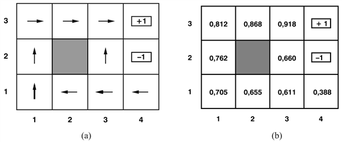
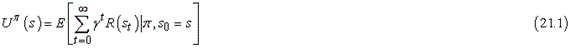
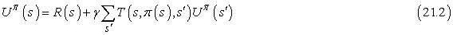
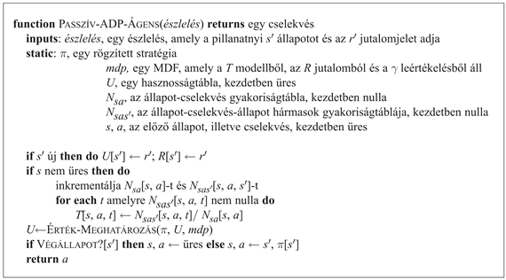
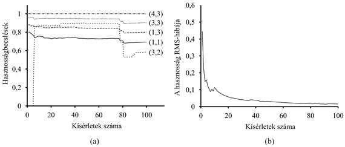
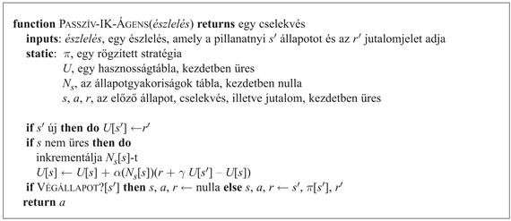
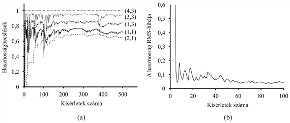
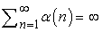
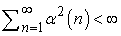

<?xml version="1.0" encoding="UTF-8" standalone="no"?>
<!DOCTYPE html PUBLIC "-//W3C//DTD XHTML 1.1//EN" "http://www.w3.org/TR/xhtml11/DTD/xhtml11.dtd">
<html xmlns="http://www.w3.org/1999/xhtml"><head><meta name="generator" content="DocBook XSL Stylesheets V1.76.1"/></head><body>

<h1 class="title"><a id="id751804"/>Passzív megerősítéses tanulás</h1>

<a id="ID_875_oldal"/>
Az egyszerűség kedvéért egy ismert, teljes mértékben hozzáférhető környezet állapot-reprezentációját használó passzív ágens esetét tárgyaljuk először. Passzív tanulás esetén az ágens <em>π</em> stratégiája rögzített, az <em>s</em> állapotban mindig a <em>π</em>(<em>s</em>) cselekvést hajtja végre. A cél egyszerűen a stratégia jóságának – tehát az <em>Uπ</em> (<em>s</em>) hasznosságfüggvénynek – a megtanulása. Példaként a 17. fejezetben bevezetett 4 × 3-as világot fogjuk használni. A 21.1. ábra mutatja ezt a világot, és a megfelelő hasznosságokat. Nyilvánvaló, hogy a passzív tanulás hasonló a <strong>stratégiakiértékelés</strong>i (<strong>policy evaluation</strong>) feladathoz, amely része a 17.3. alfejezetben ismertetett <strong>stratégiaiteráció</strong>s (<strong>policy iteration</strong>) algoritmusnak. A legfontosabb különbség, hogy a passzív ágens nem ismeri az <strong>állapotátmenet-modell</strong>t (<strong>transition model</strong>), a <em>T</em>(<em>s</em>, <em>a</em>, <em>s'</em>)-t, amely annak a valószínűséget adja meg, hogy az <em>a</em> cselekvés hatására az <em>s</em> állapotból az <em>s'</em> állapotba jutunk, továbbá nem ismeri a <strong>jutalomfüggvény</strong>t (<strong>reward function</strong>), <em>R</em>(<em>s</em>)-et, amely minden állapothoz megadja az ott elnyerhető jutalmat.

<a id="id751912"/>
<strong>21.1. ábra - (a) A 4 × 3-as világban alkalmazott <em>π</em> stratégia. Ez optimális stratégia, ha nem alkalmazunk leértékelést, és minden állapotban, amely nem végállapot, <em>R</em>(<em>s</em>)= −0,04. (b) A 4 × 3-as világ állapotainak hasznossága a <em>π</em> stratégia esetén.</strong>

Az ágens – <em>π</em> stratégiája felhasználásával – egy sor <strong>kísérlet</strong>et (<strong>trial</strong>) végez. Minden egyes kísérletben az (1,1) állapotból indul, és az állapotátmenetek valamilyen sorozatát észleli, amíg el nem érkezik a (4,2), illetve a (4,3) végállapotok valamelyikébe. Észlelései alapján információt kap mind az aktuális állapotról, mind az ott nyert jutalomról. Például így nézhetnek ki a tipikus kísérletek:

<code class="code">(1,1)–0,04→(1,2)–0,04→(1,3)–0,04→(1,2)–0,04→(1,3)–0,04→(2,3)–0,04→(3,3)–0,04→(4,3)+1</code>

<code class="code">(1,1)–0,04→(1,2)–0,04→(1,3)–0,04→(2,3)–0,04→(3,3)–0,04→(3,2)–0,04→(3,3)–0,04→(4,3)+<em>1</em></code>

<code class="code">(1,1)–0,04→(2,1)–0,04→(3,1)–0,04→(3,2)–0,04→(4,2)–1</code>

Vegyük észre, hogy mindegyik állapotészlelés mellett – alsó indexként – feltüntettük az elnyert jutalmat. Célunk a jutalmakban rejlő információ felhasználása arra, hogy az egyes <em>s</em> állapotokhoz – amelyek nem végállapotok – rendelhető várható hasznosságot, <em>Uπ</em> (<em>s</em>)-t megtanuljuk. A hasznosságot úgy definiáljuk, mint a <em>π</em> stratégia követése esetén az összegzett (leértékelt) jutalom várható értéke. Ez – ahogy a (17.3) egyenletben a <a class="xref" href="ch17.md#ID_713_oldal">„Optimalitás szekvenciális döntési problémákban”</a> részben – már felírtuk:

Mindegyik összefüggésünkben figyelembe veszünk egy <em>γ</em> <strong>leértékelési tényező</strong>t (<strong>discount factor</strong>), de a 4 × 3 világban <em>γ </em>=<em> </em>1-et használunk.

<h2 class="title"><a id="id752098"/>Közvetlen hasznosságbecslés</h2>

Widrow és Hoff az <strong>adaptív szabályozáselmélet</strong>tel (<strong>adaptive control theory</strong>) foglalkozva egy egyszerű módszert fedeztek fel a <strong>közvetlen hasznosságbecslés</strong>re (<strong>direct utility estimation</strong>) (Widrow és Hoff, 1960). Az ötlet a következő: az állapot hasznossága nem más, mint az adott állapotból kiindulva az összegzett jutalom várható értéke, és minden egyes kísérlet ennek az értéknek egy <em>mintájával szolgál</em> minden bejárt állapotra. Például az előzőkben bemutatott háromelemű tipikus kísérlethalmaz első kísérlete egy 0,72 értékű összegzett jutalommintát ad az (1,1) állapotra, két – 0,76 és 0,84 értékű – mintát az (1,2) állapotra, továbbá két – 0,80 és 0,88 értékű – mintát az (1,3) állapotra és így tovább. Ennek megfelelően az algoritmus mindegyik kísérleti lépéssorozat végén kiszámítja az összes állapotra a megfigyelt hátralevő jutalmat, és ez alapján frissíti az állapot hasznosságát, egyszerűen minden egyes állapotra mozgóablak átlagolást végezve, és az eredményt egy táblában tárolva. Ha a kísérletek száma a végtelenhez tart, a minták átlaga a (21.1) egyenlettel megadott valódi várható értékhez fog tartani.

Nyilvánvaló, hogy a közvetlen hasznosságbecslés nem más, mint egy példánya a felügyelt tanításnak. A tanító példapárok bemeneti része az állapot, kimeneti része pedig a megfigyelt hátralevő jutalom. Tehát a megerősítéses tanulást standard induktív tanulási problémára redukáltuk, a 18. fejezetben tárgyaltaknak megfelelően. A 21.4. alfejezetben áttekintjük a hasznosságfüggvények hatékonyabb reprezentálására szolgáló eszközök használatát, például a neurális hálókét. Ezeknek a reprezentációknak a használata esetén a tanulási technika közvetlenül a megfigyelt adatokra alkalmazható.

<h3 class="title">Fontos</h3>
A közvetlen hasznosságbecsléssel sikerült a megerősítéses tanulást standard induktív tanulási problémára redukálnunk, amelyről már nagyon sok mindent tudunk. Sajnálatos módon egy nagyon fontos információforrás hiányzik, nevezetesen az, hogy az állapotok hasznossága nem független egymástól! <em>Minden egyes állapot hasznossága egyenlő az ebben az állapotban elnyerhető jutalom és az őt követő állapotok várható hasznosságának összegével.</em> Tehát a hasznosságértékek kielégítik a rögzített stratégiára vonatkozó Bellman-egyenletet (lásd még (17.10) egyenlet):

Azzal, hogy figyelmen kívül hagyja az állapotok közötti összefüggéseket, a közvetlen hasznosság becslése eljátssza a tanulás lehetőségeit. Például a bemutatott három kísérlet közül a második érinti a (3,2) állapotot, amelyet előzőleg az ágens nem érintett még. A következő átmenet után (3,3)-ba jut, amely az első kísérlet alapján nagy hasznosságot mutat. A Bellman-összefüggés azonnal rámutat, hogy valószínűleg akkor a (3,2)-nek is nagy a hasznossága, mivel a (3,3)-ba vezet, de a közvetlen hasznosságbecslés semmit se tanul meg ebből a kísérlet végéig. Általánosabban megfogalmazva azt mondhatjuk, hogy a közvetlen hasznosságbecslésre úgy tekinthetünk, mint ami jóval nagyobb <em>U</em> hipotézistérben keres, mint amire szükség van. Ennek oka, hogy számos olyan függvényt is számon tart a hipotézisek közt, amelyek sértik a Bellman-egyenletet. Emiatt az algoritmus gyakran csak nagyon lassan konvergál.

<h2 class="title"><a id="id752154"/>Adaptív dinamikus programozás</h2>

Ahhoz, hogy használhassuk az állapotok közti kényszerekben rejlő információt, az ágensnek meg kell tanulnia, hogy az állapotok között milyen kapcsolatok állnak fenn. Egy <strong>adaptív dinamikus programozás</strong> (<strong>ADP</strong>) (<strong>adaptive dynamic programming</strong>, <strong>ADP</strong>) alapú ágens működésének lényege, hogy menet közben megtanulja a környezet állapotátmenet-modelljét, és dinamikus programozási módszerrel megoldja a hozzá kapcsolható Markov döntési folyamatot. Egy passzív tanuló ágens számára ez azt jelenti, hogy a megtanult <em>T</em>(<em>s</em>, <em>π</em>(<em>s</em>), <em>s'</em>) állapotátmenet-modellt és a megfigyelt <em>R</em>(<em>s</em>) jutalmakat behelyettesíti a (21.2) Bellman-egyenletbe, majd kiszámítja az állapotok hasznosságát. Mint a 17. fejezetben a stratégiaiterációnál rámutattunk, ezek az egyenletek lineárisak (nincs maximalizálási lépés), így bármely lineáris algebrai programcsomaggal megoldhatók. Egy másik alternatíva, ha a <strong>módosított eljárásmód-iteráció</strong>t (<strong>modified policy iteration</strong>) választjuk (lásd <a class="xref" href="ch17s03.md#ID_720_oldal">„Eljárásmód-iteráció”</a> részben), egy egyszerűsített értékiterációs eljárást használva arra, hogy a tanult modell minden változása után frissítsük a hasznosságbecslés eredményét. Mivel a modell legtöbbször csak keveset változik az egyes megfigyelések után, az értékiterációs algoritmus kiinduló értékként felhasználhatja az előző hasznosságbecslést, és egész gyorsan konvergálhat.

Magának a modellnek egyszerű a megtanulása, mivel a környezet teljesen megfigyelhető. Ennek megfelelően egy ellenőrzött tanítási feladatunk van, amelyben a bemenet az állapot-cselekvés pár, a kimenet pedig a következő állapot. A legegyszerűbb esetben az állapotátmenet-modellt valószínűségek táblázatával reprezentálhatjuk. Számon tartjuk, hogy a cselekvések egyes eredményei milyen gyakran lépnek fel, és abból a gyakoriságból becsüljük a<em> T</em>(<em>s</em>, <em>a</em>, <em>s'</em>) állapotátmenet valószínűségét, hogy hányszor következett <em>s'</em>, amikor az <em>s</em> állapotban az <em>a</em> cselekvést választottuk.[<a id="id752249" href="#ftn.id752249" class="footnote">212</a>] Például ha a <a class="xref" href="ch21s02.md#ID_875_oldal">„Passzív megerősítéses tanulás”</a> rész három útvonalában a <em>Jobbra</em> cselekvést háromszor választottuk az (1,3) állapotban, és a háromból kétszer a (2, 3) lett a következő állapot, akkor <em>T</em>((1, 3), <em>Jobbra</em>, (2, 3)) becsült értéke 2/3 lesz.

A passzív ADP-ágens teljes programja a 21.2. ábrán látható. A 21.3. ábra mutatja a 4 × 3-as világon elért teljesítményét. Az értékbecsléseinek javulási sebessége szempontjából az ADP-ágens a lehetőségekhez képest a legjobban működik, ahogy csak az állapotátmenet-modell tanulási képességének megfelelően haladni tud. Ebben az értelemben más megerősítéses tanulási algoritmusok mérésének standardjaként szolgálhat. Ugyanakkor nagy állapotterek esetén némiképp kezelhetetlenné válhat. Például az ostáblajátékban nagyjából 1050 egyenletet kell megoldania 1050 ismeretlenre nézve.

<a id="id752282"/>
<strong>21.2. ábra - Egy adaptív lineáris programozás alapon tanuló passzív megerősítéses ágens. A kód egyszerűsítése érdekében feltettük, hogy minden egyes észlelés szétbontható egy észlelt állapotra és egy jutalomjelre.</strong>

<a id="id752291"/>
<strong>21.3. ábra - A passzív ADP-tanuló tanulási görbéi a 4 × 3-as világ tanulása során, a 21.1. ábrán látható optimális stratégia használata esetén. (a) Az állapotok egy kiválasztott részhalmazára kiszámított hasznosságbecslések a kísérletek számának függvényében. Figyeljük meg a 78-adik kísérlet környékén a jelentős változásokat – ez az első eset, amikor az ágens a (4,2) végállapotba jut, melyben –1 jutalmat kap. (b) Az <em>U</em>(1,1) hibájának RMS-értéke 20 – egyenként 100 kísérletből álló – futásra átlagolva.</strong>

<h2 class="title"><a id="id752304"/>Az időbeli különbség tanulása</h2>

<h3 class="title">Fontos</h3>
Lehetőségünk van a két világ (szinte) legjobb vonásait egyesíteni: közelíthetjük az állapotok közti kényszereket leíró egyenleteket anélkül, hogy megoldanánk az összes lehetséges állapotra. <em>Az alapötlet a következő: használjuk fel a megfigyelt állapotátmeneteket a megfigyelt állapotok olyan módosítására, hogy azok megfeleljenek a korlátozó egyenleteknek.</em> Vegyük például az (1,3)-ból (2,3)-ba való átmenetet a <a class="xref" href="ch21s02.md#ID_875_oldal">„Passzív megerősítéses tanulás”</a> második kísérletében. Tegyük fel, hogy az első kísérlet eredményeként a hasznosságuk becsült értéke <em>Uπ</em>(1,3) = 0,84 és <em>Uπ</em>(2,3) = 0,92. Ha ez az átmenet mindig előáll, akkor azt várjuk, hogy a hasznosságoknak meg kell felelniük a következő kényszernek:

<code class="code"><em>Uπ </em>(1,3) = −0,04 + <em>Uπ </em>(2,3)</code>

így <em>Uπ</em>(1,3) eszerint 0,88 lenne. Tehát a jelenlegi becsült érték (0,84) egy kicsit alacsonyabb a kívánatosnál, növelni kellene. Általánosabban megfogalmazva, ha egy <em>s</em>-ből <em>s'</em>-be történő átmenet lép fel, akkor a következő módon frissítjük az <em>Uπ</em> (<em>s</em>) hasznosságot:

<code class="code"><em>Uπ</em>(<em>s</em>) ← <em>Uπ</em>(<em>s</em>) + <em>α</em>(<em>R</em>(<em>s</em>) + <em>γUπ</em>(<em>s'</em>)<em> </em>−<em> Uπ</em>(<em>s</em>))				(21.3)</code>

Ebben az egyenletben <em>α</em> az úgynevezett <strong>bátorsági faktor</strong> (<strong>learning rate</strong>). Mivel ez az egyenlet a hasznosságok egymást követő állapotokhoz tartozó értékeit használja, ezért gyakran <strong>időbeli különbs</strong><strong>ég</strong> vagy <strong>IK</strong>- (<strong>temporal-difference</strong>, <strong>TD</strong>) egyenletnek nevezik.

<h3 class="title">Fontos</h3>
Az időbeli különbségen alapuló módszerek alapötlete az, hogy először határozzuk meg azokat a feltételeket, amelyek korrekt becslési értékek esetén lokálisan fennállnak, majd állítsunk fel egy olyan értékfrissítésre szolgáló egyenletet, amely ezen ideális „egyensúlyi” egyenlet irányába viszi a becsléseket. Passzív tanulás esetén az egyensúlyi egyenletet a (21.2) szolgáltatja. A (21.3) egyenlet ténylegesen a (21.2) által megadott egyensúlyi helyzetbe viszi az ágenst, bár van némi finom trükk a dologban. Először vegyük észre, hogy a frissítés csak a megfigyelt következő állapotot, <em>s'</em> -t veszi figyelembe, míg a tényleges egyensúlyi feltétel az összes lehetséges következő állapotot. Azt hihetnénk, hogy ez túlzottan megváltoztatja <em>Uπ</em>(<em>s</em>)-t, amikor egy ritka átmenet következik be. Valójában viszont ritka átmenetek ritkán következnek be, ezért az <em>Uπ</em>(<em>s</em>) <em>átlagos értéke</em> a helyes értékhez fog konvergálni. Továbbá, ha <em>α</em>-t megváltoztatjuk úgy, hogy ne egy rögzített paraméter legyen, hanem egy függvény, amely aszerint csökken, ahogy egy állapotnak a kísérletekben történő előfordulása nő, akkor maga az <em>U</em>(<em>s</em>) is a helyes értékhez fog tartani.[<a id="id752510" href="#ftn.id752510" class="footnote">213</a>] Ez a 21.4. ábrán látható ágensprogramhoz vezet. A 21.5. ábra bemutatja a passzív IK-ágens által a 4 × 3 világban mutatott teljesítményt. Ugyan nem tanul olyan gyorsan, mint az ADP-ágens, és nagyobb változékonyságot mutat, de sokkal kevesebb számítást igényel megfigyelésenként. Vegyük észre, hogy az IK <em>nem igényel modellt a frissítés elvégzéséhez</em>. A környezet szolgáltatja a szomszédos állapotok közti kapcsolatokat, a megfigyelt átmenetek formájában.

<a id="id752559"/>
<strong>21.4. ábra - Egy időbeli különbség alapon hasznosságot tanuló passzív megerősítéses ágens</strong>

<a id="id752568"/>
<strong>21.5. ábra - Az IK-tanulás 4 × 3-as világon mért tanulási görbéi. (a) Néhány kiválasztott állapot hasznosságbecslése a kísérletszám függvényében. (b) Az <em>U</em>(1,1) becslésének RMS-hibája, amelyet 20 futás átlagából számoltunk, mindegyik futás 500 kísérletet tartalmazott. Csak az első 100 kísérletből származó eredményt rajzoltuk fel, hogy a görbe a 21.3. ábrával összehasonlítható legyen.</strong>

Az ADP- és IK-megközelítés valójában szoros rokonságban van. Mindkettő lokális változtatásokat végez a hasznosságbecslésben annak érdekében, hogy minden egyes állapot „megfeleljen” a rákövetkezőknek. Ugyanakkor van egy különbség. Az IK úgy módosítja az állapotot, hogy az megfeleljen a <em>megfigyelt</em> rákövetkező állapotnak ((21.3) egyenlet). Az ADP viszont úgy módosítja az aktuális állapotot, hogy az <em>összes</em> lehetséges következő állapotnak megfeleljen, de ezeket az állapotokat a valószínűségükkel súlyozza (21.2) egyenlet). Ez a különbség eltűnik, amikor az IK-módosítást nagyszámú átmenetre átlagoljuk, mivel az állapothalmaz következő állapotainak gyakorisága nagyjából arányos a valószínűségükkel. Egy, az előzőnél fontosabb különbség, hogy míg az IK minden megfigyelt állapotátmenet után egyetlen módosítást végez, addig az ADP annyit, amennyi csak szükséges ahhoz, hogy helyreállítsa az <em>U</em> hasznosságbecslések és a <em>T</em> környezetmodell közti konzisztenciát. Bár a megfigyelt állapotátmenet csak lokálisan változtatja meg <em>T</em>-t, de szükség lehet arra, hogy ezt végigterjesszük <em>U</em>-n. Ennek megfelelően úgy vehetjük, hogy az IK egy durva, de hatékony közelítése az ADP-módszernek.

Mindegyik, az ADP által elvégzett módosítás az IK szempontjából úgy is tekinthető, mint az aktuális környezeti modell szimulációja segítségével generált „pszeudokísérlet” eredménye. Kiterjeszthetjük az IK-megközelítést úgy, hogy a környezeti modell segítségével számos pszeudokísérletet generáljon – létrehozva olyan átmeneteket, amelyekről az aktuális környezet modellje alapján az IK-ágens el tudja képzelni, hogy <em>megtörténhetnek</em>. Az IK-ágens akár nagyszámú képzelt átmenetet is generálhat minden megfigyelt átmenetre. Ennek eredményeképpen a hasznosság becslései egyre inkább az ADP becsléseihez közelítenek, természetesen a fizetendő ár a megnövekedett számítási idő lesz.

Hasonló módon az ADP-eljárás hatékonyabb változatait hozhatjuk létre közvetlenül approximálva az értékiteráció és stratégiaiteráció algoritmusait. Ne felejtsük, hogy a teljes értékiteráció kezelhetetlenné válhat, ha az állapottér nagy. Ugyanakkor a módosítási lépések közül számos csak nagyon parányi. Elfogadhatóan jó válaszok gyors generálásához vezető lehetséges megközelítés, ha megkötjük a megfigyelt átmenetek után elvégzett módosítások számát. Azt is megtehetjük, hogy valamilyen heurisztika segítségével rangsoroljuk a lehetséges módosításokat, és csak a legfontosabbakat végezzük el. A <strong>prior</strong><strong>itásos végigsöprés</strong> (<strong>prioritized sweeping</strong>) heurisztikája preferálja azon állapotok módosítását, amelyek <em>valószínű</em> követő állapotainak hasznosságában éppen most <em>nagy</em> módosítás történt. Ehhez hasonló heurisztikák segítségével a közelítő ADP-algoritmusok rendszerint nagyjából ugyanolyan gyorsan képesek tanulni, mint a teljes ADP, ha pusztán a tanító szekvenciák számát nézzük. Viszont több nagyságrenddel hatékonyabbak lehetnek, ha a számítási igényt vizsgáljuk (lásd 21.3. feladat). Ezáltal lehetővé válik számukra olyan állapotterek vizsgálata is, amelyek messze túl nagyok a teljes ADP-nek. A közelítő ADP-algoritmusoknak további előnye, hogy egy új környezet tanulásának korai fázisában a <em>T</em> környezeti modell gyakran olyan távol van a helyestől, hogy nincs sok értelme egy azzal pontosan konzisztens hasznosságfüggvényt kiszámítani. A közelítő algoritmus használhat olyan minimális méretű módosítást, amely csökken annak mentén, ahogy a környezeti modell egyre pontosabbá válik. Ez elkerülhetővé teszi a nagyon hosszú értékiterációkat, amelyek a tanulás korai szakaszában azért lépnek fel, mert nagy változások történnek a modellben.

 

[<a id="ftn.id752249" href="#id752249" class="para">212</a>]  Ez – mint a 20. fejezetben is tárgyaltuk – a maximum-likelihood becslés. Egy Bayes-frissítés Dirichlet-priorral jobb is lehet.

[<a id="ftn.id752510" href="#id752510" class="para">213</a>]  Technikailag azt kívánjuk meg, hogy  és  fennálljon. Az <em>α</em> (<em>n</em>) = 1/<em>n</em> csökkenés megfelel ennek a feltételnek. A 21.5. ábrán <em>α</em>(<em>n</em>) = 60/(59 + <em>n</em>)-t használtuk.

</body></html>
