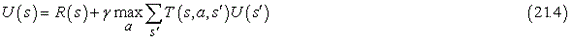
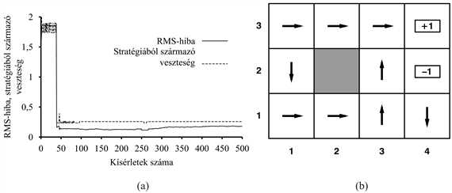
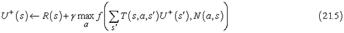
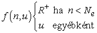
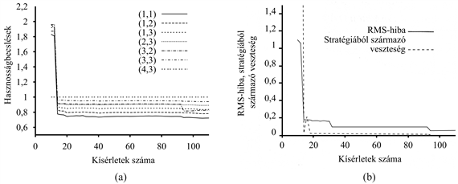
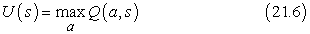
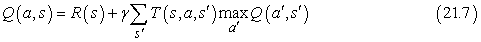
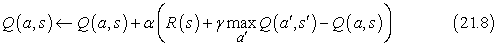
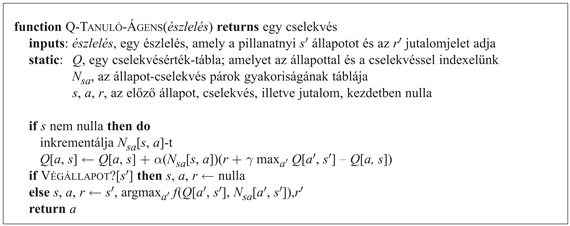

<?xml version="1.0" encoding="UTF-8" standalone="no"?>

<html xmlns="http://www.w3.org/1999/xhtml"><head><meta name="generator" content="DocBook XSL Stylesheets V1.76.1"/></head><body>

<h1 class="title"><a id="id752639"/>Aktív megerősítéses tanulás</h1>

A passzív tanuló ágensnek rögzített stratégiája van, ez határozza meg a viselkedését.
Az aktív ágensnek viszont el kell döntenie, hogy melyik cselekvést válassza. Vegyük először az adaptív dinamikus programozás alapján tanuló ágenst, és nézzük meg azt, hogyan kell módosítani, hogy ezt az új lehetőséget kezelni tudja.

Először is az ágensnek nem csupán egy rögzített stratégia modelljét kell megtanulnia, hanem egy teljes modellt, amibe az összes cselekvésének lehetséges eredményeihez tartozó valószínűségek is beletartoznak. Erre a <code class="code">PASSZÍV-ADP-ÁGENS</code> esetén alkalmazott egyszerű tanulási eljárás is kiválóan alkalmas. Ezek után figyelembe kell vennünk, hogy az ágens választhat a cselekvések között. A megtanulandó hasznosságok azok, amelyeket az <em>optimális</em> stratégia definiál. Ezek a hasznosságok megfelelnek a <a class="xref" href="ch17s02.md#ID_714_oldal">„Az állapotok hasznossága”</a> részben közölt Bellman-egyenletnek, amit itt megismétlünk:

A 17. fejezetben közölt értékiterációs vagy stratégiaiterációs algoritmusok segítségével ezek az egyenletek megoldhatók az <em>U</em> hasznosságfüggvényre nézve. A végső kérdés az, hogy mit csináljunk az egyes lépésekben. Az egyik lehetőség, hogy a megtanult modell alapján nyert optimális <em>U</em> hasznosságfüggvény alapján az ágens meghatároz egy egy lépésre előretekintő optimális cselekvést annak érdekében, hogy maximálja a várható hasznosságot. A másik lehetőség, hogy ha stratégiaiterációt használt, akkor az optimális stratégia már rendelkezésére áll, így „gondolkodás nélkül” csak végre kell hajtania az optimális stratégia által javasolt cselekvést. A kérdés az, hogy valóban végre kell-e hajtania?

<h2 class="title"><a id="id752676"/>Felfedezés</h2>

A 21.6. ábra bemutatja annak a kísérletsorozatnak az eredményét, amely során az ADP-ágens az egyes lépések során tanult optimális stratégia által javasolt cselekvést követi. Látható, hogy az ágens <em>nem tanulja meg</em> sem a helyes hasznosságértékeket, sem az igazi optimális stratégiát! Ehelyett a 39-edik kísérletnél megtalál egy stratégiát, amely a +1 jutalomhoz vezet az alsó – (2,1), (3,1), (3,2), (3,3) – úton (lásd 21.6. ábra). Ezek után kisebb változtatásokkal gyűjti a tapasztalatokat, és a 276-ik kísérlettől kezdve mereven ragaszkodik ehhez a stratégiához, így soha nem tanulja meg a többi állapot hasznosságát, és soha nem talál rá a valóban optimális útra a (1,2), (1,3), (2,3) állapotokon keresztül. Ezt <strong>mohó ágens</strong>nek (<strong>greedy agent</strong>) nevezzük. Ismételt kísérletek azt mutatták, hogy a mohó ágens ebben a környezetben <em>nagyon</em> <em>ritkán</em> találja meg az optimális stratégiát, és időnként borzalmas stratégiákhoz konvergál.

Hogyan történhet meg, hogy optimális cselekvéseket választva szuboptimális eredményhez jutunk? A válasz abban rejlik, hogy a megtanult modell nem azonos az igazi környezettel, tehát az, ami optimális a megtanult modellben, szuboptimális lehet az igazi környezetben. Sajnálatos módon az ágens nem tudja, hogy milyen a valódi környezet, így nem képes az igazi környezetre nézve optimális cselekvést meghatározni. Mit kell akkor tennünk?

<a id="id752705"/>
<strong>21.6. ábra - Annak a mohó ADP-ágensnek a felmutatott teljesítménye, amely végrehajtja a tanult modell alapján optimálisnak tűnő cselekvést. (a) A kilenc nem végállapot alapján számolt átlagos RMS-hiba. (b) Az a szuboptimális stratégia, amely felé ebben a kísérletsorozatban a mohó ágens konvergál.</strong>

Amit a mohó ágens nem vett figyelembe, az az, hogy a cselekvésnek több funkciója is van annál, mint hogy a jelenleg megtanult modell alapján jutalmat hozzon, ezenfelül hozzájárul az igazi modell megismeréséhez is a nyert észleléseken keresztül. A modell javítása viszont azt eredményezheti, hogy az ágens több jutalomhoz jut a jövőben.[<a id="id752717" href="#ftn.id752717" class="footnote">214</a>] Ennek megfelelően az ágensnek kompromisszumot kell kötnie a <strong>kihasználás</strong> (<strong>exploitation</strong>) – a jelenlegi hasznosságbecslésében tükrözött modell alapján történő jutalom maximalizálás – és a <strong>felfedezés</strong> (<strong>exploration</strong>) között, ez utóbbi a hosszú távú eredményességet szolgálja. Ha csupán a kihasználásra tör, akkor azt kockáztatja, hogy beragad valamilyen megszokott kerékvágásba. Ha pedig csak a felfedezéssel törődik, hogy tudását bővítse, de soha nem ülteti át a tudást a gyakorlatba – nem hoz semmilyen hasznot. A való életben állandóan döntenünk kell, hogy folytassuk-e kényelmes életünket, vagy vágjunk neki az ismeretlennek, hátha egy új és jobb életet fedezünk fel. Minél több mindent értünk, annál kevesebb felfedezésre van szükségünk.

Tudunk-e ennél kicsit precízebbek lenni? Van egyáltalán <em>optimális</em> felfedezési stratégia? Kiderült, hogy ezt a kérdést a statisztikus döntéselmélet egy részterülete az ún. <strong>rabló probléma</strong> (<strong>bandit problem</strong>) kapcsán nagy mélységben tárgyalta (lásd a bekeretezett részt).

Bár a rablók problémáját rendkívül nehéz pontosan megoldani úgy, hogy egy <em>optimális</em> felfedezési stratégiát nyerjünk, azonban készíthető egy <em>ésszerű</em> terv, ami végül az ágens optimális viselkedéséhez vezet. Minden ilyen eljárás a végtelen felfedezés határán lehet mohó (<strong>VFHM</strong>) (greedy in the limit of infinite exploration, <strong>GLIE</strong>). Egy VFHM-séma alapján működő ágensnek korlátlan számban ki kell próbálnia minden cselekvést az összes állapotban. Ezáltal kerüli el annak veszélyét, hogy egy szokatlanul rossz kimenetelű sorozat miatt véges (nem nulla) valószínűséggel nem talál meg egy optimális cselekvést. Egy ilyen terv alapján működő ADP-ágens végül megtanulja az igazi környezeti modellt. Egy VFHM-tervnek végül mohóvá kell válnia, így az ágens cselekvései optimálissá válnak a megtanult (azaz itt az igazi) modellre nézve.

<h3 class="title">Fontos</h3>
<strong>Rablók és felfedezés</strong>

Las Vegasban a <em>félkarú rabló</em> egy pénzbedobós játékautomata. A játékos bedob egy érmét, meghúzza a kart, és elveszi a nyereményt (ha nyer). Egy <strong><em>n </em>karú rabló</strong>nak (<strong><em>n</em>-armed bandit</strong>) <em>n</em> karja van. A játékosnak minden érme bedobásakor választania kell, hogy melyik kart húzza meg – azt, amelyik eddig a legjobban fizetett, vagy talán egy olyat, amelyet még nem próbált?

Az <em>n </em>karú rabló probléma a világ sok, létfontosságú területén számos valós feladat formális modelljeként szolgálhat, mint például az MI kutatás-fejlesztés éves költségvetésének kialakítása. Mindegyik kar egy cselekvésnek felel meg (mint például 400 millió forint elkülönítése MI-tankönyvek fejlesztésére), és a kar meghúzásával járó nyeremény a cselekvés választása esetén várható haszonnak felel meg (esetünkben óriási haszon várható). Az ismeretlen terület feltárása – akár egy új kutatásról, akár egy új üzletközpontról van szó – kockázatos, drága, bizonytalan haszonnal jár; másrészt ha egyáltalán nem kutatunk, akkor soha nem fogunk <em>semmilyen</em> értékes cselekvést felfedezni.

Ahhoz, hogy a rabló problémát megfelelően formalizáljuk, pontosan meg kell határoznunk, hogy mit értünk optimális viselkedésen. Az irodalomban található legtöbb definíció azt feltételezi, hogy a cél az ágens élettartama alatt elérhető összes jutalom várható értékének maximalizálása. Ezek a definíciók megkívánják, hogy várható értéket képezzünk egyrészt az összes lehetséges világ felett, amelybe csak kerülhet az ágens, másrészt bármelyik adott világ minden egyes lehetséges cselekvési szekvenciája fölött. Itt a „világot” a <em>T</em>(<em>s, a, s'</em>) állapotátmenet-modell definiálja. Tehát ahhoz, hogy az ágens optimálisan cselekedjék, szüksége van a lehetséges modellek a priori eloszlására. Ezen az úton rendszerint teljesen kezelhetetlen optimalizációs problémákhoz jutunk.

Néhány esetben azonban – például amikor az egyes gépek nyereményei függetlenek, és leértékelt jutalmakat használunk – minden egyes játékgépre kiszámítható az úgynevezett <strong>Gittins-index</strong> (Gittins, 1989). Az index csak annak függvénye, hogy hányszor választottuk a gépet, és eddig mennyit fizetett ki. Az index azt jelzi minden egyes gépre, hogy mennyire éri meg további pénzt bedobnunk, és a várható kifizetésen és az információ várható értékén alapul. A legnagyobb indexű gép választása az optimális felfedezési stratégia. Sajnálatos módon eddig még nem sikerült megtalálni annak a módját, hogy hogyan kell a Gittins-indexet szekvenciális döntési problémákra kiterjeszteni.

Az <em>n </em>karú rabló elmélet felhasználható arra, hogy bizonyítsuk a genetikus algoritmusok szelekciós stratégiájának ésszerűségét (lásd 4. fejezet). Tekintsünk az <em>n </em>karú rabló problémában minden egyes kart egy lehetséges génfüzérnek, továbbá a pénz bedobása ennél a karnál feleljen meg ezen gének reprodukciójának. Ebben az esetben a genetikus algoritmus optimálisan osztja szét a pénzt akkor, ha adott a függetlenségi feltételezések egy megfelelő halmaza.

Számos VFHM-séma ismert; az egyik legegyszerűbb, ha az ágens az idő 1/<em>t</em> részében véletlen cselekvést választ, egyébként pedig mohó stratégiát követ. Tény, hogy ez végül optimális stratégiához vezet, de időnként rendkívül lassan konvergál. Egy értelmesebb megközelítés, ha az ágens némi súlyt ad azoknak a cselekvéseknek, amelyeket nem használt még gyakran, miközben igyekszik elkerülni azokat, amelyeknek a hasznosságát kicsinek hiszi. Ezt meg tudjuk valósítani úgy, ha úgy módosítjuk a (21.4) kényszeregyenletet, hogy nagyobb hasznosságot tulajdonítson a relatíve kipróbálatlan állapot-cselekvés pároknak. Lényegében egy optimista priort hoz létre, az ágens kezdetben úgy viselkedik, mintha hatalmas jutalmak lennének szétszórva a helyszínen. Jelölje <em>U+</em>(<em>s</em>) az <em>s</em> állapot hasznosságának (tehát a hátralevő jutalom várható értékének) optimista becslését, <em>N</em>(<em>a</em>, <em>s</em>) pedig azt a számot, ahányszor az <em>s</em> állapotban az <em>a</em> cselekvést választottuk. Tegyük fel, hogy az ADP-tanulást végző ágens értékiterációt végez, ez esetben a frissítési egyenletet [(17.6) egyenlet] át kell írnunk úgy, hogy az az optimista becslést tartalmazza. A következő összefüggés ezt megvalósítja:

Itt <em>f </em>(<em>u</em>, <em>n</em>) az úgynevezett <strong>felfedezési függvény</strong> (<strong>exploration function</strong>). Ez határozza meg a mohóság (a magas <em>u</em> értékek preferenciája) és a kíváncsiság (az alacsony <em>n</em> értékek preferenciája – cselekvések, amelyeket még nem alkalmaztunk nagyon gyakran) közötti kompromisszumot. Az <em>f </em>(<em>u</em>, <em>n</em>) függvénynek <em>u</em>-ban növekvőnek, <em>n</em>-ben csökkenőnek kell lennie. Nyilvánvalóan sok lehetséges függvény megfelel ennek a feltételnek. Egy különösen egyszerű függvénydefiníció:

ahol <em>R</em>+ a tetszőleges állapotban kapható legnagyobb jutalom optimista becslése, míg <em>Ne</em> egy rögzített paraméter. Ennek alkalmazásával az ágens minden állapot-cselekvés párt legalább <em>Ne</em> alkalommal kipróbál.

Az, hogy a (21.5) egyenlet jobb oldalán nem <em>U</em>, hanem <em>U+</em> szerepel, nagyon fontos. Ahogy a felfedezés folyik, a startállapot környéki állapotok és cselekvések jó néhányszor kipróbálásra kerülhetnek. Ha <em>U</em>-t – a pesszimistább becslést – használtuk volna, akkor az ágens hamar elveszthetné a szabad területek felfedezése iránti vonzalmát.
Az <em>U+</em> szerepeltetése azt jelenti, hogy a felfedezéshez kapcsolt jutalom visszaterjed a felfedezetlen terület határáról. Így nem csupán a szokatlan cselekvéseket preferáljuk, hanem a felértékeljük azokat a cselekvéseket, amelyek a felfedezetlen területek <em>felé</em> fogják vinni az ágenst. Ennek a felfedezési stratégiának a hatása jól látható a 21.7. ábrán, gyors konvergenciát látunk az optimális teljesítményhez, ellentétben a mohó ágensnél látottakkal. Az optimálishoz nagyon közeli stratégiát talál mindössze 18 kísérlet után. Vegyük észre, hogy maguk a hasznosságérték-becslések nem konvergálnak ilyen gyorsan. Ennek az az oka, hogy az ágens meglehetősen hamar felhagy az állapottér jutalmat nem eredményező részeinek felfedezésével, oda már csak „véletlenszerűen” téved. Mindamellett teljesen ésszerű az ágens részéről, hogy nem sokat törődik azon állapotok hasznosságának pontos értékével, amelyekről tudja, hogy nemkívánatosak és elkerülhetők.

<a id="id754116"/>
<strong>21.7. ábra - A felfedező ADP-ágens teljesítménye, <em>R+ = </em>2 és <em>Ne = </em>5 esetén. (a) Néhány kiválasztott állapot hasznosságának becslése az idő függvényében. (b) A hasznosságértékek RMS-hibája, és az ehhez kapcsolható, a stratégiából származó veszteség.</strong>

<h2 class="title"><a id="id754140"/>Egy cselekvésérték-függvény tanulása</h2>

Most, hogy már van egy aktív ADP-ágensünk, nézzük meg, hogy mi módon tudunk egy aktív időbeli különbség tanuló ágenst létrehozni. A legszembetűnőbb eltérés a passzív esethez képest, hogy az ágensnek többé nem áll rendelkezésére egy rögzített stratégia, tehát ha megtanul valamilyen <em>U</em> hasznosságfüggvényt, akkor meg kell tanulnia egy modellt is, hogy egy <em>U</em>-n alapuló egylépéses előretekintő keretben cselekvést tudjon választani. A modellkialakítás problémája ugyanaz az IK-ágensnél, mint az ADP-ágensnél. Mi a helyzet magával az IK frissítési szabállyal? Talán meglepő, de a (21.3) IK frissítési szabály változatlan marad. Ez furcsának tűnhet a következő okból: tegyük fel, hogy az ágens olyan lépést választ, ami normál esetben jó célhoz vezet, de a környezet nemdeterminisztikus volta miatt az ágens valamilyen katasztrofális állapotban végzi. Az IK frissítési szabály ezt éppoly komolyan veszi, mintha ez a kimenetel a cselekvés normál következménye lenne, pedig csak egy pech volt, és nem kellene sokat aggódnia miatta. Valójában az ilyen valószínűtlen kimenetel csak ritkán fordul elő egy nagy tanítósorozat-halmazban, így reményeink szerint hosszú távon a valószínűségével arányosan kap súlyt a hatása. Ismét azt mondhatjuk, hogy az IK-ágens ugyanazokhoz az értékekhez fog tartani, mint az ADP-ágens, ahogy a tanítósorozatok száma tart a végtelenhez.

Van egy alternatív IK-módszer, amit <strong><em>Q</em>-tanulás</strong>nak (<strong><em>Q</em>-learning</strong>) hívunk, ez cselekvésérték-reprezentációt tanul, nem hasznosságot. <em>Q</em>(<em>a</em>, <em>s</em>)-sel fogjuk jelölni annak az értékét, ha az <em>s</em> állapotban az <em>a</em> cselekvést választjuk. A <em>Q</em>-értékek közvetlenül összekapcsolhatók a hasznosságértékekkel a következő összefüggés alapján:

<h3 class="title">Fontos</h3>
A <em>Q</em>-függvény úgy tűnhet, mintha csupán a hasznosságinformáció tárolásának egy eltérő módja lenne, de van egy nagyon fontos tulajdonsága: <em>egy Q-függvényt tanuló IK- ágensnek nincs szüksége sem a tanulás, sem a cselekvés kiválasztás modelljére.</em> Ezért a <em>Q</em>-tanulást <strong>modellmentes</strong> (<strong>model-free</strong>) módszernek is nevezik. Éppúgy, mint a hasznosságoknál, felírhatunk egy egyensúlyi egyenletet, amelyet a korrekt <em>Q</em>-értékeknek ki kell elégíteniük:

Az ADP-tanulást végző ágenssel azonos módon itt is felhasználhatjuk ezt az egyenletet egy iterációs eljárásban arra, hogy egy becsült modell alapján pontos <em>Q</em>-értékeket számoljunk. Ez viszont azt kívánná meg, hogy a modellt is megtanuljuk, hiszen az egyenlet használja a <em>T</em>(<em>s</em>, <em>a</em>, <em>s'</em>)-t. Másrészről viszont az IK-megközelítés nem igényel modellt. Így a <em>Q</em>-értékekre vonatkozó IK frissítési összefüggés:

amely mindig kiszámításra kerül, amikor az <em>s</em> állapotban az <em>a</em> cselekvést választottuk, amely az <em>s'</em> állapotba vitt.

A 21.8. ábra mutatja be az IK-módszert használó, felfedező <em>Q</em>-tanuló ágens teljes programját. Vegyük észre, hogy ugyanazt az <em>f</em> felfedezési függvényt használja, mint amit a felfedező ADP-ágens is használt – ezért van szükség a végrehajtott cselekvések gyakorisági statisztikáira (az <em>N</em> táblára). Ha egy egyszerűbb felfedezési stratégiát használnánk – mondjuk a lépések egy részében véletlenszerű működést iktatva be, ahol ez részarány az idővel csökken –, akkor mellőzhetnénk ezt a statisztikát.

A <em>Q</em>-tanuló ágens megtanulja a 4 × 3-as világra az optimális stratégiát, de ezt sokkal lassabban teszi, mint az ADP-ágens. Ennek oka, hogy az IK nem kényszerít modellje alapján konzisztenciát az értékekre. Ez az összehasonlítás felvet egy általános kérdést: mi a jobb: egy modellt és egy hasznosságfüggvényt tanulni, vagy egy cselekvésértékfüggvényt? Más szavakkal, mi a legjobb módja egy ágensfüggvény reprezentálásának? Ez a mesterséges intelligencia alapjait érintő kérdés. Mint az 1. fejezetben kijelentettük, az MI legnagyobb részében kulcsfontosságú történeti örökség a (gyakran ki nem mondott) ragaszkodás a <strong>tudásalapú</strong> (<strong>knowledge-based</strong>) megközelítéshez. Ez vezet ahhoz a feltevéshez, hogy az ágensfüggvény reprezentációjának legjobb módja, ha valamilyen szempontból az ágenst körülvevő környezet modelljét építjük meg.

<a id="id754311"/>
<strong>21.8. ábra - Egy felfedező <em>Q</em>-tanuló ágens. Egy aktív tanuló, amely megtanulja minden cselekvésnek minden egyes állapotban a <em>Q</em>(<em>a</em>, <em>s</em>) értékét. Ugyanazt az <em>f</em> felfedezési függvényt használja, amelyet a felfedező ADP-ágens is használt, de elkerüli az állapotátmenet-modell tanulását, mivel az állapot <em>Q</em>-értékét közvetlenül a szomszédos állapotok <em>Q</em>-értékeihez tudja kapcsolni.</strong>

Néhány kutató ugyanakkor – mind az MI-közösségen belül, mind azon kívül – azt állítja, hogy a modellmentes módszerek, mint például a <em>Q</em>-tanulás léte azt mutatja, hogy a tudásalapú megközelítés nem szükséges. Mindamellett nem sok egyéb van e kérdés eldöntésére, mint az intuíciónk. A mi intuíciónk szerint, ahogy a környezet komplexebbé válik, a tudásalapú megközelítés előnyei egyre nyilvánvalóbbá válnak. Ez még a játékokban – mint a sakk, a dámajáték és az ostáblajáték (lásd következő alfejezet) – is így jelentkezik, a modellalapú kiértékelő függvények tanulására fordított erőfeszítések több sikert hoztak, mint a <em>Q</em>-tanuló módszerek.

 

[<a id="ftn.id752717" href="#id752717" class="para">214</a>]  Vegyük észre a 16. fejezetben tárgyalt információérték-elmélettel fennálló közvetlen analógiát.

</body></html>
