<?xml version="1.0" encoding="UTF-8" standalone="no"?>
<!DOCTYPE html PUBLIC "-//W3C//DTD XHTML 1.1//EN" "http://www.w3.org/TR/xhtml11/DTD/xhtml11.dtd">
<html xmlns="http://www.w3.org/1999/xhtml"><head><meta name="generator" content="DocBook XSL Stylesheets V1.76.1"/></head><body>

<h1 class="title"><a id="id754357"/>A megerősítéses tanulás általánosító-képessége</h1>

Az eddigiekben azt feltételeztük, hogy az ágens által megtanult hasznosságfüggvények és a <em>Q</em>-függvények táblázatos formában reprezentáltak, amelyben minden egyes bemeneti vektornak egy-egy kimeneti érték felel meg. Ez a megközelítés kis állapotterekre jól működik, de a konvergencia ideje, valamint egy-egy iterációs lépés ideje (ADP esetén) gyorsan nő, ahogy a tér egyre nagyobb lesz. Alaposan kézben tartott közelítő ADP-módszerekkel kezelhető lehet 10 000 állapot vagy annál valamivel több. Ez kielégítő  a kétdimenziós útvesztő jellegű problémák esetén, de reálisabb problémák szóba sem jöhetnek. A sakk és az ostáblajáték a valós világ apró részei csupán, mégis állapotterük 1050–10120 állapotot tartalmaz. Az teljesen abszurd feltételezés, hogy mindezeket az állapotokat be kell járnunk ahhoz, hogy megtanuljuk a játékot!

Ezeknek a problémáknak egy lehetséges kezelési módja, ha <strong>függvényapproximáció</strong>t (<strong>function approximation</strong>) használunk, ami egyszerűen azt jelenti, hogy a leképezésnek bármilyen reprezentációját használhatjuk, kivéve a táblázatos reprezentációt. A reprezentációt közelítőnek tekintjük, mivel nem áll fenn biztosan, hogy az <em>igazi</em> hasznosságfüggvény vagy <em>Q</em>-függvény reprezentálható a választott formában. A 6. fejezetben például leírtunk egy sakkjátékban használható <strong>kiértékelő függvény</strong>t (<strong>evaluation function</strong>), amelyet <strong>tulajdonság</strong>ok (<strong>feature</strong>) (vagy <strong>bázisfüggvény</strong>ek (<strong>basis function</strong>)) <em>f</em>1,…,<em> fn</em> halmazának lineáris kombinációjával reprezentáltunk:

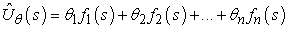

Megerősítéses tanulás során tanulhatjuk a <em>θ = θ</em>1,…, <em>θn</em> paramétereket úgy, hogy az az igazi hasznosságfüggvényt közelítse. Ahelyett, hogy mondjuk 10120 értéket tartanánk egy táblázatban, ez a függvényközelítés mondjuk <em>n</em> = 20 értékkel jellemezhető, ez <em>elképesztő</em> tömörítés! Bár senki sem ismeri a sakkjáték igazi hasznosságfüggvényét, azt senki se hiszi, hogy pontosan jellemezhető lenne 20 számmal. Mindamellett, ha az approximáció kielégítően jó, az ágens még mindig képes lehet kiválóan sakkozni.[<a id="id754470" href="#ftn.id754470" class="footnote">215</a>]

<h3 class="title">Fontos</h3>
A függvényapproximáció tulajdonságai lehetővé teszik, hogy praktikusan felhasználható legyen nagy állapotterek hasznosságfüggvényeinek reprezentálására, de nem ez az alapvető előnyük. <em>A függvényapproximátorokkal elért tömörítés lehetővé teszi a tanuló ágens számára az általánosítást azokról az állapotokról amelyeket bejárt, azokra az állapotokra, amelyeket nem járt be.</em> Azaz a függvényapproximáció legfontosabb aspektusa nem az, hogy kevesebb helyet igényel, hanem az, hogy lehetővé teszi az induktív általánosítást a bemeneti állapottérben. Hogy némi fogalmat alkothassunk ennek a hatásnak az erejéről: a lehetséges ostáblajáték állapotok közül csupán minden 1044-edik állapotnak a vizsgálata alapján megtanulható olyan hasznosságfüggvény, amely képessé tehet egy programot, hogy olyan jól játsszon, mint egy ember (Tesauro, 1992).

Az éremnek természetesen van másik oldala is: lehet, hogy a kiválasztott hipotézistérben egyáltalán nincs olyan függvény, amely kielégítően approximálná az igazi hasznosságfüggvényt. Mint az induktív tanulásnál minden esetben, itt is kompromisszum van a hipotézistér mérete és a függvény megtanulásához szükséges idő között. Egy nagyobb hipotézistér valószínűbbé teszi, hogy jó approximációt lehet találni, de azt is jelenti, hogy a konvergencia valószínűleg lassabb lesz.

Kezdjük a legegyszerűbb esettel, a közvetlen hasznosságbecsléssel (lásd 21.2. alfejezet). Függvényapproximáció esetén ez nem más, mint a <strong>felügyelt tanulás</strong> (<strong>supervised learning</strong>) egy esete. Tegyük fel például, hogy a 4 × 3 világ hasznosságértékeit egy egyszerű lineáris függvénnyel reprezentáljuk. A négyzetek jellemzői egyszerűen az <em>x</em> és <em>y</em> koordinátáik, tehát:

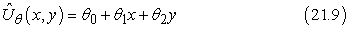

Tehát ha (<em>θ</em>0, <em>θ</em>1, <em>θ</em>2) = (0,5, 0,2, 0,1), akkor 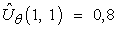. Adott kísérlethalmaz esetén egy sor értéket nyerünk az értékekre, és megtalálhatjuk a – mondjuk négyzetes értelemben – legjobb illesztést, standard lineáris regressziót használva (lásd 20. fejezet).

Megerősítéses tanulás esetén jobbnak tűnik <em>online</em> tanulást alkalmazni, amely minden egyes kísérlet után frissíti a paramétereket. Tegyük fel, hogy lefuttatunk egy kísérletet, és a teljes jutalom (1, 1)-ből indulva 0,4. Ez arra utal, hogy az 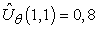 jelenlegi érték túl nagy, és csökkenteni kell. Hogyan kell a paramétereket módosítani, hogy ezt elérjük? Éppúgy, mint a neurális háló tanulásnál, egy hibafüggvényt írunk fel, és felírjuk a paraméterekre vonatkozó gradiensét. Ha <em>uj</em>(<em>s</em>) a <em>j</em>-edik kísérlet során az <em>s</em> állapotból kiindulva gyűjtött teljes megfigyelt jutalom, akkor a hibát a jósolt és a tényleges teljes jutalom négyzetének különbségeként (tulajdonképpen annak feleként) definiálják: 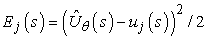. Az egyes <em>θi</em> paraméterek változásának hatására a hiba változásának sebességét a ∂<em>Ej/</em>∂<em>θi</em> adja meg. Így, ha a paramétert abban az irányba akarjuk változtatni, hogy a hibát csökkentse, akkor azt akarjuk, hogy:

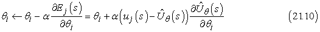

Ezt <strong>Widrow–Hoff-szabály</strong>nak (<strong>Widrow-Hoff rule</strong>) vagy <strong>delta-szabály</strong>nak (<strong>delta rule</strong>) nevezzük, és az online legkisebb négyzetes hibára vonatkozik. A (21.9) egyenletben felírt lineáris függvényapproximátorra a következő három egyszerű frissítési szabályt kapjuk:

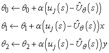

Alkalmazhatjuk ezeket a szabályokat arra az esetre, amikor <em>Uθ</em>(1,1) = 0,8 és <em>uj</em>(1, 1) = 0,4. Ekkor <em>θ</em>0, <em>θ</em>1 és <em>θ</em>2 mindegyike 0,4<em>α</em>-val csökken, ami mind csökkenti az (1, 1)-beli hibát. Vegyük észre, hogy a <em>θi-k változtatása az összes többi állapotra is megváltoztatja Uθ értékét!</em> Ezt értettük azon, amit mondtunk: a függvényapproximáció lehetővé teszi a megerősítéses tanulást végzőnek, hogy általánosítson a tapasztalataiból.

Azt várjuk, hogy az ágens gyorsabban fog tanulni, ha függvényapproximátort használ, feltéve, hogy a hipotézistér nem túl nagy, de van benne néhány olyan függvény, amely kielégítően illeszkedik az igazi hasznosságfüggvényre. A 21.7. feladatban azt várjuk az olvasótól, hogy értékelje a közvetlen hasznosságbecslést mind a függvényapproximáció felhasználásával, mind anélkül. A 4 × 3-as világban a javulás érzékelhető, de nem drámai, mivel nagyon kicsi az állapottér, amivel dolgozni kell. A javulás sokkal nagyobb a 10 × 10-es világban, ha +1 jutalom van a (10, 10) mezőn. Ez a világ jól illeszthető a lineáris hasznosságfüggvényhez, mivel az igazi hasznosságfüggvény sima és közel lineáris (lásd 21.10. feladat). Ha a jutalmat az (5, 5) mezőre tesszük, akkor az igazi hasznosságfüggvény piramis jellegű, és a (21.9) egyenletben felvett függvényapproximátor szánalmas kudarcot vall. Mindamellett nem veszett el minden! Emlékezzünk vissza, hogy a lineáris függvényapproximációnál az számít, hogy a függvény <em>paramétereiben</em> legyen lineáris – a használt tulajdonságok önmagukban az állapotváltozók tetszőleges nemlineáris függvényei lehetnek. Tehát használhatunk egy 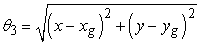 típusú tagot, amely a céltól való távolságot méri. 

Ugyanilyen jól alkalmazhatjuk ezeket az elveket az időbeli különbség alapján tanulókra is. Mindössze annyit kell tennünk, hogy a paramétereket úgy módosítjuk, hogy az egymásra következő állapotok időbeli különbségét csökkenteni próbáljuk. A (21.3) és (21.8) IK- és <em>Q</em>-tanulási egyenleteink új változata:

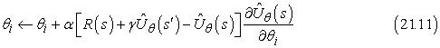

a hasznosságfüggvényre, és

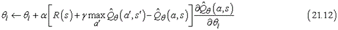

a <em>Q</em>-értékekre. Megmutatható, hogy ezek a frissítési szabályok a paramétereiben lineáris függvényapproximátor esetén az igazi függvény lehető legközelebbi[<a id="id754751" href="#ftn.id754751" class="footnote">216</a>] approximációjához konvergálnak. Szerencsétlen módon mindez nem áll meg, ha nemlineáris függvényeket használunk – mint amilyenek például a neurális hálók. Nagyon egyszerű példák találhatók, amelyeknél a paraméterek a végtelenhez tartanak, pedig jó megoldások találhatók a hipotézistérben. Vannak kifinomultabb algoritmusok, amelyek elkerülik ezeket a problémákat, de napjainkban a megerősítéses tanulás általános függvényeket használó függvényapproximátorral – megmaradt a magas művészet szintjén.

A függvényapproximáció a környezet modelljének tanulásában is nagyon hasznos lehet. Emlékezzünk rá, hogy egy <em>megfigyelhető</em> környezet modelljének tanulása <em>ellenőrzött</em> tanulási feladat, mivel a következő észlelés megadja a kívánt kimeneti állapotot. A 18. fejezetben ismertetett bármely ellenőrzött tanulási módszer használható, megfelelő módosításokkal. Ugyanis itt nem egy logikai változó vagy egyetlen valós érték predikciójáról van szó, hanem komplett állapotleírásokéról. Ha például az állapot <em>n</em> logikai változóval adható meg, akkor <em>n</em> logikai függvényt kell megtanulnunk, hogy az összes változót megjósolhassuk. Sokkal nehezebb a tanulási probléma <em>részlegesen megfigyelhető</em> környezet esetén. Ha tudjuk, hogy melyek a rejtett változók, és tudjuk, hogy milyen oksági viszonyban állnak egymással és a megfigyelhető változókkal, akkor a 20. fejezetben leírtak szerint rögzíthetünk egy megfelelő Bayes-hálóstruktúrát, és használhatjuk az EM-algoritmust a paraméterek tanulására. A rejtett változók bevezetése, illetve a modellstruktúra tanulása jelenleg megoldatlan problémák.

Nézzük most a megerősítéses tanulás komolyabb alkalmazásait. Látni fogjuk, hogy azokban az esetekben, amelyekben a hasznosságfüggvényt (és ezzel együtt a modellt) használjuk, ott feltételezzük, hogy a modell adott. Például az ostáblajáték kiértékelő függvényének tanulása során általában feltesszük, hogy a legális lépések és azok hatása előzetesen ismert.

<h2 class="title"><a id="id754778"/>Alkalmazások a játékok területén</h2>

A megerősítéses tanulás első fontos alkalmazása Arthur Samuel dámajáték programja volt (Samuel, 1959; 1967) – egyben ez volt a tanuló programok összes válfaja közt is az első jelentősebb. Samuel először egy legfeljebb 16 tagú súlyozott lineáris álláskiértékelő függvényt használt. A (21.11) egyenlet egy variánsát alkalmazta frissítési szabályként. Mindamellett volt néhány lényeges eltérés az ő programja és a jelenleg használt módszerek közt. Az első az, hogy ő a jelen állapot és a keresési fában végrehajtott teljes előretekintéses keresés által adott érték közti különbség alapján frissítette a súlyokat. Ez nagyon jól működik, mert ahhoz vezet, hogy az állapotteret különböző felbontással lássuk. A második különbség, hogy a programja <em>nem</em> használt semmilyen megfigyelt jutalmat! Tehát a végállapot értékét figyelmen kívül hagyta. Ez azt jelenti, hogy könynyen elképzelhető, hogy Samuel programja nem konvergál, vagy ha konvergál, akkor a nyerő helyett a vesztő stratégiához tart. Samuel ezt oly módon kerülte el, hogy ragaszkodott ahhoz, hogy az anyagi előnyhöz tartozó súly pozitív legyen. Érdekes módon ez elegendő volt ahhoz, hogy programját a súlyok terének olyan részébe irányítsa, amely jó dámajátékot eredményezett.

Gerry Tesauro TD-Gammon rendszere (Tesauro, 1992) jól mutatja a megerősítéses tanulási technikák erejét. Korábbi munkájában (Tesauro és Sejnowski, 1989) Tesauro megkísérelte a <em>Q</em>(<em>a</em>, <em>s</em>) függvény neurális reprezentációjának tanulását közvetlenül humán szakemberek által relatív értékekkel címkézett lépések alapján. Ez a megközelítés nagyon fárasztó volt a szakembereknek. Az eredményül kapott <code class="code">NEUROGAMMON</code> nevű program a számítógépes programok közt erős játékos volt ugyan, de nem volt versenyképes a humán szakemberekkel. A TD-Gammon projekt az önmagában való tanulás egy kísérlete volt. A TD-Gammon csupán az egyes játszmák végén adott egyetlen jutalomjelet. A kiértékelő függvény reprezentációját egy teljesen összekötött, egyetlen – 40 elemből álló – rejtett réteggel felépített neuronhálóval oldotta meg. A (21.11) egyenlet szimpla ismételt alkalmazásával a TD-Gammon lényegesen jobban megtanult játszani, mint a Neurogammon annak ellenére, hogy a bemeneti reprezentáció a számított tulajdonságok nélküli nyers táblaállás volt. Ez körülbelül 200 000 játékot és két hét számítógépes futást igényelt. Bár ez hatalmas mennyiségű játéknak tűnhet, de valójában az állapottérnek csak egy elhanyagolhatóan kis részét fedi le. Amikor a bemeneti reprezentációt számított tulajdonságokkal bővítették, akkor egy 80 rejtett rétegbeli elemmel felépített neurális háló 300 000 tanító játszma után képes volt olyan szinten játszani, mint a világ három legerősebb játékosa. Kit Woolsey, az egyik élvonalbeli játékos és szakíró azt nyilatkozta: „Kétségtelen, hogy a pozíciómegítélésben sokkal jobb nálam.”

<h2 class="title"><a id="id754805"/>Robotirányítási alkalmazások</h2>

A híres <strong>rúd-egyensúlyozás</strong>i (<strong>cart-pole</strong>) feladat, amelyet <strong>inverz ingá</strong>nak (<strong>inverted pendulum</strong>) is neveznek, a 21.9. ábrán látható. A feladat a kocsi <em>x</em> pozíciójának vezérlése úgy, hogy a rúd nagyjából fölfelé álljon (<em>θ</em> ≈ <em>π</em>/2), miközben a kocsi a pálya kijelölt határai között marad. A megerősítéses tanulás és a szabályozáselmélet területén több mint 2000 cikket publikáltak erről a látszólag egyszerű feladatról. A rúd-egyensúlyozási probléma annyiban különbözik az eddigiekben tárgyaltaktól, hogy az állapotváltozói 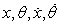 folytonosak. A cselekvés általában diszkrét: lökés jobbra vagy lökés balra, az úgynevezett <strong>bang-bang szabályozás</strong> (<strong>bang-bang control</strong>).

<a id="id754859"/>
<strong>21.9. ábra - A mozgó kocsi tetején álló hosszú rúd egyensúlyozásának vizsgálatára szolgáló berendezés. A kocsit az  állapotváltozókat megfigyelő szabályzó jobbra vagy balra lökheti.</strong>

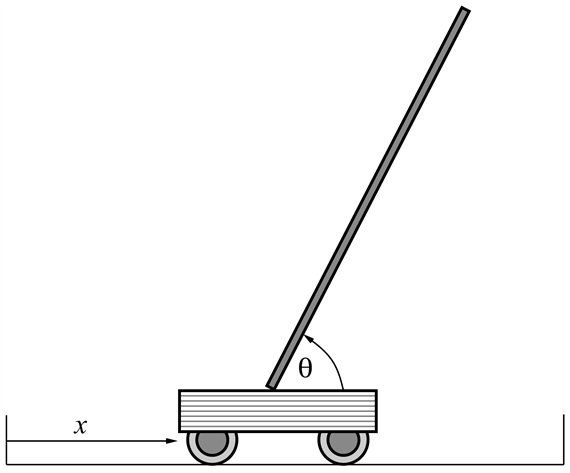

Az első – ezen probléma tanulását célzó – munkát Michie és Chambers végezte (Michie és Chambers, 1968). Az ő <code class="code">BOXES</code> nevű algoritmusuk mindössze 30 próbálkozás után képes volt a rudat több mint egy óráig egyensúlyban tartani. Ráadásul, sok későbbi rendszertől eltérően, a <code class="code">BOXES</code> egy valódi kocsit és rudat használt, nem szimulációt. Az algoritmus először is kvantálta, azaz tartományokra („dobozokra”) bontotta a négydimenziós állapotteret, innen jött az algoritmus neve is. Ezek után addig végeztek egy-egy kísérletet, amíg a rúd leesett vagy a kocsi elérte a pálya végét. Negatív megerősítést rendeltek az utolsó állapottér-tartományban az utolsó cselekvéshez, és ezt terjesztették vissza a megelőző szekvenciára. Azt találták, hogy a kvantálás akkor okoz bizonyos problémákat, ha a berendezést más pozícióból indították, mint amiket a tanítás során használtak, ami arra utal, hogy az általánosítás nem volt tökéletes. Jobb általánosítóképesség és gyorsabb tanulás érhető el, ha egy olyan algoritmust használunk, amely <em>adaptívan</em> osztja részekre az állapotteret, a jutalom megfigyelt változásainak megfelelően. Manapság egy <em>háromszoros</em> invertált inga egyensúlyozása közönséges feladatnak számít – ez már a legtöbb ember ügyességét messze meghaladja.

 

[<a id="ftn.id754470" href="#id754470" class="para">215</a>]  Tudjuk, hogy az igazi hasznosságfüggvény reprezentálható egy- vagy kétoldalnyi Lisp, Java vagy C++ kóddal. Azaz reprezentálható egy programmal, ami pontosan oldja meg a játékot, valahányszor meghívjuk. Mi csak olyan függvényapproximátorokban vagyunk érdekeltek, amelyek <em>ésszerű</em> számítási mennyiséget végeznek. Valójában jobb lehet, ha egy nagyon egyszerű függvényapproximátort tanulunk meg, és kombináljuk valamilyen lépésszámú előretekintő kereséssel. A szükséges kompromisszumok mindamellett egyelőre nem jól ismertek.

[<a id="ftn.id754751" href="#id754751" class="para">216</a>]  A hasznosságfüggvények közti távolság definíciója csak technikai kérdés, lásd (Tsitsiklis és Van Roy, 1997).

</body></html>
