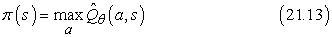
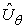
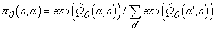
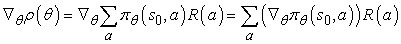
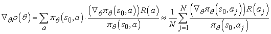
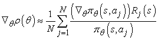
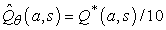

<?xml version="1.0" encoding="UTF-8" standalone="no"?>
<!DOCTYPE html PUBLIC "-//W3C//DTD XHTML 1.1//EN" "http://www.w3.org/TR/xhtml11/DTD/xhtml11.dtd">
<html xmlns="http://www.w3.org/1999/xhtml"><head><meta name="generator" content="DocBook XSL Stylesheets V1.76.1"/></head><body>

<h1 class="title"><a id="id754893"/>Stratégiakeresés</h1>

A megerősítéses tanulással kapcsolatos, utolsó általunk tárgyalt megközelítés <strong>stratégiakeresés</strong> (<strong>policy search</strong>) néven ismert. Bizonyos értelemben a stratégiakeresés a legegyszerűbb a fejezet összes módszere közt. Az alapötlet annyi, hogy engedjük változni a stratégiát, amíg javul, és utána állítsuk le a változást.

A vizsgálatot kezdjük magával a stratégiával. Emlékezzünk vissza, hogy a <em>π</em> stratégia egy olyan függvény, amely állapotokat képez le cselekvésekre. Mi elsősorban olyan <em>paraméterezet π</em> stratégiák vizsgálatában vagyunk érdekeltek, amelyeknek sokkal kevesebb paramétere van, mint ahány állapot található az állapottérben (éppúgy, mint az előző alfejezetben). Például paraméterezett <em>Q</em>-függvényekkel reprezentálhatjuk a <em>π</em> stratégiát, egy-egy <em>Q</em>-függvényt rendelve minden cselekvéshez, és azt a cselekvést választjuk, amely a legnagyobb jósolt értéket adja:

<h3 class="title">Fontos</h3>
Minden egyes <em>Q</em>-függvény lehet a <em>θ</em> paraméterek lineáris függvénye, mint a (21.9) egyenletben, vagy lehet nemlineáris függvény, mint például egy neurális háló. A stratégiakeresés ezek után a <em>θ</em> paramétereket változtatja oly módon, hogy javítsa a stratégiát. Vegyük észre, hogy ha a stratégiát <em>Q</em>-függvényekkel reprezentáljuk, akkor a stratégiakeresés egy <em>Q</em>-függvény tanulási eljárást eredményez. <em>Ez a folyamat azonban nem azonos a Q-tanulással!</em> A függvényapproximációt használó <em>Q</em>-tanulásban az algoritmus egy olyan <em>θ</em>-t keres, amelyre a  „közel” van <em>Q*</em>-hoz, az optimális <em>Q</em>-függvényhez. A stratégiakeresés ezzel szemben olyan <em>θ</em>-t keres, amely jó működést eredményez, az eredményül kapott értékek alapvetően eltérhetnek.[<a id="id754997" href="#ftn.id754997" class="footnote">217</a>] Egy másik nyilvánvaló példa a két dolog különbségére az az eset, amikor a <em>π</em>(<em>s</em>) stratégiát úgy számítjuk, hogy 10 lépés mélységben előretekintő keresést végzünk egy közelítő  hasznosságfüggvény alapján. A jó eredményt adó <em>θ</em> messze lehet attól, amely az -t az igazi hasznosságfüggvényhez hasonlóvá teszi.

A (21.13) egyenletben bemutatott stratégiareprezentáció egyik problémája, hogy diszkrét cselekvések esetén a stratégia a paraméterek <em>nemfolytonos</em> függvénye.[<a id="id755058" href="#ftn.id755058" class="footnote">218</a>] Azaz lesznek olyan <em>θ</em> értékek, amelyeknél végtelen kis változás a <em>θ</em>-ban azt eredményezi, hogy a stratégia egyik cselekvésről a másikra vált. Ez azt is jelenti, hogy a stratégia értéke is változhat nemfolytonos módon, ami nehézzé teszi a gradiensalapú eljárások alkalmazását. Emiatt a stratégiakeresési eljárások gyakran használják a <em>πθ</em>(<em>s, a</em>) <strong>sztochasz-tikus stratégia</strong> (<strong>stochastic policy</strong>) reprezentációt, amely az <em>s</em> állapotban az <em>a</em> cselekvés választásának valószínűségét specifikálja. Egy népszerű reprezentáció a <strong>szoftmax függvény</strong> (<strong>softmax function</strong>):

A szoftmax függvény közel determinisztikussá válik, ha az egyik cselekvés sokkal jobb, mint a többi, de mindig differenciálható <em>θ</em> szerint; így a stratégia értéke (amely folytonos módon függ a cselekvésválasztási valószínűségtől) differenciálható függvénye lesz <em>θ</em>-nak.

Nézzünk most módszereket a stratégia javítására. Kezdjük a legegyszerűbb esettel: determinisztikus stratégia, determinisztikus környezetben. Ebben az esetben a stratégia értékelése triviális: egyszerűen végrehajtjuk a stratégiát, és megfigyeljük az összegyűjtött jutalmat, ez adja számunkra a <strong>stratégia értéké</strong>t (<strong>policy value</strong>), <em>ρ</em>(<em>θ</em>)-t. A stratégia javítása ezek után egy standard optimalizációs probléma, ilyeneket a 4. fejezetben tárgyaltunk. Követhetjük a <strong>stratégiagradiens</strong> (<strong>policy gradient</strong>) vektort, ∇<em>θ ρ</em>(<em>θ</em>)-t, feltéve, hogy <em>ρ</em>(<em>θ</em>) differenciálható. Másik lehetőség, ha az <strong>empirikus gradiens</strong>t (<strong>empirical gradient</strong>) követjük hegymászó módszerrel – azaz kiértékeljük a stratégiát minden egyes paraméter kis megváltozása esetére. A szokásos feltételek esetén ez a stratégiatér egy lokális optimumához fog konvergálni.

Ha a környezet (vagy a stratégia) sztochasztikus, akkor a helyzet nehezebbé válik. Tegyük fel, hogy hegymászó módszert próbálunk alkalmazni, ami azt kívánja, hogy összehasonlítsuk <em>ρ</em>(<em>θ</em>)-t <em>ρ</em>(<em>θ </em>+<em> </em>Δ<em>θ</em>)-val valamilyen kis Δ<em>θ</em> esetén. Az a probléma, hogy a teljes jutalom nagyon nagyokat változhat kísérletről kísérletre, így a kisszámú kísérletből számított stratégiaérték nagyon megbízhatatlan lesz – két ilyen becslés összehasonlítása pedig még megbízhatatlanabb. Egy lehetséges megoldás, ha egyszerűen sok kísérletet futtatunk le, és a minta variancájával mérjük, hogy elegendő kísérletet futtattunk-e már ahhoz, hogy megbízhatóan jelezni tudjuk a <em>ρ</em>(<em>θ</em>) javításának irányát. Sajnálatos módon ez sok valós probléma esetén nem praktikus, mert az egyes kísérletek drágák, időigényesek és esetleg veszélyesek lehetnek.

A <em>πθ</em>(<em>s, a</em>) sztochasztikus stratégia esetén lehetőségünk van arra, hogy a <em>θ</em>-ban végrehajtott kísérletek eredményei alapján a ∇<em>θ  ρ</em>(<em>θ</em>) gradiens torzítatlan becslését állítsuk elő <em>θ</em>-ban. Az egyszerűség kedvéért a becslést arra az egyszerű esetre vezetjük le, amikor nem szekvenciális környezetben közvetlenül az <em>s</em>0 startállapotbeli cselekvés után megkapjuk a jutalmat. Ebben az esetben a stratégiaérték egyszerűen a jutalom várható értéke, tehát:

Most egy egyszerű trükköt alkalmazunk, hogy ezt az összegzést approximálni tudjuk a <em>πθ</em>(<em>s, a</em>) által meghatározott valószínűség-eloszlásból generált mintákkal. Tegyük fel, hogy összesen <em>N</em> kísérletünk van, és a <em>j</em>-edik kísérletben az <em>aj</em> cselekvést választottuk. Ekkor 

Tehát a stratégia igazi gradiensét egy szummával közelítettük, ahol a tagok az egyes kísérletek cselekvésválasztási valószínűségeinek gradiensét tartalmazzák. A szekvenciális esetre ez a következőképp általánosítható:

minden egyes bejárt <em>s</em> állapotra. Itt <em>aj </em>a<em> j</em>-edik kísérlet során az <em>s</em> állapotban választott cselekvés, és <em>Rj</em>(<em>s</em>) a <em>j</em>-edik kísérlet során az <em>s</em> állapotból kiindulva gyűjtött összes jutalom. Az eredményül kapott algoritmust <code class="code">REINFORCE</code>-nak nevezték el (Williams, 1992). Rendszerint sokkal hatékonyabb, mint a minden egyes <em>θ</em>-ban sok kísérletet használó hegymászó eljárás. Viszont sajnos még mindig sokkal lassabb annál, mint amire szükségünk lenne.

<h3 class="title">Fontos</h3>
Vizsgáljuk a következő feladatot: adott két blackjack[<a id="id755377" href="#ftn.id755377" class="footnote">219</a>] program, döntsük el, hogy melyik a jobb! Egyik lehetőség, ha egy közös „bank” ellen játszatjuk őket egy adott számú kártyaleosztásban, és megnézzük, hogy melyik nyert többet. Ezzel az a probléma – mint láttuk –, hogy mindegyik program nyereségei nagy fluktuációt fognak mutatni annak függvényében, hogy milyen lapokat kapott. Egy kézenfekvő megoldás erre, ha előre generálunk egy sor leosztást, egy <em>leosztáshalmazt</em>. Ezzel elkerüljük a különböző kártyaleosztások okozta mérési hibát. Ez a <code class="code">PEGASUS</code> algoritmus ötletének alapja (Ng és Jordan, 2000). Az algoritmus olyan területeken alkalmazható, ahol rendelkezésünkre áll egy szimulátor, ezáltal a „véletlen” kísérlet kimenetelek megismételhetővé válnak. Az algoritmus <em>N</em> véletlen számsorozatot generál előre, mindegyik felhasználható arra, hogy egy tetszőleges stratégia alapján kísérletet futtassunk vele. A stratégiakeresést úgy hajtjuk végre, hogy mindegyik stratégiajelöltet az alapján értékelünk, hogy <em>ugyanazt</em> a véletlen sorozat halmazt használja a kísérletek kimeneti értékeinek meghatározásához. Megmutatható, hogy az <em>összes</em> stratégia értékének jó becsléséhez szükséges véletlen sorozatok száma csak a stratégiatér komplexitásától függ, és egyáltalán nem függ a mögöttes terület komplexitásától. A <code class="code">PEGASUS</code> algoritmussal számos területen (például az autonóm helikoptervezetés területén) több hatékony stratégiát fejlesztettek ki (lásd 21.10. ábra).

<a id="id755406"/>
<strong>21.10. ábra - Időben eltolt képek egymásra másolása útján kapott eredő kép, amelyen egy nagyon bonyolult „körberepülés orral a kör középpontja fele” manővert hajtanak végre. A helikoptert egy Pegasus stratégiakereső algoritmussal fejlesztett stratégiával vezérlik. Egy szimulátormodellt fejlesztettek a valós helikopter egyes vezérlési beavatkozásokra adott válaszainak vizsgálatára. Ezek után egész éjszaka futtatták az algoritmust a szimulátoron. Egy sor vezérlőt fejlesztettek ki különböző manőverekre. Minden esetben, amikor távirányítást használtak, messze jobb volt az eredmény, mint a képzett humán pilótáké. (A képet Andrew Ng engedélyével közöljük.)</strong>

 

[<a id="ftn.id754997" href="#id754997" class="para">217</a>]  Triviális, hogy a  közelítő <em>Q</em>-függvény optimális teljesítményt ad, bár egyáltalán nincs közel <em>Q</em>*-hoz.

[<a id="ftn.id755058" href="#id755058" class="para">218</a>]  Folytonos cselekvési terekre a stratégia a paraméterek sima függvénye lehet.

[<a id="ftn.id755377" href="#id755377" class="para">219</a>]  21-es játékként is ismert.

</body></html>
