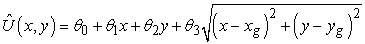

<?xml version="1.0" encoding="UTF-8" standalone="no"?>
<!DOCTYPE html PUBLIC "-//W3C//DTD XHTML 1.1//EN" "http://www.w3.org/TR/xhtml11/DTD/xhtml11.dtd">
<html xmlns="http://www.w3.org/1999/xhtml"><head><meta name="generator" content="DocBook XSL Stylesheets V1.76.1"/></head><body>

<h1 class="title"><a id="id755415"/>Összefoglalás</h1>

Ebben a fejezetben a megerősítéses tanulással foglalkoztunk: azzal, hogy egy ismeretlen környezetben működő ágens hogyan válhat gyakorlottá pusztán megfigyelései, valamint az esetenként kapott jutalmak felhasználásával. A megerősítéses tanulás a teljes MI-témakör mikrovilágának is tekinthető, amelyet azonban az előrehaladás érdekében egy sor egyszerűsítő feltétel mellett tárgyaltunk. A következő fontosabb megállapításokat tettük:

<ul class="itemizedlist"><li class="listitem">
Az ágens teljes felépítése határozza meg azt, hogy milyen információt kell megtanulni. A tárgyalt három fő felépítési lehetőség: egyrészt a modellalapú, amely a <em>T</em> modellt és az <em>U</em> hasznosságfüggvényt használja; másrészt a modell nélküli felépítés, amely a <em>Q</em> cselekvésérték-függvényt használja, és a reflexszerű, amely a <em>π</em> stratégiát használja.
</li><li class="listitem">
A hasznosságértékek háromféle megközelítés alapján tanulhatók:

<ol class="orderedlist"><li class="listitem">
A <strong>közvetlen hasznosságbecslés</strong> (<strong>direct utility estimation</strong>), amely a megfigyelt hátralévő jutalmat használja egy-egy állapot esetén, mint a hasznosság tanulásának közvetlen jellemzőjét.
</li><li class="listitem">
Az <strong>adaptív dinamikus programozás</strong> (<strong>ADP</strong>) (<strong>adaptive dynamic programming</strong>) megfigyelései alapján egy modellt és egy jutalomfüggvényt tanul, ezek után érték- vagy stratégiaiterációt használ ahhoz, hogy az állapotok hasznosságbecsléséhez vagy az optimális stratégiához eljusson. Az ADP optimálisan használja fel a környezetnek a szomszédos állapotokra vonatkozó struktúrájából adódó lokális kényszereket.
</li><li class="listitem">
Az <strong>időbeli különbség</strong> (<strong>IK</strong>) (<strong>temporal-difference</strong>, <strong>TD</strong>) megközelítés úgy módosítja a hasznosságbecsléseket, hogy megfeleljenek az adott állapotot követő állapotokra vonatkozó becsléseknek. Tekinthetjük egyszerűen az ADP megközelítés olyan approximációjának is, amely a tanuláshoz nem igényel modellt. Mindamellett, ha a megtanult modellt pszeudotapasztalatok generálására használjuk, gyorsabb tanuláshoz juthatunk.
</li></ol>
</li><li class="listitem">
A cselekvésérték-függvények vagy <em>Q</em>-függvények ADP- vagy IK-megközelítéssel tanulhatók. IK esetén a <em>Q</em>-tanulás sem a tanulás, sem a cselekvés kiválasztásának fázisában nem igényli modell használatát. Ez egyszerűsíti a tanulási feladatot, de potenciálisan korlátozhatja a bonyolult környezetben való tanulási képességet, mivel az ágens nem képes szimulálni a lehetséges cselekvéssorozatok eredményét.
</li><li class="listitem">
Ha a tanuló ágens a tanulás során a cselekvések kiválasztásáért is felelős, akkor kompromisszumot kell kötnie a választott cselekvés jelenlegi hasznossága és hasznos új információ tanulásának lehetősége között. A felfedezési probléma egzakt megoldása kezelhetetlen, de néhány egyszerű heurisztika elég jó megoldásra vezet.
</li><li class="listitem">
Nagy állapotterek esetén a megerősítéses tanuló algoritmusnak közelítőfüggvényreprezentációt kell használnia az állapotok feletti általánosítóképesség érdekében. Az időbeli különbség jel közvetlenül felhasználható a neurális háló jellegű reprezentációk paramétereinek frissítésére.
</li><li class="listitem">
A <strong>stratégiakeresés</strong>i módszerek közvetlenül a stratégia reprezentációját használják, a megfigyelt teljesítmény alapján próbálva meg javulást elérni. Súlyos problémát okoz sztochasztikus területeken a teljesítményben mutatkozó nagy variancia. Szimulációval vizsgálható területeken ez megoldható úgy, hogy előre rögzítjük a véletlen hatásokat.
</li></ul>

A vezérlési stratégiát biztosító program kézi kódolásának elkerülhetősége miatt a megerősítéses tanulás a gépi tanulás egyik legaktívabban művelt területe. A robotikai alkalmazások különösen értékesnek ígérkeznek, de ezek <em>folytonos,</em> <em>sokdimenziós,</em> csak <em>részlegesen megfigyelhető</em> környezetek kezelésére képes módszereket igényelnek, ráadásul a sikeres működéshez több ezer vagy akár millió elemi cselekvésre is szükség lehet.

<h2 class="title"><a id="id755547"/>Irodalmi és történeti megjegyzések</h2>

Turing javasolta a megerősítéses tanulás megközelítést, bár nem volt teljesen meggyőződve annak hatékonyságáról (Turing, 1948; 1950). Azt írta: „A büntetés és jutalmazás legjobb esetben is csak egy része lehet a tanítási folyamatnak.” Arthur Samuel munkája volt valószínűleg az első sikeres kutatás a gépi tanulás területén (Samuel, 1959). Bár munkája nem volt formálisan megfogalmazva, és számos hiányossága volt, mégis a megerősítéses tanulás legtöbb modern gondolatát tartalmazta, beleértve az időbeli különbségképzést és a függvényekkel történő approximációt. Körülbelül ugyanebben az időben az adaptív szabályozások területével foglalkozó kutatók (Widrow és Hoff, 1960), Hebb munkájára építve (Hebb, 1949), egyszerű hálókat tanítottak a delta-szabály segítségével. (A neurális hálók és a megerősítéses tanulás ezen korai kapcsolata vezethetett ahhoz a félreértéshez, hogy ez utóbbi az előbbinek részterülete.) Michie és Chambers rúdegyensúlyozás-vezérlési kutatása szintén egy függvényapproximációval történő megerősítéses tanulási módszernek tekinthető (Michie és Chambers, 1968). A megerősítéses tanulással foglalkozó pszichológiai irodalom sokkal régebbi, Hilgard és Bower jó áttekintést adnak erről (Hilgard és Bower, 1975). A méhek nektárgyűjtési szokásainak kutatása közvetlen bizonyítékokat szolgáltatott a megerősítéses tanulás működésére állatoknál. Nyilvánvaló neurális kapcsolat van a jutalomjellel. Ennek formája egy nagy neurális leképezés a nektár bevitelét érzékelő szenzoroktól a motoros kéregig (Montague és társai, 1995). A sejtszintű emlékezéssel kapcsolatban folytatott kutatások azt sugallják, hogy a főemlősök agyában a dopamin rendszer valami olyasmit valósít meg, ami a függvénytanulásra emlékeztet (Schultz és társai, 1997).

A megerősítéses tanulás és a Markov döntési folyamatok közti kapcsolatra először Werbos mutatott rá (Werbos, 1977), de a megerősítéses tanulás MI-n belüli fejlesztése a University of Massachusetts falain belül kezdődött az 1980-as évek elején (Barto és társai, 1981). Sutton írása jó történeti áttekintést ad (Sutton, 1988). Ennek a fejezetnek a (21.3) egyenlete egy speciális, a <em>λ = </em>0 melletti esete Sutton általános IK(<em>λ</em>) algoritmusának. Az IK(<em>λ</em>) egy sorozat összes állapotának értékét frissíti oly módon, hogy a múltban <em>t</em> időlépés távolságra lévő átmenetekhez egy <em>λ t </em>szerint csökkenő faktor vezet. Az IK(1) azonos a Widrow–Hoff- vagy delta-szabállyal. Bradtke és Barto érvelésére (Bradtke és Barto, 1996) építve Boyan azt állítja, hogy az IK(<em>λ</em>) és a hozzá kapcsolható algoritmusok nem használják ki hatékonyan a tapasztalatokat (Boyan, 2002). Szerinte ezek lényegében online regressziós algoritmusok, amelyek sokkal lassabban konvergálnak, mint az offline regresszió. Az ő LSTD(<em>λ</em>) algoritmusa egy olyan online regreszszió, ami az offline regresszióval azonos eredményt ad.

Az időbeli különbség tanulásnak és a szimulációs tapasztalatok modellbázisú generálásának kombinálását Sutton a <code class="code">DYNA</code> architektúrában javasolta (Sutton, 1990). A prioritásos végigsöprés ötletét egymástól függetlenül Moore és Atkeson (Moore és Atkeson, 1993), illetve Peng és Williams (Peng és Williams, 1993) vetették fel. A <em>Q</em>-tanulást Watkins dolgozta ki PhD-disszertációjában (Watkins, 1989).

A rabló problematikát, amely a nemszekvenciális döntések területén történő felfedezést modellezi, részletesen Berry és Fristedt tanulmányozták (Berry és Fristedt, 1985). Számos helyzetben optimális felfedezési stratégia nyerhető a <strong>Gittins-index</strong> segítségével (Gittins, 1989). Barto és munkatársai a szekvenciális döntési problémákban alkalmazott felfedezési módszerek számos változatát tárgyalják (Barto és társai, 1995). Kearns és Singh, valamint Brafman és Tennenholtz olyan algoritmusokat írnak le (Kearns és Singh, 1998; Brafman és Tennenholtz, 2000), amelyek ismeretlen környezet felfedezését végzik, és bizonyított, hogy polinomiális idő alatt konvergálnak közel-optimális stratégiákhoz.

A megerősítéses tanulás területén a függvényapproximáció alkalmazása Samuel munkájáig vezethető vissza, aki mind lineáris, mind nemlineáris kiértékelő függvényeket alkalmazott, továbbá a tulajdonságok terének csökkentésére tulajdonságszelekciós algoritmusokat is használt. A későbbiekben bevezetett módszerek közé tartozik a <strong>CM</strong><strong>AC</strong> (Cerebellar Model Articulation Controller) (Albus, 1975), amely lényegében átlapolódó lokális kernelfüggvények összegéből, és a Barto és társai által bevezetett asszociatív neurális hálókból áll (Barto és társai, 1983). Napjainkban a neurális hálók a legnépszerűbb függvényapproximátorok. A legismertebb alkalmazás az ebben a fejezetben bemutatott TD-Gammon (Tesauro, 1992, 1995). A neurális hálókkal megvalósított IK-tanulóknak súlyos problémája az, hogy hajlamosak elfelejteni korábbi tapasztalataikat. Ez különösen igaz azokra térrészekre, amelyeket a szakértelmük megszerzése után elkerülnek. Ez katasztrofális következményekkel járhat, ha helyzetek újra jelentkeznek. A <strong>példányalapú tanulás</strong> (<strong>instance-based learning</strong>) alkalmazásával ez a probléma elkerülhető (Ormoneit és Sen, 2002; Forbes, 2002).

A fügvényapproximációt használó megerősítéses tanulás konvergenciája kimondottan technikai kérdés. Lineáris approximáló függvények alkalmazása esetén az IK tanulási eredmények folyamatosan javulnak (Sutton, 1988; Dayan, 1992; Tsitsiklis és Van Roy, 1997), de nemlineáris függvények esetén számos divergenciát mutató példát találtak (a jelenség tárgyalását lásd a (Tsitsiklis és Van Roy, 1997)-ben). Papavassiliou és Russell a megerősítéses tanulás új formáját adták (Papavassiliou és Russell, 1999), amely tetszőleges struktúrájú függvényapproximátor esetén konvergál, feltéve, hogy található a megfigyelt adatokra egy legjobban illeszkedő approximáció. 

A stratégiakeresésre Williams hívta fel a figyelmet (Williams, 1992), ő volt az, aki kifejlesztette a <code class="code">REINFORCE</code> algoritmuscsaládot. A későbbi munkák megerősítették és általánosították a stratégiakeresés konvergenciájára vonatkozó eredményeket: (Marbach és Tsitsiklis, 1998; Sutton és társai, 2000; Baxter és Bartlett, 2000). Ng és Jordan (2000) alkották meg a <code class="code">PEGASUS</code> algoritmust (Ng és Jordan, 2000), bár hasonló technikák már Van Roy PhD-disszertációjában is megtalálhatók (Van Roy, 1998). Mint a fejezetben említettük, a <em>sztochasztikus</em> stratégiák teljesítménye a paramétereik folytonos függvénye, ami elősegíti a gradiensalapú technikák alkalmazhatóságát. Nem ez az egyetlen előnyük: Jaakkola és társai amellett érvelnek, hogy részlegesen megfigyelhető környezetben a sztochasztikus stratégiák jobban működnek, mint a determinisztikusok, ha mindkét stratégia esetén a cselekvés pusztán a jelenlegi észlelésen alapul (Jaakkola és társai, 1995). (Ennek egyik oka, hogy a sztochasztikus algoritmusok kevésbé hajlamosak „beragadni", ha valamilyen eddig még nem látott akadály jelentkezik.) A 17. fejezetben rámutattunk, hogy részlegesen megfigyelhető MDF-ekben az optimális stratégiák inkább a <em>hiedelemállapot</em> determinisztikus függvényei, mint az aktuális megfigyeléseké. Ennek megfelelően még jobb eredményeket várnánk, ha a 15. fejezetben tárgyalt <strong>szűrés</strong>i (<strong>filtering</strong>) módszerekkel nyomon követnénk a hiedelemállapot alakulását. Sajnálatos módon a hiedelemállapot-terek sokdimenziósak és folytonosak, és az eddigiekben nem sikerült hatékony módszereket kifejleszteni a hiedelemállapotok megerősítéses tanulására.

A valós környezetekre az is jellemző, hogy gyakran rengeteg elemi cselekvési lépésre van szükség ahhoz, hogy jelentős jutalomhoz jussunk. Például ha egy robot focizik, akkor százezer elemi lábmozdulatot is tehet, mielőtt gólt lő. Egy szokásos módszer erre a<strong> jutalomalakítás</strong> (<strong>reward shaping</strong>), melyet eredetileg az állatok tanításánál alkalmaztak. Ennek része, hogy további jutalmakat adunk az ágensnek, ha az „haladást ér el”. A foci esetén például jutalmat adhatunk, ha hozzáér a labdához vagy a kapu felé lő. Ezeket a jutalmakat rendszerint nagyon egyszerű kialakítani, és rendkívül felgyorsíthatják a tanulást, de megvan az a veszélye, hogy az ágens a tanulás során a „pszeudojutalmak” maximálását végzi el, nem az igazi jutalmakét. A foci tanulása esetén például a labdához való közelség és a labdával való sok-sok érintkezés, a „vibrálás”, lehet ennek az eredménye. Ng és társai megmutatták, hogy az ágens így is megtanulja az optimális stratégiát, ha az <em>F</em>(<em>s</em>, <em>a</em>, <em>s'</em>) pszeudojutalom kielégíti az <em>F</em>(<em>s</em>, <em>a</em>, <em>s'</em>) = <em>γ</em> <em>Φ</em>(<em>s'</em>) – <em>Φ</em>(<em>s</em>) egyenletet, ahol <em>Φ</em> az állapot tetszőleges függvénye (Ng és társai, 1999). A <em>Φ</em>-t úgy alkothatjuk meg, hogy az állapot valamely kívánatos vonásait tükrözze, például valamilyen részcél elérését vagy a célállapottól való távolságot.

Az összetett viselkedés kialakítását <strong>hierarchikus megerősítéses tanulás</strong>i (<strong>hierarchical reinforcement learning</strong>) módszerekkel segíthetjük elő, amelyek több absztrakciós szinten igyekeznek megoldani a problémát, a 12. fejezetben ismertetett <strong>HFH-tervkészítés</strong>hez (<strong>HTN planning</strong>) hasonlóan. Például a „góllövés” szétbontható „labdaszerzés”, „a kapu felé cselezés” és „lövés” részekre, és ezek mind tovább bonthatók alacsonyabb szintű mozgásokra. Ezen a területen Forestier és Varaiya értek el alapvető eredményt (Forestier és Varaiya, 1978). Bebizonyították, hogy tetszőleges bonyolultságú alsóbb szintű viselkedés egyszerűen elemi cselekvésnek tekinthető az őt kiváltó magasabb szintű viselkedés szempontjából (bár az alsóbb szintű viselkedés által megvalósított cselekvések eltérő időt vehetnek igénybe). Parr és Russell, Dietterich, Sutton és társai, valamint Andre és Russell jelen kutatásaikban erre az eredményre építettek: olyan módszereket fejlesztettek, amelyek <strong>részprogram</strong>mal (<strong>partial program</strong>) látják el az ágenst, ezzel viselkedését valamilyen speciális hierarchikus struktúrába szorítva (Parr és Russell, 1998; Dietterich, 2000; Sutton és társai, 2000; Andre és Russell, 2002). A megerősítéses tanulást ezek után arra használják, hogy a részprogrammal konzisztens legjobb viselkedést tanítsák. A függvényapproximáció, a jutalomalakítás és a hierarchikus megerősítéses tanulás összekombinálása lehetővé teheti, hogy nagy bonyolultságú problémák megoldását kíséreljük meg a siker reményében.

Az irodalom áttekintéséhez jó kiindulópontot ad Kaelbling tanulmánya (Kaelbling és társai, 1996). A terület két úttörőjénk, Suttonnak és Bartónak a publikációja az architektúrákra és algoritmusokra koncentrál, megmutatva, hogy a megerősítéses tanulás összeköti a tanulás, a tervezés és a cselekvés elveit (Sutton és Barto, 1998). Bertsekas és Tsitsiklis inkább technikai részletekkel foglalkozó munkája a dinamikus programozás és a sztochasztikus konvergencia elméletének precíz megalapozását nyújtja (Bertsekas és Tsitsiklis, 1996). A <em>Machine Learning</em>, illetve a <em>Journal of Machine Learning Research</em> folyóiratok, továbbá az International Conferences on Machine Learning és a Neural Information Processing Systems rendezvények kiadványai közölnek gyakran megerősítéses tanulással foglalkozó cikkeket.

<h2 class="title"><a id="id755767"/>Feladatok</h2>

<strong>21.1.	</strong>

Egy – a 4 × 3-as világhoz hasonló – egyszerű környezetben valósítson meg egy passzív tanuló ágenst! Hasonlítsa össze a közvetlen hasznosságbecslést, az IK-t és az ADP-t előzetesen nem ismert környezeti modellek esetén! Végezze el az összehasonlítást az optimális stratégiára és több, véletlen módon generált stratégiára! Melyikre konvergálnak gyorsabban a hasznosságbecslések? Mi történik, ha növeli a környezet méretét? (Vizsgáljon pályákat akadályokkal és azok nélkül!)

<strong>21.2.	</strong>

A 17. fejezetben úgy definiáltuk az MDF számára <strong>megfelelő stratégiá</strong>t (<strong>proper policy</strong>), mint ami biztosan eléri a végállapotot. Mutassa meg, hogy egy passzív ADP-ágens képes egy olyan állapotátmenet-modell megtanulására, amelyre nézve <em>π</em> stratégiája nem megfelelő, még ha <em>π</em> megfelelő is az igazi MDF-re; az ilyen modellekkel <em>γ</em> = 1 esetben az értékmeghatározási lépés meghiúsulhat! Mutassa meg, hogy ez a probléma nem jelentkezik, ha az értékmeghatározást csak a kísérlet végeztével alkalmazzuk a megtanult modellre.

<strong>21.3.	</strong>

Induljon ki egy passzív ADP-ágensből, és módosítsa úgy, hogy a fejezetben leírt közelítő ADP-algoritmust kapja! Két lépésben oldja meg a feladatot:

<ol class="orderedlist"><li class="listitem">
Építsen fel egy prioritássort a hasznosságbecslések módosítására! Valahányszor állapotmódosításra kerül, az őt megelőző állapotok is potenciálisan módosítandók, tehát be kell állítani őket a sorba. A sor inicializálását annak az állapotnak a felhasználásával végezzük, amelyből a legutolsó átmenet történt. Csak rögzített számú módosítást engedjen meg!
</li><li class="listitem">
Kísérletezzen a prioritássor rendezésének különböző heurisztikáival, vizsgálja meg a tanulás sebességére és a számítási időre gyakorolt hatásukat!
</li></ol>

<strong>21.4.	</strong>

A 21.2. alfejezetben bemutatott közvetlen hasznosságbecslési módszerek elkülönített végállapotokat használtak a kísérlet végének jelzésére. Hogyan módosíthatók végállapottal nem rendelkező, leértékelt jutalmakat használó környezetekre?

<strong>21.5.	</strong>

Hogyan használható az értékmeghatározási algoritmus úgy, hogy egy <em>U</em> hasznosságbecslés-halmazt és egy <em>M</em> becsült modellt használó ágensnek a helyes értékeket használó ágenshez képesti várható veszteségét számítsa?

<strong>21.6.	</strong>

Adaptálja a 2. fejezetben bemutatott porszívóvilágot megerősítéses tanulásra! Az ágens kapjon jutalmat minden felszívott szemétért, a helyére való visszaéréskor és kikapcsoláskor! Megfelelő észlelésekkel tegye megfigyelhetővé a világot! Kísérletezzen különböző megerősítéses tanulást végző ágensekkel! Szükség van-e függvényapproximációra a siker érdekében? Milyen approximátor működik erre az alkalmazásra?

<strong>21.7.	</strong>

Valósítson meg egy felfedező megerősítéses tanuló ágenst, amely közvetlen hasznosságbecslést végez. Készítsen két változatot, az egyik táblázatos reprezentációt használjon, a másik a (21.9) egyenlet függvényapproximátorát. Hasonlítsa össze teljesítményüket az alábbi három különböző környezetben:

<ol class="orderedlist"><li class="listitem">
A fejezetben leírt 4 × 3-as világ.
</li><li class="listitem">
Egy 10 × 10-es világ, amelyben nincsenek akadályok, és a (10, 10) mezőn van +1 jutalom.
</li><li class="listitem">
Egy 10 × 10-es világ, amelyben nincsenek akadályok, és az (5, 5) mezőn van +1 jutalom.
</li></ol>

<strong>21.8.	</strong>

Írja fel az IK-tanulás paraméterfrissítési egyenletét a következő esetre:

<strong>21.9.	</strong>

Találjon ki megfelelő jellemzőket a sztochasztikus négyzetrácsvilágra (a 4 × 3-as világ általánosítása), amely világ több akadályt és több (+1, illetve –1 jutalommal jellemezhető) végállapotot tartalmaz!

<strong>21.10.	</strong>

Számítsa ki a valós hasznosságfüggvényt és az <em>x</em>, <em>y</em> függvényében felírható legjobb lineáris approximációt (éppúgy, mint a (21.9) egyenletben tettük) a következő környezetekre:

<ol class="orderedlist"><li class="listitem">
Egy 10 × 10-es világ, amelyben a (10, 10) az egyetlen +1 végállapot mező.
</li><li class="listitem">
Mint (a), de a (10, 1)-en van egy további –1 végállapot.
</li><li class="listitem">
Mint (b), de tegyen 10 véletlen módon választott mezőre akadályt.
</li><li class="listitem">
Mint (b), de vegyen fel egy falat (5, 2)-től (5, 9)-ig.
</li><li class="listitem">
Mint (a), de a végállapot legyen az (5, 5).
</li></ol>

	A cselekvések a négy lehetséges irányba való determinisztikus lépések. Minden esetben háromdimenziós ábrákat használva végezze el az összehasonlítást! Mindegyik környezetben adjon javaslatot további olyan tulajdonságokra (<em>x</em>-en és <em>y</em>-on túl), amelyek javíthatják az approximációt, majd ábrázolja az eredményeket!

<strong>21.11.	</strong>

Terjessze ki a standard játékkörnyezetet (6. fejezet) úgy, hogy tartalmazzon jutalomjelet is! Helyezzen két ágenst ebbe a környezetbe (természetesen osztozhatnak az ágensprogramon), és játszassa egymás ellen őket! Alkalmazza az általánosított IK frissítési szabályt (21.11 egyenlet) a kiértékelő függvény frissítésére. Lehet, hogy érdemes egy egyszerű súlyozott lineáris kiértékelő függvénnyel kezdeni, és egy egyszerű játékkal, mint a 3 × 3-as amőba (tic-tac-toe).

<strong>21.12.	</strong>

Valósítsa meg a <code class="code">REINFORCE</code> és <code class="code">PEGASUS</code> algoritmusokat a 4 × 3-as világra, és alkalmazza egy saját maga által választott stratégiacsaládra! Értékelje az eredményeket!

<strong>21.13.	</strong>

<strong>Olvasnivaló. </strong>Vizsgálja meg a megerősítéses tanulás elveinek humán, illetve állati viselkedésre való alkalmazását!

<strong>21.14.</strong>

<strong>Olvasnivaló. </strong>Alkalmas absztrakt modellje-e az evolúciónak a megerősítéses tanulás? Milyen kapcsolat van – ha van egyáltalán – a beépített jutalomjelek és az evolúciós rátermettség közt?

</body></html>
