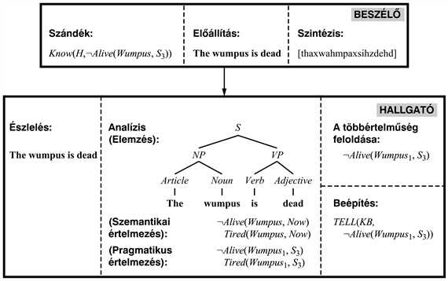
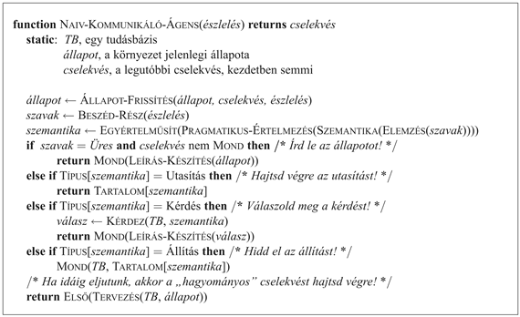

<?xml version="1.0" encoding="UTF-8" standalone="no"?>

<html xmlns="http://www.w3.org/1999/xhtml"><head><meta name="generator" content="DocBook XSL Stylesheets V1.76.1"/></head><body>

<h1 class="title"><a id="id756006"/>22. fejezet - Kommunikáció</h1>

<em>Ebben a fejezetben meglátjuk, hogy az ágensek miért akarhatnak információt tartalmazó üzeneteket küldeni egymásnak, illetve azt, hogy ezt hogyan tehetik meg.</em>

Alkonyodik az Amboseli Nemzeti Park szavannás erdőségében, közel a Kilimandzsáró tövéhez. A fehérbarkójú cerkófmajom vagy grivet (<em>Cercopithecus aethiops</em> <em>–</em> <em>a ford.</em>) egy csoportja épp élelem után kutat, amikor az egyik grivet hangos kiáltó hívást hallat. A csoport többi tagja felismeri, hogy ez egy leopárdra figyelmeztető felhívás (amely különbözik a sasra figyelmeztető rövid köhintéstől vagy a kígyókra vonatkozó sziszegéstől), és a fákra sietnek. A grivet sikeresen kommunikált a csoporttal.

A <strong>kommunikáció</strong> (<strong>communication</strong>) az információ szándékolt átadása közös jelrendszerből választott jel létrehozása és észlelése által. Az állatok többsége használ jelzéseket fontos üzenetek kifejezésére: itt van élelem, ragadozó a közelben, gyere közelebb, vonulj vissza, párosodjunk. Egy részlegesen megfigyelhető világban a kommunikáció segít az ágenseknek sikeresnek lenni, mivel megfigyelhetnek mások által észlelt vagy kikövetkeztetett információt.

Az embereket a <strong>nyelv</strong>ként (<strong>language</strong>) ismert, strukturált üzenetekből álló összetett rendszer különbözteti meg más élőlényektől, amely lehetővé teszi számunkra, hogy a világról szóló ismereteink nagy részét átadhassuk egymásnak. Bár a csimpánzok, delfinek és más emlősök több száz jeles szókinccsel rendelkeznek, és van valamiféle hajlamuk ezek összekapcsolására, az ember az egyedüli faj, amely minőségileg különböző üzenetek korlátlan számát képes megbízhatóan átadni.

Természetesen vannak más tulajdonságok, amelyek egyedülállóan emberiek: egyetlen más faj sem visel ruhát, készít művészeti alkotásokat vagy néz naponta három órán át televíziót. Azonban amikor Turing a tesztjét javasolta (lásd 1.1. alfejezet), a nyelvre alapozta azt, mivel a nyelv bensőséges kapcsolatban áll a gondolkodással. Ebben a fejezetben elmagyarázzuk, hogyan működik egy kommunikáló ágens, és bemutatjuk az angol nyelv egy egyszerűsített részletét.

<h1 class="title"><a id="id757979"/>A kommunikáció mint cselekvés</h1>

Egy ágens számára a beszéd létrehozása lehetséges cselekvéseinek egyike. Ezt <strong>szólásaktus</strong>nak (<strong>speech act</strong>) nevezzük. A „beszédet” olyan értelemben használjuk, mint „szabad közlést”, nem mint „beszélgetést”, így az elektronikus levelezés, a mutogatás és a jelbeszéd használata mind szólásaktusnak számít. Az angol nyelvben nincs általános szó a beszédet létrehozó ágensre, amely beszél, ír vagy másképp fejezi ki magát. A <strong>beszélő</strong> (<strong>speaker</strong>), a <strong>hallgató</strong> (<strong>listener</strong>) és a <strong>megnyilatkozás</strong> (<strong>utterance</strong>) kifejezéseket használjuk a kommunikáció bármilyen módjának általános leírására. A <strong>szó</strong> (<strong>word</strong>) kifejezést használjuk mindenféle szokásos kommunikációs jelre.

Miért foglalkozna egy ágens szólásaktus létrehozásával, amikor „hagyományos” cselekvést is végrehajthat? A 12. fejezetben láttuk, hogy többágenses környezetekben az ágensek használhatják a kommunikációt annak érdekében, hogy közös tervet alakítsanak ki. Például a wumpus világot felfedező ágensek egy csoportja együtt (egyéni vagy csoportos) előnyhöz jut, ha képes a következőket megtenni:

<ul class="itemizedlist"><li class="listitem">
<strong>Megkérdez</strong>ik (<strong>query</strong>) egymást a világ különféle területeiről. Ezt tipikusan kérdések feltevésével végzik: <em>Érezted a wumpus bűzét valahol?</em>
</li><li class="listitem">
<strong>Értesít</strong>ik (<strong>inform</strong>) egymást a világról. Ezt kijelentésekkel teszik meg: <em>Szellő van itt, a [3, 4]-en.</em> Egy kérdés megválaszolása egy másik fajta értesítés.
</li><li class="listitem">
<strong>Kér</strong>nek (<strong>request</strong>) más ágenseket cselekvések végrehajtására: <em>Kérlek segíts az aranyat vinni!</em> Néha egy <strong>indirekt szólásaktus</strong> (<strong>indirect speech act</strong>) (egy kijelentés vagy kérdés formájú kérés) udvariasabbnak számít: <em>Használni tudnék egy kis segítséget ennek a cipelésében.</em> Egy fennhatósággal rendelkező ágens adhat parancsokat (<em>Alfa jobbra menj; Bravo és Charlie balra</em>), és egy hatalommal rendelkező ágens fenyegethet (<em>Ide nekem az aranyat, vagy…</em>). Ezen szólásaktusokat együtt <strong>direktívá</strong>knak (<strong>directive</strong>s) nevezik.
</li><li class="listitem">
<strong>Tudomásul vesz</strong>ik (<strong>acknowledge</strong>) a kéréseket: <em>Rendben.</em>
</li><li class="listitem">
<strong>Megígér</strong>nek (<strong>promise</strong>) vagy hozzájárulnak egy tervhez: <em>Én lelövöm a wumpust; te megragadod az aranyat.</em>
</li></ul>

Minden szólásaktus befolyásolja a világot a levegőmolekulák rezgetésével (vagy ekvivalens hatással más médiumban), és ily módon megváltoztatja más ágensek mentális állapotát, valamint végső fokon a jövőbeli cselekedeteiket is. Bizonyos szólásaktusok információt juttatnak a hallgatóhoz, feltételezve, hogy a hallgató döntéshozatalát megfelelően befolyásolja az információ. Mások sokkal célzottabban késztetik a hallgatót valamilyen cselekvés véghezvitelére. A szólásaktusok további osztálya a <strong>deklaratív</strong> (<strong>declarative</strong>), amely sokkal közvetlenebb hatást gyakorol a világra: <em>férjnek és feleségnek nyilvánítom önöket </em>vagy <em>Harmadik találat, ön kiesett.</em> Természetesen a hatást az érintett ágensek mentális állapotai komplex hálózatának létrehozása vagy tudomásulvétele éri el: házasnak lenni vagy kiesni, olyan állapotok, amelyeket megállapodások rögzítenek és nem a világ „fizikai” jellemzői.

A kommunikáló ágens feladata annak eldöntése, hogy <em>mikor</em> van szükség egy szólásaktusra, és hogy <em>melyik </em>a helyénvaló az összes lehetséges közül. A szólásaktusok megértésének problémája hasonlatos más <strong>megértés</strong>i (<strong>understanding</strong>) problémákhoz, mint például a képek megértése vagy a betegségek diagnosztizálása. Kapunk egy halmazt többértelmű bemenetekkel, amikből visszafelé haladva azt kell eldöntenünk, hogy a világ mely állapota hozhatta létre őket. Azonban mivel a beszéd tervezett cselekvés, a megértés magában foglalja a tervfelismerést is.

<h2 class="title"><a id="id758185"/>A nyelv alapjai</h2>

A <strong>formális nyelv</strong>et (<strong>formal language</strong>) <strong>karakterfüzérek</strong> (<strong>strings</strong>) (lehetséges, hogy végtelen) halmazaként definiáljuk. Minden egyes füzér az úgynevezett <strong>záró</strong> (vagy <strong>terminális</strong>)<strong> szimbólum</strong>ok (<strong>terminal symbol</strong>s) – amelyeket néha szavaknak hívunk – öszszekapcsolt sorozata. Például az elsőrendű logikában a záró szimbólumok között van a ∧ és a <em>P</em>, és egy tipikus füzér a „<em>P</em> ∧ <em>Q</em>”. A „<em>P Q </em>∧”<em> </em>füzér nem része a nyelvnek. A formális nyelvek, mint például az elsőrendű logika vagy a Java, szigorú matematikai definíciókkal rendelkeznek. Ezzel ellentétben a <strong>természetes nyelvek</strong> (<strong>natural language</strong>s), mint például a kínai, a dán és az angol, nem rendelkeznek szigorú definícióval, hanem beszélők egy közössége használja. Ebben a fejezetben a természetes nyelveket megpróbáljuk formális nyelveknek tekinteni, bár tisztában vagyunk azzal, hogy az illeszkedés nem lesz tökéletes.

A <strong>nyelvtan</strong> (<strong>grammar</strong>) a nyelvet meghatározó szabályok véges halmaza. A formális nyelveknek mindig van egy hivatalos nyelvtana, amelyet kezelési útmutatókban vagy könyvekben határoznak meg. A természetes nyelveknek nincs hivatalos nyelvtana; bár a nyelvészek törekszenek a nyelv tulajdonságainak felfedezésére tudományos vizsgálatokkal, majd ezen felfedezések rögzítésére egy nyelvtanban. Eddig egyetlen nyelvész sem járt teljes sikerrel. Figyeljük meg, hogy a nyelvészek tudósok, akik a nyelvet úgy próbálják definiálni, ahogy az <em>létezik</em>. Vannak olyan előíró nyelvészek is, akik megpróbálják diktálni, hogy a nyelvnek milyennek <em>kellene lennie</em>. Olyan szabályokat alkotnak, mint például a „használd az ikes ragozást”, amelyeket néha megjelentetnek stílusútmutatókban, de kevés valódi hatásuk van a beszélt nyelvre.

Mind a formális, mind a természetes nyelvek jelentést, avagy <strong>szemantiká</strong>t (<strong>semantics</strong>) rendelnek minden egyes érvényes füzérhez. Például az aritmetika nyelvén lenne egy szabályunk, hogy ha „<em>X</em>” és „<em>Y</em>” kifejezések, akkor „<em>X</em> + <em>Y</em>” szintén kifejezés, amelynek a szemantikája <em>X </em>és <em>Y</em> összege. Természetes nyelvekben hasonlóan fontos a füzérek <strong>pragmatiká</strong>ját (<strong>pragmatics</strong>) is megérteni: a füzér aktuális jelentését, ahogy az elhangzik egy adott szituációban. A jelentés nemcsak a szavakban rejlik, hanem a szavak <em>in situ </em>értelmezésében.

A legtöbb nyelvtani szabály formalizmus a <strong>kifejezésstruktúra</strong> (<strong>phrase structure</strong>) ötletére épül – azaz arra, hogy a füzérek <strong>kifejezés</strong>eknek (<strong>phrase</strong>s) nevezett, különböző kategóriából származó részfüzérekből állnak össze. Például „a wumpus”, „a király” és „a sarokban levő ágens”[<a id="id758346" href="#ftn.id758346" class="footnote">220</a>] kifejezések mind az úgynevezett <strong>főnévi kifejezés</strong> (<strong>noun phrase</strong>) (vagy röviden <em>NP</em>) kategória példái. Két ok létezik arra, hogy a kifejezéseket ilyen módon megkülönböztessük. Az egyik, hogy a kifejezések általában természetes szemantikus elemeknek felelnek meg, amelyekből a kijelentés jelentése megalkotható; például a főnévi kifejezések a világ objektumaira vonatkoznak. A másik, hogy a kifejezések kategorizálása segít a nyelv megengedett füzéreinek leírásában. Azt mondhatjuk, hogy a főnévi kifejezések bármelyike kombinálható egy <strong>igei kifejezés</strong>sel (<strong>verb phrase</strong>) (<em>VP</em>), mint például „is dead” (halott), hogy közösen egy olyan kifejezést formáljanak, amelyik a <strong>mondat</strong> (<strong>sentence</strong>) (<em>S</em>) kategóriába tartozik. A főnévi és igei kifejezés közbülső fogalma nélkül sokkal bonyolultabb lenne elmagyarázni, hogy miért jó mondat a „the wumpus is dead” és miért nem a „wumpus the dead is”.

<h3 class="title">Fontos</h3>
<strong>Generálóképesség</strong>

A nyelvtani formalizmusok osztályozhatók <strong>generálóképesség</strong>ük (<strong>generative capacity</strong>) szerint: azoknak a nyelveknek a halmaza szerint, amelyeket képesek reprezentálni. Chomsky a nyelvtani formalizmusok négy osztályát írta le, amelyek csak az átíró szabályok formájában különböznek (Chomsky, 1957). Az osztályok hierarchiába rendezhetők, ahol minden osztály felhasználható az összes olyan nyelv leírására, ami leírható egy nála gyengébb osztállyal, és még néhány további nyelvre is. Itt most felsoroljuk a hierarchiát, a legerősebbel kezdve.

A <strong>rekurzívan felsorolható nyelvtan</strong>ok (<strong>recursively enumerable grammar</strong>s) korlátozás nélküli szabályokat használnak: az átíró szabályok mindkét oldala tetszőleges számú záró és nem záró szimbólumot tartalmazhat, mint például az <em>A B</em> → <em>C</em> szabály. Ezen nyelvtanok kifejezőereje megegyezik a Turing-gépével.

A <strong>környezetérzékeny nyelvtan</strong>ok (<strong>context-sensitive grammar</strong>s) csak olyan értelemben korlátozottak, hogy a jobb oldalnak legalább annyi szimbólumot kell tartalmaznia, mint a bal oldalnak. A környezetérzékeny (környezetfüggő) elnevezés abból a tényből ered, hogy egy <em>A S B </em>→<em> A X B</em> szabály azt mondja, hogy egy <em>S</em> átírható <em>X</em>-re egy megelőző <em>A</em> és egy követő <em>B</em> környezetében. A környezetérzékeny nyelvtanok leírhatnak például olyan nyelvet, mint az <em>anbncn</em> (<em>a</em>-k <em>n</em> hosszúságú sorozata, amelyet ugyanannyi <em>b</em> és<em> c</em> követ).

A <strong>környezetfüggetlen nyelvtan</strong>ok (<strong>context-free grammar</strong>s) (vagy <strong>CFG</strong>-k) esetében a bal oldal egyetlen nem záró szimbólumot tartalmaz. Így minden egyes szabály megengedi a nem záró szimbólum átírását a jobb oldalra <em>tetszőleges</em> környezetben. A CFG-k népszerűek a természetes és programozási nyelvek nyelvtanai körében, bár ma már széles körben elfogadott, hogy létezik legalább néhány olyan természetes nyelv, mely tartalmaz olyan szerkezeteket, melyek nem írhatók le környezetfüggetlen nyelvtannal (Pullum, 1991). A környezetfüggetlen nyelvtanok képesek reprezentálni <em>anbn</em>-t, de nem <em>anbncn</em>-t.

A <strong>reguláris nyelvtan</strong>ok (<strong>regular grammar</strong>s) a legkorlátozottabb osztály. Minden szabálynak van egyetlen nem zárója a bal oldalán, és egy záró szimbólum a jobb oldalon, amit opcionálisan követhet egy nem záró. A reguláris nyelvtanok a véges automatával ekvivalens erejűek. Gyengén alkalmasak programozási nyelvek számára, például nem képesek nyitó és bezáró zárójelek egyensúlyát leíró szerkezetek ábrázolására (az <em>anbn</em> nyelv egy változata). Ehhez legközelebb <em>a*b*</em> reprezentálásával juthatnak, amely tetszőleges számú <em>a </em>sorozatát követő tetszőleges számú <em>b.</em>

A hierarchiában fentebb helyezkedő nyelvtanoknak nagyobb a kifejezőereje, de a kapcsolódó algoritmusok kevésbé hatékonyak. Az 1980-as évek közepéig a nyelvészek a környezetfüggetlen és környezetérzékeny nyelvtanokkal foglalkoztak. Azóta nagyobb hangsúlyt fektetnek reguláris nyelvtanokra, amelyeket az elektronikusan elérhető szövegek mega- és gigabájtjainak gyors, még a kevésbé teljes analízis árán is történő feldolgozási igénye hívott életre. Ahogy Fernando Pereira mondta: „Minél öregebb leszek, annál lentebb megyek a Chomsky-hierarchián.” Hogy lássuk, mit értett ezen, vesse össze (Pereira és Warren, 1980; Mohri, Pereira és Riley, 2002)

Az <em>NP</em>, a <em>VP</em> és az <em>S</em> kategóriák úgynevezett <strong>nem záró szimbólum</strong>ok (<strong>nonterminal symbol</strong>s). A nyelvtanok <strong>átíró szabály</strong>ok (<strong>rewrite rule</strong>s) segítségével definiálják a nem záró szimbólumokat. Az átíró szabályok leírására a Backus–Naur-formát (BNF) fogjuk átvenni, amelyet a B) függelékben írunk le az <a class="xref" href="apb.md#ID_1112_oldal">„B1. Nyelvek definiálása Backus–Naur-Formában (BNF)”</a> részben. Ezen jelölés szerint egy

<code class="code"><em>S</em> → <em>NP</em> <em>VP</em></code>

szabály jelentése az, hogy egy <em>S</em> egy tetszőleges <em>NP</em> kategóriájú kifejezésből és az azt követő tetszőleges <em>VP</em> kategóriájú kifejezésből áll.

<h2 class="title"><a id="id758641"/>A kommunikációt alkotó lépések</h2>

Egy tipikus kommunikációs epizód, amikor <em>S</em> beszélő <em>P</em> állítást szeretné átadni <em>H</em> hallgatónak <em>W</em> szavakkal, hét folyamatból áll:

<strong>Szándék</strong> (<strong>intention</strong>). <em>S</em> beszélő valahogy eldönti, hogy van egy <em>P</em> propozíció, amit érdemes elmondani <em>H </em>hallgatónak. A példánkban a beszélőnek az a szándéka, hogy a hallgató tudomására hozza, hogy a wumpus már nem él.

<strong>Létrehozás</strong> (<strong>generation</strong>). A beszélő megtervezi, hogy <em>P</em> propozíciót hogyan alakítsa át olyan kijelentéssé, amely valószínűvé teszi, hogy a hallgató, fogadva a kijelentést a jelenlegi szituációban, kikövetkeztetheti <em>P</em> jelentést (vagy egy hozzá közelit). Tételezzük fel, hogy a beszélő képes a következő szavakat létrehozni: „The wumpus is dead” (A wumpus halott), és jelöljük ezt <em>W</em>-vel.

<strong>Szintézis</strong> (<strong>synthesis</strong>). A beszélő létrehozza <em>W</em> szavak fizikai realizációját, <em>W'</em>-t. Ezt teheti tintával papíron, rezgésekkel levegőben vagy valamilyen más médiumon. A 22.1. ábrán egy olyan ágenst mutatunk, amely a <a class="xref" href="ch15s06.md#ID_661_oldal">„Beszédfelismerés”</a> részben definiált fonetikus ábécével leírt <em>W' </em>hangfüzér szintézisét végzi: „[thaxwahmpaxsihzdehd]”. A szavak egybefolytak, ami tipikus a gyorsan beszélt nyelv esetében.

<strong>Észlelés</strong> (<strong>perception</strong>). <em>H</em> észleli a <em>W'</em> fizikai megvalósulást, mint <em>W'</em>2-t, és <em>W</em>2 szavakként dekódolja. Amikor a médium a beszéd, az észlelési lépést <strong>beszédfelismerés</strong>nek (<strong>speech recognition</strong>) nevezzük; amikor az írás, akkor <strong>optikai karakter felismerésé</strong>nek (<strong>optical character recognition</strong>). Mindkettő elmozdult az elvont léttől a mindennapi előfordulás irányába a kilencvenes években, főként az asztali számítógépek jelentős mértékben növekvő teljesítményének köszönhetően.

<a id="id758783"/>
<strong>22.1. ábra - A kommunikációban részt vevő hét folyamat, a „The wumpus is dead” mondat felhasználásával</strong>

<strong>Analízis</strong> (<strong>analysis</strong>). <em>H</em> kikövetkezteti, hogy <em>W</em>2-nek <em>P</em>1, …,<em> Pn</em> lehetséges jelentése van. Az analízist három fő részre osztjuk: szintaktikai elemzésre (parsing), szemantikai értelmezésre és pragmatikus értelmezésre. Az <strong>elemzés </strong>(<strong>parsing</strong>) egy bemeneti füzérhez tartozó <strong>elemzési</strong>, más szóval <strong>levezetési fa</strong> (<strong>parse tree</strong>) építésének a folyamata, ahogy a 22.1. ábrán látható. Az elemzési fa belső csomópontjai kifejezéseket reprezentálnak, míg a levelek szavakat jelképeznek. A <strong>szemantikus értelmezés</strong> (<strong>semantic </strong><strong>interpretation</strong>) az a folyamat, amelynek során kinyerjük egy kijelentés jelentéstartalmát valamilyen reprezentációs nyelven. A 22.1. ábrán két lehetséges szemantikai értelmezést mutatunk be: azt, hogy a wumpus nem él, és azt, hogy fáradt (a <em>dead</em> egy köznyelvi jelentése). A több lehetséges értelmezéssel rendelkező kijelentéseket <strong>többértelmű</strong>nek (<strong>ambiguous</strong>) mondjuk. A <strong>pragmatikus értelmezés</strong> (<strong>pragmatic interpretation</strong>) figyelembe veszi azt a tényt, hogy ugyanazon szavaknak más jelentése lehet eltérő helyzetekben. Míg a szintaktikai értelmezés egy egy argumentummal, a füzérrel rendelkező függvény, addig a pragmatikus értelmezés a kijelentést és annak környezetét vagy szituációját figyelembe vevő függvény. A példában a pragmatikus elemzés két dolgot tesz: a <em>Now</em> konstans értéket kicseréli az <em>S</em>3 konstanssal, ami a jelenlegi szituációt jelenti, illetve a <em>Wumpus</em>-t kicseréli <em>Wumpus</em>1-re, ami arra az egyetlen Wumpusra utal, amelyről tudott, hogy a barlangban van. Általánosságban a pragmatikus elemzés a kijelentés végső értelmezéséhez sokkal többel járulhat hozzá; gondoljunk csak például arra, amikor a „A gyémántra nézek” elhangzik egy ékszerész, illetve egy baseballjátékos szájából.[<a id="id758904" href="#ftn.id758904" class="footnote">221</a>] A 22.7. alfejezetben látni fogjuk, hogy a pragmatikus elemzés segít értelmezi az „It is dead” kijelentést úgy, hogy a wumpus halott, ha egy olyan szituációban vagyunk, amikor a wumpus áll a figyelem középpontjában.

A <strong>többértelműség feloldása</strong> (<strong>disambiguation</strong>). <em>H</em> kikövetkezteti, hogy <em>S Pi</em>-t szándékozott közölni (ahol ideális esetben <em>Pi</em> = <em>P</em>). A beszélők többsége nem szándékosan többértelmű, de a legtöbb kijelentésnek több megengedett értelmezése van. A kommunikáció azért működik, mivel a hallgató elvégzi azt a munkát, hogy rájöjjön, hogy melyik az az értelmezés, amit a beszélő valószínűleg közölni akart. Vegyük észre, hogy ez az első alkalom, amikor a <em>valószínűleg</em> szót használtuk, és a többértelműség feloldása az első eljárás, ami erőteljesen valószínűségi következtetésen alapul. Az analízis lehetséges értelmezéseket állít elő; ha egynél több értelmezést talál, akkor a többértelműség feloldása választja ki a legjobbat.

<strong>Beépítés</strong> (<strong>incorporation</strong>). <em>H</em> eldönti, hogy elhiszi <em>Pi</em>-t (vagy nem). Egy teljesen naiv ágens mindent elhihet, amit hall, de egy kifinomultabb ágens úgy kezeli a szólásaktust, mint egy <em>Pi</em>-t alátámasztó tényt, és nem mint annak a megerősítését.

Mindezeket összerakva a 22.2. ábrán látható ágensprogramot kapjuk. Itt az ágens robotszolgaként működik, amit egy gazda irányíthat. A szolga minden lépésben megválaszolja a gazda kérdését, illetve végrehajtja a parancsát, és a szolga minden, a gazda által kijelentett állítást elhisz. Ezenkívül megállapítást tesz az aktuális szituációra (csak egyszer), ha nincs más tennivalója, és megtervezi saját akcióját, ha magára hagyják. Íme, egy tipikus párbeszéd:

		

<table border="0"><colgroup><col width="238.7pt" class="col1"/><col width="238.7pt" class="col2"/></colgroup><tbody><tr><td style="text-align: justify" valign="top">
<code class="code">ROBOTSZOLGA</code>
</td><td style="text-align: justify" valign="top">
<code class="code">GAZDA</code>
</td></tr><tr><td style="text-align: justify" valign="top">
Szellőt érzek.
</td><td style="text-align: justify" valign="top">
Menj 1, 2-re!
</td></tr><tr><td style="text-align: justify" valign="top">
Semmi sincs itt.
</td><td style="text-align: justify" valign="top">
Menj északnak!
</td></tr><tr><td style="text-align: justify" valign="top">
Szellőt és bűzt érzek, valamint csillogást látok.
</td><td style="text-align: justify" valign="top">
Ragadd meg az aranyat!
</td></tr></tbody></table>

<a id="id759084"/>
<strong>22.2. ábra - Egy kommunikáló ágens, amely elfogad parancsokat, kérdéseket és állításokat. Az ágens leírhatja az aktuális állapotot, valamint végrehajthat „hagyományos”, nem szólásaktus cselekvést is, ha nincs mit mondania.</strong>

 

[<a id="ftn.id758346" href="#id758346" class="para">220</a>]  A fejezetben hozott példák fordításakor a következőképpen jártunk el: az olyan angol kifejezéseket, amelyek magyarul is szemléletesek az adott mondanivaló szempontjából, magyar fordításban adjuk meg. A kifejezések és részletesebb példák többségénél ez nem követhető, mivel a szerző az angol nyelv sajátosságaihoz illeszti a fejezet ismeretanyagának és példáinak megfogalmazását, így a fordítás lényegi változást hozott volna a fejezet tartalmában is. Ezeken a részeken a magyar változatban is meghagyjuk az eredeti angol kifejezéseket, szükség esetén rövid magyar fordításukkal kiegészítve. A szerzők létrehozzák az angol nyelv egy formális részhalmazát, amin bemutatják a fejezetben ismertetett módszerek alkalmazását. Ezt is változatlan formában helyezzük át a magyar nyelvű kiadásba. Ezen részek magyar fordítását sem készítjük el, mivel a fordítás a mondanivaló szempontjából lényegtelen. (<em>A ford.</em>)

[<a id="ftn.id758904" href="#id758904" class="para">221</a>]  A baseballpálya angol elnevezése <em>diamond,</em> mivel alakjával a gyémántra hasonlít. (<em>A ford.</em>)

</body></html>
