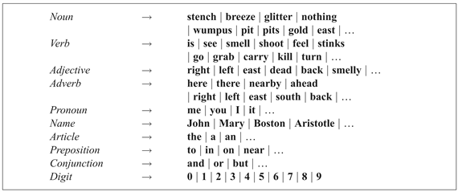
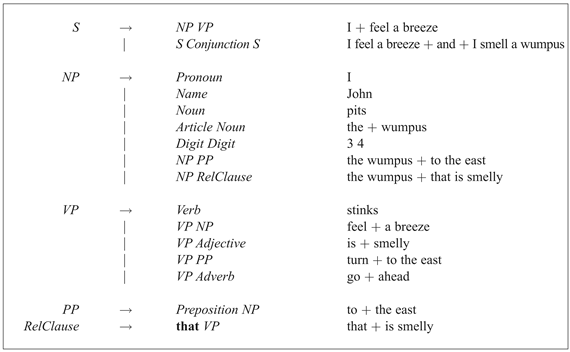

<?xml version="1.0" encoding="UTF-8" standalone="no"?>
<!DOCTYPE html PUBLIC "-//W3C//DTD XHTML 1.1//EN" "http://www.w3.org/TR/xhtml11/DTD/xhtml11.dtd">
<html xmlns="http://www.w3.org/1999/xhtml"><head><meta name="generator" content="DocBook XSL Stylesheets V1.76.1"/></head><body>

<h1 class="title"><a id="id759093"/>formális nyelvtan az angol nyelv egy töredékére</h1>

Ebben a fejezetben definiálunk egy nyelvtant az angol nyelv egy kis töredékére, ami megfelelő a wumpus világról szóló kijelentésekhez. Ezt a nyelvet ℰ0-nak nevezzük. A későbbi részek javítani fognak az ℰ0-n, hogy valamelyest jobban hasonlítson a beszélt angolra. Igen valószínűtlen, hogy valaha is megszerkesztjük az angol nyelv teljes nyelvtanát, már csak azért sem, mivel nincs két ember, aki teljesen megegyezne abban, mit is tekint érvényes angolnak.

<h2 class="title"><a id="id759107"/>Az ℰ0 szókincse</h2>

Először definiáljuk a <strong>szókincs</strong>et (<strong>lexicon</strong>), azaz a megengedett szavak listáját. A szavakat a szótárhasználók számára ismerős módon csoportosítjuk kategóriákba, avagy beszédrészekbe: főnevek, névmások és nevek dolgok elnevezésére, igék események jelölésére, jelzők a főnevek módosítására és határozószók az igék módosítására. Egyes olvasók számára kevéssé ismertek lehetnek a következő kategóriák: <strong>névelő</strong>k (<strong>article</strong>s) (például a <em>the</em>), <strong>elöljárószavak</strong> (<strong>preposition</strong>s) (például <em>in</em>) és <strong>kötőszó</strong>k (<strong>conjunction</strong>s) (például <em>and</em>). A 22.3. ábra mutat egy kis szókincset.

Minden egyes kategória …-tal végződik annak jelzésére, hogy vannak más szavak is a kategóriában. Azt is meg kell jegyeznünk azonban, hogy két különálló ok van a szavak hiányára. A főnevek, az igék, a jelzők és a névmások esetében elméletileg sem lehetséges az összes felsorolása. Nemcsak azért, mert minden osztálynak ezernyi vagy tízezernyi tagja lehet, hanem azért is, mivel folyamatosan hozzáadódnak újak, mint például az <em>MP3</em> vagy az <em>anime</em>. Ezt a négy kategóriát <strong>nyitott osztály</strong>oknak (<strong>open class</strong>es) nevezzük. A többi kategóriát (névmások, névelők, elöljáró- és kötőszók) <strong>lezárt osztály</strong>oknak (<strong>closed class</strong>es) hívjuk. Mindegyikben kevés számú szó van (néhánytól pár tucatig), amelyek elméletileg teljesen felsorolhatók. A lezárt osztályok évszázadok folyamán változnak, nem hónapok alatt. Például a „thee” és a „thou” a 17. században elterjedt névmások voltak, hanyatlóban voltak a 19. században, és manapság csak versekben és egyes régiók dialektusában lehet találkozni velük.

<a id="id759194"/>
<strong>22.3. ábra - ℰ0 szókincse</strong>

<h2 class="title"><a id="id759207"/>Az ℰ0 nyelvtana</h2>

A következő lépés a szavak kifejezésekké történő kombinálása. Öt nem záró szimbólumot fogunk használni a különböző típusú kifejezések definiálására: mondat (<em>S</em>), főnévi kifejezés (<em>NP</em>), igei kifejezés (<em>VP</em>), elöljárói kifejezés (<em>PP</em>) és relatív klóz (<em>RelClause</em>).[<a id="id759236" href="#ftn.id759236" class="footnote">222</a>] A 22.4. ábra ℰ0 számára mutat egy nyelvtant, minden egyes átíró szabályra példát adva. Az ℰ0 jó angol mondatokat generált, mint amilyenek például a következők:

John is in the pit

The wumpus that stinks is in 2 2

Mary is in Boston and John stinks

Sajnálatos módon a nyelvtan <strong>túlgenerál</strong> (<strong>overgenerates</strong>) – előállít olyan mondatokat, amelyek nyelvtanilag helytelenek –, mint például a „Me go Boston” és az „I smell pit gold wumpus nothing east”. <strong>Alul</strong> is <strong>generál </strong>(<strong>undergenerates</strong>): sok olyan angol mondat van, amit elutasít, mint például a „I think the wumpus is smelly”. (Egy másik hátránya, hogy a nyelvtan nem nagybetűvel kezdi a mondatokat, és nem rak pontot a végükre. Ez azért van, mivel elsősorban beszédre tervezték, és nem írásra.)

<a id="id759295"/>
<strong>22.4. ábra - Az ℰ0 nyelvtana, minden egyes szabályra példa kifejezést adva</strong>

 

[<a id="ftn.id759236" href="#id759236" class="para">222</a>]  Egy relatív klóz főnévi kifejezést követ és módosít. (A klóz a nyelvészetben egy alárendelt mellékmondat – <em>a ford.</em>) Egy relatív névmásból (mint a „who” és a „that”) és egy azt követő igei kifejezésből áll. (Egy másik típusú relatív klóz a 22.12. feladatban szerepel.) Példa egy relatív klózra a <em>that stinks</em> a „The wumpus <em>that stinks</em> is in 2 2” mondatban.

</body></html>
