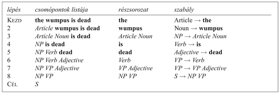
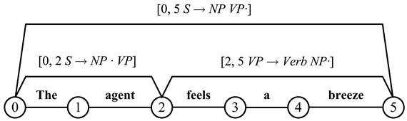
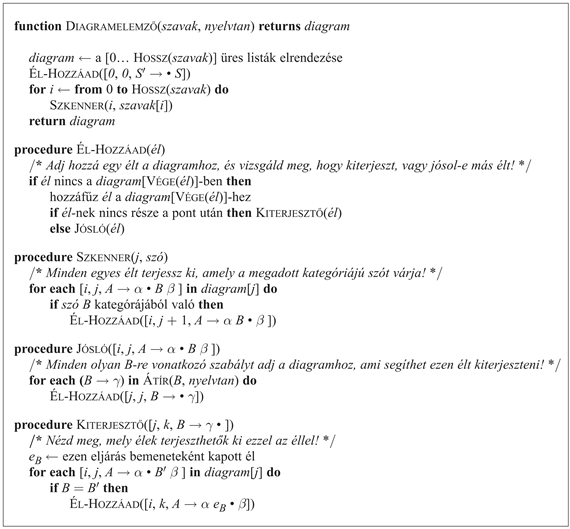
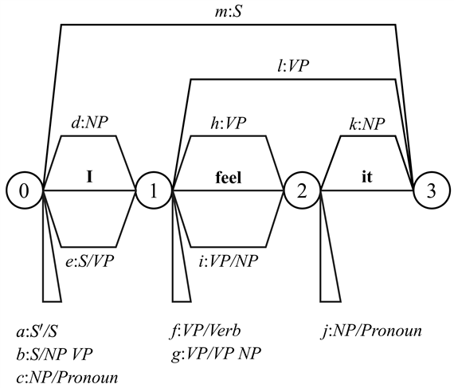
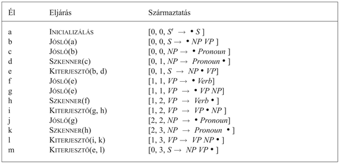
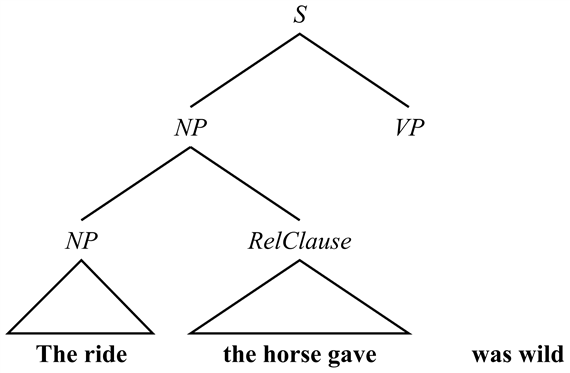
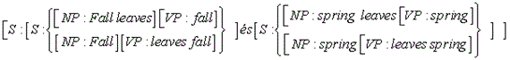

<?xml version="1.0" encoding="UTF-8" standalone="no"?>
<!DOCTYPE html PUBLIC "-//W3C//DTD XHTML 1.1//EN" "http://www.w3.org/TR/xhtml11/DTD/xhtml11.dtd">
<html xmlns="http://www.w3.org/1999/xhtml"><head><meta name="generator" content="DocBook XSL Stylesheets V1.76.1"/></head><body>

<h1 class="title"><a id="id759308"/>Szintaktikai analízis (elemzés)</h1>

Már definiáltuk az <strong>elemzés</strong>t (<strong>parsing</strong>) mint az adott bemeneti füzérhez tartozó levezetési fa megtalálásának folyamatát. Azaz a <code class="code">PARSE</code> függvény meghívása, mint például a

<code class="code">Parse(„the wumpus is dead”, ℰ0, <em>S</em>)</code>

olyan fát kell visszaadnia, amelynek gyökerében <em>S </em>áll, levelei a „the wumpus is dead” és belső csomópontjai az ℰ0 nyelvtan nem záró szimbólumai. A 22.1. ábrán láthattunk egy ilyen fát. Folytonos szövegként a következőképpen írhatjuk:

<code class="code">[<em>S</em>:	[<em>NP</em>: [<em>Article</em>: <em>the</em>] [<em>Noun</em>: <em>wumpus</em>]]</code>

<code class="code">	[<em>VP</em>: [<em>Verb</em>:<em> is</em>][<em>Adjective</em>: <em>dead</em>]]]</code>

<h3 class="title">Fontos</h3>
<em>Az elemzés tekinthető egy levezetési fa megkeresésének folyamataként.</em> A keresési tér meghatározásának két szélsőséges (és sok közbülső) módja van. Az egyik szerint kiindulhatunk az <em>S</em> szimbólumból, és kereshetünk egy olyan fát, amely leveleiben tartalmazza a szavakat. Ez az úgynevezett <strong>fentről lefelé elemzés</strong> (<strong>top-down parsing</strong>) (mivel <em>S</em>-et a fa tetejére helyezzük). Másrészt kiindulhatunk a szavakból, és kereshetünk egy fát, ahol <em>S</em> a gyökércsomópont. Ez a <strong>lentről felfelé elemzés</strong> (<strong>bottom-up </strong><strong>parsing</strong>).[<a id="id759435" href="#ftn.id759435" class="footnote">223</a>] A fentről lefelé történő elemzés pontosan definiálható a következő keresési problémaként:

<ul class="itemizedlist"><li class="listitem">
A <strong>kezdeti állapot</strong> (<strong>initial state</strong>) egy elemzési fa, amelynek <em>S</em> a gyökércsomópontja, és egy ismeretlen gyerekcsomópontja van: [<em>S</em>: ?]. Általánosságban a keresési térben minden állapot egy levezetési fa.
</li><li class="listitem">
Az <strong>állapotátmenet-függvény</strong> (<strong>successor function</strong>) kiválasztja azt a legszélső csomópontot bal oldalon a fában, amelynek ismeretlen gyereke van. Ezek után a nyelvtanban olyan szabályokat keres, amelyek ezt a csomópontot tartalmazzák gyökérelemként. Minden ilyen szabályra generál egy következő állapotot, ahol a ? szimbólumot felcseréli a szabály jobb oldalának megfelelő listával. Például az ℰ0 nyelvtanban két szabály van <em>S</em>-re, így az [<em>S</em>: ?] fát a következő két származtatottal cseréli le:
</li></ul>

<code class="code">	[<em>S</em>:    [<em>S</em>: ?] [<em>Conjunction</em>: ?] [<em>S</em>: ?]]</code>

<code class="code">	[<em>S</em>:    [<em>NP</em>: ?] [<em>VP</em>: ?]]</code>

A másodiknak hét származtatottja lesz, minden <em>NP</em> átírási szabályhoz egy.

<ul class="itemizedlist"><li class="listitem">
A <strong>célteszt</strong> (<strong>goal test</strong>) ellenőrzi, hogy a levezetési fa levelei pontosan megfelelnek-e a bemeneti füzérnek, nincsenek-e ismeretlenek és lefedetlen bemenetek.
</li></ul>

A fentről lefelé történő elemzés egyik nagy problémája az úgynevezett <strong>bal-rekurzív szabály</strong>ok (<strong>left-recursive rule</strong>s) kezelése, melyek <em>X </em>→<em> X </em>…<em> </em>alakúak. Mélységi kereséssel egy ilyen szabály végtelen ciklusban <em>X</em>-et [<em>X</em>:<em> X </em>…]-ra cserélné. Szélességi keresés esetén sikeresen megtaláljuk az érvényes mondatok elemzéseit, de érvénytelen mondatok esetében egy végtelen keresési térben ragadnánk le.

A lentről felfelé történő elemzés keresésként történő formalizálása a következő:

<ul class="itemizedlist"><li class="listitem">
A <strong>kezdeti állapot</strong> (<strong>initial state</strong>) a bemeneti füzérben található szavak listája, mindegyiket egy olyan levezetési faként ábrázolva, melynek csak egy levele van, például: [<strong>the</strong>,<strong> wumpus</strong>,<strong> is</strong>,<strong> dead</strong>]. Általánosságban a keresés minden állapota levezetési fák egy listája.
</li><li class="listitem">
Az <strong>állapotátmenet-függvény</strong> (<strong>successor function</strong>) megvizsgál minden <em>i</em> pozíciót a fák listájában a nyelvtan szabályainak minden lehetséges jobb oldalán. Ha a lista <em>i</em> pozíciójában kezdődő részsorozata illeszkedik a jobb oldalra, akkor a részsorozatot lecseréli egy új fára, amelynek kategóriája a szabály bal oldala, és amelynek gyerekei a részsorozat. „Illeszkedés” alatt azt értjük, hogy a csomópont kategóriája megegyezik a jobb oldal elemének kategóriájával. Például az <em>Article </em>→ <strong>the</strong> szabály illeszkedik a [<strong>the</strong>,<strong> wumpus</strong>,<strong> is</strong>,<strong> dead</strong>] első csomópontjából álló részsorozatra, így a következő állapot az [[<em>Article</em>:<em> </em><strong>the</strong>],<strong> wumpus</strong>,<strong> is</strong>,<strong> dead</strong>] lenne.
</li><li class="listitem">
A <strong>célteszt</strong> (<strong>goal test</strong>) egy olyan állapotot keres, ahol egyetlen fa van, melynek gyökere az <em>S</em>.
</li></ul>

A 22.5. ábra bemutat egy példát a lentről felfelé történő elemzésre.

<a id="id759713"/>
<strong>22.5. ábra - A „the wumpus is dead” lentről felfelé történő elemzési lépései. A szavakat tartalmazó csomópontok listájával kezdünk. Ezek után egy szabály jobb oldalára illeszkedő részsorozatokat felcserélünk egy új csomóponttal, amelynek gyökere a szabály bal oldala. Például a harmadik sorban az <em>Article </em>és <em>Noun</em> csomópontokat lecseréljük egy <em>NP</em> csomópontra, amelynek e két csomópont lesz a gyereke. A fentről lefelé elemzés hasonló lépéseket eredményezne, de épp a fordított irányban.</strong>

A lentről felfelé és a fentről lefelé történő elemzés is lehet kevéssé hatékony azon módok számossága miatt, ahogy különböző kifejezésekhez többféle elemzés rendelhető. Mindkettő elpazarolhatja az időt a keresési tér irreleváns részeinek vizsgálatával. A fentről lefelé keresés generálhat olyan közbülső csomópontokat, amelyek sosem zárhatók le szavakkal, és a lentről felfelé keresés generálhat olyan részleges elemzéseket a szavakhoz, amelyek nem fordulhatnak elő egy <em>S</em>-ben sem.

Még ha lenne is egy tökéletes heurisztikánk, amely lehetővé tenné az irreleváns kitérők nélküli keresést, ezek az algoritmusok akkor sem lennének hatékonyak, mivel bizonyos mondatoknak <em>exponenciálisan sok</em> levezetési fája van. A következő alfejezet megmutatja, hogy mit kezdhetünk ezzel a problémával.

<h2 class="title"><a id="id759745"/>Hatékony elemzés</h2>

Vizsgáljuk meg a következő két mondatot:

Have the students in section 2 of Computer Science 101 take the exam.

Have the students in section 2 of Computer Science 101 taken the exam?

Bár az első 10 szavuk közös, teljesen különböző levezetésük van, mivel az első egy felszólítás, a második egy kérdés. Egy balról jobbra elemző algoritmusnak tippelnie kellene, hogy az első szó egy felszólítás vagy egy kérdés része-e, és nem tudná megmondani, hogy a tipp helyes-e egészen a tizenegyedik szóig: <em>take </em>vagy <em>taken</em>. Ha az algoritmus rosszul tippelt, egészen az első szóig kellene visszalépnie. Az ilyen típusú visszalépés elkerülhetetlen, de ha azt szeretnénk, hogy az algoritmusunk hatékony legyen, akkor el kell kerülnie a „the students in section 2 of Computer Science 101” <em>NP</em>-ként történő újraelemzését minden alkalommal, amikor visszalép.

<h3 class="title">Fontos</h3>
Ebben a részben egy olyan algoritmust alakítunk ki, amely ezt a hatékonysági problémát kezelni tudja. Az alapötlet a <strong>dinamikus programozás</strong> (<strong>dynamic programming</strong>) egy példája: <em>minden alkalommal, amikor egy részfüzért elemzünk, tárold az eredményt, így később majd nem kell újraelemeznünk.</em> Például ha egyszer rájöttünk, hogy a „the students in section 2 of Computer Science 101” egy <em>NP</em>, ezt eltárolhatjuk egy <strong>diagram</strong>nak (<strong>chart</strong>) nevezett adatstruktúrában. Az így működő algoritmusokat <strong>diagramelemző</strong>knek (<strong>chart parser</strong>s) nevezik. Mivel környezetfüggetlen nyelvtanokkal foglalkozunk, a keresési tér egy ágának kontextusában talált tetszőleges kifejezés éppúgy szerepelhet a keresési tér bármilyen más ágában is.

Egy <em>n</em> szóból álló mondat diagramja <em>n</em> + 1 <strong>csomópont</strong>ból (<strong>vertex</strong>) és számos, ezeket összekötő <strong>él</strong>ből (<strong>edges</strong>) áll. A 22.6. ábrán láthatunk egy diagramot hat csomóponttal (körök) és három éllel (vonalak). Például a

<code class="code">[0, 5, <em>S</em> → <em>NP VP</em> •]</code>

címkéjű él azt jelenti, hogy egy <em>NP</em>-t egy <em>VP</em> követ, és együtt alkotnak egy <em>S</em>-et, mely a 0-tól 5-ig terjedő karaktersorozatot fedi le. Egy élben található • jel elválasztja a már megtaláltat a még keresettől.[<a id="id759861" href="#ftn.id759861" class="footnote">224</a>] A • jellel záródó éleket <strong>teljes él</strong>eknek (<strong>complete edge</strong>s) nevezik. A

<code class="code">[0, 2, <em>S</em> → <em>NP</em> • <em>VP</em>]</code>

él szerint egy <em>NP</em> lefedi a 0-tól 2-ig terjedő karaktersorozatot (az első két szó), és ha tudunk találni egy ezt követő <em>VP</em>-t, akkor lenne egy <em>S</em>-ünk. Az ilyen élek, ahol a pont a végük előtt van, úgynevezett befejezetlen (nem teljes) élek, és azt mondjuk, hogy az él egy <em>VP</em>-t vár.

<a id="id759921"/>
<strong>22.6. ábra - A „The agent feels a breeze” mondat diagramjának egy részlete. Mind a hat csomópont látható, de csak három él szerepel azok közül, melyek teljes elemzést eredményeznének.</strong>

A 22.7. ábra a diagramelemző algoritmust szemlélteti. A lényege a fentről lefelé és a lentről felfelé legjobb tulajdonságainak ötvözése. A <code class="code">JÓSLÓ</code> eljárás fentről lefelé működik: olyan bejegyzéseket helyez el a diagramban, amelyek megmondják, hogy milyen szimbólumok milyen helyszínen elvártak. A <code class="code">SZKENNER</code> egy lentről felfelé eljárás, amely a szavakból indul ki, de egy szót csak egy meglevő diagrambejegyzés kiegészítésére használ fel. Hasonlóképpen a <code class="code">KITERJESZTŐ</code> a komponenseket lentről felfelé építi, de csak egy meglevő diagrambejegyzést egészít ki.

Egy trükköt alkalmaztunk a teljes algoritmus elindításához: hozzáadtunk egy [0, 0, <em>S'</em> → • <em>S</em>] élet a diagramhoz, ahol <em>S</em> a nyelvtan kezdeti szimbóluma, <em>S' </em>pedig egy általunk most kitalált új szimbólum. Az <code class="code">ÉL-HOZZÁAD</code> meghívása azt eredményezi, hogy a <code class="code">JÓSLÓ</code> éleket ad az olyan szabályokhoz, melyek <em>S</em>-t eredményezhetnek, azaz [<em>S</em> → <em>NP VP</em>]. Ezek után megvizsgáljuk ezen szabály első alkotóelemét, <em>NP</em>-t, és mindenféle módon olyan szabályokat adunk hozzá, melyek <em>NP</em>-t eredményeznek. Végső soron a <code class="code">JÓSLÓ</code> fentről lefelé módon minden lehetséges élt hozzáad, ami felhasználható a végső <em>S</em> megalkotásában.

<a id="id759995"/>
<strong>22.7. ábra - A diagramelemző algoritmus. <em>S</em> a kezdő szimbólum és <em>S' </em>egy új nem záró szimbólum, <em>diagram</em>[<em>j</em>] pedig azon élek listája, melyek a <em>j</em> csomópontban végződnek. A görög ábécé betűi nulla vagy több szimbólumból álló füzérekre illeszkednek.</strong>

Amikor <em>S'</em> jóslója készen van, belépünk egy ciklusba, amely meghívja a <code class="code">SZKENNER</code>-t a mondat minden egyes szavára. Ha a <em>j</em> pozícióban álló szó egy <em>B</em> kategória tagja, amit valamelyik él keres a <em>j</em> pozícióban, akkor kiterjesztjük azt az élet megjelölve a szót, mint <em>B</em> egy példányát. Vegyük észre, hogy a <code class="code">SZKENNER</code> minden egyes meghívása végződhet a <code class="code">JÓSLÓ</code> és a <code class="code">KITERJESZTŐ</code> rekurzív meghívásával, ily módon ötvözve a fentről lefelé és a lentről felfelé feldolgozást.

A másik lentről felfelé komponens, a <code class="code">KITERJESZTŐ</code>[<a id="id760065" href="#ftn.id760065" class="footnote">225</a>] vesz egy teljes élt, amelynek bal oldalán <em>B</em> van, és felhasználja a diagramban levő bármely nem teljes szabály kiterjesztésére, amely ott végződik, ahol a teljes él kezdődik, ha a nem teljes szabály egy <em>B</em>-re vár.

A 22.8. és 22.9. ábrák mutatják az „I feel it” mondat (amely a „Do you feel a breeze?” kérdésre adott válasz) diagramját és elemzési lépéseit. Tizenhárom él (a–m jelekkel ellátva) szerepel a diagramon, melyek közül öt teljes (a diagram verticei csomópontjai felett) és nyolc befejezetlen (alattuk). Vegyük észre a <code class="code">JÓSLÓ</code>, <code class="code">SZKENNER</code> és <code class="code">KITERJESZTŐ</code> akciók ciklusát. Például a Jósló felhasználja azt a tényt, hogy az „a” él egy <em>S</em>-t vár ahhoz, hogy megelőlegezze egy <em>NP</em> („b” él) és egy <em>Pronoun</em> („c” él) jóslatát. Ezek után a <code class="code">SZKENNER</code> felismeri, hogy van egy <em>Pronoun</em> a megfelelő helyen („d” él), és a <code class="code">KITERJESZTŐ</code> kombinálja a „b” nem teljes élt a „d” teljes éllel, így előállítva egy új élt, „e”-t.

<a id="id760121"/>
<strong>22.8. ábra - Az „0 I 1 feel 2 it 3” mondat diagramelemzése. Az <em>m</em>:<em>S</em> jelölés azt jelenti, hogy az <em>m</em> élnek egy <em>S</em> áll a jobb oldalán, míg az <em>f:VP/Verb</em> azt, hogy az <em>f</em> élnek <em>VP </em>van a bal oldalán, de egy <em>Verb</em>-et vár. Öt teljes él van a csomópontok felett, és nyolc hiányos alattuk.</strong>

A diagramelemző algoritmus elkerüli az élek nagy halmazának építését, amit az egyszerű lentről felfelé eljárás végigvizsgált volna. Vegyük a „The ride the horse gave was wild” mondatot. Egy lentről felfelé elemzés megjelölné a „ride the horse”-t mint egy <em>VP</em>-t, majd elvetné az elemzési fát, amint rájönne, hogy nem illeszkedik egy nagyobb <em>S</em>-be. Azonban az ℰ0 nem engedi meg, hogy egy <em>VP</em> a „the”-t kövesse, így a diagramelemző algoritmus sosem jósol <em>VP</em>-t ezen a ponton, így elkerüli ott a <em>VP</em> szerkezet időpocsékoló építését. Azokat az algoritmusokat, melyek balról jobbra működnek, és elkerülik ezen lehetetlen szerkezetek felépítését, <strong>balsarok-elemző</strong>knek (<strong>left-corner parser</strong>s) nevezzük, mivel egy olyan elemzési fát építenek fel, amely a nyelvtan kezdő szimbólumával indul, és a mondat legszélén balra (a bal sarokban) álló szó felé terjeszkednek. Egy élt csak akkor adnak a diagramhoz, ha ezen elemzési fa kiterjesztését szolgálhatja (példaként lásd 22.10. ábra).

<a id="id760686"/>
<strong>22.9. ábra - Az „0 I 1 feel 2 it 3.” elemzési lépései. Az a–m élek mindegyikére megmutatjuk azt az eljárást, amit az él más, a diagramon már szereplő élekből történő származtatására használtunk. Bizonyos éleket a rövidség érdekében elhagytunk.</strong>

<a id="id760710"/>
<strong>22.10. ábra - Egy balsarok-elemző algoritmussal elkerülhető a „ride” szóval kezdődő <em>VP</em> jóslása, de jósolni fog egy „was” szóval kezdődő <em>VP</em>-t, mivel a nyelvtan egy <em>NP</em>-t követő <em>VP</em>-t vár. A „the horse gave” feletti háromszög azt jelenti, hogy a szavaknak van egy <em>RelCause</em> elemzésük, amihez azonban közvetlenül további részek kapcsolódnak, amik nem láthatók.</strong>

A diagramelemző csak polinomiális idő- és tárigényű. <em>O</em>(<em>kn</em>2)<em> </em>helyet igényel az élek tárolására, ahol <em>n </em>a mondatban levő szavak száma és <em>k</em> egy, a nyelvtantól függő konstans. Amikor már nem tud több élt építeni, megáll, így tudjuk, hogy az algoritmus befejeződött (még akkor is, ha vannak bal-rekurzív szabályok). Valójában <em>O</em>(<em>n</em>3) időt igényel legrosszabb esetben, ami a legjobb, amit elérhetünk környezetfüggetlen nyelvtanokra. A <code class="code">DIAGRAMELEMZŐ</code> szűk keresztmetszete a <code class="code">KITERJESZTŐ</code>, amelynek meg kell próbálnia kiterjeszteni a <em>j</em>-ben végződő <em>O</em>(<em>n</em>) nem teljes él mindegyikét az ugyanott kezdődő <em>O</em>(<em>n</em>) teljes él mindegyikével, <em>j </em>lehetséges <em>n</em> + 1 különböző értékére. Ezeket összeszorozva kapjuk <em>O</em>(<em>n</em>3)-at. Ez egyfajta paradoxont ad a számunkra: hogyan tud egy <em>O</em>(<em>n</em>3) algoritmus visszaadni egy választ, amely exponenciális számosságú elemzési fát tartalmazhat? Vegyünk egy példát: a

„Fall leaves fall and spring leaves spring”

mondat többértelmű, mivel minden egyes szó (az „and” kivételével) lehet főnév és ige is, valamint a „fall” és a „spring” lehet melléknév is. Ennek a mondatnak mindösszesen négy elemzése van:[<a id="id760828" href="#ftn.id760828" class="footnote">226</a>]

<code class="code">[<em>S</em>: [<em>S</em>: [<em>NP</em>: Fall leaves] fall] and [<em>S</em>: [<em>NP</em>: spring leaves] spring]</code>

<code class="code">[<em>S</em>: [<em>S</em>: [<em>NP</em>: Fall leaves] fall] and [<em>S</em>: spring [<em>VP</em>: leaves spring]]</code>

<code class="code">[<em>S</em>: [<em>S</em>: Fall [<em>VP</em>: Fall leaves] fall] and [<em>S</em>: [<em>NP</em>: spring leaves] spring]</code>

<code class="code">[<em>S</em>: [<em>S</em>: Fall [<em>VP</em>: Fall leaves] fall] and [<em>S</em>: spring [<em>VP</em>: leaves spring]]</code>

Ha <em>n</em> többértelmű összekapcsolt részmondatunk lett volna, akkor 2n módon választhatnánk elemzést a részmondatokra.[<a id="id760936" href="#ftn.id760936" class="footnote">227</a>] Hogyan kerüli el a diagramelemző az exponenciális feldolgozási időt? Két választ is adhatunk a kérdésre. Először is, a <code class="code">DIAGRAMELEMZŐ</code> algoritmus maga valójában egy <em>felismerő,</em> nem egy elemző. Ha van egy [0, <em>n</em>, <em>S</em> → <em>α </em>•] alakú teljes él a diagramon, akkor felismertünk egy <em>S</em>-t. Az elemzési fa előállítását ebből az élből nem tekintjük a <code class="code">DIAGRAMELEMZŐ</code> feladatának, de elvégezhető. Vegyük észre, hogy a <code class="code">KIBŐVÍTŐ</code> utolsó sorában <em>α</em>-t élek <em>eB</em> listájaként építjük fel, nemcsak kategória nevek listájaként. Így egy él elemzési fává történő átalakításához egyszerűen az összetevő éleket kell rekurzív módon végignézni, minden egyes [<em>i</em>, <em>j</em>, <em>X</em> → <em>α</em> •] élt egy [<em>X </em>: <em>α</em>] fává átalakítva. Ez egyenes/közvetlen módszer, de csak <em>egy </em>elemzési fát ad.

A második válasz szerint ha minden lehetséges elemzést szeretnénk, akkor mélyebbre kell ásnunk a diagramban. Miközben az [<em>i</em>, <em>j</em>, <em>X</em> → <em>α</em> •] élt egy [<em>X </em>: <em>α</em>] fává átalakítjuk, azt is megvizsgáljuk, hogy van-e másik, [<em>i</em>, <em>j</em>, <em>X</em> → <em>β</em> •] alakú él. Amennyiben van, ezek az élek további elemzési fákat generálnak. Így kapjuk azt a választási lehetőséget, hogy mit is kezdjünk velük. Felsorolhatjuk az összes lehetőséget, ami azt jelenti, hogy a paradoxont feloldanánk, és exponenciálisan sok időre lenne szükségünk az összes elemzés felsorolásához. Vagy továbbvihetjük a rejtélyt egy kicsit és az elemzéseket egy <strong>tömörített erdő</strong> (<strong>packed forest</strong>) nevű struktúrával reprezentálhatjuk, amely a következőképpen néz ki:

A lényeg az, hogy minden csomópont lehet egy hagyományos elemzési fa csomópont, illetve csomópontok egy halmaza is. Ez lehetővé teszi számunkra, hogy exponenciális számú elemzést reprezentáljunk polinomiális időben és tárhelyen. Természetesen <em>n</em> = 2 esetén nincs sok különbség 2n és 2<em>n</em> között, de nagy <em>n</em>-ekre egy ilyen reprezentáció jelentős megtakarítást eredményez. Sajnálatos módon ez az egyszerű tömörített erdő megközelítés nem kezeli az összes <em>O</em>(<em>n</em>!) lehetőséget a kapcsolódások összerendelésére. Maxwell és Kaplan (1995) megmutatja, hogy egy, az igazság-karbantartó rendszerek alapelveire épülő, összetettebb reprezentáció ezeket a fákat még jobban összetömörítheti.

 

[<a id="ftn.id759435" href="#id759435" class="para">223</a>]  Észrevehető, hogy a fentről lefelé és a lentről felfelé történő elemzés hasonló az előre-, illetve hátrafelé következtetéshez, amiket a 7. fejezetben írtunk le. Hamarosan látni fogjuk, hogy ez az analógia pontos.

[<a id="ftn.id759861" href="#id759861" class="para">224</a>]  A • miatt nevezik az éleket néha <strong>pontozott szabály</strong>oknak (<strong>dotted rule</strong>s).

[<a id="ftn.id760065" href="#id760065" class="para">225</a>]  A <code class="code">KITERJESZTŐ</code> eljárásunkat tradicionálisan <code class="code">TELJESSÉ-TEVŐ</code>-nek hívták. Ez a név félrevezető, mivel az eljárás nem fejez be éleket: bemenetként vesz egy teljes élt, és kiterjeszt nem teljes éleket.

[<a id="ftn.id760828" href="#id760828" class="para">226</a>]  Az [<em>S</em>: Fall [<em>VP</em>: leaves fall]] elemzés megegyezik az „Autumn abandons autumn” mondattal.

[<a id="ftn.id760936" href="#id760936" class="para">227</a>]  Emellett a komponensek összekapcsolódásának <em>O</em>(<em>n</em>!) <em>számú </em>értelmezése lenne – például (<em>X</em> és (<em>Y</em> és <em>Z</em>)), illetve ((<em>X</em> és <em>Y</em>) és <em>Z</em>). De ez már egy másik történet, amelyet Church és Patil (1982) igen jól mesél el.

</body></html>
