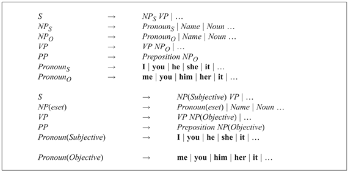
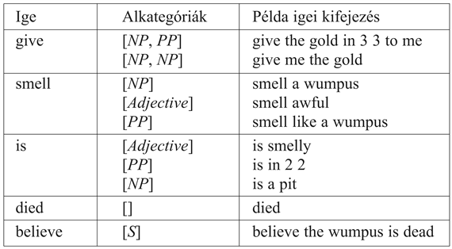
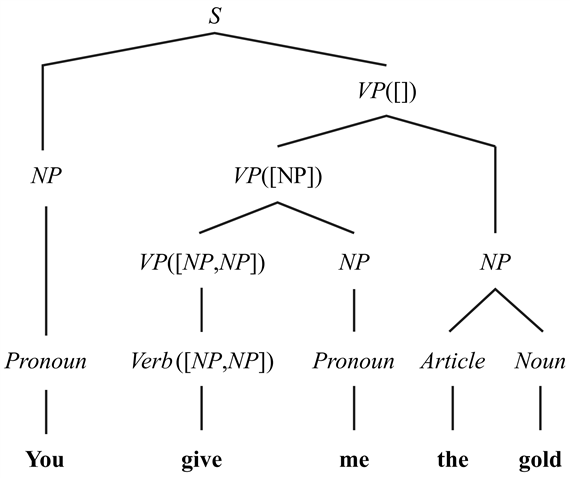

<?xml version="1.0" encoding="UTF-8" standalone="no"?>
<!DOCTYPE html PUBLIC "-//W3C//DTD XHTML 1.1//EN" "http://www.w3.org/TR/xhtml11/DTD/xhtml11.dtd">
<html xmlns="http://www.w3.org/1999/xhtml"><head><meta name="generator" content="DocBook XSL Stylesheets V1.76.1"/></head><body>

<h1 class="title"><a id="id761119"/>Kiterjesztett nyelvtanok</h1>

<a id="ID_921_oldal"/>
A 22.2. alfejezetben láttuk, hogy az ℰ0 egyszerű nyelvtana előállítja az angol nyelv „I smell a stench” és sok más mondatát. Sajnos azonban sok nem megengedett mondatot is előállít, mint például a „Me smell a stench”. Ezen probléma elkerülése érdekében a nyelvtanunknak tudnia kellene, hogy a „me” nem érvényes <em>NP</em> akkor, amikor a mondat alanya. A nyelvészek azt mondják, hogy az „I” névmás alanyesetű, míg a „me” tárgyesetű.[<a id="id761135" href="#ftn.id761135" class="footnote">228</a>] Ha figyelembe vesszük az eseteket, akkor rájövünk, hogy az ℰ0 nem környezetfüggetlen: nem igaz az, hogy minden <em>NP</em> minden mással egyenértékű, függetlenül a környezetétől. A probléma megoldására bevezethetünk olyan új kategóriákat, mint az <em>NPS</em> és <em>NPO</em> a tárgyas és alanyi főnévi kifejezésekre. Ezenkívül ketté kellene bontanunk a <em>Pronoun</em> kategóriát a <em>PronounS</em>-re (amelyik tartalmazza az „I”-t) és <em>PronounO</em>-ra (amelyik tartalmazza a „me”-t). A 22.11. ábra felső része megmutatja az esetegyeztetés teljes BNF nyelvtanát; az így kapott nyelvet ℰ1-nek nevezzük. Vegyük észre, hogy az összes <em>NP</em> szabályt meg kell kettőznünk, egyszer az <em>NPS</em>, másszor az <em>NPO</em> esetre.

<a id="id761195"/>
<strong>22.11. ábra - Felül: Az ℰ1<em> </em>egy BNF nyelvtana, amely kezeli az alanyi és a tárgyas esetet a főnévi kifejezésekben, és ezért annyira nem is generál túl. Az ℰ1 nyelvtanával megegyező részeket elhagytuk. Lent: Az ℰ1<em> </em>egy definit klóz nyelvtana (DCG).</strong>

Sajnos az ℰ1 még mindig túlgenerál. Az angol és sok más nyelv megköveteli az alany és a mondat fő igéjének <strong>egyeztetés</strong>ét (<strong>agreement</strong>). Például ha „I” az alany, akkor az „I smell” nyelvtanilag helyes, míg az „I smells” nem. Ha „it” az alany, akkor fordítva igaz. Az angolban az egyeztetésből származó különbségek minimálisak: a legtöbb igének egy alakja van egyes szám harmadik személyű alanyokra (he, she vagy it), és egy másik alakja az egyes és többes szám és a személyek minden más kombinációjára. Egy kivétel van: az „I am / you are / he is” három formával rendelkezik. Ha kombináljuk ezt a három különbségtételt az <em>NPS</em> és <em>NPO</em> különbségtétellel, akkor <em>NP</em> hat alakját kapjuk. Ahogy további különbözőségeket fedezünk fel, végül egy exponenciális sokaságot kapunk.

Az alternatív megközelítés a nyelvtan létező szabályainak <strong>kiterjesztés</strong>e (<strong>augmenting</strong>) új szabályok bevezetése helyett. Először megmutatjuk egy példán keresztül, hogy hogyan szeretnénk, hogy a kiterjesztett szabályok kinézzenek (a 22.11. ábra alsó fele), azután formálisan megadjuk, hogyan kell ilyen szabályokat értelmezni. A kiterjesztett szabályok nem záró kategóriák esetében megengedik <em>paraméterek</em> alkalmazását. A 22.11. ábra megmutatja, hogyan írhatjuk le az ℰ1 nyelvtant kiterjesztett szabályokkal. Az <em>NP</em> és <em>Pronoun</em> kategóriák rendelkeznek egy olyan paraméterrel, amely leírja az esetüket. (A főnevek nem rendelkeznek esettel az angolban, bár sok más nyelvben igen.) Az <em>S</em>-re vonatkozó szabályban az <em>NP</em>-nek alanyi esetűnek kell lennie, míg a <em>VP</em> és <em>PP</em> szabályokban tárgyasnak. Az <em>NP</em> szabály egy változót fogad paraméterként, az <em>eset</em>-et. A szándék az, hogy az <em>NP</em> tetszőleges esetű lehet, de ha átírjuk <em>Pronoun</em>-ra, akkor ugyanolyan esetűnek kell lennie. Egy változó ilyen használata – elkerülve a döntést, amikor a különbségtétel nem fontos – visszatartja a szabályhalmaz méretének a tulajdonságok számával arányosan exponenciális növekedését.

A kiterjesztés ezen formalizmusát <strong>definit klóz nyelvtan</strong>nak (<strong>definite clause grammar</strong>) vagy <strong>DCG</strong>-nek hívjuk, mivel minden nyelvtani szabály értelmezhető a Horn-logikában szereplő definit klózként.[<a id="id761328" href="#ftn.id761328" class="footnote">229</a>] Elsőként azt mutatjuk meg, hogy egy normális, kiterjesztés nélküli szabály hogyan értelmezhető definit klózként. Minden kategóriajelet karaktersorozatra vonatkozó predikátumnak tekintünk, így az <em>NP</em>(<em>s</em>) igaz, ha az <em>s</em> karaktersorozat egy <em>NP</em>-t formál. Az

<code class="code"><em>S </em>→<em> NP VP</em></code>

CFG-szabály a következő definit klóz rövidítése:

<code class="code"><em>NP</em>(<em>s</em>1) ∧ <em>VP</em>(<em>s</em>2) ⇒<em> S</em>(<em>s</em>1 + <em>s</em>2)</code>

<h3 class="title">Fontos</h3>
Itt <em>s</em>1 + <em>s</em>2 két karaktersorozat összefűzését jelenti, így ez a szabály azt mondja, hogy ha van egy <em>s</em>1 füzér, ami egy <em>NP</em> és egy <em>s</em>2 füzér, ami egy <em>VP</em>, akkor az összekapcsolásukkal keletkező füzér egy <em>S</em>, ami pontosan megegyezik azzal, ahogy a CFG-szabályt korábban értelmeztük. Fontos észrevennünk, hogy a <em>DCG-k lehetővé teszik számunkra, hogy az elemzésről mint logikai következtetésről beszéljünk</em>. Ez lehetővé teszi, hogy nyelvek és karaktersorozatok felett sok különböző módon következtessünk. Például ez azt jelenti, hogy egy lentről felfelé elemzést előrefelé következtetéssel, egy fentről lefelé elemzést pedig hátrafelé következtetéssel végezhetünk el. Azt is látni fogjuk, hogy ez azt is jelenti, hogy ugyanazt a nyelvtant elemzésre és generálásra is használhatjuk. 

A DCG-megközelítés igazi haszna az, hogy <em>kiterjeszthetjük</em> a kategóriaszimbólumokat a karakterfüzéreken kívül további argumentumokkal. Például a

<code class="code"><em>NP</em>(<em>eset</em>)<em> </em>→ <em>Pronoun</em>(<em>eset</em>)</code>

szabály a következő definit klóz rövidítése:

<code class="code"><em>Pronoun</em>(<em>eset, s</em>1) ⇒ <em>NP</em>(<em>eset, s</em>1)</code>

Eszerint ha az <em>s</em>1 füzér az <em>eset </em>változó által meghatározott esetű <em>Pronoun</em>, akkor <em>s</em>1 egy ugyanolyan esetű <em>NP</em> is. Általánosságban egy kategóriaszimbólumot tetszőleges számú argumentummal kiterjeszthetünk, és az argumentumok egyben paraméterek, amelyek a szokásos Horn-klóz következtetés egyesítésének tárgyai.

Van ára is ennek a kényelemnek: a nyelvtan íróját ellátjuk a tételbizonyítók teljes erejével, így feladjuk a szintaktikai elemzők által garantált <em>O</em>(<em>n</em>3)-at; a kiterjesztésekkel kiegészített elemzés lehet NP-teljes, vagy akár eldönthetetlen, a kiterjesztésektől függően.

Néhány további trükk szükséges ahhoz, hogy a DCG működjön; például szükségünk van egy módszerre, hogy záró szimbólumokat adhassunk meg, és kényelmes egy olyan módszert is alkalmaznunk, amely <em>nem</em> engedi az automatikus karaktersorozat-argumentum hozzáadását. Mindent összerakva, a definit klóz nyelvtant a következőképpen definiálhatjuk:

<ul class="itemizedlist"><li class="listitem">
Az <em>X</em> → <em>Y Z </em>… jelölés fordítása <em>Y</em>(<em>s</em>1) ∧ <em>Z</em>(<em>s</em>2) ∧ … ⇒ <em>X</em>(<em>s</em>1 +<em> s</em>2 +<em> …</em>)
</li><li class="listitem">
Az <em>X </em>→ <em>Y </em>|<em> Z </em>| … jelölés fordítása <em>Y</em>(<em>s</em>) ∨ <em>Z</em>(<em>s</em>) ∨ … ⇒ <em>X</em>(<em>s</em>)
</li><li class="listitem">
Mindkét megelőző szabályban bármelyik <em>Y</em> nem záró szimbólum egy vagy több argumentummal kiterjeszthető. Bármely argumentum lehet változó, konstans vagy argumentumok függvénye. A fordításban ezen argumentumok megelőzik a karakterfüzér argumentumot (például az <em>NP</em>(<em>eset</em>)<em> </em>fordítása <em>NP</em>(<em>eset, s</em>1)).
</li><li class="listitem">
A {<em>P</em>(…)} jelölés szerepelhet egy szabály jobb oldalán, és változás nélkül átalakul <em>P</em>(…)-vé. Ez lehetővé teszi a nyelvtan írója számára, hogy egy <em>P</em>(…)-re vonatkozó tesztet anélkül elhelyezzen, hogy ahhoz automatikusan hozzáadódjon a karakterfüzér-argumentum.
</li><li class="listitem">
Az <em>X</em> → <strong>word</strong> jelölés fordítása <em>X</em>([<em>word</em>]).
</li></ul>

Az alany–ige egyeztetése szintén kezelhető kiterjesztéssel, de ezt a 22.2. feladatra halasztjuk. Helyette egy nehezebb problémával foglalkozunk: az igék alkategóriákba osztásával.

<h2 class="title"><a id="id761700"/>Igék alkategóriákba osztása</h2>

Az ℰ1 nyelv fejlettebb az ℰ0-hoz képest, de még ez is túlgenerál. Az egyik probléma abban a módban rejlik, ahogy az igei kifejezéseket összefűzi. El akarjuk fogadni a „give me the gold” és a „go to 1,2” jellegű igés kifejezéseket. Ezek mindegyike létezik az ℰ1-ben, de sajnos éppígy létezik a „go me the gold” és a „give to 1,2” is. Az ℰ2 nyelv megszünteti ezeket a <em>VP</em>-ket úgy, hogy egyértelműen megadja, melyik igét melyik kifejezés követheti. Ezt az igék <strong>alkategória</strong> (<strong>subcategorization</strong>) listájának hívjuk. Az elképzelés az, hogy a <em>Verb</em> kategóriát alkategóriákra bontjuk – egy a tárggyal nem rendelkezők igék számára, egy az egyetlen tárggyal rendelkezőkre és így tovább.

Az ötlet megvalósításához minden egyes igéhez rendelünk egy <strong>alkategória-listá</strong>t (<strong>subcategorization list</strong>), amely a <strong>kiegészítő</strong>it (<strong>complement</strong>s) tartalmazza. A kiegészítő olyan kötelező kifejezés, amely az igei kifejezésen belül követi az igét. Azaz a „give the gold to me”-ben az <em>NP</em> a „the gold” és a „to me” <em>PP</em> a „give” kiegészítője.[<a id="id761770" href="#ftn.id761770" class="footnote">230</a>] Ezt leírhatjuk így:

<code class="code"><em>Verb</em>([<em>NP</em>,<em> PP</em>]) → <em>give </em>| <em>hand </em>| …</code>

Lehetséges, hogy egy igéhez több, különböző alkategóriára bontás létezik, csakúgy, mint ahogy egy szó számára is lehetséges, hogy több, különböző kategóriába tartozzon. Valójában a „give” rendelkezik az [<em>NP</em>,<em> NP</em>] alkategória-listával is, mint a „Give me the gold” mondatban. Ezt ugyanúgy kezelhetjük, mint minden más többértelműséget. A 22.12. ábra ad pár példát igékre és alkategória-listáikra (angolul röviden <strong>subcat</strong>).

<a id="id761824"/>
<strong>22.12. ábra - Példák igékre az alkategória-listáikkal együtt</strong>

Három dolgot teszünk az igei alkategóriák nyelvtanba illesztéséhez. Az első lépés a <em>VP</em> kategória kiterjesztése egy alkategória-argumentummal, <em>VP</em>(<em>subcat</em>), amely felsorolja azokat a komponenseket, amikkel teljes <em>VP</em> formálható. Például a „give” teljes <em>VP</em>-vé tehető [<em>NP</em>,<em> PP</em>] hozzáadásával, „give the gold” teljessé tehető [<em>PP</em>] hozzáadásával, és a „give the gold to me” már teljes; alkategória-listája üres, []. Ez a következő szabályokat adja <em>VP</em>-re:

<table border="0"><colgroup><col width="90.5pt" class="col1"/><col width="39.1pt" class="col2"/><col width="191.9pt" class="col3"/></colgroup><tbody><tr><td style="text-align: justify" valign="top">
<code class="code"><em>VP</em>(<em>subcat</em>)</code>
</td><td style="text-align: justify" valign="top">
<code class="code">→</code>
</td><td style="text-align: justify" valign="top">
<code class="code"><em>Verb</em>(<em>subcat</em>)</code>
</td></tr><tr><td style="text-align: justify" valign="top"> </td><td style="text-align: justify" valign="top">
<code class="code">|</code>
</td><td style="text-align: justify" valign="top">
<code class="code"><em>VP</em>(<em>subcat + </em>[<em>NP</em>]) <em>NP</em>(<em>Objective</em>)</code>
</td></tr><tr><td style="text-align: justify" valign="top"> </td><td style="text-align: justify" valign="top">
<code class="code">|</code>
</td><td style="text-align: justify" valign="top">
<code class="code"><em>VP</em>(<em>subcat</em> + [<em>Adjective</em>]) <em>Adjective</em></code>
</td></tr><tr><td style="text-align: justify" valign="top"> </td><td style="text-align: justify" valign="top">
<code class="code">|</code>
</td><td style="text-align: justify" valign="top">
<code class="code"><em>VP</em>(<em>subcat</em> + [<em>PP</em>]) <em>PP</em></code>
</td></tr></tbody></table>

Az utolsó sor így olvasható: „Adott <em>subcat </em>alkategória-listával rendelkező <em>VP</em> formálható egy beágyazott <em>VP</em>-ből, amit egy <em>PP</em> követ, akkor, ha a beágyazott <em>VP</em> rendelkezik egy olyan alkategória-listával, ami a <em>subcat</em> lista elemeivel kezdődik és <em>PP</em>-vel folytatódik.” Például egy <em>VP</em>([])-t egy <em>VP</em>([<em>PP</em>]) és az azt követő <em>PP</em> alkot. Az első sor szerint egy <em>VP</em>, amely <em>subcat</em> alkategória-listával rendelkezik, formálható egy ugyanolyan alkategória-listával rendelkező <em>Verb</em> segítségével. Például a <em>VP</em>([<em>NP</em>]) létrehozható egy <em>Verb</em>([<em>NP</em>]) által. Egy példa ilyen igére a „grab”, tehát a „grab the gold” egy <em>VP</em>([]).

A második lépés az <em>S</em>-re vonatkozó szabály megváltoztatása úgy, hogy szükségessé tegyen egy igei kifejezést, melynek összes kiegészítése megvan, és így [] alkategória-listája van. Ez azt jelenti, hogy az „I grab the gold” érvényes mondat, de a „You give” nem az. Az új szabály,

<code class="code"><em>S </em>→ <em>NP</em>(<em>Subjective</em>) <em>VP</em>([])</code>

a következőképpen olvasható: „Egy mondatot összeállíthatunk egy alanyi esetben álló <em>NP</em>-ből és az azt követő, üres alkategória-listájú <em>VP</em>-ből.” A 22.13. ábra bemutat egy elemzési fát, amelyik ezt a nyelvtant használja.

<a id="id762173"/>
<strong>22.13. ábra - A „You give me the gold (Ideadod nekem az aranyat)” elemzési fája, amely bemutatja az ige és az igei kifejezés alkategóriáit</strong>

A harmadik lépésben gondolunk arra, hogy a kiegészítések mellett az igei (és egyéb) kifejezések <strong>segédszavak</strong>at (<strong>adjunct</strong>s) is kaphatnak, melyek nem egy igéhez kötődő kifejezések, hanem mindenféle igei kifejezésben feltűnhetnek. Az időt és helyet jelképező kifejezések segédszavak, mivel szinte minden cselekvés vagy esemény rendelkezhet időponttal és helyszínnel. Például a „now” határozószó az „I smell a wumpus now” mondatban és az „on Tuesday” <em>PP</em> a „give me the gold on Tuesday”-ban segédszavak. Íme, két szabály a segédszavak megengedéséhez:

<table border="0"><colgroup><col width="76.3pt" class="col1"/><col width="35.5pt" class="col2"/><col width="127.6pt" class="col3"/></colgroup><tbody><tr><td style="text-align: justify" valign="top">
<code class="code"><em>VP</em>(<em>subcat</em>)</code>
</td><td style="text-align: justify" valign="top">
<code class="code">→</code>
</td><td style="text-align: justify" valign="top">
<code class="code"><em>VP</em>(<em>subcat</em>) <em>PP</em></code>
</td></tr><tr><td style="text-align: justify" valign="top"> </td><td style="text-align: justify" valign="top">
<code class="code">|</code>
</td><td style="text-align: justify" valign="top">
<code class="code"><em>VP</em>(<em>subcat</em>) <em>Adverb</em></code>
</td></tr></tbody></table>

<h2 class="title"><a id="id762305"/>Kiterjesztett nyelvtanok generálóképessége</h2>

Minden kiterjesztett szabály egy <strong>szabályséma</strong> (<strong>rule schema</strong>), mely a szabályok egy olyan halmazát jelenti, amit a kiterjesztett alkotórészek értékeinek minden lehetséges kombinációjával állítunk elő. A kiterjesztett nyelvtanok generálóképessége a kombinációk számától függ. Ha véges számú van, akkor a kiterjesztett nyelvtan ekvivalens egy környezetfüggetlen nyelvtannal: a szabályséma felcserélhető egyedi környezetfüggetlen szabályokkal. Azonban ha végtelen számú van, akkor a kiterjesztett nyelvtanok nem környezetfüggetlen nyelveket is leírhatnak. Például az <em>anbncn</em> környezetfüggő nyelv leírható a következő kiterjesztett nyelvtannal:

<code class="code"><em>S</em>(<em>n</em>) → <em>A</em>(<em>n</em>) <em>B</em>(<em>n</em>) <em>C</em>(<em>n</em>)</code>

<table border="0"><colgroup><col width="62.1pt" class="col1"/><col width="99.3pt" class="col2"/></colgroup><tbody><tr><td style="text-align: justify" valign="top">
<code class="code"><em>A</em>(1) → <em>a</em></code>
</td><td style="text-align: justify" valign="top">
<code class="code"><em>A</em>(<em>n + </em>1) → <em>a A</em>(<em>n</em>)</code>
</td></tr><tr><td style="text-align: justify" valign="top">
<code class="code"><em>B</em>(1) → <em>b</em></code>
</td><td style="text-align: justify" valign="top">
<code class="code"><em>B</em>(<em>n + </em>1) → <em>b B</em>(<em>n</em>)</code>
</td></tr><tr><td style="text-align: justify" valign="top">
<code class="code"><em>C</em>(1) → <em>c</em></code>
</td><td style="text-align: justify" valign="top">
<code class="code"><em>C</em>(<em>n + </em>1) → <em>c C</em>(<em>n</em>)</code>
</td></tr></tbody></table>

 

[<a id="ftn.id761135" href="#id761135" class="para">228</a>]  Az angolban az alanyesetre a „subjective case” mellett alkalmanként a „nominative case” kifejezést is használják. Hasonlóképpen a tárgyesetre az „objective case” mellett az „accusative case” is használatos esetenként. Sok nyelvnek van részes esete is az indirekt tárgy pozícióban álló szavakra.

[<a id="ftn.id761328" href="#id761328" class="para">229</a>]  Idézze fel, hogy a definit klóz, amit ha implikációs formában írunk, pontosan egy atomot tartalmaz a következmény részében, és nulla vagy több atom konjunkcióját a feltétel részében. Két példa az <em>A</em> ∧ <em>B </em>∧ ⇒ <em>C</em>, illetve önmagában a <em>C</em>.

[<a id="ftn.id761770" href="#id761770" class="para">230</a>]  Ez a <em>kiegészítő (complement) </em>egyik definíciója, de vannak más terminológiát használó szerzők is. Egyesek szerint az ige alanya is egy kiegészítő. Mások szerint csak az elöljárói kifejezés kiegészítő, és a főnévi kifejezést egy <strong>érvelés</strong>nek (<strong>argument</strong>) kell hívni.

</body></html>
