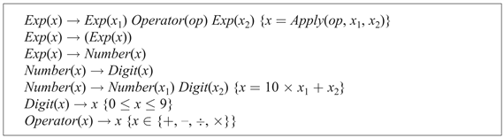
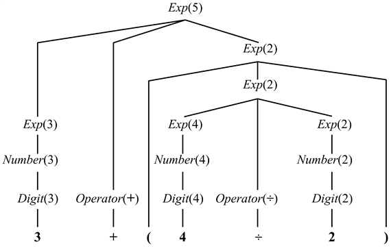
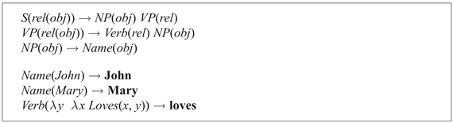
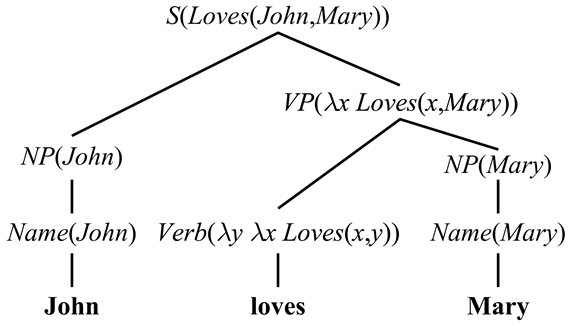
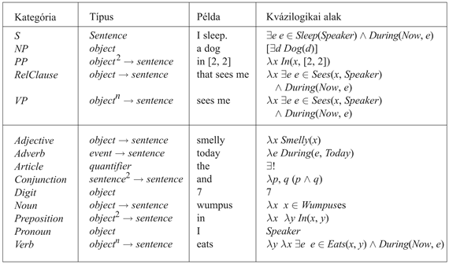
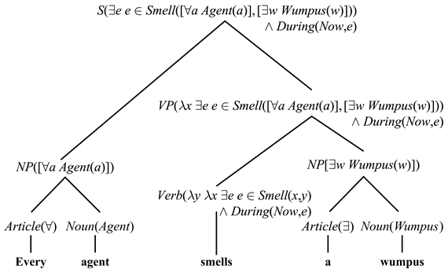
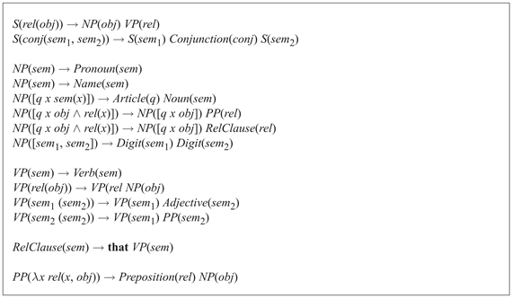

<?xml version="1.0" encoding="UTF-8" standalone="no"?>

<html xmlns="http://www.w3.org/1999/xhtml"><head><meta name="generator" content="DocBook XSL Stylesheets V1.76.1"/></head><body>

<h1 class="title"><a id="id762503"/>Szemantikai értelmezés</h1>

Eddig csak a nyelv szintaktikai analízisét vizsgáltuk. Ebben a fejezetben rátérünk a <strong>szemantiká</strong>ra (<strong>semantics</strong>) – a megnyilatkozás (utterance) <em>jelentésének</em> kinyerésére. Ebben a fejezetben az elsőrendű logikát használjuk reprezentációs nyelvként, így a szemantikai értelmezés egy FOL kifejezés és egy nyelvi kifejezés összerendelésének a folyamata. Intuitív módon közelítve, a „the wumpus” kifejezés jelentése az a nagy, szőrös szörnyeteg, amit a logikában a <em>Wumpus</em>1 logikai kifejezéssel jelzünk, és a „the wumpus is dead” jelentése a <em>Dead</em>(<em>Wumpus</em>1) logikai állítás. Ez a fejezet ezt az intuíciót pontosítja. Egy egyszerű példával kezdünk: a négyzetháló helyszíneit leíró szabállyal:

<code class="code"><em>NP </em>→ <em>Digit Digit</em></code>

Kiterjesztjük a szabályt úgy, hogy minden összetevőhöz egy argumentumot illesztünk, amely az összetevő szemantikáját reprezentálja. A következőt kapjuk:

<code class="code"><em>NP</em>([<em>x</em>, <em>y</em>])<em> </em>→ <em>Digit</em>(<em>x</em>)<em> Digit</em>(<em>y</em>)</code>

E szerint egy karaktersorozat, amely egy <em>x</em> szemantikájú számjegyből és egy azt követő <em>y</em> szemantikájú számjegyből áll, egy [<em>x</em>, <em>y</em>] szemantikával rendelkező <em>NP</em>-t formál, amely a háló egy négyzetére alkalmazott jelölésünk.

Vegyük észre, hogy a teljes <em>NP</em> szemantikája nagymértékben az összetevőinek szemantikáján alapszik. Már láttuk a <strong>kompozíciós szemantika</strong> (<strong>compositional semantics</strong>) ezen ötletét korábban: a logikában a <em>P </em>∧ <em>Q</em> jelentését <em>P</em>, <em>Q</em> és ∧ határozzák meg; az aritmetikában az <em>x</em> + <em>y</em> jelentését <em>x</em>, <em>y</em> és a + határozzák meg. A 22.14. ábra megmutatja, hogy a DCG jelölésrendszer hogyan használható egy aritmetikai kifejezéseket leíró nyelvtan szemantikával történő kiterjesztésére, és a 22.15. ábra mutatja a 3 + (4 ÷ 2) ezen nyelvtan alapján kapott elemzési fáját. Az elemzési fa gyökere <em>Exp</em>(5), egy kifejezés, melynek szemantikai értelmezése 5.

<a id="id762651"/>
<strong>22.14. ábra - Szemantikával kibővített nyelvtan az aritmetikai kifejezésekre. Minden <em>xi</em> változó egy öszszetevő szemantikáját reprezentálja. Vegye észre, hogy a {<em>teszt</em>} jelölést használjuk olyan logikai predikátumok definiálására, amelyeket ki kell elégíteni, de nem összetevők!</strong>

<a id="id762670"/>
<strong>22.15. ábra - A „3 + (4 ÷ 2)” füzér elemzési fája szemantikai értelmezésekkel</strong>

<h2 class="title"><a id="id762679"/>Az angol nyelv egy részletének szemantikája</h2>

Most már készen állunk arra, hogy az angol nyelv egy kis részhalmazára megírjuk a szemantikai kibővítést. Első lépésként azzal kezdünk, hogy melyik kifejezéshez milyen szemantikai értelmezéseket akarunk rendelni. A „John loves Mary” egyszerű mondatot fogjuk vizsgálni. A „John” <em>NP</em> szemantikus értelmezése a <em>John</em> logikai term kell legyen, és a mondatnak, mint egésznek, a <em>Loves</em>(<em>John</em>, <em>Mary</em>) logikai állítás kell a szemantikai értelmezése legyen. Ennyi világosnak látszik. A bonyolultabb rész a „loves Mary” <em>VP</em>. Ezen kifejezés szemantikai értelmezése se nem logikai term, se nem teljes logikai mondat. Intuitív módon kezelhetjük úgy, hogy a „loves Mary” egy leírás, ami lehet, hogy egy adott személyre vonatkozik, de lehet, hogy nem. (Jelen esetben Johnra vonatkozik.) Ez azt jelenti, hogy a „loves Mary” egy <strong>predikátum</strong> (<strong>predicate</strong>), amit ha egy személyt reprezentáló termmel kombinálunk (a személy, aki szeret), akkor egy teljes logikai mondatot állít elő. A <em>λ</em> jelölésrendszert használva (lásd 7.2. alfejezet) a „loves Mary”-t a következő predikátumként reprezentálhatjuk:

<code class="code"><em>λx</em>  <em>Loves</em>(<em>x</em>, <em>Mary</em>)</code>

Ezután szükségünk van egy szabályra, amely szerint „egy <em>obj</em> szemantikájú <em>NP</em>, melyet egy <em>rel</em> szemantikájú <em>VP</em> követ, együtt egy olyan mondatot eredményez, amelynek szemantikája a <em>rel</em> alkalmazása az <em>obj</em>-ra:

<code class="code"><em>S</em>(<em>rel</em>(<em>obj</em>)) →<em> NP</em>(<em>obj</em>) <em>VP</em>(<em>rel</em>)</code>

A szabály szerint a „John loves Mary” szemantikai értelmezése

<code class="code">(<em>λx</em>  <em>Loves</em>(<em>x</em>, <em>Mary</em>))(<em>John</em>)</code>

ami megfelel a <em>Loves</em>(<em>John</em>, <em>Mary</em>)-nek.

<a id="id767692"/>
<strong>22.16. ábra - Egy nyelvtan, amely képes egy elemzési fa és szemantikai értelmezés levezetésére a „John loves Mary” (és három másik) mondat számára</strong>

<a id="id767701"/>
<strong>22.17. ábra - A „John loves Mary” füzér elemzési fája szemantikai értelmezésekkel</strong>

A szemantika hátralevő része az eddigi választásainkból egyenesen következik. Mivel a <em>VP</em>-ket predikátumként reprezentáljuk, jó ötlet konzisztens módon az igéket is predikátumként ábrázolni. A „loves” ige reprezentációja <em>λy</em> <em>λx </em> <em>Loves</em>(<em>x</em>, <em>y</em>) predikátum, ami például egy <em>Mary</em> argumentum esetén <em>λx </em> <em>Loves</em>(<em>x</em>, <em>Mary</em>) predikátummal tér vissza.

A <em>VP</em> → <em>Verb NP</em> szabály alkalmazza az ige szemantikai értelmezéséből kapott predikátumot az <em>NP</em> (szemantikai) értelmezéséből kapott objektumra a teljes <em>VP</em> szemantikai értelmezésének kinyerésére. Végül a 22.16. ábrán látható nyelvtant és a 22.17. ábrán található elemzési fát kapjuk.

<h2 class="title"><a id="id767771"/>Idő és igeidő</h2>

Most tegyük fel, hogy a „John loves Mary” és a „John loved Mary” közötti különbséget szeretnénk reprezentálni. Az angol igeidőket (past [múlt], present [jelen] és future [jövő]) használ egy esemény relatív idejének jelzésére. Egy jó választás az események idejének reprezentálására a 10.3. alfejezet eseménykalkulus jelölésrendszere. Az eseménykalkulussal a két mondatunk a következőképpen értelmezhető:

<code class="code"><em>e </em>∈ <em>Loves</em>(<em>John</em>, <em>Mary</em>) ∧ <em>During</em>(<em>Now</em>, <em>e</em>)</code>

<code class="code"><em>e </em>∈ <em>Loves</em>(<em>John</em>, <em>Mary</em>) ∧ <em>After</em>(<em>Now</em>, <em>e</em>)</code>

Eszerint a „loves” és „loved” szavakra vonatkozó két lexikai szabályunk a következő lehet:

<code class="code"><em>Verb(λy λx e </em>∈ <em>Loves</em>(<em>John</em>, <em>Mary</em>) ∧ <em>During</em>(<em>Now</em>, <em>e)</em>) → <em>loves</em></code>

<code class="code"><em>Verb(λy λx e </em>∈ <em>Loves</em>(<em>x</em>, <em>y</em>) ∧ <em>After</em>(<em>Now</em>, <em>e)</em>) → <em>loved</em></code>

E változástól eltekintve a nyelvtannal kapcsolatban minden más változatlan marad, ami ösztönző hír; azt sugallja, hogy helyes úton járunk, ha ilyen könnyedén bonyolíthatjuk például az igeidővel (bár csak érintettük az időre és igeidőre vonatkozó teljes nyelvtan felszínét). E bemelegítésként elért sikerrel készen állunk egy sokkal nehezebb reprezentációs probléma kezelésére.

<h2 class="title"><a id="id767897"/>Kvantifikálás</h2>

Nézzük a következő példát: „Every agent smells a wumpus.” A mondat valójában többértelmű: a javasolt értelmezés szerint az ágensek különböző wumpusokat észlelhetnek, de egy alternatív jelentés szerint csak egy wumpus van, akit mindenki érez.[<a id="id767903" href="#ftn.id767903" class="footnote">231</a>] A két interpretációt a következő módon ábrázolhatjuk:

<code class="code">∀<em>a</em>  <em>a </em>∈ <em>Agents</em> ⇒ ∃<em>w</em>  <em>w </em>∈ <em>Wumpuses</em> ∧ ∃<em>e</em> <em>e</em> ∈ <em>Smell</em>(<em>a</em>, <em>w</em>) ∧ <em>During</em>(<em>Now</em>, <em>e</em>)</code>

<code class="code">∃<em>w</em> <em> w </em>∈ <em>Wumpuses </em>∀<em>a</em>  <em>a </em>∈ <em>Agents</em> ⇒ ∃<em>e</em> <em>e</em> ∈ <em>Smell</em>(<em>a</em>, <em>w</em>) ∧ <em>During</em>(<em>Now</em>, <em>e</em>)</code>

A többértelműség problémáját elhalasztjuk későbbre, most csak az első értelmezést vizsgáljuk. Megpróbáljuk az összetevői szerint elemezni, <em>NP</em> és <em>VP</em> komponensekre bontva:

<code class="code">Every agent	<em>NP</em>(∀<em>a</em>  <em>a </em>∈ <em>Agents</em> ⇒ <em>P</em>)</code>

<code class="code">smells a wumpus    <em>VP</em>(∃<em>w</em>  <em>w </em>∈<em>Wumpuses</em> ∧ ∃<em>e</em> (<em>e</em> ∈ <em>Smell</em>(<em>a</em>, <em>w</em>) ∧ <em>During</em>(<em>Now</em>, <em>e</em>))</code>

Máris két nehézség támadt. Először is, a teljes mondat szemantikája, úgy tűnik, megegyezik az <em>NP</em> szemantikájával, melyben a <em>VP</em> tölti ki a <em>P</em> rész szemantikáját. Ez azt jelenti, hogy a mondat szemantikáját nem formálhatjuk <em>rel</em>(<em>obj</em>) segítségével. Megtehetjük <em>obj</em>(<em>rel</em>) által, ami (legalábbis első ránézésre) kicsit különösnek tűnik. A második probléma az, hogy az <em>a</em> változót a <em>Smell</em> reláció argumentumaként kell megkapnunk. Más szavakkal, a mondat szemantikája a <em>VP</em> szemantikájának megfelelő <em>NP</em> argumentumrekeszbe való illesztésével adódik, miközben az <em>NP</em>-ben található <em>a</em> változót is betesszük a <em>VP</em> szemantika megfelelő argumentumrekeszébe. Úgy tűnik, mintha két funkcionális kompozíciónk lenne, és ez azt sugallja, hogy meglehetősen könnyű lesz összezavarodni. A bonyolultság abból a tényből ered, hogy a szemantikai struktúra nagyon különböző a szintaktikaitól.

Hogy elkerüljék ezt a zűrzavart, sok modern nyelvtan más módszert választ. Definiálnak egy <strong>közbülső formá</strong>t (<strong>intermediate form</strong>) a szintaxis és a szemantika közötti közvetítésre. A közbülső formának két kulcstulajdonsága van. Egyrészt strukturálisan hasonló a mondat szintaxisához, így könnyen előállítható kompozíciós eszközökkel. Másrészt elég információt tartalmaz, és így lefordítható egy reguláris elsőrendű logikai mondattá. Mivel a szintaktikai és a logikai alak között helyezkedik el, néha <strong>kvázilogikai formá</strong>nak (<strong>quasi-logical form</strong>)[<a id="id768173" href="#ftn.id768173" class="footnote">232</a>] nevezik. A fejezetben egy kvázilogikai formát használunk, mely a teljes elsőrendű logikát tartalmazza, lambdakifejezéssekkel és egy új konstrukcióval kiegészítve, amit <strong>kvantifikált term</strong>nek (<strong>quantified term</strong>) nevezünk. Az „every agent” szemantikai értelmezését jelentő kvantifikált term a következőképpen írható:

<code class="code">[∀<em>a </em> <em>a</em> ∈ <em>Agents</em>]</code>

Ez olyan, mint egy logikai mondat, de ugyanolyan módon használjuk, mint a logikai termeket. Az „Every agent smells a wumpus” kvázilogikai értelmezése:

<code class="code">∃<em>e</em> (<em>e</em> ∈ <em>Smell</em>([∀<em>a a </em>∈ <em>Agents</em>], [∃<em>w</em> <em>w </em>∈<em>Wumpuses</em>]) ∧ <em>During</em>(<em>Now</em>, <em>e</em>))</code>

A kvázilogikai alak generálásához szabályaink közül sok változatlan marad. Az <em>S</em>-re vonatkozó szabály <em>S</em> szemantikáját még mindig <em>rel</em>(<em>obj</em>) segítségével adja meg. Bizonyos szabályok változnak; az „a” szóra vonatkozó lexikai szabály a következő:

<code class="code"><em>Article</em>(∃) → <em>a</em></code>

míg a névelő és főnév kombinációjának szabálya:

<code class="code"><em>NP</em>([<em>q x sem</em>(<em>x</em>)]) → <em>Article</em>(<em>q</em>) <em>Noun</em>(<em>sem</em>)</code>

E szerint az <em>NP</em> szemantikája egy kvantifikált term – ahol a kvantifikálást a névelő határozza meg – egy új <em>x</em> változóval és egy propozícióval, amely a főnév szemantikáját az <em>x</em> változóra alkalmazza. Az <em>NP</em>-re vonatkozó további szabályok hasonlók. A 22.18. ábra mutatja be a szemantikai típusokat, és példát ad minden egyes szintaktikai kategóriára a kvázilogikai ábrázolás szerint. A 22.19. ábra az „Every agent smells a wumpus” e megközelítés szerinti elemzését mutatja, a 22.20. pedig a teljes nyelvtant.

Ezek után át kell alakítanunk a kvázilogikai formát valódi elsőrendű logikaivá a kvantifikált termek igazi term-mé alakításával. Ezt egy egyszerű szabállyal tesszük meg: minden egyes <em>QLF</em> kvázilogika formán belüli [<em>q x P</em>(<em>x</em>)] kvantifikált termet a cseréljük ki <em>x</em>-re, és cseréljük a <em>QLF</em>-et <em>q x P</em>(<em>x</em>) <em>op</em> <em>QLF </em>formára, ahol az <em>op</em> operátor ⇒ akkor, ha a <em>q</em> ∀, és ∧, amennyiben a <em>q </em>∃ vagy ∃!. Például az „Every dog has a day (Minden kutyának van egy napja)” mondat a következő kvázilogikai formával rendelkezik:

<code class="code">∃<em>e </em>(<em>e </em>∈<em>  Has</em>([∀<em>d  d </em>∈ <em>Dogs</em>], [∃<em>a  a </em>∈ <em>Days</em>], <em>Now</em>))</code>

Nem specifikáltuk, hogy a két kvantifikált term melyikét kell elsőként elővenni, így valójában két lehetséges értelmezés van:

<code class="code">∀<em>d </em> <em>d </em>∈ <em>Dogs</em> ⇒ ∃<em>a</em>  <em>a </em>∈ <em>Days</em> ∧ ∃<em>e  e</em> ∈ <em>Has</em>(<em>d</em>, <em>a</em>, <em>Now</em>)</code>

<code class="code">∃<em>a</em>  <em>a</em> ∈ <em>Day</em>s ∧ ∀<em>d</em>  <em>d </em>∈ <em>Dogs</em> ⇒ ∃<em>e </em> <em>e</em> ∈ <em>Has</em>(<em>d</em>, <em>a</em>, <em>Now</em>)</code>

<a id="id768496"/>
<strong>22.18. ábra - Minden szintaktikai kategória kvázilogikai formájú kifejezésének típusát mutató tábla. A <em>t</em> → <em>r</em> jelölés egy függvényt takar, amely egy <em>t</em> típusú argumentumot fogad, és <em>r </em>típusú eredménnyel tér vissza. Például a <em>Preposition</em> szemantikai típusa <em>object</em>2<em> </em>→<em> sentence</em>, ami azt jelenti, hogy az elöljárószó szemantikája egy függvény, amelyet ha két logikai objektumra alkalmazunk, akkor egy logikai mondatot eredményez.</strong>

<a id="id768535"/>
<strong>22.19. ábra - Az „Every agent smells a wumpus” mondat elemzési fája, amely mind a szintaktikai struktúrát, mind a szemantikai értelmezéseket mutatja</strong>

<a id="id768545"/>
<strong>22.20. ábra - Szemantikával ellátott nyelvtan kvázilogikai formában</strong>

Az első szerint minden kutyának megvan a maga napja, míg a második szerint van egy különleges nap, ami minden kutyára ugyanaz. A kettő közötti választás a többértelműség feloldásának feladata. A kvantifikált termek balról jobbra sorrendje gyakran illeszkedik a kvantifikálók balról jobbra sorrendjére, de más tényezők is számítanak. A kvázilogikai alak előnye az, hogy tömören reprezentálja az összes lehetőséget. A hátránya pedig az, hogy nem segíti a választást közöttük; amihez szükségünk van a többértelműség feloldásának teljes erejére az összes tényt felhasználva.

<h2 class="title"><a id="id768557"/>Pragmatikus értelmezés</h2>

Megmutattuk, hogy egy ágens hogyan képes észlelni egy szófüzért, és hogyan képes egy nyelvtant használni a lehetséges szemantikai értelmezések halmazának előállítására. Most annak a problémáját vizsgáljuk, hogy az értelmezés hogyan tehető teljessé az egyes jelöltek értelmezéshez az adott szituációt leíró kontextusfüggő információk hozzáadásával.

A gyakorlati információra legnyilvánvalóbban a <strong>referenciális index</strong>ek (<strong>indexical</strong>s) feloldásához van szükség, amelyek közvetlenül az adott szituációra utaló kifejezések. Például az „I am in Boston today (Ma Bostonban vagyok)” mondatban az „I” és „today” referenciális indexek értelmezése attól függ, hogy ki és mikor ejtette ki a mondatot. A referenciális indexeket „konstansokkal” (mint például a <em>Speaker</em>) reprezentáljuk, amelyek valójában <strong>változó dolgok</strong> (<strong>fluents</strong>) – azaz a szituációtól függnek. A hallgatónak, aki észleli a szólásaktust, azt is észlelnie kell, hogy ki a beszélő, és felhasználja ezt az információt a referenciális indexek feloldására. Például a hallgató tudhatja, hogy <em>T</em>((<em>Speaker</em> = <em>AgentB</em>), <em>Now</em>).

Egy felszólítás, mint például a „go to 2, 2” implicit módon a hallgatóra vonatkozik. Eddig az <em>S</em> nyelvtanunk csak deklaratív mondatokat írt le. Könnyen kiterjeszthetjük felszólítások kezelésére.[<a id="id768611" href="#ftn.id768611" class="footnote">233</a>]

A felszólítást olyan <em>VP</em> segítségével formálhatjuk, ahol az alany implicit módon a hallgató. Meg kell különböztetnünk a felszólításokat az állításoktól, ezért megváltoztatjuk az <em>S</em>-re vonatkozó szabályokat a szólásaktus típusának beillesztésével a kvázilogikai formába:

<code class="code"><em>S</em>(<em>Statementl</em>(<em>Speaker</em>,<em> rel</em>(<em>obj</em>)))  → <em>NP</em>(<em>obj</em>) <em>VP</em>(<em>rel</em>)</code>

<code class="code"><em>S</em>(<em>Command</em>(<em>Speaker</em>,<em> rel</em>(<em>Hearer</em>))) → <em>VP</em>(<em>rel</em>)</code>

Így a „go to 2, 2” kvázilogikai alakja:[<a id="id768715" href="#ftn.id768715" class="footnote">234</a>]

<code class="code"><em>Command</em>(∃<em>e</em> <em>e </em>∈ <em>Go</em>(<em>Hearer, </em>[2, 2]))</code>

<h2 class="title"><a id="id768766"/>Nyelv generálása DCG-kkel</h2>

Eddig egy nyelv <em>elemzésével</em> foglalkoztunk, nem a generálásával. A generálás hasonlóan gazdag téma. A megfelelő megnyilatkozás kiválasztása egy állítás kifejezésére sok hasonló választást von maga után, mint egy megnyilatkozás elemzése.

Emlékezzünk vissza, hogy a DCG egy logikai programozási rendszer, amely kényszereket határoz meg egy karaktersorozat és annak elemzése között. Tudjuk, hogy az <em>Append</em> predikátum logikai programozási definíciója felhasználható annak közlésére is, hogy az <em>Append</em>([1, 2], [3],<em> x</em>) esetében <em>x </em>=<em> </em>[1, 2, 3], és arra is, hogy felsoroljuk azon <em>x </em>és <em>y</em> értékeket, melyek az <em>Append</em>(<em>x</em>,<em> y</em>, [1, 2, 3]) kifejezést igazzá teszik. Hasonlóképpen írhatunk egy definíciót <em>S</em>-re, amely kétféleképpen használható: az elemzéshez megkérdezzük, hogy <em>S</em>(<em>sem</em>, [<em>John</em>, <em>Loves</em>, <em>Mary</em>]), és azt kapjuk vissza, hogy <em>sem </em>=<em> Loves</em>(<em>John</em>,<em> Mary</em>); a generáláshoz azt kérdezzük, hogy <em>S</em>(<em>Loves</em>(<em>John</em>,<em> Mary</em>), <em>words</em>), és azt kapjuk vissza, hogy <em>words </em>= [<em>John</em>,<em> Loves</em>,<em> Mary</em>]. Tesztelhetünk egy nyelvtant az <em>S</em>(<em>sem, words</em>) kérdéssel, visszakapva azokat a [<em>sem</em>,<em> words</em>] párok sorozatát válaszként, melyeket a nyelvtan generált.

Ez a módszer a fejezetben bemutatott egyszerű nyelvtanokra működik, de nagyobb nyelvtanokra történő felskálázás során lehetnek problémák. A logikai következtető gép által használt keresési stratégia nagyon fontos; a mélységi keresési stratégiák végtelen ciklusokhoz vezethetnek. Figyelmet kell fordítani a szemantikai alak pontos részleteire is. Előfordulhat, hogy egy adott nyelvtan nem tudja kifejezni az <em>X </em>∧ <em>Y</em> logikai alakot az <em>X</em> és <em>Y</em> bizonyos értékeire, de ki tudja fejezni <em>Y </em>∧ <em>X</em>-et; ez azt sugallja, hogy szükségünk lesz valamilyen módszerre a szemantikai alakok kanonizálására, vagy ki kell terjesztenünk az egyesítő eljárást úgy, hogy az <em>X </em>∧ <em>Y</em> és az <em>Y </em>∧ <em>X</em> egyesíthető legyen.

Komolyabb generálási feladatok bonyolultabb modelleket használnak, melyek különböznek az elemzés nyelvtanától, és pontosabban szabályozzák, hogy a szemantikai komponenseket pontosan hogyan fejezzük ki. A szisztematikus nyelvtan egy olyan megközelítés, amely könnyűvé teszi, hogy a szemantikai alak legfontosabb részeire nagyobb hangsúlyt helyezzünk.

 

[<a id="ftn.id767903" href="#id767903" class="para">231</a>]  Ha ez az értelmezés valószínűtlennek tűnik, akkor vizsgálja meg az „Every Protestant believes in a just God” mondatot.

[<a id="ftn.id768173" href="#id768173" class="para">232</a>]  Egyes kvázilogikai formákra jellemző az is, hogy olyan többértelműségek tömör kifejezésére is alkalmasak, amelyeket logikai formában csak hosszú diszjunkciók segítségével lehetne kifejezni.

[<a id="ftn.id768611" href="#id768611" class="para">233</a>]  Egy teljes kommunikáló ágens megvalósításához szükségünk lenne a kérdések nyelvtanára is. A kérdések kezelése kívül esik e könyv területén, mivel összetevők közötti <strong>hosszú távú függőség</strong>eket (<strong>long-distance dependecies</strong>) vonzanak magukkal. Például a „Whom did the agent tell you to give the gold to?” mondatban a záró „to” elemzésének hiányzó <em>NP</em>-jű <em>PP</em>-nek kell lennie; a hiányzó <em>NP</em>-t a mondat első szava, a „who” helyettesíti. Kiterjesztések egy komplex rendszere biztosítja, hogy a hiányzó <em>NP</em>-k összeillesztődjenek a helyettesítő szavakkal.

[<a id="ftn.id768715" href="#id768715" class="para">234</a>]  Vegyük észre, hogy egy felszólítás kvázilogikai formája nem foglalja magában az esemény idejét (azaz a <em>During</em>(<em>Now</em>,<em> e</em>)-t)! Ez azért van, mert a „go” valójában a szó igeidő nélküli változata, nem a jelen idejű. Nem lehet megállapítani a különbséget a „go” esetében, de figyelje meg a „Be good!” felszólítás helyes alakját (a „be” igeidő nélküli alakját használva), amely nem „Are good!”. Annak biztosítására, hogy a helyes igeidőt használjuk, kiegészíthetnénk a <em>VP</em>-ket egy igeidő kiterjesztéssel, és a felszólítások szabályának jobb oldalára ezt írhatnánk: <em>VP</em>(<em>rel</em>, <em>untensed</em>).

</body></html>
