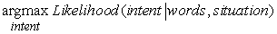

<?xml version="1.0" encoding="UTF-8" standalone="no"?>
<!DOCTYPE html PUBLIC "-//W3C//DTD XHTML 1.1//EN" "http://www.w3.org/TR/xhtml11/DTD/xhtml11.dtd">
<html xmlns="http://www.w3.org/1999/xhtml"><head><meta name="generator" content="DocBook XSL Stylesheets V1.76.1"/></head><body>

<h1 class="title"><a id="id768938"/>Többértelműség és feloldása</h1>

Bizonyos esetekben a hallgatók tudatában vannak egy megnyilatkozás többértelműségének. Íme, néhány példa a napilapok szalagcímeiből:

Squad helps dog bite victim.

Helicopter powered by human flies.

Once-sagging cloth diaper industry saved by full dumps.

Portable toilet bombed; police have nothing to go on.

British left waffles on Falkland Islands.

Teacher strikes idle kids.

Milk drinkers are turning to powder.

Drunk gets nine months in violin case.

(A mondatok fordítását és értelmezését az olvasóra hagyjuk – <em>a ford.</em>)

<h3 class="title">Fontos</h3>
Azonban legtöbb esetben a beszéd, amit hallunk, egyértelműnek tűnik. Ezért amikor a kutatók először kezdtek a nyelv elemzésére számítógépeket használni a hatvanas években, igen meglepődve tapasztalták, hogy <em>majdnem minden megnyilatkozás erősen többértelmű, bár az alternatív értelmezések egy anyanyelvi beszélő számára lehet, hogy nem nyilvánvalók</em>. Egy nagy nyelvtannal és szókinccsel rendelkező rendszer értelmezések ezreit találhatja egy teljesen átlagos mondatra. Vegyük például a „The batter hit the ball” mondatot, amelynek látszólag egy egyértelmű értelmezése van, miszerint a baseballjátékos megüt egy baseball-labdát. De különböző értelmezést kapunk, ha az ezt megelőző mondat ez: „The mad scientist unleashed a tidal wave of cake mix towards the ballroom.” Ez a példa a <strong>lexikális többértelműség</strong>en (<strong>lexical ambiguity</strong>) alapszik, amikor egy szónak egynél több jelentése van. A lexikális többértelműség igen gyakori: a „back” lehet határozószó (go back), melléknév (back door), főnév (the back of the room) és ige (back up your files). A „Jack” lehet név, főnév (kártya, hatszögű fém játékdarab, hajózási zászló, hal, hím szamár, dugasz vagy nehéz objektumok emelésére szolgáló eszköz), illetve lehet ige (felemelni egy autót, fénnyel vadászni vagy erősen megütni a baseball-labdát).

A <strong>sz</strong><strong>intaktikai többértelműség</strong> (<strong>syntactic ambiguity</strong>) (avagy <strong>strukturális többértelműség</strong> (<strong>structural ambiguity</strong>)) a lexikális többértelműséggel együtt vagy nélküle is előfordulhat. Például az „I smelled a wumpus in 2,2” füzérnek két értelmezése lehet: az egyikben az „in 2,2” prepozíciós kifejezés a főnevet módosítja, a másikban az igét. A szintaktikai többértelműség <strong>szemantikai többértelműség</strong>hez (<strong>semantic ambiguity</strong>) vezet, mivel az egyik értelmezés szerint a wumpus a 2,2-n van, a másik szerint a szaga van a 2,2-n. Ebben az esetben a rossz értelmezés halálos tévedés lehet. 

A szemantikai többértelműség még olyan kifejezésekben is feltűnhet, ahol nincs lexikális vagy szintaktikai többértelműség. Például a „cat person” főnévi kifejezés takarhat olyasvalakit, aki szereti a macskaféléket, vagy az <em>Attack of the Cat People </em>(A macskaemberek támadása) c. film szalagcímét is. Egy „coast road” lehet olyan út, ami a partvonalat követi, és olyan, amelyik a partra vezet.

Végezetül lehet többértelműség a szó szerinti és az átvitt értelmű jelentések között. A jelképes beszéd fontos a költészetben, de meglepően gyakori a mindennapi beszédben is. A <strong>metonímia</strong> (<strong>metonymy</strong>) egy olyan jelképes beszéd, amikor az egyik objektum helyére egy másikat állítunk. Amikor azt halljuk, hogy „Chrysler announced a new model”, nem értelmezzük akként, hogy a cégek beszélni tudnak; inkább azt értjük ezalatt, hogy a céget képviselő szóvivő tette a bejelentést. A metonímia gyakori, és az emberi hallgatók gyakran észrevétlenül interpretálják. Sajnálatos módon a nyelvtanunk abban a formában, ahogy leírtuk, nem ennyire rugalmas. Ahhoz, hogy a metonímia szemantikáját megfelelően kezelni tudjuk, a többértelműség teljesen új szintjét kell bevezetnünk. Ezt úgy tesszük meg, hogy két objektumot használunk a mondat minden kifejezésének szemantikai értelmezésénél: egyet arra az objektumra, amelyre a kifejezés szó szerint vonatkozik (Chrysler), míg egy másikkal utalunk a fogalomcserére (szóvivő). Ezek után meg kell mondanunk, hogy összefüggés van a kettő között. Jelenlegi nyelvtanunkban a „Chrysler announced” értelmezése a következő:

<code class="code">∃<em>x</em>,<em> e</em>   <em>x = Chrysler</em> ∧ <em>e</em> ∈ <em>Announce</em>(<em>x</em>) ∧ <em>After</em>(<em>Now</em>, <em>e</em>)</code>

Ezt a következőre kell megváltoztatnunk:

<code class="code">∃<em>m</em>, <em>x</em>, <em>e</em>   <em>x </em>=<em> Chrysler</em> ∧ <em>e </em>∈ <em>Announce</em>(<em>m</em>) ∧ <em>After</em>(<em>Now</em>, <em>e</em>) ∧ <em>Metonymy</em>(<em>m</em>, <em>x</em>)</code>

E szerint van egy olyan <em>x </em>entitás, amely azonos a Chryslerrel, és van egy másik <em>m </em>entitás, amelyik a bejelentést tette, és a kettő metonímiai relációban áll egymással. A következő lépés annak meghatározása, hogy milyen metonímiarelációk fordulhatnak elő. A legegyszerűbb eset az, amikor nincs semmilyen metonímia – az <em>x</em> szó szerinti objektum és az <em>m</em> metonímiai objektum azonos:

<code class="code">∀<em>m</em>, <em>x</em>   (<em>m </em>=<em> x</em>) ⇒ <em>Metonymy</em>(<em>m</em>, <em>x</em>)</code>

A Chrysler példánál helyénvaló általánosítás az, hogy egy vállalat állhat a szóvivője helyén:

<code class="code">∀<em>m</em>, <em>x</em>   <em>x </em>∈ <em>Organizations </em>∧ <em>Spokesperson</em>(<em>m</em>, <em>x</em>)<em> </em>⇒ <em>Metonymy</em>(<em>m</em>, <em>x</em>)</code>

További fogalomcserék lehetnek a szerző a munkákra (I read <em>Shakespeare</em>), vagy általában a létrehozó az alkotásra (I drive a <em>Honda</em>) és a rész az egészre (The Red Sox need a strong <em>arm</em>). A metonímia egyes példái, mint a „The <em>ham sandwich</em> on Table 4 wants another beer” újszerűbbek, és az adott szituációnak megfelelően értelmezik őket.

Az itt vázolt szabályok lehetővé teszik a számunkra, hogy a „Chrysler announced a new model” mondat magyarázatát elkészítsük, de a magyarázat nem logikai következtetés útján jön létre. Valószínűségi vagy nemmonoton következtetést kell használnunk ahhoz, hogy magyarázatjelöltekkel álljunk elő.

Egy <strong>metafora</strong> (<strong>metaphor</strong>) olyan jelképes beszéd, amikor egy adott szó szerinti jelentéssel bíró kifejezést használunk egy másik jelentés sugalmazására analógia segítségével. A legtöbb ember úgy gondol a metaforára, mint a költők eszközére, mely nem játszik nagy szerepet a mindennapi szövegekben. Mindazonáltal nagyon sok alapvető metaforát olyan gyakran használunk, hogy még azt sem vesszük észre, hogy azok metaforák. Egy ilyen metafora annak a gondolata, hogy a „több felfelé van”. Ez a metafora lehetővé teszi számunkra annak közlését, hogy az árak emelkedtek, felmásztak vagy rakéta módjára szárnyalnak, hogy a hőmérséklet csökken vagy esik, hogy a bizalom valakiben csökken, illetve hogy egy sztár népszerűsége megugrott vagy szárnyal.

Az ilyen metaforák megközelítésének két módja lehetséges. Az egyik az, hogy a metafora teljes tudását beépítjük a szótárba – új jelentéseket adunk az emelkedik, esik, mászik stb. szavakhoz, melyek úgy írják le őket, hogy mindenféle mértékre vonatkozhatnak, nem csak a magasságra. Ez a módszer sok alkalmazás számára elegendő, de nem ragadja meg a metafora azon generálóképességét, amely az emberek számára lehetővé teszi új kifejezések használatát – mint például az „alábukik” vagy a „kirobbantja a tetőt” – anélkül hogy félreértéstől tartanának. A másik módszer a gyakori metaforákról explicit tudást illeszt be a rendszerbe, és ezeket használja az új kifejezések olvasás közbeni megértéséhez. Például tegyük fel, hogy egy rendszer ismeri a „több felfelé van” metaforáját. Azaz tudja, hogy az olyan logikai kifejezések, melyek egy függőleges skálán értelmezett pontra vonatkoznak, értelmezhetők egy mennyiségi skála megfelelő pontjaira vonatkozóként. Ezek után az „eladások magasak” kifejezéshez tartozna egy <em>Altitude</em>(<em>Sales</em>, <em>High</em>) szó szerinti értelmezés, amit metafora segítségével <em>Quantity</em>(<em>Sales</em>, <em>Much</em>)-ként értelmezhetünk.

<h2 class="title"><a id="id769284"/>A többértelműség feloldása</h2>

<h3 class="title">Fontos</h3>
Ahogy korábban mondtuk, a többértelműség feloldása <em>diagnózis kérdése</em>. A beszélő szándéka a kommunikációra a megnyilatkozásban szereplő szavak nem megfigyelt oka, és a hallgató dolga, hogy a szavakból és a szituációról való tudásából kiindulva visszafelé előállítsa a beszélő legvalószínűbb szándékát. Más szavakkal, a hallgató a következőt oldja meg:

ahol a <em>Likelihood </em>lehet valószínűség vagy a preferenciák bármilyen számszerű mértéke. Valamilyen preferenciára szükség van, mivel a szintaktikai és szemantikai értelmezési szabályok önmagukban nem tudnak a kifejezéshez vagy mondathoz egyetlen helyes értelmezést meghatározni. Ezért részekre bontjuk a munkát: a szintaktikai és szemantikai értelmezés felelős a lehetséges értelmezések halmazának előállításáért, a többértelműség feloldásának folyamata pedig kiválasztja a legjobbat.

Vegyük észre, hogy a szólásaktus szándékáról, és nem csak a beszélő által kimondott aktuális kijelentésről beszélünk. Például ha azt halljuk egy politikustól, hogy „I am not a crook”, akkor lehet, hogy csak 50% valószínűséget adunk annak, hogy a politikus nem bűnöző, ugyanakkor 99,999%-ot annak, hogy a beszélő nem egy kampós pásztorbot (a <em>crook</em> másik jelentése<em> – a ford.</em>). Mégis nagyobb valószínűséget rendelünk ahhoz az értelmezéshez, hogy

<code class="code"><em>Assert</em>(<em>Speaker</em>,<em> </em>¬(<em>Speaker </em>∈ <em>Criminals</em>)</code>

mivel ez a valószínűbb dolog, amit mond.

Vizsgáljuk ismét az „I smelled a wumpus in 2,2.” többértelmű példát! Egy preferenciaheurisztika a <strong>jobbra asszociáció</strong> (<strong>right association</strong>), amely szerint amikor el kell döntenünk, hogy az „in 2,2” <em>PP</em>-t hova helyezzük el az elemzési fában, akkor azt preferáljuk, hogy a jobb szélen elhelyezkedő összetevőhöz csatoljuk, ami jelen esetben az „a wumpus” <em>NP</em>. Természetesen ez csak egy heurisztika; az „I smelled a wumpus with my nose” mondatra a heurisztikát felülbírálná az a tény, hogy az „a wumpus with my nose” <em>NP</em> nem valószínű.

A többértelműség feloldása a tények kombinálásával oldható meg, felhasználva a könyvben eddig látott tudásábrázolásra és bizonytalanság melletti következtetésre alkalmas minden technikát.

A tudást négy modellre bonthatjuk:

<ol class="orderedlist"><li class="listitem">
A <strong>világ modell</strong> (<strong>world model</strong>): annak valószínűsége, hogy egy állítás előfordul a világban.
</li><li class="listitem">
A <strong>mentális modell</strong> (<strong>mental model</strong>): annak valószínűsége, hogy a beszélő létrehozza azt a szándékát, hogy egy adott tényt a hallgatóval közöljön, feltéve, hogy az bekövetkezik. Ez annak modelljét kombinálja, amit a beszélő hisz azzal, amit a beszélő hisz arról, amit a hallgató hisz és így tovább.
</li><li class="listitem">
A <strong>nyelvi modell</strong> (<strong>language model</strong>): annak valószínűsége, hogy szavak egy bizonyos füzére lesz kiválasztva, azt feltételezve, hogy a beszélőben létezik egy adott tény elmondásának szándéka. A fejezetben ismertetett CFG- és DCG-modellek a valószínűségre logikai (igaz/hamis) modellt használnak: egy füzérnek vagy lehet egy adott értelmezése, vagy nem. A következő fejezetben a CFG olyan valószínűségi változatát látjuk majd, amely a többértelműség feloldására egy jobban informált nyelvi modellt készít.
</li><li class="listitem">
Az <strong>akusztikai modell</strong> (<strong>acoustic model</strong>): annak valószínűsége, hogy hangok egy adott sorozata keletkezik azt feltéve, hogy a beszélő szavak egy adott sorozatát választotta. A beszédfelismerést a 15.6. alfejezet tárgyalta.
</li></ol>

</body></html>
