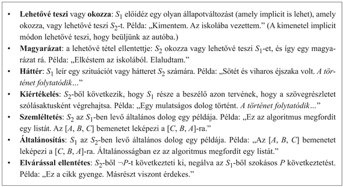

<?xml version="1.0" encoding="UTF-8" standalone="no"?>

<html xmlns="http://www.w3.org/1999/xhtml"><head><meta name="generator" content="DocBook XSL Stylesheets V1.76.1"/></head><body>

<h1 class="title"><a id="id769427"/>Szövegértés</h1>

Egy <strong>szöveg</strong> (<strong>discourse</strong>) a nyelv tetszőleges karaktersorozata – tipikusan olyan, amelyik hosszabb, mint egy mondat. A jegyzetek, a regények, az időjárás-jelentések és a párbeszédek mind szövegek. Eddig teljesen figyelmen kívül hagytuk a szövegek problémáit, a nyelv önálló mondatokra bontását helyeztük előtérbe, melyeket <em>in vitro</em> tanulmányozhattunk. Ez a fejezet a mondatokat természetes környezetükben tanulmányozza. Két részproblémát fogunk vizsgálni: az utalásfeloldást és a koherenciát.

<h2 class="title"><a id="id769446"/>Utalásfeloldás</h2>

Az <strong>utalásfeloldás</strong> (<strong>reference resolution</strong>) egy olyan névmás vagy határozott főnévi kifejezés értelmezése, amely a világ egy objektumára utal.[<a id="id769462" href="#ftn.id769462" class="footnote">235</a>] A feloldás a világról szóló tudáson és a szöveg korábbi részein alapszik. Vizsgáljuk a következő szakaszt:

„John flagged down the waiter. He ordered a ham sandwich.”

Annak megértéséhez, hogy a „he” a második mondatban Johnra utal, meg kellett értenünk, hogy az első mondat két személyt említ, valamint azt, hogy John játssza a vendég szerepét, és ezért valószínűleg rendel, míg a pincér nem. Általában az utalásfeloldás egy hivatkozott kiválasztása a jelöltek listájáról, de néha magában foglalja új jelöltek létrehozását is. Vegyük például a következő mondatot:

„After John proposed to Marsha, they found a preacher and got married. For the honeymoon, they went to Hawaii. (Miután John megkérte Marshát, találtak egy papot, és összeházasodtak. Hawaiira mentek nászútra.)”

Itt a „honeymoon” határozott főnévi kifejezés egy olyan dologra utal, amire csak implicit módon utal a „married” ige. A „they” névmás egy olyan csoportra utal, amit explicit módon nem említettek előtte: John és Marsha (de <em>nem</em> a pap).

A legjobb hivatkozott dolog kiválasztása egy olyan többértelműség feloldási folyamat, amely többféle szintaktikai, szemantikai és pragmatikus értelmezési információ kombinálásán alapszik. Bizonyos nyomravezetők kényszerek formájában adottak. Például a névmásoknak nemben és számosságban egyezniük kell a hivatkozottakkal: a „he” például utalhat Johnra, de nem Marshára; a „they” utalhat egy csoportra, de nem egyetlen személyre. A névmásoknak a reflexivitás szintaktikai kényszereinek is meg kell felelniük. Például a „he saw him in the mirror” mondatban a két névmásnak két különböző emberre kell vonatkoznia, míg a „he saw himself” kifejezésben ugyanarra az emberre kell utalniuk. Vannak a szemantikai konzisztenciára vonatkozó kényszerek is. A „he ate it” kifejezésben a „he” névmásnak olyan dologra kell utalnia, ami eszik, míg az „it” olyanra, amit megehetnek. 

Bizonyos vezérfonalak olyan preferenciák, amik nem állnak mindig fenn. Például amikor egymás utáni mondatoknak párhuzamos struktúrája van, olyankor előnyös, ha a névmási utalások követik ezt a struktúrát. Így a

„Marsha flew to San Francisco from New York. John flew there from Boston.”

mondatokban azt preferáljuk, hogy a „there” San Franciscóra utal, mivel az ugyanazt a szintaktikai szerepet tölti be. Párhuzamos struktúra hiányában az alanyt preferáljuk a tárgy ellenében. Így a

„Marsha gave Sally the homework assignment. Then she left.”

szövegben „Marsha” az első mondat alanya, így ő a „she” preferált előzménye. Egy másik preferencia annak az entitásnak az előtérbe helyezése, amelynek a tárgyalása a legnyilvánvalóbb. Ha a következő mondatpárt önállóan vizsgáljuk

„Dana dropped the cup on the plate. It broke.”

akkor felmerül egy probléma: nem világos, hogy az „it” a pohárra vagy a tányérra utal. Azonban egy nagyobb kontextusban a többértelműség feloldódik:

„Dana was quite fond of the blue cup. The cup had been a present from a close friend. Unfortunately, one day while setting the table, Dana dropped the cup on the plate. It broke.”

Itt a pohár van a figyelem középpontjában, ezért ez a preferált hivatkozott dolog.

Sokféle utalásfeloldó algoritmust találtak ki. Az egyik első (Hobbs, 1978) figyelemre méltó, mivel egy olyan mértékű statisztikai ellenőrzést végeztek rajta, ami abban az időben szokatlan volt. Három különböző szövegfajtát használva Hobbs 92%-os pontosságot mutatott ki. A módszer azt feltételezte, hogy egy elemző egy helyes elemzést készített, ami azonban nem állt rendelkezésére, ezért Hobbs kézzel készítette el az elemzéseket. A Hobbs algoritmus keresésként működik: az aktuális mondattól indulva visszafelé keres a mondatokban. Ez a technika biztosítja, hogy a legutóbbi jelölteket vizsgálja először. Egy mondaton belül szélességi keresést végez, balról jobbra haladva. Ez azt biztosítja, hogy az alanyokat a tárgyak előtt vizsgálja. Az algoritmus kiválasztja az első jelöltet, amely a most vázolt kényszereknek eleget tesz.

<h2 class="title"><a id="id769529"/>Egy koherens szöveg struktúrája</h2>

<a id="ID_939_oldal"/>
Nyissa fel ezt a könyvet tízszer véletlenszerűen, és másolja le az első mondatot minden oldalról. Az eredmény szükségszerűen inkoherens lesz. Hasonlóképpen, ha veszünk egy koherens, tíz mondatból álló szöveget, majd permutáljuk a mondatokat, az eredmény inkoherens lesz. Ez azt demonstrálja, hogy a természetes nyelvű szövegek mondatai nagyon különböznek a logika állításaitól. A logikában, bármilyen sorrendben is <code class="code">KÖZÖLJÜK</code> az <em>A</em>,<em> B</em>,<em> </em>és <em>C </em>állításokat egy tudásbázissal, az <em>A </em>∧<em> B </em>∧ <em>C </em>konjukciót kapjuk. Természetes nyelvben a mondatok sorrendje számít; vegyük például a „Go two blocks. Turn right” és a „Turn right. Go two blocks” szövegek közötti különbséget.

A szövegek mondatok feletti struktúrával rendelkeznek. Ezt a struktúrát a szöveg következő nyelvtanának segítségével vizsgálhatjuk meg:

<code class="code"><em>Segment</em>(<em>x</em>) → <em>S</em>(<em>x</em>)</code>

<code class="code"><em>Segment</em>(<em>CoherenceRelation</em>(<em>x</em>, <em>y</em>)) → <em>Segment</em>(<em>x</em>) <em>Segment</em>(<em>y</em>)</code>

E nyelvtan szerint a szöveg szegmensekből áll, ahol minden szegmens vagy egy mondat, vagy mondatok egy csoportja, és a szegmenseket <strong>koherenciareláció</strong>k (<strong>coherence </strong><strong>relation</strong>s) kötik össze. A „Go two blocks. Turn right” szövegben a koherenciareláció az, hogy az első mondat <em>engedélyezi</em> a másodikat: a hallgatónak akkor kell jobbra fordulnia, miután ment két háztömbnyit. Különböző kutatók koherenciarelációk különböző készletét javasolták; a 22.21. ábra felsorol egy reprezentatív halmazt. Most vizsgáljuk meg a következő történetet:

<ol class="orderedlist"><li class="listitem">
A funny thing happened yesterday.
</li><li class="listitem">
John went to a fancy restaurant.
</li><li class="listitem">
He ordered the duck.
</li><li class="listitem">
The bill came to $50.
</li><li class="listitem">
John got a shock when he realized he had no money.
</li><li class="listitem">
He had left his wallet at home.
</li><li class="listitem">
The waiter said it was all right to pay later.
</li><li class="listitem">
He was very embarrassed by his forgetfulness.
</li></ol>

Itt, az (1) mondat az <em>Evaluation</em> relációban áll a szöveg hátralevő részével; (1) a beszélő megjegyzése a szöveghez. A (2) mondat engedélyezi a (3)-at, és a (2–3) pár együtt 

okozza (4)-et, azzal az implicit köztes állapottal, hogy János megette a kacsát. Ezek után (2–4) szolgál a szöveg hátralevő részének alapjául. A (6) mondat az (5) magyarázata, és (5–6) engedélyezi (7)-et. Vegyük észre, hogy ez egy <em>Enable</em>, nem <em>Cause</em>, mivel a pincérnek lehetett volna más reakciója is. Az (5–7) együtt okozza (8)-at. A 22.13. feladat arra kéri majd, hogy rajzolja fel e szöveg elemzési fáját.

<a id="id769684"/>
<strong>22.21. ábra - Koherenciarelációk listája (Hobbs, 1990) alapján. Mindegyik reláció két, egymást követő szövegrészlet, S1 és S2 között áll fenn.</strong>

A koherenciarelációk szolgálnak egy szöveg összekötésére. Vezetik a beszélőt annak eldöntésében, hogy mit mondjon és mit tekintsen magától értetődőnek, és segítik a hallgatót a beszélő szándékának megértésében. A koherenciarelációk a mondatok többértelműségének szűrőjeként szolgálhatnak: önállóan a mondatok lehetnek többértelműek, de ezen többértelmű értelmezések többsége nem illeszthető össze egy koherens szöveggé.

Eddig az utalásfeloldást és a szövegstruktúrát külön vizsgáltuk. Azonban a kettő valójában összefügg. Grosz és Sidner (1986) elmélete például azzal foglalkozik, hogy a beszélő és hallgató figyelme mire koncentrál a szöveg során. Elméletük tartalmaz egy vermet, amely <strong>fókuszter</strong>eket (<strong>focus space</strong>s) tartalmaz. Bizonyos megnyilvánulások a fókusz elmozdulását okozzák egy elem verembe helyezésével vagy kivételével. Például az éttermi történetben a „John went to a fancy restaurant” mondat új fókuszt helyez a verem tetejére. Ezen a fókuszon belül a beszélő egy határozott <em>NP</em>-t használhat a „the waiter”-re történő utalásra (az „a waiter” általános <em>NP</em> helyett). Ha a történet folytatódna egy „John went home” mondattal, akkor a fókuszteret kivenné a verem tetejéről, és a szöveg nem utalhatna tovább a pincérre a „the waiter” vagy a „he” kifejezésekkel.

 

[<a id="ftn.id769462" href="#id769462" class="para">235</a>]  A nyelvészetben az utalást egy olyan dologra, ami már szerepelt, <strong>anaforá</strong>nak (<strong>anaphoric reference</strong>) nevezzük. Az utalást egy később szereplő dologra <strong>kataforá</strong>nak (<strong>cataphoric reference</strong>) nevezzük, mint például a „he” névmás a „When he won his first tournament, Tiger was 20”.

</body></html>
