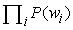
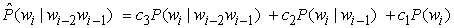
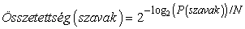
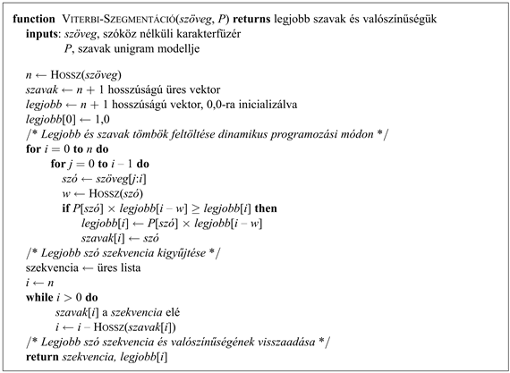
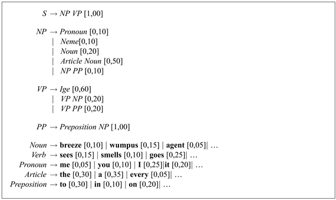
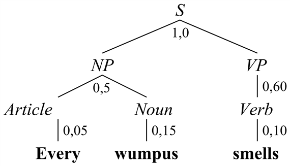

<?xml version="1.0" encoding="UTF-8" standalone="no"?>

<html xmlns="http://www.w3.org/1999/xhtml"><head><meta name="generator" content="DocBook XSL Stylesheets V1.76.1"/></head><body>

<h1 class="title"><a id="id772386"/>23. fejezet - Valószínűségi nyelv-feldolgozás</h1>

<em>Ebben a fejezetben meglátjuk, hogyan lehet egyszerű, statisztikailag tanított nyelvi modelleket szavak millióinak feldolgozására használni ahelyett, hogy csak egyes mondatok feldolgozására használnánk</em>

A 22. fejezetben<em> </em>láttuk, hogyan képes egy ágens kommunikálni egy másik (szoftver vagy emberi) ágenssel közös nyelvi megnyilatkozások segítségével. A megnyilatkozások teljes szintaktikai és szemantikai elemzése <em>szükséges</em> a jelentésük teljes kinyeréséhez, ami azért <em>lehetséges,</em> mert a megnyilatkozások rövidek és körülhatárolt tárgyterületre korlátozottak.

Ebben a fejezetben a nyelvmegértés <strong>korpuszalapú</strong> (<strong>corpus-based</strong>) megközelítését tárgyaljuk. A korpusz egy nagy szöveggyűjtemény, például az a több milliárd oldal, ami a világhálót építi fel. A szövegeket emberek írják embereknek, és a szoftverek feladata az, hogy megkönnyítsék az embereknek az információkeresést. Ez a megközelítés magában foglalja statisztikák és tanulás használatát a korpusz kihasználására, és jellemzően olyan valószínűségi nyelvi modelleket von maga után, amelyek az adatokból tanulhatók, és amelyek egyszerűbbek, mint a 22. fejezet kibővített DCG-i. A legtöbb feladat esetén az adatmennyiség kárpótol azért, hogy egyszerűbb nyelvi modellt használunk. Három specifikus feladatot fogunk áttekinteni: az <strong>információkeresés</strong>t (<strong>information retrieval</strong>) (23.2. alfejezet), az <strong>információkinyerés</strong>t (<strong>information extraction</strong>) (23.3. alfejezet) és a <strong>gépi fordítás</strong>t (<strong>machine translation</strong>) (23.4. alfejezet). Elsőként azonban a valószínűségi nyelvi modelleket (probabilistic language model) mutatjuk be röviden.

<h1 class="title"><a id="id772447"/>Valószínűségi nyelvi modellek</h1>

A 22. fejezet a nyelv <em>logikai</em> modelljét adta meg: CFG-ket és DCG-ket használtunk, hogy egy adott karakterfüzérről eldöntsük, eleme-e vagy sem egy nyelvnek. Ebben az alfejezetben számos <em>valószínűségi</em> modellt vezetünk be. A valószínűségi modellek számos előnnyel rendelkeznek. Kényelmesen taníthatók adatok alapján: a tanulás mindössze az előfordulások megszámlálásából áll (némi tűréssel a kis mintaméret okozta hibák miatt). Továbbá robusztusabbak (mivel <em>bármely</em> karakterfüzért elfogadnak, habár kis valószínűséggel), visszatükrözik azt a tényt, miszerint nem a beszélők 100%-a ért egyet abban, hogy mely mondatok részei a nyelvnek; valamint alkalmasak a többértelműség feloldására: a valószínűségre támaszkodva kiválasztható a legvalószínűbb értelmezés.

A <strong>valószínűségi nyelvi modell</strong> (<strong>probabilistic language model</strong>) valószínűségi eloszlást definiál egy (esetleg végtelen) karakterfüzér-halmaz felett. Példaként állhatnak a 15.6. alfejezetben beszédmegértésre használt bi- és trigram nyelvi modellek. Az unigram modell <em>P</em>(<em>w</em>) valószínűséget rendel a szókincs minden egyes szavához. A modell feltételezi, hogy a szavak függetlenül lettek kiválasztva, azaz a karakterfüzér valószínűsége egyszerűen a szavak valószínűségének szorzata:. A következő húszszavas szekvenciát véletlen módon generáltuk, a könyv szavainak unigram modellje alapján:[<a id="id772493" href="#ftn.id772493" class="footnote">236</a>]

logical are as confusing a may right tries agent goal the was diesel more object then information-gathering search is
<a id="ID_952_oldal"/>
A bigram modell egy P(<em>wi</em>|<em>wi–</em>1) valószínűséget rendel minden egyes szóhoz, adott előző szó esetén. A 15.21. ábra néhány bigram-valószínűséget mutatott be. A könyv bigram modellje a következő véletlen szekvenciát generálja:

planning purely diagnostic expert system are very similar computational approach would be represented compactly using tic tac toe a predicate

Általánosan, egy <em>n</em>-gram modell az előző <em>n</em> – 1 szó alapján szabja meg a P(<em>wi</em>|<em>w</em><em>i–(n–</em>1<em>)</em>…<em>w</em><em>i–</em>1) valószínűséget. A könyv trigram modellje ezt a véletlen szekvenciát generálja:

planning and scheduling are integrated the success of naive bayes model is just a possible prior source by the time

Még a fenti kis példa alapján is láthatónak kell lennie, hogy a trigram modell jobb, mint a bigram (amely pedig jobb, mint az unigram), mind az angol nyelv, mind egy MI-tankönyv témájának közelítésében. A modellek maguk is egyetértenek ezzel: a trigram modell a véletlen módon generált sztringjéhez 10–10 valószínűséget rendel, a bigram 10–29-et, az unigram pedig 10–59-et.

Ez a könyv félmillió szavával nem tartalmaz elég adatot ahhoz, hogy jó minőségű bigram modellt lehessen előállítani belőle, nem is beszélve a trigram modellről. A könyv szókincse körülbelül 15 ezer különböző szót tartalmaz, tehát a bigram modell 15 0002 = 225 millió szópárt tartalmaz. Világos, hogy a szópárok legalább 99,8%-a 0 gyakoriságú, de nem akarjuk, hogy a modell azt állítsa, hogy ezek a szópárok lehetetlenek. Szükségünk van valamilyen <strong>simítás</strong>ra (<strong>smoothing</strong>) a nulla gyakoriságok felett. A legegyszerűbb megoldás az <strong>adj-hozzá-egyet simítás</strong> (<strong>add-one smoothing</strong>): minden lehetséges bigram gyakoriságához hozzáadunk egyet. Azaz amennyiben a korpuszban <em>N</em> szó és <em>B</em> lehetséges bigram található, akkor minden <em>c</em> gyakoriságú bigramhoz egy (<em>c + </em>1)/(<em>N + B</em>) értékű valószínűség-becslőt rendelünk. Ez a módszer megszünteti a nulla valószínűségű <em>n</em>-gramok problémáját, de az a követelmény, hogy minden gyakoriságot pontosan eggyel kell növelni, kétséges, és rossz becslésekhez vezethet.

A másik megközelítés a <strong>lineáris interpoláción alapuló simítás</strong> (<strong>linear interpolation smoothing</strong>), ami lineárisan kombinálja a trigam, bigram és unigram modelleket. A valószínűség-becslőt a következőképpen definiáljuk:

ahol <em>c</em>3 +  <em>c</em>2 <em>+ c</em>1 = 1. A <em>ci</em> paraméterek lehetnek rögzítettek vagy EM algoritmussal taníthatók. Az is lehetséges, hogy a <em>ci</em> értékeket az <em>n</em>-gram gyakoriságoktól függőnek választjuk, azaz nagyobb súlyt adunk azoknak a valószínűségi becslőknek, amelyeket nagyobb gyakoriságokból számítunk.

A nyelvi modell egyik lehetséges <em>kiértékelési</em> módja a következő: először válasszuk szét a korpuszt egy tanító és egy teszthalmazra. Határozzuk meg a modell paramétereit a tanító halmaz alapján. Ezután számítsuk ki a valószínűséget a teszthalmazra a modell alapján; minél nagyobb a valószínűség, annál jobb. A megközelítés egyik problémája az, hogy hosszú karakterfüzérek esetén a <em>P</em>(<em>szavak</em>) nagyon kicsi; a kis számok lebegőpontos alulcsordulást okozhatnak, vagy egyszerűen túl nehéz lenne elolvasni őket. Tehát a valószínűség helyett a modell <strong>összetettség</strong>ét (<strong>perplexity</strong>) számíthatjuk ki a teszt karakterfüzéren:

ahol <em>N</em> a <em>szavak</em> száma. Minél kisebb az összetettség, annál jobb a modell. Az az <em>n</em>-gram modell, amely minden szóhoz 1/<em>k</em> valószínűséget rendel, <em>k</em> összetettségű; az összetettséget úgy is lehet értelmezni, mint átlagos elágazási tényezőt.

Példaként arra, hogy mire képesek az <em>n</em>-gram modellek, vegyük a <strong>szegmentáció</strong> (<strong>segmentation</strong>) feladatát, ami szóhatárok megtalálása szóköz nélküli szövegben. Ez a feladat elengedhetetlen a japán és kínai nyelv esetén; ezek olyan nyelvek, amelyek nem raknak szóközt a szavak közé, feltételezzük azonban, hogy a legtöbb olvasónak az angol nyelv[<a id="id772747" href="#ftn.id772747" class="footnote">237</a>] jobban megfelel. Az 

Itiseasytoreadwordswithoutspaces[<a id="id772763" href="#ftn.id772763" class="footnote">238</a>]

mondatatot tényleg könnyű elolvasni. Az olvasó arra gondolhat, hogy ezt az teszi lehetővé, hogy teljesen ismerjük az angol szintaktikát, szemantikát és pragmatikát. Meg fogjuk mutatni, hogy a mondatot egy egyszerű unigram modellel is könnyen dekódolni lehet.

Korábban láthattuk, hogy a Viterbi algoritmus (15.9) hogyan használható a legvalószínűbb szekvencia megtalálására egy szó-valószínűségi hálóban. A 23.1. ábrán látható a Viterbi algoritmus olyan változata, amelyet specifikusan a szegmentációs probléma megoldására terveztünk. Bemenete a <em>P</em>(<em>szó</em>) unigram valószínűségi eloszlás és egy karakterfüzér. Ezután az algoritmus a karakterfüzér minden egyes <em>i</em> pozíciójára a <em>legjobb</em>[<em>i</em>] elemben eltárolja a legvalószínűbb <em>i</em>-ig tartó karakterfüzér valószínűségét. Emellett a <em>szavak</em>[<em>i</em>] elemben eltárolja azt az <em>i</em>-edik pozícióban végződő szót, ami a legnagyobb valószínűséget adta. Miután felépítette a <em>legjobb</em> és a <em>szavak</em> tömböket dinamikus programozási módon, hátrafelé mozogva feldolgozza a <em>szavak</em> tömböt, hogy megtalálja a legjobb utat. Ebben az esetben, a könyv unigram modellje alapján a legjobb szekvencia ténylegesen az „It is easy to read words without spaces”,[<a id="id772821" href="#ftn.id772821" class="footnote">239</a>] 10–25 valószínűséggel. A szekvencia részeinek összehasonlítása során látható, hogy az „easy” unigram valószínűsége 2,6 × 10–4, miközben az alternatív „<em>e</em> as <em>y</em>”[<a id="id772846" href="#ftn.id772846" class="footnote">240</a>] valószínűsége sokkal kisebb, 9,8 × 10–12 annak ellenére, hogy a könyv képleteiben viszonylag gyakran előfordul az „<em>e</em>” és az „<em>y</em>”. Hasonlóképpen:

<code class="code"><em>P</em>(„without”) = 0,0004</code>

<code class="code"><em>P</em>(„with”) = 0,005; <em>P</em>(„out”) = 0,0008</code>

<code class="code"><em>P</em>(„with out”) = 0,005 × 0,0008 = 0,000004</code>

Ennek következtében az unigram modell szerint a „without” százszor nagyobb valószínűségű, mint a „with out”.[<a id="id772897" href="#ftn.id772897" class="footnote">241</a>]

<a id="id772917"/>
<strong>23.1. ábra - Viterbi-alapú szószegmentáló algoritmus. Egy szóközöket nem tartalmazó szófüzért feldolgozva megadja a legvalószínűbb szavakra történő szegmentációt.</strong>

Ebben a bekezdésben a szavak feletti <em>n</em>-gram modellekről értekeztünk, azonban az <em>n</em>-gram modelleket számos egyéb egység – például karakterek vagy <strong>beszédrész</strong>ek (<strong>part</strong>s<strong> of speech</strong>) – felett is lehet értelmezni.

<h2 class="title"><a id="id772950"/>Valószínűségi környezetfüggetlen nyelvtanok</h2>

Az <em>n</em>-gram modellek a korpuszon belüli közös előfordulási statisztikát használják ki, azonban nincs semmilyen információjuk a nyelvtanról <em>n</em>-nél nagyobb távolságra. A <strong>való</strong><strong>színűségi környezetfüggetlen nyelvtan</strong> – <strong>PCFG</strong>[<a id="id772977" href="#ftn.id772977" class="footnote">242</a>] (<strong>probabilistic context-free grammar</strong>) – egy alternatív nyelvi modell, ami egy olyan CFG, melyben minden átírási szabályhoz valószínűséget rendelünk. Az azonos bal oldallal rendelkező szabályok valószínűségének összege 1. A 23.2. ábrán az ℰ0 nyelvtan egy részletének PCFG-je látható.

<a id="id772990"/>
<strong>23.2. ábra - Az ℰ0 nyelvtan egy részletének valószínűségi környezetfüggetlen nyelvtana (PCFG) és szókincse. A szögletes zárójelben levő szám jelzi a valószínűségét annak, hogy az adott bal oldali szimbólumot a megfelelő szabály szerint írjuk át</strong>

<a id="id773003"/>
<strong>23.3. ábra - A „Minden wumpus bűzlik” mondat elemzési fája, megadva minden egyes részfa valószínűségét. A teljes fa valószínűsége 1,0 × 0,5 × 0,05 × 0,15 × 0,60 × 0,10 = 0,000225. Mivel a mondatnak ez az egyetlen elemzése, ezért ennyi a mondat valószínűsége is.</strong>

A PCFG-modellben egy karakterfüzér valószínűsége – a <em>P</em>(<em>szavak</em>) – egyszerűen az elemzési fái valószínűségeinek összege. Egy adott fa valószínűsége a fa csomópontjait felépítő szabályok valószínűségeinek szorzata. A 23.3. ábra bemutatja, hogyan lehet kiszámítani egy mondat valószínűségét. A valószínűség kiszámítható egy CFG diagramelemző alkalmazásával, amely megadja az összes lehetséges elemzést, majd egyszerűen össze kell adni a valószínűségeket. Azonban ha csak a legvalószínűbb elemzés érdekel minket, akkor a nem valószínű elemzések meghatározása pazarlás. A legvalószínűbb elemzés hatékony megtalálására használhatunk egy Viterbi algoritmus variációt vagy egy legjobbat-először keresési technikát (mint például az A*-ot).

A PCFG-vel az a probléma, hogy környezetfüggetlen. Ez azt jelenti, hogy a különbség a <em>P</em>(„eat a banana”) és a <em>P</em>(„eat a bandanna”)[<a id="id773035" href="#ftn.id773035" class="footnote">243</a>] között mindössze a <em>P</em>(„banana”) és <em>P</em>(„bandanna”) közti különbségtől függ, és nem az „enni” ige és a megfelelő objektumok közti kapcsolattól. Hogy megkapjuk ezt a kapcsolatot, szükség van valamilyen környezetfüggő modellre, mint például a <strong>szókinccsel ellátott PCFG</strong>-re (<strong>lexicalized PCFG</strong>), amelyben a kifejezés feje[<a id="id773063" href="#ftn.id773063" class="footnote">244</a>] szerepet játszhat a kifejezés valószínűségének meghatározásában. Elegendő tanító adat esetén a <em>VP</em> → <em>VP</em> <em>NP</em> szabály kondicionálható a beágyazott <em>VP</em> fejére („enni”) és az <em>NP</em> fejére („banán”). Ezáltal a szókinccsel ellátott PCFG-k képesek az <em>n</em>-gram modellek közös előfordulási megszorításai egy részének a megragadására, megtartva a CFG-modellek nyelvtani megszorításait.

A PCFG másik problémája az, hogy erősen preferálja a rövid mondatokat. Egy olyan korpuszban, mint a <em>Wall Street Journal</em>, az átlagos mondathossz körülbelül 25 szó. Azonban egy PCFG általában úgy végez, hogy viszonylag magas valószínűséget rendel olyan szabályokhoz, mint az <em>S</em> → <em>NP</em> <em>VP</em>, az <em>NP</em> → <em>Pronoun</em> és a <em>VP</em> → <em>Verb</em>. Ez azt jelenti, hogy a PCFG viszonylag nagy valószínűséget fog rendelni sok rövid mondathoz, mint pl. „ő aludt”, azonban a <em>Journalban</em> sokkal valószínűbben találkozunk olyan mondatokkal, mint „Egy megbízható kormányzati forrás jelentése szerint az az állítás, hogy aludt, hihető”. Úgy tűnik, hogy a <em>Journal</em> mondatai igazából nem környezetfüggetlenek, hanem az íróknak van elképzelésük az elvárt mondathosszról, amit fel is használnak lágy globális kényszerként a mondatok írásakor. Ezt nehéz visszatükrözni egy PCFG-ben.

<h2 class="title"><a id="id774069"/>PCFG-valószínűségek tanulása</h2>

Egy PCFG-modell létrehozásához a CFG konstrukciójának összes nehézségével szembesülünk, ehhez hozzátevődik még az egyes szabályok valószínűséggel való ellátása. Ez azt sugallja, hogy a nyelvtan adatokból való <strong>tanulás</strong>a (<strong>learning</strong>) hasznosabb lehet, mint a tudásmérnöki megközelítés. Csakúgy, mint a beszédmegértés esetén is, kétféle adat áll rendelkezésre: elemzett és nem elemzett. A feladat sokkal egyszerűbb, ha az adatok elemzési fáját nyelvészek (vagy legalábbis képzett anyanyelvi beszélők) készítették el. Egy ilyen korpusz elkészítése óriási feladat, a legnagyobb korpuszok „mindössze” körülbelül egymillió szót tartalmaznak. Az elemzési fa korpusz alapján a PCFG-t egyszerűen számlálással (és simítással) készítjük el: minden egyes nem záró szimbólumra megnézzük az összes olyan csomópontot, amelynek ez a szimbólum a gyökere, és előállítjuk a csomópontok gyermekeinek összes különböző kombinációit leíró szabályokat. Például ha az <em>NP</em> szimbólum 100 000-szer fordul elő, és ebből 20 000 esetben a gyermekek listája [<em>NP</em>, <em>PP</em>], akkor a következő szabályt állítjuk elő:

<code class="code"><em>NP</em> → <em>NP</em> <em>PP</em> [0,20]</code>

A feladat sokkal nehezebb, ha csak elemzetlen szöveggel rendelkezünk. Először is két problémával szembesülünk: a nyelvtani szabályok struktúrájának és az egyes szabályok valószínűségének megtanulásával. (Ugyanezt a megkülönböztetést tesszük neurális hálózatok, valamint Bayes-hálók tanulása esetén is.)

Pillanatnyilag feltételezzük, hogy a szabályok struktúrája adott, és csak a valószínűségeket próbáljuk megtanulni. Alkalmazhatunk egy várhatóérték-maximalizálás (<strong>expectation– maximization</strong>, <strong>EM</strong>) módszert, úgy, mint az RMM-ek tanulásánál. A paraméterek – amelyeket tanulni próbálunk – a szabály-valószínűségek. A rejtett változók az elemzési fák: nem tudjuk, hogy a <em>wi</em>…<em>wj</em> szavakból álló karakterfüzért ténylegesen az <em>X</em> → <em>α</em> szabály generálja-e, vagy sem. Az E lépés megbecsüli az egyes részszekvenciák egyes szabályok által történő generálásának valószínűségét. Ezután az M lépés megbecsüli az egyes szabályok valószínűségét. Az egész számítást el lehet végezni dinamikus programozási módon, az ún. <strong>belső–külső</strong> (<strong>inside–outside</strong>) <strong>algoritmus</strong>sal, ami a HMM tanulás előre–hátra algoritmusának analógiája.

A belső–külső algoritmus varázslatosnak tűnik, hiszen elemzetlen szövegekből állít elő nyelvtant. Azonban számos hátránnyal rendelkezik. Először is lassú: ahol <em>n</em> a mondatbeli szavak, <em>t</em> pedig a nem záró szimbólumok száma. Másodsorban, a valószínűségi hozzárendelések tere nagyon nagy, és a tapasztalatok alapján a lokális maximumokban való bennragadás súlyos probléma. Alternatív módszerek – például szimulált lehűtés – megpróbálhatók ugyan, de ezek még nagyobb számításigényűek. Harmadsorban, a kapott nyelvtanok által elvégzett elemzések gyakran nehezen érthetők, és nem elégítik ki a nyelvészeket. Ez megnehezíti a manuálisan előállított tudás kombinálását az automatikus indukcióval.

<h2 class="title"><a id="id774167"/>PCFG-szabálystruktúrák tanulása</h2>

Most pedig tételezzük fel, hogy a nyelvtani szabályok struktúrája nem ismert. Az első probléma, amivel szembesülünk, az, hogy a lehetséges szabályhalmazok tere végtelen, azaz nem tudjuk, hogy hány szabályt vegyünk figyelembe, és azt sem, hogy az egyes szabályok milyen hosszúak lehetnek. A probléma egyik lehetséges megkerülése az, hogy a nyelvtani szabályokat <strong>Chomsky normál alak</strong>ban (<strong>Chomsky normal form</strong>) tanuljuk, ami azt jelenti, hogy minden szabály a következő két alak egyike lehet:

<code class="code"><em>X</em> → <em>Y</em> <em>Z</em></code>

<code class="code"><em>X</em> → <em>t</em></code>

ahol <em>X</em>, <em>Y</em> és <em>Z</em> nem záró, míg <strong>t</strong> záró szimbólum. Minden környezetfüggetlen nyelvtant át lehet írni Chomsky normál alakra, amely pontosan ugyanazt a nyelvet fogadja el. Ezután önhatalmúlag <em>n</em> nem záró szimbólumra szorítkozhatunk, ezáltal <em>n</em>3 + <em>nv</em> szabályt kapunk, ahol <em>v</em> a záró szimbólumok száma. A gyakorlatban ez a módszer csak kis nyelvtanok esetén bizonyult hatékonynak. A <strong>bayesi modellösszevonás</strong> (<strong>Bayesian model merging</strong>) alternatív megközelítés hasonló a <code class="code">SEQUITUR</code> modellhez (lásd 22.8. alfejezet). A módszer mondatonkénti lokális modellek (nyelvtanok) építésével kezd, majd a minimális leíróhossz felhasználásával összevonja a modelleket.

 

[<a id="ftn.id772493" href="#id772493" class="para">236</a>]  Mivel nem lett volna értelme lefordítani magyarra az egyes szavakat, ezért meghagytuk az eredeti angol nyelvű példát. (<em>A ford.</em>)

[<a id="ftn.id772747" href="#id772747" class="para">237</a>]  Mivel nem lehetett volna hasonló magyar példát valószínűségekkel együtt elkészíteni, ezért meghagytuk az eredeti angol nyelvű példát.<em> </em>(<em>A ford.</em>)

[<a id="ftn.id772763" href="#id772763" class="para">238</a>]  Könnyűszavakatszóközöknélkülolvasni (<em>A ford.</em>)

[<a id="ftn.id772821" href="#id772821" class="para">239</a>]  Könnyű szavakat szóközök nélkül olvasni (<em>A ford.</em>)

[<a id="ftn.id772846" href="#id772846" class="para">240</a>]  <em>easy</em> – könnyű; <em>as</em> – mint (<em>A ford.</em>)

[<a id="ftn.id772897" href="#id772897" class="para">241</a>]  <em>without</em> – nélkül; <em>with</em> – vele; <em>out</em> – kint (<em>A ford.</em>)

[<a id="ftn.id772977" href="#id772977" class="para">242</a>]  A PCFG-k másik megnevezése a sztochasztikus környezetfüggetlen nyelvtan (stochastic context-free grammar), avagy SCFG.

[<a id="ftn.id773035" href="#id773035" class="para">243</a>]  „egy banánt eszik” – „egy selyemkendőt eszik” (<em>A ford.</em>)

[<a id="ftn.id773063" href="#id773063" class="para">244</a>]  A kifejezés <em>feje</em> a legfontosabb szó, például a főnév a főnévi szerkezetben.

</body></html>
