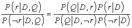
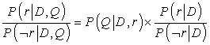
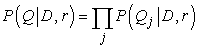
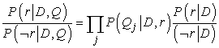
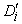
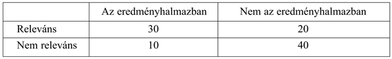

<?xml version="1.0" encoding="UTF-8" standalone="no"?>

<html xmlns="http://www.w3.org/1999/xhtml"><head><meta name="generator" content="DocBook XSL Stylesheets V1.76.1"/></head><body>

<h1 class="title"><a id="id774251"/>Információkeresés</h1>

Az <strong>információkeresés</strong> (<strong>information retrieval</strong>) feladata olyan dokumentumok megtalálása, amelyek relevánsak a felhasználó információigényére nézve. Az információkereső rendszerek legjobban ismert példái a világháló keresőgépei. A felhasználó megadhat egy lekérdezést – mint például [MI-könyv] – a keresőgépnek, majd megnézheti a releváns oldalak listáját. Ebben az alfejezetben bemutatjuk, hogyan épülnek fel ezek a rendszerek. Egy információkereső (ezentúl IR-) rendszer a következő módokon jellemezhető:

<ul class="itemizedlist"><li class="listitem">
<strong>Dokumentumgyűjtemény.</strong> Minden rendszernek el kell döntenie, hogy mit kezel dokumentumként: egy bekezdést, egy oldalt vagy egy többoldalas szöveget.
</li><li class="listitem">
<strong>Lekérdezőnyelven megadott kérdés.</strong> A <strong>lekérdezés</strong> (<strong>query</strong>) írja le, hogy a felhasználó mit szeretne megtudni. A <strong>lekérdezőnyelv</strong> (<strong>query language</strong>) lehet egyszerűen szavak listája (pl. [MI-könyv]); vagy meg lehet adni egymás mellett álló szavakból álló kifejezést (pl. [„MI-könyv”]); logikai operátorokat tartalmazhat (pl. [MI <em>ÉS</em> könyv]), nem logikai operátorokat (például [MI <em>KÖZELBEN</em> könyv] vagy [MI könyv <em>CÍM</em>:www.aaai.org]) foglalhat magában.
</li><li class="listitem">
<strong>Eredményhalmaz.</strong> Ez a dokumentumok azon részhalmaza, amit az IR a keresés alapján <strong>releváns</strong>nak (<strong>relevant</strong>) ítél. <em>Relevánson</em> azt értjük, hogy valószínűleg hasznos lesz a kérdést feltevő személy számára, arra a bizonyos információigényre, amelyet a lekérdezésben fogalmazott meg.
</li><li class="listitem">
<strong>Az eredményhalmaz megjelenítése.</strong> Ez lehet olyan egyszerű, mint a dokumentumcímek rendezett rangsorolt listája, vagy olyan bonyolult, mint az eredményhalmaz háromdimenziós térbe vetített, forgó színes térképe.
</li></ul>

Az előző fejezet elolvasása után gondolhatunk arra, hogy egy információkereső rendszert úgy is felépíthetünk, hogy a dokumentumhalmazt elemzés után leképezzük logikai mondatok tudásbázisába, majd elemezzük a kérdéseket, és <code class="code">MEGKÉRDEZ</code>-zük a tudásbázist, hogy a válaszokat megkapjuk. Sajnos senkinek sem sikerült így működő, nagyméretű IR-rendszert készítenie. Egyszerűen túl bonyolult olyan szókincset és nyelvtant építeni, amely képes nagy dokumentumhalmazokat lefedni, így minden IR-rendszer egyszerűbb nyelvi modellt használ.

A legkorábbi IR-rendszerek a <strong>Boole-kulcsszó modell</strong> (<strong>Boolean keyword model</strong>) szerint működtek. A dokumentumgyűjtemény minden egyes szavát úgy kezelik, mint egy Boole-tulajdonságot, amely igaz, ha a szó előfordul a dokumentumban, és hamis, ha nem. Azaz a „visszakeresés” tulajdonság igaz erre a fejezetre, de hamis a 15. fejezetre. A lekérdezőnyelv a tulajdonságok feletti logikai kifejezések nyelve. Például az [információkeresés <em>ÉS</em> lekérdezés] lekérdezés igaz erre a fejezetre, de nem igaz a 15. fejezetre.

Ez a modell rendelkezik azzal az előnnyel, hogy könnyű elmagyarázni és megvalósítani. Azonban rendelkezik néhány hátránnyal is. Először, a dokumentum relevanciája egyetlen bit, így nincs semmilyen iránymutatás arra, hogy hogyan rendezzük a megjelenítés során a releváns dokumentumokat. Másodszor, a logikai kifejezések szokatlanok lehetnek a nem programozó vagy nem logikával foglalkozó felhasználók számára. Harmadszor, még egy gyakorlott felhasználó számára is nehéz lehet a megfelelő lekérdezést megfogalmazni. Tételezzük fel, hogy az [információkeresés <em>ÉS</em> modellek <em>ÉS</em> optimálás] kérdést tesszük fel, és üres eredményhalmazt kapunk vissza. Megpróbálhatjuk az [információkeresés <em>VAGY</em> modellek <em>VAGY</em> optimálás] lekérdezést, azonban ha túl sok eredményt ad vissza, akkor nehéz megmondani, mit kell utána kipróbálni.

A legtöbb IR-rendszer a szavak előfordulási statisztikájára (és esetleg más alacsony szintű jellemezőkre) épít. Bemutatunk egy valószínűségi keretrendszert, amely jól illeszkedik a tárgyalt nyelvi modellekhez. Az alapötlet az, hogy egy adott lekérdezéshez meg akarjuk találni azokat a dokumentumokat, amelyek relevánsak. Más szavakkal, ki akarjuk számolni a:

<code class="code"><em>P</em>(<em>R = igaz</em>|<em>D</em>, <em>Q</em>)</code>

értéket, amelyben <em>D</em> a dokumentum, <em>Q</em> a lekérdezés, <em>R</em> pedig egy véletlen logikai változó, amely a relevanciát fejezi ki. Ha meghatároztuk ezt az értéket, alkalmazhatjuk a valószínűségi rendezési elvet, amely szerint amennyiben be kell mutatnunk az eredményhalmazt, akkor azt csökkenő valószínűségű relevancia szerint kell tennünk.

Számos lehetőség létezik a <em>P</em>(<em>R = igaz</em>|<em>D</em>, <em>Q</em>) együttes eloszlás dekomponálására. Itt az ún. <strong>nyelvi modellezés</strong> (<strong>language modeling</strong>) megközelítést fogjuk bemutatni, amely minden egyes dokumentumra egy nyelvi modellt becsül, majd az adott dokumentum nyelvi modellje alapján minden egyes lekérdezésre kiszámítja a lekérdezés valószínűségét. Az <em>R </em>= <em>igaz</em> érték jelölésére <em>r</em>-t használva, a következő alakra írhatjuk át a valószínűséget:

<code class="code"><em>P</em>(<em>r</em>|<em>D</em>, <em>Q</em>) = <em>P</em>(<em>D</em>, <em>Q</em>|<em>r</em>)<em>P</em>(<em>r</em>)/<em>P</em>(<em>D</em>, <em>Q</em>)	(a Bayes-szabály alapján)</code>

<code class="code"><em>	= P</em>(<em>Q</em>,<em> D</em>|<em>r</em>)<em>P</em>(<em>D</em>|<em>r</em>)<em>P</em>(<em>r</em>)/<em>PP</em>(<em>D</em>, <em>Q</em>)	(a láncszabály alapján)</code>

<code class="code">	=<em> </em>α<em>P</em>(<em>Q</em>|<em>D</em>,<em>r</em>)<em>P</em>(<em>r</em>|<em>D</em>)/<em>P</em>(<em>D</em>, <em>Q</em>)	(a Bayes-szabály alapján, rögzített <em>D</em>-re)</code>

Azt mondtuk, hogy a <em>P</em>(<em>r</em>|<em>D</em>,<em> Q</em>) értékét akarjuk maximalizálni, azonban ezzel ekvivalens, ha a <em>P</em>(<em>r</em>|<em>D</em>,<em> Q</em>)/<em>P</em>(¬<em>r</em>|<em>D</em>,<em> Q</em>) valószínűségi arányt maximalizáljuk. Azaz a dokumentumokat a következő pontszám alapján rangsorolhatjuk:

Ennek az az előnye, hogy kiküszöböli a <em>P</em>(<em>D</em>, <em>Q</em>) tagot. Most pedig feltételezzük, hogy az irreleváns dokumentumokra a dokumentum független a lekérdezéstől. Más szavakkal, amennyiben egy dokumentum irreleváns egy adott lekérdezésre, akkor a dokumentum ismerete nem fog segíteni a lekérdezés meghatározásában. Ezt a lekérdezést a következő egyenlet írja le:

<code class="code"><em>P</em>(<em>D</em>, <em>Q</em>|¬<em>r</em>) = <em>P</em>(<em>D</em>|¬<em>r</em>)<em>P</em>(<em>Q</em>|¬<em>r</em>)</code>

Ezzel a feltételezéssel azt kapjuk, hogy:

A <em>P</em>(<em>r</em>|<em>D</em>)/<em>P</em>(¬<em>r</em>|<em>D</em>) tényező a dokumentum relevanciájának lekérdezésfüggetlen valószínűsége. Ez a dokumentum minőségének mértéke: egyes dokumentumok <em>bármely</em> lekérdezéshez relevánsak, mert a dokumentum egyszerűen magas színvonalú. Akadémiai környezetben született folyóiratcikkek esetén a relevancia a hivatkozások száma alapján becsülhető, míg weboldalak esetén az oldalra mutató hiperhivatkozások számát használhatjuk. Minden esetben nagyobb súlyt adhatunk azoknak a hivatkozásoknak, amelyek maguk is magas színvonalúak. A dokumentum kora szintén szerepelhet a lekérdezésfüggetlen relevancia becslésében.

Az első tényező – a <em>P</em>(<em>Q</em>|<em>D</em>, <em>r</em>) – a lekérdezés valószínűsége, feltéve egy adott releváns dokumentumot. Hogy megbecsülhessük ezt a valószínűséget, egy nyelvi modellt kell választanunk, amely megadja, hogy milyen kapcsolatban állnak a lekérdezések a releváns dokumentumokkal. Az egyik népszerű választás a dokumentumok unigram szómodellel történő reprezentálása. Ez az információkeresésben úgy is ismert, mint a <strong>szózsák</strong> (<strong>bag o</strong><strong>f words</strong>) modell, mivel a szavak dokumentumon belüli előfordulási gyakorisága az, ami számít, nem a sorrendjük. Ebben a modellben a „man bites dog” és a „dog bites man” (nagyon rövid) dokumentumok azonosan fognak viselkedni.[<a id="id774772" href="#ftn.id774772" class="footnote">245</a>] Világos, hogy <em>eltérő</em> jelentésűek, azonban az is igaz, hogy mindketten relevánsak a kutyákat és a harapásokat tartalmazó lekérdezésekre. Ezek után, hogy kiszámolhassuk egy lekérdezés valószínűségét egy adott dokumentum esetében, egyszerűen össze kell szoroznunk a lekérdezésben található szavak valószínűségeit a dokumentum unigram modellnek megfelelően. Ez a lekérdezés <strong>naiv Bayes</strong>- (<strong>naive Bayes</strong>) modellje. <em>Qj</em>-vel jelölve a lekérdezés <em>j</em>-edik szavát, azt kapjuk, hogy:

Ez lehetővé teszi a következő egyszerűsítést: 

Végre készen állunk, hogy ezeket a matematikai modelleket egy példára alkalmazzuk. A 23.4. ábra a [Bayes informational retrieval model] ([Bayes információkeresés modell]) lekérdezés szavainak ennek a könyvnek öt kiválasztott fejezetéből álló dokumentumgyűjtemény feletti unigram statisztikáját adja meg. Feltesszük, hogy a fejezetek azonos minőségűek, így csak azt kell kiszámolnunk, hogy mennyi a lekérdezés valószínűsége az adott dokumentum esetén, minden egyes dokumentumra. Két alkalommal tesszük ezt meg, egyszer egy <em>Di </em>simítatlan maximum-likelihood becslővel, majd egy  adj-hozzá-egyet simító becslőjű modellel. Azt tételeznénk fel, hogy egy ilyen keresésénél ez a fejezet lesz elsőnek rangsorolva, és valóban ez így is van mindkét modell szerint.

<a id="id774842"/>
<strong>23.4. ábra - A [Bayes information retrieval model] lekérdezés-valószínűségi IR-modellje a könyv első öt fejezetét tartalmazó dokumentumgyűjtemény felett. Megadjuk a szógyakoriságot mindegyik dokumentum-szó párra, és a szavak számát (<em>N</em>) az összes dokumentumra. Két dokumentummodellt alkalmazunk, <em>Di</em> az <em>i</em>-edik dokumentumon alapuló simítatlan unigram szómodell, míg <em>D</em>'i ugyanaz a modell adj-hozzá-egyet simítással, majd kiszámítjuk a lekérdezés valószínűségét minden dokumentumra mindkét modellel. A jelen (23.) fejezet az egyértelmű győztes, mindkét modell esetén több mint kétszázszor valószínűbb, mint bármely más dokumentum.</strong>

A simított modell rendelkezik azzal az előnnyel, hogy kevésbé érzékeny a zajra, és hogy nemzérus relevancia-valószínűséget képes rendelni olyan dokumentumokhoz, amelyek nem tartalmazzák az összes szót. A simítatlan modellnek az az előnye, hogy könnyű sok dokumentumot tartalmazó gyűjteményekre kiszámolni: ha elkészítünk egy olyan indexet, amely megadja, hogy az adott szót mely dokumentumok tartalmazzák, akkor gyorsan elő tudjuk állítani az eredményhalmazt ezeknek a listáknak a metszeteként, és a <em>P</em>(<em>Q</em>|<em>Di</em>) értékeket csak a metszetben szereplő dokumentumokra kell kiszámolni, nem pedig mindegyikre.

<h2 class="title"><a id="id774887"/>Az IR-rendszerek értékelése</h2>

Honnan tudjuk, hogy egy IR-rendszer jól teljesít? Elvégzünk egy kísérletet, amelyben a rendszer kap egy lekérdezéshalmazt, az eredményhalmazokat pedig pontozzuk az emberi relevanciamegítélés szerint. Tradicionálisan két mértéket használunk a pontozásra: a <strong>felidézés</strong>t (<strong>recall</strong>) és <strong>pontosság</strong>ot (<strong>precision</strong>). Ezeket egy példán keresztül fogjuk bemutatni. Képzeljük el, hogy egy IR-rendszer visszaadott egy eredményhalmazt egy olyan lekérdezésre, amelyre tudjuk, hogy egy 100 dokumentumot tartalmazó korpuszból mely dokumentumok relevánsak, és melyek nem. Az egyes kategóriákba tartozó dokumentumok számát az alábbi táblázat adja meg:

A <strong>pontosság</strong> az eredményhalmaz dokumentumai közül a ténylegesen relevánsak arányát méri. A példánkban a pontosság 30/(30 + 10) = 0,75. A hamis pozitív arány 1 – 0,75 = 0,25. A <strong>felidézés</strong> a gyűjtemény releváns dokumentumaiból az eredményhalmazban megjelenő hányadát méri. A példánkban a felidézés 30/(30 + 20) = 0,60. A hamis negatív arány 1 – 0,60 = 0,40. Egy nagyon nagy dokumentumgyűjteményben, mint például a világhálón, a felidézés nehezen számítható, mivel nincs egyszerű módszer a web összes oldalának a relevancia szempontjából történő elemzésére. A legjobb, amit tehetünk, a felidézés becslése mintavételezéssel, vagy pedig teljesen figyelmen kívül hagyjuk a felidézést, és csak a pontosság alapján ítélünk.

A rendszer kompromisszumot köthet a pontosság és felidézés között. Extrém esetben a rendszer visszaadhatja az összes dokumentumot a dokumentumgyűjteményből az eredményhalmazban, 100%-os felidézést garantálva, azonban a pontossága kicsi lesz. Alternatívaként, a rendszer visszaadhat egyetlen dokumentumot, így a felidézés alacsony lesz, azonban tűrhető esélye van 100%-os pontosságra. A kompromisszum összefoglalásának egyik lehetséges módja az <strong>ROC-görbé</strong>vel (<strong>ROC curve</strong>) történhet. Az „ROC” a „<strong>vevő működési karakterisztika</strong>” (<strong>receiver operating characteristics</strong>) rövidítése (ami nem túlzottan felvilágosító név). Ez egy olyan grafikon, amely a hamis negatív arányt méri az <em>y</em> tengelyen és a hamis pozitív arányt az <em>x</em> tengelyen, ábrázolva az egyes kompromisszumos pontokat. A görbe alatti terület az IR-rendszer hatékonyságának összefoglalása.

A felidézést és pontosságot akkor definiálták, amikor az IR-kereséseket elsődlegesen könyvtárosok végezték, akik alapos, pontos találatokban voltak érdekeltek. Manapság a legtöbb (napi több százmillió) lekérdezést az internetfelhasználók végzik, akik kevésbé érdekeltek az alaposságban, sokkal inkább abban, hogy azonnal választ kapjanak. Számukra jó mérték az első releváns találat átlagos <strong>reciprokrang</strong>ja (<strong>reciprocal rank</strong>). Azaz, amennyiben a rendszer első találata releváns, 1-es pontszámot kap a lekérdezésre, és amennyiben az első kettő nem releváns, de a harmadik az, akkor 1/3-ot. Egy alternatív mérték a <strong>válaszidő</strong> (<strong>time to answer</strong>), ami azt méri, hogy mennyi ideig tart a felhasználónak a problémára kívánt választ megtalálni. Ez kerül a legközelebb ahhoz, amit mérni szeretnénk, azonban azzal a hátránnyal rendelkezik, hogy minden egyes kísérlethez új emberi tesztalanycsoportra van szükség.

<h2 class="title"><a id="id774983"/>Az IR-rendszerek továbbfejlesztése</h2>

Az unigram modell az összes szót függetlenként kezeli, azonban mi tudjuk, hogy bizonyos szavak korreláltak: a „dívány” közeli kapcsolatban áll mind a „díványok”-kal, mind a „kanapé”-val. Számos IR-rendszer próbálja figyelembe venni ezeket a korrelációkat.

Például, amennyiben a lekérdezés [dívány], gyalázatos lenne kihagyni az eredményhalmazból azokat a dokumentumokat, amelyek a „DÍVÁNY” vagy a „díványok” szavakat tartalmazzák, de a „dívány”-t nem. A legtöbb IR-rendszer <strong>kisbetű-nagybetű konverzió</strong>t (<strong>case folding</strong>) alkalmaz, hogy a „DÍVÁNY”-t „dívány” alakká alakítsa, számos rendszer pedig <strong>szótövesítő</strong> (<strong>stemming</strong>) algoritmusokat, hogy a „díványok” alakot a „dívány” szótőre redukálja. Ez tipikusan a felidézés kismértékű növekedését eredményezi (az angol nyelv esetén kb. 2%-ot). Azonban ronthatja a pontosságot. Például a „stocking” szótövesítése „stock”[<a id="id775012" href="#ftn.id775012" class="footnote">246</a>]  alakra valószínűleg csökkenteni fogja a ruházati, valamint pénzügyi eszközökre irányuló lekérdezések pontosságát, azonban növelheti a raktározásra irányuló lekérdezések felidézését. Szabályalapú szótövesítők (például az „-ing” végződés eltávolítása az angolban) nem képesek megkerülni ezt a problémát, de a szótárakon alapuló újabb algoritmusok igen (nem kell eltávolítani az „-ing” képzőt, ha a szó már szerepel a szótárban). Bár az angol nyelv esetén a szótövesítésnek csak kis hatása van, sokkal fontosabb más nyelvek esetén. A német nyelvben gyakran találkozhatunk olyan szavakkal, mint „Lebensversicherungsgesellschattsangestellter” (életbiztosító cég alkalmazottja). Az olyan nyelvek, mint a finn, a török, az inuit vagy a jupik rekurzív morfológiai szabályokkal rendelkeznek, amelyek elméletileg korlátlan hosszúságú szavakat generálnak.

A következő lépés a <strong>szinonimá</strong>k (<strong>synonym</strong>s) felismerése, mint amilyen a „dívány” és a „kanapé”. A szótövesítéshez hasonlóan ez is a felidézés kismértékű növekedését eredményezheti, azonban a pontosságot veszélyezteti, ha túl agresszíven alkalmazzuk. Akik Tim Couch futballistára kíváncsiak, nem szeretnének átvergődni a kanapékról (couch – kanapé) szóló dokumentumokon. Az a probléma, hogy „a nyelv ugyanúgy irtózik az abszolút szinonimáktól, mint ahogy a természet retteg a vákuumtól” (Cruse, 1986). Azaz, amennyiben két szó azonos dolgot jelent, a nyelv beszélői törekednek a jelentés módosítására, hogy megszüntessék a zűrzavart.

Számos IR-rendszer bizonyos mértékig szó <strong>bigram</strong>okat használ, azonban csak néhányuk valósít meg egy teljes valószínűségi bigram modellt. A <strong>helyesírás-javító</strong> (<strong>spelling c</strong><strong>orrection</strong>) eljárások alkalmazhatók mind a dokumentumok, mind a lekérdezések hibáinak javítására.

Végső finomításként az IR-rendszerek tökéletesíthetők <strong>metaadat</strong>ok (<strong>metadata</strong>) figyelembevételével, amelyek a dokumentum szövegén kívül álló adatok, mint például emberek által megadott kulcsszavak vagy dokumentumok közötti hypertext-hivatkozások.

<h2 class="title"><a id="id775068"/>Az eredményhalmaz prezentálása</h2>

A valószínűségi rendezési elv szerint vegyünk egy eredményhalmazt, és a relevancia valószínűségének megfelelően sorba rendezve prezentáljuk a felhasználónak. Ennek akkor van értelme, ha a felhasználó az összes releváns dokumentum minél hamarább történő megtalálásban érdekelt. Azonban bajba kerül, mert nem veszi figyelembe a <em>hasznosságot</em>. Például ha a legrelevánsabb dokumentum két példányban szerepel a gyűjteményben, akkor az első megnézése után a második azonos relevanciájú, de zérus hasznosságú. Számos IR-rendszer rendelkezik mechanizmusokkal, amelyek eliminálják az előző találatokhoz túlzottan hasonlító eredményeket.

Az IR-rendszerek teljesítménynövelésének egyik leghatékonyabb módja a <strong>relevancia-visszacsatolás</strong> (<strong>relevance feedback</strong>), amely a felhasználó visszajelzése, hogy az eredeti eredményhalmazból mely dokumentumok voltak relevánsak. A rendszer ezután egy második eredményhalmazt prezentálhat, amelynek dokumentumai hasonlók a megadottakhoz.

Egy másik lehetséges megközelítés az eredményhalmaznak egy rendezett lista helyett egy <em>címkézett faként</em> történő prezentálása. A <strong>dokumentumosztályozás</strong> (<strong>document classification</strong>) során az eredményeket egy előre definiált témakör-taxonómiának megfelelően osztályozzuk. Például újsághírekből álló gyűjteményt a következő kategóriákba lehet sorolni: külföldi, belföldi, üzleti hírek, szórakozás és sport. <strong>Dok</strong><strong>umentumklaszterezés</strong> (<strong>document clustering</strong>) esetén minden eredményhalmazra teljesen új kategóriafa készül. Az osztályozás akkor használható, ha a gyűjteményben kevés számú témakör található, míg a klaszterezést a világhálóhoz hasonló széles körű gyűjtemények esetén érdemes használni. Mindkét esetben, miután a felhasználó megad egy lekérdezést, az eredményhalmazt a kategóriáknak megfelelő mappákba rendezve kapja meg.

Az osztályozás felügyelt tanítási probléma, és mint ilyen, a 18. fejezetben ismertetett bármelyik módszerrel megtámadható. Az egyik népszerű megközelítés a döntési fák alkalmazása. Amennyiben rendelkezünk a megfelelő kategóriákkal címkézett dokumentumokból álló tanító halmazzal, építhetünk egyetlen döntési fát, amelynek levelei a dokumentumot a megfelelő kategóriához rendelik. Ez akkor működik jól, ha mindössze néhány kategória van; nagyobb kategóriahalmazok esetén minden egyes kategóriára külön döntési fát építünk, amelynek a levelei megadják, hogy a dokumentum az adott kategóriába tartozik-e vagy sem. Általában az egyes csomópontokban tesztelt tulajdonságok egyedi szavak. Például a „Sport” kategóriában az egyik csomópont tesztelheti a „kosárlabda” szó meglétét. Javított teljesítményű döntési fák, naiv Bayes-modellek, valamint szupport vektor gépek mindegyikét használták szövegosztályozásra, sok esetben a hitelesség 90–98%-os volt bináris osztályozás esetén.

A klaszterezés egy felügyelet nélküli tanítási módszer. A 20.3. alfejezetben láthattuk, hogy hogyan alkalmazható az EM algoritmus a klaszterezés eredeti becslésének javítására, Gauss-modellek keverékét használva. A dokumentumok klaszterezése nehezebb feladat, mert nem tudjuk, hogy az adatokat egy barátságos Gauss-modell generálta-e, és mert egy sokkal több dimenziós térrel kell elbánnunk. Számos megközelítést dolgoztak ki.

Az <strong>agglomeratív klaszterezés</strong> (<strong>agglomerative clustering</strong>) klaszterekből álló fát épít, lemenve egészen az egyedi dokumentumok szintjére. A fa bármely szinten nyeshető, hogy kevesebb kategóriát kapjunk, de ezt az algoritmuson kívül vesszük figyelembe. Az elején minden dokumentumot külön klaszternek tekintünk. Ezután megkeressük azt a két klasztert, melyek egy bizonyos távolságmérték szerint legközelebb állnak egymáshoz, és összevonjuk őket. Addig ismételjük a folyamatot, amíg csak egy klaszter marad. A két dokumentum távolságát meghatározó mérték a dokumentumok szavai közti átfedés valamilyen mértéke. Például reprezentálhatjuk a dokumentumot szógyakoriságok vektoraként, ahol a távolságot a két vektor euklideszi távolságaként értelmezzük. Két klaszter távolsága a klaszterek mediánjainak távolságaként értelmezhetjük, vagy a klaszterek elemeinek átlagos távolságát vehetjük figyelembe. Az agglomeratív klaszterezés időigénye <em>O</em>(<em>n</em>2), ahol <em>n</em> a dokumentumok száma.

A <strong>k-közép klaszterezés</strong> (<strong>k-means clustering</strong>) pontosan <em>k</em> darab kategória halmazát állítja elő. A következő elven működik:

<ol class="orderedlist"><li class="listitem">
Vegyünk véletlenszerűen <em>k</em> dokumentumot a <em>k</em> kategória reprezentálására.
</li><li class="listitem">
Rendeljünk minden dokumentumot a legközelebbi kategóriához.
</li><li class="listitem">
Számoljuk ki minden egyes kategória átlagát, és használjuk a <em>k</em> átlagot a <em>k</em> kategóriák új értékeinek reprezentálására.
</li><li class="listitem">
Ismételjük a 2-es és 3-as lépéseket, amíg konvergálnak.
</li></ol>

A <em>k</em>-közép módszer <em>O</em>(<em>n</em>) időigényű, ez az egyetlen előnye az agglomeratív klaszterezéshez képest. Általában kevésbé pontos, mint az agglomeratív klaszterezés, bár egyesek szerint majdnem olyan hatékony (Steinbach és társai, 2000).

Az alkalmazott klaszterezési módtól függetlenül van még egy feladat, amit el kell végeznünk, mielőtt a klaszterezést az eredményhalmaz bemutatására használhatjuk: a klaszter jó leírásának megtalálása. Az osztályozás esetén a kategóriák előre definiáltak (például „jövedelmek”), míg a klaszterezés esetén ki kell találnunk a kategórianeveket. Az egyik választás a klaszter szempontjából reprezentatív szavak listájának használata. A másik lehetőség a klaszter középpontjához közel levő egyik dokumentum címének a használata.

<h2 class="title"><a id="id775214"/>Az IR-rendszerek megvalósítása</h2>

Az eddigiekben csupán absztrakt módon definiáltuk az IR-rendszerek működését, azonban nem magyaráztuk el, hogy hogyan lehet olyan hatékonnyá tenni őket, hogy egy webes keresőgép visszaadhassa a legfelső találatokat egy több milliárd oldalas gyűjteményből egytized másodperc alatt. Minden IR-rendszer számára két kulcsfontosságú adatstruktúra szükséges: a szókincs, amely felsorolja a dokumentumok szavait, és az invertált index, amely megadja, hogy az egyes szavak hol szerepelnek a dokumentumgyűjteményben.

A <strong>szókincs</strong> (<strong>lexicon</strong>) egy olyan adatstruktúra, amely egy műveletet támogat: megadja, hogy egy adott szó hol szerepel az invertált indexben, amely a szó előfordulásait tárolja. Egyes megvalósítások esetén azt is visszaadja, hogy összesen hány dokumentum tartalmazza a szót. A szókincset hash-tábla vagy valamilyen hasonló adatstruktúrával ajánlott megvalósítani, amely lehetővé teszi a gyors kikeresést. Egyes esetekben kis információtartalmú gyakori szavakat kihagynak a szókincsből. Ezek a <strong>tiltólistás szavak</strong> (<strong>stop words</strong>) (például „a”, „egy”, „ez” stb.) helyet foglalnak az indexben, és nem javítják az eredmény rangsorolását. Az egyetlen jó indok arra, hogy mégis megtartsuk őket a szókincsben a kifejezéslekérdezést támogató rendszerek esetén áll fenn: a tiltólistás szavak szókincsbeli tárolása szükséges olyan lekérdezések kiszolgálására, mint pl. a „to be or not to be”.[<a id="id775241" href="#ftn.id775241" class="footnote">247</a>]

Az <strong>invertált index</strong>[<a id="id775256" href="#ftn.id775256" class="footnote">248</a>] (<strong>inverted index</strong>), a könyvünk végén található szójegyzékhez hasonlóan, <strong>találati listá</strong>k (<strong>hit list</strong>s) halmazából – az egyes szavak előfordulási helyeiből – áll. A Boole-kulcsszó modell esetén a találati lista nem más, mint a dokumentumok listája. Az unigram modell esetén egy (dokumentum, gyakoriság) párokat tartalmazó lista. A kifejezéslekérdezés támogatásához a találati listának az adott szó minden egyes dokumentumon belüli előfordulási helyeit is tartalmaznia kell.

Amennyiben a lekérdezés egyetlen szó (Silverstein szerint ilyen az esetek 26%-a (Silverstein és társai, 1998)), akkor a feldolgozás igen gyors. Egyszerűen kikeressük a szót a szókincsből, hogy megkapjuk a találati lista címét, majd egy üres prioritási sort hozunk létre. Ezután egyesével végigmegyünk a találati lista dokumentumain, és megnézzük a szó gyakoriságát a dokumentumban. Amennyiben a prioritási sor <em>R</em>-nél kevesebb elemet tartalmaz (ahol <em>R</em> az eredményhalmaz elvárt mérete), akkor hozzáadjuk a (dokumentum, gyakoriság) párt a sorhoz. Ellenkező esetben, ha a gyakoriság nagyobb, mint a prioritási sor legkisebb elemének gyakorisága, akkor töröljük a legkisebb elemet, és hozzáadjuk az új (dokumentum, gyakoriság) párat. Ezáltal a lekérdezés megválaszolása <em>O</em>(<em>H</em> + <em>R</em> log <em>R</em>) időt vesz igénybe, ahol <em>H</em> a találati lista dokumentumainak száma. Amennyiben a lekérdezés <em>n</em> szót tartalmaz, akkor <em>n</em> találati listát kell összevonni, ami <em>O</em>(<em>nH +</em> <em>R</em> log <em>R</em>) időt vesz igénybe.

Azért mutattuk be az IR-rendszerek elméletét a valószínűségi modellen keresztül, mert ez a modell hasznosítja azokat az ötleteket, amelyeket más témákban is alkalmaztunk. A jelenlegi gyakorlati IR-rendszerek sokkal inkább egy másik megközelítést alkalmaznak, amelyet <strong>vektortér modell</strong>nek (<strong>vector space model</strong>) hívunk. Ez a modell ugyanúgy a szózsák-megközelítést alkalmazza, mint a valószínűségi modell. Minden egyes dokumentumot unigram szógyakoriságok vektoraként ábrázolunk. A lekérdezést is így ábrázoljuk, például a [Bayes information retrieval model] lekérdezést a 

<code class="code">[0, …, 1, 0, …, 1, 0, …, 1, 0, …, 1, 0, …]</code>

vektor írja le, amelyben az ötlet az, hogy minden egyes szóhoz külön dimenzió tartozik, és a lekérdezés vektorában minden dimenzió 0 értékű, kivéve azt a négy szót, amely a lekérdezésben előfordul. A releváns dokumentumokat úgy kapjuk meg, hogy megkeressük azokat a dokumentumokat, amelyek a lekérdezés vektorának legközelebbi szomszédai a vektortérben. A hasonlóság egyik lehetséges mértéke a lekérdezés- és dokumentumvektor skaláris szorzata: minél nagyobb ez a szorzat, annál közelebb van egymáshoz a két vektor. Algebrailag ez a mérték nagy pontszámot ad azoknak a szavaknak, amelyek mind a dokumentumokban, mind a lekérdezésben gyakran előfordulnak. Geometriailag a két vektor skaláris szorzata az általuk bezárt szög koszinusza, azaz ha két ilyen vektor koszinuszát maximalizáljuk (amennyiben azonos kvadránsban találhatók), akkor az általuk bezárt szög nullához közeli lesz.

A vektortér modell ennél sokkal többre képes. A gyakorlatban számos jellemzővel, finomítással, javítással és kiegészítéssel lett kibővítve. Az az alapötlet, miszerint a dokumentumokat a vektortérbeli hasonlóságuk alapján lehet rangsorolni, lehetővé teszi, hogy új ötleteket építsünk be a numerikus sorrendező rendszerbe. Egyesek azt állítják, hogy a valószínűségi modell ezeket a módosításokat sokkal tisztább elvi alapokon állva tenné lehetővé, azonban az IR-kutatók nem fognak váltani, amíg nem látnak egyértelmű teljesítményjavulást a másik modellhez képest.

Hogy egy átlagos IR-feladat indexelési problémájának nagyságrendjét érzékeltessük, vegyünk egy szabványos TREC (Text REtrieval Conference – Szöveg-visszakeresési Konferencia) dokumentumgyűjteményt, amely 750 ezer dokumentumot tartalmaz, öszszesen 2 GB (gigabájt) szöveggel. A szókincs körülbelül 500 ezer szót tartalmaz, szótövesítés és kisbetű-nagybetű konverzió után; ennyi szó tárolása 7 és 10 MB közötti tárterületet igényel. Az invertált index a (dokumentum, gyakoriság) párokkal 324 MB területet igényel, bár tömörítési technikák alkalmazásával csak 83 MB-ot. A tömörítés tárhelyet takarít meg, a feldolgozási követelmények kismértékű növelése árán. Azonban ha a tömörítés lehetővé teszi, hogy az egész indexet a memóriában – és nem háttértáron tároljuk –, akkor jelentős eredő teljesítménynövekedést kapunk. A kifejezéslekérdezés támogatása a tárigényt 1200 MB-ra növeli tömörítetlen, illetve 600 MB-ra tömörített esetben. A webes keresőgépek háromezerszer ekkora feladattal dolgoznak. A legtöbb probléma az esetükben is hasonló, azonban nem praktikus terabájtnyi mennyiségű adatot kezelni egyetlen számítógépen, ezért az indexet <em>k</em> szegmensre vágják, és minden szegmenst külön számítógép tárol. A lekérdezést mindegyik számítógép megkapja, majd a <em>k</em> eredményhalmazt egy eredményhalmazba vonják össze, amelyet megjelenítenek a felhasználó számára. A webes keresőgépeknek ráadásul másodpercenként több ezer lekérdezést kell kiszolgálniuk, így a <em>k</em> számítógép <em>n</em> másolatára van szükség. Az idő folyamán <em>k</em> és <em>n</em> folyamatosan növekszik.

 

[<a id="ftn.id774772" href="#id774772" class="para">245</a>]  „Egy kutya megharapott egy embert”, illetve „egy ember megharapott egy kutyát”, jellemző újságcímstílus. (<em>A ford.</em>)

[<a id="ftn.id775012" href="#id775012" class="para">246</a>]  Harisnya, illetve raktárkészlet. (<em>A ford.</em>)

[<a id="ftn.id775241" href="#id775241" class="para">247</a>]  lenni vagy nem lenni (<em>A ford.</em>)

[<a id="ftn.id775256" href="#id775256" class="para">248</a>]  Az „invertált index” kifejezés redundáns, sokkal jobb lenne egyszerűen az „index” kifejezést használni. Azért invertált, mert más sorrendben van, mint a szöveg szavai, de ilyen minden index. Azonban az „invertált index” a hagyományos IR-kifejezés.

</body></html>
