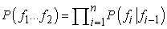

<?xml version="1.0" encoding="UTF-8" standalone="no"?>

<html xmlns="http://www.w3.org/1999/xhtml"><head><meta name="generator" content="DocBook XSL Stylesheets V1.76.1"/></head><body>

<h1 class="title"><a id="id775953"/>Gépi fordítás</h1>

A gépi fordítás (machine translation) egy természetes nyelvű szöveg egyik nyelvről (forrás) egy másik nyelvre (cél) történő automatikus fordítása. Ez a folyamat számos feladatra alkalmasnak bizonyult, beleértve a következőket:

<ol class="orderedlist"><li class="listitem">
<strong>Nyersfordítás</strong> (<strong>rough translation</strong>), amelyben a cél pusztán az, hogy egy passzus lényegét megkapjuk. Nyelvtanilag helytelen és nem elegáns mondatokat is elfogadunk, mindaddig, amíg a jelentés világos. Például a webszörfözés során a felhasználó gyakran örül az idegen nyelvű weboldal nyersfordításának. Az esetek egy részében egy egynyelvű ember utólagosan szerkesztheti a kimenetet, az eredeti szöveg elolvasásának szükségessége nélkül. A géppel támogatott fordítás ezen típusa azért takarít meg pénzt, mert az ilyen szerkesztőknek kevesebbet kell fizetni, mint a kétnyelvű fordítóknak.
</li><li class="listitem">
<strong>Korlátozott forrás fordítása</strong> (<strong>restricted-source translation</strong>), amelyben a forrásszöveg témája és formátuma szigorúan korlátozott. Az egyik legsikeresebb példa a <code class="code">TAUM-METEO</code> rendszer, amely időjárás-jelentéseket fordít angolból franciára. Azért működik, mert az időjárás-jelentések nyelvezete erősen stilizált és reguláris.
</li><li class="listitem">
<strong>Előre szerkesztett fordítás</strong> (<strong>preedited translation</strong>), amelyben egy ember úgy szerkeszti meg előre a forrásdokumentumot, hogy megfeleljen az angol nyelv (vagy bármely forrásnyelv) egy korlátozott részhalmazának. Ez a megközelítés különösen akkor költséghatékony, amikor egyetlen dokumentumot sok nyelvre kell lefordítani, mint például jogi szövegeket az Európai Közösségnél, vagy olyan vállalatok esetén, amelyek ugyanazt a terméket sok országban értékesítik. A korlátozott nyelveket néha „Caterpillar-angolnak” nevezik, mert a Caterpillar vállalat volt az első, amelyik az útmutatóit ilyen formában próbálta megírni. A Xerox olyan nyelvet definiált a javítási útmutatók számára, amely annyira egyszerű volt, hogy géppel le lehetett fordítani minden olyan nyelvre, amellyel a Xerox érintkezésbe kerül. További haszonként az eredeti angol nyelvű útmutatók is világosabbá váltak.
</li><li class="listitem">
<strong>Irodalmi fordítás</strong> (<strong>literary translation</strong>), amely a forrásszöveg legkisebb árnyalatát is megőrzi. Ez jelenleg túlmutat a legmodernebb gépi fordítók képességén is.
</li></ol>

A nyersfordítás példájaként álljon itt jelen fejezetünk első bekezdésének a <code class="code">SYSTRAN</code> fordító szolgáltatás által történt fordítása előbb olaszra, majd vissza angolra:[<a id="id776021" href="#ftn.id776021" class="footnote">252</a>]

A fordítás azért nehéz, mert általában a szövegek mély megértését igényli, amihez pedig a közölt szituáció mély megértése szükséges. Ez még nagyon egyszerű szövegek esetén is fennáll, sőt egyszavas „szövegek” esetén is. Vegyük a „Open” szót egy üzlet ajtaján.[<a id="id776050" href="#ftn.id776050" class="footnote">253</a>] Ez azt az információt közvetíti, hogy az üzlet pillanatnyilag fogad vevőket. Most vegyük ugyanezt a szót egy újonnan felépített üzleten található hatalmas transzparensen. Ez azt jelenti, hogy az üzlet megnyílt, de az olvasók nem éreznék becsapva magukat, ha éjszaka a transzparens eltávolítása nélkül lenne zárva a bolt. A két felirat ugyanazt a szót használja különböző jelentések közvetítésére. Német nyelvű országban a felirat az ajtón „Offen”, míg a transzparensen „Neu eröffnet” lenne.[<a id="id776056" href="#ftn.id776056" class="footnote">254</a>]

Az a probléma, hogy az egyes nyelvek eltérő módon kategorizálják a világot. Például a francia „doux” szó jelentések széles körét fogja át, amely megközelítőleg a következő angol szavakkal adható meg: „soft”, „sweet”, „gentle”.[<a id="id776067" href="#ftn.id776067" class="footnote">255</a>] Hasonlóképpen az angol „hard” szó gyakorlatilag a német „hart” szó összes jelentését (fizikailag ellenálló, durva) lefedi, emellett a „schwierig” („nehéz”, fáradságos, bonyolult értelemben) szó néhány jelentését is magában foglalja. A német „heilen” (meggyógyít) ige az angol „cure” (gyógyít) szó orvosi használatát fedi le, továbbá a „heal” (meggyógyul) tranzitív és intranzitív jelentéseit. Emiatt az adott mondat jelentésének ábrázolása sokkal nehezebb a fordítás, mint az egynyelvi megértés esetén. Egy egynyelvű elemzőrendszer használhatna olyan predikátumokat, mint <em>Open</em>(<em>x</em>), azonban a fordítás céljából a reprezentációs nyelvnek esetleg több megkülönböztetést kellene tennie, például az „Offen” jelentést reprezentáló <em>Open</em>1(<em>x</em>) predikátummal és a „Neu eröffnet” jelentést reprezentáló <em>Open</em>2(<em>x</em>) predikátummal. Azt a reprezentációs nyelvet, amely a lefedett nyelvekhez szükséges összes megkülönböztetést lehetővé teszi, <strong>köztes nyelv</strong>nek (<strong>interlingua</strong>) nevezzük.

Folyékony fordításhoz az szükséges, hogy a fordító (ember vagy gép) elolvassa az eredeti szöveget, megértse a szituációt, amiről szól, és találjon egy megfelelő szöveget a célnyelvben, amely jól leírja ugyanazt, vagy egy hasonló szituációt. Ez gyakran választást jelent. Például amennyiben az angol „you” szó egy személyre vonatkozik, akkor vagy a magyar hivatalos „ön” vagy a közvetlen „te” alakra fordítható. Egyszerűen nem lehet a „you” fogalomról beszélni magyarul anélkül, hogy eldöntenénk, hogy hivatalos vagy közvetlen módon szeretnénk használni. A fordítók (mind a gépi, mind az emberi) néha nehezen tudják ezt a döntést meghozni.

<h2 class="title"><a id="id776115"/>Gépi fordító rendszerek</h2>

A gépi fordító rendszerek erősen különböznek abban, hogy milyen szinten elemzik a szöveget. Egyes rendszerek a bemeneti szöveget egészen a köztes nyelv szintjéig próbálják elemezni (mint ahogy azt a 22. fejezetben tettük), majd a célnyelven ezen reprezentáció alapján generálnak mondatokat. Ez azért nehéz, mert részproblémaként tartalmazza a teljes nyelvi megértés problémáját, amihez még a köztes nyelv kezeléséből fakadó nehézségek is hozzáadódnak. A megközelítés azért törékeny, mert ha az elemzés sikertelen, akkor nincs kimenet. Azonban az az előnye, hogy a rendszerben nincs olyan komponens, amelynek két (természetes) nyelvet egyszerre kell ismernie. Ez azt jelenti, hogy köztes nyelv használatával <em>n</em> nyelv közti fordítás <em>O</em>(<em>n</em>) és nem <em>O</em>(<em>n</em>2) nehézségű.

Más rendszerek az <strong>átvitel</strong>en (<strong>transfer</strong>) alapulnak. Fordítási szabályok (vagy példák) adatbázisát tartalmazzák, és amikor egy szabály (vagy példa) illeszkedik, akkor közvetlenül fordítanak. Az átvitel lexikai, szintaktikai vagy szemantikai szinten történhet. Például egy szigorúan szintaktikai szabály az angol [<em>Melléknév Főnév</em>] szekvenciát a francia [<em>Főnév Melléknév</em>] szekvenciába képezi le. Egy kevert szintaktikai és lexikai szabály a francia [S1 „et puis” S2] szekvenciát az angol [S1 „and then” S2] szekvenciába képezi le.[<a id="id776175" href="#ftn.id776175" class="footnote">256</a>] Azt az átvitelt, amely egy mondatot közvetlenül egy másikba visz át,<strong> memóriaalapú fordítás</strong>nak (<strong>memory-based translation</strong>) nevezünk, mivel nagyszámú (angol, francia) pár memorizálására támaszkodik. Az átviteli módszer robusztus, mert minden esetben generál <em>valamilyen</em> kimenetet, és legalább a szavak egy része feltétlenül helyes. A 23.5. ábra bemutatja az egyes átviteli pontokat.

<a id="id776205"/>
<strong>23.5. ábra - Egy gépi fordító rendszer választási lehetőségeit ábrázoló sematikus diagram. A fenn található angol szöveggel kezdjük. A köztes nyelven alapuló rendszer a folytonos vonalakat követi, az angol szöveget először szintaktikai elemzésnek veti alá, majd szemantikai és köztes nyelvi reprezentációt állít elő, végül szemantikai, szintaktikai és lexikai formákon keresztül francia szöveget állít elő. Az átvitelalapú rendszerek a szaggatott vonalak által jelölt rövidzárakat használják. Az egyes rendszerek eltérő szinteken végzik az átvitelt, egyes rendszerek több szinten is.</strong>

<h2 class="title"><a id="id779047"/>Statisztikai gépi fordítás</h2>

Az 1960-as évek elején nagy reményeket fűztek ahhoz, hogy a számítógépek képesek egyik természetes nyelvből a másikba fordítani csakúgy, mint ahogy Turing projektje képes volt kódolt német üzeneteket értelmes német szövegbe fordítani. 1966-ra világossá vált, hogy a folyékony fordítás igényli az üzenet jelentésének a megértését, míg a kódfejtés nem.

Az elmúlt évtizedben elmozdulás volt megfigyelhető a statisztikai alapú gépi fordító rendszerek irányába. Természetesen, a 23.5. ábra bármely lépésének javára szolgálnának statisztikai adatok, valamint egy olyan egyértelmű valószínűségi modell használata, amely megadja, hogy mi egy jó analízis vagy átvitel. Azonban a „statisztikai gépi fordítás” az egész fordítási probléma olyan megközelítésének a megnevezésévé vált, amely a mondat legvalószínűbb fordításának kétnyelvű korpuszon alapuló megtalálását jelenti. A kétnyelvű korpuszok egyik példája a <strong>Hansard</strong>,[<a id="id779062" href="#ftn.id779062" class="footnote">257</a>] amely parlamenti viták naplója. Kanada, Hongkong és más országok kétnyelvű Hansardokat tesznek közzé, az Európai Unió 11 nyelven[<a id="id779070" href="#ftn.id779070" class="footnote">258</a>] publikálja hivatalos dokumentumait, míg az Egyesült Nemzetek Szervezete többnyelvű dokumentumokat ad ki. Ezek a statisztikai gépi fordítás számára felbecsülhetetlenül értékes forrásoknak bizonyultak.

Egy angol nyelvű mondat (<em>E</em>) például francia[<a id="id779088" href="#ftn.id779088" class="footnote">259</a>] (<em>F</em>) mondatra történő fordításának problémáját a Bayes-szabály következő alkalmazásaként írhatjuk le:

<table border="0"><colgroup><col width="143.4pt" class="col1"/><col width="293.0pt" class="col2"/></colgroup><tbody><tr><td style="text-align: justify" valign="top">
<code class="code">argmaxF <em>P</em>(<em>F</em>|<em>E</em>)</code>
</td><td style="text-align: justify" valign="top">
<code class="code">=	argmaxF <em>P</em>(<em>E</em>|<em>F</em>)<em>P</em>(<em>F</em>)/<em>P</em>(<em>E</em>)</code>
</td></tr><tr><td style="text-align: justify" valign="top"> </td><td style="text-align: justify" valign="top">
<code class="code">=	argmaxF <em>P</em>(<em>E</em>|<em>F</em>)<em>P</em>(<em>F</em>)</code>
</td></tr></tbody></table>

Ez a szabály azt állítja, hogy minden lehetséges <em>F</em> francia mondatot figyelembe kell vennünk, és azt kell választanunk, amelyik maximalizálja <em>P</em>(<em>E</em>|<em>F</em>)<em>P</em>(<em>F</em>)-t. A <em>P</em>(<em>E</em>) tényezőt nem kell figyelembe venni, hiszen minden <em>F</em> esetén azonos. A <em>P</em>(<em>F</em>) tényező a francia <strong>nyelvi modell</strong> (<strong>language model</strong>), azt adja meg, hogy milyen valószínűségű egy adott francia mondat. A <em>P</em>(<em>E</em>|<em>F</em>) a <strong>fordítási modell</strong> (<strong>translation model</strong>), azt adja meg, hogy milyen valószínűségű egy adott angol mondat, mint az adott francia mondat fordítása.

Az ügyes olvasók bizonyára csodálkoznak, hogy mit nyertünk a <em>P</em>(<em>F</em>|<em>E</em>) definiálásával a <em>P</em>(<em>E</em>|<em>F</em>) segítségével. A Bayes-szabály más alkalmazásainál azért tettük ezt, mert kauzális modellt akartunk használni. Például a <em>P</em>(<em>Szimptómák</em>|<em>Betegség</em>) kauzális modellt használtuk <em>P</em>(<em>Betegség</em>|<em>Szimptómák</em>) kiszámolására. A fordítás esetében azonban egyik irány sem kauzálisabb, mint a másik. Jelen esetben a Bayes-szabály alkalmazásának az az oka, hogy azt hisszük, képesek leszünk egy olyan <em>P</em>(<em>F</em>) nyelvi modellt megtanulni, amely pontosabb, mint a <em>P</em>(<em>E</em>|<em>F</em>) fordítási modell (és pontosabb, mint <em>P</em>(<em>F</em>|<em>E</em>) közvetlen becslése). Lényegében a problémát két részre osztottuk: először a <em>P</em>(<em>F</em>|<em>E</em>) fordítási modellt alkalmazzuk, hogy olyan francia mondatokat találjunk, amelyek visszaadják az angol mondat lényegét, de amelyek nem feltétlenül folyékony francia mondatok, majd a <em>P</em>(<em>F</em>) nyelvi modellt (amelyre sokkal jobb valószínűségi becslésünk van) használjuk a legjobb jelölt kiválasztására.

A <em>P</em>(<em>F</em>) <strong>nyelvi modell</strong> bármilyen olyan modell lehet, amely egy mondathoz valószínűséget rendel. <em>Nagyon</em> nagy korpusz esetén <em>P</em>(<em>F</em>)-et közvetlenül becsülhetnénk az egyes mondatok korpuszbeli előfordulási száma alapján. Például ha a webről összegyűjtünk 100 millió francia mondatot, és a „Clique ici”[<a id="id779431" href="#ftn.id779431" class="footnote">260</a>] mondat 50 ezerszer fordul elő, akkor <em>P</em>(Clique ici) = 0,0005. Azonban még 100 millió példa esetén is a legtöbb mondat előfordulási száma nulla lenne.[<a id="id779444" href="#ftn.id779444" class="footnote">261</a>] Emiatt az ismert bigram modellt fogjuk alkalmazni, amelyben az <em>f</em>1…<em>fn </em>szavakból álló francia nyelvű mondat valószínűsége:

Ismernünk kell az olyan bigram valószínűségeket, mint például a <em>P</em>(Eiffel|tour) = 0,02.[<a id="id779478" href="#ftn.id779478" class="footnote">262</a>] Ez a szintaxis mindössze nagyon lokális jellemzőit képes leírni, ahol a szó csak az őt megelőző szótól függ. A nyersfordításhoz azonban többnyire ez is elegendő.[<a id="id779486" href="#ftn.id779486" class="footnote">263</a>]

A <em>P</em>(<em>E</em>|<em>F</em>) <strong>fordítási modell</strong>t (<strong>translation model</strong>) nehezebb meghatározni. Egyrészt nem áll rendelkezésünkre (angol, francia) mondatpárokból álló kész gyűjtemény, amely alapján taníthatnánk. Másrészt a modell komplexitása nagyobb, mivel mondatok keresztszorzatára, és nem pedig különálló mondatokra alapul. Egy túlzottan leegyszerűsített fordítási modellel fogunk kezdeni, és felépítünk valamit, ami az „IBM Model 3”-at (Brown és társai, 1993) közelíti, ami továbbra is a végletekig leegyszerűsítettnek tűnik, azonban az esetek körülbelül felében elfogadható fordításokat generált.

A végletekig leegyszerűsített modell arról szól, hogy „a mondat fordításához egyszerűen fordítsuk le a szavakat egyesével és egymástól függetlenül, balról jobbra”. Ez egy unigram szóválasztási modell. Lehetővé teszi, hogy egyszerűen kiszámítsuk egy fordítás valószínűségét:

Néhány esetben ez a modell jól működik. Vegyük például a következőt:

<code class="code"><em>P</em>(the dog|le chien)  = <em>P</em>(the|le) × <em>P</em>(dog|chien)</code>

Bármely elfogadható valószínűségi értékhalmaz esetén a „the dog”[<a id="id779561" href="#ftn.id779561" class="footnote">264</a>] lenne a „le chien” maximum-likelihood becslője. A legtöbb esetben azonban a modell megbukik. Az egyik probléma a szórend. Franciában a „dog” megfelelője a „chien”, a „brown”-é a „brun”, azonban a „brown dog”-é a „chien brun”.[<a id="id779570" href="#ftn.id779570" class="footnote">265</a>] A másik probléma az, hogy a szóválasztás nem egy az egyes leképezés. Az angol „home” szót gyakran „à la maison”-nak[<a id="id779580" href="#ftn.id779580" class="footnote">266</a>] fordítják, ami egy hármas leképezés (illetve három az egybe a másik irányban). Ezen problémák ellenére az IBM Model 3 makacsul ragaszkodik az alap unigram modellhez, bár, hogy javítson rajta, hozzátesz néhány kiegészítést.

A modell, hogy képes legyen kezelni azt a tényt, hogy a szavakat nem egy az egyben fordítjuk, bevezeti a szó <strong>termékenység</strong>ének (<strong>fertility</strong>) fogalmát. Egy <em>n</em> termékenységű szót <em>n</em>-szer lemásolja, és az <em>n</em> másolat mindegyike függetlenül fordítódik. A modell az összes francia szóra tartalmazza a <em>P</em>(<em>termékenység = n</em>|<em>szó</em>) paramétereket. Az „à la maison” „home”-ra történő fordításához a modell 0 termékenységet választana az „à” és „la” szavakra,[<a id="id779622" href="#ftn.id779622" class="footnote">267</a>] míg egyet a „maison”-ra, és utána az unigram modellt alkalmazná a „maison” szó „home”-ra történő fordításához. Ez eléggé indokoltnak tűnik, az „à” és a „la” kis információtartalmú szavak, amelyeket ésszerű üres karakterfüzérré fordítani. A másik irányba történő fordítás már kétségesebb. A „home” szóhoz hármas termékenységet rendelne a modell, „home home home” szekvenciát kapva. Az első „home” „à”-ra, a második „la”-ra, míg a harmadik „maison”-ra fordulna. A fordítási modell szempontjából az „à la maison” és a „maison à la” pontosan azonos valószínűséget kapna. (Pont ez a kétséges rész.) A nyelvi modellre lenne bízva, hogy eldöntse, melyik a jobb. Értelmesebbnek tűnhet a „home”-ot közvetlenül „à la maison”-ra fordítani, mint közvetett módon a „home home home”-on keresztül, azonban ehhez sokkal több paraméterre lenne szükség, amelyeket nehéz lenne a rendelkezésre álló korpuszból meghatározni.

A fordítási modell végső része a szavak megfelelő sorrendbe történő permutálása. Ez egy eltolási modellel történik, amely során a szó az eredeti pozíciójából a végleges pozícióba mozog. Például a „chien brun” „brown dog”-ra történő fordítása során a „brown” szó +1 eltolási értéket kap (azaz jobbra egy pozíciót mozog), míg a „dog” –1 értéket. Az olvasó elképzelheti, hogy az eltolásnak függnie kellene a szótól: az olyan melléknevek, mint a „brown” többnyire pozitív eltolási értékkel rendelkeznének, mert a francia nyelv általában a főnév után helyezi el a mellékneveket. Azonban az IBM Model 3 úgy döntött, hogy a szótól függő eltolás túl sok paramétert igényelne, ezért az eltolás független a szótól, és csak a mondatbeli pozíciótól és a mondat mindkét nyelvbeli hosszától függ. Azaz a modell a következő paramétereket becsüli:

<code class="code"><em>P</em>(<em>Eltolás</em> = <em>o</em>|<em>Pozíció</em> = <em>p</em>, <em>AngolHossz</em> = <em>m</em>, <em>FranciaHossz</em> = <em>n</em>)</code>

Azaz a „brown” szó „brown dog”-beli eltolásának meghatározásához megnézzük a <em>P</em>(<em>Eltolás</em>|1,2,2) értékét, amely mondjuk +1 értéket adna 0,3, és 0 értéket 0,7 valószínűséggel. Az eltolási modell még <em>kétségesebbnek</em> látszik, olyan, mintha egy olyan személy agyalta volna ki, aki sokkal jobban ért a mágnesbetűk hűtőn történő tologatásához, mint a valódi természetes nyelven történő beszédhez. Rövidesen bemutatjuk, hogy nem azért tervezték ilyen módon, mert jól modellezi a természetes nyelvet, hanem azért, mert a rendelkezésre álló adatokat ésszerűen hasznosítja. Mindenesetre arra szolgál, hogy élénken emlékeztessen bennünket arra, hogy egy középszerű fordítási modellt meg lehet menteni egy jó francia nyelvi modellel. Íme, egy példa egy mondat fordításának lépéseire.[<a id="id779682" href="#ftn.id779682" class="footnote">268</a>]

Most már tudjuk, hogyan kell kiszámítani a <em>P</em>(<em>F</em>|<em>E</em>) valószínűséget bármely (francia, angol) mondatpárra. Azonban amit igazából tenni akarunk az az, hogy egy adott angol mondat esetén megtaláljuk azt a francia mondatot, amely maximalizálja ezt a valószínűséget. Nem sorolhatunk fel egyszerűen mondatokat: 105 francia szó esetén 105<em>n</em> <em>n</em> hosszúságú mondat lehetséges, és számos összerendelés mindegyikre. Még ha csak a 10 leggyakoribb szó-szó fordítást tekintjük minden egyes szóra, és csak 0 és ±1 eltolást veszünk figyelembe, akkor is 2<em>n</em>/210n mondatot kapunk, ami azt jelenti, hogy <em>n = </em>5 esetén még fel tudnánk őket sorolni, de <em>n = </em>10 esetén már nem. Ehelyett meg kell <em>keresnünk</em> a legjobb megoldást. Az <em>A</em>* keresés hatékonynak bizonyult a feladatra (Germann és társai, 2001).

<h2 class="title"><a id="id779749"/>Valószínűségek tanulása gépi fordításhoz</h2>

Körvonalaztunk egy olyan <em>P</em>(<em>F</em>|<em>E</em>) modellt, amely négy paraméterhalmazt tartalmaz:

<code class="code">Nyelvi modell:			<em>P</em>(<em>szói</em>|<em>szói</em>–1)</code>

<code class="code">Termékenységi modell:		<em>P</em>(<em>Termékenység = n</em>|<em>szóF</em>)</code>

<code class="code">Szóválasztási modell:		<em>P</em>(<em>szóE</em>|<em>szóF</em>)</code>

<code class="code">Eltolási modell:		<em>P</em>(<em>Eltolás = o</em>|pozíció, <em>hosszE</em>,<em> hosszF</em>)</code>

Ennek a modellnek még egy 1000 szót tartalmazó, szerény szókincs esetén is paraméterek millióira van szüksége. Nyilvánvalóan adatokból kell megtanulnunk őket. Feltételezzük, hogy az egyetlen rendelkezésünkre álló adat egy kétnyelvű korpusz. Lássuk a felhasználási módját:

<strong>Mondatokra történő szegmentáció:</strong> a fordítási egység a mondat, tehát a korpuszt mondatokra kell tördelnünk. A pont a mondatvég jellemző indikátora, de vegyük a „Dr. J. R. Smith of Rodeo Dr. megérkezett.” példát, amelyben csak az utolsó pont jelenti a mondat végét. A mondatokra történő szegmentációt körülbelül 98%-os pontossággal lehet elvégezni.

A <em>P</em>(<em>szói</em>|<em>szó</em><em>i</em>–1) <strong>francia nyelvi modell becslése:</strong> vegyük a korpusz francia nyelvű részét, számoljuk meg a szópárok előfordulási gyakoriságát, és végezzünk simítást, hogy megkapjuk a <em>P</em>(<em>szói</em>|<em>szó</em><em>i</em>–1) becslőjét. Például megkaphatjuk, hogy <em>P</em>(Eiffel|tour) = 0,02.

<strong>Mondatok illesztése: </strong>minden egyes angol nyelvű mondatra határozzuk meg az(oka)t a francia nyelvű mondato(ka)t, amely(ek) megfelel(nek) neki a francia változatban. Általában a szövegben következő angol mondat megfelel a következő francia mondatnak 1:1 megfeleltetéssel, azonban néha előfordulnak variációk: az egyik nyelvű mondatot 2:1 megfeleltetésbe vágjuk, vagy két mondat sorrendjét felcseréljük, 2:2 megfeleltetést kapva. Mindössze a mondathosszakat tekintve lehetséges az illesztésük (1:1, 1:2, 2:2 stb.) 90% és 99% közötti pontossággal, a Viterbi szegmentációs algoritmus (lásd 23.1. ábra) megfelelő variációjával. Még jobb illeszkedés is elérhető amennyiben olyan iránypontokat használunk, amelyek mindkét nyelvben közösek, mint például számok, tulajdonnevek, illetve olyan szavak, melyeknek – egy kétnyelvű szótár alapján – tudjuk, hogy egyértelmű a fordításuk.

A <em>P</em>(<em>Termékenység = n</em>|<em>szóF</em>) <strong>kezdeti termékenységi modell becslése:</strong> legyen adott egy <em>m</em> hosszúságú francia mondat, amely egy <em>n</em> hosszúságú angol mondathoz illeszkedik, ekkor vegyük ezt annak alátámasztásaként, hogy mindegyik (a mondatban előforduló) francia szó termékenysége <em>n/m</em>. Vegyük figyelembe ezeket az összes mondatra az egyes szavak termékenységi eloszlásának meghatározásához.

A <em>P</em>(<em>szóE</em>|<em>szóF</em>) <strong>kezdeti szóválasztási modell becslése:</strong> vegyük az összes olyan mondatot, amely tartalmazza például a „brun” szót. Azok a szavak, amelyek a leggyakrabban fordulnak elő az illeszkedő angol mondatokban, valószínűleg a „brun” szó-szó fordításai.

A <em>P</em>(<em>Eltolás = o</em>|<em>pozíció</em>, <em>hosszE</em>,<em> hosszF</em>) <strong>kezdeti eltolási modell becslése:</strong> most, hogy rendelkezünk egy szóválasztási modellel, használjuk fel azt az eltolási modell becslésére. Egy <em>n</em> hosszúságú angol mondat esetén, amely egy <em>m</em> hosszúságú francia mondathoz illeszkedik, vegyük minden egyes francia szót (<em>i</em> pozícióban) és minden olyan angol szót (<em>j</em> pozícióban), amely valószínű választás lenne a francia szóra, és vegyük ezt <em>P</em>(<em>Eltolás = i </em>– <em>j</em>|<em>i</em>, <em>n</em>, <em>m</em>) bizonyítékául.

<strong>A becslések javítása:</strong> használjuk az EM (elvárásmaximalizáló) algoritmust a becslések javítására. A rejtett változó az illeszkedő mondatpárok közti <strong>szóilleszkedési vektor</strong> (<strong>word alignment vector</strong>). A vektor megadja minden egyes angol szóra a megfelelő francia szó francia mondatbeli pozícióját. Például megkaphatjuk a következőt:

Először a paraméterek aktuális becslőit használva elkészítjük a szóilleszkedési vektort mindegyik mondatpárra. Ez jobb becslő megalkotását fogja számunkra lehetővé tenni. A termékenységi modellt az alapján becsüljük, hogy a szóilleszkedési vektor egy adott tagja hányszor képződik le több szóra, vagy egyetlenegyre sem. A szóválasztási modellnek a mondat összes szava helyett most már csak olyan szavakat kell figyelembe vennie, amelyek egymáshoz lettek illesztve. Az eltolási modell a mondat egyes pozícióinak elmozdulását vizsgálja a szóilleszkedési vektornak megfelelően. Sajnos nem tudjuk, hogy mi a helyes illeszkedés, és túl sok van belőlük ahhoz, hogy mindet felsoroljuk. Emiatt arra vagyunk kényszerítve, hogy megkeressünk néhány nagy valószínűségű illeszkedést, és a valószínűségükkel súlyozzuk őket, miközben bizonyítékot gyűjtünk az új paraméterbecslőkhöz. Mindössze ennyire van szükségünk az EM algoritmushoz. A kezdeti paraméterek alapján illeszkedéseket számolunk, majd az illeszkedések alapján javítjuk a paraméterbecslőket. Ismételjük, amíg konvergál.

 

[<a id="ftn.id776021" href="#id776021" class="para">252</a>]  A fejezet első bekezdésének eredeti angol szövege: <em>In Chapter 22, we saw how an agent could communicate with another agent (human or software), using utterances in a common language. Complete syntactic and semantic analysis of the utterances is </em>necessary<em> to extract the full meaning of the utterances, and is </em>possible<em> because the utterances are short and restricted to a limited domain.</em> Látható, hogy a két angol nyelvű szöveg között jelentős eltérések vannak, azonban a gépi fordítás eredményeként kapott szöveg nagyjából érthető. (<em>A ford.</em>)

[<a id="ftn.id776050" href="#id776050" class="para">253</a>]  Martin Kay példája.

[<a id="ftn.id776056" href="#id776056" class="para">254</a>]  Nyitva – Kinyitottunk (<em>A ford.</em>)

[<a id="ftn.id776067" href="#id776067" class="para">255</a>]  doux – édes, enyhe, lágy, soft – lágy, sweet – édes, gentle – finom, gyengéd (<em>A ford.</em>)

[<a id="ftn.id776175" href="#id776175" class="para">256</a>]  Mindkét esetben magyarul [S1 „és utána” S2] (<em>A ford.</em>)

[<a id="ftn.id779062" href="#id779062" class="para">257</a>]  William Hansard után elnevezve, aki 1811-ben elsőként publikálta a brit parlamenti vitákat.

[<a id="ftn.id779070" href="#id779070" class="para">258</a>]  Az angol nyelvű kiadás idején. (<em>A ford.</em>)

[<a id="ftn.id779088" href="#id779088" class="para">259</a>]  Ebben a bekezdésben az angolról francia nyelvre történő fordítás problémájával foglalkozunk. Ne zavarja az olvasót, hogy a Bayes-szabály alkalmazása a <em>P</em>(<em>E</em>|<em>F</em>), és nem a <em>P</em>(<em>F</em>|<em>E</em>) figyelembe vételéhez vezet, ami annak tűnik, mintha franciáról fordítanánk angolra.

[<a id="ftn.id779431" href="#id779431" class="para">260</a>]  Kattints ide (<em>A ford.</em>)

[<a id="ftn.id779444" href="#id779444" class="para">261</a>]  Amennyiben csak 100 ezer szó fordulna elő a lexikonban, akkor az összes lehetséges háromszavas mondatok 99,99999%-ának előfordulási száma nulla lenne a 100 milliós korpuszban. Hosszabb mondatok esetén még rosszabb a helyzet.

[<a id="ftn.id779478" href="#id779478" class="para">262</a>]  Eiffel-torony <em>(A ford.)</em>

[<a id="ftn.id779486" href="#id779486" class="para">263</a>]  Világos, hogy a fordítás finomabb részleteihez <em>P</em>(<em>fi</em>|<em>f</em><em>i–</em>1) nem elegendő. Híres példaként álljon itt Marcel Proust 3500 oldalas regénye, a „A la récherche du temp perdu”, amely ugyanazzal a szóval kezdődik és végződik, így egyes fordítók úgy döntöttek, hogy ugyanezt teszik, azaz egy szó fordítását egy olyan szóra alapozták, amely durván 2 millió szóval korábban fordult elő.

[<a id="ftn.id779561" href="#id779561" class="para">264</a>]  a kutya (<em>A ford.</em>)

[<a id="ftn.id779570" href="#id779570" class="para">265</a>]  barna kutya (<em>A ford.</em>)

[<a id="ftn.id779580" href="#id779580" class="para">266</a>]  home – otthon, à la maison – otthon lenni, haza menni értelemben (<em>A ford.</em>)

[<a id="ftn.id779622" href="#id779622" class="para">267</a>]  „à” – nagyjából a magyar -ban, -ben, -ba, -be ragoknak felel meg, „la” – nőnemű határozott névelő (<em>A ford.</em>)

[<a id="ftn.id779682" href="#id779682" class="para">268</a>]  A barna kutya nem ment haza. (<em>A ford.</em>)

</body></html>
