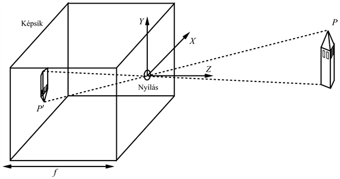
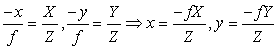
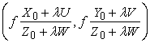
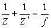
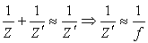
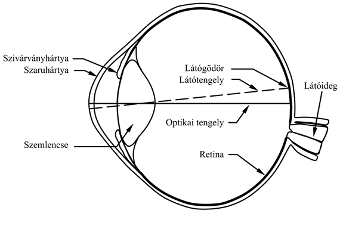
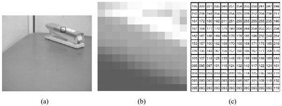

<?xml version="1.0" encoding="UTF-8" standalone="no"?>

<html xmlns="http://www.w3.org/1999/xhtml"><head><meta name="generator" content="DocBook XSL Stylesheets V1.76.1"/></head><body>

<h1 class="title"><a id="id780704"/>Képalkotás</h1>

A látás egy <strong>jelenet</strong> (<strong>scene</strong>) objektumairól szóródó fényt összegyűjti, majd egy kétdimenziós <strong>kép</strong>et (<strong>image</strong>) alkot egy képsíkon. A képsíkot fényérzékeny anyag borítja: a retinában rodopszinmolekulák, a negatív filmen ezüst-halogenidek, a digitális fényképezőgépben pedig egy töltéscsatolt eszköz (CCD) lapka. A CCD minden cellája öszszegyűjti a fényelnyelés által adott idő alatt keltett elektronokat. A digitális fényképezőgépben a képsík egy néhány millió <strong>képpont</strong>ból (<strong>pixel</strong>) álló négyzethálóra van felosztva. A szem hasonló képpontráccsal rendelkezik, amely körülbelül 100 millió pálcikát és 5 millió csapot tartalmaz egy hexagonális mozaikba rendezve.

A jelenet nagyon nagy, és a képsík egészen kicsi, tehát lennie kell valamilyen módszernek a fény képsíkra fókuszálásához. Ezt megtehetjük lencsével vagy anélkül. Bárhogy is tesszük, a lényeg a geometria meghatározása, hogy megmondhassuk, a jelenet melyik pontja hova kerül a képsíkon.

<h2 class="title"><a id="id780742"/>Lencsék nélküli képek: a sötétkamra</h2>

<a id="id780745"/>
<strong>24.1. ábra - A képalkotás geometriája a sötétkamrában</strong>

A képalkotás legegyszerűbb eszköze a <strong>sötétkamra</strong>, amely egy doboz elején található kis lyukból (<em>O</em>) és a doboz hátsó részén levő képsíkból áll (lásd 24.1. ábra). Egy háromdimenziós koordináta-rendszert fogunk használni, amelynek az origója az <em>O </em>pont, a jelenet egy <em>P</em> pontját pedig az (<em>X</em>, <em>Y</em>, <em>Z</em>) koordinátákkal reprezentáljuk. A <em>P </em>pontot egy <em>P'</em> pontra képezzük le a képsíkon, amelynek koordinátái (<em>X</em>, <em>Y</em>, <em>Z</em>). Ha <em>f</em> az <em>O</em> pontszerű lyuknak a képsíktól vett távolsága, akkor a hasonló háromszögek alapján az alábbi egyenleteket tudjuk levezetni:

Ezek az egyenletek egy <strong>perspektivikus vetítés</strong> (<strong>perspective projection</strong>) néven ismert képalkotási eljárást definiálnak. Vegyük észre, hogy a <em>Z</em> az osztóban azt jelenti, hogy minél távolabb van az objektum, annál kisebb lesz a képe. Valamint azt is figyeljük meg, hogy a kép, mind a bal–jobb, mind a fel–le irányban <em>fordított</em> a jelenethez képest, amit az egyenletekben a negatív előjel jelez.

A perspektivikus vetítésben a párhuzamos vonalak a horizontvonalon lévő pontban futnak össze. Nézzük meg, miért szükségszerű ez! Az (<em>X</em>0, <em>Y</em>0, <em>Z</em>0) ponton keresztül (<em>U</em>, <em>V</em>, <em>W</em>) irányban áthaladó egyenes leírható, mint az (<em>X</em>0 + <em>λU</em>, <em>Y</em>0 + <em>λV</em>, <em>Z</em>0 + <em>λW</em>) pontok halmaza, ahol <em>λ </em>a +∞ és –∞ között változik. Ezen egyenes egy <em>Pλ</em> pontjának képsíkra vett vetületét az:

adja. Amint <em>λ</em> → ∞ vagy <em>λ</em> → –∞ ez a pont a <em>p</em>∞ = (<em>fU/W</em>, <em>fV/W</em>) lesz, ha W ≠ 0. A <em>p</em>∞ pontot az (<em>U</em>, <em>V</em>, <em>W</em>) irányú egyenesek családjával kapcsolatos <strong>távlatpont</strong>nak (<strong>vanishing point</strong>) nevezzük. Az azonos irányú egyenesek távlatpontja azonos.

Ha a tárgy a kamrától vett távolságához képest viszonylag lapos, a perspektivikus vetítést a <strong>skálázott ortografikus vetítés</strong>sel (<strong>scaled orthographic projection</strong>) közelíthetjük. Ennek elve a következő. Ha a tárgy pontjainak <em>Z</em> mélysége egy bizonyos <em>Z</em>0  ± ∆<em>Z</em> tartományban változik, és ∆<em>Z = Z</em>0, akkor a perspektíva <em>f/Z</em> skála tényezőjét az <em>s = f/Z</em>0 állandóval lehet közelíteni. Az (<em>X</em>, <em>Y</em>, <em>Z</em>) jelenet koordinátákból a képsíkra történő vetítés egyenletei az <em>x</em> = <em>sX</em> és az <em>y = sY</em> lesznek. Jegyezzük meg, hogy a skálázott függőleges síkú vetítés egy közelítés, amely a jelenet azon részeire érvényes, amelyeknek a saját mélységváltozásuk elenyésző. A globális tulajdonságok tanulmányozására ezt a módszert nem szabad használni. Hogy az óvatosság nem árt, erre egy példa: függőleges síkú vetítésben a párhuzamos vonalak párhuzamosak maradnak ahelyett, hogy egy távlatpontban összefutnának.

<h2 class="title"><a id="id781026"/>Lencserendszerek</h2>

A gerincesek szeme és a modern kamerák is lencséket használnak. A lencse a sötétkamra nyílásánál nagyobb, így több fényt enged át. Ennek az az ára, hogy egyidejűleg a jelenet minden részének az élességét nem lehet biztosítani. A jelenet egy <em>Z</em> távolságban lévő pontjának a képe a lencsétől egy rögzített <em>Z'</em> távolságban keletkezik, és a <em>Z</em> és a <em>Z'</em> között az:

	

reláció áll fenn, ahol <em>f</em> a lencse fókusztávolsága. Ha a lencse optikai középpontja és a képsík közötti távolságot valamilyen <em>Z'</em>0-nak választjuk, a jelenet azon tárgyai, amelyek a <em>Z</em>0 körül egy adott mélységtartományban fekszenek, ahol <em>Z</em>0 a megfelelő tárgytávolság, nagyjából élesen fognak látszani. A jelenet ezen mélységi tartományát <strong>mélységélesség</strong>nek (<strong>depth of field</strong>) nevezzük.

Jegyezzük meg, hogy mivel a <em>Z</em> tárgytávolság általában sokkal nagyobb, mint a <em>Z' </em>képtávolság vagy mint az <em>f</em>, sokszor jogos az alábbi közelítés:

	

Azaz a képtávolság <em>Z' </em>≈ <em>f</em>. A sötétkamra vetítésegyenleteit tehát egy lencse által létrehozott kép geometriájának leírásához is használhatjuk.

Ahhoz, hogy a különböző <em>Z</em> távolságban lévő tárgyakat élesen lássuk, az emberi szem lencséje (lásd 24.2. ábra) változtatja az alakját, a kamera lencséje pedig <em>Z</em> irányban elmozdul.

<a id="id781135"/>
<strong>24.2. ábra - Az emberi szem vízszintes keresztmetszete</strong>

<h2 class="title"><a id="id781145"/>A fény: a képalkotás fotometriája</h2>

A fény nélkülözhetetlen a látáshoz: nélküle minden kép egyformán sötét lenne, függetlenül attól, mennyire érdekes a jelenet. A <strong>fotometria</strong> (<strong>photometry</strong>) a fény tanulmányozása. Saját céljainkra azt fogjuk modellezni, hogy a jelenet fénye hogyan képződik le az időben a képsík fényintenzitására, amit <em>I</em>(<em>x</em>, <em>y</em>)-nal[<a id="id781171" href="#ftn.id781171" class="footnote">270</a>] jelölünk. A látás rendszere ezt a modellt visszafelé alkalmazza, a képek intenzitásából kiindulva a világ tulajdonságai felé. A 24.3. ábra egy asztalon lévő tűzőgép digitalizált képét és a tűzőgép egy 12 × 12 képpontból álló részletét mutatja. Egy számítógépes program, amely értelmezni próbálja a képet, egy ilyen intenzitásmátrixból indulna ki.

<a id="id781195"/>
<strong>24.3. ábra - (a) Egy asztalon lévő tűzőgép fényképe. (b) Az (a) egy 12 × 12 képpontból álló, nagyított részlete. (c) A részletnek megfelelő képfényességértékek egy 0-tól 255-ig tartó skálán.</strong>

A kép egy képpontjának a fényessége arányos a jelenet képpontba vetített felületeleme által a kamera felé irányított fény mennyiségével. Ez viszont függ a felületelem fényvisszaverő tulajdonságaitól és a fényforrások elhelyezésétől, valamint eloszlásától a jelenetben. Egy képpont fényességébe a jelenet egyéb részeinek fényvisszaverő tulajdonságai is beleszólnak, hiszen a jelenet más felületei indirekt fényforrásként szolgálnak, mivel a rájuk eső fényt az adott felületelem felé verik vissza.

Kétféle visszaverődést modellezhetünk. A <strong>tükröző visszaverődés</strong> (<strong>specular reflection</strong>) azt jelenti, hogy a fény a tárgy külső felületéről verődik vissza, és teljesíti azt a kényszert, miszerint a beesés és a visszaverődés szöge megegyezik. Ilyen a tökéletes tükör viselkedése. A <strong>diffúz visszaverődés</strong> (<strong>diffuse reflection</strong>) azt jelenti, hogy a fény a tárgy felszínén belülre hatol, a tárgy a fényt elnyeli és ismételten kisugározza. A tökéletesen <strong>diffúz</strong> (avagy <strong>Lambert-féle</strong>) <strong>felület</strong> minden irányban azonos intenzitással szórja a fényt. Az intenzitás egyedül a fényforrástól érkező fény beesési szögétől függ: a felületre pontosan merőleges fényforrás esetén lesz a legnagyobb intenzitású a reflexió, míg majdnem párhuzamos fényforrás esetén a legkisebb. E két véglet között a viszszaverődést Lambert koszinusztörvénye írja le:

<code class="code"><em>I</em> = <em>kI</em>0cos<em>θ</em></code>

ahol <em>s</em> a fényforrás intenzitása,  a felület normálisa és a fény beesési iránya közötti szög, <em>k</em> a visszaverődési tényező értéke, amely a felület visszaverési képességeitől függ, és 0-tól (tökéletesen fekete felület) 1-ig (tökéletesen fehér felület) változik.

A valódi életben a felületek kevert, diffúz és tükrös tulajdonságúak. Számítógépes modellezésük a számítógépes grafika fő alkalmazási területe. A valósághű képek előállítása általában fénysugár-követési eljárással történik, amely szimulálja azt a fizikai folyamatot, ahogy a fénysugár a forrásnál keletkezik, és a tárgyakról többszörösen visszaverődik.

<h2 class="title"><a id="id782342"/>Színek: a képalkotás spektrális fotometriája</h2>

A 24.3. ábrán egy fekete-fehér képet mutattunk, nagyban figyelmen kívül hagyva azt a tényt, hogy a látható fény a hullámhosszak egész tartományát öleli át – a 400 nm-től kezdve a spektrum ibolyaszínű végénél, egészen a 700 nm-ig a vörös színű végénél. Bizonyos fény csak egyetlen hullámhosszból áll, amely a szivárvány egy színének felel meg. De más fények különböző hullámhosszok keverékei. Azt jelenti ez, hogy az <em>I</em>(<em>x</em>, <em>y</em>) mértékére egyetlen szám helyett az értékek egy keveréke kell? Ha a fény fizikáját pontosan akarnánk reprezentálni, akkor bizony igen. De ha csak utánozni akarjuk az emberek (és más gerincesek) fényérzékelését, akkor köthetünk kompromisszumokat. Kísérletek mutatják (egészen 1801-től, Thomas Youngtól), hogy hullámhosszak bármilyen komplex keverékét is előállíthatjuk mindössze három szín keverésével. Azaz, ha van egy fénygenerátor, amely képes lineárisan kombinálni három hullámhosszt (tipikusan a vörös [700 nm], a zöld [546 nm] és a kék [436 nm] színeket választjuk), akkor az egyes színeket erősítő, másokat gyengítő gombok csavargatásával <em>bármilyen</em> hullámhossz-kombináció beállítható, legalábbis az emberi érzékelés szempontjából. Ez a kísérleti tény azt jelenti, hogy a képek egy olyan vektorral reprezentálhatók, amely képpontokként csak három intenzitásértéket tárol: minden elsődleges hullámhosszra egyet. A gyakorlatban mindegyiket egy bájttal ábrázolva a kép igen jó minőségű reprodukcióját kapjuk. A színek ezen háromszínű észlelése azzal a ténnyel van összefüggésben, hogy háromféle csap található a retinában, amelyek érzékelési maximuma 650, 530 és 430 nm, de az összefüggés pontos részletei az egy az egyben történő leképezésnél bonyolultabbak.

 

[<a id="ftn.id781171" href="#id781171" class="para">270</a>]  Ha az időbeli változást is vizsgáljuk, akkor az <em>I</em>(<em>x</em>, <em>y</em>,<em> t</em>)<em> </em>jelölést alkalmazzuk.

</body></html>
