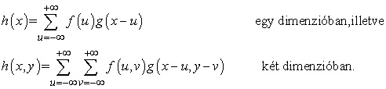

<?xml version="1.0" encoding="UTF-8" standalone="no"?>

<html xmlns="http://www.w3.org/1999/xhtml"><head><meta name="generator" content="DocBook XSL Stylesheets V1.76.1"/></head><body>

<h1 class="title"><a id="id782362"/>Előzetes képfeldolgozási műveletek</h1>

Láttuk eddig, hogy a fény hogyan tükröződik a jelenet tárgyairól egy mondjuk ötmillió hárombájtos képpontból álló képet formálva. Mint minden érzékelő esetében, most is lesz zaj a képben, és minden esetben nagyon sok adattal kell dolgozni. Elsőként a finomítás műveleteit nézzük meg, amelyekkel a zaj csökkenthető, majd az éldetektálás műveleteit vizsgáljuk. Ezeket „előzetes” vagy „alacsony szintű” műveleteknek hívjuk, mivel ezek az elsők egy műveletsorozatban. Az előzetes látási műveletekre egyrészt a lokalitás jellemző (a kép egy részletére végrehajthatók anélkül, hogy néhány képpontnál messzebb bármit is figyelembe vennénk), másrészt az ismeretek hiánya: anélkül finomíthatjuk a képeket vagy detektálhatunk éleket, hogy bármilyen fogalmunk lenne arról, milyen objektumok vannak a képeken. Ez az alacsony szintű műveleteket esélyessé teszi a párhuzamos hardveren történő megvalósításra, akár élőlényekben, akár mesterséges eszközökben. Ezek után a középső szinten levő műveletek nézzük majd meg, amelyekkel a kép régiókra bontható. A műveletek ezen fázisa még mindig a képen dolgozik, nem a jeleneten, de nem helyi feldolgozást igényel.

A 15.2. alfejezetben a <strong>simítás</strong> (<strong>smoothing</strong>) azt jelentette, hogy egy állapotváltozó értékét jósoltuk meg valamilyen múltbeli <em>t</em> időpontra, bizonyos, a <em>t</em> időpontra és további, egészen a jelenig terjedő időpontokra vonatkozó tények ismeretében. Most ugyanezt az ötletet alkalmazzuk a térbeli kiterjedésre az időbeli helyett: a simítás egy képpont értékének jóslását jelenti a környező képpontok alapján. Vegyük észre, hogy világosan megkülönböztetjük a képpontban mért megfigyelt értéket és azt a valódi értéket, amit ott mérnünk kellett volna. Ezek véletlenszerű és szisztematikus mérési hibák (például ha a CCD érzékelője elromlott) miatt különbözhetnek.

A simítás egyik módszere az, ha minden képponthoz az őt környező szomszédok értékeinek átlagát rendeljük. Ez az extrém értékek kihagyása felé mutató megoldás. De hány szomszédot kell figyelembe vennünk – az egy képpontnyi távolságra vagy a kettő esetleg több pont távolságra lévőket? Erre egy válasz, amely jól működik Gauss-zajok kiszűrésére, a <strong>Gauss-szűrő</strong>t (<strong>Gaussian filter</strong>) használó súlyozott átlag. Emlékezzünk a standard <em>δ</em> szórással rendelkező Gauss-függvényre: 

Egy Gauss-szűrő alkalmazása azt jelenti, hogy az <em>I</em>(<em>x</em>0, <em>y</em>0) intenzitást lecseréljük a minden<em> </em>(<em>x</em>, <em>y</em>)-ra kiszámolt <em>I</em>(<em>x</em>, <em>y</em>)<em>Gσ</em>(<em>d</em>)<em> </em>intenzitások összegével, ahol <em>d</em> az (<em>x</em>0, <em>y</em>0) és az (<em>x</em>, <em>y</em>) pontok távolsága. Az ilyen fajta súlyozott összeg olyan gyakori, hogy van számára egy speciális elnevezés és jelölés. Azt mondjuk, hogy a <em>h</em> függvény az <em>f</em> és a <em>g</em> függvények <strong>konvolúció</strong>ja (<strong>convolution</strong>) (amit <em>h</em> = <em>f </em>∗ <em>g</em> alakban írunk), ha

Azaz a simított függvényt úgy kapjuk, hogy a képet a Gauss-függvénnyel konvolváljuk: <em>I</em> ∗ <em>Gσ</em>. Egy képpontnyi σ kevés zaj kisimításához elegendő, míg 2 képpontnyi több zajt fog elsimítani, de valamilyen mértékű részletvesztés mellett. Mivel a Gauss-hatás a távolsággal eltűnik, a gyakorlatban a ± ∞ a szummákban ± 3<em>σ</em>-val helyettesíthető.

<h2 class="title"><a id="id782544"/>Éldetektálás</h2>

Az előzetes látás következő lépése az <strong>él</strong>ek (<strong>edge</strong>s) detektálása a képsíkon. Az élek olyan egyenes vagy görbe vonalak a képsíkon, amelyekre merőlegesen a kép fényességében „lényegesen” változás van. Az éldetektálás végső célja, hogy eltávolodjunk a bonyolult, több megabájtos képtől egy tömörebb, absztrakt reprezentáció felé, mint amilyen a 24.4. ábrán látható. Az indíték az, hogy a kép élkontúrjai a jelenet fontos kontúrjainak felelnek meg. A képen három mélységi diszkontinuitás példa szerepel 1-gyel címkézve; a 2-vel címkézett felületi orientáció diszkontinuitásból két példa látható, míg a 3-mal címkézett visszaverődési képesség diszkontinuitásokról és a 4-gyel címkézett fényességi diszkontinuitásokról (árnyék) egy-egy. Az éldetektálás csak a képpel foglalkozik, így nem tesz különbséget a jelenet ezen diszkontinuitásfajtái között, de a későbbi feldolgozás igen.

A 24.5. (a) ábra egy asztalon nyugvó tűzőgépet tartalmazó jelenet képét mutatja, a 24.5. (b) pedig a képre lefuttatott éldetektáló algoritmus eredményét mutatja. Láthatjuk, hogy az éldetektáló kimenete és az ideális vonalas ábra között van különbség. A kis részek élei nem mind illeszkednek egymáshoz, vannak hézagok, ahol nincsenek vonalak, valamint „zajos” kontúrok, amelyek a jeleneten semmilyen lényeges vonásnak nem felelnek meg. A későbbi feldolgozási fázisokban ezeket a hibákat majd korrigálni kell. Hogyan detektáljuk a képen az éleket? Figyeljük meg a kép fényintenzitás-profilját egy egydimenziós keresztmetszet mentén egy élre merőleges irányban, pl. az asztal bal éle és a fal között. Nagyjából olyan lesz ez, mint amit a 24.6. (a) ábra mutat. Az él helye az <em>x = </em>50-nek felel meg.

<a id="id782566"/>
<strong>24.4. ábra - Különféle élek: (1) mélységi diszkontinuitás, (2) felületi orientáció diszkontinuitás, (3) viszszaverődési képesség diszkontinuitás, (4) fényességi diszkontinuitás (árnyékok)</strong>

<a id="id782576"/>
<strong>24.5. ábra - (a) Egy asztalon nyugvó tűzőgép fényképe. (b) Az (a) alapján meghatározott élek.</strong>

Tekintettel, hogy az élek azoknak a képhelyeknek felelnek meg, ahol a fényességben hirtelen változás tapasztalható, egy naiv ötlet az lehetne, hogy a képet differenciáljuk, és azokat a helyeket keressük meg, ahol az<em> I'</em>(<em>x</em>) derivált értéke nagy. Nos, az ötlet majdnem működőképes. A 24.6. (b) ábrán láthatjuk, hogy az <em>x = </em>50 csúccsal együtt más helyeken, másodlagos csúcsok is megjelentek (például <em>x = </em>75), amiket tévesen valódi éleknek fogadhatunk el. A jelenség oka a kép zajossága. Ha a képet először simítjuk, akkor a felesleges csúcsok eltűnnek, ahogy azt a (c) mutatja.

<a id="id782602"/>
<strong>24.6. ábra - Felül: Az <em>I(x)</em> intenzitásprofil egy egydimenziós részlet mentén egy lépcsőfok élén át. Középen: Az intenzitás deriváltja, <em>I'(x)</em>. A függvény nagy értékei éleknek felelnek meg, de a függvény zajos. Lent: Az intenzitás simított változatának deriváltja, (<em>I</em> ∗<em>G σ</em>)<em>'</em>, amely <em>I</em> ∗ <em>G'</em>-hoz hasonlóan egy lépésben számolható. Az<em> x</em> = 75 pontban levő zajos él jelölt eltűnt.</strong>

Van arra esélyünk, hogy optimalizáljuk a munkát ezen a ponton: egyetlen műveletben kombinálhatjuk a simítást és az éldetektálást. Egy tétel szerint tetszőleges <em>f</em> és <em>g</em> függvények esetén megmutatható, hogy a konvolúció deriváltja (<em>f </em>∗<em> g</em>)<em>' </em>megegyezik a derivált konvolúciójával: <em>f</em> ∗ (<em>g</em>)<em>'</em>. Tehát ahelyett, hogy először simítanánk, majd differenciálnánk, egyszerűen konvolváljuk a képet a Gauss simító függvény deriváltjával, <em>G'σ</em>-val. Így az egydimenziós éldetektálás algoritmusa a következő:

<ol class="orderedlist"><li class="listitem">
Az <em>I</em> képet a <em>G'σ</em>-val kell konvolválnunk, hogy az <em>R</em>-et megkapjuk.
</li><li class="listitem">
Jelöljük be az azokat a csúcsokat ||<em>R</em>(<em>x</em>)||-ben, amelyek egy előre definiált <em>T</em> küszöbnél magasabbak. A küszöb értékét úgy határozzuk meg, hogy a zaj miatti másodlagos csúcsokat elimináljuk.
</li></ol>

Két dimenzióban egy él irányítottsága tetszőleges <em>θ </em>szögű lehet. A függőleges élek detektálásának módja nyilvánvaló: <em>G'σ</em>(<em>x</em>) <em>Gσ</em>(<em>y</em>)-nal kell konvolválnunk a képet. A hatás <em>y</em> irányban simító (a Gauss-konvolúció miatt), <em>x</em> irányban pedig egy simítással kísért differenciálás. A függőleges élek detektálási algoritmusa így az alábbi:

<ol class="orderedlist"><li class="listitem">
Konvolváljuk az <em>I</em> (<em>x</em>, <em>y</em>) képet az <em>fV</em>(<em>x</em>, <em>y</em>) = <em>G'σ</em> (<em>x</em>) <em>Gσ</em> (<em>y</em>)-nal, hogy az <em>RV</em>(<em>x</em>, <em>y</em>) -t megkapjuk.
</li><li class="listitem">
Jelöljük be azokat a csúcsokat az ||<em>RV </em>(<em>x</em>, <em>y</em>)||-ben, amelyek egy előre definiált <em>Tn</em> küszöbnél magasabbak.
</li></ol>

A tetszőleges orientációjú él detektálásához a képet két szűrővel: az <em>fV</em> = <em>G'σ</em>(<em>x</em>) <em>Gσ</em>(<em>y</em>) és az <em>fH</em> = <em>G'σ</em>(<em>y</em>) <em>Gσ</em>(<em>x</em>) szűrővel kell konvolválni (az <em>fH</em> az <em>fV</em> 90°-kal elforgatott változata). A tetszőleges orientációjú éldetektáló algoritmus az alábbi:

<ol class="orderedlist"><li class="listitem">
Konvolváljuk az <em>I</em> (<em>x</em>, <em>y</em>) képet az <em>fV</em> (<em>x</em>, <em>y</em>)-nal, valamint az <em>fH </em>(<em>x</em>, <em>y</em>)-nal, hogy az <em>RV</em>(<em>x</em>, <em>y</em>)-t és az <em>RH</em>(<em>x</em>, <em>y</em>) -t megkaphassuk. Definiáljuk az -t.
</li><li class="listitem">
Jelöljük be azokat a csúcsokat az ||<em>R</em>(<em>x</em>, <em>y</em>)||-ban, amelyek egy előre definiált <em>T</em> küszöbnél magasabbak.
</li></ol>

Miután ezzel az algoritmussal megjelöltük az élek képpontjait, a következő lépés az azonos élekhez tartozó képpontok összekötése. Ez megtehető, ha feltételezzük, hogy bármely két szomszédos képpont, amely élpont és konzisztens irányítottságú, szükségszerűen ugyanahhoz az élhez tartozik. Ezt a folyamatot <strong>Canny-féle éldetektor</strong>nak (<strong>Canny edge detection</strong>) nevezzük, kitalálója, John Canny után.

Miután detektáltuk őket, az élek alkotják több következő feldolgozási lépés alapját: felhasználhatjuk őket a térbeli képalkotásban, a mozgásdetektálásban és az objektumok felismerésében.

<h2 class="title"><a id="id783012"/>A kép szegmentálása</h2>

Az emberek <em>rendszerezik</em> észleléseiket; az egyes fotóérzékelőkhöz tartozó fényességértékek halmaza helyett vizuális csoportokat észlelünk, amelyek általában objektumokkal vagy azok részeivel asszociáltak. Ez a képesség a számítógépes látás számára is éppúgy fontos.

A <strong>szegmentálás</strong> (<strong>segmentation</strong>) a kép felbontása részcsoportokra a képpontok hasonlósága alapján. Az alapötlet a következő: minden képponthoz rendelhetünk bizonyos vizuális tulajdonságokat, mint például fényesség, szín és mintázat.[<a id="id783034" href="#ftn.id783034" class="footnote">271</a>] Ezek az attribútumok egy objektumon vagy annak egyetlen részén belül, csak kismértékben változnak, míg az objektumok közötti határok mentén tipikusan egyik vagy másik attribútum jelentősen változik. Úgy kell a képet képpontok halmazaira felosztanunk, hogy ezeket a kényszereket amennyire csak lehet, kielégítsük.

Többféle módszer létezik ezen intuitív elképzelés matematikai formalizálására. Például Shi és Malik (Shi és Malik, 2000) ezt gráfparticionálási problémaként határozzák meg. A gráf csomópontjai a képpontoknak felelnek meg, az élek pedig a köztük levő kapcsolatoknak. Egy <em>Wij</em> súly értéke az <em>i</em> és <em>j</em> képpontokat összekötő élen attól függ, hogy a két képpont mennyire hasonló fényességben, színben, mintázatban és más tulajdonságokban. Ezek után olyan partíciókat keresnek, amelyek minimalizálnak egy <em>normalizált vágási </em>kritériumot. Durván fogalmazva a gráf particionálásának kritériuma, hogy a csoportok közötti élek súlyainak összegét minimalizáljuk, a csoportokon belüli élek súlyainak összegét pedig maximalizáljuk.

A pusztán alacsony szintű, helyi tulajdonságokon – például a fényességen és színen – alapuló szegmentáció hibázásra hajlamos eljárás. Ahhoz, hogy az objektumokhoz rendelt határokat megbízhatóan megtalálhassuk, a jelenetben várható objektumfajtákról magas szintű tudást is be kell építenünk. A beszédfelismerésre ezt a rejtett Markov-modell formalizmusa teszi lehetővé, míg a képek kontextusában egy ilyen egységes keretrendszer még mindig az aktív kutatás tárgya. Mindenesetre az objektumokról szóló magas szintű tudás a következő alfejezet tárgya.

 

[<a id="ftn.id783034" href="#id783034" class="para">271</a>]  A mintázati jellemzők a képpontra középpontozott kis felületdarabka statisztikai elemzésén alapulnak.

</body></html>
