<?xml version="1.0" encoding="UTF-8" standalone="no"?>

<html xmlns="http://www.w3.org/1999/xhtml"><head><meta name="generator" content="DocBook XSL Stylesheets V1.76.1"/></head><body>

<h1 class="title"><a id="id783062"/>D információ kinyerése</h1>

Ebben az alfejezetben azt mutatjuk meg, hogyan kell a kétdimenziós képből kiindulva a jelenet háromdimenziós reprezentációjáig eljutni. Fontos, hogy a jelenettel foglalkozzunk, hiszen végső soron az ágens a világban létezik, nem a képsíkon, a látás célja pedig annak elérése, hogy az ágens a világ objektumaival együttműködjön. Mindazonáltal az ágensek többségének csak a jelenet egyes aspektusainak korlátozott absztrakt reprezentációjára van szüksége, nem minden részletre. A könyv hátralevő részében látható, a világgal foglalkozó algoritmusok az objektumok tömör leírására építenek, nem minden háromdimenziós felületdarabka kimerítően teljes számbavételére.

Elsőként az <strong>objektumfelismerés</strong>t (<strong>object recognition</strong>) tárgyaljuk, azt a folyamatot, amely során a képek jellemzői (mint például az élek) átalakulnak ismert objektumok (mint például a tűzőgépek) modelljeivé. Az objektumfelismerés három lépésből áll: a jelenet szegmentálása különálló objektumokra, mindegyik objektum pozíciójának és térbeli orientációjának a megfigyelőhöz képesti meghatározása, valamint mindegyik objektum alakjának a meghatározása.

A manipulálási és a navigálási feladatok szempontjából legfontosabb az objektum pozíciójának és térbeli orientációjának (az objektum ún. <strong>helyzet</strong>ének – <strong>pose</strong>) a meghatározása a megfigyelőhöz képest. Ahhoz, hogy egy nyüzsgő gyárban eligazodjunk, tudnunk kell az akadályok elhelyezkedését, mert akkor egy olyan pályát tudunk tervezni, amely az akadályokat kikerüli. Ha egy tárgyat szeretnénk felvenni és kézben tartani, a kézhez képesti helyzetet kell ismernünk, mert csak így tudjuk generálni a megfelelő pályájú cselekvésszekvenciát. A manipulálást és a navigálást tipikusan szabályozási hurokban oldjuk meg – az érzékelők információja visszacsatolást jelent, amivel a robot vagy a robotkar mozgását befolyásolni tudjuk.

Használjunk most matematikai jelölést a pozíció és az orientáció leírására. A jelenet egy <em>P</em> pontjának a pozícióját három szám jellemzi, a <em>P</em> pont (<em>X</em>, <em>Y</em>, <em>Z</em>) koordinátái a sötétkamra nyílásában elhelyezett origójú és az optikai tengellyel parallel <em>Z</em> tengelyű koordináta-rendszerben (lásd 24.1. ábra). Amivel rendelkezünk, az a kép egy pontjának (<em>x</em>, <em>y</em>) perspektivikus vetülete. Ez egyben a fénysugarat is definiálja a nyílás felől, amely mentén valahol elhelyezkedik a <em>P</em> pont. A <em>P</em> pont távolságát azonban nem ismerjük. Az „orientáció” fogalmát kétféle értelemben lehet használni:

<ol class="orderedlist"><li class="listitem">
<strong>Az objektum egészének az orientációja</strong>. Ezt egy háromdimenziós forgatási függvényben specifikálhatjuk, az objektum koordináta-rendszerét a kameráéhoz viszonyítva.
</li><li class="listitem">
<strong>Az objektum felületének az orientációja a P</strong><strong> pontban</strong>. Ez egy <strong>n</strong> normál vektorral adható meg, amely a felületre merőleges irányt határozza meg. A felület orientációját sokszor a <strong>lejtés</strong>sel (<strong>slant</strong>) és a <strong>dőlés</strong>sel (<strong>tilt</strong>) fejezzük ki. A dőlés az <strong>n</strong> és a <em>Z</em> tengely által bezárt szög. A lejtés az <em>X</em> tengely és az <strong>n</strong> képsíkra vett vetülete által bezárt szög.
</li></ol>

Amikor a kamera a tárgyhoz képest elmozdul, az objektumnak mind a távolsága, mind az orientációja megváltozik. Ami viszont nem fog változni, az a tárgy <strong>alak</strong>ja (<strong>shape</strong>). Ha a tárgy pl. egy kocka, akkor a kocka jellege nem változik, ha a tárgy mozog. A geometria kutatói századok óta próbálkoznak az alak fogalmának formalizálásával – abból az alapötletből kiindulva, hogy az alak az a valami, ami bizonyos transzformációcsoport – pl. a forgatások és a transzlációk kombinációi – hatására nem változik. A nehézség abban rejlik, hogy hogyan keressük meg a globális alak egy olyan reprezentációját, amely elegendően általános ahhoz, hogy a valódi világ alakbeli változékonyságát – és nem csupán oly egyszerű formákat, mint a hengerek, a kúpok és a gömbök – lefedje, és mégis könnyen kinyerhető legyen a vizuális bemenetből. A felület <em>lokális</em> alakjának a jellemzése sokkal jobban feltárt. Ez lényegében a görbülettel lehetséges – azaz azzal, hogy hogyan változik a felület normálisa, ha a felületen különböző irányokba elmozdulunk. A sík esetén egyáltalán nincs változás. A henger esetén sincs, ha a tengely mentén haladunk, a rá merőleges irányban azonban a normális, a henger sugarával fordítottan arányos ütemben forog. Ezekkel a kérdésekkel a differenciálgeometria foglalkozik.

A tárgy alakja bizonyos manipulációs feladatok szempontjából fontos, pl. ahhoz, hogy eldöntsük, hogy a tárgyat hol fogjuk meg. Legfontosabb szerepe azonban a tárgyak felismerésében van, ahol a geometriai alak a színnel és a textúrával egyetemben a legjellemzőbb vonást jelenti, hogy a tárgyakat azonosíthassuk, a kép tartalmát a korábban látott osztályokba besoroljuk és így tovább.

Az alapvető probléma a következő: ha egyszer a perspektivikus vetítés alatt a háromdimenziós világ egy pontból kiinduló sugár mentén található minden pontja a képnek ugyanabba a pontjába vetítődött, hogyan nyerjük vissza a háromdimenziós információt? A vizuális érzékelésben ehhez számos segítő dolog áll rendelkezésre, a <strong>mozgás</strong>t, a <strong>sztereolátás</strong>t, a <strong>textúrá</strong>t, az <strong>árnyalás</strong>t és a <strong>kontúrok</strong>at beleértve. Ezek mindegyike, ahhoz hogy a kép értelmezését (közel) egyértelmű módon megoldhassa, a jelenetre vonatkozó háttér-feltételezéseken alapul. Az alábbiakban ezekkel a módszerekkel foglalkozunk.

<h2 class="title"><a id="id783238"/>A mozgás</h2>

Eddig egy időpontban csak egy képpel foglalkoztunk. A videokamerák azonban másodpercenként 30 képkockát rögzítenek, és a kockák közötti különbségek fontos információk forrásai lehetnek. Abban az esetben, ha a kamera a háromdimenziós jelenethez képest mozog, a képen keletkező látszólagos mozgást <strong>optikai folyam</strong>nak (<strong>optical flow</strong>) nevezzük. A folyam a<em> képbeli</em> jellegzetességek mozgásirányát és mozgási sebességét írja le, amit a jelenet és a megfigyelő egymáshoz viszonyított relatív mozgásának következtében kapunk. A 24.7. (a) és (b) ábrán egy forgó Rubik-kockát ábrázoló videofelvételből látunk két filmkockát. A (c) képen<em> </em>az előbbi képekből számított optikai folyam vektorai láthatók. Az optikai folyam a jelenet struktúrájára nézve tartalmaz hasznos információt. Például egy mozgó kocsiból kinézve a távoli tárgyaknak sokkal lassúbb a látszólagos mozgása, mint a közelieknek, így a látszólagos mozgás üteme a távolságról is hordoz valamiféle információt.

Az optikai folyam vektormezeje az <em>x</em> irányú <em>vx</em>(<em>x</em>, <em>y</em>) és az <em>y </em>irányú <em>vy</em>(<em>x</em>, <em>y</em>) komponensekkel jellemezhető. Ahhoz, hogy az optikai folyamot megmérhessük, meg kell találni az egymásnak megfelelő pontokat a szomszédos képkockákon. Ehhez azt a tényt használjuk fel, hogy az egymásnak megfelelő pontok körüli képrészeknek hasonló a fényességmintázata. Tekintsük a <em>p</em>, (<em>x</em>0, <em>y</em>0) képpont körül <em>t</em>0 időpillanatban csoportosuló képponttömböt. Ezt a tömböt a <em>t</em>0 +<em> Dt</em> időpillanatban a különböző (<em>x</em>0<em> + Dx</em>, <em>y</em>0<em> + Dy</em>) pozíciójú <em>qi</em> képpontjelöltek körül csoportosuló képponttömbökkel össze kell hasonlítani. A hasonlóság egyik szóba jöhető mértéke a <strong>különbségek négyzetösszege</strong> (<strong>sum of squared differences</strong>, <strong>SSD</strong>):

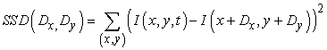

<a id="id783382"/>
<strong>24.7. ábra - (a) Rubik-kocka egy forgó lemezkorongon. (b) Ugyanaz a kocka 19/30 másodperccel később (Richard Szeliski nyomán). (c) Az (a) és (b) képek összehasonlítása alapján számolt optikai folyam vektorok (Joe Weber és Jitendra Malik hozzájárulásával).</strong>

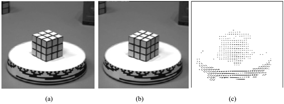

Az (<em>x</em>, <em>y</em>) az (<em>x</em>0<em> </em>, <em>y</em>0) képpont körüli tömb képpontjainak halmazán fut végig. Megkeressük most azt a (<em>Dx</em>,<em>  Dy</em>)-t, amely az SSD-t minimizálja. Az (<em>x</em>0<em> </em>, <em>y</em>0)-beli optikai folyam ilyenkor: (<em>vx </em>, <em>vy</em>) = (<em>Dx/Dt</em>, <em>Dy/Dt</em>). Alternatívaként maximalizálhatjuk a <strong>keresztkorrel</strong><strong>áció</strong>t (<strong>cross-correlation</strong>):

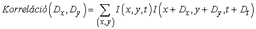

A keresztkorreláció akkor használható a legjobban, ha a jelenet képében textúra található, mert ekkor a vizsgált ablakokban nagy a fényességváltozás a képpontok mentén. Ha egy egyenletesen fehér falra nézünk, a különböző <em>q</em> jelöltekre számított keresztkorreláció majdnem azonos lesz, és az algoritmus a gyakorlatban véletlenszerűen fog választani.

Tegyük fel, hogy a megfigyelő <strong>T</strong> transzlációs és  szögsebességgel rendelkezik [amelyek így a <strong>sajátmozgás</strong>t (<strong>egomotion</strong>) írják le]. Származtatni lehet olyan összefüggéseket, amelyek a megfigyelő sebességét, az optikai folyamot és a jelenet tárgyainak a pozícióját kapcsolják össze. Tegyük fel, hogy <em>f = 1</em>, akkor:

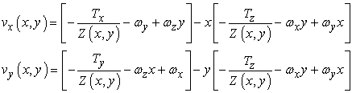

ahol Z(<em>x</em>, <em>y</em>) az (<em>x</em>, <em>y</em>) képponthoz tartozó jelenetbeli pontnak a <em>z</em> koordinátája.

A képlet jobb megértését szolgálja, ha az egyszerű transzláció esetét nézzük. Ebben az esetben a folyammező:

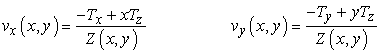

lesz. Néhány érdekes tulajdonságot figyelhetünk meg. Az optikai folyam mindkét komponense, <em>vx</em>(<em>x</em>, <em>y</em>) és <em>vy</em>(<em>x</em>, <em>y</em>) is zérus az <em>x = Tx/Tz</em>, <em>y</em> = <em>Ty/Tz</em> pontban. Ezt a pontot a folyammező <strong>expanziófókusz</strong>ának (<strong>focus of expansion</strong>) nevezzük. Tegyük fel, hogy az <em>x – y</em> sík origóját az expanziófókuszba helyezzük át. Ilyenkor az optikai folyam kifejezései igen egyszerű formát öltenek. Jelölje (<em>x'</em>, <em>y'</em>) az <em>x' = x – Tx /Tz</em>, és az <em>y' = y</em> – <em>T</em><em>y</em> /<em>Tz</em> által definiált új koordinátákat. Ekkor:

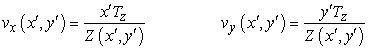

Ennek az egyenletnek van néhány érdekes alkalmazása. Tegyük fel, hogy ön egy légy, amely egy falra próbál leszállni, és azt szeretné tudni, hogy adott aktuális sebesség mellett mennyi idő múlva ér a falhoz. Ezt az időt a <em>Z/Tz</em> adja meg. Figyeljük meg, hogy annak ellenére, hogy a pillanatnyi optikai folyam nem képes sem a <em>Z</em> távolságot, sem a <em>Tz</em> sebességi komponenst megadni, a kettő arányát meg tudja adni, és így a leszállás irányításában felhasználható. Az élő legyekkel való kísérletek alátámasztják, hogy a legyek pontosan ezt a mechanizmust használjak. A legyek a legmerészebb repülők az állatok és gépek között, és érdekes, hogy ezt egy olyan látórendszerrel teszik, amelynek borzasztóan gyenge a térbeli felbontása (körülbelül 600 érzékelője van, összehasonlítva az emberek 100 milliójával), de kiemelkedő az időbeli felbontása.

<a id="id783687"/>
<strong>24.8. ábra - (a) Egy olyan videokép-sorozat négy kockája, amelyben a kamera a tárgyhoz képest mozgott és forgott. (b) A sorozat első képkockája, amelyen apró négyzetek jelzik a tulajdonságfelismerő által megtalált tulajdonságokat (Carlo Tomasi hozzájárulásával).</strong>

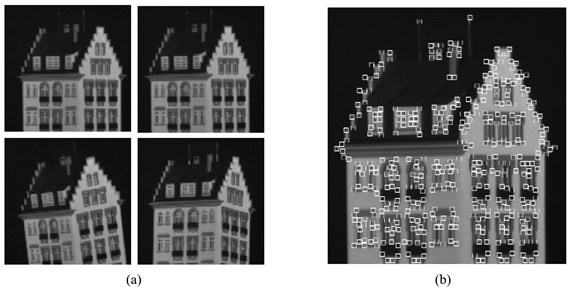

<a id="id783696"/>
<strong>24.9. ábra - (a) A 24.8. ábrán látható kép tulajdonságai elhelyezkedésének háromdimenziós rekonstrukciója. (b) A valódi ház ugyanabból a perspektívából.</strong>

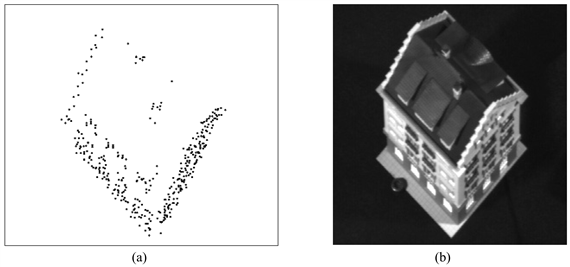

A mélység kiszámításához több képkocka használata szükséges. Ha a filmre egy merev testet veszünk fel, akkor ennek alakja képkockáról képkockára nem fog változni, és így az optikai folyam természeténél fogva zajos méréseit jobban kezelhetjük. Az egyik ilyen megközelítés eredményét a 24.8. és a 24.9. ábrán láthatjuk (Tomasi és Kanade, 1992).

<h2 class="title"><a id="id783708"/>Kétkamerás (binokuláris) térbeli látás</h2>

A legtöbb gerincesnek <em>két</em> szeme van. Ez hasznos redundancia arra az esetre, ha elveszítené az egyiket, de más módon is segít. A legtöbb zsákmányállatnak a feje oldalán vannak a szemei, hogy nagyobb területet beláthasson. A ragadozóknak elöl, hogy <strong>kétkamerás térbeli látás</strong>t (<strong>binocular stereopsis</strong>) valósíthassanak meg. Maga a gondolat a mozgási parallaxisra igen hasonlít, azonban az eltérő időpontokhoz tartozó képek helyett két (vagy több), térben szeparált képet használunk, hasonlóan ahhoz, mint amilyeneket pl. az előrenéző emberi szemek szolgáltatnak. Tekintettel arra, hogy a jelenet egy adott jellemzője az egyes képsíkok <em>z</em> koordinátájához képest más helyen lesz a képen, ha a két képet egymásra fektetjük, a képjellemző elhelyezkedésében a két kép különbséget – <strong>diszparitás</strong>t (<strong>disparity</strong>) – fog mutatni. Ez látszik a 24.10. ábrán, ahol a piramis legközelebbi pontja balra mozdult el a jobb oldali képen, és jobbra a bal oldalin.

<a id="id783742"/>
<strong>24. ábra - A térbeli látás alapgondolata: különböző kamerapozíciók ugyanannak a háromdimenziós jelenetnek kissé eltérő kétdimenziós nézeteit eredményezik</strong>

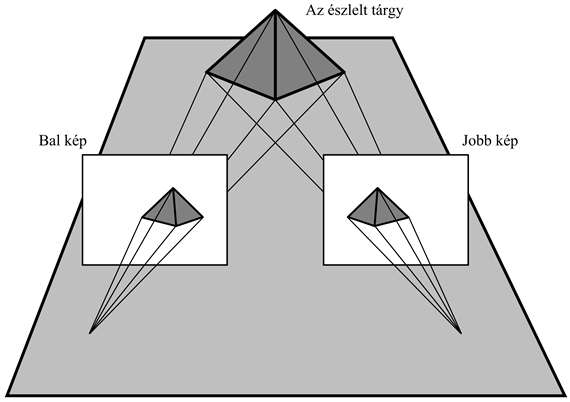

<a id="id783752"/>
<strong>24.11. ábra - A diszparitás és a mélység összefüggése a sztereolátásban</strong>

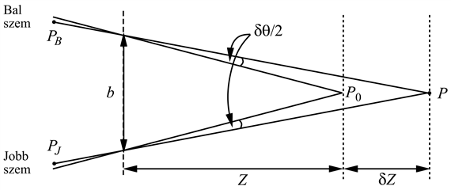

Dolgozzuk ki a diszparitás és a mélység geometriai kapcsolatát. Először azt az esetet vizsgáljuk meg, amikor a két szem (illetve a két kamera) előrenéz, és optikai tengelyük párhuzamos. A jobb és a bal kamera kapcsolata így egy <em>b</em> nagyságú (bázisvonal) transzláció az <em>x</em> koordináta-tengely mentén. A <em>H = vx</em> ∆<em>t</em> vízszintes és <em>V = vy</em>∆<em>t </em>függőleges képeltérés számításához az optikai folyam előbb megismert kifejezéseit használhatjuk, <em>Tx = b/</em>∆<em>t</em>,<em> Ty = Tz = </em>0 mellett. Az <em>ωx</em>, <em>ωy</em>, és <em>ωz</em> rotációs paraméterek zérusok. Azt kapjuk eredményül, hogy <em>H</em> = <em>b/Z</em> és <em>V = </em>0. Szavakkal megfogalmazva ez azt jelenti, hogy a vízszintes képeltérés a bázisvonal és a mélység aránya, a függőleges eltérés pedig zérus.

Normális látási körülmények között az emberek <strong>fixál</strong>nak, azaz <strong>összetartóan néznek előre </strong>(<strong>fixate</strong>), vagyis a jelenetben létezik egy olyan pont, amelyben a két optikai tengely metszi egymást. A 24.11. ábra egy <em>P</em>0 pontra fixáló szemeket mutat, amely pont a két szem középvonalától <em>Z</em> távolságban helyezkedik el. Az egyszerűség kedvéért <em>szögeltérést</em> fogunk számítani radiánban. Az összetartás <em>P</em>0 pontjában az eltérés zérus. A jelenet egy <em>δZ</em>-vel távolabbi <em>P</em> pontja esetén számíthatjuk a <em>P </em>pont <em>PL</em> bal és a  <em>PR </em>jobb oldali képének a szögeltolódását. Ha azok mindegyike a <em>P</em>0 -hoz képest <em>δθ/2</em> szöggel eltolt, akkor a <em>PL</em> és a <em>PR</em> eltolódása, ami a <em>P</em> képeltérése, pontosan <em>δθ</em>. Egyszerű geometriai átalakításokból azt fogjuk kapni, hogy:

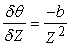

Embereknél a <em>b</em> <strong>bázisvonal</strong> (<strong>baseline</strong>) kb. 6 cm. Tegyük fel, hogy <em>Z</em> kb. 100 cm. A legkisebb detektálható <em>δθ</em> (ami a képpont nagyságával függ össze) kb. 5 szögmásodperc, avagy 2,42  × 10–5 radián, amiből a <em>δZ </em>0,4 mm-re adódik. <em>Z</em> = 30 cm-re <em>δZ = </em>0,036 mm-es lenyűgöző értéket kapunk. Ez azt jelenti, hogy 30 cm-es távolságban az emberek akár a 0,036 mm-es képmélység különbség megkülönböztetésére is képesek. Ez teszi lehetővé, hogy be tudjuk fűzni a cérnát egy tűbe, és hasonló műveleteket tudunk elvégezni.

<h2 class="title"><a id="id783977"/>Textúragradiensek</h2>

A mindennapi nyelvben a <strong>textúra</strong> vagy <strong>felületmintázat</strong> (<strong>texture</strong>) a felület kitapintható tulajdonságaira vonatkozik (az angol nyelvben ugyanazzal a szótővel rendelkezik, mint maga a szövet[<a id="id783998" href="#ftn.id783998" class="footnote">272</a>]). A számítógépes látásban a textúra egy ehhez közeli fogalomra, egy felületnek a síkban ismétlődő, vizuálisan érzékelhető mintázatára vonatkozik. Példaként említhetjük egy épület ablakainak a mintázatát, egy szvetter kötési mintáját, a leopárd foltos bundáját, a pázsit fűszálainak a mintázatát, kavicsokat a strandon vagy embertömeget egy stadionban. Az elrendezés néha közel periodikus, mint például a kötési szemek a szvetteren, más esetekben, mint például a strandon lévő kavicsok esetén, a szabályosság csak statisztikai értelemben létezik – a kavicsok sűrűsége a strand különböző részein nagyjából azonos.

<a id="id784007"/>
<strong>24.12. ábra - (a) A textúragradienseket illusztráló jelenet. Feltéve, hogy a valós mintázat egyforma, lehetővé teszi a felület irányágának a meghatározását. A számított irányt a képen oly módon elhelyezett fehér kör és nyíl jelzi, mintha a kört a felületre festették volna abban a pontban. (b) Egy ívelt felület alakjának meghatározása a mintázat alapján. (A képeket Jitendra Malik és Ruth Rosenholtz hozzájárulásával közöljük [Malik és Rosenholtz, 1994].)</strong>

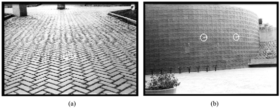

Amit most a <em>jelenetre</em> vonatkozóan állítottunk, igaz. A képen a textúraelemek vagy <strong>t</strong><strong>exel</strong>ek (<strong>texel</strong>s) látszólagos nagysága, alakja, távolsága stb. igencsak változik, ahogy ezt a 24.12. ábra mutatja. A csempelapok a jeleneten azonosak. A lapok kivetített nagyságának és alakjának megváltozásában két fő ok játszik szerepet:

<ol class="orderedlist"><li class="listitem">
<em>Az egyes texeleknek a kamerától vett változó távolsága</em>. Emlékezzünk arra, hogy a perspektivikus vetítésben a távoli tárgyak kisebbnek tűnnek. A skálatényező 1/<em>Z</em>.
</li><li class="listitem">
<em>Az egyes texelek változó rövidülése</em>. Ez a texeleknek a kamerából kiinduló rálátási irányhoz viszonyított orientációján múlik. Rövidülés nincs, ha a texel a rálátási irányra merőleges. A rövidülés mértéke cos <em>σ</em>-val arányos, ahol a <em>σ</em> a texel síkjának a lejtése.
</li></ol>

Egy kevés matematikai elemzést követően meghatározhatjuk a különböző texeltulajdonságok, mint pl. a terület, a rövidülés és a sűrűség változási mértékének kifejezéseit. Ezek az ún. <strong>textúragradiensek</strong> (<strong>texture gradients</strong>) a felület alakjának és a megfigyelőhöz képesti dőlésének és lejtésének a függvényei.

Ahhoz, hogy az alakot a textúrából kinyerhessük, kétlépcsős eljáráshoz kell folyamodnunk: (a) először mérjük a textúragradienseket; (b) majd becsüljük a mért gradienseket okozni látszó felületalakot, azok dőlését és lejtését. A 24.12. ábra mutatja ezen eljárás eredményeit.

<h2 class="title"><a id="id784078"/>Árnyalás</h2>

Az <strong>árnyalás</strong>t (<strong>shading</strong>) – a jelenethez tartozó felület különböző részeiről kapott megvilágítás intenzitásváltozását – a jelenet geometriája és a felület-visszaverési tulajdonságai határozzák meg. A számítógépes grafikában a feladat a kép <em>I</em>(<em>x</em>,<em>y</em>) fényességfüggvényének a megadása, ha a jelenet geometriája és a visszaverődési tulajdonságok adottak. A számítógépes látásban azt reméljük, hogy ez a folyamat invertálható, vagyis visszaállíthatjuk a jelenet geometriáját és visszaverődési tulajdonságait, ha az <em>I</em>(<em>x</em>,<em>y</em>) képfényesség adott. A probléma olyan nehéznek bizonyult, hogy a legegyszerűbb esetektől eltekintve e téren nem sikerült eredményeket elérni.

Induljunk ki egy olyan példából, ahol az alakot tényleg visszanyerhetjük az árnyalásból. Tekintsünk egy Lambert-féle felületet, amit egy távoli, pontszerű fényforrás világít meg. Tételezzük fel azt is, hogy a felület messze van a kamerától, így függőleges síkú vetítést fogunk használni a perspektivikus vetítés megközelítésére. A kép fényessége:

<code class="code"><em>I</em>(<em>x</em>,<em> y</em>) = <em>k</em><em>n</em>(<em>x</em>,<em> y</em>)<em> </em>·<em> </em><em>s</em></code>

ahol <em>k</em> egy skálaegyüttható, <strong>n</strong> a felület normál egységvektora és <strong>s</strong> a fényforrás irányába mutató egységvektor. Mivel <strong>n</strong> és <strong>s</strong> egységvektorok, skalárszorzatuk a kettő közötti szög koszinusza. A felület alakját az <strong>n</strong> felület menti változása tartalmazza. Tételezzük fel, hogy <em>k</em> és <strong>s</strong> ismertek. A problémánk most a felület <strong>n</strong> normálisának a kiszámítása, ha az  <em>I</em>(<em>x</em>,<em>y</em>) képfényesség adott.

Az első megjegyzés, amit meg kell tenni, az az, hogy az <strong>n</strong> meghatározása az adott (<em>x</em>,<em>y</em>) képpontfényesség ismeretében lokálisan alulhatározott. Ki tudjuk ugyan számítani az <strong>n</strong> és a fényforrás közötti szöget, ez azonban az <strong>n</strong>-et csak annyiban korlátozza, hogy egy bizonyos, <strong>s</strong> irányú és <em>θ</em> = cos–1(<em>I/k</em>) palástszögű kúp felületén helyezkedik el. Hogy továbbléphessünk, jegyezzük meg, hogy képpontról képpontra az <strong>n</strong> változása nem lehet tetszőleges. Egy sima felület normálisa csak sima módon változhat – amely korlátozást az <strong>integrálhatóság</strong> (<strong>integrability</strong>) szakkifejezéssel jelöljük. Ezt a felismerést számos módszerben fel is használják. Egy lehetséges eljárás az <strong>n</strong> átírása a <em>Z</em>(<em>x</em>,<em>y</em>) mélység <em>Zx</em> és <em>Zy</em> parciális deriváltjainak felhasználásával. Ennek eredménye <em>Z</em> egy parciális differenciálegyenlete, amit megfelelő határfeltételek figyelembevételével <em>Z</em>(<em>x</em>,<em>y</em>)-ra nézve meg lehet oldani.

Az eljárás általánosítható. Nem szükséges, hogy a felület Lambert-féle legyen, és az sem, hogy a fényforrás pontszerű legyen. Lényegében ugyanez a módszer használható, ha sikerül a felület <em>R</em>(<strong>n</strong>) <strong>reflektanciatérkép</strong>ét (<strong>reflectance map</strong>) meghatározni, amely a felületelem fényességét annak <strong>n</strong> normálisa függvényében fejezi ki.

Az igazi nehézség a kölcsönös visszaverődések kezelése. Egy tipikus belsőtérjelenet esetén, mint például egy irodában lévő tárgyak esetén a felületeket nem csupán a fényforrások világítják meg, hanem a jelenet más felületeitől visszavert fény is, amelyek tényleges másodlagos fényforrásokként szolgálnak. Ezek a kölcsönös megvilágítási hatások igen jelentősek lehetnek. Az ilyen helyzetben a reflektanciatérkép megközelítés teljes mértékben használhatatlan – a kép fényessége nemcsak a normálison múlik, hanem a jelenet különböző felületeinek bonyolult térbeli viszonyain is.

Az ember az árnyalásból képes valamilyen mértékű alakinformáció kinyerésére, így ez a probléma – minden nehézsége ellenére – továbbá is érdekes marad.

<h2 class="title"><a id="id784334"/>Kontúrok</h2>

Amikor egy olyan vonalas rajzot nézünk, mint amilyen a 24.13. ábra, a kép egy háromdimenziós elrendezés életszerű benyomását kelti bennünk. Hogyan lehetséges ez? Hiszen láttuk korábban, hogy egy és ugyanaz a vonalas kép végtelen sok jelenet konfigurációból származhat. Figyeljük meg, hogy még a felszín lejtésének és emelkedésének érzetét is megkapjuk. Ez minden bizonnyal (a tipikus alakzatokra vonatkozó) magas szintű tudás és valamilyen alacsony szintű kényszerek összekapcsolásának következtében lehetséges.

<a id="id784340"/>
<strong>24.13. ábra - Egy felidéző vonalas rajz (Isha Malik hozzájárulásával)</strong>

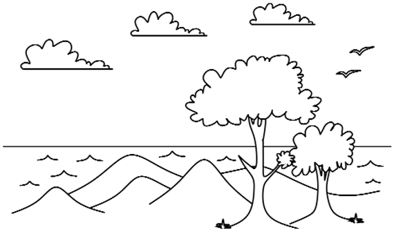

A vonalas ábrában rejlő kvalitatív tudással fogunk foglalkozni. Korábban láttuk, hogy a rajz vonalainak különféle lehet a fontossága (lásd 24.4. ábra és kísérőszövege). Az a folyamat, ahogy a kép minden vonalának a tényleges fontosságát megállapítjuk, a <strong>vonalcímkézés</strong> (<strong>line labeling</strong>), és ez volt a számítógépes látás által elsőként tanulmányozott problémák egyike. Tegyük fel egyelőre, hogy a világ olyan leegyszerűsített modelljével dolgozunk, ahol a tárgyaknak nincsenek felületei, és ahol az olyan vonalakat, amelyek megvilágítási diszkontinuitásokból adódnak, mint amilyenek az árnyékélek és a tükrözések, valamilyen előfeldolgozó eljárással a képből kiemeltük. A figyelmünket így olyan vonalas ábrákra összpontosíthatjuk, ahol minden vonal vagy mélységi, vagy orientáció diszkontinuitáshoz tartozik.

Mindegyik vonalat ezek után vagy egy a felület határán megjelenő<strong> pszeudoél</strong> (<strong>limb</strong>) vetületének (ami a felület azon pontjainak összessége, ahol a rálátás iránya a felület érintője), vagy egy <strong>él</strong>nek (<strong>edge</strong>) lehet tekinteni (ami a felület normálisának egy diszkontinuitása). Az éleket továbbá konvex, konkáv vagy határoló élosztályokba sorolhatjuk. A pszeudoélek és a határoló élek esetén érdekes annak az eldöntése, hogy a vonalas ábrán a görbét határoló két felületből melyik van hozzánk közelebb. Ezeket a következtetéseket úgy képzelhetjük el, hogy mindegyik vonalhoz a 6 lehetséges <strong>vonalcímké</strong>nek (<strong>line label</strong>) az egyikét rendeljük hozzá, ahogy az a 24.14. ábrán látható.

<a id="id784392"/>
<strong>24.14. ábra - Különféle vonalcímkék</strong>

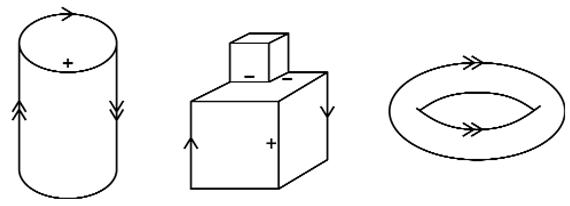

<ol class="orderedlist"><li class="listitem">
A „+” és a „–” címkék rendre a konvex és a konkáv éleket jelentik. Ezeket az olyan normális diszkontinuitásokhoz rendeljük, ahol az él mentén találkozó mindkét felület látható.
</li><li class="listitem">
A „←” és a „→” határoló konvex éleket jelentenek. A kamerával felülről nézve az él mentén találkozó mindkét felületelem azonos oldalon fekszik úgy, hogy az egyik eltakarja a másikat. Ha a nyíl irányába mozgunk, a felületek hozzánk képest jobbra esnek.
</li><li class="listitem">
A „←←” és a „→→” címkék a pszeudoéleket jelölik. Az ilyen helyeken a felület sima módon görbül, és saját magát takarja. Ha a dupla nyíl irányába lépünk, a felület tőlünk jobbra helyezkedik. A rálátás iránya a pszeudoél minden pontjában a felület érintője. Ahogy a nézőpont változik, a pszeudoél a felület mentén mozog.
</li></ol>

Egy ábrán található <em>n</em> számú vonal kombinatorikusan elvileg lehetséges  címke-hozzárendelésből csupán csekély számú hozzárendelés lehetséges fizikailag. Ezeknek a címkézéseknek a megállapítása az ún. vonalcímkézési probléma. Jegyezzük meg, hogy a probléma csak akkor értelmes, ha a címke a vonal mentén nem változik. Ez nem mindig igaz, hiszen a görbült objektumok képein a címke egy vonal mentén igenis változhat. Ebben a részben ez nem jelent problémát, mert csak poliéderes objektumokkal foglalkozunk.

A poliéderes jelenetelemzéssel először Huffman és tőle függetlenül Clowes próbálkoztak (Huffman, 1971; Clowes, 1971). Huffman és Clowes elemzésüket a nem átlátszó <strong>triéderes</strong> (<strong>trihedral</strong>) testekből – azaz olyan testekből, amelyeknél mindegyik sarokpontjánál pontosan három felület fut össze – álló jelenetek esetére korlátozták. A több objektumot tartalmazó jelenetek esetén kizárták a triéderes feltételt megsértő objektumkonfigurációkat is, mint amilyen például az egyik élük mentén érintkező két kocka. Nem engedték a <strong>repedés</strong>eket (<strong>crack</strong>s) sem, azaz olyan „éleket”, amelyek mentén a tangenciális síkok folytonosan változnak. A triéderes világban Huffman és Clowes kimerítő listát adtak az összes különböző sarokponttípusról meg arról is, hogy azok hogyan látszhatnak általános nézőpontból szemlélve. Az általános nézőpont feltétel lényegében azt tételezi fel, hogy az összes csatlakozás megtartja a jellegét, ha a szem csak kissé mozdul el. Ha például a képen három vonal metszi egymást, akkor a feltételből következik, hogy a jelenet hozzájuk tartozó éleinek szintén metszeniük kell egymást.

<a id="id784444"/>
<strong>24.15. ábra - A triéderes csúcsok négy fajtája</strong>

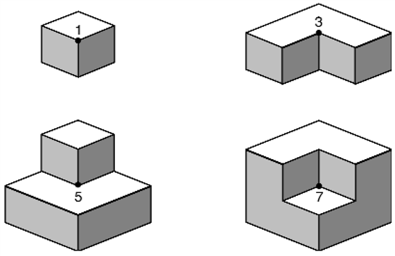

A 24.15. ábra mutatja azt a négyféle helyzetet, ahogy a három síkfelület egy sarokpontban találkozhat. Ezeket az eseteket úgy szerkesztettük, hogy egy kockát nyolc <strong>oktáns</strong>ra (<strong>octant</strong>) bontottunk. A triéderes sarokpontok egész választékát szeretnénk generálni a kocka középpontjában úgy, hogy a különböző oktánsokat kitöltjük. Az 1-es címkéjű sarokpont az egyetlenegy kitöltött oktánshoz tartozik, a 3-as címkéjű a három kitöltött oktánshoz és így tovább. Az olvasónak kellene belátnia, hogy ezek tényleg kimerítik <em>az összes</em> lehetséges helyzetet. Ha valaki például a kockában két oktánst kitölt, akkor nem lesz képes a középpontban egy érvényes triéderes sarokpontot megszerkeszteni. Jegyezzük meg azt is, hogy ezen négy eset a sarokpontban találkozó konvex és konkáv élek különböző kombinációinak felel meg.

A sarokpontban találkozó három él a körülöttük lévő teret nyolc oktánsra osztja. A sarokpontot bármely, anyaggal nem kitöltött oktánsból lehet szemlélni. A nézőpont oktánson belüli elmozdítása a képen látható csatlakozások jellegét megváltoztatni nem fogja. A 24.15. ábrán látható 1-es címkéjű sarokpontot a maradó hét oktánsból szemlélve a 24.16. ábrán látható csatlakozáscímkéket kapjuk.

Annak kimerítő vizsgálata, hogy egy sarokpont milyen módon látható, a 24.17. ábrán felsorolt lehetőségekhez vezet. A képen négy különböző csatlakozástípust azonosíthatunk: L, Y, nyíl- és T csatlakozást. Az L csatlakozás a két látható él esete. Az Y és a nyílcsatlakozás három élnek felel meg. Az Y csatlakozásban a szögek egyike sem lépi túl a 180°-ot. A T csatlakozás a takarással kapcsolatos. Ha egy közeli, nem átlátszó felület egy távolabbi élt eltakar, egy fél éllel találkozó folytonos élt kapunk. A T csatlakozás négy címkéje a négyféle él takarásának felel meg.

<a id="id784474"/>
<strong>24.16. ábra - A 24.15. ábrán 1-gyel jelölt csúcs különböző előfordulásai</strong>

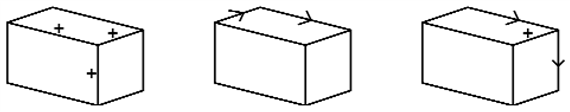

<a id="id784484"/>
<strong>24.17. ábra - A Huffman–Clowes-címkekészlet</strong>

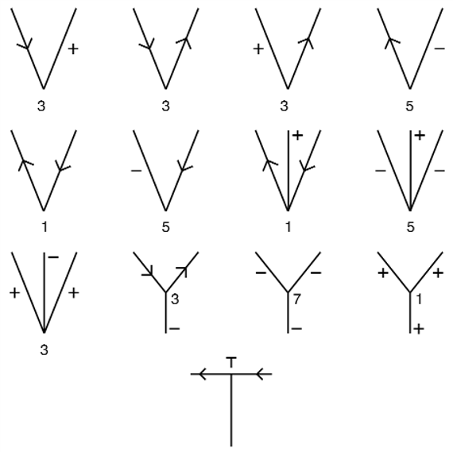

Ha egy vonalas rajzot ennek a csatlakozásszótárnak a segítségével címkézünk meg, a probléma annak a megállapítása, hogy mely csatlakozásinterpretációk lesznek globálisan konzisztensek. A konzisztenciát az a szabály kényszeríti ki, miszerint a rajzon egy vonalnak egy és csakis egy címkéje lehet a vonal egész hosszában. Ezen probléma algoritmikus megoldását Waltz adta meg (pontosabban egy olyan kibővített probléma megoldását adta meg, amely az árnyékot, a görbületi diszkontinuitásokat [repedéseket] és a szétválaszthatóan konkáv éleket is figyelembe veszi [Waltz, 1975]). Az algoritmus a kényszerkielégítés egyik legelső alkalmazása volt az MI területén (lásd 5. fejezet). A kényszerkielégítés nyelvén a változók a csatlakozások, a változók értékei a csatlakozások címkézése, a kényszer pedig az, hogy minden vonalnak csak egy címkéje van. Bár a triéderes vonalcímkézési probléma NP-teljes, a közönséges kényszerkielégítési algoritmusok a gyakorlatban jól működnek.

 

[<a id="ftn.id783998" href="#id783998" class="para">272</a>]  avagy „textile” (<em>A ford.</em>)

</body></html>
