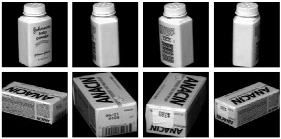
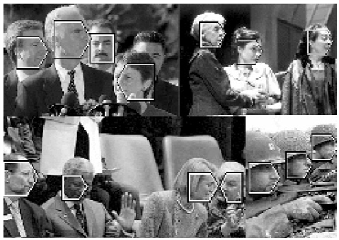
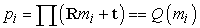
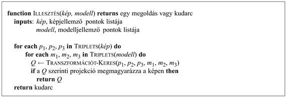
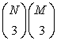
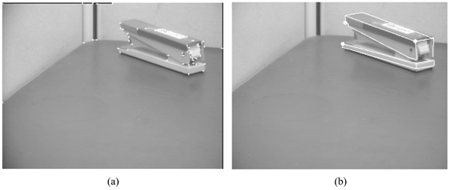

<?xml version="1.0" encoding="UTF-8" standalone="no"?>
<!DOCTYPE html PUBLIC "-//W3C//DTD XHTML 1.1//EN" "http://www.w3.org/TR/xhtml11/DTD/xhtml11.dtd">
<html xmlns="http://www.w3.org/1999/xhtml"><head><meta name="generator" content="DocBook XSL Stylesheets V1.76.1"/></head><body>

<h1 class="title"><a id="id786389"/>Objektumok felismerése</h1>

A látás lehetővé teszi számunkra, hogy megbízhatóan felismerjünk embereket, állatokat és élettelen dolgokat. Az MI-ben, illetve a számítógépes látásban az <em>objektumfelismerés</em> fogalmát szokás szerint mindezen dolgokra alkalmazzák. Ez magában foglalja a képen rögzített objektumok osztályának felismerését – például: ez egy arc, illetve adott objektumok felismerését is – például: ez Bill Clinton arca. A motivációt ilyen alkalmazási területek jelentik:

<ul class="itemizedlist"><li class="listitem">
<strong>Biometrikus azonosítás</strong> (<strong>biometric identification</strong>): a bűnügyi vizsgálatok és a védett létesítmények belépésszabályozása megköveteli az egyének azonosítását. Az ujjlenyomatok, az íriszlenyomat és az arcképek olyan képeket eredményeznek, amelyeket adott egyénekhez kell rendelni.
</li><li class="listitem">
<strong>Tartalomalapú képkeresés</strong> (<strong>content-based image retrieval</strong>): könnyű egy dokumentumban megtalálni azt a helyet – ha létezik –, ahol a „macska” szó szerepel. Bármelyik szövegszerkesztő képes erre. Most gondoljon arra a feladatra, hogy egy képen megtalálja a képpontok azon részhalmazát, amely egy macska képének felel meg. Ha valaki rendelkezne ezzel a képességgel, akkor megválaszolhatna olyan kereséseket, mint például „Bill Clinton és Nelson Mandela együtt”, egy „görkoris a levegőben”, „az Eiffel-torony éjszaka” stb., anélkül hogy egy gyűjtemény minden egyes fényképéhez feliratkulcsszavakat kellett volna rendelnünk. Ahogy a kép- és videogyűjtemény növekszik, a kézi feliratozás lehetetlenné válik.
</li><li class="listitem">
<strong>Kézírás-felismerés</strong> (<strong>handwriting recognition</strong>): például az aláírások, borítékok címmezői, csekkeken szereplő összegek és a kéziszámítógépek tollalapú beviteli megoldása.
</li></ul>

A látást nemcsak objektumok, hanem cselekvések felismerésére is használjuk. Felismerhetünk járásmódokat (egy barát járását), kifejezéseket (egy mosolyt, egy grimaszt), gesztikulációt (egy integető embert), cselekvéseket (ugrást, táncot) és így tovább. A cselekvésfelismerést célzó kutatás még gyerekcipőben jár, így ebben az alfejezetben az objektumfelismerésre koncentrálunk.

A vizuális objektumok felismerésének feladata általában könnyű az emberek számára, de a számítógépek számára igen nehéznek bizonyult. Fel akarjuk ismerni egy ember arcát függetlenül a megvilágítás, a kamerához képesti helyzet és az arckifejezés különböző variációitól. Ezen variációk bármelyike széles körű változásokat eredményez a képpontok fényességértékeiben, így a képpontok közvetlen összehasonlítása valószínűleg nem fog működni. Ha valaki egy kategória (például az „autó”) példányait szeretné felismerni, akkor a kategórián belüli variációkat is figyelembe kell vennie. Még a postai irányítószámoknál a kézzel írt számjegyek felismerésének igen korlátozott feladata is komoly kihívásnak bizonyult.

A felügyelt tanulás vagy a mintaosztályozás természetes keretet biztosít az objektumfelismerés tanulmányozásához. Pozitív („arcok”) és negatív példaként („nem arcok”) adott képek esetében a cél egy olyan függvény megtanulása, amely az új képeket felcímkézi az <em>arc</em> és a <em>nem arc</em> jelölésekkel. A 18. és 20. fejezet összes technikája lehetséges jelölt a feladatra: többrétegű perceptronokat, döntési fákat, legközelebbi-szomszéd osztályozókat és kernelgépeket alkalmaztak már objektumfelismerési feladatokra. Meg kell azonban jegyeznünk, hogy ezen technikák alkalmazása objektumok felismerésére távolról sem egyértelmű.

Az első kihívás a kép szegmentálása. Minden kép tipikusan több objektumot fog tartalmazni, így először olyan képpontrészhalmazokra kell osztanunk, amelyek egy-egy objektumnak felelnek meg. Miután a képet régiókra osztottuk, utána a régiókat vagy az azokból összeállított egységeket átadjuk egy osztályozónak, hogy meghatározza az objektumok címkéit. Sajnálatos módon a lentről felfelé szegmentáció hibákra érzékeny eljárás, ezért alternatív megoldásként kínálkozik a fentről lefelé objektumcsoport meghatározása. Eszerint keresni kell egy képpontrészhalmazt, amit arcként lehet osztályozni, és ha ez sikerült, máris van egy csoportunk! A tisztán fentről lefelé módszerek nagyon számításigényesek, mivel különböző méretű képablakokat kell megvizsgálni különböző helyszíneken, és az összes különböző objektumhipotézissel össze kell vetni őket. Jelenleg a leginkább gyakorlati objektumfelismerő rendszerek ilyen fentről lefelé stratégiát alkalmaznak, bár ez megváltozhat, ahogy a lentről felfelé technikák fejlődnek.

A második kihívás annak biztosítása, hogy a felismerés folyamata kellően robusztus a megvilágítás és az elhelyezkedés változásaira. Az emberek fel tudnak ismerni objektumokat a képpontok fényességértékeivel mért pontos megjelenés jelentős változásai ellenére is. Például egy barát arcát különböző fényviszonyok mellett vagy különböző látószögekből is felismerjük. Egy ennél is egyszerűbb példaként megvizsgálhatjuk a kézzel írt 6-os számjegy felismerését. Képesnek kell lenni a 6-os felismerésére különböző méretekben, a kép különböző pozícióiban és a kép kisebb elforgatásai ellenére is.[<a id="id786457" href="#ftn.id786457" class="footnote">273</a>]

A kulcsmomentum azt észrevenni, hogy a geometriai transzformációk, mint például az elfordítás, a méretváltás és a forgatás, vagy a kép fényességének megváltozásai a fényforrások fizikai mozgatása által, más jellemzőkkel rendelkeznek, mint a kategórián belüli variációk, mint például az emberek arcainak különbözőségei. Nyilvánvaló, hogy a tanulás az egyetlen mód az emberi arcok különbözőségeinek megtanulására vagy a 4-es számjegy különböző írásmódjainak felismerésére. Másrészről a geometriai és fizikai transzformációk hatásai szisztematikusak és kiküszöbölhetők a tanuló minták paramétereit leíró tulajdonságok megfelelő tervezésével.

Annak érdekében, hogy a geometriai transzformációkra vonatkozó invarianciát biztosítsuk, egy egészen hatékonynak bizonyult eljárás a kép régiójának előfeldolgozása úgy, hogy standard pozícióba, méretre és orientációra alakítjuk. Egy alternatív megoldás az, ha egyszerűen figyelmen kívül hagyjuk a geometriai és fizikai transzformációk alkalmi természetét, és úgy gondolunk rájuk, mint az osztályozó variálhatóságának egy újabb forrására. A tanító minták halmazában az összes ilyen variációra példákat kell elhelyeznünk, és abban reménykedünk, hogy az osztályozó kikövetkeztet egy megfelelő transzformációhalmazt a bemenetre, és így kiszűri a variációkat.

Vizsgáljunk meg most az objektumfelismerésre szolgáló speciális algoritmusokat! Az egyszerűség érdekében kétdimenziós összeállításban fogjuk a problémát vizsgálni, ahol mind a tanuló, mind a tesztminták kétdimenziós fényességábrák formájában adottak. Olyan területeken, mint például a kézírás-felismerés, ez nyilvánvalóan elegendő. Még háromdimenziós objektumok esetében is hatékony stratégia az objektumokat több kétdimenziós nézettel reprezentálni (lásd 24.18. ábra), és az új objektumokat a (valamilyen reprezentációjú) tárolt nézetekkel összehasonlítva osztályozni.

<a id="id786469"/>
<strong>24.18. ábra - Két háromdimenziós tárgy többféle nézete</strong>

Az előző alfejezet megmutatta, hogy több tényező vesz részt a háromdimenziós információ kinyerésében egy jelenetből. Az objektumfelismerés is több tényezőn alapszik – egy tigrist a narancs és fekete színek keveredéséről, csíkos mintázatáról és testének alakjáról ismerünk fel.

A szín és a mintázat hisztogramok vagy empirikus frekvenciaeloszlások segítségével reprezentálható. Ha adott egy tigris képe mintaként, akkor megmérhetjük a különböző színű képpontok arányát. Ezután, ha egy ismeretlen példát látunk, összevethetjük a szín hisztogramját a korábbi tigrispéldáknál látottakkal. A mintázatok elemzéséhez a kép különböző irányú és skálázású szűrőkkel történt konvolúciója után kapott eredményeinek hisztogramjait vizsgáljuk, egyezést keresve.

Az alak felhasználása az objektumfelismerésben sokkal bonyolultabbnak bizonyult. Nagyjából két irányzatot különböztethetünk meg: <strong>fényességalapú felismerés</strong>t (<strong>brightness-based recognition</strong>), ahol a képpontok fényességértékeit direkt módon használjuk, és <strong>jellemzőalapú felismerés</strong>t (<strong>feature-based recognition</strong>), ahol kiemelt jellemzők, mint például az élek vagy a kulcspontok részleges elrendezését használjuk. Miután részletesebben megvizsgáltuk e két megközelítést, tárgyalni fogjuk a <strong>pozícióbecslés</strong>t (<strong>pose estimation</strong>), azaz az objektum helyzetét és irányát a jelenetben.

<h2 class="title"><a id="id786516"/>Fényességalapú felismerés</h2>

Ha adott egy képponthalmaz, amely egy lehetséges objektumnak felel meg, akkor válaszszuk a jellemzőknek magukat a képpontok fényességeit. Egy másik variáció szerint először konvolválhatjuk a képet többféle lineáris szűrővel, és az eredményül kapott kép pontjainak értékeit tekinthetjük a jellemzőknek. Ez a megközelítés különösen sikeres olyan feladatokban, mint a kézzel írt számjegyek felismerése, ahogy azt a 20.7. alfejezetben láthattuk.

Sokféle statisztikai módszert használtak arra, hogy képeket tartalmazó adatbázisok segítségével arcfelismerőket fejlesszenek ki, mint például feldolgozatlan képpontbemeneten működő neurális hálókat képpontbemenettel, vonal- és élszűrők által előállított jellemzőket használó döntési fákat és wavelet-jellemzőket használó, naiv Bayes-modelleket. Az utóbbi módszer néhány eredménye a 24.19. ábrán látható.

<a id="id786526"/>
<strong>24.19. ábra - Egy arcmegtaláló algoritmus eredménye (Henry Schneiderman és Takeo Kanade hozzájárulásával)</strong>

A feldolgozatlan képpontok jellemző vektorként történő használatának egy negatív aspektusa az ebben a reprezentációban rejlő hatalmas redundancia. Vegyünk például két egymás melletti képpontot az arc pofa részén; valószínűleg igen erős közöttük a korreláció, hiszen hasonló a geometriájuk, megvilágításuk stb. Az adatmennyiséget csökkentő technikák, mint például a főkomponens-analízis, sikeresen használhatók a jellemzővektor dimenziószámának csökkentésére, lehetővé téve az olyan dolgok, mint például arcok, nagydimenziós terekben való felismerésénél nagyobb sebességű felismerését.

<h2 class="title"><a id="id786538"/>Jellemzőalapú felismerés</h2>

A feldolgozatlan képpontok fényességértékei jellemzőként történő felhasználása helyett felismerhetünk adott helyen levő jellemzőket, mint például régiókat vagy éleket (lásd 24.3. alfejezet). Két motivációnk van az élek használatára. Az egyik az adatmennyiség csökkentése – sokkal kevesebb él van, mint képpont. A másik a megvilágításfüggetlenség – a kontraszt egy megfelelő tartományában az éleket nagyjából azonos helyen ismerjük fel, függetlenül a tényleges fényforrás-konfigurációtól. Az élek egydimenziós jellemzők; kétdimenziós és nulladimenziós tulajdonságokat (régiókat, illetve pontokat) szintén használunk. Vegyük észre a térbeli elhelyezkedés kezelésében jelentkező különbséget a fényességalapú és a jellemzőalapú módszerek között! A fényességalapú módszerekben az (<em>x</em>,<em>y</em>) hely <em>a</em> jellemző.

Az élek elrendezése egy objektum tulajdonsága – ez az egyik oka, ami miatt a rajzokat könnyedén értelmezni tudjuk (lásd 24.13. ábra), még akkor is, ha ilyen képek nem fordulnak elő a természetben! Ezen tudás legegyszerűbb felhasználásának módja egy legközelebbi-szomszéd osztályozóval történhet. Előre kiszámítjuk és eltároljuk az ismert objektumok nézeteihez tartozó élkonfigurációkat. Ha adott egy ismeretlen objektumnak megfelelő élelrendezés a bemeneti képen, akkor meghatározhatjuk az eltárolt nézetekhez mért „távolságát”. A legközelebbi-szomszéd osztályozó a legközelebbi illeszkedőt választja.

Sokféle definíciót javasoltak a képek közötti távolságra. Az egyik legérdekesebb megközelítés a <strong>deformációs illeszkedés</strong> (<strong>deformable matching</strong>) ötletén alapul. D’Arcy Thompson klasszikus munkájában (<em>On Growth and Form</em> [D’Arcy Thompson, 1917]) megfigyelte, hogy a hasonló, de nem azonos alakzatok gyakran egybeesésbe hozhatók egyszerű koordináta-transzformációkkal.[<a id="id786572" href="#ftn.id786572" class="footnote">274</a>] E módszer szerint az alakzatok hasonlóságát egy három lépésből álló folyamattal határozzuk meg: (1) megoldjuk a két alakzat megfeleltetési problémáját, (2) a megfeleltetést felhasználjuk egy egymásra illesztési transzformáció megbecslésére, és (3) kiszámítjuk a két alakzat közötti távolságot az egymásnak megfelelő pontok illeszkedési hibáinak összegeként, kiegészítve a fedésbe hozó transzformáció nagyságával.

Az alakzatot a belső vagy külső körvonalát alkotó pontok diszkrét halmazaként reprezentáljuk. Ezeket előállíthatjuk egy éldetektáló által megtalált élképpontok helye alapján, így kapunk egy <em>N</em> pontból álló {<em>p</em>1,…, <em>pN</em>} halmazt. A<em> </em>24.20. (a) és (b) ábra két alakzat mintapontjait mutatja.

Most tekintsünk egy <em>pi</em> mintapontra és az onnan induló összes többi mintapontra mutató vektorra egy alakzaton. Ezek a vektorok kifejezik a teljes alakzat konfigurációját a referenciaponthoz viszonyítva. Ez a következő ötlethez vezet: rendeljünk minden mintaponthoz egy leírót, az <strong>alakzatkontextus</strong>t (<strong>shape context</strong>), amely megadja az alakzat további részének durva elrendezését az adott ponthoz viszonyítva. Pontosabban fogalmazva a <em>pi</em> alakzatkontextusa a maradék <em>N –</em> 1<em> pk</em> pontra a <em>pk – pi</em> relatív koordináták egy közelítő <em>hi</em> térbeli hisztogramja. Egy logaritmikus poláris koordináta-rendszert használunk a tartók meghatározására annak biztosítása érdekében, hogy a leíró érzékenyebb legyen a közeli képpontok esetében. A 24.20. (c) ábra mutat erre egy példát.

Vegyük észre, hogy az alakzat kontextusának definíciója magában hordozza az elforgatásinvarianciát, hiszen minden mérést az objektum pontjaihoz képest végzünk. A méretinvariancia eléréséhez minden sugárirányú távolságot normalizálunk a pontpárok közötti átlagos távolsággal.

Az alakzatkontextus lehetővé teszi, hogy a megfeleltetési problémát megoldjuk két hasonló, de nem azonos objektumra, mint ahogy az a 24.20. (a) és (b) ábrán látszik. Az alakzatkontextus különböző lesz egy <em>S</em> alakzat különböző pontjaira, de egy <em>S</em> és egy <em>S'</em> alakzat megfelelő (homológ) pontjainak alakzatkontextusa hajlamos lesz a hasonlóságra. Ezek után a két alakzat megfeleltethető pontjai megtalálásának problémáját akként kezelhetjük, mint hasonló alakzatkontextussal rendelkező párok megtalálását.

<a id="id786684"/>
<strong>24.20. ábra - Alakzatkontextus-számítás és -illesztés. (a, b) Két alakzat élének mintapontjai. (c) Az alakzatkontextus számítására használt log-polár hisztogram rekeszek ábrája. 5 rekeszt használunk a log<em> r</em> és 12 rekeszt <em>θ</em> számára. (d–f) Az (a) és (b) ábrán jelölt referenciaminták alakzatkontextusai: ○, ◊, ⊲. Minden alakzatkontextus a maradék ponthalmaz koordinátáinak log-polár hisztogramja a referenciapontot mint origót használva. (A sötét cellák több pontot jelentenek a rekeszekben.) Vegye észre a ○ és ◊ pontok alakzatkontextusainak vizuális hasonlóságát, amelyeket a két alakzat relatíve hasonló pontjaira számoltunk! Ezzel ellentétben a ⊲ alakzatkontextusa egészen eltérő. (g) Az (a) és (b) között kétoldali illesztéssel megtalált megfeleltetések, a hisztogramok <em>χ</em>2 távolsága által definiált költséget használva.</strong>

Precízebben fogalmazva: tekintsük a <em>pi </em>pontot az első, a <em>qj</em> pontot a második alakzaton. Jelölje a Cij = <em>C</em>(<em>pi</em>,<em>qi</em>) a két pont illesztésének költségét. Minthogy az alakzatkontextusok hisztogramokkal reprezentált eloszlások, így természetes a <em>χ</em>2 távolság használata:

ahol <em>hi</em>(<em>k</em>) és <em>hj</em>(<em>k</em>)  a normalizált hisztogram <em>k</em>-adik értékét jelöli a <em>pi</em>, illetve a <em>qj</em> pontokban. Ha adott az első objektum <em>i</em> és a második objektum <em>j</em> pontjainak összes lehetséges párosítására a <em>Cij</em> költségek halmaza, akkor az illesztés teljes költségét akarjuk minimalizálni azzal a kényszerfeltétellel, hogy az illeszkedésnek kölcsönösen megfelelőnek kell lennie. Ez egy példa a <strong>súlyozott páros illesztés</strong> (<strong>weighted bipartite matching</strong>) problémájára, amely <em>O</em>(<em>N</em>3) időben megoldható a magyar algoritmussal.

A mintapontok megfeleltetése alapján a teljes alakzatra kiterjeszthető a megfeleltetés annak a fedési transzformációnak a megbecsülésével, amely az egyik alakzatot a másikra képezi le. A regularizált vékonylemez spline-ok (thin plate spline) különösen hatékonyak. Ha az alakzatokat fedésbe hoztuk, a hasonlósági mértékek kiszámítása viszonylag kézenfekvő. A két alakzat közötti távolság definiálható az egymásnak megfelelő pontok alakzatkontextus-távolságainak és a vékonylemez spline-hoz rendelt kötési energiának a súlyozott összegeként. Ezt a távolságmértéket meghatározva egy egyszerű legközelebbi-szomszéd osztályozó megoldja a felismerési problémát. A 20. fejezetben írtuk le ezen módszer kitűnő teljesítményét a kézzel írt számjegyek osztályozásában.

<h2 class="title"><a id="id786829"/>Az elhelyezkedés becslése</h2>

Amellett hogy meghatározzuk, mi is az objektum, a helyzetét is szeretnénk megállapítani, azaz a nézőhöz képesti pozícióját és az irányát. Például egy ipari alkalmazásban a robot karja nem tud felvenni egy objektumot, amíg nem tudja a helyzetét. Merev két-, illetve háromdimenziós objektumok esetében a problémának egy egyszerű és jól definiált megoldása van, amely az <strong>illesztési módszer</strong>en (<strong>alignment method</strong>) alapszik, amit a következőkben fejtünk ki.

Az objektumot <em>M</em> jellemzővel, avagy <em>m</em>1, <em>m</em>2, …, <em>mM </em>háromdimenziós ponttal reprezentáljuk – például egy soklapú objektum sarokpontjaival. Ezeket valamilyen, az objektumnak természetes koordináta-rendszerben határozzuk meg. Ezek után a pontokat egy ismeretlen háromdimenziós forgatásnak, <strong>R</strong>-nek vetjük alá, amit egy ismeretlen <strong>t</strong> mértékű eltolás követ, végezetül egy vetítés következik, amivel előállnak a képsík {<em>p</em>1, <em>p</em>2…, <em>pN</em>} jellemzői. Általában <em>N </em>≠ <em>M</em>, mivel bizonyos modellpontokat elnyelhettek, és a jellemződetektor kihagyhat egyes jellemzőket (vagy hamisakat határozhat meg a zaj miatt). Ezt egy háromdimenziós <em>mi</em> modellpontra és a neki megfelelő <em>pi</em> képpontra a következőképpen fejezhetjük ki:

Itt az <strong>R</strong> a rotációs mátrix, <strong>t</strong> az eltolás, és ∏ jelöli a perspektivikus vetítést vagy annak egy közelítését, mint például a skálázott ortografikus vetítést. A végső eredmény a <em>Q</em> transzformáció, ami az <em>mi</em> modellpontot megfelelteti a <em>pi</em> képpontnak. Bár kezdetben nem ismerjük a <em>Q</em> transzformációt, (merev objektumokra) tudjuk, hogy <em>Q</em>-nak minden modellpontra <em>azonosnak</em> kell lennie.

Meghatározhatjuk <em>Q</em>-t a modellpontjainak és a pontoknak megfelelő kétdimenziós projekciók adott háromdimenziós koordinátái alapján. Intuíciónk a következőt súgja: felírhatunk olyan egyenleteket, amelyek az <em>mi</em> modellpontokat és a <em>pi</em> képpontokat öszszekapcsolják. Ezekben az egyenletekben az ismeretlen mennyiségek az <strong>R</strong> forgatási mátrix és a <strong>t </strong>eltolási vektor paramétereinek felelnek meg. Ha van elég egyenletünk, ki kell tudnunk számolni <em>Q</em>-t. Nem fogjuk bizonyítani itt, hanem csupán állítjuk a következő eredményt:

Ha adott három, nem egy egyenesre eső <em>m</em>1, <em>m</em>2<em> </em>és <em>m</em>3 modellpont, és ezek skálázott ortogonális projekciója, <em>p</em>1, <em>p</em>2<em> </em>és <em>p</em>3 a képsíkon, akkor létezik pontosan két transzformáció a háromdimenziós modell koordinátakeretből a kétdimenziós képkoordináta-keretbe.

Ezek a transzformációk a képsíkra vonatkozó tükrözésen keresztül kapcsolatban állnak egymással, és egy egyszerű zártalakú megoldással meghatározhatók. Ha meg tudnánk határozni a kép három jellemzőjének megfelelő három modelljellemzőt, akkor kiszámolhatnánk <em>Q</em>-t, az objektum helyzetét. Az előző alfejezetben tárgyaltunk egy alakzatkontextuson alapuló megfeleltetést. Ha az objektumnak vannak jól meghatározott sarkai vagy más jellegzetes pontjai, akkor egy még egyszerűbb technika alkalmazása válik lehetségessé. Az ötlet lényege a generálás és tesztelés. Egy kezdeti megfeleltetést kell találnunk egy képhármas és egy modellhármas között, majd a <code class="code">TRANSZFORMÁCIÓTKERES</code> eljárást használjuk <em>Q</em> egy hipotézisének előállítására. Ha a tippelt megfelelés helyes volt, akkor <em>Q</em> helyes lesz, és ha a többi modellpontra alkalmazzuk, a képpontok predikcióját eredményezi. Ha a tippelt megfelelés helytelen volt, akkor <em>Q</em> helytelen lesz, és ha a maradék modellpontokra alkalmazzuk, nem állítja elő a képpontokat.

<a id="id787058"/>
<strong>24.21. ábra - Az illesztésalgoritmus informális leírása</strong>

Ez a 24.21. ábrán látható <code class="code">ILLESZTÉS</code> algoritmus alapja. Az algoritmus megtalálja egy adott modell elhelyezkedését, vagy hibával tér vissza. Az algoritmus időbeli komplexitása a legrosszabb esetben arányos a modell- és képponthármasok kombinációinak számával, vagyis -mal, megszorozva minden egyes kombináció ellenőrzésének költségével. Az ellenőrzés költsége <em>M </em>log<em>N</em>, mivel az <em>M</em> modellpont mindegyikére elő kell állítanunk a képbeli pozíciót, és meg kell találnunk a legközelebbi képponttól mért távolságot, ami egy log <em>N</em> művelet, ha a kép pontjai egy megfelelő adatstruktúrában helyezkednek el. Így legrosszabb esetben az algoritmus időbeli komplexitása <em>O</em>(<em>M</em>4<em>N</em>3<em> </em>log<em>N)</em>, ahol <em>M </em>és <em>N</em> a modell és a kép pontjainak száma. Az elhelyezkedésklaszterezésen alapuló technikák randomizálással lecsökkentik a komplexitást <em>O</em>(<em>MN</em>3<em>)</em>-re. Ezen algoritmus alkalmazásának eredményei a tűzőgépre a 24.22. ábrán láthatók.

<a id="id787138"/>
<strong>24.22. ábra - (a) A tűzőgép fényképén talált sarkok. (b) Az eredeti képre ráhelyezett hipotetikus rekonstrukció (Clark Olson hozzájárulásával).</strong>

 

[<a id="ftn.id786457" href="#id786457" class="para">273</a>]  A teljes elforgatásinvariancia nem szükséges és nem is kívánatos – ekkor a 9-es és a 6-os összekeverhető lenne!

[<a id="ftn.id786572" href="#id786572" class="para">274</a>]  A modern számítógépes grafikában erre az ötletre az <strong>áttűnés</strong>sel,<strong> morfolás</strong>sal (<strong>morphing</strong>) hivatkoznak.

</body></html>
