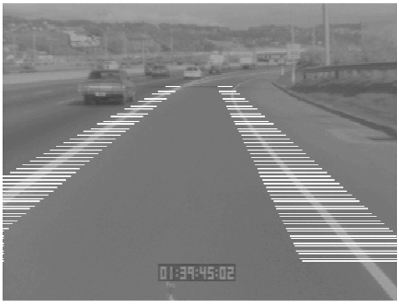

<?xml version="1.0" encoding="UTF-8" standalone="no"?>
<!DOCTYPE html PUBLIC "-//W3C//DTD XHTML 1.1//EN" "http://www.w3.org/TR/xhtml11/DTD/xhtml11.dtd">
<html xmlns="http://www.w3.org/1999/xhtml"><head><meta name="generator" content="DocBook XSL Stylesheets V1.76.1"/></head><body>

<h1 class="title"><a id="id787147"/>Navigálás és manipulálás a látás segítségével</h1>

A látás egyik legfontosabb alkalmazása az, hogy információt szolgáltat az objektumok manipulálásához – hogy felszedhessük, megfoghassuk, elforgathassuk stb. azokat –, valamint hogy akadályok kikerülésével navigálhassunk. Az a képesség, hogy a látást ezen célokra használják, a legprimitívebb állati látórendszerekben is jelen van. Sok esetben a látórendszer minimális abban az értelemben, hogy a rendelkezésre álló látómezőből csak annyi információt nyer ki, ami az állat viselkedésének a tájékoztatására szükséges. Igen valószínű, hogy a modern látórendszerek a korai, primitív organizmusokból fejlődtek ki, amelyek egy fényérzékeny foltot használtak az egyik végükön, és így tudták magukat a fény felé vagy azzal ellentétes irányba orientálni. A 24.4. alfejezetben<em> </em>láttuk, hogy a legyek egy nagyon egyszerű optikai folyamra alapozó látást használnak, hogy le tudjanak szállni a falon. A <em>What the Frog’s Eye Tells the Frog’s Brain</em> c. klasszikus tanulmány (Lettvin és társai, 1959) megfigyeli, hogy egy béka „éhen fog halni, ha olyan étellel van körülvéve, amely nem mozog. Csak a méret és a mozgás alapján állapítja meg, hogy mi élelem.”

<a id="id787160"/>
<strong>24.23. ábra - Az út képe egy autóban lévő kamerával lefényképezve. A vízszintes fehér csíkok jelzik azokat a keresési ablakokat, amiken belül a vezérlő az útvonali jeleket keresi. A gyenge képminőség nem szokatlan az alacsony felbontású fekete-fehér videók esetében.</strong>

A robotoknak nevezett „organizmusokban” számítógépes látórendszereket használunk. Tekintsünk egy speciális robotfajtát: egy automata járművezetőt egy autópályán (lásd 24.23. ábra). Először elemezzük a feladatot; azután meghatározzuk a látási algoritmust, amely a feladatok helyes végrehajtásához szükséges. A vezető előtt álló feladatok között találjuk az alábbiakat:

<ol class="orderedlist"><li class="listitem">
Oldalsó irányítás – biztosítani, hogy a kocsi biztonságosan a közlekedési sávon belül maradjon, vagy szükség esetén zökkenőmentesen váltson sávot.
</li><li class="listitem">
Hosszanti irányítás – biztosítani, hogy a kocsi előtt biztonságos távolság legyen.
</li><li class="listitem">
Akadályelhárítás – a szomszédos közlekedési sávokban haladó kocsik figyelése és felkészülés az elkerülő manőverezésre, ha azok valamelyike sávot szeretne váltani.
</li></ol>

A vezető feladata, hogy generálja ezen feladatok legjobb teljesítéséhez alkalmas kormányzási, gyorsítási vagy fékezési cselekvéseket.

Az oldalsó irányításhoz szükséges a gépkocsi pozíciójának és irányítottságának a sávhoz képesti reprezentálása. A 24.23. ábrán látható kép esetén éldetektáló algoritmusokkal azonosítjuk a sávhatárokat jelző határoló vonalakhoz tartozó éleket. Ezt követően ezekre az élekre sima görbéket illeszthetünk. Ezen görbék paraméterei információt hordoznak a gépkocsi oldalsó elhelyezkedésére nézve, az autó haladási irányára a sávon belül és a sáv íveltségére. Ez az információ – a gépkocsi dinamikájával együtt – képezi mindazt, amire a kormányzást irányító rendszernek szüksége van. Jegyezzük meg azt is, hogy mivel képkockáról képkockára a sáv képi vetületének pozíciója csupán csekély mértékben változik, tudjuk, hogy a képen a sávhatárjelző vonalakat <em>hol</em> keressük – csak azokon a területeken kell keresnünk, amelyek párhuzamos fehér vonalakkal vannak megjelölve.

A hosszanti irányításhoz az előttünk haladó gépkocsik távolságára van szükség. Erre a kétkamerás sztereolátás vagy optikai folyam segítségével tehetünk szert. Mindkét megközelítést lényegesen egyszerűsíthetjük, ha kihasználjuk a sík felületen történő haladásból adódó kényszereket. Ilyen technikák felhasználásával a vizuálisan irányított autók nagy sebességgel hosszú ideig tudnak közlekedni.

<h3 class="title">Fontos</h3>
A gépkocsi-vezetési példa egy szempontot igencsak világossá tesz: <em>egy konkrét feladat esetén a képen elvben található összes információ kinyerése nem szükséges</em>. Nem szükséges a gépkocsik pontos alakjának a meghatározása, az úttal szomszédos füves területekre vonatkozó az-alak-a-textúrából probléma megoldása stb. A feladat információszükséglete csak egy bizonyos típusú információra vonatkozik, és lényeges számítási sebességet és robusztusságot lehet biztosítani, ha csak erre az információra összpontosítunk, és a problémából adódó kényszereket teljes egészében kihasználjuk. Az előbbi részekben bemutatott általános megközelítések célja az volt, hogy egy általános alapelméletet adhassunk, amit majd a konkrét feladat szükségleteihez lehet specializálni.

</body></html>
