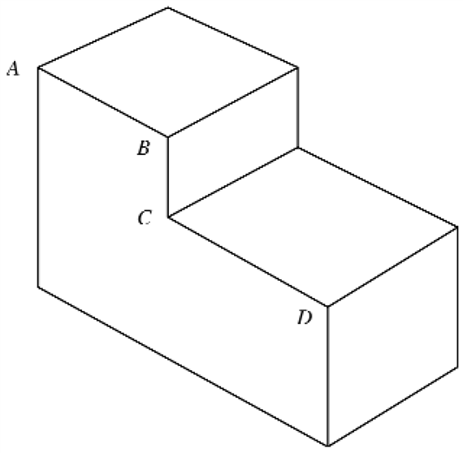
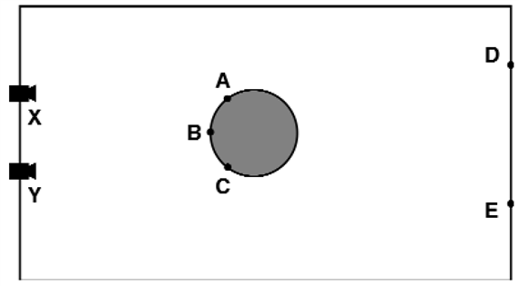

<?xml version="1.0" encoding="UTF-8" standalone="no"?>

<html xmlns="http://www.w3.org/1999/xhtml"><head><meta name="generator" content="DocBook XSL Stylesheets V1.76.1"/></head><body>

<h1 class="title"><a id="id787205"/>Összefoglalás</h1>

Bár az ember számára az érzékelés könnyed cselekvésnek tűnik, igen nagy mennyiségű komplex számítást igényel. A látás célja információ kiemelése olyan feladatokhoz, mint a manipulálás, a navigálás és az objektumfelismerés.

<ul class="itemizedlist"><li class="listitem">
A <strong>képalkotás</strong> (<strong>image formation</strong>) folyamata, a geometriai és fizikai aspektusokat tekintve, jól feltárt terület. Ha adott egy háromdimenziós jelenet leírása, ennek valamilyen tetszőleges kamerapozíciónak megfelelő képét könnyűszerrel előállíthatjuk (grafikai probléma). E folyamat megfordítása és a jelenet leírásának a kép alapján történő előállítása nehéz.
</li><li class="listitem">
Ahhoz, hogy a manipulálási, navigálási és objektumfelismerési feladatokhoz szükséges vizuális információt kiemelhessük, szükség van valamilyen közbülső reprezentáció megkonstruálására. A képekből az olyan primitív elemeket, mint az élek és a régiók, a <strong>képfeldolgozási algoritmusok</strong> (<strong>image-processings</strong>) emelik ki.
</li><li class="listitem">
Egy képben többféle segítség rejlik, amely lehetővé teszi, hogy a jelenetről háromdimenziós információt kapjunk. Idetartozik a mozgás, a sztereolátás, a textúra, az árnyalás és a kontúrelemzés. Ezek mindegyike a fizikai jelenetre vonatkozó háttér- feltételezéseken alapul, hogy az interpretációt közel egyértelművé tegye.
</li><li class="listitem">
A teljes körű objektumfelismerés nagyon nehéz probléma. A fényesség- és a jellemzőalapú megközelítéseket tárgyaltuk. Más lehetőségek is vannak.
</li></ul>

<h2 class="title"><a id="id787249"/>Irodalmi és történeti megjegyzések</h2>

Az emberi látás megértésére irányuló szisztematikus próbálkozások az ókorig nyúlnak vissza. Eukleidész (kb. i. e. 300) írt a természetes perspektíváról – az olyan leképezésről, amely a háromdimenziós világ minden <em>P</em> pontjához az <em>OP</em> sugár irányát rendeli hozzá, amely sugár a <em>P</em> pontot a vetítés <em>O</em> középpontjával köti össze. Eukleidész ismerte a mozgási parallaxis jelenségét is. A perspektivikus vetítés matematikai megértését, egy síkra való vetítés szempontjából, a 15. században az itáliai reneszánsz segítette elő. Az első, a háromdimenziós jelenet helyes geometriai vetítésén alapuló festményt általában Brunelleschinek tulajdonítják (1413). 1435-ben Alberti fogalmazta meg a szabályokat, és ő inspirálta a művészek generációit, akik művészi teljesítményét máig csodáljuk. A perspektíva tudományának – ahogy akkor nevezték – kidolgozásában kimagaslott Leonardo da Vinci és Albrecht Dürer. Leonardo késő 15. századi leírásait a fény és az árnyék <em>(chiaroscuro) </em>játékáról, az árnyék <em>umbra</em> és <em>penumbra</em> régióiról, valamint a légi perspektíváról még mindig érdemes elolvasni (Kemp, 1989).

Bár a perspektívát a görögök is ismerték, furcsamód a felfogásuk a szemnek a látásban betöltött szerepéről zavaros volt. Arisztotelész azt gondolta, hogy a szem – a mai lézeres távolságmérők mintájára – fénysugarakat bocsát ki. Ezt a téves elképzelést a világnak az arab tudósok közvetítették, többek közt Alhazen a 10. században. Ezután különféle kamerák fejlesztése következett. Ezek egy szobából (latinul a <em>camera</em> szobát jelent) álltak, ahova a fényt a falon egy kis nyíláson át engedjük be, hogy az átellenes falon a kinti jelenet képét kivetítse. Ezen kamerák mindegyikében a kép természetesen fordított volt, ami vég nélküli zavart okozott. Ha a szem ilyen elvű berendezés lenne, akkor hogyan lehetséges, hogy a képet helyesen látjuk? A probléma a korszak legnagyobb elméit foglalkoztatta (Leonardót is beleértve). A kérdés megválaszolásához Kepler és Descartes munkássága kellett. Descartes az ablakzsalu nyílásába egy olyan szemet helyezett be, amelynek nem átlátszó felhámrétegét eltávolították. A retinára kiterített papíron így egy fordított képet kapott. Bár a retinás kép valóban fordított, ez nem okoz problémát, mert az agy helyesen interpretálja a képet. Mai szaknyelven azt mondhatnánk, hogy megfelelő módon kezelni kell az adatstruktúrákat.

A látás megértésében a következő lényeges előrelépés a 19. században történt. Helmholtz és Wundt 1. fejezetben említett munkássága a pszichofizikai kísérleteket szigorú tudományos szintre emelte. Young, Maxwell és Helmholtz munkája megalapította a színes látás három színen alapuló elméletét. Azt a tényt, hogy az emberi szem a mélység érzékelésére is képes, ha a két szem kissé eltérő képet lát, Wheatstone a sztereoszkóp feltalálásával demonstrálta (Wheatstone, 1838). A készüléknek azonnal nagy sikere lett a szalonokban Európa-szerte. A kétkamerás sztereolátás lényegét, azaz hogy a jelenet két, kissé eltérő látószögből készített képe elegendő információt hordoz a jelenet háromdimenziós visszaállításához, a fotogrammetria területén aknázták ki. Megszülettek a kulcsfontosságú matematikai eredmények. Kruppa bebizonyította, hogy ha öt különböző pont két különböző képével rendelkezünk, vissza lehet állítani a két kamera pozíciója közötti elfordulást és eltolást, valamint a jelenet mélységét (egy skálafaktor erejéig) (Kruppa, 1913). Bár a sztereolátás geometriáját jó ideje ismerték, a fotogrammetria megfeleltetési problémáját általában emberek oldották meg, akik az egymásnak megfelelő pontokat igyekezték egymáshoz illeszteni. Az embereknek a megfeleltetési probléma megoldásában megmutatkozó csodálatos képességét Julesz Béla demonstrálta a véletlen-pont sztereogram feltalálásával (Julesz, 1971). Ezen probléma megoldására mind a számítógépes látás területén, mind a fotogrammetriában sok munkát fordítottak az 1970-es és az 1980-as években.

A 19. század második fele volt az a periódus, amikor az emberi látásra vonatkozó pszichofizikai kutatásokat megalapozták. A 20. század első felében a látás területén a legfontosabb eredményekhez a Max Wertheimer vezette Gestalt pszichológiai iskola jutott. „Az egész több, mint a részek összege” jelszóval azt a nézetet hangsúlyozták, hogy az észlelés elsődleges elemei a teljes formák legyenek, ne pedig az összetevők, mint például az élek.

A második világháború utáni szakaszt megújult aktivitás jellemezte. A legfontosabb J. J. Gibson munkája volt, aki rámutatott az optikai folyam és a textúragradiensek fontosságára olyan környezeti változók becslésénél, mint a dőlés és a lejtés (Gibson, 1950; 1979). Ő újból hangsúlyozta az ingerek fontosságát és gazdagságát. Gibson, Olum és Rosenblatt rámutattak, hogy az optikai folyammező elegendő információt tartalmaz ahhoz, hogy a megfigyelő meghatározhassa saját mozgását a környezetben (Gibson és társai, 1955). A számítógépes látásban a kutatás ezen területen és a (matematikailag ekvivalens) struktúra-a-mozgásból területen főleg az 1980-as években ment végbe, Koenderink, Van Doorn, Ullman és Longuet-Higgins alapozó eredményeit követve (Koendrink és Van Doorn, 1975; Ullman, 1979; Longeut-Higgins, 1981) adott lendületet e tevékenységnek. A kezdeti aggodalmakat a mozgásból származtatott struktúra stabilitásával kapcsolatban Tomasi és Kanade munkája (Tomasi és Kanade, 1992) csillapította, akik megmutatták, hogy több képkocka felhasználásával és az ebből származó széles alapvonallal az alak egészen pontosan felismerhető.

Chan és társai írják le a légy meghökkentő vizuális apparátusát, amelynek tízszer nagyobb az időbeli vizuális aktivitása, mint az embereké (Chan és társai, 1998). Azaz egy légy egy maximum 300 képkocka/másodperc sebességű filmet is úgy tudna nézni, hogy felismeri az egyes képkockákat.

Az 1990-es években megjelent koncepcionális újítás a mozgásból származtatott struktúra tanulmányozása volt. Egy ilyen beállításban a kamera kalibrációja nem szükséges, ahogy azt Faugeras megmutatta (Faugeras, 1992). Ez a felfedezés összefügg az objektumfelismerésben alkalmazott geometriai invariánsokkal, ahogy azt Mundy és Zisserman áttekintették (Mundy és Zisserman, 1992), és a mozgásból származtatott rokon struktúrával (Koenderink és Van Doorn, 1991). Az 1990-es években a számítógépek sebességének és tárolási kapacitásának növekedésével a digitális videofelvételekből történő mozgási szekvenciaelemzést sok új területen alkalmazták. Valósvilág-beli jelenetek geometriai modelljeinek felépítése a számítógépes grafikai technikákkal történő előállítás céljából különösen népszerűnek bizonyult, amelyet olyan rekonstrukciós algoritmusok vezettek, mint amelyet például Debevec, Taylor és Malik fejlesztettek ki (Debevec, Taylor és Malik, 1996). Hartley és Zisserman, valamint Faugeras és társainak könyvei átfogóan tárgyalják a többszörös nézetek geometriáját (Hartley és Zisserman, 2000; Faugeras és társai, 2001).

A számítógépes látásban az alak textúrából való kinyerésére vonatkozó legfontosabb kezdeti eredményeket Bajcsynak, Liebermannak és Stevensnek köszönhetjük (Bajcsy és Lieberman, 1976; Stevens, 1981). Míg ez a munka sík felületekre vonatkozott, a görbült felületekre vonatkozóan átfogó elemzéseket Garding, Malik és Rosenholtz végeztek (Garding, 1992; Malik és Rosenholtz, 1994).

A számítógépes látásban az alaknak az árnyékolásból való kinyerését Berthold Horn tanulmányozta (Horn, 1970). E terület fő cikkeit a (Horn és Brooks, 1989) tekinti át. Ez a megközelítés számos egyszerűsítő feltétellel élt, amelyekből a legkényesebb a kölcsönös megvilágítás hatásának figyelmen kívüli hagyása volt. A kölcsönös megvilágítás fontosságát kellően értékelték a számítógépes grafika területén, ahol éppen ezen hatás figyelembevételére fejlesztették ki a fénysugárkövetést és a radiozitást. Egy elméleti és gyakorlati kritika a (Forsyth és Zisserman, 1991)-ben található.

Az alaknak a kontúrból való meghatározása területén Huffman és Clowes kezdeti, kulcsfontosságú hozzájárulásai után poliéderes objektumok esetére (Huffman, 1971; Clowes, 1971) Mackworth és Sugihara teljessé tették az elemzést (Mackworth, 1973; Sugihara, 1984). Malik kifejlesztette a tartományonként sima görbült objektumok címkézési sémáját (Malik, 1987). Kirousis és Papadimitriou megmutatták, hogy a triéderes jelenet vonalcímkézése NP-teljes (Kirousis és Papadimitriou, 1988).

Ahhoz, hogy a sima görbült objektumok vetületeiből a vizuális eseményeket megértsük, szükség van a differenciálgeometria és a szingularitáselmélet együttesére. Ezek tanulmányozásához a legjobb irodalom Koenderink <em>Solid Shape</em> c. műve (Koenderink, 1990).

A háromdimenziós objektumfelismerés területén Roberts az MIT-n benyújtott diszszertációja adott lényegi eredményeket (Roberts, 1963). Sokan úgy tartják, hogy ez a számítógépes látás területén az első PhD-disszertáció, amely sok kulcsfontosságú ötletet vezetett be, az éldetektálást és a modellalapú illesztést is beleértve. A Canny-féle éldetektálást (Canny, 1986) vezette be. A Roberts által bevezetett illesztés gondolata később Lowe, Huttenlocher és Ullman munkájában újra megjelent (Lowe, 1987; Huttenlocher és Ullman, 1990). A helyzet összerendelési módszer alapján történő becslésének hatékonyságát jelentős mértékben Olson növelte (Olson, 1994). A háromdimenziós objektumfelismerés kutatásának egy másik nagy vonulata, az alakzatok térfogati primitívekre, ún. <strong>általánosított henger</strong>ekre (<strong>generalized cylinder</strong>s) alapuló leírása, amelyet Tom Binford vezetett be, különösen népszerűnek bizonyult (Binford, 1971).

Míg az objektumfelismeréssel foglalkozó számítógépes látás kutatása nagyrészt a háromdimenziós objektumok kétdimenziós képekre történő leképezésével foglalkozott, addig a mintafelismeréssel foglalkozó közösségben létezett egy párhuzamos irányzat, amely a problémát a mintaosztályozás problémájaként látta. Az ezt motiváló példák olyan területekről kerültek ki, mint az optikai karakterfelismerés és a kézzel írt irányítószámok felismerése, ahol az elsődleges probléma egy objektumosztály tipikus variációinak jellemvonásait megtanulni, és ezek alapján különválasztani őket más osztályoktól. A megközelítések összehasonlítását a (LeCun és társai, 1995) tartalmazza. Az objektumfelismerésről szóló további munkák között van (Sirovitch és Kirby, 1987; Viola és Jones, 2002) arcfelismerésről szóló munkája. Az alakkontextus módszerét (Belongie és társai, 2002) írja le. (Dickmanns és Zapp, 1987) demonstrált először nagy sebességgel az autópályán haladó, vizuálisan vezérelt járművel; Pomerleau neurális hálózatok segítségével ért el hasonló teljesítményt (Pomerleau, 1993).

Stephen Palmer munkája, a <em>Vision Science: Photons to Phenomenology</em> (Palmer, 1999) a legjobb összefoglaló munka az emberi látás leírására; David Hubel <em>Eye, Brain and Vision </em>(Hubel, 1988) és Irvin Rock <em>Perception</em> c. műve (Rock, 1984) rövid bevezetőt nyújtanak a neuropszichológia, illetve az észlelés területeibe.

A számítógépes látás területének legjobb összefoglaló jegyzete David Forsyth és Jean Ponce munkája, a <em>Computer Vision: A Modern Approach</em>. Sokkal rövidebben tárgyalja a területet (Nalwa, 1993; Trucco és Verri, 1998). A <em>Robot Vision</em> (Horn, 1986) és a <em>Three-Dimensional Computer</em> <em>Vision</em> (Faugeras, 1993) régebbi, de még mindig hasznos jegyzetek, saját, speciális témájukban. David Marr könyve, a <em>Vision </em>(Marr, 1982) fontos szerepet töltött be a számítógépes látás (pszichofizika) és a tradicionális biológiai látás (neurobiológia) összekapcsolásában. A számítógépes látás témájában a két fő folyóirat az <em>IEEE Transactions on Pattern Analysis and Machine Intelligence</em> és az <em>International Journal of Computer Vision</em>. A számítógépes látással foglalkozó konferenciák többek közt az ICCV <em>(International Conference on Computer Vision),</em> a CVPR <em>(Computer Vision and Pattern Recognition)</em> és az ECCV <em>(European Conference on Computer Vision)</em>.

<h2 class="title"><a id="id787381"/>Feladatok</h2>

<strong>24.1.	</strong>

A sűrű, lombos koronával rendelkező fa árnyékában számos világos foltot lehet látni. Meglepetésre mind körkörös. Miért? Hiszen ha úgy vesszük, a levelek közötti rések, amelyeken keresztül átvilágít a nap, nagy eséllyel nem ilyenek.

<strong>24.2.	</strong>

Címkézze meg a 24.24. ábrán<em> </em>látható objektumot, azt feltételezve, hogy a külső éleket takaró éleknek címkéztük, és az összes sarokpont triéderes. Tegye meg ezt a visszalépő algoritmussal, amely a sarokpontokat <em>A</em>, <em>B</em>, <em>C</em> és <em>D</em> sorrendben fogja megvizsgálni, mindegyik lépésnél úgy megválasztva a címkéket, hogy azok az előbb megcímkézett csatlakozásokkal és élekkel konzisztensek legyenek. Próbálja most a sarokpontokat <em>B</em>, <em>D</em>, <em>A</em> és <em>C</em> sorrendben megcímkézni.

<a id="id787433"/>
<strong>24.24. ábra - A megcímkézendő objektum, amelynek minden sarokpontja triéderes</strong>

<strong>24.3.	</strong>

Tekintsen egy végtelen hosszú, <em>r </em>sugarú hengert, amelynek tengelye az <em>y </em>tengellyel párhuzamos. A henger Lambert-féle felülettel rendelkezik, és a pozitív <em>z </em>tengely felől irányítjuk rá a kamerát. Mit fog látni a képen, ha a hengert egy pontszerű fényforrás világítja meg, amely a pozitív <em>x</em> tengelyen a végtelenben helyezkedik el. Magyarázza meg a válaszát úgy, hogy az azonos fényességű kontúrokat rajzolja fel a vetített képre. Az azonos fényességű kontúrok azonos távolságban helyezkednek-e el?

<strong>24.4.	</strong>

A képbeli élek a jelenetesemények sokaságának felelhetnek meg. Tekintsen egy tetszőleges fényképet, amely valódi háromdimenziós jelenetet ábrázol. Azonosítson a képen tíz élt, és kísérelje meg egyenként eldönteni, hogy az él (a) a mélység, (b) a felületi normális, (c) a reflektancia, illetve (d) a megvilágítás szakadásának felel-e meg.

<strong>24.5.	</strong>

Mutassa meg, hogy a konvolúció egy adott függvénnyel felcserélhető a differenciálással, azaz, hogy:

<code class="code">	(<em>f</em> ∗ <em>g'</em>) = <em>f</em> ∗ <em>g'</em></code>

<strong>24.6.	</strong>

Egy terület feltérképezéséhez egy sztereorendszer használatát fontolgatjuk. A rendszer két CCD kamerából fog állni, mindegyik 512 × 512 pixel felbontású egy 10 × 10 cm négyzet alakú érzékelőn. A felhasználandó lencsék fókusztávolsága 16 cm, és a lencsék a végtelenben fixálnak. A bal oldali kép (<em>u</em>1, <em>v</em>1) és a jobb oldali kép (<em>u</em>2, <em>v</em>2) egymáshoz tartozó pontjaira <em>v</em>1 = <em>v</em>2, hiszen a két képsíkon az <em>x</em> tengelyek az epipoláris vonalakkal párhuzamosak. A két kamera optikai tengelye párhuzamos. A két kamera közötti bázisvonal 1 m.

<ol class="orderedlist"><li class="listitem">
Ha a legközelebbi mérendő táv 16 m, mi a tapasztalható legnagyobb diszparitás (képpontban)?
</li><li class="listitem">
Mi a távmérés pixelfelbontásból adódó felbontása 16 m távolságban?
</li><li class="listitem">
Milyen táv tartozik az egy képpontos képeltéréshez?
</li></ol>

<strong>24.7.	</strong>

Az illesztési algoritmust egy ipari alkalmazásnál szeretnénk használni, ahol lapos alkatrészeket egy szállítószalag visz, a szalag felett pedig egy függőlegesen elhelyezett kamera figyel. Az alkatrész elhelyezkedését három változó határozza meg, egy az elfordulást és kettő az alkatrész kétdimenziós pozícióját. Ez egyszerűsíti a problémát, és a <code class="code">TRANSZFORMÁCIÓT-KERES</code> függvény az egymásnak megfelelő kép- és modelltulajdonságokból két párt igényel ahhoz, hogy az elhelyezkedést azonosítsa. Határozza meg csak ebben a környezetben az illesztésnek a legrosszabb esetre vett komplexitását.

<strong>24.8.	</strong>

(Pietro Perona nyomán.) A 24.25. ábra X és Y pontban két kamerát mutat, amelyek megfigyelnek egy jelenetet. Rajzolja le azt a képet, amit az egyes kamerák látnak (felteheti, hogy minden jelölt pont ugyanabban a vízszintes síkban helyezkedik el). Mi tudható meg a két kép alapján az A, B, C, D és E pontok a kamera alapvonalától mért relatív távolságáról, és milyen alapon?

<a id="id787576"/>
<strong>24.25. ábra - Felülnézeti kép egy kétkamerás látórendszerről, amely egy üveget figyel meg, amely mögött egy fal van</strong>

<strong>24.9.	</strong>

A következő állítások közül melyik igaz és melyik hamis?

<ol class="orderedlist"><li class="listitem">
Sztereoképeken az egymásnak megfelelő pontok megtalálása a sztereomélység-megállapítás folyamatának legegyszerűbb feladata.
</li><li class="listitem">
Az alak-mintázatból feladat megoldható egy fénycsíkokat tartalmazó háló jelenetre történő vetítésével.
</li><li class="listitem">
A Huffman–Clowes címkéző rendszer mindenféle poliéderes objektumot tud kezelni.
</li><li class="listitem">
Görbéket tartalmazó objektumok vonalas rajzaiban a vonal címkéje változhat az egyik végétől a másikig.
</li><li class="listitem">
Ugyanazon jelenet sztereonézeteiben minél messzebb van a két kamera egymáshoz képest, annál pontosabban határozható meg a mélység.
</li><li class="listitem">
Egy jelenetben található egyforma hosszúságú vonalak mindig egyforma hosszúságra vetítődnek a képen.
</li><li class="listitem">
A képen egyenes vonalak szükségszerűen egyenes vonalaknak felelnek meg a jelenetben.
</li></ol>

<strong>24.10.	</strong>

A 24.23. ábra egy autó nézőpontjából készült egy autópálya kijáratánál. Két autó látható a közvetlenül balra levő sávban. Milyen okok miatt kell a nézőnek azt a következtetést levonnia, hogy az egyik közelebb van, mint a másik?

</body></html>
