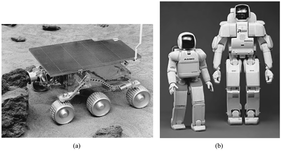

<?xml version="1.0" encoding="UTF-8" standalone="no"?>
<!DOCTYPE html PUBLIC "-//W3C//DTD XHTML 1.1//EN" "http://www.w3.org/TR/xhtml11/DTD/xhtml11.dtd">
<html xmlns="http://www.w3.org/1999/xhtml"><head><meta name="generator" content="DocBook XSL Stylesheets V1.76.1"/></head><body>

<h1 class="title"><a id="id787628"/>25. fejezet - Robotika</h1>

<em>Ebben a fejezetben az ágenseket fizikai beavatkozó szervekkel látják el, hogy rosszalkodhassanak.</em>

<h1 class="title"><a id="id787636"/>Bevezetés</h1>

A <strong>robot</strong>ok (<strong>robot</strong>s) olyan fizikai ágensek, amelyek a fizikai világ megváltoztatásával oldanak meg feladatokat. E célból különböző <strong>beavatkozó szerv</strong>ekkel (<strong>effector</strong>s) szerelik fel őket, például lábakkal, kerekekkel, karokkal és megfogókkal. A beavatkozók kizárólagos célja, hogy fizikai hatást fejtsenek ki a környezetre.[<a id="id787661" href="#ftn.id787661" class="footnote">275</a>] A robotokat <strong>érzékelő</strong>kkel (<strong>sensor</strong>s) is felszerelik, hogy érzékelhessék környezetüket. Manapság a robotikában számtalan különféle érzékelőt használnak: kamerákat és ultrahangradarokat a környezet mérésére, giroszkópokat és gyorsulásmérőket a robot saját mozgásának követésére.

A legtöbb mai robot három nagy kategória egyikébe sorolható. A <strong>manipulátor</strong>ok (<strong>manipulator</strong>s), vagy más néven robotkarok fizikailag a munka helyszínéhez rögzítettek, például egy ipari szerelősoron egy gyárban vagy a Nemzetközi Űrállomáson. A manipulátorok mozgását általában irányítható csuklók sora biztosítja, lehetővé téve, hogy a végbeavatkozó szerv a munkatér bármely pontjára eljuthasson. Az ipari robotok messze leggyakoribb fajtája a manipulátor, világszerte több mint egymillió működik belőlük. Bizonyos mobil robotkarokat kórházakban, műtéteknél használnak. Kevés autógyártó tudna ma már meglenni ipari robotok nélkül, és egyes robotkarok még műalkotások készítésére is képesek.

A második csoportot a <strong>mobil robot</strong>ok (<strong>mobile robot</strong>s) alkotják. A mobil robotok kerekek, lábak vagy hasonló szerkezetek segítségével mozognak a fizikai környezetben. Használják őket kórházakban ételkihordásra, dokkokban árurakodásra és más, hasonló feladatokra. Korábban már említettünk egy példát, a <code class="code">NAVLAB</code> <strong>ember nélküli közúti jármű</strong>vét (<strong>unmanned land vehicle</strong>, <strong>ULV</strong>), amely autópályán képes önállóan, sofőr nélkül navigálni. Másfajta mobil robotokat, például az <strong>ember nélküli légi jármű</strong>veket (<strong>unmanned air vehicle</strong>, <strong>UAV</strong>) katonai felderítésre, mezőgazdasági permetezésre és megfigyelésre használnak. Az <strong>autonóm víz alatti jármű</strong>vek (<strong>autonomous underwater vehicle</strong>, <strong>AUV</strong>) nagy szerepet játszanak a mélytengeri felfedezésekben, míg a <strong>bolygójáró</strong>k (<strong>planetary rover</strong>s), mint például a 25.1. (a) ábrán látható Sojourner, az űrkutatásban segédkeznek.

<a id="id787769"/>
<strong>25.1. ábra - (a) A NASA Sojourner mobil robotja, amely a Mars felszínét derítette fel 1997 júliusában. (b) A Honda P3 és Asimo elnevezésű humanoid robotjai.</strong>

A harmadik típusba tartoznak a hibridek: olyan mobil robotok, amelyekre karokat is szereltek. Ezek közé sorolhatjuk a <strong>humanoid robot</strong>okat (<strong>humanoid robot</strong>s), amelyek fizikai felépítése hasonlít az emberéhez. A 25.1. (b) ábrán két ilyen humanoid robot látható, mindkettő Japánban készült, a Hondánál. A hibridek a rögzített manipulátoroknál nagyobb távolságokban is képesek beavatkozó szerveiket használni, de általában nehezebben tudják végrehajtani a feladatukat, mert nem rendelkeznek kellő stabilitással és szilárdsággal, amit a lerögzítés biztosít.

A robotika tárgyköre magában foglalja a protéziseket (emberek részére készített mesterséges végtagok, mesterséges fül vagy szem), az intelligens környezeteket (mint például egy egész ház felszerelve szenzorokkal és beavatkozó szervekkel) és a többelemű (multibody) rendszereket is, ahol a feladatokat rengeteg apró együttműködő robot hajtja végre.

A valódi robotoknak általában olyan környezetben kell boldogulniuk, amely csak <em>részlegesen megfigyelhető, </em>sztochasztikus, dinamikus és folytonos. Néhány, de nem mindegyik robotkörnyezet szekvenciális és multiágens jellegű is. A részleges megfigyelhetőség és a sztochasztikusság annak az eredménye, hogy egy meglehetősen nagy és komplex világgal kell foglalkozni. A robot nem lát a sarkok mögé, és bizonytalanság van a mozgásparancsok végrehajtásában a hajtások csúszása, a súrlódás stb. miatt. Mi több, a fizikai világ makacsul visszautasítja, hogy valós idejűnél gyorsabb legyen! Szimulációs környezetben egyszerűbb tanulási algoritmusok használatával (mint például a 21. fejezetben leírt <strong>Q-tanulás</strong>) lehetséges mindössze néhány CPU-munkaóra során több millió próbát végrehajtva tanulni, de valós környezetben éveket vehetnek igénybe ezek a kísérletek. Továbbá, az igazi ütközések valóban fájdalmat okozhatnak, ellentétben a szimuláltakkal. A valódi robotrendszerekbe – ahhoz, hogy a robot gyorsan tanulhasson és biztonságosan üzemelhessen – előzetesen információt kell beépíteni magáról a robotról, fizikai környezetéről és az elvégzendő feladatról.

 

[<a id="ftn.id787661" href="#id787661" class="para">275</a>]  A 2. fejezetben még <strong>beavatkozó</strong>król (<strong>actuator</strong>s) beszéltünk, és nem beavatkozó szervekrõl (effectors). A beavatkozó egy vezérlővonal, amely a beavatkozó szervnek közvetíti az utasítást, míg a beavatkozó szerv maga a fizikai eszköz.

</body></html>
