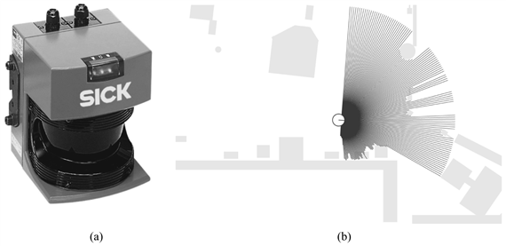
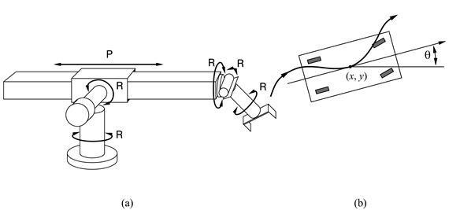
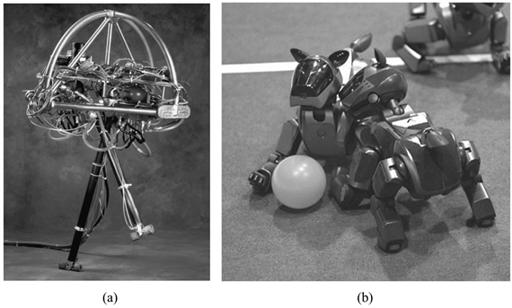

<?xml version="1.0" encoding="UTF-8" standalone="no"?>

<html xmlns="http://www.w3.org/1999/xhtml"><head><meta name="generator" content="DocBook XSL Stylesheets V1.76.1"/></head><body>

<h1 class="title"><a id="id787805"/>Robothardver</h1>

Eddig a könyvben adottnak tekintettük az ágensek architektúráját (érzékelőket, beavatkozó szerveket és processzorokat), és csak az ágensek működtető programjára koncentráltunk. A valóságban a robotok sikere legalább annyira múlik a feladathoz illő, megfelelő szenzorok és beavatkozó szervek megválasztásán.

<h2 class="title"><a id="id787811"/>Érzékelők</h2>

A szenzorok jelentik az érzékelési interfészt a robotok és környezetük között. A <strong>paszszív érzékelő</strong>k (<strong>passive sensor</strong>s), mint például a kamerák, ténylegesen puszta megfigyelői a környezetüknek: olyan jeleket vesznek, amelyeket a robot környezetében lévő más tárgyak generálnak. Az <strong>aktív szenzor</strong>ok (<strong>active sensor</strong>s), mint például a hanglokátor, energiát sugároznak környezetükbe, és érzékelik, ha ez az energia visszaverődik. Az aktív szenzorok általában több információt szolgáltatnak, de ugyanakkor többet fogyasztanak, és interferencia léphet fel, ha egyszerre többet is használunk. Akár aktív, akár passzív érzékelőkről van szó, három csoportba lehet őket osztani az alapján, hogy távolságot mérnek, teljes képet közvetítenek a környezetről vagy a robot egyes saját tulajdonságait figyelik.

Sok mobil robot egy adott térrészt lefedő <strong>pásztázó távolságmérő</strong>t (<strong>range finder</strong>) használ, olyan szenzort, amely a közeli tárgyak távolságát méri. Gyakori típus a szonárszenzor, más néven hanglokátor. A szonárszenzorok irányított hanghullámokat bocsátanak ki, amelyek egy része visszaverődik a tárgyakról. A visszaverődés ideje és a hullám intenzitása információval szolgál a közeli tárgyak helyzetéről. Az AUV-kre (autonóm víz alatti jármű) víz alatti hanglokátorokat szerelnek. Szárazföldön a hanglokátorokat – rossz irányfelbontásuk miatt – főleg kis távolságon belüli ütközések elkerülésére használják. A hanglokátorok alternatíváját jelenthetik (elsősorban légi járműveknél) a radaralapú és a lézeres távolságmérők. Egy lézeres pásztázó távolságmérő látható a 25.2. ábrán.

<a id="id787849"/>
<strong>25.2. ábra - (a) A mobil robotoknál népszerű SICK LMS lézeres távolságmérő. (b) Egy horizontálisan felszerelt távolságmérő által mért visszaverődési kép 2D-s térképre vetítve.</strong>

Egyes távolságmérők csak nagyon kicsi vagy nagyon nagy távolságokra használhatók. A kis távolságú szenzorok közé tartoznak a <strong>taktilis</strong>, vagyis <strong>tapintásalapú érzékelő</strong>k (<strong>tactile sensor</strong>s), mint például az érzékelőbajusz, lökhárító vagy az érintésérzékeny bőr. A skála másik végén a <strong>globális helymeghatározó rendszer</strong> (<strong>Global Positioning System</strong>, <strong>GPS</strong>) áll, amely a műholdakból érkező impulzusok alapján számítja a távolságot. Jelenleg két tucat műhold kering orbitális pályán, és mindegyik két külön frekvencián sugároz jeleket. A GPS-vevőkészülékek a fázistolásból tudják kiszámítani a műholdtól való távolságukat. Több műholdtól érkező jel alapján háromszögeléssel néhány méteres pontossággal meghatározható a Földön elfoglalt tényleges pozíció. A <strong>differenciális GPS</strong> (<strong>differential GPS</strong>) még egy pontosan ismert helyen lévő földi vevő jelét is használva – ideális esetben – milliméteres pontosságot ér el. Sajnálatos módon a GPS nem használható beltérben vagy víz alatt.

A szenzorok másik fontos osztályát képezik a <strong>képérzékelő</strong>k (<strong>imaging sensor</strong>s). A kamerák képet adnak számunkra a környezetről, valamint – a 24. fejezetben tárgyalt, számítógépes gépi látási módszerek alkalmazásával – modellekkel, illetve tulajdonságokkal írják le a környezetet. A sztereolátás különösen fontos a robotikában, mivel mélységi információt is közvetít. Jövőjük mindamellett elég bizonytalan, mert sikeresen folyik új, aktív távolságleképezési technológiák kidolgozása.

A harmadik fontos osztályt az <strong>önérzékelők</strong> (<strong>proprioceptive sensor</strong>s) alkotják, amelyek a robot saját állapotáról adnak tájékoztatást. Annak érdekében, hogy a robot csuklóinak pontos állásáról információnk legyen, a motorok tengelyét sokszor <strong>szöghelyzet-dekódoló</strong>kkal (<strong>shaft decoder</strong>s) látják el, amelyek kis lépésekben követik a tengely elfordulását. A robotkarokon a tengelyre szerelt dekódolók bármikor pontos helyzetinformációt tudnak szolgáltatni. Mobil robotokon a szöghelyzet-dekódolókat a kerék mozgásának figyelésére használják, amely alapján számítható a megtett út. Ezt hívják <strong>odometriá</strong>nak (<strong>odometry</strong>). Sajnálatos módon az odometria – a kerekek csúszása és sodródása miatt – csak kis távolságokban használható. A külső hatások, mint például az áramlások az AUV-knél (autonóm víz alatti jármű) vagy a szél az UAV-k (autonóm légi jármű) esetében tovább növeli a mérés bizonytalanságát. Az <strong>inerciaszenzor</strong>ok (<strong>inertial sensor</strong>s), mint például a giroszkóp, javítanak a pontosságon, de önmagukban még nem küszöbölik ki a pozíciómérés hibájának elkerülhetetlen halmozódását.

A robotállapot más fontos jellemzőinek mérésére <strong>erő</strong>- és <strong>nyomatékérzékelő</strong>ket (<strong>force</strong>, <strong>torque sensor</strong>s) használnak. Ezek nélkülözhetetlenek, ha a robotnak törékeny tárggyal kell dolgoznia, vagy olyannal, amelynek pontos mérete és helyzete nem ismert. Képzeljük csak el, amikor egy közel egytonnás manipulátornak egy villanykörtét kell becsavarnia. Ha túl nagy erővel fogná meg a körtét, könnyen összeroppanthatná. Az erőérzékelők lehetővé teszik, hogy a robot tudja, milyen nehéz megfogni a körtét, míg a nyomatékérzékelők információt szolgáltatnak, hogy milyen nehéz becsavarni. A jó szenzorok képesek erőt mérni mindhárom elmozdulási és mindhárom elfordulási irányban.

<h2 class="title"><a id="id787975"/>Beavatkozó szervek</h2>

A robotok beavatkozó szerveik segítségével mozognak és változtatják alakjukat. Ahhoz, hogy megértsük a beavatkozó szervek felépítését, először is általános értelemben kell beszélnünk a mozgás és az alak elvont értelmezéséről, a <strong>szabadságfok</strong>ok (<strong>degree of freedom</strong>, <strong>DOF</strong>) koncepciójának felhasználásával. Szabadságfoknak számít minden olyan irány, amelyben a robot vagy egyik beavatkozó szerve mozogni képes. Például egy merev, szabadon mozgó robotnak (mint amilyenek az AUV-k) hat szabadságfoka van, három az (<em>x</em>, <em>y</em>, <em>z</em>) térbeli elhelyezkedés, három pedig a szögelfordulás (orientáció). Ezeket szokták <em>csavarásnak</em>, <em>billentésnek</em> és <em>forgatásnak</em> is hívni (RPY – <em>roll, pitch, yaw</em>). Ez a hat szabadságfok meghatározza a robot kinematikus állapotát,[<a id="id788021" href="#ftn.id788021" class="footnote">276</a>] más néven a pozícióját és az orientációját együttesen. A robot <strong>dinamikai állapot</strong>a (<strong>dynamic state</strong>) minden egyes kinematikai paraméter változási sebességét is tartalmazza, így minden kinematikai dimenziónál egy-egy további dimenziót hoz be.

<a id="id788039"/>
<strong>25.3. ábra - (a) A Stanford manipulátor: egy korai robotkar öt rotációs (R) és egy transzlációs (prizmatikus) csuklóval (P), összesen hat szabadságfokkal. (b) Egy elsőkerék-kormányzású nemholonomikus négykerekű jármű mozgása.</strong>

Nem merev testek esetében magán a roboton belül további szabadságfokok vannak. Például az emberi kar esetében a könyök egy szabadságfokú, mert egy irányba képes elfordulni. A csukló három szabadságfokú, mert tud fel-le és jobbra-balra mozogni, továbbá forogni is. Általában minden egyes robotcsuklónak is egy, két vagy három szabadságfoka van. Hat szabadságfok szükséges ahhoz, hogy például egy kezet a térben tetszőleges pozícióba és irányba (orientációba) hozzunk. A 25.3. (a) ábrán látható robotkarnak pontosan hat szabadsági foka van: öt <strong>rotációs csukló</strong> (<strong>revolute joint</strong>), amelyek forgást tesznek lehetővé, és egy <strong>transzlációs csukló</strong> (<strong>prismatic joint</strong>), amely kinyúlásra képes. Egy egyszerű kísérlet segítségével könnyedén meggyőződhetünk arról, hogy az emberi kéznek valójában hatnál több szabadságfoka van: kezünket az asztalra rakva még mindig képesek vagyunk elforgatni a könyökünket, anélkül hogy a kezünk konfigurációja megváltozna. Azokat a manipulátorokat, amelyeknek több szabadságfoka van, mint ami minimálisan szükséges ahhoz, hogy végbeavatkozó szervüket (end effector) a kívánt helyre vigyék, könnyebb vezérelni, mint azokat, amelyek csak a minimálisan szükséges számú szabadságfokkal rendelkeznek.

Mobil robotoknál a szabadságfokok száma nem feltétlenül egyezik meg a mozgatott részek számával. Vegyünk például egy átlagos autót: tud mozogni előre-hátra és tud fordulni. Ez így két szabadságfok. Ennek ellenére a kocsi kinematikája háromdimenziós: egy szabad lapos felületen könnyedén el tud jutni bármilyen (<em>x</em>, <em>y</em>) pontba, tetszőleges orientációval (lásd 25.3. (b) ábra). Azaz a kocsinak 3 <strong>effektív szabadságfok</strong>a (<strong>effective DOF</strong>) van, de 2 <strong>irányítható szabadságfok</strong>a (<strong>controllable DOF</strong>). A robotra azt mondjuk, hogy <strong>nemholonomikus</strong> (<strong>nonholonomic</strong>), ha az effektív szabadságfoka nagyobb, mint az irányítható szabadságfoka, míg <strong>holonomikus</strong> (<strong>holonomic</strong>), ha ez a kettő megegyezik. A holonomikus robotokat könnyebb irányítani. Mennyivel egyszerűbb lenne olyan kocsival parkolni, amely képes oldal irányban is mozogni, nem csak előre-hátra! Viszont a holonomikus robotok jellemző módon mechanikailag sokkal bonyolultabbak. A legtöbb robotkar holonomikus, míg a mobil robotok általában nemholonomikusak.

A mobil robotok számára mozgató mechanizmusok széles tárháza áll rendelkezésre: kerekek, lánctalpak, lábak stb. A <strong>differenciál hajtás</strong>ú (<strong>differential drive</strong>) robotoknak kétoldalt külön mozgatható kerekeik (vagy lánctalpaik) vannak, ugyanúgy, mint a tankoknak. Ha mindegyik kerék azonos sebességgel mozog, akkor a jármű egyenesen halad előre. Ha ellenkező irányba mozognak, akkor a robot képes egy helyben megfordulni. A másik alternatívát a <strong>szinkrón hajtás</strong> (<strong>synchro drive</strong>) jelenti, amelynél minden kerék el tud fordulni a tengelye mentén. Ez könnyen vezethetne káoszhoz, ha nem lenne az a kényszer, hogy minden kerék mindig azonos irányba álljon, és azonos sebességgel forogjon. Mind a differenciál, mind a szinkrón hajtás nemholonomikus. Egyes drága robotok holonomikus hajtást használnak, általában három vagy több önállóan irányítható kerékkel.

A kerekekkel ellentétben a lábak még a nagyon nehéz tereppel is megbirkóznak. Ugyanakkor a lábak meglehetősen lassúak sík terepen, és mechanikailag nehezebb megépíteni őket. Robotikai szakemberek próbáltak már különféle konstrukciókat, egytől akár tucatnyi lábig. Készítettek lábbal rendelkező robotokat sétálásra, futásra, sőt még ugrálásra is. Egy ilyen példa látható a 25.4. (a) ábrán: ez a robot <strong>dinamikusan stabil</strong> (<strong>dinamically stable</strong>), ami azt jelenti, hogy képes talpon maradni, miközben körbe ugrál. <strong>Statikusan stabil</strong>nak (<strong>statically stabile</strong>) hívják azokat a robotokat, amelyek úgy képesek állva maradni, hogy nem mozognak a lábaik. A robot statikusan akkor stabil, ha a súlypontja a lábai által kifeszített sokszög fölé esik.

<a id="id788162"/>
<strong>25.4. ábra - (a) Marc Raibert egyik lépegető robotja mozgás közben. (b) A Sony AIBO robot focizás közben (copyright 2001, The RoboCup Federation).</strong>

Más típusú mobil robotok teljesen eltérő módszereket használnak a mozgáshoz. A légi járműveken általában propellereket vagy turbinákat alkalmaznak. Robot léghajók a meleg áramlatokat használják ki, hogy a levegőben maradjanak. Az autonóm víz alatti járművek gyakran alkalmaznak a tengeralattjárókon használtakhoz hasonló fúvókákat.

Szenzorok és beavatkozó szervek önmagukban még nem tesznek ki egy robotot. Egy igazi robotnak energiaforrásra is szüksége van, hogy mozgathassa beavatkozó szerveit. A legnépszerűbb megoldás mind a manipulátorok mozgatásához, mind a helyváltoztatáshoz, a villanymotor. Ugyanakkor a pneumatikus (sűrített gázzal működő) és a hidraulikus (folyadékkal közvetített nyomással működő) hajtásoknak is megvannak a maguk alkalmazási területei. A legtöbb robot valamiféle digitális kommunikációs eszközzel is rendelkezik, például vezeték nélküli hálózati kapcsolattal. Végezetül szükség van valami vázra is, amelyre fel lehet szerelni az alkatrészeket és az eszközöket, valamint egy forrasztópákára, ha az alkatrészek és eszközök megszűnnek működni.

 

[<a id="ftn.id788021" href="#id788021" class="para">276</a>]  A „kinematika” szó a görög „cinema”-ból ered, ami <em>mozgást</em> jelent.

</body></html>
