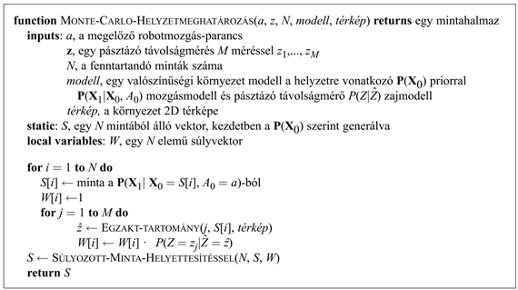
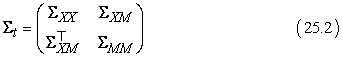

<?xml version="1.0" encoding="UTF-8" standalone="no"?>

<html xmlns="http://www.w3.org/1999/xhtml"><head><meta name="generator" content="DocBook XSL Stylesheets V1.76.1"/></head><body>

<h1 class="title"><a id="id788177"/>Érzékelés a robotikában</h1>

Az érzékelés az a folyamat, amelynek során a robot a szenzoraiból érkező jeleket környezetének belső reprezentációjára képezi le. Az érzékelés nehéz, mivel általában a szenzorok adatai zajjal terheltek, a környezet csak részlegesen megfigyelhető, nem jósolható viselkedésű és gyakran dinamikus is. Ökölszabály, hogy egy jó belső reprezentációnak három tulajdonsága van: elég információt hordoz ahhoz, hogy a robot a megfelelő döntést meghozhassa; strukturáltsága lehetővé teszi, hogy hatékonyan frissíthető legyen; valamint természetes olyan értelemben, hogy a belső állapotváltozók megfeleltethetők egy-egy valós fizikai világbeli állapotváltozónak.

A 15. fejezetben megmutattuk, hogy a Kalman-szűrők, a rejtett Markov-modellek és a dinamikus Bayes-hálók alkalmasak egy részlegesen megfigyelhető környezet állapotátmenet- és érzékelő modelljeinek a reprezentálására. Ismertettünk egzakt és közelítő algoritmusokat a belső <strong>hiedelmi állapot </strong>(<strong>belief state</strong>) – a környezet állapotváltozói felett értelmezett a posteriori valószínűség-eloszlás – frissítésére. Erre számos dinamikus Bayes-hálós modellt mutattunk be a 15. fejezetben. Robotikai problémák esetében a modellhez általában megfigyelt változóként a robot saját korábbi cselekvéseit is hozzáveszszük, mint ahogy az a 17.9. ábra hálózatán látható. A 25.5. ábra ennek a fejezetnek a jelöléseit mutatja: <strong>X</strong>t a környezet állapota (beleértve a robotot is) a <em>t</em> időpillanatban; <strong>Z</strong>t a <em>t</em> időpontbeli megfigyelés (az érzékelésből származó adatok), az <em>At</em> pedig az érzékelést követően végzett cselekvés.

A <strong>szűrés</strong>i (<strong>filtering</strong>) feladat, vagyis a hiedelmi állapot frissítése alapvetően azonos a 15. fejezetben tárgyaltakkal. A feladat az új hiedelmi állapot, <strong>P</strong>(<strong>X</strong><em>t+</em>1|<strong>z</strong>1:<em>t+</em>1, <em>a</em>1:<em>t</em>) kiszámítása a <strong>P</strong>(<strong>X</strong>t|<strong>z</strong>1:<em>t</em>, <em>a</em>1:<em>t</em>–1) aktuális hiedelmi állapotból és az új <strong>z</strong><em>t+</em>1 megfigyelésből. Az alapvető különbség az, hogy (1) explicit feltételekkel élünk mind a döntést, mind a megfigyelést illetően, (2) <em>folytonos</em> változókkal kell dolgoznunk <em>diszkrétek</em> helyett. Ezért módosítanunk kell a (15.3)-as rekurzív szűrőalgoritmust, integrált használva az összegzés helyett:

Az egyenlet azt fejezi ki, hogy az <strong>X</strong> állapotváltozó feletti a posteriori<em> </em>eloszlást a <em>t + </em>1 időpillanatbani rekurzívan számítjuk az egy időlépéssel korábbi megfelelő becslésből. A számításokhoz felhasználjuk a korábbi cselekvést, <em>at</em>-t, és az aktuális szenzoros megfigyelést, <strong>z</strong><em>t+</em>1-et. Például ha célunk egy futballozó robot fejlesztése, akkor <strong>X</strong><em>t+</em>1 lehet a labda relatív helyzete a robothoz képest. A posteriori <strong>P</strong>(<strong>X</strong>t|<strong>z</strong>1:<em>t</em>, <em>a</em>1:<em>t</em>–1) mindazon állapotok felett értelmezett valószínűség-eloszlás, amelyek megőrzik mindazt, amit a korábbi érzékelő mérésekből és irányításokból tudunk. A (25.1) egyenlet megmondja, hogyan becsüljük rekurzívan ezt a pozíciót, folyamatosan felhasználva az újabb szenzoradatokat (például kameraképek) és a robot mozgásparancsait. A <strong>P</strong>(<strong>X</strong><em>t+</em>1|<strong>x</strong>t, <em>at</em>) valószínűséget <strong>állapotátmenet-modell</strong>nek (<strong>transition model</strong>) vagy más néven <strong>mozgásmodell</strong>nek (<strong>motion model</strong>) hívjuk, míg <strong>P</strong>(<strong>z</strong><em>t+</em>1|<strong>x</strong><em>t+</em>1) az <strong>érzékelő modell</strong> (<strong>sensor model</strong>).

<a id="id788477"/>
<strong>25.5. ábra - A robotérzékelés felfogható úgy, mint cselekvések és mérések sorozatának időbeli egymásra hatása, ahogy ezt a dinamikus Bayes-háló is illusztrálja</strong>

<h2 class="title"><a id="id788486"/>Helymeghatározás</h2>

A <strong>helymeghatározás</strong> (<strong>localization</strong>) jellemző példa a robotérzékelésre. A probléma lényege a dolgok pontos helyzetének meghatározása. A helymeghatározás az egyik legfontosabb érzékelési feladat a robotikában, mivel a fizikai környezettel való sikeres kölcsönhatáshoz feltétlenül szükséges. Például a robotkaroknak tudniuk kell, hol van az a tárgy, amivel dolgozni akarnak. A navigáló robotoknak pedig pontosan ismerniük kell saját helyzetüket, hogy eljuthassanak a céljukhoz.

A helymeghatározási feladat három, egyre nehezebb problémaként jeletkezik. Ha a tárgy kezdeti pozíciója és iránya (orientációja) ismert, akkor a helymeghatározás tulajdonképpen <strong>követési feladat</strong>ot (<strong>tracking</strong>) jelent, és ez korlátos bizonytalansággal jellemezhető. Ennél nehezebb a <strong>globális helymeghatározás</strong> (<strong>global localization</strong>), amikor is a kezdeti pozíció egyáltalán nem ismert. A globális helymeghatározás követési problémává egyszerűsödik, ha sikerül lokalizálni a kívánt tárgyat, de itt is előfordulhatnak olyan esetek, amikor a robotnak nagyon nagy bizonytalanságokkal kell megbirkóznia. Végezetül lehetünk gonoszak is a robotunkkal, ha elvesszük, „elraboljuk” előle az éppen lokalizálni próbált tárgyat. Ezt <strong>elrablásos problémá</strong>nak (<strong>kidnapping problem</strong>) hívják, és gyakran tesztelik vele a robot lokalizációs algoritmusának robusztusságát extrém körülmények között.

<a id="id788534"/>
<strong>25.6. ábra - (a) Egy mobil robot egyszerűsített kinematikai modellje. A robotot a kör jelképezi, és a bevágás mutatja a haladási irányt. Külön-külön láthatjuk a <em>t</em>-beli és a <em>t + </em>1-beli pozíciót és orientációt a <em>vt</em> ∆t és <em>ωt</em> ∆<em>t</em> frissítési értékekkel. Szintén fel van tüntetve egy <em>t</em> időpontban megfigyelt referenciapont (tereptárgy) az (<em>xi</em>, <em>yi</em>) pontban. (b) A pásztázó távolságmérés modellje. Egy adott távolságú méréshez (<em>z</em>1, <em>z</em>2, <em>z</em>3, <em>z</em>4) tartozó két lehetséges robothelyzet látható. Sokkal valószínűbb, hogy a bal oldali helyzetből származnak a távolságmérések.</strong>

Azért, hogy egyszerűvé tegyük a dolgot, feltételezzük, hogy a robotunk lassan mozog sík terepen, és pontos térképe van a környezetéről. (Egy ilyen térkép látható a 25.8. ábrán.) Egy mobil robot helyzetét két derékszögű koordinátájával (<em>x</em>, <em>y</em>) és az irányát jellemző  szöggel írjuk le, ahogy ez a 25.6. (a) ábrán is látható. (Mivel nem foglakoztunk a hozzá tartozó sebességekkel, ez inkább kinematikai, mint dinamikus modell.) Ha ezt a három értéket egy vektorba fogjuk össze, akkor bármely állapot megadható <strong>X</strong>t = (<em>xt</em>, <em>yt</em>, <em>qt</em>) ⊤ formában.

Kinematikai közelítésben minden cselekvés felbontható két „pillanatnyi” sebességre: egy <em>vt</em> (transzlációs) sebességre és egy <em>wt</em> (rotációs) szögsebességre. Kis ∆<em>t</em> időkre a robot mozgásának egy durva determinisztikus modellje az alábbi alakban adható meg:

Az  jelölés a determinisztikus állapotbecslésre vonatkozik. Természetesen a fizikai robotok valamilyen módon mindig megjósolhatatlanok maradnak. Ezt gyakran modellezik egy <em>f</em>(<strong>X</strong>t, <em>vt</em>, <em>ωt</em>) középértékű, <strong>Σ</strong>x kovarianciájú Gauss-eloszlással. (Lásd még az A) függelék matematikai definícióit.)

A következő lépésben szükségünk van egy érzékelő modellre. Kétféle érzékelő modellről beszélhetünk. Az első azon alapul, hogy a szenzor <strong>referenciapont</strong>oknak (<strong>landmark</strong>s) nevezett <em>állandó</em> és <em>felismerhető</em> jellemvonásokat érzékel és azonosít a környezetében. Minden referenciapontról meghatározza annak távolságát és szögét. Tegyük fel, hogy a robot az <strong>xt = </strong>(<em>xt</em>, <em>yt</em>, <em>qt</em>)⊤ állapotban van, és érzékel egy ismert (<em>xi</em>, <em>yi</em>)⊤ helyen lévő referenciapontot. Ha nem vesszük bele az érzékelés zajosságát, egyszerű geometriával megkapható a távolság és a szög (lásd a 25.6. (a) ábra). Megfigyelés alapján a pontos becslés a távolságra és a szögre:

A zaj most is torzítja a méréseinket. Egyszerűsítésül Gauss-eloszlású, <strong>Σ</strong>z kovarianciájú <em>i</em> zajt tételezhetünk fel:

A 25.2. ábrán bemutatott távolságszenzorokhoz kicsit másféle érzékelő modell is megfelelő lehet. Az ilyen érzékelők egy <strong>zt = </strong>(<em>z</em>1,…, <em>zM</em>)⊤ vektort adnak vissza távolságadatokkal, amelyek a robothoz képest rögzített irányokban lévő tárgyakról hordoznak információt. Adott <strong>x</strong>t pozícióban legyen <em> </em>a <em>j</em>-edik sugár irányába lévő legközelebbi akadály pontos távolsága. Csakúgy, mint korábban, most is Gauss-zajt tételezünk fel. Általánosan vehetjük úgy, hogy a különböző sugárirányokbeli hibák függetlenek és azonos eloszlásúak, így:

A 25.6. (b) ábra egy példát mutat be négyirányú távolságmérő szkennerre, két különböző pozíció esetén. A kettő közül az egyik sokkal nagyobb valószínűséggel adhatta a megfigyelés négy értékét. Összehasonlítva a pásztázó távolságméréses modellt a referenciapontos modellel látható, hogy az előbbinek az az előnye az utóbbival szemben, hogy nincs szükség egy referenciapont <em>azonosítására</em> mielőtt egy tartománypásztázás értelmezhető lenne. Sőt az is előfordulhat – ahogy a 25.6. (b) ábra esetében is –, hogy a robot egy jellegtelen fallal találkozik. Ugyanakkor, ha van egy <em>tisztán látható</em>, azonosítható referenciapont, akkor abból azonnal megkapható a pontos helyzet.

A 15. fejezetben már találkoztunk a Kalman-szűrővel, amely a hiedelmi állapotot egyetlen többváltozós Gauss-eloszlással reprezentálja, illetve a részecskeszűrővel, amely a hiedelmi állapotot az állapotokhoz rendelt részecskeegyüttessel reprezentál-ja. A legtöbb modern lokalizáló algoritmus e két módszer egyikét használja a robot <strong>P</strong>(<strong>X</strong>t|<strong>z</strong>1:<em>t</em>, <em>a</em>1:<em>t</em>–1) hiedelmi állapotának leképezésére.

A részecskeszűrős lokalizációs algoritmust <strong>Monte Carlo lokalizáció</strong>nak (<strong>Monte Carlo localization</strong>, <strong>MLC</strong>) hívják. Az MCL alapvetően megegyezik a 15.15. ábrán bemutatott részecskeszűrős algoritmussal, mindössze annyit kell módosítanunk, hogy szükségünk van a megfelelő mozgás és szenzor modellre. A 25.7. ábra bemutat egy változatot, pásztázó távolságméréses modellel. Az algoritmus működését, azt, hogy hogyan azonosítja a robot saját tartózkodási helyét az irodaépületben, a 25.8. ábra szemlélteti. Az első képen még a részecskék egyenletesen oszlanak el, az előzetes információ alapján, jelképezve a teljes bizonytalanságot a robot pozícióját illetően. A második képen már az első mérések alapján klasztereket alkotnak a részecskék, oda tömörülve, ahol valószínűleg tartózkodik a robot. A harmadik esetben pedig már elég információ áll rendelkezésre a mérésekből, hogy az összes részecske ugyanoda jusson.

<a id="id792613"/>
<strong>25.8. ábra - A Monte Carlo lokalizáció, egy részecskeszűrő algoritmus mobil robotok pozíciójának meghatározására. Felül: a kezdeti, teljes bizonytalanság. Középen: nagyjából kétpólusú bizonytalanság, miután a robot elindult a középső (szimmetrikus) folyosón. Alul: egyetlen pont köré szűkült bizonytalanság, miután bement az egyik irodába.</strong>

<a id="id792622"/>
<strong>25.7. ábra - A Monte Carlo lokalizáló algoritmus, független zajjal terhelt pásztázó távolságméréses modellt használva</strong>

A Kalman-szűrő a másik széles körben használt lokalizáló algoritmus. A Kalman-szűrő a <strong>P</strong>(<strong>X</strong>t|<strong>z</strong>1:<em>t</em>, <em>a</em>1:<em>t</em>–1) posteriort egy Gauss-eloszlással reprezentálja. Az eloszlás középértékét <em><strong>μ</strong>t</em>-vel, kovarianciáját pedig <strong>Σ</strong>t-vel jelöljük. A fő probléma a Gauss-hiedelmekkel az, hogy csak lineáris mozgási modell, <em>f</em> és lineáris mérési modell, <em>h</em> mellett zártak. Nemlineáris <em>f</em> vagy <em>h</em> esetén a szűrő frissítésének eredménye általában már nem lesz Gauss-eloszlású. Így Kalman-szűrőt használó lokalizációs algoritmusok <strong>linearizál</strong>ják a mozgási és az érzékelő modelleket. A linearizálás egy nemlineáris függvény adott lokális lineáris közelítése. A 25.9. ábra a linearizálás elvét mutatja be egy (egydimenziós) robotmozgási modellen. A bal oldalon fut a mozgás nemlineáris <em>f</em>(<strong>x</strong>t, <em>at</em>) modellje (az <em>at</em> vezérlés nem szerepel az ábrán, mert nem játszik szerepet a linearizálásban). A jobb oldalon ezt egy <em>f</em>(<strong>x</strong>t, <em>at</em>) lineáris függvénnyel közelítjük. A lineáris függvény a <em><strong>μ</strong>t</em> pontban érinti az <em>f</em>-et, ami a <em>t</em> időre vonatkozó becslésünk középértéke. Ezt a linearizálást (első fokú) <strong>Taylor-sorfejtés</strong>nek (<strong>Taylor expansion</strong>) hívják. Az olyan Kalman-szűrőt, amely <em>f</em>-et és <em>h</em>-t Taylor-sorfejtéssel linearizálja, <strong>kiterjesztett Kalman-szűrő</strong>nek (<strong>KKSZ</strong>; <strong>extended Kalman Filter</strong> – <strong>EKF</strong>) hívjuk. A 25.10. ábra egy KKSZ helymeghatározó algoritmust használó robot becsléssorozatát mutatja. Ahogy a robot halad, a helyzetére vonatkozó becslés bizonytalansága egyre nő, ahogy azt a hibaellipszis is mutatja. A hiba csökken, ahogy a robot egy ismert elhelyezkedésű referenciapont távolsága és szöge alapján javítani tudja saját helyzetére vonatkozó becslését. A hiba végül újra nőni kezd, ahogy a referenciapont kikerül a robot látóköréből. A KKSZ algoritmus jól működik, ha könnyen azonosítható referenciapontok vannak. Ellenkező esetben az a posteriori<em> </em>eloszlás multimodális is lehet, mint a 25.8. (b) ábrán. A referenciapontok azonosításának szükségességét jelentő probléma csak egy példa a 15. fejezet végén tárgyalt<strong> adatasszociáció</strong>s (<strong>data association</strong>) problémának.

<a id="id792812"/>
<strong>25.9. ábra - Egydimenziós, linearizált mozgási modell illusztrálása: (a) Az <em>f</em> függvény és <em>t + </em>1<em> </em>időpontbeli <em><strong>μ</strong>t</em> középértéke és kovarianciája (Σt alapján). (b) A linearizált változat az <em>f</em> érintője a <em><strong>μ</strong>t</em> pontban. A <em><strong>μ</strong>t </em>középérték ugyanaz marad, ugyanakkor az előrevetített  kovariancia már különbözik a Σ<em>t</em>+1-től.</strong>

<a id="id792892"/>
<strong>25.10. ábra - Példa a kiterjesztett Kalman-szűrő használatára lokalizációs problémához. A robot egy egyenes mentén mozog. Ahogy halad előre, a saját helyzetének ismeretéhez tartozó bizonytalanság fokozatosan nő, ahogy azt a hibaellipszisek mutatják. Amikor észrevesz egy ismert pozíciójú referenciapontot, a bizonytalanság csökken.</strong>

<h2 class="title"><a id="id792902"/>Térképezés</h2>

Az előzők során egyetlen tárgy helymeghatározásának problémáját tárgyaltuk meg. A robotikában azonban általában egyszerre több tárgy helyzetét kell meghatározni. A klasszikus példa erre a feladatra a térképezés. Képzeljünk el egy robotot, amelyiknek nincs pontos térképe a környezetéről, magának kell azt elkészítenie. Az ember fantasztikus képességeket fejlesztett ki, hogy feltérképezze környezetét, mára már az egész bolygót. Természetesen adódó feladat egy olyan algoritmus kitalálása, amely képessé teszi ugyanerre a robotot is.

Az irodalomban a robottérképezés problémáját gyakran mint <strong>szimultán helymeghatározást és térképezést</strong> (<strong>SZLT</strong>; <strong>simultaneous localization and mapping,</strong> <strong>SLAM</strong>) említik. A robotnak nem csupán egy térképet kell konstruálnia, hanem ezt anélkül kell tennie, hogy ismerné, ő maga hol tartózkodik. Az SZLT az egyik alapvető robotikai probléma. Azt a változatot fogjuk tekinteni, amikor a környezet állandó. A feladat így is meglehetősen bonyolult; és még nehezebbé válik, ha megengedjük, hogy a környezet változzon, ahogyan a robot mozog benne.

Statisztikai oldalról nézve a térképezés egy Bayes következtetési probléma, csakúgy, mint a lokalizáció. Jelöljük <em>M</em>-mel a térképet és <strong>X</strong>t-vel a robot <em>t</em> pillanatbeli helyzetét, mint ahogy azt korábban is tettük. Ekkor átírhatjuk a (25.1) egyenletet, hogy a posterior tartalmazza a teljes térképet is:

Szerencsére az egyenletből látszik, hogy a feltételes eloszlások, amelyek a cselekvések és mérések figylembevételéhez kellenek, alapvetően megegyeznek a helymeghatározás problémájánál használtakkal. A fő különbség az, hogy az új állapottér már sokkal több dimenziós, mert tartalmazza az összes robothelyzeten kívül az összes térképet is. Képzeljük csak el, ha egy egész épületet akarunk leképezni fotorealisztikusan! Ez esetleg több száz millió numerikus adatot igényelne. Minden egyes numerikus adat egy véletlen változó lesz, és hozzájárul, hogy az állapottér elképesztően nagy dimenziós legyen. Ami még tovább bonyolítja a problémát, hogy a robot esetleg előre nem is tudja, hogy milyen nagy a környezete, ezért <em>M</em> dimenzióját a térképezés során dinamikusan kellene növelni.

Talán a legszélesebb körben használt módszer az SZLT-probléma megoldására a KKSZ. A szűrőhöz általában társítanak még egy referenciapont-érzékelő modellt is, valamint kitétel, hogy az összes referenciapont megkülönböztethető legyen. A korábbiakban a posterior becslését egy <em><strong>μ</strong>t </em>várható értékű, <strong>Σ</strong>t kovarianciájú Gauss-eloszlással jellemeztük. Az SZLT/probléma KKSZ-megközelítésénél a posterior megint csak Gauss-eloszlású lesz, de most a középérték egy sokkal nagyobb vektor. Nemcsak a robot helyzetét rögzíti, hanem tartalmazza a térkép összes jellemzőjét (vagy referenciapontját) is. Amennyiben <em>n</em> ilyen jellemzőnk van, akkor a vektor 2<em>n + </em>3 dimenziós lesz (két paraméterrel írható le a referenciapontok helyzete és hárommal a robot póza). Következésképpen a<strong> </strong><strong>Σ</strong>t mátrix (2<em>n + </em>3)-szor (2<em>n + </em>3)-as lesz, az alábbi struktúrával:

Ahol is a <strong>Σ</strong>XX a robot helyzetének a kovarianciája, amit már korábban figyelembe vettünk a helymeghatározásnál. <strong>Σ</strong>XM egy 3-szor 2<em>n</em>-es mátrix, amely a referenciapontok és a robotkoordináták közötti korrelációt fejezi ki. Végezetül a <strong>Σ</strong>MM egy 2<em>n</em>-szer 2<em>n</em>-es mátrix, ami a térképjellemzők kovarianciáját írja le, beleértve az összes páronkénti korrelációt. Így a KKSZ memóriaigénye kvadratikusan nő <em>n</em>-nel, a térképen lévő jellemzők számával, és a frissítési idő szintén kvadratikus <em>n</em>-ben.

Mielőtt elmerülnénk a matematikai részletekben, tanulmányozzuk grafikusan a KKSZ-t. A 25.11. ábra egy robotot mutat, amelynek környezetében nyolc referenciapont helyezkedik el két sorban, mindegyikben négy referenciaponttal. Kezdetben a robotnak nincs információja arról, hogy hol helyezkednek el a referenciapontok. Tételezzük fel, hogy az összes pont más színű, és a robot ezeket egyértelműen meg tudja különböztetni egymástól! A robot egy ismert pozícióból balra indul el, de fokozatosan elveszti pontos helyének ismeretét. Ezt jelölik a hibaellipszisek a 25.11. (a) ábrán. Az ellipszisek szélessége növekszik, ahogy a robot halad előre. Ahogy a robot mozog, a közeli referenciapontok távolságának és szögének érzékelése révén a robot meg tudja becsülni azok helyzetét. Természetesen ezeknek a becsléseknek a bizonytalansága nagyban függ a robot saját helyzetére vonatkozó becslésének bizonytalanságától. A 25.11. (b) és (c) ábrák illusztrálják a robot hiedelmét, ahogy fokozatosan halad előre környezetében.

<a id="id793063"/>
<strong>25.11. ábra - A KKSZ alkalmazása a robottérképezés problémájára. A robot pályája a szaggatott vonal, és a besatírozott ellipszisek jelentik helyzetére vonatkozó saját becsléseit. Nyolc pont jelenti az ismeretlen helyzetű referenciapontokat, míg a helyzetükre vonatkozó becsléseiket a fehér ellipszisek mutatják. Az (a), (b) és (c) ábrákon a robot helyzetére vonatkozó becslés bizonytalansága folyamatosan növekszik, ahogy azoké a referenciapontoké is, amelyek mellett elmegy. A (d) ábrán a robot újra elérkezik az első referenciaponthoz, így az összes többi pont helyzetének bizonytalansága is csökken, köszönhetően annak, hogy a becslések korreláltak.</strong>

Ezen becslések fontos jellemzője – ami egyáltalán nem magától értetődő az ábrákon –, hogy a becsléseket <em>egyetlen</em> Gauss-eloszlás jellemzi. A 25. 11. ábrán látható hibaellipszisek csupán ennek az eloszlásnak a vetületei a robot- és referenciakoordináták alterébe. Ez a többváltozós Gauss a posteriori eloszlás tartja fenn a korrelációt az összes becslés között. Fontos ez az észrevétel annak megértéséhez, hogy mi történik a 25.11. (d) ábrán. Itt a robot észrevesz egy korábban már feltérképezett referenciapontot. Ennek következtében saját pozíciójának bizonytalansága drasztikusan csökken, mint ahogy az öszszes többi referenciapont bizonytalansága is. Ez annak a következménye, hogy a robot és a pontok helyzetének becslése erősen korreláltak a Gauss a posteriori eloszlásban. Bármilyen új információ egy változóról (ebben az esetben a robot helyzetéről) automatikusan csökkenti az összes többi változó bizonytalanságát.

A térképezéshez használatos KKSZ algoritmus hasonlít a korábban a lokalizációhoz használt KKSZ-re. A legfontosabb különbséget a referenciapont-változók hozzáadása jelenti a posteriorban. A referenciapontok mozgásmodellje triviális: nem mozognak. Így az <em>f</em> függvény azokra a változókra az identitásfüggvény. A mérési függvény alapvetően megegyezik a korábban használttal. Az egyetlen különbség a KKSZ <em>frissítési</em> egyenletben az, hogy a <em>Ht</em> Jacobi-mátrixnak nemcsak a robot pozícióját kell figyelembe vennie, hanem a referenciapontok <em>t</em>-ben megfigyelt helyzetét is. Az így kapott KKSZ-egyenletek még ijesztőbbek, mint a korábbiak, ezért itt nem is tárgyaljuk őket.

Ugyanakkor van még egy nehézség, amit szép csöndben figyelmen kívül hagytunk eddig: az <em>M</em> térkép méretét nem tudjuk előre. Ebből kifolyólag a végső becsléshez tartozó <em><strong>μ</strong>t</em> és <strong>Σ</strong>t elemeinek száma szintén ismeretlen. Ezeket dinamikusan kell meghatározni, ahogy a robot újabb referenciapontokat talál. A probléma megoldása elég egyszerű: amikor a robot felfedez egy új referenciapontot, egyszerűen hozzáad egy új elemet a posteriorhoz. Ha ennek az új elemnek a varianciáját nagyon nagy kezdeti értékűre választjuk, akkor az eredményül kapott posterior ugyanaz, mintha a robot már korábban is tudott volna annak a referenciapontnak a létezéséről.

<h2 class="title"><a id="id793122"/>További érzékelési típusok</h2>

Nem minden robotérzékelés helymeghatározás és térképezés. A robotok érzékelhetnek hőmérsékletet, szagokat, hangokat stb. Ezek közül sok valószínűségi alapon becsülhető, mint ahogyan a lokalizációnál és a térképezésnél láttuk. Mindössze olyan feltételes valószínűség-eloszlásokat kell találni, amelyek leírják az állapotváltozók időbeli viselkedését, illetve olyan eloszlásokat, amelyek jellemzik a mérések és az állapotváltozók kapcsolatát.

Azonban nem minden működő robotérzékelési rendszer alapul valószínűségi modellezésen. Valójában nem szükséges, hogy minden belső állapotnak legyen valós fizikai interpretációja, ahogy az a mi példáink esetén volt. Például képzeljünk magunk elé egy járó robotot, amely éppen az egyik lábát próbálja egy akadály felett átemelni. Feltételezzük, hogy a robot olyan szabályt alkalmaz, amely szerint kiindulásként csak kicsit emeli fel a lábát, de egyre nagyobb és nagyobb magasságokkal próbálkozik, ha a lába folyton beleütközik valamilyen akadályba. Mondhatjuk-e, hogy az emelt láb magassága valamilyen valós fizikai paraméter reprezentációja? Esetleg igen, és akkor az az akadály magasságára, illetve átléphetőségére vonatkozik. Ugyanakkor mondhatjuk azt is, hogy a lábmagasság a robot vezérlésének egy segédváltozója, mindenfajta fizikai jelentés nélkül. Az ilyen reprezentációk nem ritkák a robotikában, és bizonyos feladatok megoldására kiválóan alkalmasak.

A robotika jelenlegi trendjei egyértelműen egy jól definiált szemantikával rendelkező leírás felé mutatnak. A valószínűség-alapú modellek egyre inkább kiszorítják a többi megoldást olyan komplex problémák esetén, mint amilyen a helymeghatározás és a térképezés. Bizonyos esetekben azonban a statisztikai technikák túlságosan körülményesek, és néha a gyakorlatban az egyszerűbb megoldások is éppen olyan hatékonyak. A legmegfelelőbb alkalmazandó módszer kiválasztását leginkább a valódi robotokkal történő munka során szerzett tapasztalatok segítik.

</body></html>
