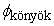
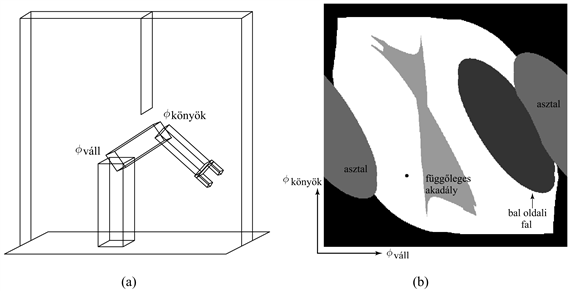
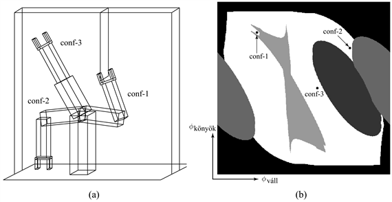
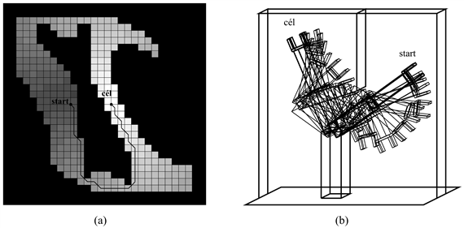
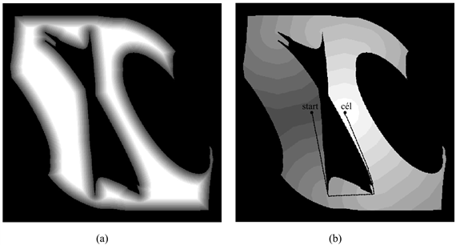
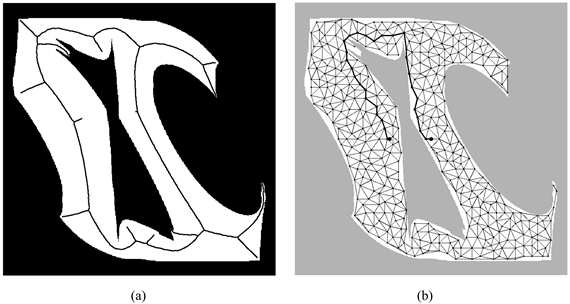

<?xml version="1.0" encoding="UTF-8" standalone="no"?>

<html xmlns="http://www.w3.org/1999/xhtml"><head><meta name="generator" content="DocBook XSL Stylesheets V1.76.1"/></head><body>

<h1 class="title"><a id="id793134"/>Mozgástervezés</h1>

A robotikában a döntések végül is a beavatkozó szervek mozgásában jutnak kifejezésre. A <strong>ponttól pontig mozgás</strong> (<strong>point-to-point motion</strong>) esetén a cél a robotnak vagy végbeavatkozó szervnek egy megadott helyre való eljuttatása. Nagyobb kihívást jelent a <strong>követő mozgás</strong> (<strong>compliant motion</strong>), amikor is a robot úgy mozog, hogy közben végig fizikai kontaktusban marad egy akadállyal. Példa erre, amikor egy robotkar becsavar egy égőt, vagy amikor végigtol az asztalon egy dobozt.

Azzal kell kezdenünk, hogy keresünk egy megfelelő reprezentációt, amely alkalmas a mozgástervezési problémák leírására és megoldására. Kiderül, hogy a <strong>konfigurációs tér</strong> (<strong>configuration space</strong>) – a robotállapotok tere, amelyet a pozíció, az orientáció és a csuklószögek definiálnak – alkalmasabb a feladatra, mint a 3D tér. A <strong>pályatervezés</strong> (<strong>path planning</strong>) azt jelenti, hogy meg kell találni az egyik konfigurációtól egy másikig vezető utat. A korábbi fejezetekben már számos úttervezési módszert vázoltunk fel. A robotikában az úttervezés legfőbb jellemvonása az, hogy <em>folytonos</em> terekkel dolgozik. A szakirodalom számos különböző technikát tart számon, amelyek kifejezetten olyan esetekre alkalmazhatók, ahol a cél útvonalak keresése sokdimenziós folytonos terekben. Két fő megközelítés létezik: a <strong>celladekompozíció</strong> (<strong>cell decompisition</strong>) és a <strong>szkeletonizáció </strong>(<strong>skeletonisation</strong>). Mindkettő diszkrét gráf keresési feladatra vezeti vissza és egyszerűsíti le a folytonos útkeresési problémát azáltal, hogy kanonikus állapotokat és pályákat ír le a folytonos térben. Ebben a fejezetben végig feltételezzük, hogy a mozgás determinisztikus, és a robot helybéli azonosítása egzakt. A későbbi fejezetek gyengíteni fogják ezeket a feltételezéseket.

<h2 class="title"><a id="id793203"/>Konfigurációs tér</h2>

A robotmozgási feladatok megoldásának első lépéseként a problémához ki kell találni egy megfelelő reprezentációt. Kezdjük egy egyszerű probléma egyszerű ábrázolásával. Vegyük a 25.12. (a) ábrán látható robotkart. Két csuklóval rendelkezik, amelyek egymástól függetlenül mozoghatnak. Ha a csuklókat mozgatjuk, megváltozik a könyök és a megfogó (<em>x</em>, <em>y</em>) koordinátája. (A kar <em>z</em> irányban nem képes elmozdulni.) Mindez azt sugallja, hogy a robot konfigurációi leírhatók egy négydimenziós koordináta-rendszerben, ahol: (<em>x</em>könyök, <em>y</em>könyök) jelenti a könyök relatív helyzetét a környezethez képest, míg (<em>x</em>megfogó, <em>y</em>megfogó) a megfogó helyzetét. Világos, hogy ez a négy koordináta leírja a robot összes lehetséges állapotát. Ezt a leírást <strong>munkatér-reprezentáció</strong>nak (<strong>workspace representaion</strong>) is nevezik, mivel a robot helyzetét ugyanabban a koordináta-rendszerben írjuk le, mint a mozgatni (vagy éppen elkerülni) kívánt tárgyakét. A munkatér-reprezentáció jól használható ütközés elkerülésre, különösen akkor, ha a tárgyakat egyszerű poligonokként modellezzük.

A munkatér-reprezentációval az a probléma, hogy a robot számára nem minden munkatér-koordináta érhető el, még akkor sem, ha nincsenek akadályok. Ez a munkatér elérhető koordinátáira vonatkozó <strong>összekapcsolási kényszer</strong>ek (<strong>linkage constrain</strong>s) miatt van. Például a könyök (<em>x</em>könyök, <em>y</em>könyök) és a megfogó (<em>x</em>megfogó, <em>y</em>megfogó) pozíciója egymástól mindig adott távolságra van, mert egy merev alkar kapcsolja őket össze. Ha a robotmozgás-tervezés munkatér-koordinátákban történik, akkor a generált útvonalaknak mindig meg kell felelniük ezeknek a kényszereknek. Ez azért különösen nehéz, mert az állapottér folytonos, a kényszerek pedig nemlineárisak.

Könnyebb a dolgunk, ha <strong>konfigurációs tér</strong>ben (<strong>configuration space</strong>) tervezünk. Ahelyett hogy Descartes-koordinátákkal írnánk le a robot helyzetét a térben, a csuklók konfigurációját vesszük figyelembe. A példában szereplő robotnak két csuklója van, így állapotát a két csukló állásával jellemezhetjük:  jelenti a vállcsukló szögét, míg  a könyökcsuklóét. Ha semmilyen akadály sincs a munkatérben, akkor a robot csuklói bármilyen értéket szabadon felvehetnek a konfigurációs térben. Sőt pályatervezés során a kiindulási és a célkonfiguráció egyszerűen összeköthető egy egyenessel. A robot ezt az egyenest követve konstans sebességgel mozgatja csuklóit, amíg el nem éri a kijelölt helyet.

Sajnálatos módon azonban a konfigurációs térnek is megvannak a maga problémái. A robot feladatai általában a munkatér koordinátáiban adottak, és nem a konfigurációs térében. Konkrétan például azt akarjuk, hogy a robot végberendezését a munkatérben egy adott pontra mozgassa, sőt esetleg még az orientáció is adott. Ez felveti azt a kérdést, hogy hogyan képezzük le a munkatér-koordinátákat a konfigurációs térbe. Általában ennek a problémának az inverze egyszerűbb, azaz könnyebben képezhetők le a konfigurációs tér koordinátái a munkatérbe, hiszen a probléma néhány egyértelmű koordináta-transzformációval megoldható. Ezek a transzformációk lineárisak transzlációs, és trigonometrikusak rotációs csuklók esetén. A transzformációk sorozatát <strong>kinematiká</strong>nak (<strong>kinematics</strong>) hívják. Ezzel a kifejezéssel már találkoztunk korábban, a mobil robotoknál.

<strong>Inverz kinematiká</strong>nak (<strong>inverse kinematics</strong>) hívják egy olyan robot konfigurációjának kiszámítását, ahol a robot beavatkozó szerveinek helyzete a munkatér koordinátáiban adott. Az inverz kinematikai számítások általában nehezek, különösen sok szabadságfokú robotok esetében. Sőt a megoldás ritkán egyértelmű. Példarobotunk esetében két különböző konfiguráció is létezik, amikor a megfogó ugyanazt a helyzetet veszi fel a munkatérben, mint ami a 25.12. ábrán látható.

Általában két szabadságfokú (2DOF) robotkar esetén az inverz kinematikai feladat megoldásainak száma nulla és kettő között van, bármilyen bemeneti munkatér-koordinátára. A legtöbb ipari robot esetén végtelen sok megoldás van. Ennek megértéséhez képzeljük el, hogy a példarobotunkhoz hozzáadunk még egy rotációs csuklót, aminek tengelye párhuzamos a meglévő csuklók egyikével. Így a legtöbb konfiguráció esetén szabadon tudjuk mozgatni a közbülső csuklókat, miközben a megfogó pozíciója nem változik (az orientációja azonban igen). Néhány további csuklóval (mennyivel?) megoldható, hogy a kart ugyanígy mozgatva az orientáció se változzon. Már láttunk erre példát, amikor letettük kezünket az asztalra, és mégis tudtuk mozgatni a könyökünket. A kéz pozíciójából adódó kinematikai korlátozások alapján még nem határozható meg egyértelműen az emberi könyök konfigurációja. Más szavakkal, a váll-kar együttes inverz kinematikai problémájára végtelen sok megoldás létezik.

<a id="id793344"/>
<strong>25.12. ábra - (a) Egy két szabadságfokú robotkar munkatere. A munkatér egy doboz, amiben egy lapos akadály lóg a mennyezetről. (b) Ugyanennek a robotnak a konfigurációs tere. A fehérrel jelzett terület jelenti azokat a konfigurációkat, ahol a robot nem ütközik össze semmivel. A pont az ábrán a robot bal oldali konfigurációját mutatja.</strong>

A másik probléma a konfigurációs térrel kapcsolatosan akkor merül fel, amikor akadályok is vannak a munkatérben. A 25.12. (a) ábrán látható esetben például számos ilyen akadály van; az egyik pont a robot munkaterének közepébe nyúlik bele. A munkatérben ezek az akadályok egyszerű geometriai formákként jelennek meg, különösen a robotikai tankönyvekben, ahol a poligonális akadályokra fókuszálnak. De hogyan néznek ki ezek a konfigurációs térben?

Példarobotunk konfigurációs terét mutatja a 25.12. (b) ábra a 25.12. (a) ábrán látható akadályok esetére. A konfigurációs teret két altérre bonthatjuk: azoknak a konfigurációknak a terére, amelyek elérhetők – ez a <strong>szabad tér</strong> (<strong>free space</strong>), illetve az elérhetetlen konfigurációk által alkotott térrészre, amit <strong>foglalt tér</strong>nek (<strong>occupied space</strong>) hívnak. A 25.12. (b) ábrán a fehér rész jelenti a szabad teret, míg az összes többi a foglalt tér. A különböző árnyalatok jelzik, hogy melyik akadályról is van szó: a szabad teret körbehatároló fekete részek jelentik azokat a konfigurációkat, amelyeknél a robot önmagával ütközik össze. Könnyű belátni, hogy a váll- és könyökcsuklók szélső állásai ezt eredményezik. A robot két oldalán lévő ovális részek az asztalnak felelnek meg, amin a robot áll. A harmadik ovális terület a bal oldali fal. Végezetül, a konfigurációs térben a legkülönösebb alakzat a robot mozgásterébe belelógó, egyszerű függőleges elem. Ennek igen különös alakja van, erősen nemlineáris, és helyenként még konkáv is. Egy kis képzelőerővel felismerhetjük a megfogó alakját a bal felső szélén. Szakítsunk egy kis időt ennek a fontos ábrának a tanulmányozására. Az alakzat egyáltalán nem nyilvánvaló! A 25.12. (b) ábrán a pont a robot 25.12. (a) ábrán lévő állapotának megfelelő konfigurációt mutatja. A 25.13. ábrán további három konfigurációt is láthatunk, mind a munkatérben, mind a konfigurációs térben. A „conf-1” állásban a megfogó megközelíti a középső akadályt.

A legtöbb esetben a szabad tér alakja nagyon bonyolult a konfigurációs térben, még akkor is, ha a munkateret egyszerű poligonokkal reprezentáljuk. Éppen ezért a gyakorlatban inkább <em>feltérképezik</em> a konfigurációs teret, semmint pontosan kiszámítják. A térképezés során generálnak egy konfigurációt, és megnézik, hogy az a szabad térben van-e. Ehhez alkalmazzák a robot kinematikáját, és annak alapján már látszik, ha az adott konfiguráció ütközéssel jár a munkatérben.

<a id="id793383"/>
<strong>25.13. ábra - Három különböző robotkonfiguráció a munkatérben és a konfigurációs térben</strong>

<h2 class="title"><a id="id793393"/>Celladekompozíciós módszerek</h2>

Első megközelítésben <strong>celladekompozíció</strong>t (<strong>cell decompisition</strong>) használunk pályatervezéshez, ami azt jelenti, hogy a szabad teret véges számú folytonos régióra, cellákra osztjuk fel. Fontos tulajdonsága ezeknek a régióknak, hogy a pályatervezés egyszerű módszerekkel megoldható egy-egy cellán belül (pl. egyenes vonalú mozgással). Ezután a pályakeresés diszkrét gráfkeresési problémává egyszerűsödik, nagyon hasonlóvá ahhoz, amit a 3. fejezetben már bemutattunk.

A legegyszerűbb celladekompozíció egy szabályos osztástávolságú rácsból áll. Ilyen négyzethálós dekompozíciót mutat be a 25.14. (a) ábra, az ehhez a sűrűségű felosztáshoz tartozó optimális útvonallal. Különböző árnyalatokat használtunk a szabad tér egyes celláihoz tartozó <em>értékek</em> jelölésére. Ez az érték mutathatja például, hogy milyen messze van az adott cella a céltól. (Kiszámításához használhatjuk a 17.4. ábrán ismertetett <code class="code">ÉRTÉKITERÁCIÓ</code> algoritmus egy determinisztikus változatát.) A 25.14. (b) ábrán látható a kar mozgása a munkatérben.

Az ilyen felbontásnak a nagyon könnyű megvalósíthatóság az előnye. Ugyanakkor, használatakor két korlátozás is él. Először is, csak kis dimenziójú munkaterek esetén működik, mert a cellák száma <em>d</em>-vel, a dimenziók számával exponenciálisan nő. Másodszor, felmerül a kérdés, hogy mit csináljuk azokkal a cellákkal, amelyek vegyesek, vagyis részben a szabad térhez, részben a foglalthoz tartoznak. Egy ilyen cellán keresztül menő megoldás nem feltétlenül működik, mert lehet, hogy az adott irányban nem lehet áthaladni a cellán. Ez az úttervezőt <em>bizonytalanná</em> tenné. Ugyanakkor, ha egyáltalán nem engedjük meg, hogy a pálya ilyen „vegyes” cellákon menjen keresztül, tervező algoritmusunk <em>hiányos</em> lesz. Előfordulhat, hogy az egyetlen lehetséges út a célhoz egy ilyen cellán megy át – különösen akkor, ha a cella mérete összehasonlítható a térközök és átjárók fizikai méretével.

<a id="id793432"/>
<strong>25.14. ábra - (a) A költségfüggvény és az előállított trajektória a konfigurációs térben, diszkrét hálós celladekompozíciós közelítés esetén. (b) Ugyanaz az útvonal a munkatérben ábrázolva. Érdemes megfigyelni, hogy a robot behajlítja a könyökét, hogy elkerülje a függőleges akadályt.</strong>

A fenti problémák elkerülése érdekében a celladekompozíciós módszeren kétféleképpen lehet javítani. Az első, ha megengedjük a vegyes cellák <em>tovább osztását</em> – mondjuk az eredeti méret felére. Ezt rekurzívan folytathatjuk, amíg nem találunk olyan utat, ami csak szabad térben lévő cellákon megy át. (Természetesen a módszer csak akkor működik, ha egy adott celláról egyértelműen el tudjuk dönteni, hogy vegyes-e. Ez viszonylag könnyű, ha a konfigurációs tér határai matematikailag egyszerűen leírhatók.) Akkor teljes a módszerünk, ha létezik korlát a legkeskenyebb átjáróra, amin az útvonal bejárható. Annak ellenére, hogy a konfigurációs téren belül alapvetően a bonyolultabb, trükkösebb részekre fókuszálódik a számítási igény, még mindig nem leszünk képesek sokdimenziós problémák kezelésére, mivel a cellák minden rekurzív újraosztása 2d kisebb cellát hoz létre. A másik megoldás során azzal tesszük teljessé az algoritmusunkat, hogy ragaszkodunk a szabad tér egy <strong>egzakt celladekompozíció</strong>jához (<strong>exact cell decom</strong><strong>position</strong>). Ez a módszer megengedi, hogy a cellák szabálytalan alakúak legyenek, de kizárólag a szabad tér határán. Az alakzatoknak viszonylag egyszerűeknek kell maradniuk, hogy könnyen meg lehessen határozni egy szabad cella átlóját. Ez a technika bizonyos magasabb szintű geometriai ismereteket igényel, ezért részletesebben nem tárgyaljuk.

Ha megvizsgáljuk azt a pályát, amit a 25.14. ábrán kaptunk, láthatjuk, hogy még további nehézségeket kell leküzdenünk. Először is, vegyük észre, hogy a pálya mentén nagyon éles kanyarok vannak. A robot bármilyen véges sebesességgel mozog, nem tudja ezeket „bevenni”. Másodszor, az út helyenként nagyon közel halad el az akadályok mellett. Mindenki, aki már vezetett autót, tudja, hogy egy olyan parkolóhely, ahol csak egy-egy milliméter szabad hely van mindkét oldalon, valójában nem is parkolóhely. Éppen ezért olyan megoldásokra törekszünk, amelyek robusztusak a kis mozgási hibákra nézve.

<a id="id793467"/>
<strong>25.15. ábra - (a) A taszító potenciáltér távol tartja a robotot az akadályoktól. (b) A megoldásként kapott pálya, ha egyszerre minimalizáljuk az úthosszt és a potenciálfüggvényt.</strong>

Szeretnénk maximalizálni az útvonal távolságát az akadályoktól, ugyanakkor minimalizálni annak hosszát. Mindezt a <strong>potenciáltér</strong> (<strong>potential field</strong>) módszer bevezetésével érhetjük el. A potenciáltér az állapottérben definiált függvény, amely nagy értéket vesz fel bármely akadály közelében, és attól távolodva egyre csökken. Ilyen potenciáltér látható a 25.15. (a) ábrán: minél sötétebbre van színezve a konfigurációs tér, annál közelebb van egy akadályhoz. Pályatervezéshez használva a potenciáltér még egy költségfüggvényt jelent az optimalizálás során. Ez érdekes kompromisszumot rejt magában. Egyfelől a robot igyekszik lerövidíteni az út hosszát a célig, másfelől próbál minél távolabb maradni az akadályoktól, azáltal hogy minimalizálja a potenciálfüggvényt. A két szempontot megfelelően súlyozva az eredmény a 25.15. (b) ábrán látható pályához hasonló lesz. Az ábra az egyesített költségfüggvényből értékiterációval számított értékfüggvényt is mutatja. Világos, hogy az így kapott megoldási útvonal hosszabb, viszont biztonságosabb.

<h2 class="title"><a id="id793489"/>Szkeletonizációs módszerek</h2>

Az útkereső algoritmusok másik fő csoportja a <strong>szkeletonizálás</strong> (<strong>skeletonization</strong>) elvén alapul. Ezek a módszerek a robot szabad terének egydimenziós leképezésével dolgoznak, amely alapján a tervezési probléma már könnyebben megoldható. Ezt az alacsonyabb dimenziójú reprezentációt hívják a konfigurációs tér <strong>váz</strong>ának (<strong>skeleton</strong>).

A 25.16. ábrán a szkeletonizációra látható egy példa: a szabad tér <strong>Voronoi-gráf</strong>ja (<strong>Voronoi graph</strong>) azokból a pontokból áll, amelyek kettő vagy több akadálytól egyenlő távolságra vannak. Ahhoz, hogy a pályatervezéshez a Voronoi-gráfot lehessen használni, a robotnak először is meg kell változtatnia aktuális konfigurációját úgy, hogy rajta legyen a gráfon. Könnyen belátható, hogy a konfigurációs térben ez mindig megoldható egyenes vonalú mozgással. Ezután a robot a gráf mentén halad mindaddig, amíg el nem éri a célkonfigurációhoz legközelebb eső pontot. Ekkor elhagyja a Voronoi-gráfot, és elmegy a célig. A konfigurációs térben ez egyenes vonalú mozgással ismét megvalósítható.

<a id="id793527"/>
<strong>25.16. ábra - (a) A Voronoi-diagram azon pontok halmaza a konfigurációs térben, amelyek egyenlő távolságra vannak két vagy több akadálytól. (b) A szabad tér 400 véletlenszerűen kiválasztott pontjából felépített valószínűségi úthálózat.</strong>

Ilyen módon az eredeti útkeresési feladatot a Voronoi-gráfon lévő útvonal megtalálására redukáltuk. A Voronoi-gráf (néhány különleges esetet leszámítva) egydimenziós, és véges sok olyan pontja van, ahol három vagy több görbe metszi egymást. Így azon a legrövidebb út megtalálása egy diszkrét gráfkeresési probléma, amilyet a 3. és 4. fejezetekben már tárgyaltunk. Ha a Voronoi-gráf mentén haladunk, akkor nem a legrövidebb utat kapjuk, de az egyik legbiztonságosabbat. A hátránya ennek a módszernek, hogy nehéz többdimenziós konfigurációs terekre alkalmazni, és sokszor túl nagy kitérőket tesz, főleg ha a szabad tér nagyon tág. Ezenfelül a Voronoi-diagram számítása bonyolult lehet a konfigurációs térben, különösen ahol az akadályok alakja nagyon összetett.

Alternatívát jelent a Voronoi-diagramokkal szemben a <strong>valószínűségi úthálózat</strong> (<strong>probabilistic roadmap</strong>) módszere. Ez a szkeletonizációs technika több lehetséges útvonallal dolgozik, így jobb megoldást jelent nagy, nyitott terek esetén. A valószínűségi úthálózatra látható példa a 25.16. (b) ábrán. A gráfot véletlenszerűen generált, a szabad térbe eső, nagyszámú konfiguráció alkotja. Ezek után két csomópontot összekötünk egy éllel, amennyiben „könnyű” eljutni egyikből a másikba. Alapvetően egyenes élekkel dolgozunk, és azok természetesen csakis a szabad térben futhatnak. Eredményül egy véletlenszerű gráfot kapunk a robot szabad terében. Ha ehhez még hozzávesszük a kezdeti és a célkonfigurációt, az útkeresés diszkrét gráfkeresési problémává válik. Elméletileg a módszer nem teljes, mivel rosszul felvett ponthalmazzal lehet, hogy soha nem találunk megoldást. A felvett pontok száma és a konfigurációs tér alakja alapján korlátozhatjuk a kudarc valószínűségét. Azt is megtehetjük, hogy főként azon a területen generálunk pontokat, ahol egy előzetes, mindkét végpontból lefuttatott részleges keresés alapján sejtjük, hogy a helyes út visz majd. Ezekkel a kiegészítésekkel a valószínűségi úthálózat módszere jobban használható más technikáknál magasabb dimenziójú konfigurációs terek esetében is.

</body></html>
