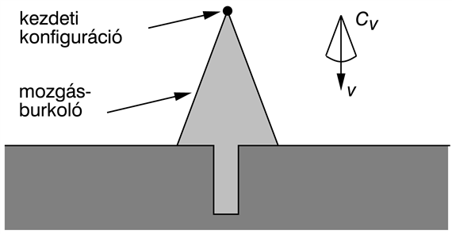
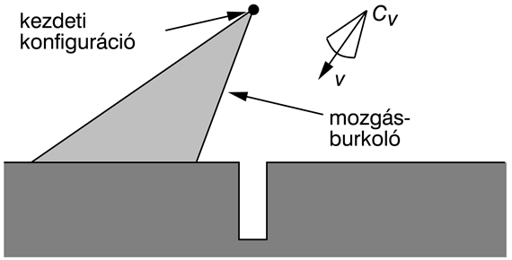
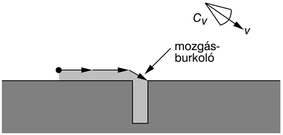

<?xml version="1.0" encoding="UTF-8" standalone="no"?>
<!DOCTYPE html PUBLIC "-//W3C//DTD XHTML 1.1//EN" "http://www.w3.org/TR/xhtml11/DTD/xhtml11.dtd">
<html xmlns="http://www.w3.org/1999/xhtml"><head><meta name="generator" content="DocBook XSL Stylesheets V1.76.1"/></head><body>

<h1 class="title"><a id="id793552"/>Bizonytalan mozgások tervezése</h1>

Az eddig tárgyalt pályatervezési algoritmusok közül egyik sem foglalkozott a robotika egyik központi problémájával: a <em>bizonytalansággal</em>. A robotikában a bizonytalanság a környezet részleges megfigyelhetőségéből és a robot mozgásának sztochasztikus (vagy nem modellezett) összetevőiből ered. Hibát okozhat az is, ha valamilyen közelítéses módszert, például részecskeszűrést használunk. Ilyen esetekben a robotnak nincs pontos információja a helyzetéről, még akkor sem, ha a környezet sztochasztikus vonásait tökéletesen modelleztük.

A legtöbb mai robot a döntéshozatalhoz determinisztikus algoritmusokat használ, mint például az eddig tárgyalt útkereső algoritmusokat. Gyakori megoldás, hogy a helymeghatározó algoritmus által előállított állapoteloszlásból a <strong>legvalószínűbb állapot</strong>ot (<strong>most likely state</strong>) választják ki. Ennek a módszernek az előnye a számítások során mutatkozik meg. A pályatervezés már a konfigurációs térben is kihívás, és még nehezebb lenne, ha az állapotok teljes valószínűség-eloszlásával kellene dolgoznunk. Csak akkor tehetjük meg, hogy nem veszünk tudomást a bizonytalansági tényezőről, ha az kellően kicsi.

Sajnálatos módon azonban nem hagyhatjuk mindig figyelmen kívül a bizonytalanságot. Egyes problémák esetén egyszerűen túlságosan nagy! Hogyan is használhatnánk determinisztikus pályatervezést egy mobil robot irányításához, ha fogalma sincs a robotnak arról, hogy hol van? Általában, ha a robot valódi állapota nem egyezik meg a maximális valószínűségi szabály által számítottal, akkor az irányító algoritmus nem lesz optimális. Az eltérés nagyságától függően ez egy sor nem kívánatos eseményt idézhet elő, például ütközést más tárgyakkal.

A robotikában számos technikát dolgoztak ki a bizonytalanság kezelésére. Néhányuk a 17. fejezetben tárgyalt bizonytalansági döntéshozó algoritmusokból ered. Ha a robotnak csak az állapotátmenetek kapcsán kell bizonytalansággal számolnia, máskülönben állapota teljesen megfigyelhető, akkor a problémát legjobban a <strong>Markov döntési folyamat</strong>tal (<strong>MDF</strong>) lehet modellezni. Az MDF által adott megoldás optimális <strong>eljárásmód</strong> (<strong>policy</strong>), amely minden lehetséges állapotban megmondja a robotnak, hogy mit csináljon. Ezzel a módszerrel képes bármiféle mozgási hiba kezelésére, ahol a determinisztikus úttervező egyetlen megoldása sokkal kevésbé lenne robusztus. Robotikában a stratégiákat általában <strong>navigációs függvény</strong>eknek (<strong>navigation function</strong>s) hívják. A 25.14. (a) ábrán bemutatott értékfüggvény könnyen átalakítható ilyen navigációs függvénnyé, ha egyszerűen követjük a gradienst.

Csakúgy, mint a 17. fejezetben, a részleges megfigyelhetőség itt is tovább nehezíti a problémát. Az így keletkező robotirányítási problémát a <strong>részlegesen megfigyelhető MDF</strong>-fel (<strong>RMMDF</strong>) modellezzük. Ilyen esetekben a robotnak általában van egy belső képe az állapotáról, ahogy azt már a 25.3. alfejezetben megtárgyaltuk. Az RMMDF-re a megoldás a robot belső állapotán definiált stratégia. Másképp megfogalmazva, a stratégia bemenete egy teljes valószínűség-eloszlás. Ez a robot számára lehetővé teszi, hogy ne csak az alapján tudjon döntést hozni, amit tud, hanem azt is felhasználhassa, amit nem tud. Például ha nem ismeri egy kritikus állapotváltozó értékét, akkor ésszerűen <strong>információgyűjtés</strong>t (<strong>information gathering</strong>) fog végrehajtani. Az MDF keretein belül erre van lehetőség, mivel az MDF teljes megfigyelhetőséget feltételez. Sajnálatos módon azok a technikák, amelyek az RMMDF-eket pontosan megoldják, nem alkalmazhatók a robotikában, minthogy nem ismeretes folytonos idejű változatuk. A diszkretizálás általában olyan hatalmas méterű RMMDF-eket eredményez, amelyek messze meghaladják a mai eszközök feldolgozási kapacitását. Jelen esetben a legtöbb, amit tehetünk, hogy megpróbáljuk a helyzet bizonytalanságát minimumra csökkenteni. A <strong>tárgy menti navigálás</strong> (<strong>coastal navigation</strong>) heurisztikus módszerével például jól csökkenthető a pozíció ismeretének bizonytalansága, ha a robot végig ismert referenciapontok közelében halad. Ugyanakkor fokozatosan csökkenti más, közeli referenciapontok helyzetének bizonytalanságát is, ami aztán lehetővé teszi a robot számára, hogy újabb területeket térképezzen fel.

<h2 class="title"><a id="id793640"/>Robusztus módszerek</h2>

Valószínűségi módszerek helyett kezelhetjük a bizonytalanságot úgynevezett <strong>robusztus</strong> (<strong>robust</strong>) módszerekkel is. A robusztus módszer csak <em>korlátozott</em> mértékű bizonytalanságot enged meg a probléma minden egyes paraméterével szemben, ugyanakkor nem társít valószínűségeket az egyes értékekhez a megengedett határon belül. A robusztus megoldás a bemeneti értékektől függetlenül megfelelően működik mindaddig, amíg azok nem lépnek át egy határt. A robusztus módszerek egy extrém formája a 12. fejezetben tárgyalt <strong>alkalmazkodó tervezés</strong> (<strong>conformant planning</strong>), ami úgy alakít ki terveket, hogy egyáltalán nincs információja az állapotról.

Itt egy olyan robusztus technikát ismertetünk, amelyet összeszerelési feladatoknál <strong>finom mozgások tervezésé</strong>re (<strong>FMT</strong>; <strong>fine motion planning</strong>) használnak. FMT-re például akkor van szükség, amikor egy robotkart egy nagy, merev tárgyhoz nagyon közel kell mozgatni. A fő probléma az FMT-vel az, hogy a környezet kisméretű, lényeges elemeivel kell dolgozni, nagyon apró mozdulatokkal. Ilyen kis lépték esetén a robot már képtelen pontosan mérni vagy irányítani pozícióját, sőt adott esetben még a környezet alakjáról sincs pontos képe. Feltételezzük, hogy ezek a bizonytalanságok mind korlátosak. Az FMT-problémákra a megoldást legtöbbször feltételes tervek és irányelvek kidolgozása jelenti, amelyek a végrehajtás közben visszacsatolásként használják a szenzorok adatait, és a megadott bizonytalansági korlátokon belül minden esetben megbízhatóan működnek.

Az FMT-k <strong>felügyelt mozgás</strong>ok (<strong>guarded motion</strong>) sorából tevődnek össze. Minden egyes felügyelt mozdulat (1) egy mozgásparancsból és egy (2) leállási feltételből áll, ami a robot szenzorainak adatain alapul. A folyamat igaz értékkel tér vissza, ha sikeresen befejeződött a felügyelt mozgás. A mozgásutasítások jellemzően engedékeny, azaz <strong>önbeálló mozgás</strong>ok (<strong>compliant motion</strong>), amelyek lehetővé teszik, hogy a robot kitérjen, ha az utasítás végrehajtása ütközést eredményezne. A 25.17. ábrán látható példa egy kétdimenziós konfigurációs teret mutat, középen egy szűk, függőleges lyukkal. Ez egy olyan feladat konfigurációs tere lehetne, amikor egy szögletes csapot kell beilleszteni egy nála alig szélesebb lyukba. A mozgásutasítások konstans sebességeket írnak elő. A leállási feltétel a felülettel történő érintkezés. A vezérlés bizonytalanságának modellezésénél feltételezzük, hogy a robot nem pontosan az utasításban megadott irányba mozdul el, hanem a körül egy <em>Cv </em>kúpon belül, tetszőlegesen. A 25.17. ábra azt mutatja, mi történne, ha adott sebességgel elindítanánk a műveletet az <em>s</em> kezdőpontból. A mozgás bizonytalansága miatt a robot a szürke területen belül bárhova megérkezhet a felülethez. Van rá esély, hogy beletalál a lyukba, de nagyobb valószínűséggel valamelyik oldalán áll meg. Mivel a robot nem fogja tudni, hogy a lyuk melyik oldalán van, ezért azt sem fogja tudni, hogy merre mozduljon.

<a id="id793718"/>
<strong>25.17. ábra - Egy kétdimenziós környezet, a sebesség vektor bizonytalanságát ábrázoló kúppal. A vezérlés bizonytalansága miatt az eredeti szándéknak megfelelő <em>v</em> sebesség valójában bármilyen vektor lehet a <em>Cv</em> kúpon belül. Ennek eredményeképpen a robot végső konfigurációja bárhol lehet a burkolón (a világosabban árnyalt területen), azaz nem tudjuk, hogy eljutottunk-e a lyukba, vagy sem.</strong>

Egy kifinomultabb stratégia látható a 25.18. és a 25.19. ábrán. A 25.18. ábra esetében a robot szándékosan a lyuknak az egyik oldala felé mozog. Az ábrán látható a mozgásparancs és a leállás feltétele: valamely felülettel való érintkezés. A 25.19. ábrán olyan a mozgásparancs, hogy a robot a felület mentén mozdul el, míg bele nem talál a lyukba. Ez önbeálló mozgásvezérlés alkalmazását tételezi fel. Mivel a mozgás iránya (a bizonytalansággal együtt is) jobbra mutat, a robot mindig jobbra fog csúszni, valahányszor érintkezésbe kerül a vízszintes felülettel. Amikor eléri a lyukat, lecsúszik annak jobb oldali széle mentén, mivel a függőleges felülethez képest valamennyi lehetséges vektor lefelé mutat. Addig fog mozogni, amíg el nem éri a lyuk alját, mivel ez számára a leállási feltétel. A vezérlés bizonytalansága ellenére a robot valamennyi lehetséges pályája a lyuk aljával történő érintkezésnél ér véget. Mindenképpen ez történik, hacsak a felület szabálytalanságai miatt a robot valahol meg nem akad.

Láthatjuk, hogy a finom mozgások <em>tervezése</em> nem triviális; valójában sokkal nehezebb, mint a pontos mozgások tervezése. Vagy minden egyes mozgáshoz rögzített számú diszkrét értéket választunk, vagy a környezet geometriáját használjuk fel azon irányok megállapításához, amelyek minőségileg különböző viselkedést eredményeznek. A finommozgás-tervező a konfigurációs tér leírását, a sebességbizonytalansági kúp szögét és azt a specifikációt tekinti inputnak, amely megadja a lehetséges leállásifeltétel-érzékeléseket (ebben az esetben a felülettel való érintkezést). Az eredménynek egy olyan többlépéses feltételes tervnek vagy stratégiának kell lennie, ami garantálja a sikert, ha egyáltalán létezik ilyen terv.

Példánkban feltételezzük, hogy a tervezőnek pontos képe van a környezetről, de korlátos hiba is bevezethető a modellbe a következők szerint: amennyiben a hibák paraméterekkel leírhatók, úgy azok a paraméterek szabadságfokok formájában hozzáadhatók a konfigurációs térhez.

<a id="id793748"/>
<strong>25.18. ábra - Az első mozgásparancs és a lehetséges robotmozgások burkolója. A hibától függetlenül tudjuk, hogy a végső konfiguráció a lyuk bal oldalán lesz.</strong>

<a id="id793758"/>
<strong>25.19. ábra - A második mozgásparancs és a lehetséges mozgások. Még hibák esetén is végül bele fogunk találni a lyukba.</strong>

Az utolsó példában, amennyiben a lyuk mélysége és szélessége bizonytalan, úgy ezeket újabb két szabadságfok formájában hozzávehetjük a konfigurációs térhez. Az nem lehetséges, hogy a robotot ezekbe az irányokba elmozdítsuk a konfigurációs térben, és a robot pozícióját sem tudjuk közvetlenül érzékelni. Azonban mindkét korlátozást figyelembe vehetjük, amikor ezt egy FMT-problémaként írjuk le, megfelelően specifikálva a vezérlés és az érzékelés bizonytalanságait. Ez egy összetett, négydimenziós tervezési problémához vezet, azonban azonos tervezési technikák alkalmazhatók. Megjegyezzük, hogy a 17. fejezetben ismertetett döntéselméleti módszerektől eltérően ez a fajta megközelítés a legrosszabb esetre vonatkozó terveket eredményezi ahelyett, hogy a terv várható minőségét maximalizálná. A legrosszabb esetre vonatkozó tervek döntéselméleti értelemben csak akkor optimálisak, ha a végrehajtás közbeni kudarc sokkal költségesebb, mint bármely más, a végrehajtás során felmerülő költség.

</body></html>
