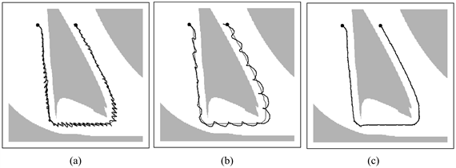
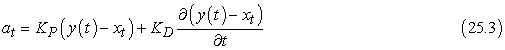
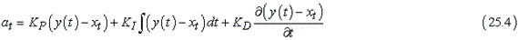
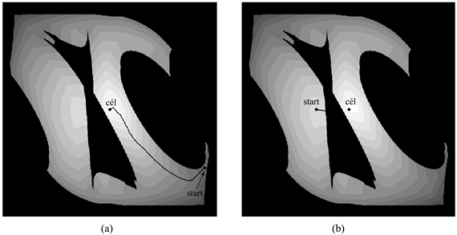
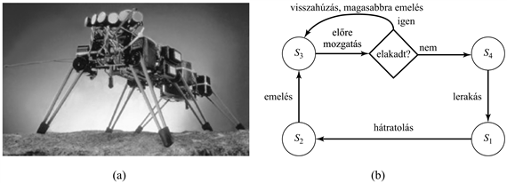

<?xml version="1.0" encoding="UTF-8" standalone="no"?>
<!DOCTYPE html PUBLIC "-//W3C//DTD XHTML 1.1//EN" "http://www.w3.org/TR/xhtml11/DTD/xhtml11.dtd">
<html xmlns="http://www.w3.org/1999/xhtml"><head><meta name="generator" content="DocBook XSL Stylesheets V1.76.1"/></head><body>

<h1 class="title"><a id="id793770"/>Mozgás</h1>

Beszéltünk már arról, hogyan <em>tervezzük </em>meg a mozgást, de arról nem, hogy hogyan <em>mozogjunk</em>. Az eddigi terveink – különösen azok, amelyeket determinisztikus pályatervezővel állítottunk elő – feltételezik, hogy a robot egyszerűen képes követni bármilyen megtervezett pályát. A valóságban természetesen nem ez a helyzet. A robotoknak van tehetetlenségük, ezért nem tudnak tetszőleges pályát követni, csak nagyon kis sebesség esetén. A legtöbbször erőt kell kifejtenie a robotnak, nem pedig meghatározott pozícióba eljutnia. Ez a fejezet azokról a módszerekről szól, amelyekkel ki lehet számítani ezeket az erőket.

<a id="id793783"/>
<strong>25.20. ábra - Robotkarvezérlés (a) egységnyi erősítésű arányos szabályozóval; (b) 0,1-es erősítési tényezőjű arányos szabályozóval; (c) PD szabályozóval, 0,3-as erősítésű arányos taggal és 0,8-as differenciáló komponenssel. Mindhárom esetben a robotkar a szürkével jelölt pályát próbálta követni.</strong>

<h2 class="title"><a id="id793792"/>Dinamika és vezérlés</h2>

A 25.2. alfejezetben már megismerkedtünk a <strong>dinamikus állapot</strong> (<strong>dynamic state</strong>) fogalmával, amely a robot sebességmodelljével kiterjeszti a robot kinematikai állapotát. Például egy csukló szögének értéke mellett a dinamika magában foglalja a szög változási sebességet is. A dinamikai állapot reprezentálására szolgáló állapotátmenet-modell tartalmazza az erők erre a változási sebességre gyakorolt hatását. Ezek a modellek általában <strong>differenciálegyenletek</strong>et (<strong>differential equations</strong>) használnak, amelyek egy kinematikai mennyiséget (például egy kinematikai állapotot) viszonyítanak annak időbeli megváltozásához (például a sebességhez) is. Elvileg a mozgástervezéshez a kinematikai helyett dinamikai modellt is használhattunk volna. Ez a metodika magasabb szintű teljesítményt eredményezne a robotnál, ha egyáltalán meg tudnánk alkotni a terveket. Azonban a dinamikai állapot sokkal bonyolultabb a kinematikainál. A dimenziók magas száma miatt ezt a módszert csak a legegyszerűbb robotok esetében lehetne sikeresen alkalmazni. Éppen ezért a gyakorlatban leginkább az egyszerűbb kinematikai pályatervező algoritmusokra hagyatkoznak.

A kinematikai pályatervező algoritmusok hiányosságainak kompenzálására gyakran használnak különálló <strong>szabályozó</strong>kat (<strong>controller</strong>s), hogy pontosan a pályán tartsák a robotot. Szabályozók segítségével a környezetből vett visszacsatolással valós időben generálhatók a vezérlőjelek az irányítási célok eléréséhez. <strong>Referenciaszabályozó</strong>ról (<strong>reference controller</strong>) beszélünk, ha az a feladat, hogy a robot egy előre kitűzött pályán maradjon – ezt hívják <strong>referenciapályá</strong>nak (<strong>reference path</strong>). Azokat a szabályozókat, amelyek globális költségfüggvényeket optimalizálnak, <strong>optimális szabályozó</strong>knak (<strong>optimal controller</strong>s) hívjuk. Az optimális stratégiák az MDF-ek számára valójában optimális szabályozók.

Első ránézésre egyszerűnek tűnik az a feladat, hogy adott pályán tartsuk a robotot. A gyakorlatban azonban még ennek a látszólag könnyű feladatnak is vannak buktatói. A 25.20. (a) ábrán láthatjuk, hogy mik adódhatnak. A fekete vonal a robot által befutott út, ahogy próbálja a kinematikai pályát követni. Ha eltérés keletkezik – zaj vagy a robot mozgása során fellépő erőkre vonatkozó korlátozások miatt –, a robot ellenkező irányú, az eltéréssel arányos nagyságú erővel igyekszik azt kompenzálni. Elsőre ez a megoldás kézenfekvőnek tűnik, mivel az eltéréseket ellenerőkkel kompenzáljuk, így a robot a pályán marad. Ugyanakkor mindez azt eredményezi, hogy robotunk erőteljesen vibrálni kezd, ahogy az a 25.20. (a) ábrán is látszik. Ez a vibráció a robotkar természetes tehetetlenségéből következik: amikor a robot visszaér a referenciapálya adott pontjára, túllendül, ami a korábbihoz hasonló, de ellentétes előjelű hibát eredményez. Ahogy az ábrán is látható, ez a fajta túllendülés akár az egész trajektória mentén folytatódhat, és az eredményül kapott mozgás nem éppen ideális. Világos, hogy jobb szabályozásra van szükség.

Mielőtt rátérnénk a megfelelőbb szabályozásra, formálisan írjuk le a túllendülést okozó szabályozót. Azokat a szabályozókat, amelyek ellentétes irányú, arányos erővel reagálnak a megfigyelt hibára <strong>P szabályozó</strong>nak (<strong>P controller</strong>) hívjuk. A P betű <em>arányosat</em> <em>(proportional)</em> jelent: a pillanatnyi vezérlés mindig arányos a robotkar hibájával. Még formálisabban kifejezve: legyen <em>y</em>(<em>t</em>) a referenciapálya idő (<em>t</em>) szerint paraméterezve. A P szabályozó által generált <em>at </em>vezérlőjel:

<code class="code"><em>at</em> = <em>KP</em>(<em>y</em>(<em>t</em>) – <em>xt</em>)</code>

ahol <em>Xt</em> a robotkar <em>t</em> időpontbeli állapota. <em>KP</em> a szabályozó úgynevezett <strong>erősítési tényező</strong>je (<strong>gain parameter</strong>), ami azt határozza meg, hogy milyen hevesen reagál a szabályozó az aktuális <em>xt</em> állapot és a kívánt <em>y</em>(<em>t</em>) között lévő eltérésre. A példánkban <em>KP = </em>1. Első pillantásra azt gondolhatja valaki, hogy ha <em>KP</em>-t kis értékűre választjuk, akkor az megoldja a problémát. Sajnos nem így van. A 25.20. (b) ábrán látható <em>KP = </em>0,1 esetben a trajektória, amely továbbra is oszcillál. A kisebb erősítési tényező csak lelassította az oszcillációt, de egyáltalán nem oldotta meg a problémát. Ha elhanyagoljuk a súrlódást, a P szabályozó tulajdonképpen egy rugó, és a végtelenségig oszcillál a rögzített egyensúlyi pont körül.

Hagyományosan az ilyen problémákat az <strong>irányításelmélet</strong> (<strong>control theory</strong>) tárgykörébe sorolják. Ennek a tudományágnak egyre nagyobb a jelentősége a mesterséges intelligenciával foglalkozó kutatók számára. Évtizedek kutatásai során számos olyan szabályozót alkottak meg, amelyek lényegesen bonyolultabbak a fent használt egyszerű szabályozónál. Egy referenciaszabályozó <strong>stabil </strong>(<strong>stable</strong>), ha kis megváltozások csak korlátos hibát eredményeznek a referenciajelhez képest. <strong>Szigorúan stabil</strong> (<strong>strictly stable</strong>), ha a robot a kis megváltozások ellenére is vissza tud térni a referenciapályára. Látható, hogy a P szabályozónk stabil, de nem szigorúan stabil, mivel képtelen visszatérni a referenciatrajektóriára.

A legegyszerűbb szabályozó, ami eleget tesz a szigorú stabilitás követelményeinek a mi esetünkben a <strong>PD szabályozó</strong> (<strong>PD controller</strong>). A P betű továbbra is az arányosat jelöli, míg a D a <em>differenciálót</em>. A PD szabályozót az alábbi egyenlet írja le:

Ahogy az már a képletből is látszik, a PD szabályozó egy differenciális taggal egészíti ki a P szabályozót, ami az <em>at</em>-t egy olyan taggal bővíti, ami arányos az <em>y</em>(<em>t</em>) <em>–</em> <em>xt</em> hiba idő szerinti első deriváltjával. Mi a hatása egy ilyen új tagnak? Általában a derivátor csillapítja a szabályozott rendszert. Tegyük fel, hogy egy adott rendszerben időben gyorsan változik az (<em>y</em>(<em>t</em>) <em>–</em> <em>xt</em>) hiba, mint ahogyan a fentebb tárgyalt esetben is. A differenciális tag ilyenkor az arányos ellenében hat, és összességében csökkenteni fogja a változásra történő reakciót. Ugyanakkor, ha a hiba állandósul, a differenciális tag háttérbe szorul, és az arányos tag fogja meghatározni a szabályozást.

PD szabályozót használva <em>KP</em> = 0,3 és <em>KD</em> = 0,8 paraméterekkel a 25.20. (c) ábrán lévő trajektóriát kapjuk. A pálya sokkal simább, és nem látható oszcilláció sem. Ahogy a példa is mutatja, egy differenciáló tag stabillá tehet egy szabályozót, amely enélkül nem az.

A gyakorlatban a PD szabályozónak is lehetnek hibái. Van úgy, hogy a PD szabályozó akkor sem tudja nullára redukálni a hibát, ha a külső eltérítés megszűnik. Ez a példánkból nem nyilvánvaló, de néha szükség van egy másik visszacsatolásra is az arányoson felül, hogy a hibát meg lehessen szüntetni. A megoldás erre a problémára egy harmadik tag hozzáadása a szabályozáshoz, ami a hiba idő szerinti integrálján alapul:

<em>KI</em> egy újabb erősítési tényező. A kifejezés kiszámítja a hiba idő szerinti integrálját. Ennek hatására a referenciajel és az aktuális állapot között hosszan fennálló eltérés megszűnik. Például ha <em>xt</em> hosszabb ideig kisebb, mint <em>y</em>(<em>t</em>), akkor az integrál addig fog nőni, amíg az <em>at</em> el nem tünteti a hibát. Az integrátor biztosítja, hogy a szabályozónak ne legyen rendszeres hibája, azon az áron, hogy nő az oszcilláció veszélye. <strong>PID szabályozó</strong>nak (<strong>PID controller</strong>) hívjuk azt a szabályozót, amelyik mindhárom tagot tartalmazza. Széles körben használják különböző ipari alkalmazásokhoz és irányítási feladatokhoz.

<h2 class="title"><a id="id794148"/>Potenciáltér-vezérlés</h2>

A potenciáltereket mint újabb költségfüggvényeket vezettük be a robotmozgás-tervezés során, de alkalmasak arra is, hogy közvetlenül generálják a robot mozgását, kiegészítve a pályatervezési fázist. Ahhoz, hogy ezt elérjük, definiálnunk kell egy vonzó erőt, ami a robotot a célkonfiguráció felé vonzza, valamint egy taszító potenciálteret, amely távol tartja az akadályoktól. Egy ilyen teret már bemutattunk a 25.21. ábrán. Az egyetlen globális minimumhelye a célkonfiguráció, értéke pedig az e céltól való távolság, valamint az akadályok közelségének összege. Az ábrán bemutatott potenciáltér kialakítását nem előzte meg tervezés. Éppen ezért a potenciálterek jól alkalmazhatók valós idejű megoldásokhoz. A 25.21. ábrán két trajektória látható, ahogy egy robot két különböző kezdeti konfigurációból megpróbálja megmászni a potenciálteret. Nagyon sok alkalmazás esetén a potenciálteret hatékonyan ki lehet számítani bármilyen adott konfiguráció esetében. Sőt adott robotkonfiguráció esetén a potenciálok kialakulásával a potenciálgradienst is meghatározhatjuk. Ezek a számítások általában különösen hatékonyak, főleg a pályatervező algoritmusokhoz hasonlítva, amelyek mind exponenciálisak a konfigurációs tér dimenziójában (a szabadságfokokban).

<a id="id794154"/>
<strong>25.21. ábra - Potenciáltér-vezérlés. A robot egy potenciáltérben halad, amely az akadályoktól taszító erőkből és a célkonfigurációhoz vonzókból áll. (a) Sikeres útvonal. (b) Lokális optimum.</strong>

Az a tény, hogy a potenciálteres módszer ilyen hatékonyan megtalálja az utat a célhoz a konfigurációs térben még nagy távolságok esetén is, megkérdőjelezi a tervezés szükségességét. Vajon csak szerencsénk volt a példánk esetében, vagy tényleg elegendő a potenciálterek használata? A válasz az, hogy szerencsénk volt. A potenciáltereknek számos olyan lokális minimumhelye lehet, amely csapdába ejti a robotot. Ebben az esetben a robot úgy közelíti meg az akadályt, hogy csak vállcsuklóját mozgatja egészen addig, amíg bele nem ütközik az akadályba a rossz oldalon. A potenciáltér nem ad annyi információt, hogy a robot behajlítsa a könyökét, hogy átférjen az akadály alatt. Más szavakkal, a potenciáltéren alapuló technikák nagyon jók lokális robotirányításra, de globális tervezést igényelnek. A másik hátulütője ennek a módszernek az, hogy az erők, amiket generál, csak az akadályoktól és a céltól való távolságtól függnek, nem veszik figyelembe a robot sebességét. Így a potenciáltér-alapú vezérlés tényleg egy kinematikai módszer, és nem feltétlenül működik, ha a robot gyorsan mozog.

<h2 class="title"><a id="id794166"/>Reaktív irányítás</h2>

Eddig olyan irányítási módszerekkel foglalkoztunk, amelyek megkívánták a környezet bizonyos fokú ismeretét ahhoz, hogy akár referenciapályát, akár potenciálteret alkothassunk. Ezzel a megközelítéssel kapcsolatban azonban felmerülnek bizonyos problémák. Először is, sokszor nagyon nehéz pontos modellt alkotni a környezetről, különösen ha az komplex vagy nagyon távol van, mint mondjuk a Mars felszíne. Másodszor, még ha sikerül is pontos modellt készítenünk, a számítási nehézségek és a lokalizációs technikák hibája folytán alkalmazhatatlanná válnak ezek a módszerek. Bizonyos esetekben megfelelőbb a reflexszerű ágensek használata, ezt hívják <strong>reaktív irányítás</strong>nak (<strong>reactive control</strong>).

Erre példa a 25.22. (a) ábra <strong>hexapod</strong>ja, azaz hatlábú robotja, amelyet nehéz terepen való közlekedésre terveztek. A robot szenzorai többnyire alkalmatlanok arra, hogy megfelelő pontosságú modellt alkossanak a környezetről, hogy a robot a korábban tárgyalt pályatervezési algoritmusok bármelyikét használhassa. De hiába látnánk el megfelelő szenzorokkal, a tizenkét szabadságfok (kettő lábanként) túl nagy számítási kapacitást igényelne pályatervezés esetén.

<a id="id794190"/>
<strong>25.22. ábra - (a) Hexapod robot. (b) Kiterjesztett véges automata (KVA) (augmented finite state machine, AFSM) egyetlen láb vezérléséhez. Fontos, hogy ez a KVA-szenzoros visszacsatolásra reagál: ha a láb megakad az előremozgatás során, akkor magasabbra emeli.</strong>

Mindazonáltal a környezet explicit ismerete nélkül is lehetséges közvetlenül szabályozót tervezni a feladathoz. (Már láttuk ezt a PD szabályozó esetében, amely képes volt a komplex robotkart a megadott pályán tartani a robot dinamikájának pontos ismerete <em>nélkül</em>. Ugyanakkor szükség volt a kinematikai modell alapján megalkotott referenciapályára.) A hatlábú robot esetében megfelelő absztrakciós szinten meglepően könnyű meghatározni az irányítási törvényt. A megfelelő algoritmus ciklusosan mozgathatná a lábakat. Egy ideig a levegőben mozognak, utána pedig a földön támaszkodnak. A hat lábat úgy kell koordinálni, hogy egyszerre három (ellentétes oldalakon) mindig a földön legyen, biztosítva a robot fizikai stabilitását. Egy ilyen irányítási algoritmust könnyű programozni, és remekül működik sík felületen. Nehéz terepen az egyes akadályok meggátolhatják a lábakat az előremozdulásban. Ezen a problémán egy egészen egyszerű irányítási szabállyal segíthetünk: <em>ha a láb mozgását valami blokkolja, a robot egyszerűen húzza vissza, emelje magasabbra, és próbálja újra! </em>Az eredményül kapott vezérlést, mint véges automatát mutatja a 25.22. (b) ábra. Egy reflexszerű ágenshez állapotokat társít, ahol a belső állapot a gép aktuális állapotának indexe (<em>s</em>1-től <em>s</em>4-ig) jelöli.

Ennek az egyszerű visszacsatoláson alapuló szabályozónak a különböző változatai figyelemre méltóan robusztus lépegető vezérlést valósítanak meg, amellyel a robot göröngyös terepen is képes előrejutni. Világos, hogy ehhez a szabályozóhoz nem kell környezeti modell, és nem kell semmiféle keresést alkalmazni a vezérlés megalkotásához. Amikor egy ilyen vezérlőt használunk, a robot viselkedésének kialakításában nagyon fontos szerepet kapnak a környezetből visszacsatolásként érkező jelek. A szoftver magától még nem határozza meg, hogy éppen mi fog történni a robottal, ha belehelyezik az adott környezetbe. Az olyan viselkedést, ami egy (egyszerű) szabályozó és a (komplex) környezet kölcsönhatásaként jön létre <strong>kibontakozó viselkedés</strong>nek (<strong>emergent behavior</strong>) hívjuk. Szigorúan véve bármelyik eddig tárgyalt robotra mondhatnánk, hogy kibontakozó viselkedést mutat, hiszen egyetlen modell sem tökéletes. Történeti okok miatt azonban ezt a kifejezést csak arra az irányítási technikára mondják, amelyik nem használ explicit környezeti modellt. A kibontakozó viselkedés jellemző tulajdonsága számos biológiai organizmusnak is.

Technikailag a reaktív irányítás csak egy implementációja az MDF-ek (illetve ha vannak belső állapotok, akkor POMDF-ek) stratégiáinak. A 17. fejezetben számos technikát ismertettünk, amelyek alkalmasak a robot modelljéből és a robot környezetének a modelljéből stratégiák generálására. A robotikában az ilyen stratégiák kézzel történő megszerkesztésének nagy gyakorlati jelentősége van, mivel képtelenek vagyunk tökéletes modelleket alkotni. A 21. fejezetben leírt megerősítéses tanulási módszerek segítségével tapasztalati úton lehet stratégiákat szerkeszteni. Néhány ezen módszerek közül – például a Q-tanulás és a stratégiakereső módszerek – nem igényel környezeti modellt, hanem a tanulás során összegyűjtött, nagy mennyiségű adatra támaszkodik. Így alkalmas jó minőségű szabályozók létrehozására robotok számára.

</body></html>
