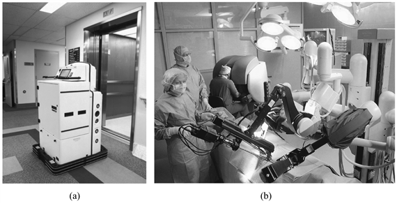
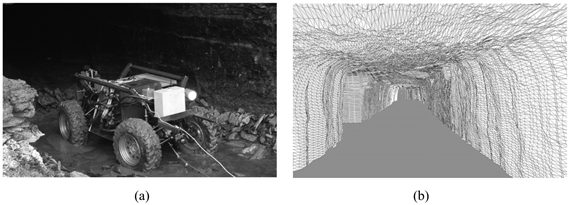

<?xml version="1.0" encoding="UTF-8" standalone="no"?>
<!DOCTYPE html PUBLIC "-//W3C//DTD XHTML 1.1//EN" "http://www.w3.org/TR/xhtml11/DTD/xhtml11.dtd">
<html xmlns="http://www.w3.org/1999/xhtml"><head><meta name="generator" content="DocBook XSL Stylesheets V1.76.1"/></head><body>

<h1 class="title"><a id="id796113"/>Alkalmazási területek</h1>

Most pedig felsorolunk néhányat a robottechnológia fontos alkalmazási területei közül.

<strong>Ipar és mezőgazdaság.</strong> Hagyományosan azok az ágazatok használnak robotokat, amelyek nehéz, fizikai jellegű emberi munkát igényelnek, de mégis megfelelően strukturálhatók és automatizálhatók. A legjobb példa az összeszerelő üzemi gyártósor, ahol a manipulátorok rutinszerűen végzik feladatukat, az összeszerelést, az alkatrészek behelyezését, az anyagkezelést, a hegesztést és a festést. Sok esetben a robotok sokkal költséghatékonyabbak, mint a humán munkaerő.

A szabadban sok nehéz gép helyét robotok vették át a betakarításnál, a bányászatban, a földmunkáknál. Például nemrégiben a Carnegie Mellonon, egy projekt során bemutatták, hogy a robotok 50-szer gyorsabban képesek levakarni a festéket egy hajóról, mint az emberek, és sokkal kevesebb kárt tesznek a környezetben. Autonóm bányászrobotok prototípusai bizonyították, hogy sokkal gyorsabban és pontosabban képesek kitermelni az ércet a föld alatti bányákban, mint az emberek. Robotokat használnak az elhagyatott bányák és csatornarendszerek nagy pontosságú feltérképezéséhez is. Ugyan sok rendszer még csak kísérleti stádiumban van, pusztán idő kérdése, hogy a robotok mikor veszik át az emberektől a félig mechanikus munkák többségét.

<strong>Szállítás.</strong> A robotizált szállításnak sok oldala van. Az autonóm helikopterektől kezdve, amelyek nehezen megközelíthető helyekre juttathatnak el szállítmányokat, az automata kerekes székeken át (amik olyan embereket szállítanak, akik nem tudnák irányítani a hagyományos kerekes széket), egészen az autonóm rakodógépekig, amelyek felülmúlják a dokkokban a szakképzett humán sofőrt is a konténerek hajókra és teherautókra való bepakolásánál. Jó példa a beltéri szállító robotokra a 25.23. (a) ábrán látható Helpmate nevű robot. Ezt a robotot kórházak tucatjaiban használják étel és egyéb orvosi felszerelés szállítására. A kutatók olyan autószerű robotot is kifejlesztettek, amely képes önállóan navigálni az autópályán, és terepen is megállja a helyét. Üzemi körülmények között a szállítórobotok ma már rutinszerűen látják el a szállítási feladatokat raktárakban és a gyártósorok között.

Ezen robotok közül sok igényli, hogy munkája elvégzéséhez változtassunk valamit környezetén. A leggyakoribb, hogy tájékozódást segítő elemeket kell felszerelni, például induktív köröket a padlóba, aktív fényjeleket, vonalkódokat vagy GPS-adókat. Jelenleg még mindig nagy kihívás olyan robotot tervezni, amely képes a természetes környezetben tájékozódni, és nem igényel mesterséges eszközöket. Ez különösen fontos olyan esetekben, mint például a mélytengeri kutatások, ahol a GPS nem elérhető.

<strong>Veszélyes környezet.</strong> Robotok segítettek az embereknek a nukleáris hulladékok eltakarításában. A legnevezetesebb helyszín Csernobil és Three Mile Island volt. A robotok ott voltak a World Trade Center összeomlása után is, és olyan helyekre is bementek, amelyek a mentőcsapatok számára túl veszélyesek voltak.

Néhány országban lőszer szállítására és – ami különösen veszélyes feladat – bombák hatástalanítására használnak robotokat. Számos kutatás irányul napjainkban aknaszedő robotok kifejlesztésére – mind szárazföldi, mind tengeri használatra. A legtöbb ilyen célú robot távirányítással működik, azaz emberek vezérlik messziről őket. Ezen robotok önállóvá tétele a következő fontos fejlesztési lépés.

<strong>Felfedezés.</strong> A robotok eljutottak oda is, ahová az ember még soha, például a Mars felszínére (lásd 25.1. (a) ábra). Robotkarok segítik az űrhajósokat a műholdok befogásában és pályára állításában, valamint a Nemzetközi Űrállomás (ISS) építésében. Robotok segítenek a tenger alatti kutatásokban. Gyakran használják őket elsüllyedt hajók feltérképezésére. A 25.24. ábrán egy elhagyatott szénbányát feltérképező robot látható, a távolságszenzorai által a járatról alkotott 3D modellel együtt. 1996-ban tudósok egy járórobotot engedtek le egy működő vulkán kráterébe, és fontos adatokat gyűjtöttek klimatológiai kutatásokhoz. Ember nélküli légi járműveket, más néven <strong>drón</strong>okat (<strong>drone</strong>s) használnak katonai műveletekhez. A robotok egyre hatékonyabbak az információgyűjtésben olyan területeken, amelyek nehezen megközelíthetők (vagy veszélyesek) az ember számára.

<a id="id796160"/>
<strong>25.23. ábra - (a) A Helpmate robot élelmiszert és egyéb orvosi felszerelést szállít több tucat kórházban, világszerte. (b) Sebészrobotok a műtőben (da Vinci Surgical Systems).</strong>

<strong>Egészségügy.</strong> A sebészorvosok munkáját segítendő egyre többször használnak robotokat az orvosi eszközök pontos mozgatásához olyan kényes szerveket érintő műtétek esetében, mint az agy, a szív vagy a szem. A 25.23. (b) ábra egy ilyen rendszert mutat be. A robotok – nagy pontosságuknak köszönhetően – nélkülözhetetlen eszközökké váltak bizonyos csípőprotézisek beültetésénél. Pilottanulmányok kimutatták, hogy végbéltükrözés esetén a robotizált eszközök használata csökkenti a sérülés veszélyét. A műtőn kívül, a kutatók megkezdték olyan robotok kifejlesztését, amelyek idős vagy fogyatékos emberek segítségére lehetnek, mint például az intelligens robotizált járógépek vagy intelligens játékok, amelyek figyelmeztetnek a gyógyszerek bevételére.

<strong>Személyi kiszolgálók.</strong> A szolgáltatás a robotok nagy, ígéretes alkalmazási területe. A szervizrobotok a mindennapi teendők elvégzésében segédkeznek. A kereskedelmi forgalomban is kapható szervizrobotok között vannak autonóm porszívók, fűnyírók és golflabdaszedők. Ezen robotok mindegyike önállóan, emberi segítség nélkül képes navigálni, és teljesíteni feladatát. Néhány szervizrobot nyilvános helyeken tevékenykedik, mint például az idegenvezetőként alkalmazott robotizált információs pult a bevásárlóközpontokban, a vásárokon vagy a múzeumokban. A szervizfeladatok ellátása emberi interakciót kíván, és azt, hogy a robot megfelelően boldoguljon kiszámíthatatlan és dinamikus környezetekben.

<a id="id796182"/>
<strong>25.24. ábra - (a) Egy elhagyatott bánya feltérképezése egy robottal. (b) A bányának a robot által kapott 3D képe.</strong>

<strong>Szórakozás.</strong> A robotok megkezdték a játék- és szórakoztatóipar meghódítását is. A 25.4. (b) ábrán már találkoztunk a Sony AIBO-val, ami bár kutyaszerű játék, világszerte használják MI-kutatólaborokban különböző projektek platformjaként. Az egyik, nagy kihívást jelentő feladat, ahol az AIBO-kat fizikai eszközként használták, a <strong>robotfoci</strong> (<strong>robotic soccer</strong>): versengés két csapat között, az emberi focihoz hasonló szabályokkal, de autonóm mobil robotokkal. A robotfoci nagyon jó lehetőségeket kínál az MI-kutatásokhoz, mert sok olyan problémát foglal magában, ami máshol, komolyabb alkalmazásokban is megjelenik. Az évente megrendezésre kerülő robotfoci-bajnokságok sok MI-kutatót vonzzanak, és érdekesebbé, izgalmasabbá tették a robotikának ezt az ágát.

<strong>Emberi kiegészítők.</strong> Az utolsó alkalmazás, amiről szót ejtünk, az emberi kiegészítők. A kutatók kifejlesztettek már a kerekes székhez hasonló lépegető járógépet, amelyek alkalmasak emberek szállítására. Számos helyen jelenleg arra koncentrálnak, hogy olyan eszközöket alkossanak, amelyek megkönnyítik az embernek a járást vagy a karok mozgatását egy, a testhez kívülről csatlakoztatott vázzal, amely képes pluszerőt kifejteni. Ha valakire tartósan rögzítenek egy ilyen szerkezetet, akkor mesterséges végtagnak is tekinthető. A robotok általi távjelenlét, illetve teleoperáció is felfogható emberi kiegészítésnek. A teleoperáció azt jelenti, hogy robotikai eszközök segítségével nagy távolságból tudunk megadott feladatokat végrehajtani. A teleoperáció népszerű megvalósítása a mester–szolga (master-slave) elvű konfiguráció, amikor is a robot manipulátor a távolban lévő, humán operátor mozdulatait követi, egy heptikus (érzetet is közvetítő) interfészen keresztül. Ezek a rendszerek mind jobban kiterjesztik az emberi képességeket a környezettel való tökéletesebb kölcsönhatás érdekében. Néhány projekt azt tűzte ki célul, hogy lemásolja az embert, legalábbis felületes szinten. Japánban már számos cégnél kaphatók humanoid robotok.

</body></html>
