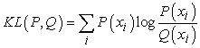
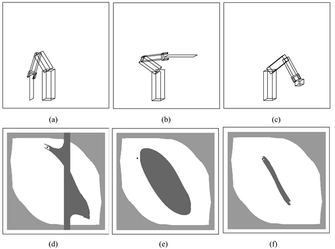
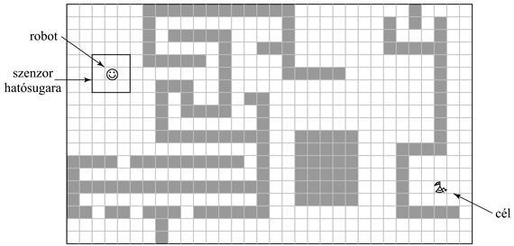

<?xml version="1.0" encoding="UTF-8" standalone="no"?>
<!DOCTYPE html PUBLIC "-//W3C//DTD XHTML 1.1//EN" "http://www.w3.org/TR/xhtml11/DTD/xhtml11.dtd">
<html xmlns="http://www.w3.org/1999/xhtml"><head><meta name="generator" content="DocBook XSL Stylesheets V1.76.1"/></head><body>

<h1 class="title"><a id="id796213"/>Összefoglalás</h1>

A robotika tulajdoképpen nem más, mint intelligens ágensek, amelyek képesek megváltoztatni a fizikai világot. Ebben a fejezetben a következő alapvető ismereteket sajátítottuk el a robothardverrel és -szoftverrel kapcsolatban.

<ul class="itemizedlist"><li class="listitem">
A robotok szenzorokkal vannak felszerelve, hogy érzékelhessék az őket körülvevő világot, és beavatkozó szervekkel, hogy fizikai erőkkel hathassanak környezetükre. A legtöbb robot vagy manipulátor, amely egy adott helyhez van rögzítve, vagy mobil robot, ami képes mozogni.
</li><li class="listitem">
A robotikai érzékelés a döntéshez kapcsolódó mennyiségeknek a szenzoros adatokból való becslése. Ehhez szükségünk van egy belső reprezentációra, valamint egy olyan módszerre, amivel azt időnként frissíthetjük. A nehéz érzékelési problémák gyakori példái a helymeghatározás és a térképezés.
</li><li class="listitem">
Valószínűség-alapú szűrő algoritmusok, mint például a Kalman-szűrők és a részecskeszűrők hasznosak a robotérzékelés szempontjából. Ezek a technikák frissítik a belső világképet, például az állapotváltozók a posteriori<em> </em>eloszlását.
</li><li class="listitem">
A robot mozgásának tervezése általában a konfigurációs térben történik, ahol minden pont egyértelműen meghatározza a robot egy adott pozícióját és orientációját, csuklóinak szögét.
</li><li class="listitem">
A konfigurációs térben kereső algoritmusok között fontos megemlíteni a celladekompozíciót, amely a teljes konfigurációs teret véges sok cellára bontja fel, valamint a szkeletonizációs technikákat, amelyek az adott konfigurációs teret egy alacsonyabb dimenzióba vetítik le. A mozgástervezés problémáját ezután már egyszerűbb struktúrákban való kereséssel is meg lehet oldani.
</li><li class="listitem">
A kereső algoritmus által megtalált pályán a robot akkor tud végighaladni, ha egy PID szabályozót teszünk a rendszerbe, aminek referenciapályája a kívánt útvonal.
</li><li class="listitem">
A potenciáltér-alapú technikák a céltól és az akadályoktól való távolság szerint definiált potenciálfüggvények segítségével navigálják a robotot. Ezek a technikák megakadhatnak lokális minimumhelyeken, de képesek mozgásgenerálásra előzetes tervezés nélkül.
</li><li class="listitem">
Néha egyszerűbb egy robotszabályozót közvetlenül megtervezni, mint a pályát a környezet explicit modelljéből levezetni. Egy ilyen szabályozót legtöbbször leírhatunk véges automataként.
</li><li class="listitem">
Az alárendelt architektúra a programozók számára lehetővé teszi, hogy belső órajellel kiegészített véges automaták összekapcsolásával robotvezérlőket alkossanak.
</li><li class="listitem">
A népszerű háromrétegű architektúra olyan robotszoftver fejlesztéséhez is keretet ad, amely integrálja a modellalapú tervezést, a részfeladatokra bontást és a szabályozást.
</li><li class="listitem">
Léteznek feladatspecifikus robotprogramozási nyelvek, amelyek megkönnyítik a robotszoftverek fejlesztését. Ezek a nyelvek kész szerkezetekkel segítik a többszálú programok írását, a szabályozási irányelveknek a tervezésbe történő integrálását és a tapasztalatalapú tanulást.
</li></ul>

<h2 class="title"><a id="id796266"/>Irodalmi és történeti megjegyzések</h2>

A <strong>robot</strong> szót a cseh drámaíró, Karel Capek népszerűsítette 1921-ben írt <em>R.U.R. </em>(Rossum’s Universal Robots) c. színművével. Az ő robotjait nem mechanikusan szerelték össze, hanem kémiai úton állították elő. A műben a robotok megharagszanak mestereikre, és elhatározzák, hogy átveszik az uralmat. Úgy tűnik (Glanc, 1978), hogy valójában Capek bátyja, Josef alkotta meg a robot szót a cseh „robota” (robotolás) és „robotnik” (jobbágy) szó összevonásával, 1917-es <em>Opilec</em> c. novellájában.

A robotika kifejezést Asimov használta először 1950-ben, ugyanakkor a robotika története – más megnevezéssel – sokkal régebbre nyúlik vissza. Az ókori görög mitológiában Talószt, a mechanikus embert állítólag Héphaisztosz, a kovácsisten készítette. Jacques Vaucanson egy csodálatos automatát épített a 18. században. Az 1738-as mechanikus kacsa a korai robotok egy példája, aminek összetett viselkedése még fixen volt beleépítve. Az első programozható, robotszerű alkotás talán Jacquard szövőszéke volt (1805), amiről már az 1. fejezetben már szót ejtettünk.

Az első kereskedelmi forgalomba került robot a <strong>Unimate</strong> (universal automation) manipulátor volt. A Unimate-et Joseph Engelberger és George Devol fejlesztette. 1960-ben adták el az első példányt a General Motorsnak, ahol tv-képcsövek gyártásánál használták. Szintén 1960-ben nyújtotta be Devon az első robotokra vonatkozó szabadalmat az Egyesült Államokban. 11 évvel később a Nissan Corp. az elsők között oldotta meg egy teljes szerelősor automatizálását. A fejlesztést a Kawasaki végezte Engelberger és Devol Unimation nevű cégétől származó robotokkal. Főként Japánban és az USA-ban ez az előrelépés jelentős átalakulásnak nyitott utat, amely mind a mai napig tart. A Unimationt a PUMA robot fejlesztése követte 1978-ban. A <strong>PUMA</strong> a Programmable Universal Machine for Assembly (programozható univerzális gép szereléshez) névből származik, és eredetileg a General Motors számára fejlesztették. A következő évtizedekben ez lett a robotmanipulátorok <em>de facto</em> szabványa. Manapság egymillióra becsülik a világon dolgozó robotok számát, és ezeknek több mint fele Japánban tevékenykedik.

A robotikai kutatásokról szóló szakirodalom nagyjából két részre osztható: mobil robotokra és rögzített manipulátorokra. A Grey Walter által 1948-ban készített „teknőst” tekinthetjük a világ első autonóm mobil robotjának annak ellenére, hogy a rendszer nem volt programozható. A ’60-as években, a Johns Hopkins Egyetemen készített „Hopkins Beast” már sokkal kifinomultabb volt. Mintafelismerő hardverével azonosította a szabványos fali AC-csatlakozókat, és képes volt mozgása során megtalálni azokat, rácsatlakozni és feltölteni akkumulátorát. Mégis, a Beastnek nagyon limitált képességei voltak. Az első általános célú robot a „Shakey” volt, amit a Stanford Research Institute-ban (SRI) fejlesztettek ki az 1960-as évek végén (Fikes és Nilsson, 1970; Nilsson, 1984). Shakey volt az első robot, amelybe integrálták az érzékelést, a tervkészítést és a végrehajtást. Ez a jelentős eredmény számos további MI-kutatást inspirált. Szintén jelentős hatású projektek voltak még a Stanford Cart és a CMU Rover (Moravec, 1983). A mobil robotokkal kapcsolatos klasszikus munkákat Cox és Wilfong foglalták össze (Cox, és Wilfong, 1990).

A robottérképezés gyökerei két különböző helyről erednek. Az egyik szál Smith és Cheeseman munkásságával kezdődött (Smith és Cheeseman, 1986), akik Kalman-szűrőt alkalmaztak szimultán helymeghatározási és térképezési problémákhoz. Az algoritmust először Moutarlier és Chatila implementálta 1989-ben, majd Leonard és Durrant-Whyte terjesztették ki (Leonard és Durrant-Whyte, 1992). Dissanayake és társai 2001-ben írták le az ágazat jelenlegi fejlettségi szintjét (Dissanayake és társai, 2001). A másik szál a <strong>foglalási hálózat</strong> (<strong>occupancy grid</strong>) reprezentáció megalkotásával kezdődött, amelyet a valószínűségi térképezésnél használnak. A foglalási hálózat minden (<em>x</em>, <em>y</em>) pontra meghatározza annak a valószínűségét, hogy ott egy akadály van (Moravec és Elfes, 1985). A modern robottérképezésről Thrun írt összefoglalót (Thrun, 2002). Kuipers és Levitt (Kuipers és Levitt, 1988) az elsők között voltak, akik metrikus helyett topológikus térképezést javasoltak, az ember térbeli tájékozódását véve alapul.

A korai mobil robot helymeghatározási technikákat Borenstein és társai tekintették át (Borenstein és társai, 1996). Annak ellenére, hogy a Kalman-szűrő évtizedeken át jól ismert helymeghatározási módszer volt az irányításelméletben, a helymeghatározás problémájához tartozó általános valószínűségi szabály csak jóval később jelent meg az MI-irodalomban, Tom Dean és kollégái (Dean és társai, 1990), valamint Simmons és Koenig (Simmons és Koenig, 1995) munkássága révén. Ez utóbbi páros vezette be a <strong>Markov-helymeghatározás</strong> (<strong>Markov localization</strong>) fogalmát. A technika első, valósvilág-beli alkalmazását Burgard és társai mutatták be (Burgard és társai, 1999) egy sor roboton keresztül, amelyeket múzeumokba telepítettek. A részecskeszűrő-alapú Monte Carlo helymeghatározás, amelyet Fox és társai fejlesztették ki (Fox és társai, 1999), manapság széles körben használatos. A <strong>Rao-Blackwellized </strong>részecskeszűrő kombinálja a részecskeszűrést a robot lokalizációval, valamint az egzakt szűrést a térképalkotással (Murphy és Russell, 2001; Montemerlo és társai, 2002). 

A mobil robotokhoz kapcsolódó kutatások szimulálásának az elmúlt évtizedben két jelentős verseny is teret adott. Az AAAI éves robotbajnokságát 1992 óta rendezik meg. Az első verseny győztese a <code class="code">CARMEL</code> volt (Congdon és társai, 1992). A fejlődés azóta igen jelentős és töretlen: a 2002-es verseny során például a robotoknak be kellett járniuk a konferenciaközpontot, megtalálni a regisztrációs pultot, regisztrálni a konferenciára, és végül tartani egy beszédet. Az 1995-ben, Kitano és kollégái (Kitano és társai, 1997) által elindított <strong>Robocup</strong> kezdeményezés célja, hogy 2050-re olyan teljesen autonóm humanoid robotokból álló futballcsapatot fejlesszen, „amely képes megverni az aktuális emberi világbajnokcsapatot”. Különböző bajnokságokat szerveznek kerekes, eltérő méretű, szimulált robotoknak és négylábú Sony Aibóknak. 2002-ben a világbajnokságra több mint 30 országból érkeztek csapatok, és a rendezvény legalább 100 000 nézőt vonzott.

A robotmanipulátorok, eredeti nevükön <strong>kéz–szem gép</strong>ek (<strong>hand-eye machine</strong>) tanulmányozása meglehetősen más vonalon fejlődött. Egy ilyen kéz–szem gép megalkotására az első igazi kísérlet Heinrich Ernst MH-1-ese volt, amelyet PhD-téziseiben írt le az MIT-n (Ernst, 1961). Az edinburghi Gépi Intelligencia (Machine Intelligence) program már igen korán jelentős eredményeket mutatott fel látásalapú összeszerelő rendszerükkel, amit <code class="code">FREDDY</code>-nek hívtak (Michie, 1972). Ezen úttörő kísérletek után rengetegen foglalkoztak geometriai algoritmusokkal determinisztikus és teljesen megfigyelhető mozgástervezési problémákhoz. A robotmozgás-tervezés P-TÁR nehézségét Reif egy termékenyítő cikke mutatta be (Reif, 1979). A konfigurációstér-reprezentációt Lozano-Perez-nek (Lozano-Perez, 1983) köszönhetjük. Nagy befolyást gyakoroltak Schwartz és Sharir publikációi az általuk <strong>zongoraszállítók</strong>nak (<strong>piano movers</strong>) nevezett problémáról (Schwartz és társai, 1987).

A konfigurációs tér rekurzív cellákra bontásával való tervezés Brookstól és Lozano-Perez-től származik (Brooks és Lozano-Perez, 1985), ezt később Zhu és Latombe fejlesztették jelentősen tovább (Zhu és Latombe, 1991). A legkorábbi szkeletonizációs algoritmusok a Voronoi-diagramokon (Rowat, 1979) és a <strong>láthatósági gráf</strong>okon (<strong>visibility graph</strong>) alapultak (Wesley és Lozano-Perez, 1979). Guibas és társai (Guibas és társai, 1992) hatékony technikát fejlesztettek ki a Voronoi-diagramok inkrementális számítására. Choset (Choset, 1996) általánosította sokkal átfogóbb mozgástervezési problémákra a Voronoi-diagramokat. John Canny alapozta meg PhD-tézisével (Canny, 1991) az első különálló exponenciális algoritmust pályatervezésre. Másféle szkeletonizációs módszert használt, amit <strong>sziluett</strong> (<strong>silhouette</strong>) algoritmusnak hívnak. Jean-Claude Latombe írása (Latombe, 1991) a különböző mozgástervezési metódusok széles skáláját fedi le. Kavraki és társai valószínűségi útitervet fejlesztettek (Kavraki és társai, 1991), amely még ma is a leghatékonyabb. Lozano-Perez és társai (Lozano-Perez és társai, 1984), valamint Canny és Reif (Canny és Reif, 1987) is foglalkoztak a finom mozgások tervezésével korlátozott érzékelés esetén, és intervallumra vonatkoztatott bizonytalanságot használtak valószínűségi bizonytalanság helyett. A referenciapont-alapú navigálás a mobil robotok esetében sok hasonló ötletet használ (Lazanas és Latombe, 1992).

A robotok mint dinamikus rendszerek irányítása, legyen szó manipulátorról vagy mobil robotról, hatalmas irodalommal rendelkezik, amelynek anyagáról ebben a fejezetben alig-alig esett szó. A fontos művek közé tartozik Hogan trilógiája (Hogan, 1985) az impedancia szabályozásáról és egy általános tanulmány a robotok dinamikájáról Featherstone-tól (Featherstone, 1987). Dean és Wellman az elsők között voltak, akik megpróbálták összekötni az irányításelméletet és az MI-tervezőrendszereket (Dean és Wellman, 1991). Három klasszikus tankönyv a robotkarok matematikájáról Paultól (Paul, 1981), Craigtól (Craig, 1989) és Yoshikawától (Yoshikawa, 1990) származik. A <strong>megfogás</strong> (<strong>grasping</strong>) tárgyköre szintén nagyon fontos a robotikában: egy stabil megfogás meghatározásának problémája meglehetősen nehéz (Mason és Salisbury, 1985). A megfelelő megfogás érintkezésérzékelőket vagy <strong>heptikus</strong> <strong>visszacsatolás</strong>t<strong> </strong>(<strong>haptic feedback</strong>) kíván a fellépő erők és az esetleges csúszás meghatározására (Fearing és Hollerbach, 1985).

A potenciáltér-vezérlést, amely egyszerre próbálja megoldani a mozgástervezés és az irányítás problémáját, Khatib vezette be a robotika irodalmába (Khatib, 1986). Mobil robotok esetében ezt az ötletet részleges megoldásnak tekintették az ütközések elkerülésének problémájához. Később Borenstein (Borenstein, 1991) továbbfejlesztette az algoritmust, és a <strong>vektortérhisztogram </strong>(<strong>vector field histogram</strong>) nevet adta neki. A navigációs függvényeket, a determinisztikus MDF-hez tartozó vezérlési irányelvek robotikai megfelelőjét, Koditschek vezette be (Koditschek, 1987).

A robotokhoz tartozó szoftverarchitektúra témája sok heves vitát váltott ki. Az MI jó öreg zászlóshajója – a háromrétegű architektúra – Shakey tervezésének eredménye, később Gat újította fel (Gat, 1998). Az alárendelt architektúra Brooks munkája (Brooks, 1986), bár tőlük függetlenül Braitenberg (Braitenberg, 1984) is fejlesztett hasonlót, akinek könyve, a <em>Járművek</em>, egy sor egyszerű viselkedésalapú robotot mutat be. Brooks hatlábú lépegető robotjának sikerét sok más projekt követte. Connell PhD-munkája keretében (Connell, 1989) olyan teljesen reaktív mobil robotot fejlesztett, amely képes volt tárgyakért elmenni és azokat elhozni. A viselkedésalapú paradigma többrobotos rendszerekre való kiterjesztését megtalálhatjuk Mataric (Mataric, 1997) és Parker (Parker, 1996) munkáiban. A GLR (Horswill, 2000) és a <code class="code">COLBERT</code> (Konolige, 1997) robotok megvalósították a párhuzamosított viselkedésalapú irányítást általános robotprogramozási nyelveken. Arkin átfogó képet nyújtott a téma aktuális helyzetéről (Arkin, 1998).

A 7. fejezetben leírt <strong>helyezett automatá</strong>kat (<strong>situated automata</strong>) (Rosenschein, 1985; Kaelbling és Rosenschein, 1990) szintén használják mobil robotok irányítására, felderítési és szállítási feladatoknál. A helyezett automaták szorosan kapcsolódnak a viselkedésalapú tervezéshez abból a szempontból, hogy véges automatákból állnak, amelyek egyszerű kombinációs hálózatokkal nyomon követik a környezet állapotának bizonyos aspektusait. Amíg a viselkedésalapú megközelítés az explicit reprezentáció hiányát hangsúlyozza, a helyezett automatákat algoritmikusan építik deklaratív környezeti modellekből, így minden állapotregiszter által reprezentált tartalom jól definiált.

Számos jó kézikönyv jelent meg mostanában a mobil robotokról. A fent említetteken felül Kortenkamp és társai (Kortenkamp és társai, 1998) gyűjtése minden részletre kiterjedő áttekintést nyújt a mai mobil robot architektúrákról és rendszerekről. Két újabb könyv, Dudek és Jenkin (Dudek és Jenkin, 2000), valamint Murphy (Murphy, 2000) munkája általánosabb megközelítésben tárgyalja a robotikát. Mason könyve (Mason, 2001) a robotkarokról olyan modern témákat is tárgyal, mint például az önbeálló mozgás. A robotikával foglalkozó legjelentősebb konferencia az <em>IEEE International Conference on Robotics and Automation</em>. A témával foglalkozó folyóiratok közül kiemelkedik az <em>IEEE Robotics and Automation</em>, az <em>International Journal of Robotics Research</em> és a <em>Robotics and Autonomous Systems</em>.

<h2 class="title"><a id="id796481"/>Feladatok</h2>

<strong>25.1.	</strong>

A Monte Carlo-helymeghatározás <em>torzított</em> bármilyen véges méretű mintára. Azaz az algoritmus által kiszámolt várható érték a részecskeszűrés működéséből adódóan eltér a tényleges várható értéktől. Ebben a példában ezt a torzítást kell kiszámolni.

Hogy kicsit egyszerűsítsük a problémát, vegyünk egy teret, amelyben a robotnak négy lehetséges állapota (helyzete) van: <em>X = </em>{<em>x</em>1, <em>x</em>2, <em>x</em>3, <em>x</em>4}. Kezdetben egyenletes eloszlással választunk <em>N</em> ≥ 1 mintát a megadott állapotok közül. Mint általában, itt is tökéletesen elfogadható, ha egymás után akár több is generálódik bármelyik <em>X</em> állapotból. Legyen <em>Z</em> egy bináris szenzorváltozó, az alábbi feltételes valószínűségekkel:

<table border="0"><colgroup><col width="90.5pt" class="col1"/><col width="99.3pt" class="col2"/></colgroup><tbody><tr><td style="text-align: justify" valign="top">
<code class="code"><em>P</em>(<em>z</em>|<em>x</em>1) = 0,8</code>
</td><td style="text-align: justify" valign="top">
<code class="code"><em>P</em>(¬<em>z</em>|<em>x</em>1) = 0,2</code>
</td></tr><tr><td style="text-align: justify" valign="top">
<code class="code"><em>P</em>(<em>z</em>|<em>x</em>2) = 0,4</code>
</td><td style="text-align: justify" valign="top">
<code class="code"><em>P</em>(¬<em>z</em>|<em>x</em>2) = 0,6</code>
</td></tr><tr><td style="text-align: justify" valign="top">
<code class="code"><em>P</em>(<em>z</em>|<em>x</em>3) = 0,1</code>
</td><td style="text-align: justify" valign="top">
<code class="code"><em>P</em>(¬<em>z</em>|<em>x</em>3) = 0,9</code>
</td></tr><tr><td style="text-align: justify" valign="top">
<code class="code"><em>P</em>(<em>z</em>|<em>x</em>4) = 0,1</code>
</td><td style="text-align: justify" valign="top">
<code class="code"><em>P</em>(¬<em>z</em>|<em>x</em>4) = 0,9</code>
</td></tr></tbody></table>

	A Monte Carlo-helymeghatározás ezeket a valószínűségeket használja, hogy generálja a részecskék súlyát, amelyeket azután normalizál és felhasznál az újabb mintavételezésnél. Az egyszerűség kedvéért feltételezzük, hogy az újabb mintavételezésnél, <em>N</em> nagyságától függetlenül, csak egyetlen új mintát generálunk. Ez a minta korrelálhat bármelyik <em>X</em> állapottal. Így a mintavevő folyamat <em>X</em>-re nézve meghatároz egy valószínűség-eloszlást.

<ol class="orderedlist"><li class="listitem">
Mi az új mintára eredményül kapott valószínűség-eloszlás <em>X</em>-re nézve? Válaszolja meg a kérdést az <em>N = </em>1, …, 10 esetekre, valamint <em>N = </em>∞-re.
</li><li class="listitem">
A <em>P</em> és <em>Q </em>két valószínűség-eloszlás közötti különbséget mérhetjük a KL divergenciával, amelynek definíciója:
</li></ol>

<ol class="orderedlist"><li class="listitem">
Melyek a KL divergencia értékei az (a)-beli eloszlások és a valódi posterior között?
</li><li class="listitem">
Milyen változtatást hajtana végre a feladat szövegezésén (nem az algoritmuson!) annak érdekében, hogy garantáljuk a fenti specifikus becslő torzítatlanságát még véges <em>N</em>-ekre is? Legalább két különböző megoldást adjon (mindkettőnek elégségesnek kell lennie).
</li></ol>

<strong>25.2.	</strong>

Alkalmazza egy pásztázó távolságmérővel ellátott szimulált robot esetében a Monte Carlo-helymeghatározási algoritmust. A rácstérkép és a távolságadatok elérhetők az <strong>aima.cs.berkeley.edu</strong> kódtárából. A megoldás akkor teljes, ha bemutatja a robot sikeres globális helymeghatározását.

<strong>25.3.	</strong>

Vegyük a 25.12. ábrán látható robotkart. Tegyük fel, hogy a robot alapja 60 cm hosszú, a felkarja és az alkarja pedig egyaránt 40-40 cm. Ahogy a 25.4. alfejezetben beláttuk, az inverz kinematikai feladat megoldása sokszor nem egyértelmű. Állítson fel egy explicit, zárt alakú megoldást az inverz kinematikára erre a robotkarra. Pontosan milyen feltételek mellett egyértelmű a megoldás?

<strong>25.4.	</strong>

Implementáljon egy algoritmust, amely kiszámítja egy tetszőleges (<em>n</em> × <em>n</em>-es logikai tömbbel) adott 2D környezet Voronoi-diagramját. Illusztrálja algoritmusát a Voronoi-diagram felrajzolásával 10 érdekes térképen. Mekkora az algoritmus komplexitása?

<strong>25.5.	</strong>

Ez a feladat feltárja a kapcsolatot a munkatér és a konfigurációs tér között, a 25.25. ábra példáit használva.

<a id="id796854"/>
<strong>25.25. ábra - Diagram a 25.5. feladathoz</strong>

<ol class="orderedlist"><li class="listitem">
Vegyük a 25.25. (a)-tól (c)-ig látható robotkonfigurációkat, nem véve figyelembe a diagramokon feltüntetett akadályokat. Rajzolja fel az ezeknek megfelelő robotkar-konfigurációkat a konfigurációs térben. (<em>Segítség: </em>minden egyes karkonfiguráció egyetlen pontra képződik le a konfigurációs térben, ahogy ezt a 25.12. (b) ábra is mutatja.)
</li><li class="listitem">
Rajzolja meg a konfigurációs teret a 25.25. (a)–(c) ábrákon látható minden egyes munkatérdiagramra. (<em>Segítség:</em> a konfigurációs terek megegyeznek a 25.25. (a) ábrán lévővel, ami a robot önmagával való ütközését jelentő területet illeti, de különbségek adódnak a terület határát jelentő akadályok hiányából és az egyes ábrákon lévő akadályok különböző helyzetéből.)
</li><li class="listitem">
A 25.25. (e)–(f) ábrákon látható fekete pontok mindegyikéhez rajzolja meg a hozzá tartozó konfigurációt a munkatérben. Az árnyékolt részeket hagyja figyelmen kívül.
</li><li class="listitem">
A 25.25. (e)–(f) ábrákon látható konfigurációs terek mindegyikét egy-egy különálló (a munkatérben lévő) akadály generálta (ez a sötétebb terület), valamint azok a megszorítások, amelyek a robot önmagával való ütközéséből erednek (a világosabb árnyalat). Rajzolja meg mindkét diagramhoz a sötét területnek megfelelő akadályt a munkatérben.
</li><li class="listitem">
A 25.25. (d) ábra azt mutatja be, hogy egyetlen síkbeli (lapos) akadály két elválasztott részre tudja bontani a konfigurációs teret. Maximum hány elválasztott részre tudja bontani az egybefüggő akadálymentes teret egyetlen lapos akadály behelyezése egy 2 szabadságfokos robot esetén? Adjon példát rá, és indokolja meg, miért nem lehetséges nagyobb számú független terület kialakítása. Mi a helyzet, ha nem lapos az akadály?
</li></ol>

<strong>25.6.	</strong>

Vegyük a 25.26. ábra egyszerűsített robotját. Tegyük fel, hogy a robot derékszögű koordinátái ismertek minden időpillanatban, mint ahogy a célhelyzet is. Ugyanakkor van egy akadály, amelynek a helyzete nem ismert. A robot csak a közvetlen környezetében képes érzékelni az akadályt, mint ahogy azt az ábra is illusztrálja. Az egyszerűség kedvéért tételezzük fel, hogy a robot mozgása zajjal nem terhelt, és az állapottér diszkrét. A 25.26. ábra csak egy példa. Ebben a feladatban azt kérjük, hogy minden lehetséges rácsvilágra gondoljon, ahol van érvényes út a start pozíciótól a célig.

<a id="id796899"/>
<strong>25.26. ábra - Egyszerűsített robot egy labirintusban. Lásd 25.6. feladat.</strong>

<ol class="orderedlist"><li class="listitem">
Tervezzen egy modellalapú vezérlőt, amely garantálja, hogy a robot mindig eléri a célt, amennyiben ez lehetséges. A modellalapú vezérlő egy, a mozgás során fokozatosan kialakított térkép formájában képes tárolni a terep jellemzőit. A robot az egyes mozdulatok között tetszőleges időt tölthet gondolkodással.
</li><li class="listitem">
Most pedig tervezzen egy <em>reaktív</em> vezérlőt ugyanerre a feladatra. Ez a vezérlő nem tárolhatja a korábbi érzékelések eredményeit. (Azaz nem készíthet térképet!) Ehelyett minden döntését az aktuális érzékelő adatai alapján hozza meg, amely magában foglalja a saját helyének és a cél pontos helyzetének ismeretét. A döntéshozási időnek függetlennek kell lennie a környezet méretétől, valamint a már megtett lépések számától. Maximum hány lépés kell a robotnak ahhoz, hogy elérje célját?
</li><li class="listitem">
Hogy fog viselkedni az (a) és (b) pontban megtervezett vezérlő, ha az alábbi hat feltétel valamelyike fennáll: folytonos állapottér; zajjal terhelt érzékelés; zaj a mozgásban; zaj mind a mozgásban, mind az érzékelésben; a cél helyzete ismeretlen (csak akkor ismeri fel a célt, ha az az érzékelő hatótávolságán belülre kerül); vagy mozgó akadályok vannak. Minden egyes feltételre és mindkét vezérlőre adjon egy-egy példát, amikor is a robot elbukik (vagy magyarázza el, miért nem tud).
</li></ol>

<strong>25.7.	</strong>

A 25.22. (b) ábrán kiterjesztett véges automatát használtunk a hatlábú robot egyetlen lábának vezérléséhez. Ebben a feladatban a cél egy olyan AFSM tervezése, amely a hat külön lábhoz tartozó vezérlővel együttműködve hatékony és stabil mozgást eredményez. Ennek eléréséhez ki kell bővíteni az egyes lábakat vezérlő AFSM-eket, hogy üzeneteket is küldjenek az új AFSM-nek, és hogy várjanak amíg más üzenetek érkeznek. Magyarázza el, hogy miért hatékony a vezérlője, azaz miért nem fogyaszt feleslegesen energiát (pl. csúszó lábak miatt), és hogy miért mozgatja a robotot megfelelően nagy sebességgel! Bizonyítsa be, hogy vezérlője megfelel a 25.2. alfejezetben támasztott stabilitási feltételeknek.

<strong>25.8.	</strong>

(Ezt a feladatot Michael Genesereth és Nils Nilsson találták ki, és az első évesektől a végzősökig mindenkinek szól.) Az emberek annyira ügyesek alapfeladatok elvégzésében – mint például csészék felemelése vagy dobozok egymásra rakása –, hogy gyakran elfelejtik milyen összetettek ezek a mozdulatok valójában. A feladat során felfedezzük e feladatok komplexitását, és összefoglaljuk a robotika elmúlt 30 évének fejlődését. Először határozzuk meg a feladatot (például egy kapu készítése három dobozból), majd építsünk egy robotot négy emberből az alábbiak szerint:

<ul class="itemizedlist"><li class="listitem">
<strong>Agy:</strong> az Agy feladata a cél elérését biztosító terv kidolgozása és a kezek irányítása a terv megvalósítása során. Az Agy információt csak a Szemtől kaphat, <em>közvetlenül nem láthatja a helyszínt!</em> Az Agy az egyetlen, aki tudja, mi a cél.
</li><li class="listitem">
<strong>Szem:</strong> a Szem feladata a helyszín rövid leírása az Agy számára. A munkakörnyezettől kb. egy méternyire kell lennie, és vagy kvalitatív leírást (mint például: „Az oldalán fekvő zöld doboz tetején egy piros doboz van”), vagy kvantitatív leírást („A zöld doboz kb. 50 cm távolságra balra van a kék hengertől”) adhat. A Szem az Agytól jövő kérdésekre is válaszolhat, így például: „Van-e hely a Bal Kezem és a piros doboz között?” Ha van kéznél egy videokamera, akkor állítsuk rá a munkakörnyezetre, és a Szem ezen keresztül nézze azt, ne lássa közvetlenül!
</li><li class="listitem">
<strong>Kezek</strong> (Jobb és Bal): mindkét Kezet más ember játssza. A két Kéz egymás mellett áll. A Balkéz csak a saját balkezét használja, a Jobbkéz pedig csak a jobbat. A Kezek csak egyszerű, az Agytól érkező feladatokat hajthatnak végre. Például: „A Balkéz mozduljon 5 cm-t előre”. Csak mozgásparancsot képesek végrehajtani – például a „vedd fel a dobozt” nem olyan parancs, amit a Kéz végre tud hajtani. A csalások megakadályozása végett megkövetelhetjük, hogy a kezeken legyen kesztyű vagy használjanak csipeszt. A Kezeknek<em> bekötött szemmel kell tevékenykedniük</em>. Egyetlen érzékelési képességük az, hogy meg tudják mondani, amikor útjukat valamilyen elmozdíthatatlan akadály, például egy asztal vagy a másik Kéz zárja el. Ilyen esetben hangjelzést adhatnak az Agy informálása céljából.
</li></ul>

</body></html>
