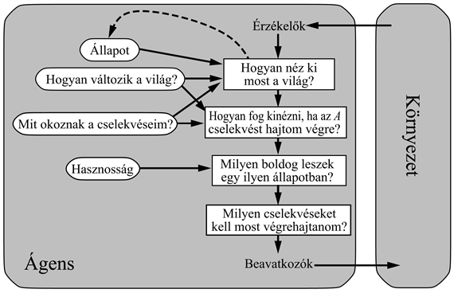

<?xml version="1.0" encoding="UTF-8" standalone="no"?>
<!DOCTYPE html PUBLIC "-//W3C//DTD XHTML 1.1//EN" "http://www.w3.org/TR/xhtml11/DTD/xhtml11.dtd">
<html xmlns="http://www.w3.org/1999/xhtml"><head><meta name="generator" content="DocBook XSL Stylesheets V1.76.1"/></head><body>

<h1 class="title"><a id="id802763"/>27. fejezet - MI: Jelen és jövő</h1>

<em>Ebben a fejezetben felmérjük, hogy hol vagyunk és merre tartunk, mielőtt folytatnánk. Talán nem felesleges.</em>

Az I. részben bevezettük a racionális ágensrendszert mint a mesterséges intelligencia egységes szemléleti keretét. Bemutattuk, hogy a tervezési probléma az ágens rendelkezésére álló észleléseken és cselekvéseken, az ágens viselkedésével kielégítendő célon és a környezet természetén múlik. Az ágensrendszertervek egész sorát lehet elképzelni, a reflexszerű ágenstől kezdve egészen a teljesen céltudatos, tudásalapú ágensig. Továbbá ezen rendszertervek komponensei többféle konkrét alakot ölthetnek – például logikait, valószínűségit vagy „neurálist”. Az ilyen jellegű komponensek működésével a megfelelő fejezetek foglalkoztak.

<h3 class="title">Fontos</h3>
Az ágensrendszer és komponensei tekintetében mind tudományos megértésünk, mind technológiai képességünk hatalmasat fejlődött. Ebben a fejezetben hátrébb lépünk a részletektől, és azt kérdezzük: <em>„Elvezet-e ez a fejlődés egy változatos környezetekben működésre képes, általános célú intelligens ágenshez?” </em>A 27.1. alfejezetben számba vesszük az intelligens ágens komponenseit, hogy meghatározhassuk, mi az, amit ismerünk, és mi az, ami még hiányzik. A 27.2. alfejezetben az általános ágensarchitektúra kapcsán tesszük ugyanezt. A 27.3. alfejezetben azt vizsgáljuk, hogy a „racionális ágens tervezése”-e az elsődlegesen helyes cél. (A válasz: „Nem igazán, de egyelőre megteszi.”) Végül a 27.4. alfejezetben azzal foglalkozunk, milyen következményekkel járhat vállalkozásunk sikere.

<h1 class="title"><a id="id802780"/>Ágensösszetevők</h1>

A 2. fejezetben számos ágenstervet és azok komponenseit mutattuk be.<em> </em>Figyelmünket összpontosítandó itt csak a hasznosságalapú ágenssel foglalkozunk, amelyet a 27.1. ábrán mutatunk be újra. Ez a legáltalánosabb ágenstervünk; de megvizsgáljuk tanulási képességekkel való kiterjesztését is (lásd 2.15. ábra).

<em>Interakció a környezettel szenzorok és beavatkozószervek segítségével. </em>Ez a mesterséges intelligencia történetének nagy részében komoly hiányosság. Néhány tiszteletre méltó kivétellel minden MI-rendszert úgy építettek fel, hogy embereknek kellett szolgáltatniuk a bemeneteket, és értelmezni a kimeneteket, a robotika pedig alacsony szintű feladatokra összpontosított, ahol nagyrészt hiányzott a magas szintű következtetés és tervkészítés. Ez részben a magas költségek és a komoly tervezői erőfeszítés miatt volt így, ami ahhoz kellett, hogy egyáltalán valódi, működő robotokat kapjunk. Az elmúlt években az előre elkészített, programozható robotok – mint például a 25.4. (b.) ábrán látható négylábú robot – megjelenésével a helyzet rohamosan megváltozott. Ez a változás végső soron a kicsi, olcsó, nagy felbontású CCD-kameráknak és a kompakt, megbízható motoros hajtásoknak köszönhetően következett be. Az MEMS- (mikro-elektromechikai rendszerek) technológia miniatürizált gyorsulásmérőket és giroszkópokat hozott létre, napjainkban pedig olyan beavatkozószerveket állít elő, amelyek például egy mesterséges repülő rovart bizonyos képességekkel ruháznak majd fel. (Talán MEMS-beavatkozószervek milliói kapcsolhatók majd össze, hogy nagy teljesítményű makroszkopikus beavatkozókat kapjunk.) A fizikai környezeteket illetően az MI-rendszereknek nem lehet több kifogása. Továbbá egy teljességgel új környezet, az internet is létrejött.

<a id="id802794"/>
<strong>27.1. ábra - Egy modell- és hasznosságalapú ágens, ahogyan először a 2.14. ábrán bemutattuk</strong>

<em>Nyomon követni a világ állapotát.</em> Ez az intelligens ágens számára szükséges legfontosabb képességek egyike, amelyhez egyaránt szükség van érzékelésre és a belső reprezentáció frissítésére. A 7. fejezetben ítéletlogikát alkalmaztunk a világ állapotának nyomon követésére; a 10. fejezetben kiterjesztettük ezt az elsőrendű logikára; a 15. fejezetben pedig <strong>szűrő algoritmus</strong>okat (<strong>filtering algorithm</strong>s) mutattunk be, hogy a bizonytalan környezeteket is követni tudjuk. Ezekre a szűrőeszközökre van szükség, amikor igazi – tehát tökéletlen – érzékelésre kerül sor. A jelenlegi szűrő és érzékelési algoritmusokat lehet úgy kombinálni, hogy elég jó teljesítményt kapjunk alacsony szintű predikátumok leírásánál, mint például „a csésze az asztalon van”, de van még megteendő út előttünk, míg az algoritmusok azt is ki tudják jelenteni, hogy: „dr. Russell teázik dr. Norviggel.” Egy másik probléma az, hogy ugyan az approximációs szűrő algoritmusok képesek elég nagy környezeteket kezelni, lényegüket tekintve azonban még mindig <em>propozicionálisak:</em> a propozicionális logikához hasonlóan nem kezelik explicit módon az objektumokat és a relációkat. A 14. fejezetben bemutattuk, hogyan lehet ennek a problémának a megoldására elsőrendű logikát alkalmazni; elvárásaink szerint nagy előrelépéssel fog majd járni, ha a komplex környezetek kezelésére is alkalmazzák ezeket az elgondolásokat. Továbbá, mihelyt egy bizonytalan környezetben elkezdünk objektumokról beszélni, felmerül a <strong>bizonytalan azonosság</strong> (<strong>identity uncertainty</strong>) problémája: nem tudjuk, melyik objektum melyik. A logika alapú mesterséges intelligenciában meglehetősen elhanyagolták ezt a problémát, mivel általában feltételezték, hogy az észleletek állandó szimbólumokat tartalmaznak az objektumok azonosítására.

<em>Előrevetíteni, értékelni és kiválasztani jövőbeli cselekvéseket.</em> Az alapvető tudásreprezentációs elvárások itt is ugyanazok, mint a világ állapotának nyomon követésénél; az elsődleges nehézség a cselekvésekkel (mint például beszélgetni és teázni) való boldogulásból származik, amelyek esetenként az igazi ágens elemi lépéseinek ezreit vagy millióit tartalmazhatják. Az emberek is csak úgy tudnak ezzel megbirkózni, hogy a viselkedést egy <strong>hierarchikus struktúrá</strong>ba (<strong>hierarchial structure</strong>) szervezik. A 12. fejezetben bemutatott tervezési algoritmusok némelyike az ehhez hasonló méretű problémák kezelésére hierarchikus és elsőrendű logikai reprezentációt használ; másrészt pedig a 17. fejezetben megadott bizonytalansági döntéshozó algoritmusok lényegileg ugyanazon az elven alapulnak, mint a 3. fejezet állapottérbeli kereső algoritmusai. Láthatóan itt sok a tennivaló, talán a <strong>hierarchikus megerősítéses tanulás</strong> (<strong>hierarchial reinforcement learning</strong>) újabb fejleményei mentén.

<em>Hasznosság mint a preferenciák kifejezése</em>. A racionális döntéseket az elvárt hasznosság maximalizálására alapozni elméletileg teljesen általános, és megóv a tisztán célorientált megközelítések számtalan hibájától (mint például az ellentmondó célok és a bizonytalan elérésük). Mindeddig azonban kevés munka folyt a <em>realisztikus</em> hasznossági függvények előállítása terén – képzeljük el például az egymással kölcsönhatásban lévő preferenciák komplex hálózatát, amelyeket az emberek irodai asszisztenseként működő ágensnek meg kell értenie. Elég nehéznek bizonyult az összetett állapotokkal kapcsolatos preferenciákat dekomponálni az összetett állapotokról szóló bizonyosságok Bayes-hálós dekompozíciójához hasonlóan. Ennek az egyik oka az lehet, hogy az állapotok preferenciái valójában az állapotok múltbeli preferenciáiból lettek <em>összeszerkesztve,</em> amelyeket <strong>jutalomfüggvények</strong> (<strong>reward functions</strong>) írnak le (lásd 17. fejezet). A keletkező hasznossági függvény akkor is nagyon összetett lehet, ha a jutalomfüggvény egyszerű. Mindez azt sugallja, hogy komolyan kell vennünk a jutalomfüggvények tudásmérnöki konstrukcióját, mert ezzel tudjuk az ágens értésére adni, mit akarunk tőle.

<em>Tanulás. </em>A 18–20. fejezetben leírtuk, hogy az ágens tanulása miként fogalmazható meg az ágens különböző komponenseinek induktív (ellenőrzött, nem ellenőrzött vagy megerősítéses) tanulásaként. Nagyon hatékony logikai és statisztikai technikákat fejlesztettek ki, amelyek egész nagy problémákkal is meg tudnak birkózni, és gyakran elérik, sőt meghaladják az embernek azt a képességét, amellyel egy adott szótár feletti prediktív mintákat azonosít. Másrészt viszont abban a fontos problémában, hogy a bemeneti szótárnál absztraktabb szintű, új reprezentációkat hozzanak létre, a gépi tanulás kevés haladást ért el. Hogyan tud például egy autonóm robot létrehozni az emberektől meg nem kapott olyan új predikátumokat, mint például az <em>Iroda</em> és a <em>Kávé</em>? Hasonló megfontolások alkalmazhatók a viselkedés tanulására is: a <em>Teázás </em>fontos, magas szintű cselekvés, de hogyan kerül be egy olyan cselekvéskönyvtárba, ahol eredetileg csak jóval egyszerűbb cselekvések szerepeltek, mint például a <em>KezetFelemelni</em> és a <em>Lenyelni</em>. Amíg nem értjük meg ezeket a problémákat, addig a hatalmas józan ész tudásbázisok kézi létrehozásának csüggesztő feladatával nézünk szembe.

</body></html>
