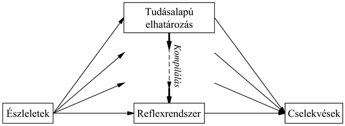

<?xml version="1.0" encoding="UTF-8" standalone="no"?>
<!DOCTYPE html PUBLIC "-//W3C//DTD XHTML 1.1//EN" "http://www.w3.org/TR/xhtml11/DTD/xhtml11.dtd">
<html xmlns="http://www.w3.org/1999/xhtml"><head><meta name="generator" content="DocBook XSL Stylesheets V1.76.1"/></head><body>

<h1 class="title"><a id="id802906"/>Ágensarchitektúrák</h1>

Természetes, ha azt kérdezzük: „Melyik architektúrát alkalmazzam a 2. fejezetben bemutatottak közül?” A válasz: „Mindegyiket!” Láttuk, hogy a reflexszerű válaszok alkalmasak az időkritikus helyzetekben, míg a tudásalapú elhatározás lehetővé teszi, hogy az ágens előre tervezzen. Egy teljes ágensnek egy <strong>hibrid architektúra</strong> (<strong>hybrid architecture</strong>) segítségével képesnek kell lennie mindkettőre. A hibrid architektúra egyik fontos tulajdonsága, hogy a különböző döntési komponensek határa nem rögzített. A <strong>szerkesztés</strong> vagy <strong>kompilálás</strong> (<strong>compilation</strong>) például az elhatározás szintjén megjelenő deklaratív információt folyamatosan hatékonyabb reprezentációkká alakítja át, eljutva végül a reflexszerű szintre (27.2. ábra). (Ez a célja a 19. fejezetben bemutatott magyarázatalapú tanulásnak.) Az olyan rendszereknek, mint a <code class="code">SOAR</code> (Laird és társai, 1987) és a <code class="code">THEO</code> (Mitchell, 1990), pontosan ez a struktúrájuk. Minden alkalommal, amikor explicit elhatározás révén jutnak el egy probléma megoldásáig, a megoldás általánosított verzióját is eltárolják a reflexszerű komponens részére. Ennek a folyamatnak a <em>fordítottját</em> kevésbé tanulmányozták még: a környezet változásakor a megtanult reflexek lehet, hogy többé már nem érvényesek, és az ágensnek vissza kell térnie a tudatos konstrukció szintjére, hogy új viselkedést hozhasson létre.

<a id="id802947"/>
<strong>27.2. ábra - A kompilálás célja a megfontolt (deliberatív) döntéshozatal hatékonyabb, reflexszerű mechanizmussá való átalakítása</strong>

Egy ágensnek saját következtetéseit is az ellenőrzése alá kell tudnia vonni. A következtetést abba kell hagynia, ha cselekvésre van szükség, és a következtetésre rendelkezésre álló időt a legígéretesebb számításokra kell fordítania. Egy taxisofőr ágensnek, például, ha közvetlenül maga előtt balesetet észlel, nem félórák alatt, hanem a másodperc töredéke alatt el kell tudnia dönteni, hogy fékezni fog, vagy inkább kikerüli a balesetet. A másodperc ezen töredékét a legfontosabb kérdések vizsgálatára kell fordítania, hogy balra, illetve jobbra szabad-e a sáv, és nincs-e közvetlenül mögötte egy nagy teherautó, és nem arra, hogy milyen az idő, mennyire kopnak a gumik, vagy hogy hol találja a következő utast. Az ilyen problémákkal a <strong>valós idejű MI</strong> (<strong>real-time AI</strong>) foglalkozik. Ahogy az intelligens rendszerek egyre bonyolultabb tárgyterületekre vonulnak be, minden probléma valós idejűvé válik, hiszen az ágensnek soha nem lesz elegendő ideje arra, hogy a döntési problémát egzakt módon oldja meg.

Világos, hogy sürgető szükség van az általánosabb döntéshozó helyzetekben is működő módszerekre. Az utóbbi időben két kecsegtető módszertan is napvilágot látott. Az első az <strong>akármikor algoritmus</strong>ok (<strong>anytime algorithm</strong>s) alkalmazása (Dean és Boddy, 1988; Horvitz, 1987). Egy akármikor algoritmusnál az algoritmus kimenetének minősége az idő múlásával fokozatosan javul, bármikor szakítjuk is meg tehát az algoritmust, ésszerű döntéshez jutunk. Az ilyen algoritmus vezérlését egy metadöntési eljárás végzi, amely meghatározza, hogy érdemes-e a számításokat tovább folytatni. Az akármikor algoritmusra egy egyszerű példa a kétszemélyes játékoknál ismertetett iteratív mélyítő keresés. Azonban bonyolultabb rendszerek – amelyek számos ilyen, együttesen működő algoritmusból állnak – is konstruálhatók (Zilberstein és Russell, 1996). A másik módszer a <strong>döntéselméleti metakövetkeztetés</strong> (<strong>decision-theoretic metareasoning</strong>) (Horvitz, 1989; Russell és Wefald, 1991; Horvitz és Breese, 1996). Ebben a megközelítésben az információérték elméletét (16. fejezet) a számítások megválasztására használjuk. A számítás értéke mind a költségétől (a késleltetett cselekvés miatt), mind a hasznosságától (a döntés javított minősége miatt) függ. A metakövetkeztetési sémákkal jobb keresési algoritmusokat lehet előállítani, automatikusan garantálva az akármikor tulajdonságot. A metakövetkeztetés természetesen költséges, de a kompilálás arra is felhasználható, hogy a túlmunka költsége eltörpüljön a számítás költsége mellett, lévén hogy a számítás is felügyelt.

A metakövetkeztetés csupán egyik aspektusa az általános <strong>reflektív architektúrá</strong>nak (<strong>reflective architecture</strong>): ezek az architektúrák lehetővé teszik a magán az architektúrán belül keletkező számítási entitások és cselekvések fölötti tudatosságot. A reflektív architektúrák elméleti alapja úgy építhető fel, hogy a környezet állapotából és magának az ágensnek a számítási állapotából álló, közös állapotteret definiálunk. Döntési eljárásokat és tanulási algoritmusokat lehet úgy tervezni, hogy ebben a közös állapottérben működjenek, ezzel segítve és javítva az ágens számítási teljesítményét.

Végső soron azt várjuk, hogy az olyan feladatspecifikus algoritmusok, mint amilyen az alfa-béta keresés és a hátrafelé láncolás, eltűnnek az MI-rendszerekből, továbbá, hogy ezek olyan általános módszerekkel lesznek helyettesíthetők, amelyek az ágens számításait jó minőségű döntések hatékony létrehozása felé irányítják.

</body></html>
